# Tool Execution System

Relevant source files

-   [backend/open\_webui/config.py](https://github.com/open-webui/open-webui/blob/a7271532/backend/open_webui/config.py)
-   [backend/open\_webui/main.py](https://github.com/open-webui/open-webui/blob/a7271532/backend/open_webui/main.py)
-   [backend/open\_webui/retrieval/loaders/datalab\_marker.py](https://github.com/open-webui/open-webui/blob/a7271532/backend/open_webui/retrieval/loaders/datalab_marker.py)
-   [backend/open\_webui/retrieval/loaders/external\_document.py](https://github.com/open-webui/open-webui/blob/a7271532/backend/open_webui/retrieval/loaders/external_document.py)
-   [backend/open\_webui/retrieval/loaders/external\_web.py](https://github.com/open-webui/open-webui/blob/a7271532/backend/open_webui/retrieval/loaders/external_web.py)
-   [backend/open\_webui/retrieval/loaders/main.py](https://github.com/open-webui/open-webui/blob/a7271532/backend/open_webui/retrieval/loaders/main.py)
-   [backend/open\_webui/retrieval/loaders/mineru.py](https://github.com/open-webui/open-webui/blob/a7271532/backend/open_webui/retrieval/loaders/mineru.py)
-   [backend/open\_webui/retrieval/loaders/mistral.py](https://github.com/open-webui/open-webui/blob/a7271532/backend/open_webui/retrieval/loaders/mistral.py)
-   [backend/open\_webui/retrieval/utils.py](https://github.com/open-webui/open-webui/blob/a7271532/backend/open_webui/retrieval/utils.py)
-   [backend/open\_webui/routers/retrieval.py](https://github.com/open-webui/open-webui/blob/a7271532/backend/open_webui/routers/retrieval.py)
-   [backend/open\_webui/utils/middleware.py](https://github.com/open-webui/open-webui/blob/a7271532/backend/open_webui/utils/middleware.py)
-   [src/lib/apis/retrieval/index.ts](https://github.com/open-webui/open-webui/blob/a7271532/src/lib/apis/retrieval/index.ts)
-   [src/lib/components/admin/Settings/Documents.svelte](https://github.com/open-webui/open-webui/blob/a7271532/src/lib/components/admin/Settings/Documents.svelte)
-   [src/lib/components/admin/Settings/WebSearch.svelte](https://github.com/open-webui/open-webui/blob/a7271532/src/lib/components/admin/Settings/WebSearch.svelte)

## Purpose and Scope

The Tool Execution System enables AI models to invoke external functions, execute code, and interact with external services during chat completions. This system provides three primary execution pathways: **function-based tools** (Python code defined in Tools/Functions), **OpenAPI tools** (external HTTP APIs), and **MCP servers** (Model Context Protocol servers). The system handles tool invocation, result processing, and integration of tool outputs back into the conversation context.

For information about the middleware pipeline that orchestrates tool calls, see [Request Processing Flow](/open-webui/open-webui/4.1-chat-component-architecture). For RAG-based document retrieval which operates separately from tools, see [RAG and Knowledge System](/open-webui/open-webui/5-message-rendering).

## Tool Types and Architecture

### Tool Categories

Open WebUI supports three distinct tool execution mechanisms:

| Tool Type | Description | Storage Location | Execution Context |
| --- | --- | --- | --- |
| **Functions** | Python code executed server-side with custom `Tools` class | `app.state.FUNCTIONS` | Backend FastAPI process |
| **OpenAPI Tools** | External HTTP APIs defined via OpenAPI specifications | `app.state.TOOLS` | External HTTP endpoints |
| **MCP Servers** | Model Context Protocol servers providing resources and tools | `TOOL_SERVER_CONNECTIONS` config | External MCP processes |

Sources: [backend/open\_webui/main.py813-817](https://github.com/open-webui/open-webui/blob/a7271532/backend/open_webui/main.py#L813-L817) [backend/open\_webui/utils/middleware.py285-516](https://github.com/open-webui/open-webui/blob/a7271532/backend/open_webui/utils/middleware.py#L285-L516)

### Tool State Management

```mermaid
flowchart TD
    TOOLS["app.state.TOOLS(dict)"]
    TOOL_CONTENTS["app.state.TOOL_CONTENTS(dict)"]
    FUNCTIONS["app.state.FUNCTIONS(dict)"]
    FUNCTION_CONTENTS["app.state.FUNCTION_CONTENTS(dict)"]
    TOOL_SERVERS["app.state.TOOL_SERVERS(list)"]
    TOOL_SERVER_CONNECTIONS["TOOL_SERVER_CONNECTIONSconfig"]
    get_tools["get_tools()"]
    tool_spec["Tool Specification{name, spec, callable, type}"]
    chat_completion_tools_handler["chat_completion_tools_handler()"]
    tool_call_handler["tool_call_handler()"]
    event_caller["event_caller()(execute:tool)"]

    TOOL --> SERVER_CONNECTIONS_TOOL_SERVERS
    TOOLS --> get_tools
    FUNCTIONS --> get_tools
    TOOL --> SERVERS_get_tools
    get --> tools_tool_spec
    tool --> spec_chat_completion_tools_handler
    chat --> completion_tools_handler_tool_call_handler
    tool --> call_handler_event_caller
```


**Diagram: Tool State Architecture and Registry**

The system maintains separate dictionaries for tools and functions in the application state. At runtime, `get_tools()` consolidates these into a unified tool registry with specifications compatible with OpenAI function calling.

Sources: [backend/open\_webui/main.py813-817](https://github.com/open-webui/open-webui/blob/a7271532/backend/open_webui/main.py#L813-L817) [backend/open\_webui/utils/middleware.py285-516](https://github.com/open-webui/open-webui/blob/a7271532/backend/open_webui/utils/middleware.py#L285-L516) [backend/open\_webui/utils/tools.py](https://github.com/open-webui/open-webui/blob/a7271532/backend/open_webui/utils/tools.py)

## Tool Invocation Flow

### Function Calling Generation

The tool execution system uses a two-phase approach: first generating tool calls via a task model, then executing the selected tools.

> **[Mermaid sequence]**
> *(图表结构无法解析)*

**Diagram: Tool Invocation Sequence**

The system uses `TOOLS_FUNCTION_CALLING_PROMPT_TEMPLATE` to instruct the task model to generate tool calls. The template includes tool specifications and chat history, producing structured JSON with tool names and parameters.

Sources: [backend/open\_webui/utils/middleware.py285-360](https://github.com/open-webui/open-webui/blob/a7271532/backend/open_webui/utils/middleware.py#L285-L360) [backend/open\_webui/utils/middleware.py368-502](https://github.com/open-webui/open-webui/blob/a7271532/backend/open_webui/utils/middleware.py#L368-L502)

### Tool Call Handler Implementation

The core tool invocation logic resides in the `tool_call_handler` async function within `chat_completion_tools_handler`:


**Diagram: Tool Call Handler Control Flow**

The handler validates tool existence, filters parameters against the tool's specification, invokes either direct tools (via event system) or callable functions, processes results, and injects outputs into the conversation context.

Sources: [backend/open\_webui/utils/middleware.py368-495](https://github.com/open-webui/open-webui/blob/a7271532/backend/open_webui/utils/middleware.py#L368-L495)

## Tool Result Processing

### Result Type Handling

The `process_tool_result` function handles diverse output formats from tools:

```mermaid
flowchart TD
    tool_result["tool_result(raw output)"]
    check_html["isinstanceHTMLResponse?"]
    check_disposition["Content-Disposition== 'inline'?"]
    extract_html["Extract HTML bodyAdd to tool_result_embeds"]
    decode_body["Decode body as string"]
    check_tuple["tool_type=='external'&& tuple?"]
    unpack["Unpack (result, headers)"]
    check_inline["headersContent-Disposition== 'inline'?"]
    check_content_type["Content-Type?"]
    add_iframe["Add to tool_result_embeds(iframe content)"]
    add_location["Add location to embeds"]
    check_list["isinstancelist?"]
    check_mcp["tool_type== 'mcp'?"]
    process_mcp["Process MCP items{type: text/image/audio}"]
    extract_mcp_files["Extract image/audioas tool_result_files"]
    process_openapi["Process OpenAPI itemsExtract data: URLs"]
    extract_openapi_files["Add to tool_result_files"]
    jsonify["dict or list?"]
    json_dumps["json.dumps()indent=2"]
    to_string["Convert to string"]
    return_tuple["Return (tool_result,tool_result_files,tool_result_embeds)"]

    tool --> result_check_html
    check --> html_check_disposition
    check --> disposition_extract_html
    check --> disposition_decode_body
    check --> html_check_tuple
    check --> tuple_unpack
    unpack --> check_inline
    check --> inline_check_content_type
    check --> content_type_add_iframe
    check --> content_type_add_location
    check --> tuple_check_list
    check --> list_check_mcp
    check --> mcp_process_mcp
    process --> mcp_extract_mcp_files
    check --> mcp_process_openapi
    process --> openapi_extract_openapi_files
    check --> list_jsonify
    jsonify --> json_dumps
    jsonify --> to_string
    extract --> html_return_tuple
    decode --> body_return_tuple
    add --> iframe_return_tuple
    add --> location_return_tuple
    extract --> mcp_files_return_tuple
    extract --> openapi_files_return_tuple
    json --> dumps_return_tuple
    to --> string_return_tuple
```


**Diagram: Tool Result Processing Pipeline**

The function handles HTMLResponse objects, tuples with headers (for external tools), MCP-formatted responses, and converts complex objects to JSON strings for injection into the conversation.

Sources: [backend/open\_webui/utils/middleware.py142-282](https://github.com/open-webui/open-webui/blob/a7271532/backend/open_webui/utils/middleware.py#L142-L282)

### Result Integration

Tool results are integrated into the chat flow through three mechanisms:

| Integration Type | Purpose | Event Type | Storage |
| --- | --- | --- | --- |
| **Files** | Images, audio, data URLs | `{type: 'files', data: {files: []}}` | Displayed inline in chat |
| **Embeds** | HTML/iframe content | `{type: 'embeds', data: {embeds: []}}` | Rendered as embedded UI |
| **Sources** | Citation context | Added to `sources[]` array | Used for RAG-style citations |
| **User Message** | Text output | Appended via `add_or_update_user_message()` | Injected into message context |

The `skip_files` flag is set when a tool declares `file_handler = True` in its metadata, preventing default file handling for tools that manage files themselves.

Sources: [backend/open\_webui/utils/middleware.py430-495](https://github.com/open-webui/open-webui/blob/a7271532/backend/open_webui/utils/middleware.py#L430-L495)

## Code Execution Engines

### Client-Side: Pyodide Worker

Browser-based Python execution uses a Web Worker running Pyodide:

```mermaid
flowchart TD
    CodeBlock["CodeBlock.svelteexecutePython()"]
    PyodideWorker_Instance["PyodideWorker(Web Worker)"]
    worker_onmessage["worker.onmessage"]
    loadPyodideAndPackages["loadPyodideAndPackages()"]
    loadPyodide_fn["loadPyodide()indexURL: /pyodide/"]
    micropip["micropip.install()(packages)"]
    pyodide_run["pyodide.runPythonAsync()"]
    stdout_capture["stdout callbackself.stdout += text"]
    stderr_capture["stderr callbackself.stderr += text"]
    detect_packages["Detect imports(requests, numpy, pandas, etc.)"]
    create_worker["new PyodideWorker()"]
    post_message["postMessage{id, code, packages}"]
    matplotlib_override["code.includes('matplotlib')?"]
    override_show["Override plt.show()Convert to base64"]
    process_result["processResult()Recursive serialization"]
    post_response["postMessage{id, result, stdout, stderr}"]
    onmessage["pyodideWorker.onmessage"]
    extract_output["Extract stdout, stderr, result"]
    extract_images["Extract data:image/png URLs"]
    display["Display in CodeBlock"]

    CodeBlock --> detect_packages
    detect --> packages_create_worker
    create --> worker_post_message
    post --> message_worker_onmessage
    worker --> onmessage_loadPyodideAndPackages
    loadPyodideAndPackages --> loadPyodide_fn
    loadPyodide --> fn_stdout_capture
    loadPyodide --> fn_stderr_capture
    loadPyodide --> fn_micropip
    micropip --> matplotlib_override
    matplotlib --> override_override_show
    matplotlib --> override_pyodide_run
    override --> show_pyodide_run
    pyodide --> run_process_result
    process --> result_post_response
    post --> response_PyodideWorker_Instance
    PyodideWorker --> Instance_onmessage
    onmessage --> extract_output
    extract --> output_extract_images
    extract --> images_display
```


**Diagram: Pyodide Worker Execution Flow**

The worker loads Pyodide with a configurable set of packages detected from import statements. For matplotlib plots, the system overrides `plt.show()` to capture base64-encoded PNG images instead of attempting to display in the worker context.

Sources: [src/lib/workers/pyodide.worker.ts1-167](https://github.com/open-webui/open-webui/blob/a7271532/src/lib/workers/pyodide.worker.ts#L1-L167) [src/lib/components/chat/Messages/CodeBlock.svelte139-329](https://github.com/open-webui/open-webui/blob/a7271532/src/lib/components/chat/Messages/CodeBlock.svelte#L139-L329)

### Server-Side: Jupyter Kernel

For server-side execution, the system can use a Jupyter kernel:

```mermaid
flowchart TD
    CodeBlock_Jupyter["CodeBlock.svelte$config.code.engine === 'jupyter'"]
    executeCode_endpoint["/api/utils/codePOST"]
    execute_code_jupyter["execute_code_jupyter()"]
    KernelManager["Jupyter Kernel Manager"]
    Kernel["Python Kernel"]
    executeCode_api["executeCode(token, code)"]
    auth_check["Auth configured?"]
    basic_auth["HTTPBasicAuth"]
    bearer_auth["Authorization: token"]
    no_auth["No auth"]
    create_session["POST /api/sessions"]
    execute_request["POST /api/kernels/{id}/execute"]
    wait_completion["Poll until status != 'busy'"]
    collect_outputs["Collect outputs{stdout, result, stderr}"]
    cleanup["DELETE /api/kernels/{id}"]
    return_response["Return {stdout, result, stderr}"]

    CodeBlock --> Jupyter_executeCode_api
    executeCode --> api_executeCode_endpoint
    executeCode --> endpoint_execute_code_jupyter
    execute --> code_jupyter_auth_check
    auth --> check_basic_auth
    auth --> check_bearer_auth
    auth --> check_no_auth
    basic --> auth_create_session
    bearer --> auth_create_session
    no --> auth_create_session
    create --> session_KernelManager
    KernelManager --> Kernel
    Kernel --> execute_request
    execute --> request_wait_completion
    wait --> completion_collect_outputs
    collect --> outputs_cleanup
    cleanup --> return_response
    return --> response_CodeBlock_Jupyter
```


**Diagram: Jupyter Kernel Execution Flow**

The Jupyter execution path creates a temporary kernel session, executes code, polls for completion, collects outputs (including display data), and cleans up the kernel.

Sources: [backend/open\_webui/utils/code\_interpreter.py](https://github.com/open-webui/open-webui/blob/a7271532/backend/open_webui/utils/code_interpreter.py) [src/lib/components/chat/Messages/CodeBlock.svelte146-217](https://github.com/open-webui/open-webui/blob/a7271532/src/lib/components/chat/Messages/CodeBlock.svelte#L146-L217)

### Configuration

Code execution is configured via environment variables and runtime config:

| Configuration | Environment Variable | Config Path | Default |
| --- | --- | --- | --- |
| Enable Code Execution | `ENABLE_CODE_EXECUTION` | `app.state.config.ENABLE_CODE_EXECUTION` | `true` |
| Execution Engine | `CODE_EXECUTION_ENGINE` | `app.state.config.CODE_EXECUTION_ENGINE` | `"pyodide"` |
| Jupyter URL | `CODE_EXECUTION_JUPYTER_URL` | `app.state.config.CODE_EXECUTION_JUPYTER_URL` | `""` |
| Jupyter Auth | `CODE_EXECUTION_JUPYTER_AUTH` | `app.state.config.CODE_EXECUTION_JUPYTER_AUTH` | `""` |
| Jupyter Auth Token | `CODE_EXECUTION_JUPYTER_AUTH_TOKEN` | `app.state.config.CODE_EXECUTION_JUPYTER_AUTH_TOKEN` | `""` |
| Jupyter Auth Password | `CODE_EXECUTION_JUPYTER_AUTH_PASSWORD` | `app.state.config.CODE_EXECUTION_JUPYTER_AUTH_PASSWORD` | `""` |
| Jupyter Timeout | `CODE_EXECUTION_JUPYTER_TIMEOUT` | `app.state.config.CODE_EXECUTION_JUPYTER_TIMEOUT` | `60` |

Sources: [backend/open\_webui/main.py131-145](https://github.com/open-webui/open-webui/blob/a7271532/backend/open_webui/main.py#L131-L145) [backend/open\_webui/main.py1049-1071](https://github.com/open-webui/open-webui/blob/a7271532/backend/open_webui/main.py#L1049-L1071)

## Tool Server Integration

### MCP (Model Context Protocol)

MCP servers provide tools and resources via a standardized protocol. The system maintains connections to configured MCP servers:

```mermaid
flowchart TD
    TOOL_SERVER_CONNECTIONS["TOOL_SERVER_CONNECTIONSenv variable"]
    TOOL_SERVERS["app.state.TOOL_SERVERSlist of server configs"]
    get_tools_fn["get_tools()"]
    MCPClient["MCPClient(per server)"]
    event_caller_mcp["event_caller(){type: 'execute:tool',server: {...}}"]
    execute_mcp["Execute on MCP server"]
    parse_json["Parse JSON array"]
    iterate_servers["For each server in TOOL_SERVERS"]
    list_tools["list_tools()"]
    tool_specs["Generate tool specs{name, spec, direct=True,server: {...}}"]
    registry["Add to tools registry"]
    chat_completion_tools_handler["chat_completion_tools_handler"]
    tool_detected["Tool selected& direct=True?"]
    mcp_result["MCP result[{type, text/data}]"]
    process_tool_result["process_tool_result()Extract text, images, audio"]

    TOOL --> SERVER_CONNECTIONS_parse_json
    parse --> json_TOOL_SERVERS
    TOOL --> SERVERS_get_tools_fn
    get --> tools_fn_iterate_servers
    iterate --> servers_MCPClient
    MCPClient --> list_tools
    list --> tools_tool_specs
    tool --> specs_registry
    registry --> chat_completion_tools_handler
    chat --> completion_tools_handler_tool_detected
    tool --> detected_event_caller_mcp
    event --> caller_mcp_execute_mcp
    execute --> mcp_mcp_result
    mcp --> result_process_tool_result
```


**Diagram: MCP Server Integration Architecture**

MCP servers are configured via `TOOL_SERVER_CONNECTIONS` as a JSON array. Each server provides tools that are registered with `direct=True`, meaning they're invoked via the event system rather than direct callable functions.

Sources: [backend/open\_webui/main.py700-702](https://github.com/open-webui/open-webui/blob/a7271532/backend/open_webui/main.py#L700-L702) [backend/open\_webui/utils/middleware.py399-410](https://github.com/open-webui/open-webui/blob/a7271532/backend/open_webui/utils/middleware.py#L399-L410)

### MCP Result Processing

MCP tools return results in a structured format that requires special processing:

```
# Example MCP result structure
[
    {"type": "text", "text": "Result content"},
    {"type": "image", "mimeType": "image/png", "data": "base64..."},
    {"type": "audio", "mimeType": "audio/wav", "blob": "base64..."}
]
```
The `process_tool_result` function handles MCP results by:

1.  Iterating through the list of result items
2.  Extracting text items (attempting JSON parsing if applicable)
3.  Converting image/audio items to file URLs via `get_file_url_from_base64`
4.  Building `tool_result_files` array with type and URL for each media item

Sources: [backend/open\_webui/utils/middleware.py233-264](https://github.com/open-webui/open-webui/blob/a7271532/backend/open_webui/utils/middleware.py#L233-L264)

## OpenAPI Tool Integration

### OpenAPI Tool Loading

OpenAPI tools are defined via OpenAPI specifications and stored in the tools registry:

```mermaid
flowchart TD
    openapi_spec["OpenAPI Specification(JSON/YAML)"]
    tool_metadata["Tool Metadata{id, name, meta}"]
    parse_openapi["Parse OpenAPI spec"]
    extract_operations["Extract operations(paths + methods)"]
    generate_specs["Generate function specsfor each operation"]
    TOOLS_dict["app.state.TOOLS[tool_id]"]
    TOOL_CONTENTS_dict["app.state.TOOL_CONTENTS[tool_id]"]
    get_tools_fn["get_tools()"]
    update_spec["get_updated_tool_function()Modify spec for filtering"]
    tools_registry["tools = {}{name: {spec, callable, type}}"]
    iterate_tools["For each tool in TOOLS"]
    add_to_registry["Add to tools_registry"]
    return_tools["Return tools dict"]

    openapi --> spec_parse_openapi
    parse --> openapi_extract_operations
    extract --> operations_generate_specs
    generate --> specs_TOOLS_dict
    tool --> metadata_TOOL_CONTENTS_dict
    TOOLS --> dict_get_tools_fn
    TOOL --> CONTENTS_dict_get_tools_fn
    get --> tools_fn_iterate_tools
    iterate --> tools_update_spec
    update --> spec_add_to_registry
    add --> to_registry_tools_registry
    tools --> registry_return_tools
```


**Diagram: OpenAPI Tool Registration Flow**

OpenAPI tools are stored as dictionaries mapping tool IDs to their specifications. The `get_tools()` function processes these specs and adds callable functions that execute HTTP requests to the OpenAPI endpoints.

Sources: [backend/open\_webui/utils/tools.py](https://github.com/open-webui/open-webui/blob/a7271532/backend/open_webui/utils/tools.py) [backend/open\_webui/main.py813-817](https://github.com/open-webui/open-webui/blob/a7271532/backend/open_webui/main.py#L813-L817)

### External Tool Invocation

OpenAPI tools execute via HTTP requests to external endpoints. The tool callable function:

1.  Constructs HTTP request from OpenAPI spec and parameters
2.  Executes request to external endpoint
3.  Returns response body and headers as a tuple
4.  `process_tool_result` handles the tuple to extract inline content

When a tool returns headers with `Content-Disposition: inline`, the response is treated as embeddable content (HTML iframe or location redirect).

Sources: [backend/open\_webui/utils/middleware.py186-229](https://github.com/open-webui/open-webui/blob/a7271532/backend/open_webui/utils/middleware.py#L186-L229)

## Tool Access Control

Tools support fine-grained access control through the `access_control` field:

```mermaid
flowchart TD
    tool["Tool/Function"]
    access_control["access_control{read: {}, write: {}}"]
    has_access_fn["has_access()(user, tool.access_control, 'read')"]
    check_role["User role?"]
    check_user_id["User ID inuser_ids?"]
    check_group["User groupsintersectgroup_ids?"]
    get_tools_fn["get_tools(user)"]
    filter_tools["Filter by access_control"]
    filtered_registry["Filtered tools registry"]
    allow["Allow"]
    deny["Deny"]

    tool --> access_control
    access --> control_has_access_fn
    has --> access_fn_check_role
    check --> role_allow
    check --> role_check_user_id
    check --> user_id_allow
    check --> user_id_check_group
    check --> group_allow
    check --> group_deny
    get --> tools_fn_filter_tools
    filter --> tools_has_access_fn
    has --> access_fn_filtered_registry
```


**Diagram: Tool Access Control Flow**

The `get_tools()` function filters tools based on user permissions. Only tools where the user has 'read' access are included in the registry returned to the tool execution system.

Sources: [backend/open\_webui/utils/tools.py](https://github.com/open-webui/open-webui/blob/a7271532/backend/open_webui/utils/tools.py) [backend/open\_webui/utils/access\_control.py](https://github.com/open-webui/open-webui/blob/a7271532/backend/open_webui/utils/access_control.py)

## Error Handling and Retry Logic

The tool execution system includes comprehensive error handling:

| Error Type | Handling Strategy | Result |
| --- | --- | --- |
| **Tool not found** | Skip tool call | Return empty `body, {}` |
| **Invalid parameters** | Filter params by spec | Only pass allowed parameters |
| **Execution exception** | Catch and convert to string | `tool_result = str(e)` |
| **HTML parsing error** | Decode as UTF-8 string | Fallback to text content |
| **JSON parsing error** | Return raw response | Include in tool result as-is |

For code execution specifically:

-   **Pyodide timeout**: 60-second limit, terminates worker
-   **Jupyter timeout**: Configurable via `CODE_EXECUTION_JUPYTER_TIMEOUT`
-   **Import errors**: Captured in stderr, displayed to user

Sources: [backend/open\_webui/utils/middleware.py415-416](https://github.com/open-webui/open-webui/blob/a7271532/backend/open_webui/utils/middleware.py#L415-L416) [src/lib/components/chat/Messages/CodeBlock.svelte247-253](https://github.com/open-webui/open-webui/blob/a7271532/src/lib/components/chat/Messages/CodeBlock.svelte#L247-L253)
