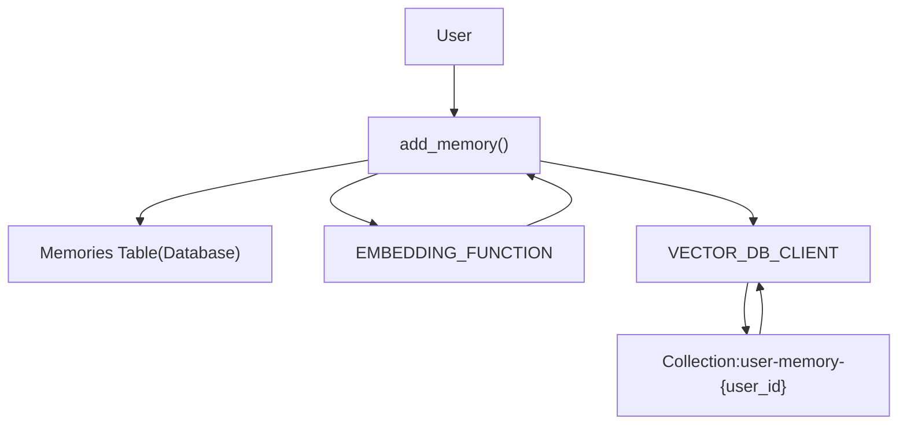
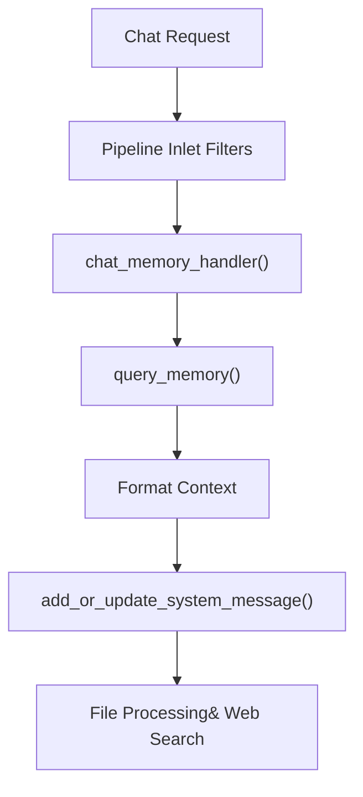
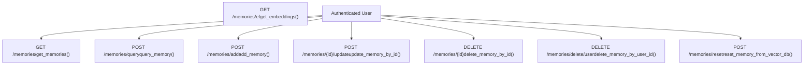
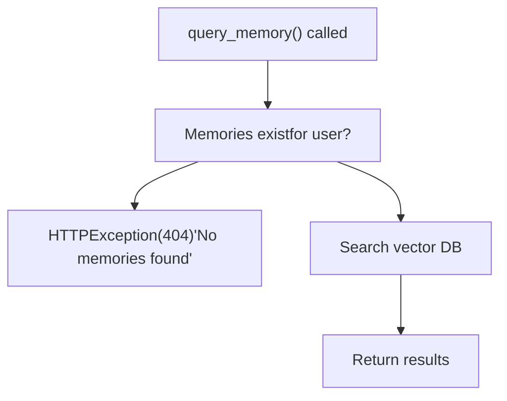

# Memory and Context Management

Relevant source files

-   [backend/open\_webui/config.py](https://github.com/open-webui/open-webui/blob/a7271532/backend/open_webui/config.py)
-   [backend/open\_webui/main.py](https://github.com/open-webui/open-webui/blob/a7271532/backend/open_webui/main.py)
-   [backend/open\_webui/retrieval/loaders/datalab\_marker.py](https://github.com/open-webui/open-webui/blob/a7271532/backend/open_webui/retrieval/loaders/datalab_marker.py)
-   [backend/open\_webui/retrieval/loaders/external\_document.py](https://github.com/open-webui/open-webui/blob/a7271532/backend/open_webui/retrieval/loaders/external_document.py)
-   [backend/open\_webui/retrieval/loaders/external\_web.py](https://github.com/open-webui/open-webui/blob/a7271532/backend/open_webui/retrieval/loaders/external_web.py)
-   [backend/open\_webui/retrieval/loaders/main.py](https://github.com/open-webui/open-webui/blob/a7271532/backend/open_webui/retrieval/loaders/main.py)
-   [backend/open\_webui/retrieval/loaders/mineru.py](https://github.com/open-webui/open-webui/blob/a7271532/backend/open_webui/retrieval/loaders/mineru.py)
-   [backend/open\_webui/retrieval/loaders/mistral.py](https://github.com/open-webui/open-webui/blob/a7271532/backend/open_webui/retrieval/loaders/mistral.py)
-   [backend/open\_webui/retrieval/utils.py](https://github.com/open-webui/open-webui/blob/a7271532/backend/open_webui/retrieval/utils.py)
-   [backend/open\_webui/routers/retrieval.py](https://github.com/open-webui/open-webui/blob/a7271532/backend/open_webui/routers/retrieval.py)
-   [backend/open\_webui/utils/middleware.py](https://github.com/open-webui/open-webui/blob/a7271532/backend/open_webui/utils/middleware.py)
-   [src/lib/apis/retrieval/index.ts](https://github.com/open-webui/open-webui/blob/a7271532/src/lib/apis/retrieval/index.ts)
-   [src/lib/components/admin/Settings/Documents.svelte](https://github.com/open-webui/open-webui/blob/a7271532/src/lib/components/admin/Settings/Documents.svelte)
-   [src/lib/components/admin/Settings/WebSearch.svelte](https://github.com/open-webui/open-webui/blob/a7271532/src/lib/components/admin/Settings/WebSearch.svelte)

## Purpose and Scope

This document describes the memory and context management system within Open WebUI's backend middleware pipeline. The system enables personalized conversations by storing and retrieving relevant past interactions for each user, then automatically injecting them as context into LLM prompts.

For information about the overall middleware pipeline stages, see [Backend Middleware Pipeline](/open-webui/open-webui/4-chat-system). For RAG-based document retrieval, see [RAG and Knowledge System](/open-webui/open-webui/5-message-rendering).

## Memory Storage Architecture

The memory system maintains a dual-storage architecture: structured data in the relational database and vector embeddings in a dedicated vector database collection per user.

### Memory Storage Flow


**Sources:** [backend/open\_webui/routers/memories.py47-69](https://github.com/open-webui/open-webui/blob/a7271532/backend/open_webui/routers/memories.py#L47-L69) [backend/open\_webui/models/memories.py](https://github.com/open-webui/open-webui/blob/a7271532/backend/open_webui/models/memories.py)

### Storage Components

| Component | Implementation | Purpose |
| --- | --- | --- |
| `Memories` Database Table | SQLAlchemy Model | Persistent storage of memory text and metadata |
| `VECTOR_DB_CLIENT` | Vector database abstraction | Stores embeddings for semantic search |
| Collection Naming | `user-memory-{user.id}` | Per-user memory isolation |
| `EMBEDDING_FUNCTION` | Configurable embedding model | Converts text to vectors |

The database stores the raw memory content along with timestamps (`created_at`, `updated_at`), while the vector database stores the embedded representation for efficient semantic search. Each user has a dedicated collection identified by their user ID.

**Sources:** [backend/open\_webui/routers/memories.py56-67](https://github.com/open-webui/open-webui/blob/a7271532/backend/open_webui/routers/memories.py#L56-L67) [backend/open\_webui/retrieval/vector/factory.py](https://github.com/open-webui/open-webui/blob/a7271532/backend/open_webui/retrieval/vector/factory.py)

## Memory Retrieval System

The retrieval system uses semantic search to find relevant past interactions based on the current conversation context.

### Retrieval Flow Diagram

> **[Mermaid sequence]**
> *(图表结构无法解析)*

**Sources:** [backend/open\_webui/routers/memories.py82-98](https://github.com/open-webui/open-webui/blob/a7271532/backend/open_webui/routers/memories.py#L82-L98) [backend/open\_webui/utils/middleware.py530-566](https://github.com/open-webui/open-webui/blob/a7271532/backend/open_webui/utils/middleware.py#L530-L566)

### Query Memory Function

The `query_memory` function in [backend/open\_webui/routers/memories.py82-98](https://github.com/open-webui/open-webui/blob/a7271532/backend/open_webui/routers/memories.py#L82-L98) implements the retrieval logic:

```
class QueryMemoryForm(BaseModel):
    content: str
    k: Optional[int] = 1
```
The function performs these steps:

1.  Validates user has memories in the database
2.  Generates embedding for the query content using `EMBEDDING_FUNCTION`
3.  Performs vector search with `VECTOR_DB_CLIENT.search()`
4.  Returns top `k` results with metadata

The vector search returns a structured result containing:

-   `ids`: Memory IDs from the database
-   `metadatas`: Associated metadata (created\_at, updated\_at)
-   `documents`: Original memory text
-   `distances`: Similarity scores

**Sources:** [backend/open\_webui/routers/memories.py77-98](https://github.com/open-webui/open-webui/blob/a7271532/backend/open_webui/routers/memories.py#L77-L98)

## Context Injection Pipeline

The memory system integrates into the middleware pipeline through the `chat_memory_handler`, which automatically augments prompts with relevant past context.

### Middleware Integration Flow


**Sources:** [backend/open\_webui/utils/middleware.py530-566](https://github.com/open-webui/open-webui/blob/a7271532/backend/open_webui/utils/middleware.py#L530-L566) [backend/open\_webui/utils/middleware.py1-2000](https://github.com/open-webui/open-webui/blob/a7271532/backend/open_webui/utils/middleware.py#L1-L2000)

### Memory Handler Implementation

The `chat_memory_handler` function [backend/open\_webui/utils/middleware.py530-566](https://github.com/open-webui/open-webui/blob/a7271532/backend/open_webui/utils/middleware.py#L530-L566) implements context injection:

```
async def chat_memory_handler(
    request: Request, form_data: dict, extra_params: dict, user
):
```
**Processing steps:**

1.  **Memory Query** - Calls `query_memory` with:

    -   `content`: Last user message from `form_data["messages"]`
    -   `k`: 3 (retrieves top 3 relevant memories)
2.  **Context Formatting** - Iterates through results:

    ```
    for doc_idx, doc in enumerate(results.documents[0]):
        created_at_date = time.strftime("%Y-%m-%d", ...)
        user_context += f"{doc_idx + 1}. [{created_at_date}] {doc}\n"
    ```

3.  **System Message Injection** - Uses `add_or_update_system_message`:

    ```
    form_data["messages"] = add_or_update_system_message(
        f"User Context:\n{user_context}\n",
        form_data["messages"],
        append=True
    )
    ```


The context is appended to existing system messages with a clear "User Context:" prefix and numbered entries with timestamps.

**Sources:** [backend/open\_webui/utils/middleware.py530-566](https://github.com/open-webui/open-webui/blob/a7271532/backend/open_webui/utils/middleware.py#L530-L566)

### Context Format Example

When memories are retrieved, they are formatted as:

```
User Context:
1. [2024-01-15] User prefers technical explanations
2. [2024-01-20] Working on a Python project using FastAPI
3. [2024-01-22] Interested in vector databases
```
This format provides temporal context and allows the LLM to understand the recency and relevance of each memory.

**Sources:** [backend/open\_webui/utils/middleware.py548-560](https://github.com/open-webui/open-webui/blob/a7271532/backend/open_webui/utils/middleware.py#L548-L560)

## Memory Management API

The system provides a comprehensive REST API for managing user memories, implemented in the `memories` router.

### API Endpoints Overview


**Sources:** [backend/open\_webui/routers/memories.py1-213](https://github.com/open-webui/open-webui/blob/a7271532/backend/open_webui/routers/memories.py#L1-L213)

### Core API Functions

| Endpoint | Function | Description |
| --- | --- | --- |
| `GET /memories/` | `get_memories()` | Returns all memories for authenticated user |
| `POST /memories/add` | `add_memory()` | Creates new memory with embedding |
| `POST /memories/query` | `query_memory()` | Semantic search in user's memories |
| `POST /memories/{memory_id}/update` | `update_memory_by_id()` | Updates memory content and re-embeds |
| `DELETE /memories/{memory_id}` | `delete_memory_by_id()` | Deletes memory from both storages |
| `DELETE /memories/delete/user` | `delete_memory_by_user_id()` | Removes all user memories |
| `POST /memories/reset` | `reset_memory_from_vector_db()` | Rebuilds vector DB from database |

**Sources:** [backend/open\_webui/routers/memories.py29-213](https://github.com/open-webui/open-webui/blob/a7271532/backend/open_webui/routers/memories.py#L29-L213)

### Add Memory Operation

The add operation [backend/open\_webui/routers/memories.py47-69](https://github.com/open-webui/open-webui/blob/a7271532/backend/open_webui/routers/memories.py#L47-L69) performs synchronized writes:

```
@router.post("/add", response_model=Optional[MemoryModel])
async def add_memory(
    request: Request,
    form_data: AddMemoryForm,
    user=Depends(get_verified_user),
):
```
**Synchronization steps:**

1.  Insert into database: `Memories.insert_new_memory(user.id, content)`
2.  Generate embedding: `await request.app.state.EMBEDDING_FUNCTION(memory.content, user=user)`
3.  Upsert to vector DB: `VECTOR_DB_CLIENT.upsert(collection_name, items=[...])`

The vector DB item includes:

-   `id`: Database memory ID (ensures consistency)
-   `text`: Memory content
-   `vector`: Generated embedding
-   `metadata`: `created_at` timestamp

**Sources:** [backend/open\_webui/routers/memories.py47-69](https://github.com/open-webui/open-webui/blob/a7271532/backend/open_webui/routers/memories.py#L47-L69)

### Update Memory Operation

Updates maintain consistency by re-embedding and updating both storages [backend/open\_webui/routers/memories.py163-194](https://github.com/open-webui/open-webui/blob/a7271532/backend/open_webui/routers/memories.py#L163-L194):

```
@router.post("/{memory_id}/update", response_model=Optional[MemoryModel])
async def update_memory_by_id(
    memory_id: str,
    request: Request,
    form_data: MemoryUpdateModel,
    user=Depends(get_verified_user),
):
```
The function:

1.  Updates database: `Memories.update_memory_by_id_and_user_id()`
2.  If content changed, regenerates embedding
3.  Updates vector DB with new embedding and `updated_at` metadata

**Sources:** [backend/open\_webui/routers/memories.py163-194](https://github.com/open-webui/open-webui/blob/a7271532/backend/open_webui/routers/memories.py#L163-L194)

### Reset Memory Operation

The reset operation [backend/open\_webui/routers/memories.py104-136](https://github.com/open-webui/open-webui/blob/a7271532/backend/open_webui/routers/memories.py#L104-L136) rebuilds the vector database from the authoritative database source:

```
@router.post("/reset", response_model=bool)
async def reset_memory_from_vector_db(
    request: Request, user=Depends(get_verified_user)
):
```
**Rebuild process:**

1.  Delete existing collection: `VECTOR_DB_CLIENT.delete_collection()`
2.  Fetch all memories from database: `Memories.get_memories_by_user_id()`
3.  Generate embeddings in parallel using `asyncio.gather()`
4.  Bulk upsert to vector DB with all memories

This operation is useful for:

-   Recovery from vector DB corruption
-   Migration to new embedding models
-   Synchronization after manual database changes

**Sources:** [backend/open\_webui/routers/memories.py104-136](https://github.com/open-webui/open-webui/blob/a7271532/backend/open_webui/routers/memories.py#L104-L136)

## Vector Database Integration

The memory system uses the abstracted `VECTOR_DB_CLIENT` for all vector operations, supporting multiple backend implementations.

### Vector Client Operations

| Operation | Method | Purpose |
| --- | --- | --- |
| Store/Update | `VECTOR_DB_CLIENT.upsert()` | Add or update memory vectors |
| Search | `VECTOR_DB_CLIENT.search()` | Semantic similarity search |
| Delete | `VECTOR_DB_CLIENT.delete()` | Remove specific memories |
| Reset | `VECTOR_DB_CLIENT.delete_collection()` | Clear all user memories |

The client handles:

-   Collection creation on first upsert
-   Index management for efficient search
-   Batch operations for bulk updates
-   Distance metric calculations (cosine similarity)

**Sources:** [backend/open\_webui/retrieval/vector/factory.py](https://github.com/open-webui/open-webui/blob/a7271532/backend/open_webui/retrieval/vector/factory.py) [backend/open\_webui/routers/memories.py56-67](https://github.com/open-webui/open-webui/blob/a7271532/backend/open_webui/routers/memories.py#L56-L67)

## Embedding Function Configuration

The `EMBEDDING_FUNCTION` is configured at application startup and supports multiple backends:

### Supported Embedding Engines

| Engine | Configuration | Use Case |
| --- | --- | --- |
| Local (SentenceTransformers) | `RAG_EMBEDDING_ENGINE=""` | Self-hosted, privacy-focused |
| OpenAI | `RAG_EMBEDDING_ENGINE="openai"` | High-quality embeddings |
| Ollama | `RAG_EMBEDDING_ENGINE="ollama"` | Local LLM embeddings |
| Azure OpenAI | `RAG_EMBEDDING_ENGINE="azure_openai"` | Enterprise deployments |

The embedding function is initialized in [backend/open\_webui/main.py1005-1033](https://github.com/open-webui/open-webui/blob/a7271532/backend/open_webui/main.py#L1005-L1033) and used consistently across all memory operations to ensure vector compatibility.

**Configuration example:**

```
app.state.EMBEDDING_FUNCTION = get_embedding_function(
    app.state.config.RAG_EMBEDDING_ENGINE,
    app.state.config.RAG_EMBEDDING_MODEL,
    embedding_function=app.state.ef,
    url=...,
    key=...,
    embedding_batch_size=...,
)
```
**Sources:** [backend/open\_webui/main.py1005-1033](https://github.com/open-webui/open-webui/blob/a7271532/backend/open_webui/main.py#L1005-L1033) [backend/open\_webui/config.py885-906](https://github.com/open-webui/open-webui/blob/a7271532/backend/open_webui/config.py#L885-L906)

## Memory Query Parameters

The memory system uses configurable parameters for retrieval optimization:

### Query Configuration

| Parameter | Default | Purpose | Location |
| --- | --- | --- | --- |
| `k` | 3 | Number of memories to retrieve | `chat_memory_handler` |
| `content` | Last user message | Query text for semantic search | `QueryMemoryForm` |
| Collection name | `user-memory-{user.id}` | User-specific isolation | Vector DB operations |

The `k=3` default in [backend/open\_webui/utils/middleware.py539](https://github.com/open-webui/open-webui/blob/a7271532/backend/open_webui/utils/middleware.py#L539-L539) balances context richness with prompt length constraints. This can be adjusted based on:

-   Model context window size
-   Memory relevance threshold
-   Application-specific requirements

**Sources:** [backend/open\_webui/utils/middleware.py534-541](https://github.com/open-webui/open-webui/blob/a7271532/backend/open_webui/utils/middleware.py#L534-L541) [backend/open\_webui/routers/memories.py77-79](https://github.com/open-webui/open-webui/blob/a7271532/backend/open_webui/routers/memories.py#L77-L79)

## Error Handling and Edge Cases

The memory system includes robust error handling for common scenarios:

### Memory Not Found Handling


**Sources:** [backend/open\_webui/routers/memories.py86-88](https://github.com/open-webui/open-webui/blob/a7271532/backend/open_webui/routers/memories.py#L86-L88)

### Exception Handling in Middleware

The `chat_memory_handler` [backend/open\_webui/utils/middleware.py533-546](https://github.com/open-webui/open-webui/blob/a7271532/backend/open_webui/utils/middleware.py#L533-L546) uses try-except to gracefully handle errors:

```
try:
    results = await query_memory(...)
except Exception as e:
    log.debug(e)
    results = None
```
If memory retrieval fails:

-   Error is logged but not propagated
-   Request continues without memory context
-   User experience is not interrupted

**Sources:** [backend/open\_webui/utils/middleware.py533-546](https://github.com/open-webui/open-webui/blob/a7271532/backend/open_webui/utils/middleware.py#L533-L546)

## Memory Lifecycle Management

The complete lifecycle of a memory involves coordinated operations across multiple components:

### Memory Lifecycle Diagram

> **[Mermaid stateDiagram]**
> *(图表结构无法解析)*

**Sources:** [backend/open\_webui/routers/memories.py1-213](https://github.com/open-webui/open-webui/blob/a7271532/backend/open_webui/routers/memories.py#L1-L213)
