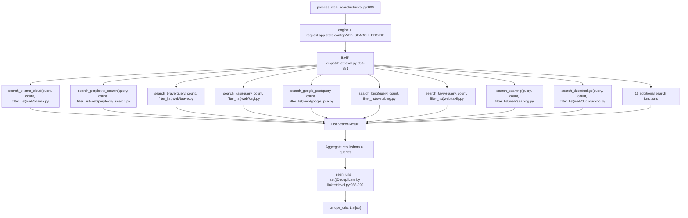
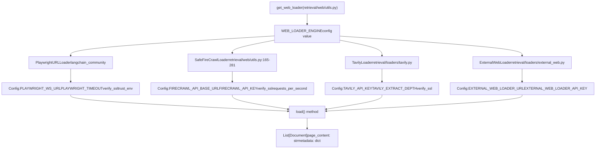
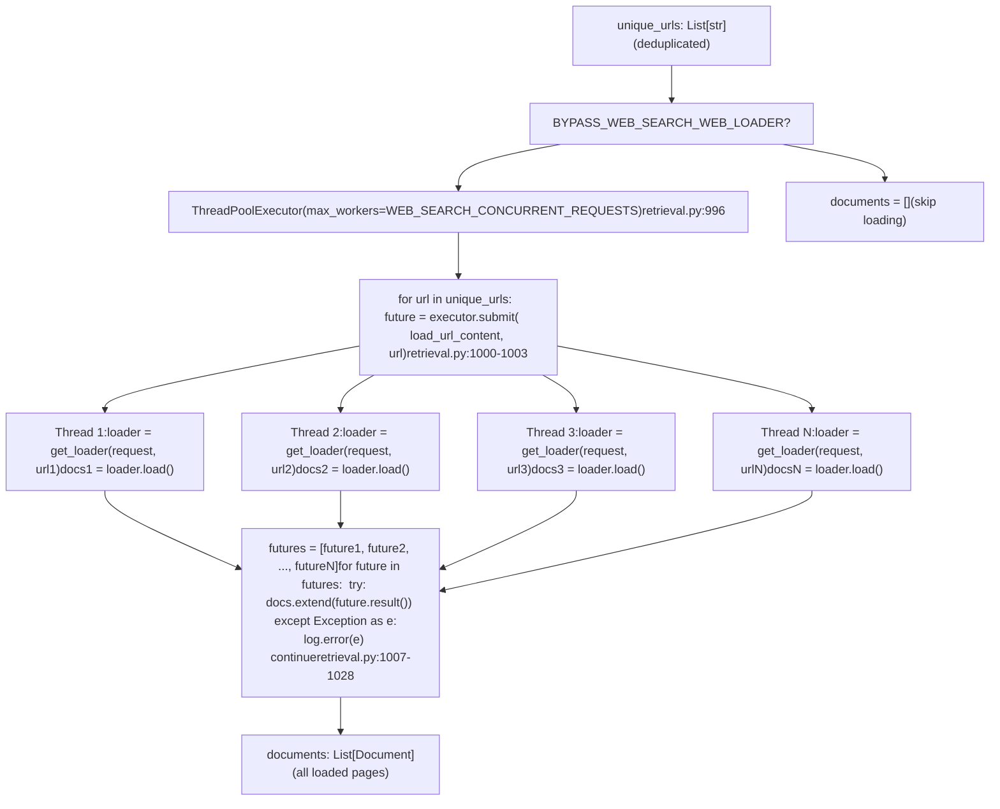
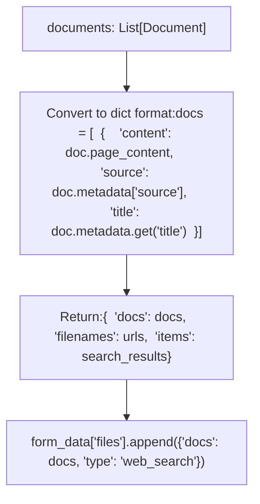
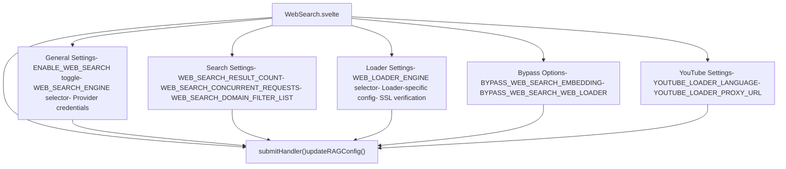
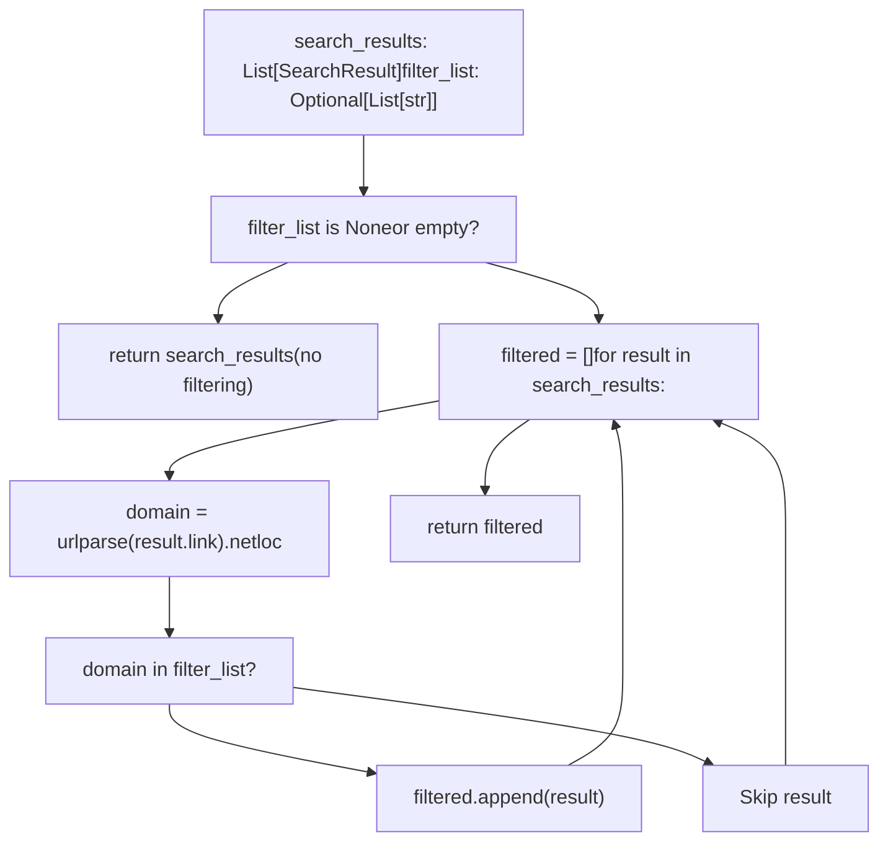

# Web Search Integration

Relevant source files

-   [backend/open\_webui/config.py](https://github.com/open-webui/open-webui/blob/a7271532/backend/open_webui/config.py)
-   [backend/open\_webui/main.py](https://github.com/open-webui/open-webui/blob/a7271532/backend/open_webui/main.py)
-   [backend/open\_webui/retrieval/loaders/datalab\_marker.py](https://github.com/open-webui/open-webui/blob/a7271532/backend/open_webui/retrieval/loaders/datalab_marker.py)
-   [backend/open\_webui/retrieval/loaders/external\_document.py](https://github.com/open-webui/open-webui/blob/a7271532/backend/open_webui/retrieval/loaders/external_document.py)
-   [backend/open\_webui/retrieval/loaders/external\_web.py](https://github.com/open-webui/open-webui/blob/a7271532/backend/open_webui/retrieval/loaders/external_web.py)
-   [backend/open\_webui/retrieval/loaders/main.py](https://github.com/open-webui/open-webui/blob/a7271532/backend/open_webui/retrieval/loaders/main.py)
-   [backend/open\_webui/retrieval/loaders/mineru.py](https://github.com/open-webui/open-webui/blob/a7271532/backend/open_webui/retrieval/loaders/mineru.py)
-   [backend/open\_webui/retrieval/loaders/mistral.py](https://github.com/open-webui/open-webui/blob/a7271532/backend/open_webui/retrieval/loaders/mistral.py)
-   [backend/open\_webui/retrieval/utils.py](https://github.com/open-webui/open-webui/blob/a7271532/backend/open_webui/retrieval/utils.py)
-   [backend/open\_webui/routers/retrieval.py](https://github.com/open-webui/open-webui/blob/a7271532/backend/open_webui/routers/retrieval.py)
-   [backend/open\_webui/utils/middleware.py](https://github.com/open-webui/open-webui/blob/a7271532/backend/open_webui/utils/middleware.py)
-   [src/lib/apis/retrieval/index.ts](https://github.com/open-webui/open-webui/blob/a7271532/src/lib/apis/retrieval/index.ts)
-   [src/lib/components/admin/Settings/Documents.svelte](https://github.com/open-webui/open-webui/blob/a7271532/src/lib/components/admin/Settings/Documents.svelte)
-   [src/lib/components/admin/Settings/WebSearch.svelte](https://github.com/open-webui/open-webui/blob/a7271532/src/lib/components/admin/Settings/WebSearch.svelte)

## Purpose and Scope

The web search integration system augments chat completions with real-time internet content through the `chat_web_search_handler` middleware function. This handler intercepts user queries, generates optimized search queries, executes searches across 24+ supported engines, loads web content, and injects results into the RAG pipeline for LLM consumption.

Key components:

-   **Handler**: `chat_web_search_handler` in [backend/open\_webui/utils/middleware.py555-716](https://github.com/open-webui/open-webui/blob/a7271532/backend/open_webui/utils/middleware.py#L555-L716)
-   **Search Execution**: `process_web_search` in [backend/open\_webui/routers/retrieval.py803-1062](https://github.com/open-webui/open-webui/blob/a7271532/backend/open_webui/routers/retrieval.py#L803-L1062)
-   **Engine Implementations**: Individual modules in [backend/open\_webui/retrieval/web/](https://github.com/open-webui/open-webui/blob/a7271532/backend/open_webui/retrieval/web/)

For broader RAG pipeline documentation, see page 7. For embedding and vector storage details, see page 7.4 and 7.5.

**Sources:** [backend/open\_webui/utils/middleware.py555-716](https://github.com/open-webui/open-webui/blob/a7271532/backend/open_webui/utils/middleware.py#L555-L716) [backend/open\_webui/routers/retrieval.py803-1062](https://github.com/open-webui/open-webui/blob/a7271532/backend/open_webui/routers/retrieval.py#L803-L1062)

## System Architecture

The web search integration operates as a middleware handler in the chat completion pipeline, intercepting user messages before they reach the LLM to inject relevant web content as additional context.

### Component Overview


**Sources:** [backend/open\_webui/utils/middleware.py558-718](https://github.com/open-webui/open-webui/blob/a7271532/backend/open_webui/utils/middleware.py#L558-L718) [backend/open\_webui/routers/retrieval.py46-1062](https://github.com/open-webui/open-webui/blob/a7271532/backend/open_webui/routers/retrieval.py#L46-L1062) [backend/open\_webui/retrieval/web/utils.py165-281](https://github.com/open-webui/open-webui/blob/a7271532/backend/open_webui/retrieval/web/utils.py#L165-L281)

## Request Flow

### Middleware Pipeline Integration

The `chat_web_search_handler` function is invoked as part of the `process_chat_payload` middleware pipeline when web search is enabled for a chat.

**Sequence Diagram: Web Search Request Flow**

> **[Mermaid sequence]**
> *(图表结构无法解析)*

**Sources:** [backend/open\_webui/utils/middleware.py558-718](https://github.com/open-webui/open-webui/blob/a7271532/backend/open_webui/utils/middleware.py#L558-L718) [backend/open\_webui/routers/retrieval.py803-1062](https://github.com/open-webui/open-webui/blob/a7271532/backend/open_webui/routers/retrieval.py#L803-L1062)

### Handler Implementation

The `chat_web_search_handler` function in [backend/open\_webui/utils/middleware.py555-716](https://github.com/open-webui/open-webui/blob/a7271532/backend/open_webui/utils/middleware.py#L555-L716) executes the following sequence:

| Step | Operation | Code Reference |
| --- | --- | --- |
| 1 | Emit initial status | `await event_emitter({"type": "status", "data": {"action": "web_search", "description": "Searching the web", "done": False}})` |
| 2 | Extract last user message | `user_message = get_last_user_message(messages)` from [middleware.py571](https://github.com/open-webui/open-webui/blob/a7271532/middleware.py#L571-L571) |
| 3 | Generate search queries | `res = await generate_queries(request, {"model": form_data["model"], "messages": messages, "prompt": user_message, "type": "web_search"}, user)` from [middleware.py575-585](https://github.com/open-webui/open-webui/blob/a7271532/middleware.py#L575-L585) |
| 4 | Parse JSON response | `response = res["choices"][0]["message"]["content"]` then `queries = json.loads(response)["queries"]` from [middleware.py586-600](https://github.com/open-webui/open-webui/blob/a7271532/middleware.py#L586-L600) |
| 5 | Query fallback on error | If exception or empty: `queries = [user_message]` from [middleware.py604-610](https://github.com/open-webui/open-webui/blob/a7271532/middleware.py#L604-L610) |
| 6 | Optional query caching | `if ENABLE_QUERIES_CACHE: request.state.cached_queries = queries` from [middleware.py601-603](https://github.com/open-webui/open-webui/blob/a7271532/middleware.py#L601-L603) |
| 7 | Execute web search | `results = await process_web_search(request, SearchForm(queries=queries), user=user)` from [middleware.py638-642](https://github.com/open-webui/open-webui/blob/a7271532/middleware.py#L638-L642) |
| 8 | Append to form\_data | `form_data["files"].append({"collection_name": collection_name, "name": ", ".join(queries), "type": "web_search", "urls": results["filenames"], "queries": queries})` from [middleware.py651-659](https://github.com/open-webui/open-webui/blob/a7271532/middleware.py#L651-L659) |
| 9 | Emit completion status | `await event_emitter({"type": "status", "data": {"action": "web_search", "description": "Searched {{count}} sites", "urls": results["filenames"], "items": results.get("items", []), "done": True}})` from [middleware.py675-686](https://github.com/open-webui/open-webui/blob/a7271532/middleware.py#L675-L686) |

Return value: Modified `form_data` with web search results attached as a file entry, which triggers RAG retrieval in downstream pipeline handlers.

**Sources:** [backend/open\_webui/utils/middleware.py555-716](https://github.com/open-webui/open-webui/blob/a7271532/backend/open_webui/utils/middleware.py#L555-L716)

## Query Generation

### LLM-Based Query Expansion via generate\_queries

The `generate_queries` function in [backend/open\_webui/routers/tasks.py](https://github.com/open-webui/open-webui/blob/a7271532/backend/open_webui/routers/tasks.py) transforms user messages into optimized search queries by:

1.  **Message extraction**: Calls `get_last_user_message(messages)` to extract the current query
2.  **Prompt construction**: Builds a structured prompt with conversation history (last 4 messages if available) and user message
3.  **Task model invocation**: Calls `generate_chat_completion(request, form_data=payload, user=user)` where `payload.metadata["task"] = str(TASKS.QUERY_GENERATION)` from [backend/open\_webui/constants.py](https://github.com/open-webui/open-webui/blob/a7271532/backend/open_webui/constants.py)
4.  **Response parsing**: Extracts JSON object from response: `bracket_start = response.find("{")`, `bracket_end = response.rfind("}") + 1`, then `queries = json.loads(response[bracket_start:bracket_end])["queries"]` from [middleware.py589-597](https://github.com/open-webui/open-webui/blob/a7271532/middleware.py#L589-L597)
5.  **Fallback handling**: On parse failure, wraps entire response as single query: `queries = [response]` from [middleware.py599](https://github.com/open-webui/open-webui/blob/a7271532/middleware.py#L599-L599)

Query caching behavior:

-   **Enabled when**: `ENABLE_QUERIES_CACHE` environment variable is `True`
-   **Storage location**: `request.state.cached_queries = queries` from [middleware.py601-603](https://github.com/open-webui/open-webui/blob/a7271532/middleware.py#L601-L603)
-   **Purpose**: Avoid regenerating queries for retried requests or debugging

**Sources:** [backend/open\_webui/utils/middleware.py575-606](https://github.com/open-webui/open-webui/blob/a7271532/backend/open_webui/utils/middleware.py#L575-L606) [backend/open\_webui/routers/tasks.py](https://github.com/open-webui/open-webui/blob/a7271532/backend/open_webui/routers/tasks.py) [backend/open\_webui/constants.py](https://github.com/open-webui/open-webui/blob/a7271532/backend/open_webui/constants.py)

## Search Engine Providers

The system supports 24+ search engines through individual implementation modules in [backend/open\_webui/retrieval/web/](https://github.com/open-webui/open-webui/blob/a7271532/backend/open_webui/retrieval/web/) Each implements a function with signature `def search_X(query: str, count: int, filter_list: Optional[List[str]] = None) -> List[SearchResult]`.

### Supported Providers

| Provider | Function Name | Module Path | Configuration Variables |
| --- | --- | --- | --- |
| Ollama Cloud | `search_ollama_cloud` | `retrieval/web/ollama.py` | `OLLAMA_CLOUD_WEB_SEARCH_API_KEY` |
| Perplexity Search | `search_perplexity_search` | `retrieval/web/perplexity_search.py` | `PERPLEXITY_SEARCH_API_URL`, `PERPLEXITY_API_KEY` |
| Brave Search | `search_brave` | `retrieval/web/brave.py` | `BRAVE_SEARCH_API_KEY` |
| Kagi | `search_kagi` | `retrieval/web/kagi.py` | `KAGI_SEARCH_API_KEY` |
| Mojeek | `search_mojeek` | `retrieval/web/mojeek.py` | `MOJEEK_SEARCH_API_KEY` |
| Bocha | `search_bocha` | `retrieval/web/bocha.py` | `BOCHA_SEARCH_API_KEY` |
| Google PSE | `search_google_pse` | `retrieval/web/google_pse.py` | `GOOGLE_PSE_API_KEY`, `GOOGLE_PSE_ENGINE_ID` |
| Bing | `search_bing` | `retrieval/web/bing.py` | `BING_SEARCH_V7_SUBSCRIPTION_KEY`, `BING_SEARCH_V7_ENDPOINT` |
| Azure Cognitive Search | `search_azure` | `retrieval/web/azure.py` | Azure-specific configuration |
| Tavily | `search_tavily` | `retrieval/web/tavily.py` | `TAVILY_API_KEY` |
| Jina Search | `search_jina` | `retrieval/web/jina_search.py` | `JINA_API_KEY` |
| SearchAPI | `search_searchapi` | `retrieval/web/searchapi.py` | `SEARCHAPI_API_KEY`, `SEARCHAPI_ENGINE` |
| SerpAPI | `search_serpapi` | `retrieval/web/serpapi.py` | `SERPAPI_API_KEY`, `SERPAPI_ENGINE` |
| Serper | `search_serper` | `retrieval/web/serper.py` | `SERPER_API_KEY` |
| Serply | `search_serply` | `retrieval/web/serply.py` | `SERPLY_API_KEY` |
| Serpstack | `search_serpstack` | `retrieval/web/serpstack.py` | `SERPSTACK_API_KEY`, `SERPSTACK_HTTPS` |
| SearXNG | `search_searxng` | `retrieval/web/searxng.py` | `SEARXNG_QUERY_URL`, `SEARXNG_LANGUAGE` |
| Yacy | `search_yacy` | `retrieval/web/yacy.py` | `YACY_QUERY_URL`, `YACY_USERNAME`, `YACY_PASSWORD` |
| Exa | `search_exa` | `retrieval/web/exa.py` | `EXA_API_KEY` |
| Perplexity | `search_perplexity` | `retrieval/web/perplexity.py` | `PERPLEXITY_API_KEY`, `PERPLEXITY_MODEL`, `PERPLEXITY_SEARCH_CONTEXT_USAGE` |
| Sougou | `search_sougou` | `retrieval/web/sougou.py` | `SOUGOU_API_SID`, `SOUGOU_API_SK` |
| Firecrawl | `search_firecrawl` | `retrieval/web/firecrawl.py` | `FIRECRAWL_API_BASE_URL`, `FIRECRAWL_API_KEY` |
| DuckDuckGo | `search_duckduckgo` | `retrieval/web/duckduckgo.py` | None (no API key) |
| External | `search_external` | `retrieval/web/external.py` | `EXTERNAL_WEB_SEARCH_URL`, `EXTERNAL_WEB_SEARCH_API_KEY` |

**Sources:** [backend/open\_webui/routers/retrieval.py51-76](https://github.com/open-webui/open-webui/blob/a7271532/backend/open_webui/routers/retrieval.py#L51-L76) [backend/open\_webui/config.py287-345](https://github.com/open-webui/open-webui/blob/a7271532/backend/open_webui/config.py#L287-L345) [src/lib/components/admin/Settings/WebSearch.svelte15-39](https://github.com/open-webui/open-webui/blob/a7271532/src/lib/components/admin/Settings/WebSearch.svelte#L15-L39)

### Search Result Data Structures

**SearchResult dataclass** from [backend/open\_webui/retrieval/web/main.py](https://github.com/open-webui/open-webui/blob/a7271532/backend/open_webui/retrieval/web/main.py):

```
@dataclass
class SearchResult:
    link: str        # URL of the search result page
    title: str       # Page title from search engine
    snippet: str     # Preview text snippet from search engine
```
**SearchForm model** from [backend/open\_webui/routers/retrieval.py245-246](https://github.com/open-webui/open-webui/blob/a7271532/backend/open_webui/routers/retrieval.py#L245-L246):

```
class SearchForm(BaseModel):
    queries: List[str]  # Multiple search queries to execute
```
The `SearchForm` is passed to `process_web_search` which iterates over `queries` and calls the selected search engine function for each query, accumulating all `SearchResult` objects.

**Sources:** [backend/open\_webui/retrieval/web/main.py](https://github.com/open-webui/open-webui/blob/a7271532/backend/open_webui/retrieval/web/main.py) [backend/open\_webui/routers/retrieval.py245-246](https://github.com/open-webui/open-webui/blob/a7271532/backend/open_webui/routers/retrieval.py#L245-L246)

### Provider Selection and Dispatch

The `process_web_search` function in [backend/open\_webui/routers/retrieval.py803-1062](https://github.com/open-webui/open-webui/blob/a7271532/backend/open_webui/routers/retrieval.py#L803-L1062) dispatches to search engines via if-elif chain based on `request.app.state.config.WEB_SEARCH_ENGINE`:

**Diagram: Search Engine Dispatch in process\_web\_search**


Function signature pattern:

```
def search_X(
    query: str,
    count: int,
    filter_list: Optional[List[str]] = None
) -> List[SearchResult]
```
Invocation parameters from `process_web_search`:

-   `query`: Individual query string from `SearchForm.queries`
-   `count`: `request.app.state.config.WEB_SEARCH_RESULT_COUNT`
-   `filter_list`: `request.app.state.config.WEB_SEARCH_DOMAIN_FILTER_LIST`

**Sources:** [backend/open\_webui/routers/retrieval.py803-992](https://github.com/open-webui/open-webui/blob/a7271532/backend/open_webui/routers/retrieval.py#L803-L992)

## Content Loading and Extraction

After search results are obtained, the system loads the full content from each URL using web loaders.

### Web Loader Architecture

The `get_web_loader` function in [backend/open\_webui/retrieval/web/utils.py](https://github.com/open-webui/open-webui/blob/a7271532/backend/open_webui/retrieval/web/utils.py) returns different loader implementations based on `WEB_LOADER_ENGINE`:

**Diagram: Web Loader Selection and Configuration**


### Loader Implementations

| Loader | Base Class | Features | Configuration |
| --- | --- | --- | --- |
| `PlaywrightURLLoader` | `langchain_community.document_loaders.PlaywrightURLLoader` | Full browser rendering, JavaScript execution, handles dynamic content | `PLAYWRIGHT_WS_URL`, `PLAYWRIGHT_TIMEOUT` |
| `SafeFireCrawlLoader` | `BaseLoader` with `RateLimitMixin`, `URLProcessingMixin` | API-based extraction, rate limiting, SSL verification | `FIRECRAWL_API_BASE_URL`, `FIRECRAWL_API_KEY` |
| `TavilyLoader` | Custom implementation | Deep content extraction with configurable depth | `TAVILY_API_KEY`, `TAVILY_EXTRACT_DEPTH` |
| `ExternalWebLoader` | `langchain_core.document_loaders.BaseLoader` | Delegates to external HTTP service | `EXTERNAL_WEB_LOADER_URL`, `EXTERNAL_WEB_LOADER_API_KEY` |

**Sources:** [backend/open\_webui/retrieval/web/utils.py165-281](https://github.com/open-webui/open-webui/blob/a7271532/backend/open_webui/retrieval/web/utils.py#L165-L281) [backend/open\_webui/retrieval/loaders/tavily.py](https://github.com/open-webui/open-webui/blob/a7271532/backend/open_webui/retrieval/loaders/tavily.py) [backend/open\_webui/retrieval/loaders/external\_web.py1-42](https://github.com/open-webui/open-webui/blob/a7271532/backend/open_webui/retrieval/loaders/external_web.py#L1-L42) [backend/open\_webui/retrieval/utils.py62-82](https://github.com/open-webui/open-webui/blob/a7271532/backend/open_webui/retrieval/utils.py#L62-L82)

### Concurrent Content Loading via ThreadPoolExecutor

When `BYPASS_WEB_SEARCH_WEB_LOADER` is `False`, the `process_web_search` function in [backend/open\_webui/routers/retrieval.py995-1028](https://github.com/open-webui/open-webui/blob/a7271532/backend/open_webui/routers/retrieval.py#L995-L1028) loads content concurrently:

**Diagram: Parallel Content Loading with ThreadPoolExecutor**


Implementation specifics from [backend/open\_webui/routers/retrieval.py995-1028](https://github.com/open-webui/open-webui/blob/a7271532/backend/open_webui/routers/retrieval.py#L995-L1028):

-   Thread pool size: `request.app.state.config.WEB_SEARCH_CONCURRENT_REQUESTS` (default: 10)
-   Error handling: Catch exceptions per URL, log error, continue with remaining URLs
-   Return value: `documents` list contains all successfully loaded `Document` objects

**Sources:** [backend/open\_webui/routers/retrieval.py995-1028](https://github.com/open-webui/open-webui/blob/a7271532/backend/open_webui/routers/retrieval.py#L995-L1028)

### YouTube URL Detection and Special Handling

The `get_loader` function in [backend/open\_webui/retrieval/utils.py66-80](https://github.com/open-webui/open-webui/blob/a7271532/backend/open_webui/retrieval/utils.py#L66-L80) implements YouTube-specific loading:

```
def is_youtube_url(url: str) -> bool:
    youtube_regex = r"^(https?://)?(www\.)?(youtube\.com|youtu\.be)/.+$"
    return re.match(youtube_regex, url) is not None

def get_loader(request, url: str):
    if is_youtube_url(url):
        return YoutubeLoader(
            url,
            language=request.app.state.config.YOUTUBE_LOADER_LANGUAGE,
            proxy_url=request.app.state.config.YOUTUBE_LOADER_PROXY_URL,
        )
    else:
        return get_web_loader(
            url,
            verify_ssl=request.app.state.config.ENABLE_WEB_LOADER_SSL_VERIFICATION,
            requests_per_second=request.app.state.config.WEB_LOADER_CONCURRENT_REQUESTS,
            trust_env=request.app.state.config.WEB_SEARCH_TRUST_ENV,
        )
```
`YoutubeLoader` from [backend/open\_webui/retrieval/loaders/youtube.py](https://github.com/open-webui/open-webui/blob/a7271532/backend/open_webui/retrieval/loaders/youtube.py) features:

-   **Transcript extraction**: Uses `youtube_transcript_api` to fetch video captions
-   **Language preferences**: `YOUTUBE_LOADER_LANGUAGE` as comma-separated list (e.g., `"en,es,de"`)
-   **Proxy support**: `YOUTUBE_LOADER_PROXY_URL` for geo-restricted videos
-   **Fallback logic**: Attempts preferred languages in order, falls back to English if none available

**Sources:** [backend/open\_webui/retrieval/utils.py61-80](https://github.com/open-webui/open-webui/blob/a7271532/backend/open_webui/retrieval/utils.py#L61-L80) [backend/open\_webui/retrieval/loaders/youtube.py](https://github.com/open-webui/open-webui/blob/a7271532/backend/open_webui/retrieval/loaders/youtube.py)

## RAG Integration

Search results are integrated into the retrieval-augmented generation pipeline through two modes.

### Standard Mode (Embedding + Retrieval)

When `BYPASS_WEB_SEARCH_EMBEDDING_AND_RETRIEVAL` is `False`, the system performs full RAG processing:

**Diagram: Standard RAG Integration Flow**

Processing steps:

1.  Generate unique collection name: `f"web-search-{uuid.uuid4()}"`
2.  Create collection via `VECTOR_DB_CLIENT.create_collection(collection_name)`
3.  Split documents into chunks using `request.app.state.config.TEXT_SPLITTER`
4.  Generate embeddings via `request.app.state.EMBEDDING_FUNCTION(texts, prefix=RAG_EMBEDDING_CONTENT_PREFIX)`
5.  Store in vector database via `add_documents_to_collection(collection_name, chunks, embeddings)`
6.  Return collection names for downstream RAG retrieval

**Sources:** [backend/open\_webui/routers/retrieval.py1030-1047](https://github.com/open-webui/open-webui/blob/a7271532/backend/open_webui/routers/retrieval.py#L1030-L1047)

### Bypass Mode (Direct Injection)

When `BYPASS_WEB_SEARCH_EMBEDDING_AND_RETRIEVAL` is `True`, the system skips embedding/retrieval and directly injects document content:

**Diagram: Bypass Mode Flow**


In bypass mode, documents are converted to dictionaries with:

-   `content`: Full page content from `doc.page_content`
-   `source`: URL from `doc.metadata['source']`
-   `title`: Page title from `doc.metadata.get('title', '')`

Use cases for bypass mode:

-   **Low latency**: Skips embedding generation and vector storage
-   **Full context**: Provides complete document content without retrieval filtering
-   **Simple queries**: When semantic search is not needed
-   **Testing**: Quick validation without RAG overhead

**Sources:** [backend/open\_webui/routers/retrieval.py1049-1062](https://github.com/open-webui/open-webui/blob/a7271532/backend/open_webui/routers/retrieval.py#L1049-L1062)

## Configuration

### Environment Variables

Web search behavior is controlled by multiple configuration parameters in [backend/open\_webui/config.py](https://github.com/open-webui/open-webui/blob/a7271532/backend/open_webui/config.py) and [backend/open\_webui/main.py](https://github.com/open-webui/open-webui/blob/a7271532/backend/open_webui/main.py):

| Parameter | Type | Description | Default |
| --- | --- | --- | --- |
| `ENABLE_WEB_SEARCH` | `bool` | Enable/disable web search globally | `False` |
| `WEB_SEARCH_ENGINE` | `str` | Selected search engine | `""` |
| `WEB_SEARCH_RESULT_COUNT` | `int` | Maximum search results | `3` |
| `WEB_SEARCH_CONCURRENT_REQUESTS` | `int` | Parallel content loading | `10` |
| `WEB_SEARCH_DOMAIN_FILTER_LIST` | `list[str]` | Domain whitelist/blacklist | `[]` |
| `WEB_SEARCH_TRUST_ENV` | `bool` | Trust environment proxy settings | `True` |
| `BYPASS_WEB_SEARCH_EMBEDDING_AND_RETRIEVAL` | `bool` | Skip RAG pipeline | `False` |
| `BYPASS_WEB_SEARCH_WEB_LOADER` | `bool` | Skip content loading | `False` |
| `WEB_LOADER_ENGINE` | `str` | Content loader (playwright/firecrawl/tavily/external) | `"playwright"` |
| `WEB_LOADER_CONCURRENT_REQUESTS` | `int` | Loader parallelism | `10` |

**Sources:** [backend/open\_webui/config.py](https://github.com/open-webui/open-webui/blob/a7271532/backend/open_webui/config.py) [backend/open\_webui/main.py898-912](https://github.com/open-webui/open-webui/blob/a7271532/backend/open_webui/main.py#L898-L912)

### Admin Configuration UI

The web search settings are configured through the admin panel in [src/lib/components/admin/Settings/WebSearch.svelte](https://github.com/open-webui/open-webui/blob/a7271532/src/lib/components/admin/Settings/WebSearch.svelte):


**Sources:** [src/lib/components/admin/Settings/WebSearch.svelte1-726](https://github.com/open-webui/open-webui/blob/a7271532/src/lib/components/admin/Settings/WebSearch.svelte#L1-L726)

### Runtime Configuration Updates

Configuration changes are persisted via the `AppConfig` pattern in [backend/open\_webui/config.py224-284](https://github.com/open-webui/open-webui/blob/a7271532/backend/open_webui/config.py#L224-L284) which supports:

-   Redis-backed distributed configuration
-   Real-time updates across multiple instances
-   Fallback to database storage when Redis is unavailable

**Sources:** [backend/open\_webui/config.py224-284](https://github.com/open-webui/open-webui/blob/a7271532/backend/open_webui/config.py#L224-L284)

## Domain Filtering via get\_filtered\_results

The `get_filtered_results` function in [backend/open\_webui/retrieval/web/main.py](https://github.com/open-webui/open-webui/blob/a7271532/backend/open_webui/retrieval/web/main.py) implements whitelist-based domain filtering:

**Diagram: Domain Filtering Logic**


Filtering behavior:

-   **Whitelist mode only**: If `filter_list` provided, only matching domains included
-   **Exact domain matching**: No wildcard or pattern support (e.g., `*.example.com` not supported)
-   **Domain extraction**: `urlparse(result.link).netloc` extracts full domain including subdomain
-   **Applied per search**: Each search engine call receives `filter_list` parameter

Configuration chain:

1.  Admin sets `WEB_SEARCH_DOMAIN_FILTER_LIST` in [src/lib/components/admin/Settings/WebSearch.svelte46-52](https://github.com/open-webui/open-webui/blob/a7271532/src/lib/components/admin/Settings/WebSearch.svelte#L46-L52)
2.  Stored as comma-separated string, converted to `List[str]` on submit
3.  Accessed as `request.app.state.config.WEB_SEARCH_DOMAIN_FILTER_LIST`
4.  Passed to search functions as `filter_list` parameter

**Sources:** [backend/open\_webui/retrieval/web/main.py](https://github.com/open-webui/open-webui/blob/a7271532/backend/open_webui/retrieval/web/main.py) [backend/open\_webui/routers/retrieval.py838-981](https://github.com/open-webui/open-webui/blob/a7271532/backend/open_webui/routers/retrieval.py#L838-L981) [src/lib/components/admin/Settings/WebSearch.svelte46-52](https://github.com/open-webui/open-webui/blob/a7271532/src/lib/components/admin/Settings/WebSearch.svelte#L46-L52)

## Error Handling Strategy

### Handler-Level Error Handling

The `chat_web_search_handler` in [backend/open\_webui/utils/middleware.py555-716](https://github.com/open-webui/open-webui/blob/a7271532/backend/open_webui/utils/middleware.py#L555-L716) implements graceful degradation:

| Error Type | Location | Handling Strategy |
| --- | --- | --- |
| Query generation failure | [middleware.py604-606](https://github.com/open-webui/open-webui/blob/a7271532/middleware.py#L604-L606) | `except Exception as e: log.exception(e); queries = [user_message]` - Falls back to original message |
| Empty queries | [middleware.py609-624](https://github.com/open-webui/open-webui/blob/a7271532/middleware.py#L609-L624) | `if len(queries) == 0:` emit no results status, return `form_data` unchanged |
| Search execution failure | [middleware.py700-713](https://github.com/open-webui/open-webui/blob/a7271532/middleware.py#L700-L713) | `except Exception as e: log.exception(e)` emit error status with query list |

### Search-Level Error Handling

Individual search engine functions in [backend/open\_webui/retrieval/web/](https://github.com/open-webui/open-webui/blob/a7271532/backend/open_webui/retrieval/web/):

-   **API key errors**: Log error, return empty `List[SearchResult]`
-   **Network errors**: Retry logic varies by provider, ultimately returns empty list
-   **Rate limiting**: Some providers implement exponential backoff, others fail immediately

### Content Loading Error Handling

The `process_web_search` function in [backend/open\_webui/routers/retrieval.py1007-1028](https://github.com/open-webui/open-webui/blob/a7271532/backend/open_webui/routers/retrieval.py#L1007-L1028) handles per-URL failures:

```
for future in futures:
    try:
        docs = future.result()
        documents.extend(docs)
    except Exception as e:
        log.error(f"Error loading URL: {e}")
        continue  # Skip failed URL, process remaining
```
Behavior: Partial results returned even if some URLs fail to load. At least one successful load required to proceed to embedding.

### RAG Integration Errors

From [backend/open\_webui/routers/retrieval.py1030-1062](https://github.com/open-webui/open-webui/blob/a7271532/backend/open_webui/routers/retrieval.py#L1030-L1062):

-   **Empty documents**: Returns early with no results if `documents` list empty
-   **Embedding failures**: Propagated as exceptions, stops processing
-   **Vector DB errors**: Logged and propagated, no partial results

**Sources:** [backend/open\_webui/utils/middleware.py604-713](https://github.com/open-webui/open-webui/blob/a7271532/backend/open_webui/utils/middleware.py#L604-L713) [backend/open\_webui/routers/retrieval.py1007-1062](https://github.com/open-webui/open-webui/blob/a7271532/backend/open_webui/routers/retrieval.py#L1007-L1062)

## Performance Considerations

### Concurrency

-   Search and content loading operations are parallelized using `ThreadPoolExecutor`
-   Configurable via `WEB_SEARCH_CONCURRENT_REQUESTS` and `WEB_LOADER_CONCURRENT_REQUESTS`
-   Default: 10 concurrent requests

### Caching

-   Query caching available via `ENABLE_QUERIES_CACHE` to avoid regenerating queries
-   Vector database collections are temporary and cleaned up after use

### Bypass Options

-   `BYPASS_WEB_SEARCH_EMBEDDING_AND_RETRIEVAL`: Skip embedding/retrieval for faster response
-   `BYPASS_WEB_SEARCH_WEB_LOADER`: Skip content loading, use only search snippets

**Sources:** [backend/open\_webui/utils/middleware.py604-606](https://github.com/open-webui/open-webui/blob/a7271532/backend/open_webui/utils/middleware.py#L604-L606) [backend/open\_webui/routers/retrieval.py995-1062](https://github.com/open-webui/open-webui/blob/a7271532/backend/open_webui/routers/retrieval.py#L995-L1062)
