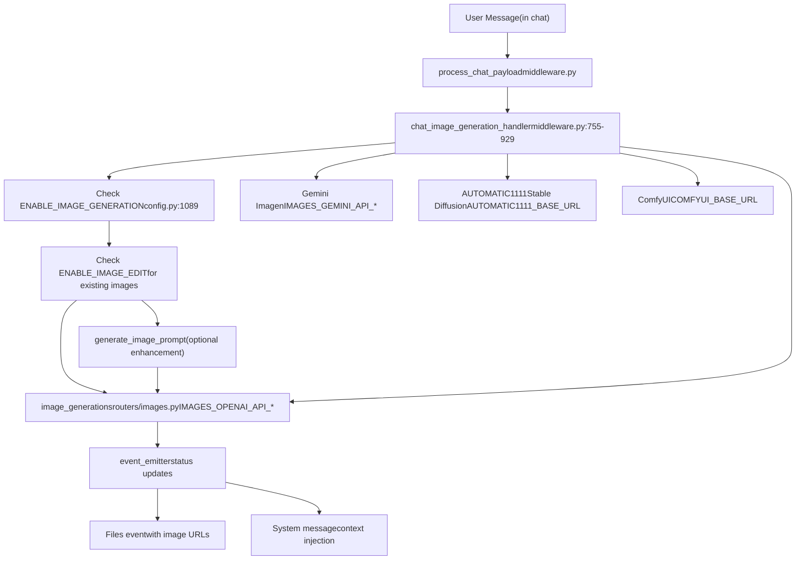
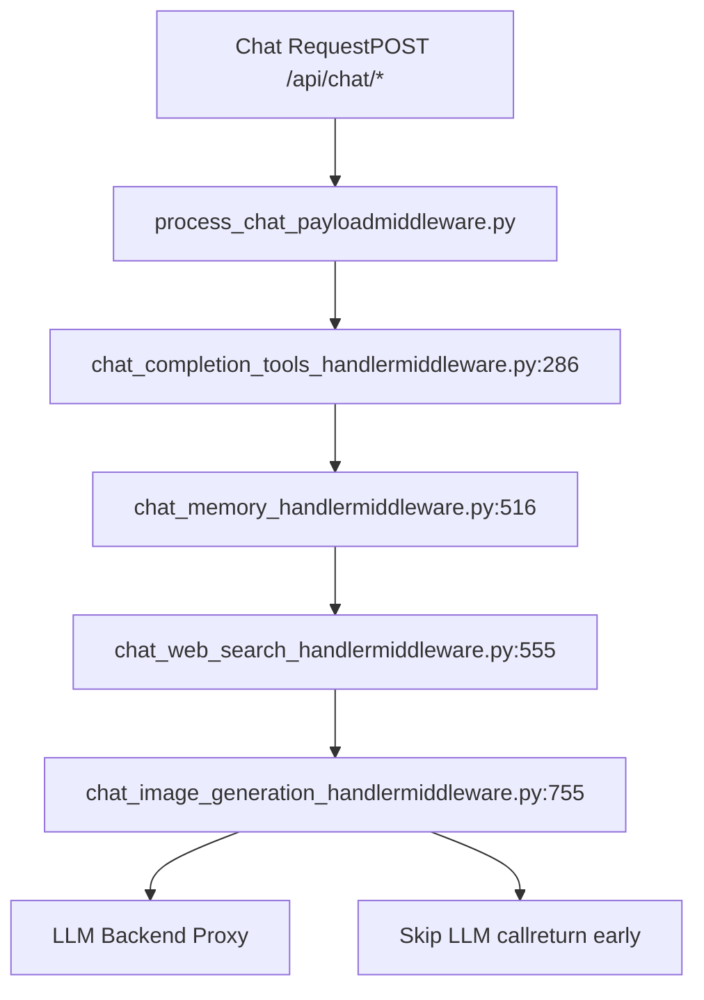
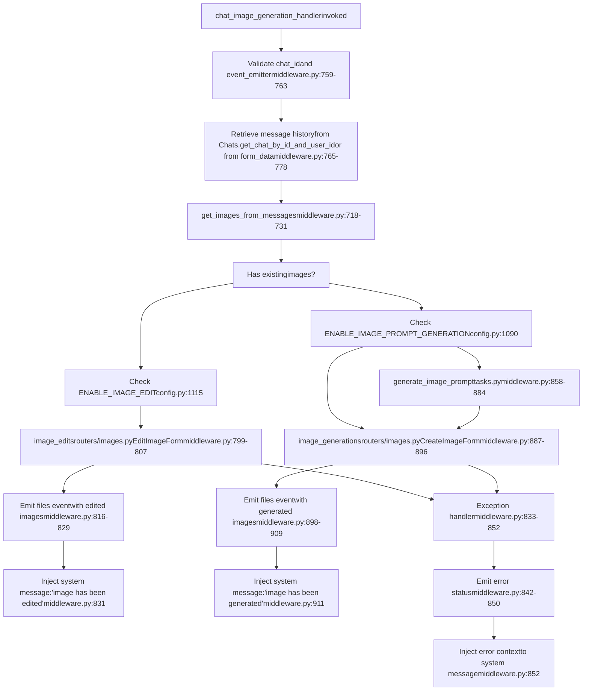
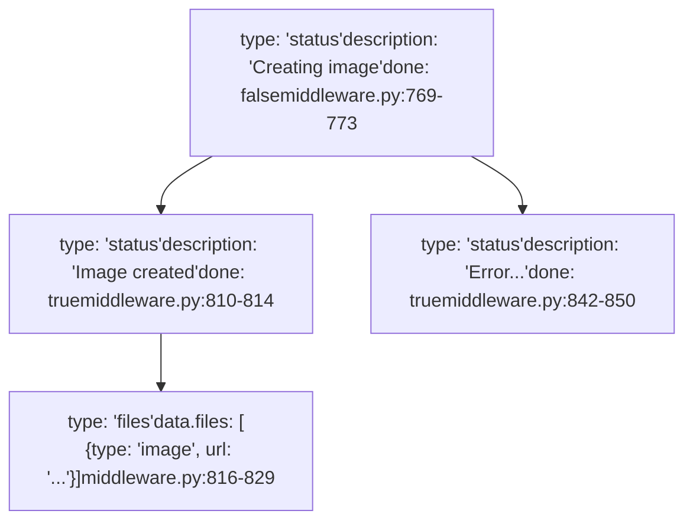
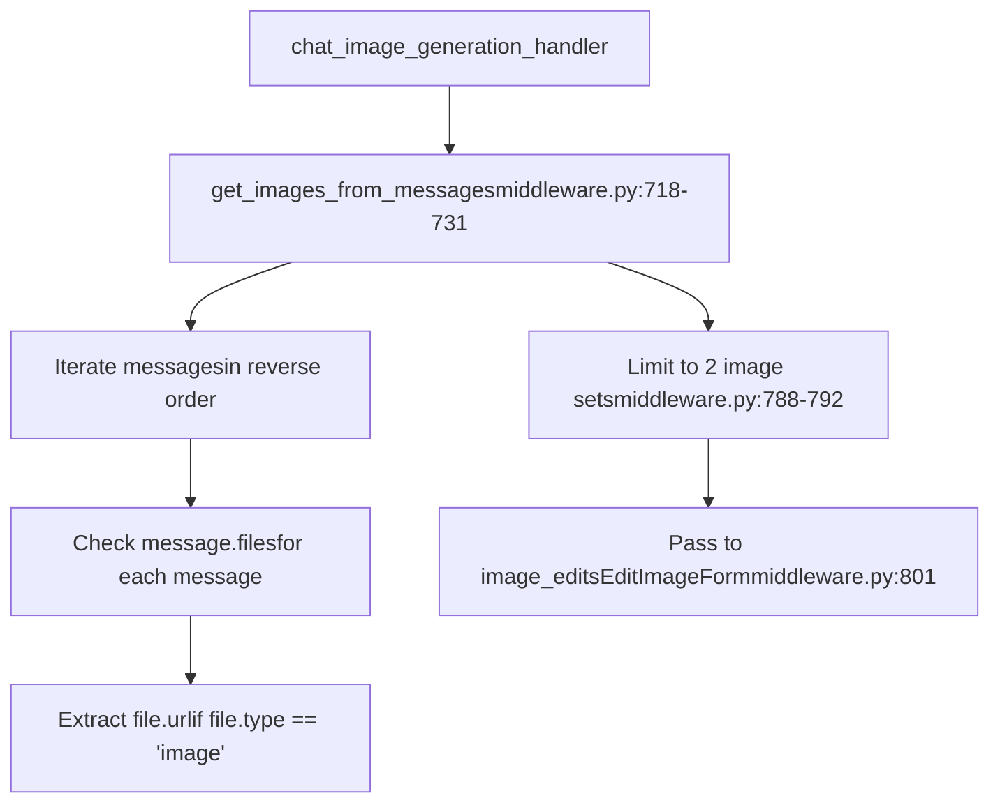
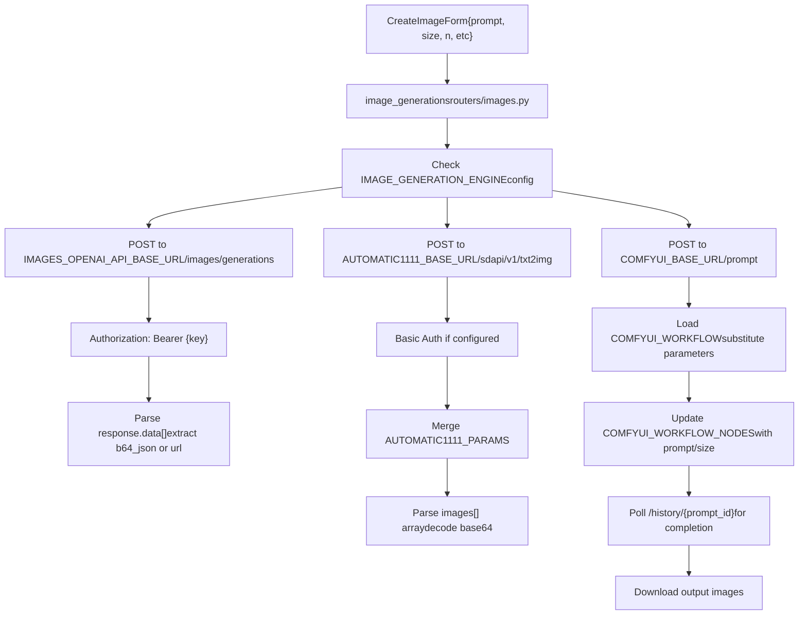
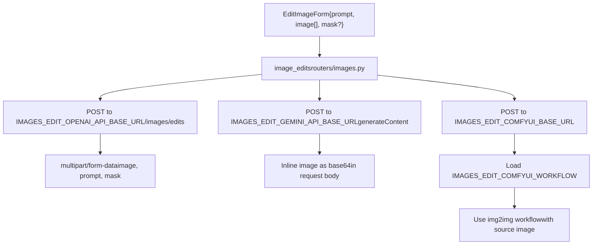
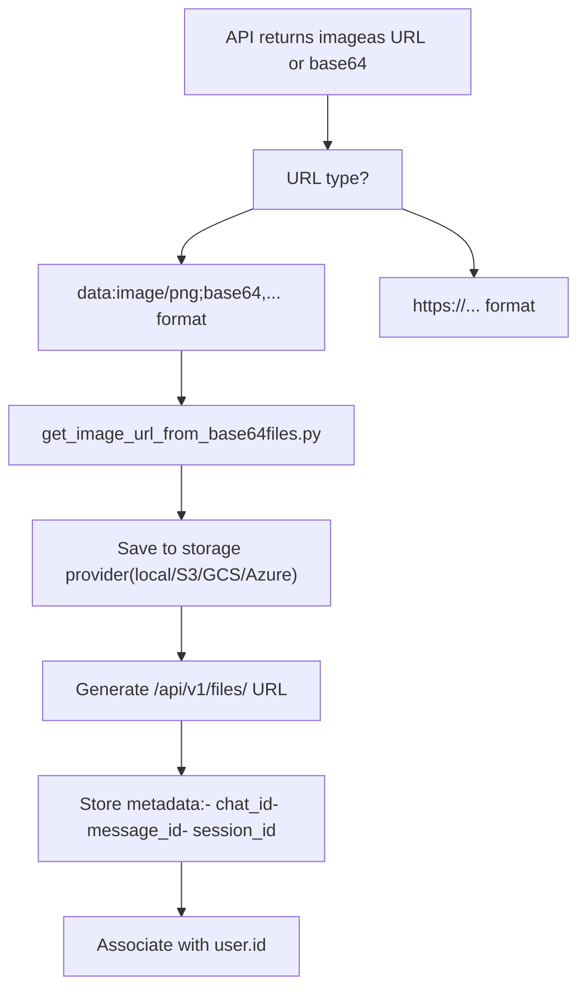
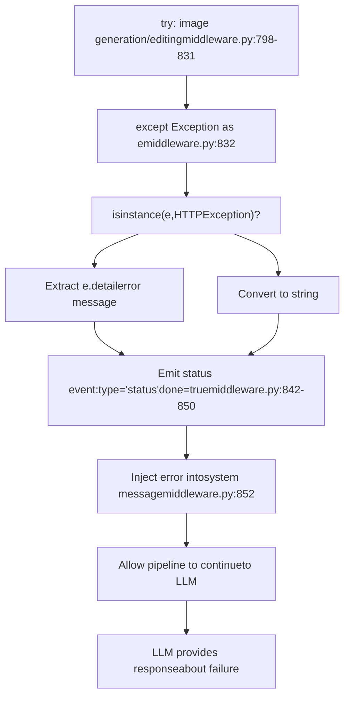

# Image Generation Integration

Relevant source files

-   [backend/open\_webui/config.py](https://github.com/open-webui/open-webui/blob/a7271532/backend/open_webui/config.py)
-   [backend/open\_webui/main.py](https://github.com/open-webui/open-webui/blob/a7271532/backend/open_webui/main.py)
-   [backend/open\_webui/retrieval/loaders/datalab\_marker.py](https://github.com/open-webui/open-webui/blob/a7271532/backend/open_webui/retrieval/loaders/datalab_marker.py)
-   [backend/open\_webui/retrieval/loaders/external\_document.py](https://github.com/open-webui/open-webui/blob/a7271532/backend/open_webui/retrieval/loaders/external_document.py)
-   [backend/open\_webui/retrieval/loaders/external\_web.py](https://github.com/open-webui/open-webui/blob/a7271532/backend/open_webui/retrieval/loaders/external_web.py)
-   [backend/open\_webui/retrieval/loaders/main.py](https://github.com/open-webui/open-webui/blob/a7271532/backend/open_webui/retrieval/loaders/main.py)
-   [backend/open\_webui/retrieval/loaders/mineru.py](https://github.com/open-webui/open-webui/blob/a7271532/backend/open_webui/retrieval/loaders/mineru.py)
-   [backend/open\_webui/retrieval/loaders/mistral.py](https://github.com/open-webui/open-webui/blob/a7271532/backend/open_webui/retrieval/loaders/mistral.py)
-   [backend/open\_webui/retrieval/utils.py](https://github.com/open-webui/open-webui/blob/a7271532/backend/open_webui/retrieval/utils.py)
-   [backend/open\_webui/routers/retrieval.py](https://github.com/open-webui/open-webui/blob/a7271532/backend/open_webui/routers/retrieval.py)
-   [backend/open\_webui/utils/middleware.py](https://github.com/open-webui/open-webui/blob/a7271532/backend/open_webui/utils/middleware.py)
-   [src/lib/apis/retrieval/index.ts](https://github.com/open-webui/open-webui/blob/a7271532/src/lib/apis/retrieval/index.ts)
-   [src/lib/components/admin/Settings/Documents.svelte](https://github.com/open-webui/open-webui/blob/a7271532/src/lib/components/admin/Settings/Documents.svelte)
-   [src/lib/components/admin/Settings/WebSearch.svelte](https://github.com/open-webui/open-webui/blob/a7271532/src/lib/components/admin/Settings/WebSearch.svelte)

The Image Generation Integration system provides automated image creation and editing capabilities within the chat interface. When enabled, the system intercepts user requests to generate or edit images, processes them through configured backend engines (DALL-E, Stable Diffusion, Gemini, ComfyUI), and displays results inline in the conversation.

For web search integration, see [Web Search Integration](/open-webui/open-webui/6.5-web-search-integration). For tool execution, see [Tool Execution System](/open-webui/open-webui/6.3-tool-execution-system).

## System Architecture

The image generation system operates as a middleware handler in the chat processing pipeline, intercepting requests before they reach the LLM and fulfilling them with generated images.


**Sources:** [backend/open\_webui/utils/middleware.py755-929](https://github.com/open-webui/open-webui/blob/a7271532/backend/open_webui/utils/middleware.py#L755-L929) [backend/open\_webui/main.py1088-1124](https://github.com/open-webui/open-webui/blob/a7271532/backend/open_webui/main.py#L1088-L1124) [backend/open\_webui/config.py](https://github.com/open-webui/open-webui/blob/a7271532/backend/open_webui/config.py)

## Configuration System

Image generation is configured through environment variables or persistent configuration, supporting four distinct backend engines with separate configurations for generation and editing.

### Generation Configuration

| Configuration Key | Type | Purpose |
| --- | --- | --- |
| `ENABLE_IMAGE_GENERATION` | Boolean | Master switch for image generation |
| `ENABLE_IMAGE_PROMPT_GENERATION` | Boolean | Use LLM to enhance image prompts |
| `IMAGE_GENERATION_ENGINE` | String | Backend: `openai`, `gemini`, `automatic1111`, `comfyui` |
| `IMAGE_GENERATION_MODEL` | String | Model identifier for the selected engine |
| `IMAGE_SIZE` | String | Default image dimensions (e.g., `1024x1024`) |
| `IMAGE_STEPS` | Integer | Inference steps (for diffusion models) |

### Engine-Specific Configuration


**Sources:** [backend/open\_webui/main.py146-180](https://github.com/open-webui/open-webui/blob/a7271532/backend/open_webui/main.py#L146-L180) [backend/open\_webui/config.py1088-1124](https://github.com/open-webui/open-webui/blob/a7271532/backend/open_webui/config.py#L1088-L1124)

### Edit Configuration

The system maintains separate configuration for image editing operations, which apply when the chat contains existing images:

| Configuration Key | Purpose |
| --- | --- |
| `ENABLE_IMAGE_EDIT` | Enable image editing functionality |
| `IMAGE_EDIT_ENGINE` | Backend engine for editing (same options as generation) |
| `IMAGE_EDIT_MODEL` | Model identifier for editing |
| `IMAGE_EDIT_SIZE` | Output dimensions for edited images |
| `IMAGES_EDIT_OPENAI_API_BASE_URL` | OpenAI edit endpoint |
| `IMAGES_EDIT_GEMINI_API_BASE_URL` | Gemini edit endpoint |
| `IMAGES_EDIT_COMFYUI_BASE_URL` | ComfyUI edit endpoint |

**Sources:** [backend/open\_webui/main.py167-179](https://github.com/open-webui/open-webui/blob/a7271532/backend/open_webui/main.py#L167-L179) [backend/open\_webui/config.py1115-1124](https://github.com/open-webui/open-webui/blob/a7271532/backend/open_webui/config.py#L1115-L1124)

## Middleware Handler Integration

The `chat_image_generation_handler` function integrates into the chat processing pipeline as a middleware component that intercepts requests and fulfills them with generated images.

### Handler Registration


**Sources:** [backend/open\_webui/utils/middleware.py755-929](https://github.com/open-webui/open-webui/blob/a7271532/backend/open_webui/utils/middleware.py#L755-L929) [backend/open\_webui/utils/middleware.py494](https://github.com/open-webui/open-webui/blob/a7271532/backend/open_webui/utils/middleware.py#L494-L494)

### Handler Execution Flow

The handler follows a multi-stage process to determine whether to generate or edit images:


**Sources:** [backend/open\_webui/utils/middleware.py755-929](https://github.com/open-webui/open-webui/blob/a7271532/backend/open_webui/utils/middleware.py#L755-L929)

## Prompt Enhancement System

When `ENABLE_IMAGE_PROMPT_GENERATION` is enabled, the system uses an LLM to enhance user prompts before image generation, improving output quality.

### Enhancement Process

The enhancement process extracts the user's intent and expands it into a more detailed, effective prompt for the image generation model:

1.  **Extract user message** - Get the last user message from conversation history [middleware.py780](https://github.com/open-webui/open-webui/blob/a7271532/middleware.py#L780-L780)
2.  **Call LLM task endpoint** - Invoke `generate_image_prompt` with current chat context [middleware.py858-865](https://github.com/open-webui/open-webui/blob/a7271532/middleware.py#L858-L865)
3.  **Parse JSON response** - Extract enhanced prompt from structured output [middleware.py867-880](https://github.com/open-webui/open-webui/blob/a7271532/middleware.py#L867-L880)
4.  **Fallback on error** - Use original user message if enhancement fails [middleware.py882-884](https://github.com/open-webui/open-webui/blob/a7271532/middleware.py#L882-L884)

The enhancement uses the configured `TASK_MODEL` with a specialized prompt template defined in `IMAGE_PROMPT_GENERATION_PROMPT_TEMPLATE`.

**Sources:** [backend/open\_webui/utils/middleware.py856-885](https://github.com/open-webui/open-webui/blob/a7271532/backend/open_webui/utils/middleware.py#L856-L885) [backend/open\_webui/main.py432](https://github.com/open-webui/open-webui/blob/a7271532/backend/open_webui/main.py#L432-L432)

## Event Emission Protocol

The handler communicates progress and results through the WebSocket event system, sending structured events to the frontend for real-time UI updates.

### Event Types


**Sources:** [backend/open\_webui/utils/middleware.py769-850](https://github.com/open-webui/open-webui/blob/a7271532/backend/open_webui/utils/middleware.py#L769-L850)

### System Message Context Injection

After successful image generation or editing, the handler injects a context message into the chat's system messages to inform the LLM about the generated image:

**Success context:**

```
<context>The requested image has been edited and created and is now being shown to the user. Let them know that it has been generated.</context>
```
[middleware.py831](https://github.com/open-webui/open-webui/blob/a7271532/middleware.py#L831-L831)

**Error context:**

```
<context>Image generation was attempted but failed. The system is currently unable to generate the image. Tell the user that the following error occurred: {error_message}</context>
```
[middleware.py852](https://github.com/open-webui/open-webui/blob/a7271532/middleware.py#L852-L852)

This allows the LLM to provide appropriate conversational responses acknowledging the image operation.

**Sources:** [backend/open\_webui/utils/middleware.py831](https://github.com/open-webui/open-webui/blob/a7271532/backend/open_webui/utils/middleware.py#L831-L831) [backend/open\_webui/utils/middleware.py852](https://github.com/open-webui/open-webui/blob/a7271532/backend/open_webui/utils/middleware.py#L852-L852)

## Image Extraction from Messages

The system searches backward through message history to find images attached to previous messages, supporting up to 2 sets of images for editing operations.


**Sources:** [backend/open\_webui/utils/middleware.py718-731](https://github.com/open-webui/open-webui/blob/a7271532/backend/open_webui/utils/middleware.py#L718-L731) [backend/open\_webui/utils/middleware.py783-792](https://github.com/open-webui/open-webui/blob/a7271532/backend/open_webui/utils/middleware.py#L783-L792)

## Backend Engine Routing

Image generation and editing requests are routed to the appropriate backend based on the configured `IMAGE_GENERATION_ENGINE` or `IMAGE_EDIT_ENGINE`. Each engine has its own API contract and capabilities.

### Generation Routing

The `image_generations` function in `routers/images.py` handles routing to the configured generation engine:


**Sources:** [backend/open\_webui/routers/images.py](https://github.com/open-webui/open-webui/blob/a7271532/backend/open_webui/routers/images.py) (referenced in imports), [backend/open\_webui/main.py1088-1112](https://github.com/open-webui/open-webui/blob/a7271532/backend/open_webui/main.py#L1088-L1112)

### Edit Routing

The `image_edits` function handles image editing operations with similar routing logic:


**Sources:** [backend/open\_webui/utils/middleware.py799-807](https://github.com/open-webui/open-webui/blob/a7271532/backend/open_webui/utils/middleware.py#L799-L807) [backend/open\_webui/main.py1115-1124](https://github.com/open-webui/open-webui/blob/a7271532/backend/open_webui/main.py#L1115-L1124)

## Image URL Management

Generated images are returned as URLs that can be either external API URLs or base64 data URLs. The system handles conversion and storage through the file management system.

### URL Processing Flow


When images are converted from base64, the system calls `get_image_url_from_base64` which:

1.  Extracts base64 data from data URL
2.  Creates a file entry in the database
3.  Saves the binary content to the configured storage provider
4.  Returns a `/api/v1/files/<file_id>` URL

**Sources:** [backend/open\_webui/utils/middleware.py748](https://github.com/open-webui/open-webui/blob/a7271532/backend/open_webui/utils/middleware.py#L748-L748) [backend/open\_webui/utils/files.py](https://github.com/open-webui/open-webui/blob/a7271532/backend/open_webui/utils/files.py) (referenced in imports)

## Integration with Chat Completion

The image generation handler modifies the request payload and response to integrate seamlessly with the chat completion flow.

### Request Modification

After successful image generation, the handler:

1.  **Adds files to metadata** - Stores image URLs in `form_data['metadata']['files']` for persistence [middleware.py645-673](https://github.com/open-webui/open-webui/blob/a7271532/middleware.py#L645-L673)
2.  **Injects system message** - Adds context about generated image to help LLM respond appropriately [middleware.py831](https://github.com/open-webui/open-webui/blob/a7271532/middleware.py#L831-L831)
3.  **Returns modified form\_data** - Allows chat pipeline to continue with augmented request

### Response Bypass

When image generation is successful, the handler effectively bypasses the LLM call by:

1.  Emitting the image files event directly to the frontend
2.  Providing context in the system message for the LLM to acknowledge
3.  Allowing the normal chat completion to proceed with minimal token usage

The LLM receives a system message indicating the image was generated and can provide a conversational acknowledgment without needing to see the actual image.

**Sources:** [backend/open\_webui/utils/middleware.py755-929](https://github.com/open-webui/open-webui/blob/a7271532/backend/open_webui/utils/middleware.py#L755-L929)

## Error Handling and Recovery

The system implements comprehensive error handling at multiple levels to ensure graceful degradation.

### Handler-Level Error Handling


### Backend-Specific Errors

Each backend engine may return different error types:

| Engine | Common Errors | Handling |
| --- | --- | --- |
| OpenAI | API key invalid, rate limit, NSFW content filter | Extract from `response.json()['error']['message']` |
| AUTOMATIC1111 | Connection refused, model not loaded | HTTP connection errors, timeouts |
| ComfyUI | Invalid workflow, missing nodes, workflow execution failure | Poll status for errors |
| Gemini | Safety filters, quota exceeded | Parse API error response |

**Sources:** [backend/open\_webui/utils/middleware.py832-852](https://github.com/open-webui/open-webui/blob/a7271532/backend/open_webui/utils/middleware.py#L832-L852)

## Configuration Persistence

Image generation configuration is managed through the `AppConfig` system with Redis-backed synchronization for distributed deployments.

### Configuration Updates

When image generation settings are modified through the admin UI:

1.  Configuration written to `app.state.config.IMAGE_GENERATION_ENGINE` etc. [main.py1088-1112](https://github.com/open-webui/open-webui/blob/a7271532/main.py#L1088-L1112)
2.  `AppConfig.__setattr__` triggers database save [config.py251-260](https://github.com/open-webui/open-webui/blob/a7271532/config.py#L251-L260)
3.  Redis key `{prefix}:config:IMAGE_GENERATION_ENGINE` updated for cross-instance sync [config.py259-260](https://github.com/open-webui/open-webui/blob/a7271532/config.py#L259-L260)
4.  Other instances read from Redis on next config access [config.py267-283](https://github.com/open-webui/open-webui/blob/a7271532/config.py#L267-L283)

This ensures configuration changes propagate across all backend instances in a horizontally scaled deployment.

**Sources:** [backend/open\_webui/config.py224-284](https://github.com/open-webui/open-webui/blob/a7271532/backend/open_webui/config.py#L224-L284) [backend/open\_webui/main.py1088-1124](https://github.com/open-webui/open-webui/blob/a7271532/backend/open_webui/main.py#L1088-L1124)
