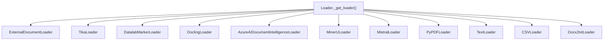
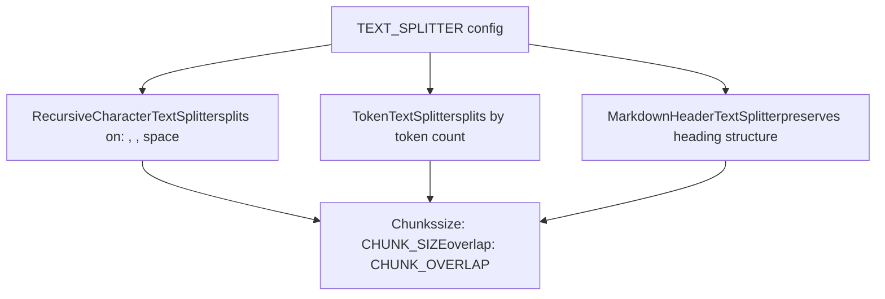
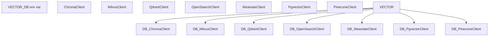
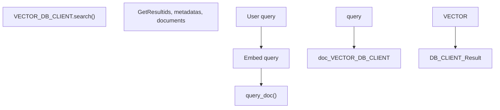
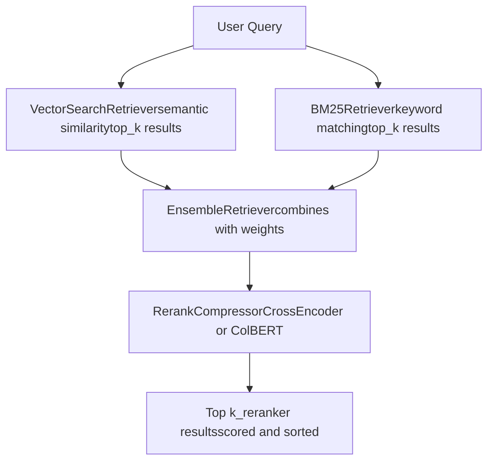
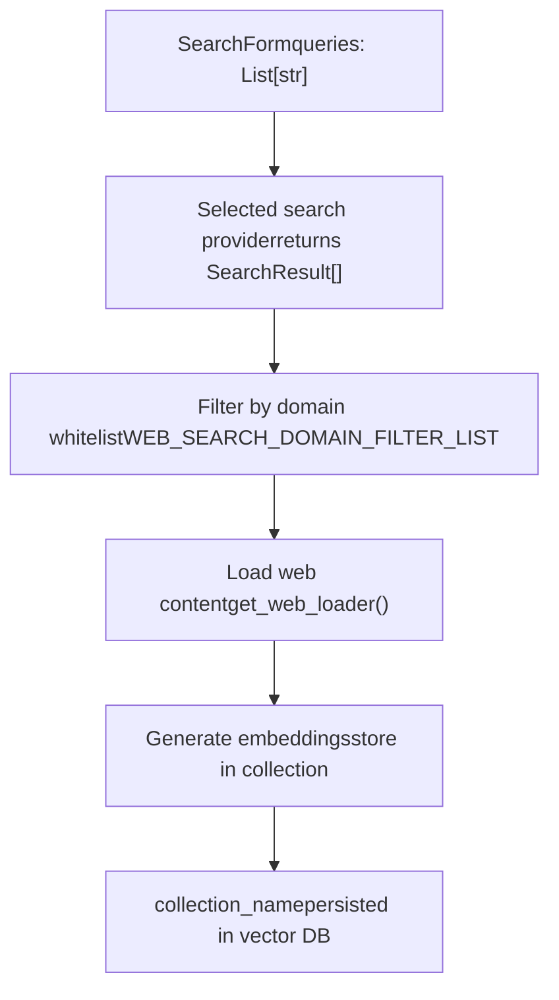
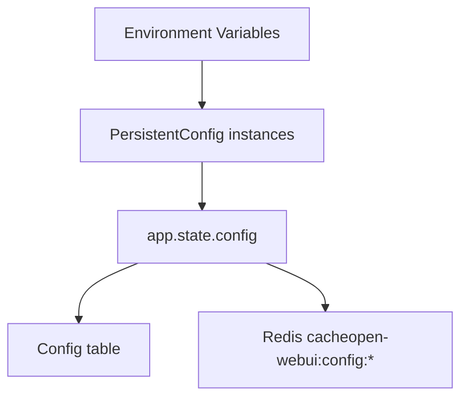
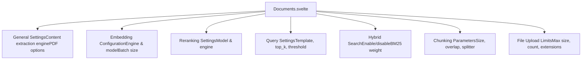

# RAG and Knowledge System

Relevant source files

-   [backend/open\_webui/config.py](https://github.com/open-webui/open-webui/blob/a7271532/backend/open_webui/config.py)
-   [backend/open\_webui/main.py](https://github.com/open-webui/open-webui/blob/a7271532/backend/open_webui/main.py)
-   [backend/open\_webui/retrieval/loaders/datalab\_marker.py](https://github.com/open-webui/open-webui/blob/a7271532/backend/open_webui/retrieval/loaders/datalab_marker.py)
-   [backend/open\_webui/retrieval/loaders/external\_document.py](https://github.com/open-webui/open-webui/blob/a7271532/backend/open_webui/retrieval/loaders/external_document.py)
-   [backend/open\_webui/retrieval/loaders/external\_web.py](https://github.com/open-webui/open-webui/blob/a7271532/backend/open_webui/retrieval/loaders/external_web.py)
-   [backend/open\_webui/retrieval/loaders/main.py](https://github.com/open-webui/open-webui/blob/a7271532/backend/open_webui/retrieval/loaders/main.py)
-   [backend/open\_webui/retrieval/loaders/mineru.py](https://github.com/open-webui/open-webui/blob/a7271532/backend/open_webui/retrieval/loaders/mineru.py)
-   [backend/open\_webui/retrieval/loaders/mistral.py](https://github.com/open-webui/open-webui/blob/a7271532/backend/open_webui/retrieval/loaders/mistral.py)
-   [backend/open\_webui/retrieval/utils.py](https://github.com/open-webui/open-webui/blob/a7271532/backend/open_webui/retrieval/utils.py)
-   [backend/open\_webui/routers/retrieval.py](https://github.com/open-webui/open-webui/blob/a7271532/backend/open_webui/routers/retrieval.py)
-   [backend/open\_webui/utils/middleware.py](https://github.com/open-webui/open-webui/blob/a7271532/backend/open_webui/utils/middleware.py)
-   [src/lib/apis/retrieval/index.ts](https://github.com/open-webui/open-webui/blob/a7271532/src/lib/apis/retrieval/index.ts)
-   [src/lib/components/admin/Settings/Documents.svelte](https://github.com/open-webui/open-webui/blob/a7271532/src/lib/components/admin/Settings/Documents.svelte)
-   [src/lib/components/admin/Settings/WebSearch.svelte](https://github.com/open-webui/open-webui/blob/a7271532/src/lib/components/admin/Settings/WebSearch.svelte)

## Purpose and Scope

This document describes Open WebUI's Retrieval Augmented Generation (RAG) and Knowledge System, which enables the application to augment LLM responses with relevant context from documents, web searches, and knowledge bases. This system handles document ingestion, embedding generation, vector storage, and retrieval operations.

For information about how RAG context is injected into chat requests, see [Backend Processing Pipeline](/open-webui/open-webui/5-message-rendering). For web search-specific configuration, see subsection 6.4 of this page. For file upload and storage mechanics, see [Storage and File Management](/open-webui/open-webui/12-storage-and-file-management).

## System Architecture

The RAG system consists of four main subsystems:

1.  **Document Processing Pipeline**: Extracts text from various file formats
2.  **Embedding and Vector Storage**: Generates embeddings and stores them in vector databases
3.  **Retrieval Engine**: Queries vector stores using hybrid search and reranking
4.  **Web Search Integration**: Fetches and processes web content

```mermaid
flowchart TD
    FileUpload["File Upload"]
    WebURL["Web URL"]
    YouTubeURL["YouTube URL"]
    Loader["Loader(retrieval/loaders/main.py)"]
    TextSplitter["Text SplittersRecursiveCharacterTextSplitterTokenTextSplitterMarkdownHeaderTextSplitter"]
    EmbeddingFunc["get_embedding_function(retrieval/utils.py)"]
    VECTOR_DB_CLIENT["VECTOR_DB_CLIENT(retrieval/vector/factory.py)"]
    Collections["Collections(per file/knowledge base)"]
    query_doc["query_doc"]
    query_doc_with_hybrid_search["query_doc_with_hybrid_search"]
    VectorSearchRetriever["VectorSearchRetriever"]
    BM25Retriever["BM25Retriever"]
    RerankCompressor["RerankCompressor"]
    process_chat_payload["process_chat_payload(utils/middleware.py)"]
    chat_completion_files_handler["chat_completion_files_handler"]

    FileUpload --> Loader
    WebURL --> Loader
    YouTubeURL --> Loader
    Loader --> TextSplitter
    TextSplitter --> EmbeddingFunc
    EmbeddingFunc --> VECTOR_DB_CLIENT
    VECTOR --> DB_CLIENT_Collections
    Collections --> query_doc
    Collections --> query_doc_with_hybrid_search
    query --> doc_with_hybrid_search_VectorSearchRetriever
    query --> doc_with_hybrid_search_BM25Retriever
    query --> doc_with_hybrid_search_RerankCompressor
    process --> chat_payload_chat_completion_files_handler
    chat --> completion_files_handler_query_doc_with_hybrid_search
```


**Sources**: [backend/open\_webui/retrieval/loaders/main.py](https://github.com/open-webui/open-webui/blob/a7271532/backend/open_webui/retrieval/loaders/main.py) [backend/open\_webui/retrieval/utils.py1-900](https://github.com/open-webui/open-webui/blob/a7271532/backend/open_webui/retrieval/utils.py#L1-L900) [backend/open\_webui/utils/middleware.py900-1100](https://github.com/open-webui/open-webui/blob/a7271532/backend/open_webui/utils/middleware.py#L900-L1100)

## Document Processing Pipeline

### Loader Selection and Factory Pattern

The `Loader` class [backend/open\_webui/retrieval/loaders/main.py187-205](https://github.com/open-webui/open-webui/blob/a7271532/backend/open_webui/retrieval/loaders/main.py#L187-L205) acts as a factory that selects the appropriate document loader based on the configured `CONTENT_EXTRACTION_ENGINE` and file type.


**Sources**: [backend/open\_webui/retrieval/loaders/main.py214-370](https://github.com/open-webui/open-webui/blob/a7271532/backend/open_webui/retrieval/loaders/main.py#L214-L370)

### Content Extraction Engines

Each extraction engine is configured through environment variables and `AppConfig` [backend/open\_webui/main.py853-882](https://github.com/open-webui/open-webui/blob/a7271532/backend/open_webui/main.py#L853-L882):

| Engine | Configuration Variables | Supported Formats | Implementation |
| --- | --- | --- | --- |
| **Default** | `PDF_EXTRACT_IMAGES` | PDF, text, CSV, DOCX, PPTX, etc. | PyPDFLoader, TextLoader, various Langchain loaders |
| **External** | `EXTERNAL_DOCUMENT_LOADER_URL`
`EXTERNAL_DOCUMENT_LOADER_API_KEY` | Any (delegated to external service) | [backend/open\_webui/retrieval/loaders/external\_document.py](https://github.com/open-webui/open-webui/blob/a7271532/backend/open_webui/retrieval/loaders/external_document.py) |
| **Tika** | `TIKA_SERVER_URL` | All Apache Tika formats | [backend/open\_webui/retrieval/loaders/main.py93-132](https://github.com/open-webui/open-webui/blob/a7271532/backend/open_webui/retrieval/loaders/main.py#L93-L132) |
| **Datalab Marker** | `DATALAB_MARKER_API_KEY`
`DATALAB_MARKER_API_BASE_URL`
`DATALAB_MARKER_USE_LLM` | PDF, Office docs, images | [backend/open\_webui/retrieval/loaders/datalab\_marker.py](https://github.com/open-webui/open-webui/blob/a7271532/backend/open_webui/retrieval/loaders/datalab_marker.py) |
| **Docling** | `DOCLING_SERVER_URL`
`DOCLING_API_KEY`
`DOCLING_PARAMS` | PDF, Office docs | [backend/open\_webui/retrieval/loaders/main.py134-185](https://github.com/open-webui/open-webui/blob/a7271532/backend/open_webui/retrieval/loaders/main.py#L134-L185) |
| **MinerU** | `MINERU_API_MODE`
`MINERU_API_URL`
`MINERU_API_KEY` | PDF | [backend/open\_webui/retrieval/loaders/mineru.py](https://github.com/open-webui/open-webui/blob/a7271532/backend/open_webui/retrieval/loaders/mineru.py) |
| **Azure Document Intelligence** | `DOCUMENT_INTELLIGENCE_ENDPOINT`
`DOCUMENT_INTELLIGENCE_KEY` | PDF, DOCX, PPTX | AzureAIDocumentIntelligenceLoader |
| **Mistral OCR** | `MISTRAL_OCR_API_BASE_URL`
`MISTRAL_OCR_API_KEY` | PDF, images | [backend/open\_webui/retrieval/loaders/mistral.py](https://github.com/open-webui/open-webui/blob/a7271532/backend/open_webui/retrieval/loaders/mistral.py) |

**Sources**: [backend/open\_webui/retrieval/loaders/main.py187-370](https://github.com/open-webui/open-webui/blob/a7271532/backend/open_webui/retrieval/loaders/main.py#L187-L370) [backend/open\_webui/config.py853-882](https://github.com/open-webui/open-webui/blob/a7271532/backend/open_webui/config.py#L853-L882)

#### Datalab Marker API Integration

The `DatalabMarkerLoader` [backend/open\_webui/retrieval/loaders/datalab\_marker.py13-254](https://github.com/open-webui/open-webui/blob/a7271532/backend/open_webui/retrieval/loaders/datalab_marker.py#L13-L254) supports both cloud (DataLab API) and self-hosted Marker deployments:

1.  **Request submission**: POST to `{api_base_url}` with file and configuration parameters [backend/open\_webui/retrieval/loaders/datalab\_marker.py111-135](https://github.com/open-webui/open-webui/blob/a7271532/backend/open_webui/retrieval/loaders/datalab_marker.py#L111-L135)
2.  **Polling (cloud mode)**: If `request_check_url` is returned, poll until status is "complete" [backend/open\_webui/retrieval/loaders/datalab\_marker.py147-198](https://github.com/open-webui/open-webui/blob/a7271532/backend/open_webui/retrieval/loaders/datalab_marker.py#L147-L198)
3.  **Direct response (self-hosted)**: If `output` field is present, use immediately [backend/open\_webui/retrieval/loaders/datalab\_marker.py212-226](https://github.com/open-webui/open-webui/blob/a7271532/backend/open_webui/retrieval/loaders/datalab_marker.py#L212-L226)

Configuration options include:

-   `use_llm`: Enhanced accuracy with LLM for tables and forms
-   `force_ocr`: Force OCR on all pages
-   `paginate`: Separate pages with horizontal rules
-   `output_format`: `markdown`, `json`, or `html`

**Sources**: [backend/open\_webui/retrieval/loaders/datalab\_marker.py13-254](https://github.com/open-webui/open-webui/blob/a7271532/backend/open_webui/retrieval/loaders/datalab_marker.py#L13-L254)

### Text Splitting

After extraction, documents are split into chunks using configurable text splitters [backend/open\_webui/routers/retrieval.py31-33](https://github.com/open-webui/open-webui/blob/a7271532/backend/open_webui/routers/retrieval.py#L31-L33):


Configuration:

-   `RAG_TEXT_SPLITTER`: Splitter type (`""`, `"token"`, or `"markdown"`)
-   `CHUNK_SIZE`: Default 1500 characters [backend/open\_webui/config.py886](https://github.com/open-webui/open-webui/blob/a7271532/backend/open_webui/config.py#L886-L886)
-   `CHUNK_OVERLAP`: Default 100 characters [backend/open\_webui/config.py887](https://github.com/open-webui/open-webui/blob/a7271532/backend/open_webui/config.py#L887-L887)
-   `TIKTOKEN_ENCODING_NAME`: Encoding for token-based splitting

**Sources**: [backend/open\_webui/routers/retrieval.py31-33](https://github.com/open-webui/open-webui/blob/a7271532/backend/open_webui/routers/retrieval.py#L31-L33) [backend/open\_webui/config.py886-887](https://github.com/open-webui/open-webui/blob/a7271532/backend/open_webui/config.py#L886-L887)

## Embedding Generation

### Embedding Function Architecture

The `get_embedding_function()` [backend/open\_webui/retrieval/utils.py480-600](https://github.com/open-webui/open-webui/blob/a7271532/backend/open_webui/retrieval/utils.py#L480-L600) returns a callable that generates embeddings based on the configured engine:

**Sources**: [backend/open\_webui/retrieval/utils.py480-600](https://github.com/open-webui/open-webui/blob/a7271532/backend/open_webui/retrieval/utils.py#L480-L600)

### Embedding Engine Configuration

The embedding configuration is managed through the `/embedding` endpoint [backend/open\_webui/routers/retrieval.py255-277](https://github.com/open-webui/open-webui/blob/a7271532/backend/open_webui/routers/retrieval.py#L255-L277) and updated via `/embedding/update` [backend/open\_webui/routers/retrieval.py320-432](https://github.com/open-webui/open-webui/blob/a7271532/backend/open_webui/routers/retrieval.py#L320-L432):

| Engine | Model Specification | API Configuration |
| --- | --- | --- |
| **Local** (`""`) | HuggingFace model name/path | N/A - loaded via `SentenceTransformer` |
| **OpenAI** | Model ID (e.g., `text-embedding-3-small`) | `RAG_OPENAI_API_BASE_URL`
`RAG_OPENAI_API_KEY` |
| **Ollama** | Model name (e.g., `nomic-embed-text`) | `RAG_OLLAMA_BASE_URL`
`RAG_OLLAMA_API_KEY` |
| **Azure OpenAI** | Deployment name | `RAG_AZURE_OPENAI_BASE_URL`
`RAG_AZURE_OPENAI_API_KEY`
`RAG_AZURE_OPENAI_API_VERSION` |

Additional parameters:

-   `RAG_EMBEDDING_BATCH_SIZE`: Number of texts to embed in each API call (default: 1)
-   `ENABLE_ASYNC_EMBEDDING`: Enable concurrent embedding generation [backend/open\_webui/routers/retrieval.py262](https://github.com/open-webui/open-webui/blob/a7271532/backend/open_webui/routers/retrieval.py#L262-L262)

**Sources**: [backend/open\_webui/routers/retrieval.py255-432](https://github.com/open-webui/open-webui/blob/a7271532/backend/open_webui/routers/retrieval.py#L255-L432) [backend/open\_webui/config.py889-910](https://github.com/open-webui/open-webui/blob/a7271532/backend/open_webui/config.py#L889-L910)

### Local Embedding Implementation

For local embeddings, the system initializes a `SentenceTransformer` instance [backend/open\_webui/routers/retrieval.py123-143](https://github.com/open-webui/open-webui/blob/a7271532/backend/open_webui/routers/retrieval.py#L123-L143):

```
# Simplified from get_ef()
ef = SentenceTransformer(
    get_model_path(embedding_model, auto_update),
    device=DEVICE_TYPE,
    trust_remote_code=RAG_EMBEDDING_MODEL_TRUST_REMOTE_CODE,
    backend=SENTENCE_TRANSFORMERS_BACKEND,
    model_kwargs=SENTENCE_TRANSFORMERS_MODEL_KWARGS,
)
```
The model is cached in `app.state.ef` [backend/open\_webui/main.py986-1003](https://github.com/open-webui/open-webui/blob/a7271532/backend/open_webui/main.py#L986-L1003) and can be unloaded to free GPU memory [backend/open\_webui/routers/retrieval.py305-318](https://github.com/open-webui/open-webui/blob/a7271532/backend/open_webui/routers/retrieval.py#L305-L318)

**Sources**: [backend/open\_webui/routers/retrieval.py123-143](https://github.com/open-webui/open-webui/blob/a7271532/backend/open_webui/routers/retrieval.py#L123-L143) [backend/open\_webui/main.py986-1003](https://github.com/open-webui/open-webui/blob/a7271532/backend/open_webui/main.py#L986-L1003)

### Embedding Prefixes

The system supports content and query prefixes for improved retrieval [backend/open\_webui/config.py1852-1867](https://github.com/open-webui/open-webui/blob/a7271532/backend/open_webui/config.py#L1852-L1867):

-   `RAG_EMBEDDING_CONTENT_PREFIX`: Prepended to document chunks during indexing
-   `RAG_EMBEDDING_QUERY_PREFIX`: Prepended to queries during search

These are applied in `query_collection()` [backend/open\_webui/retrieval/utils.py427-429](https://github.com/open-webui/open-webui/blob/a7271532/backend/open_webui/retrieval/utils.py#L427-L429) and during document indexing.

**Sources**: [backend/open\_webui/config.py1852-1867](https://github.com/open-webui/open-webui/blob/a7271532/backend/open_webui/config.py#L1852-L1867) [backend/open\_webui/retrieval/utils.py427-429](https://github.com/open-webui/open-webui/blob/a7271532/backend/open_webui/retrieval/utils.py#L427-L429)

## Vector Storage

### Vector Database Client Factory

The `VECTOR_DB_CLIENT` singleton [backend/open\_webui/retrieval/vector/factory.py](https://github.com/open-webui/open-webui/blob/a7271532/backend/open_webui/retrieval/vector/factory.py) is initialized based on the `VECTOR_DB` environment variable:


Each client implements a common interface with methods:

-   `search(collection_name, vectors, limit)`: Vector similarity search
-   `get(collection_name)`: Retrieve all items from a collection
-   `insert(collection_name, items)`: Add documents with embeddings
-   `upsert(collection_name, items)`: Update or insert documents
-   `delete(collection_name, ids)`: Remove specific documents
-   `reset()`: Clear all collections

**Sources**: [backend/open\_webui/retrieval/vector/factory.py](https://github.com/open-webui/open-webui/blob/a7271532/backend/open_webui/retrieval/vector/factory.py) [backend/open\_webui/config.py1830-1850](https://github.com/open-webui/open-webui/blob/a7271532/backend/open_webui/config.py#L1830-L1850)

### Collection Management

Collections are identified by unique names, typically file IDs or knowledge base IDs. The `Files` model [backend/open\_webui/models/files.py](https://github.com/open-webui/open-webui/blob/a7271532/backend/open_webui/models/files.py) stores the `meta.collection_name` for each uploaded file.

Operations:

1.  **Document insertion**: `VECTOR_DB_CLIENT.insert()` adds chunks with their embeddings
2.  **Querying**: `query_doc()` performs vector search on a collection [backend/open\_webui/retrieval/utils.py135-153](https://github.com/open-webui/open-webui/blob/a7271532/backend/open_webui/retrieval/utils.py#L135-L153)
3.  **Retrieval**: `get_doc()` fetches all items without filtering [backend/open\_webui/retrieval/utils.py155-167](https://github.com/open-webui/open-webui/blob/a7271532/backend/open_webui/retrieval/utils.py#L155-L167)
4.  **Deletion**: Collection is deleted when file is removed

**Sources**: [backend/open\_webui/retrieval/utils.py135-167](https://github.com/open-webui/open-webui/blob/a7271532/backend/open_webui/retrieval/utils.py#L135-L167) [backend/open\_webui/models/files.py](https://github.com/open-webui/open-webui/blob/a7271532/backend/open_webui/models/files.py)

## Retrieval Strategies

### Vector Search

The basic vector search implementation [backend/open\_webui/retrieval/utils.py135-153](https://github.com/open-webui/open-webui/blob/a7271532/backend/open_webui/retrieval/utils.py#L135-L153):


Parameters:

-   `collection_name`: Target collection
-   `query_embedding`: Query vector
-   `k`: Number of results (`RAG_TOP_K`, default 4)

**Sources**: [backend/open\_webui/retrieval/utils.py135-153](https://github.com/open-webui/open-webui/blob/a7271532/backend/open_webui/retrieval/utils.py#L135-L153)

### Hybrid Search Architecture

When `ENABLE_RAG_HYBRID_SEARCH` is enabled, the system uses `query_doc_with_hybrid_search()` [backend/open\_webui/retrieval/utils.py207-315](https://github.com/open-webui/open-webui/blob/a7271532/backend/open_webui/retrieval/utils.py#L207-L315) which combines vector similarity with BM25 keyword matching:


Weight configuration:

-   `HYBRID_BM25_WEIGHT`: Weight for BM25 scores (0.0-1.0)
-   Vector search weight: `1.0 - HYBRID_BM25_WEIGHT`
-   If `HYBRID_BM25_WEIGHT = 0`, uses vector search only
-   If `HYBRID_BM25_WEIGHT = 1`, uses BM25 only

**Sources**: [backend/open\_webui/retrieval/utils.py207-315](https://github.com/open-webui/open-webui/blob/a7271532/backend/open_webui/retrieval/utils.py#L207-L315)

### Text Enrichment for BM25

When `ENABLE_RAG_HYBRID_SEARCH_ENRICHED_TEXTS` is enabled, the system enriches texts with metadata before BM25 indexing [backend/open\_webui/retrieval/utils.py169-204](https://github.com/open-webui/open-webui/blob/a7271532/backend/open_webui/retrieval/utils.py#L169-L204):

```
# Simplified from get_enriched_texts()
enriched_parts = [text]

# Add filename (repeated for extra weight)
if metadata.get("name"):
    filename_tokens = filename.replace("_", " ").replace("-", " ")
    enriched_parts.append(f"Filename: {filename} {filename_tokens} {filename_tokens}")

# Add title
if metadata.get("title"):
    enriched_parts.append(f"Title: {metadata['title']}")

# Add section headings
if metadata.get("headings"):
    headings = " > ".join(metadata["headings"])
    enriched_parts.append(f"Section: {headings}")
```
This improves BM25 matching by incorporating file names, titles, and document structure.

**Sources**: [backend/open\_webui/retrieval/utils.py169-204](https://github.com/open-webui/open-webui/blob/a7271532/backend/open_webui/retrieval/utils.py#L169-L204)

### Reranking

The reranking function is initialized via `get_rf()` [backend/open\_webui/routers/retrieval.py146-216](https://github.com/open-webui/open-webui/blob/a7271532/backend/open_webui/routers/retrieval.py#L146-L216):

| Engine | Model Type | Implementation |
| --- | --- | --- |
| **Local** | CrossEncoder | `sentence_transformers.CrossEncoder` |
| **ColBERT** | Late interaction | `ColBERT` class in [backend/open\_webui/retrieval/models/colbert.py](https://github.com/open-webui/open-webui/blob/a7271532/backend/open_webui/retrieval/models/colbert.py) |
| **External** | External API | `ExternalReranker` in [backend/open\_webui/retrieval/models/external.py](https://github.com/open-webui/open-webui/blob/a7271532/backend/open_webui/retrieval/models/external.py) |

Configuration:

-   `RAG_RERANKING_ENGINE`: `""` (local), `"external"`, or auto-detected for ColBERT models
-   `RAG_RERANKING_MODEL`: Model identifier
-   `RAG_TOP_K_RERANKER`: Number of results after reranking (default: 4)
-   `RAG_RELEVANCE_THRESHOLD`: Minimum relevance score (0.0-1.0)

The `RerankCompressor` [backend/open\_webui/retrieval/utils.py640-750](https://github.com/open-webui/open-webui/blob/a7271532/backend/open_webui/retrieval/utils.py#L640-L750) applies reranking and filters by relevance threshold.

**Sources**: [backend/open\_webui/routers/retrieval.py146-216](https://github.com/open-webui/open-webui/blob/a7271532/backend/open_webui/routers/retrieval.py#L146-L216) [backend/open\_webui/retrieval/utils.py640-750](https://github.com/open-webui/open-webui/blob/a7271532/backend/open_webui/retrieval/utils.py#L640-L750)

## Web Search Integration

### Search Provider Architecture

The web search system [backend/open\_webui/routers/retrieval.py710-1116](https://github.com/open-webui/open-webui/blob/a7271532/backend/open_webui/routers/retrieval.py#L710-L1116) supports multiple search engines configured via `WEB_SEARCH_ENGINE`:

```mermaid
flowchart TD
    SearchEngine["WEB_SEARCH_ENGINE"]
    OllamaCloud["search_ollama_cloudretrieval/web/ollama.py"]
    PerplexitySearch["search_perplexity_searchretrieval/web/perplexity_search.py"]
    Brave["search_braveretrieval/web/brave.py"]
    Kagi["search_kagiretrieval/web/kagi.py"]
    SearXNG["search_searxngretrieval/web/searxng.py"]
    DuckDuckGo["search_duckduckgoretrieval/web/duckduckgo.py"]
    GooglePSE["search_google_pseretrieval/web/google_pse.py"]
    Tavily["search_tavilyretrieval/web/tavily.py"]
    Bing["search_bingretrieval/web/bing.py"]
    External["search_externalretrieval/web/external.py"]

    SearchEngine --> OllamaCloud
    SearchEngine --> PerplexitySearch
    SearchEngine --> Brave
    SearchEngine --> Kagi
    SearchEngine --> SearXNG
    SearchEngine --> DuckDuckGo
    SearchEngine --> GooglePSE
    SearchEngine --> Tavily
    SearchEngine --> Bing
    SearchEngine --> External
```


Each provider returns a list of `SearchResult` objects with `link`, `title`, and `snippet` fields.

**Sources**: [backend/open\_webui/routers/retrieval.py710-1116](https://github.com/open-webui/open-webui/blob/a7271532/backend/open_webui/routers/retrieval.py#L710-L1116) [backend/open\_webui/retrieval/web/main.py](https://github.com/open-webui/open-webui/blob/a7271532/backend/open_webui/retrieval/web/main.py)

### Web Search Processing Flow

The `process_web_search()` endpoint [backend/open\_webui/routers/retrieval.py1066-1116](https://github.com/open-webui/open-webui/blob/a7271532/backend/open_webui/routers/retrieval.py#L1066-L1116) orchestrates the complete web search and indexing flow:


Configuration:

-   `WEB_SEARCH_RESULT_COUNT`: Maximum results per query
-   `WEB_SEARCH_CONCURRENT_REQUESTS`: Parallel search requests
-   `WEB_SEARCH_DOMAIN_FILTER_LIST`: Allowed domains (whitelist)
-   `BYPASS_WEB_SEARCH_EMBEDDING_AND_RETRIEVAL`: Skip vector storage, return text directly
-   `BYPASS_WEB_SEARCH_WEB_LOADER`: Use search snippets instead of loading full content

**Sources**: [backend/open\_webui/routers/retrieval.py1066-1116](https://github.com/open-webui/open-webui/blob/a7271532/backend/open_webui/routers/retrieval.py#L1066-L1116)

### Web Content Loading

After search results are obtained, content is loaded via `get_web_loader()` [backend/open\_webui/retrieval/web/utils.py](https://github.com/open-webui/open-webui/blob/a7271532/backend/open_webui/retrieval/web/utils.py):

| Loader | Configuration | Use Case |
| --- | --- | --- |
| **Playwright** | `PLAYWRIGHT_WS_URL` | JavaScript-rendered pages |
| **Firecrawl** | `FIRECRAWL_API_BASE_URL`
`FIRECRAWL_API_KEY` | Cleaned, structured content |
| **Tavily** | `TAVILY_API_KEY`
`TAVILY_EXTRACT_DEPTH` | Deep content extraction |
| **External** | `EXTERNAL_WEB_LOADER_URL`
`EXTERNAL_WEB_LOADER_API_KEY` | Custom loader service |
| **WebBaseLoader** | N/A | Default HTML parsing |

The loader is selected via `WEB_LOADER_ENGINE` configuration.

**Sources**: [backend/open\_webui/retrieval/web/utils.py](https://github.com/open-webui/open-webui/blob/a7271532/backend/open_webui/retrieval/web/utils.py) [backend/open\_webui/config.py971-976](https://github.com/open-webui/open-webui/blob/a7271532/backend/open_webui/config.py#L971-L976)

### YouTube Content Loading

YouTube URLs are detected and handled by `YoutubeLoader` [backend/open\_webui/retrieval/loaders/youtube.py](https://github.com/open-webui/open-webui/blob/a7271532/backend/open_webui/retrieval/loaders/youtube.py):

Configuration:

-   `YOUTUBE_LOADER_LANGUAGE`: Preferred transcript languages (list)
-   `YOUTUBE_LOADER_PROXY_URL`: Proxy for fetching transcripts

The loader extracts video transcripts and returns them as documents with metadata including video title and URL.

**Sources**: [backend/open\_webui/retrieval/loaders/youtube.py](https://github.com/open-webui/open-webui/blob/a7271532/backend/open_webui/retrieval/loaders/youtube.py) [backend/open\_webui/retrieval/utils.py60-79](https://github.com/open-webui/open-webui/blob/a7271532/backend/open_webui/retrieval/utils.py#L60-L79)

## Configuration and Management

### Backend Configuration Structure

RAG configuration is managed through the `AppConfig` instance [backend/open\_webui/config.py224-284](https://github.com/open-webui/open-webui/blob/a7271532/backend/open_webui/config.py#L224-L284) which synchronizes settings between the database and Redis:


Key configuration endpoints:

-   `GET /retrieval/config`: Retrieve all RAG settings [backend/open\_webui/routers/retrieval.py434-559](https://github.com/open-webui/open-webui/blob/a7271532/backend/open_webui/routers/retrieval.py#L434-L559)
-   `POST /retrieval/config/update`: Update RAG configuration [backend/open\_webui/routers/retrieval.py561-708](https://github.com/open-webui/open-webui/blob/a7271532/backend/open_webui/routers/retrieval.py#L561-L708)
-   `GET /retrieval/embedding`: Get embedding configuration [backend/open\_webui/routers/retrieval.py255-277](https://github.com/open-webui/open-webui/blob/a7271532/backend/open_webui/routers/retrieval.py#L255-L277)
-   `POST /retrieval/embedding/update`: Update embedding model [backend/open\_webui/routers/retrieval.py320-432](https://github.com/open-webui/open-webui/blob/a7271532/backend/open_webui/routers/retrieval.py#L320-L432)

**Sources**: [backend/open\_webui/config.py224-284](https://github.com/open-webui/open-webui/blob/a7271532/backend/open_webui/config.py#L224-L284) [backend/open\_webui/routers/retrieval.py434-708](https://github.com/open-webui/open-webui/blob/a7271532/backend/open_webui/routers/retrieval.py#L434-L708)

### Frontend Configuration UI

The admin settings UI is implemented in `Documents.svelte` [src/lib/components/admin/Settings/Documents.svelte1-1000](https://github.com/open-webui/open-webui/blob/a7271532/src/lib/components/admin/Settings/Documents.svelte#L1-L1000):


The UI calls:

-   `getEmbeddingConfig()` and `updateEmbeddingConfig()` [src/lib/apis/retrieval/index.ts156-230](https://github.com/open-webui/open-webui/blob/a7271532/src/lib/apis/retrieval/index.ts#L156-L230)
-   `getRAGConfig()` and `updateRAGConfig()` [src/lib/apis/retrieval/index.ts3-91](https://github.com/open-webui/open-webui/blob/a7271532/src/lib/apis/retrieval/index.ts#L3-L91)
-   `updateQuerySettings()` for query parameters [src/lib/apis/retrieval/index.ts126-154](https://github.com/open-webui/open-webui/blob/a7271532/src/lib/apis/retrieval/index.ts#L126-L154)

**Sources**: [src/lib/components/admin/Settings/Documents.svelte1-1000](https://github.com/open-webui/open-webui/blob/a7271532/src/lib/components/admin/Settings/Documents.svelte#L1-L1000) [src/lib/apis/retrieval/index.ts1-500](https://github.com/open-webui/open-webui/blob/a7271532/src/lib/apis/retrieval/index.ts#L1-L500)

### Web Search Configuration UI

The web search settings are managed in `WebSearch.svelte` [src/lib/components/admin/Settings/WebSearch.svelte1-700](https://github.com/open-webui/open-webui/blob/a7271532/src/lib/components/admin/Settings/WebSearch.svelte#L1-L700):

Features:

-   Search engine selection (18+ providers)
-   Provider-specific API key/URL configuration
-   Web loader engine selection
-   Domain filtering
-   YouTube loader configuration
-   Result count and concurrency settings

**Sources**: [src/lib/components/admin/Settings/WebSearch.svelte1-700](https://github.com/open-webui/open-webui/blob/a7271532/src/lib/components/admin/Settings/WebSearch.svelte#L1-L700)

## RAG Integration in Chat Flow

### Request Processing Integration

The RAG system is integrated into the chat pipeline via `process_chat_payload()` [backend/open\_webui/utils/middleware.py1005-1700](https://github.com/open-webui/open-webui/blob/a7271532/backend/open_webui/utils/middleware.py#L1005-L1700):

> **[Mermaid sequence]**
> *(图表结构无法解析)*

**Sources**: [backend/open\_webui/utils/middleware.py1005-1700](https://github.com/open-webui/open-webui/blob/a7271532/backend/open_webui/utils/middleware.py#L1005-L1700)

### File-based RAG Context Injection

The `chat_completion_files_handler()` [backend/open\_webui/utils/middleware.py1005-1228](https://github.com/open-webui/open-webui/blob/a7271532/backend/open_webui/utils/middleware.py#L1005-L1228) processes attached files:

1.  **Extract file metadata**: Collection names from `metadata.files`
2.  **Generate queries**: If `ENABLE_RETRIEVAL_QUERY_GENERATION`, use LLM to generate optimal queries
3.  **Retrieve context**: Call `query_collection()` or `query_collection_with_hybrid_search()`
4.  **Format context**: Apply `RAG_TEMPLATE` to structure context with sources
5.  **Inject into prompt**: Add formatted context to the first user message

Template variables:

-   `{{CONTEXT}}`: Retrieved document chunks
-   `{{SOURCES}}`: Optional source citations

Default template [backend/open\_webui/config.py1755-1765](https://github.com/open-webui/open-webui/blob/a7271532/backend/open_webui/config.py#L1755-L1765):

```
Use the following context as your learned knowledge, inside <context></context> XML tags.
<context>
{{CONTEXT}}
</context>

When answer to user:
- If you don't know, just say that you don't know.
- If you don't know when you are not sure, ask for clarification.
Avoid mentioning that you obtained the information from the context.
And answer according to the language of the user's question.
```
**Sources**: [backend/open\_webui/utils/middleware.py1005-1228](https://github.com/open-webui/open-webui/blob/a7271532/backend/open_webui/utils/middleware.py#L1005-L1228) [backend/open\_webui/config.py1755-1765](https://github.com/open-webui/open-webui/blob/a7271532/backend/open_webui/config.py#L1755-L1765)

### Query Generation

When `ENABLE_RETRIEVAL_QUERY_GENERATION` is enabled, the system calls `generate_queries()` [backend/open\_webui/routers/tasks.py](https://github.com/open-webui/open-webui/blob/a7271532/backend/open_webui/routers/tasks.py) to create optimized search queries:

```
# Task model generates structured queries
payload = {
    "model": task_model_id,
    "messages": [
        {"role": "system", "content": QUERY_GENERATION_PROMPT_TEMPLATE},
        {"role": "user", "content": user_message}
    ]
}
```
The generated queries are used for both vector search and web search to improve retrieval quality.

**Sources**: [backend/open\_webui/utils/middleware.py1042-1086](https://github.com/open-webui/open-webui/blob/a7271532/backend/open_webui/utils/middleware.py#L1042-L1086) [backend/open\_webui/routers/tasks.py](https://github.com/open-webui/open-webui/blob/a7271532/backend/open_webui/routers/tasks.py)

### Bypass Options

The system provides bypass options to skip certain processing steps:

| Configuration | Effect | Use Case |
| --- | --- | --- |
| `BYPASS_EMBEDDING_AND_RETRIEVAL` | Skip vector storage, use raw text | Simple keyword matching |
| `BYPASS_WEB_SEARCH_EMBEDDING_AND_RETRIEVAL` | Return search snippets directly | Fast web search without indexing |
| `BYPASS_WEB_SEARCH_WEB_LOADER` | Use snippets instead of loading full pages | Reduce latency for web search |
| `RAG_FULL_CONTEXT` | Return all chunks without ranking | Debugging or full document context |

**Sources**: [backend/open\_webui/config.py845-851](https://github.com/open-webui/open-webui/blob/a7271532/backend/open_webui/config.py#L845-L851) [backend/open\_webui/utils/middleware.py1005-1228](https://github.com/open-webui/open-webui/blob/a7271532/backend/open_webui/utils/middleware.py#L1005-L1228)
