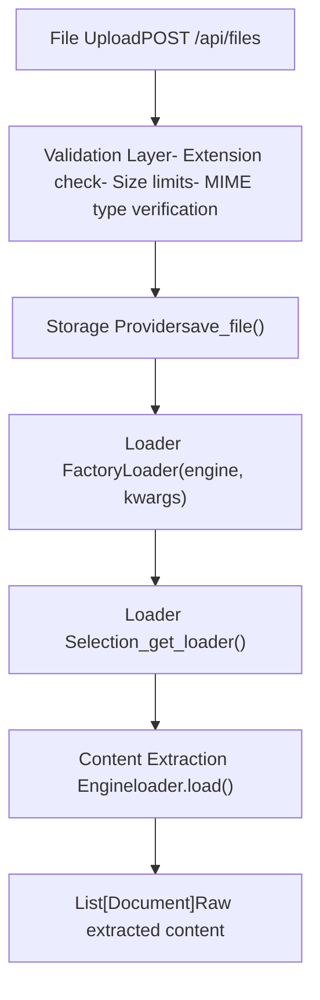
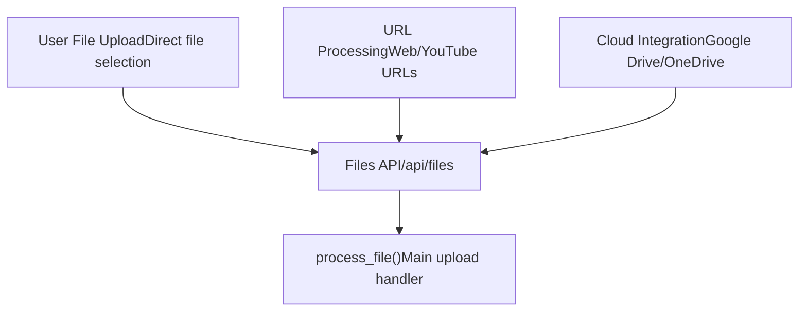
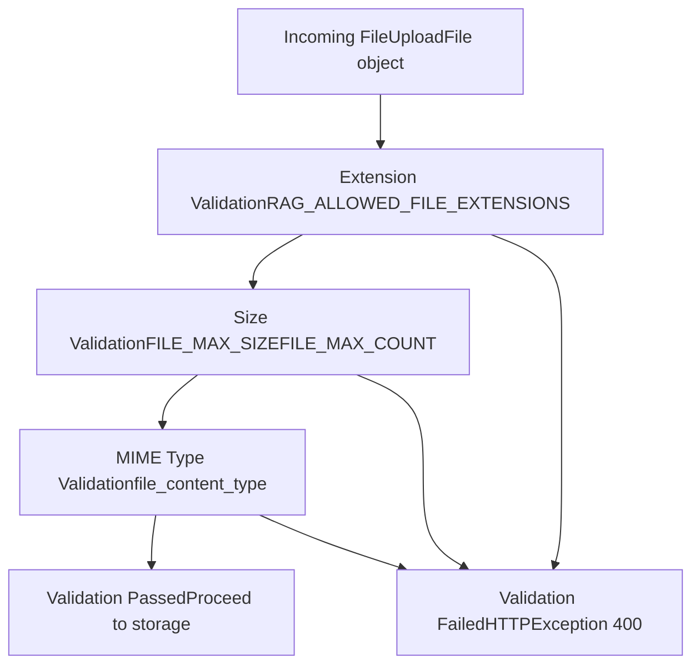
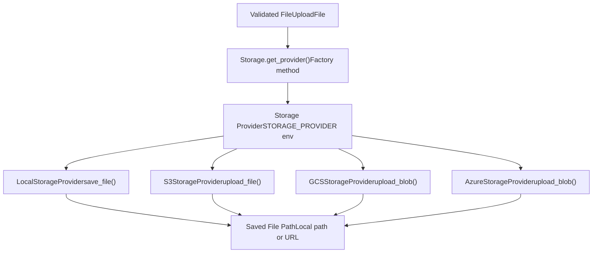
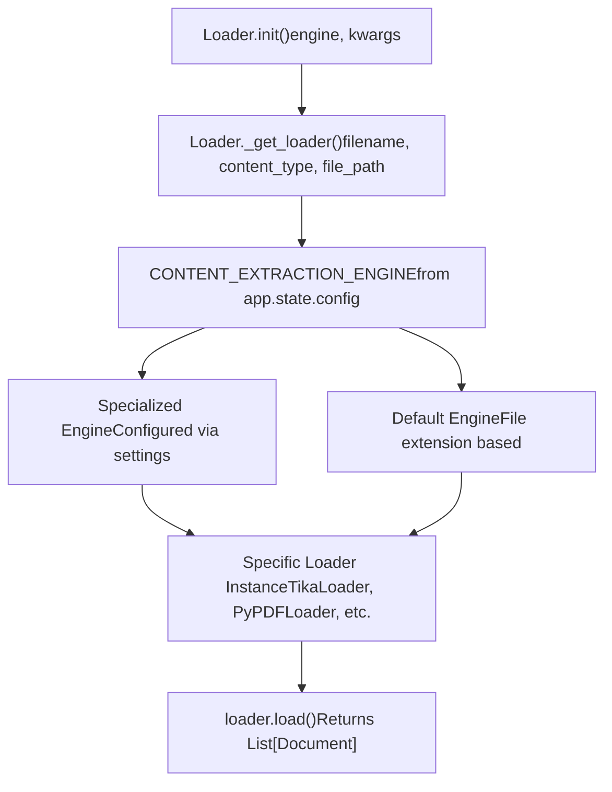
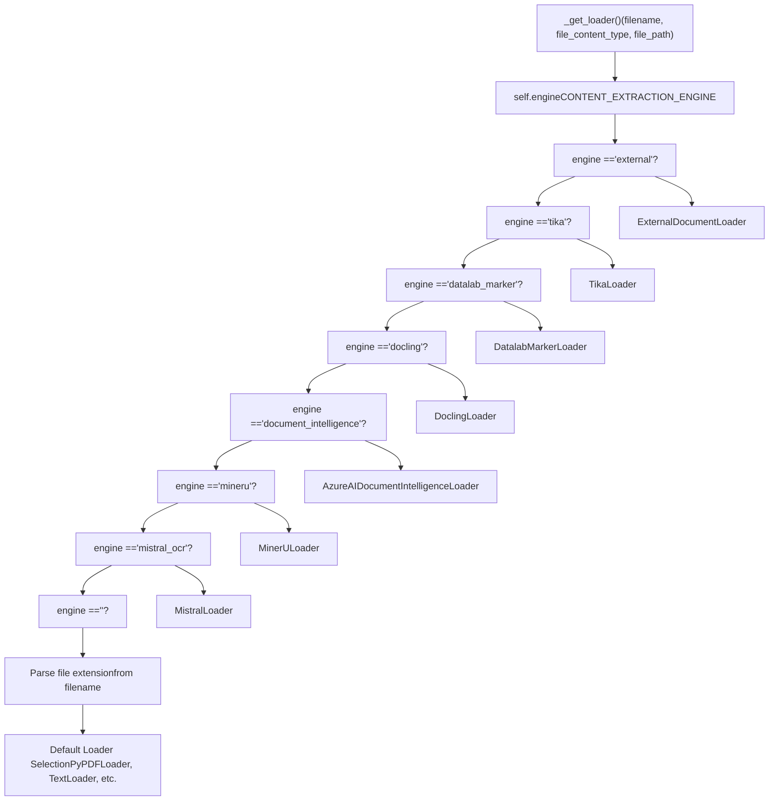
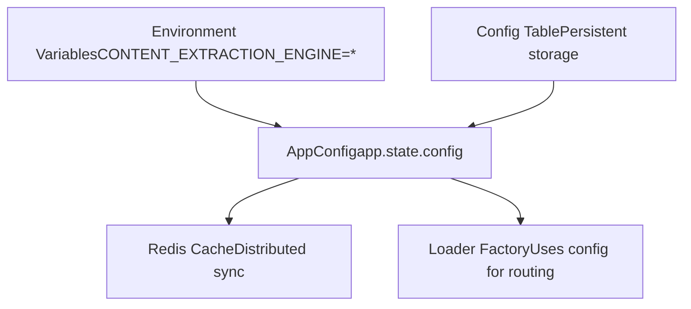
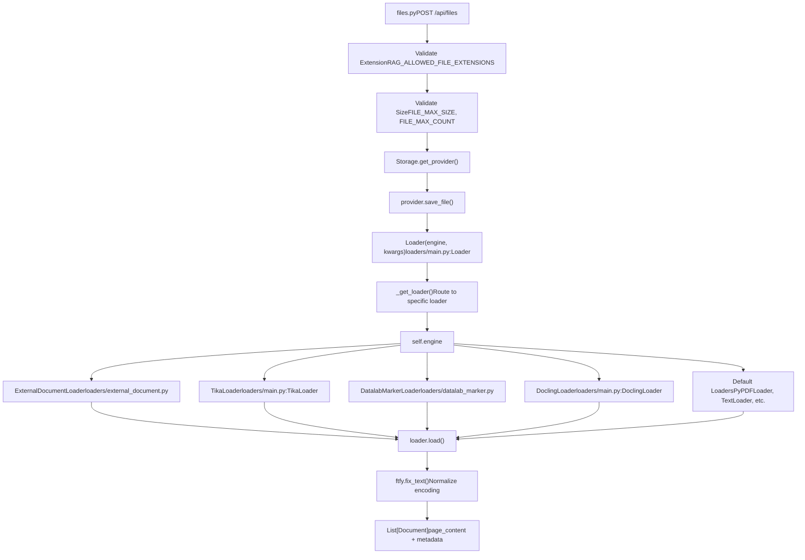

# Document Ingestion Pipeline

Relevant source files

-   [backend/open\_webui/config.py](https://github.com/open-webui/open-webui/blob/a7271532/backend/open_webui/config.py)
-   [backend/open\_webui/main.py](https://github.com/open-webui/open-webui/blob/a7271532/backend/open_webui/main.py)
-   [backend/open\_webui/retrieval/loaders/datalab\_marker.py](https://github.com/open-webui/open-webui/blob/a7271532/backend/open_webui/retrieval/loaders/datalab_marker.py)
-   [backend/open\_webui/retrieval/loaders/external\_document.py](https://github.com/open-webui/open-webui/blob/a7271532/backend/open_webui/retrieval/loaders/external_document.py)
-   [backend/open\_webui/retrieval/loaders/external\_web.py](https://github.com/open-webui/open-webui/blob/a7271532/backend/open_webui/retrieval/loaders/external_web.py)
-   [backend/open\_webui/retrieval/loaders/main.py](https://github.com/open-webui/open-webui/blob/a7271532/backend/open_webui/retrieval/loaders/main.py)
-   [backend/open\_webui/retrieval/loaders/mineru.py](https://github.com/open-webui/open-webui/blob/a7271532/backend/open_webui/retrieval/loaders/mineru.py)
-   [backend/open\_webui/retrieval/loaders/mistral.py](https://github.com/open-webui/open-webui/blob/a7271532/backend/open_webui/retrieval/loaders/mistral.py)
-   [backend/open\_webui/retrieval/utils.py](https://github.com/open-webui/open-webui/blob/a7271532/backend/open_webui/retrieval/utils.py)
-   [backend/open\_webui/routers/retrieval.py](https://github.com/open-webui/open-webui/blob/a7271532/backend/open_webui/routers/retrieval.py)
-   [backend/open\_webui/utils/middleware.py](https://github.com/open-webui/open-webui/blob/a7271532/backend/open_webui/utils/middleware.py)
-   [src/lib/apis/retrieval/index.ts](https://github.com/open-webui/open-webui/blob/a7271532/src/lib/apis/retrieval/index.ts)
-   [src/lib/components/admin/Settings/Documents.svelte](https://github.com/open-webui/open-webui/blob/a7271532/src/lib/components/admin/Settings/Documents.svelte)
-   [src/lib/components/admin/Settings/WebSearch.svelte](https://github.com/open-webui/open-webui/blob/a7271532/src/lib/components/admin/Settings/WebSearch.svelte)

## Purpose and Scope

This document describes the document ingestion pipeline in Open WebUI, covering the flow from file upload through validation and routing to content extraction engines. This is the entry point of the RAG system, preparing documents for subsequent processing stages.

For content extraction engine implementations, see page 7.2. For text splitting and chunking, see page 7.3. For embedding generation, see page 7.4.

## Ingestion Pipeline Overview

The document ingestion pipeline handles the initial stages of document processing: receiving files, validating them, and routing them to appropriate extraction engines. The complete ingestion flow consists of:


**Sources:** [backend/open\_webui/routers/retrieval.py1-117](https://github.com/open-webui/open-webui/blob/a7271532/backend/open_webui/routers/retrieval.py#L1-L117) [backend/open\_webui/retrieval/loaders/main.py184-204](https://github.com/open-webui/open-webui/blob/a7271532/backend/open_webui/retrieval/loaders/main.py#L184-L204)

## File Upload Flow

### Upload Entry Points

Documents enter the ingestion pipeline through the Files API, which provides multiple upload mechanisms:


| Input Method | API Endpoint | Handler Function | Special Processing |
| --- | --- | --- | --- |
| Direct Upload | `POST /api/files` | `upload_file()` | Multipart form data |
| Web URL | `POST /api/retrieval/process/web` | `process_web()` | Web loader integration |
| YouTube URL | `POST /api/retrieval/process/youtube` | `process_youtube()` | Transcript extraction |
| Google Drive | Drive API integration | `process_drive_file()` | OAuth authentication |
| OneDrive | OneDrive API integration | `process_onedrive_file()` | OAuth authentication |

**Sources:** [backend/open\_webui/routers/files.py1-50](https://github.com/open-webui/open-webui/blob/a7271532/backend/open_webui/routers/files.py#L1-L50) [backend/open\_webui/routers/retrieval.py237-262](https://github.com/open-webui/open-webui/blob/a7271532/backend/open_webui/routers/retrieval.py#L237-L262)

### File Validation Layer

The ingestion pipeline implements multi-level validation to ensure file safety and compatibility:

**Validation Stages Diagram**


**Validation Configuration**

| Configuration Variable | Default | Purpose | Location |
| --- | --- | --- | --- |
| `ALLOWED_FILE_EXTENSIONS` | 40+ extensions | Whitelist of permitted file types | [backend/open\_webui/config.py842](https://github.com/open-webui/open-webui/blob/a7271532/backend/open_webui/config.py#L842-L842) |
| `FILE_MAX_SIZE` | Configurable | Maximum file size in bytes | [backend/open\_webui/config.py843](https://github.com/open-webui/open-webui/blob/a7271532/backend/open_webui/config.py#L843-L843) |
| `FILE_MAX_COUNT` | Configurable | Maximum files per upload | [backend/open\_webui/config.py844](https://github.com/open-webui/open-webui/blob/a7271532/backend/open_webui/config.py#L844-L844) |
| `FILE_IMAGE_COMPRESSION_WIDTH` | Configurable | Image compression dimensions | [backend/open\_webui/config.py845](https://github.com/open-webui/open-webui/blob/a7271532/backend/open_webui/config.py#L845-L845) |
| `FILE_IMAGE_COMPRESSION_HEIGHT` | Configurable | Image compression dimensions | [backend/open\_webui/config.py846](https://github.com/open-webui/open-webui/blob/a7271532/backend/open_webui/config.py#L846-L846) |

**Supported File Extensions by Category**

| Category | Extensions |
| --- | --- |
| Documents | `pdf`, `doc`, `docx`, `odt`, `rtf` |
| Spreadsheets | `xls`, `xlsx`, `ods`, `csv` |
| Presentations | `ppt`, `pptx`, `odp` |
| Text | `txt`, `md`, `rst`, `xml`, `html` |
| Archives | `epub` |
| Images | `png`, `jpg`, `jpeg`, `gif`, `webp`, `tiff` |
| Source Code | `py`, `js`, `java`, `cpp`, `c`, `h`, `go`, `rs`, etc. |
| Messages | `msg` (Outlook) |

**Sources:** [backend/open\_webui/config.py842-846](https://github.com/open-webui/open-webui/blob/a7271532/backend/open_webui/config.py#L842-L846) [backend/open\_webui/routers/files.py1-100](https://github.com/open-webui/open-webui/blob/a7271532/backend/open_webui/routers/files.py#L1-L100)

## Storage Provider Integration

After validation, files are persisted using the storage provider abstraction before extraction:

**Storage Flow Diagram**


**Storage Provider Configuration**

| Provider | Environment Variable | Additional Configuration |
| --- | --- | --- |
| Local | `STORAGE_PROVIDER=local` | `UPLOAD_DIR` path |
| Amazon S3 | `STORAGE_PROVIDER=s3` | AWS credentials, bucket name |
| Google Cloud Storage | `STORAGE_PROVIDER=gcs` | GCS credentials, bucket name |
| Azure Blob Storage | `STORAGE_PROVIDER=azure` | Azure credentials, container name |

The storage provider returns a file path (local) or reference that is then used by the loader factory for content extraction.

**Sources:** [backend/open\_webui/storage/provider.py1-100](https://github.com/open-webui/open-webui/blob/a7271532/backend/open_webui/storage/provider.py#L1-L100) [backend/open\_webui/config.py342](https://github.com/open-webui/open-webui/blob/a7271532/backend/open_webui/config.py#L342-L342)

## Loader Factory and Routing

The `Loader` class implements a factory pattern that routes files to appropriate extraction engines based on configuration and file type.

**Loader Factory Architecture**


**Sources:** [backend/open\_webui/retrieval/loaders/main.py184-211](https://github.com/open-webui/open-webui/blob/a7271532/backend/open_webui/retrieval/loaders/main.py#L184-L211)

### Engine Selection Decision Tree

The routing logic prioritizes configured extraction engines over default loaders:


**Sources:** [backend/open\_webui/retrieval/loaders/main.py211-369](https://github.com/open-webui/open-webui/blob/a7271532/backend/open_webui/retrieval/loaders/main.py#L211-L369)

### Default Loader Mapping

When no extraction engine is configured (`CONTENT_EXTRACTION_ENGINE=''`), the factory routes to native Python loaders based on file extension:

| File Extension | Loader Class | Source |
| --- | --- | --- |
| `.pdf` | `PyPDFLoader` | langchain\_community |
| `.txt`, `.md`, `.py`, source code | `TextLoader` | langchain\_community |
| `.csv` | `CSVLoader` | langchain\_community |
| `.doc`, `.docx` | `Docx2txtLoader` | langchain\_community |
| `.html`, `.htm` | `BSHTMLLoader` | langchain\_community |
| `.xls`, `.xlsx` | `UnstructuredExcelLoader` | langchain\_community |
| `.ppt`, `.pptx` | `UnstructuredPowerPointLoader` | langchain\_community |
| `.odt` | `UnstructuredODTLoader` | langchain\_community |
| `.rst` | `UnstructuredRSTLoader` | langchain\_community |
| `.xml` | `UnstructuredXMLLoader` | langchain\_community |
| `.epub` | `UnstructuredEPubLoader` | langchain\_community |
| `.msg` | `OutlookMessageLoader` | langchain\_community |

**Text File Detection Logic**

The loader factory includes special logic for identifying text-based files:

```
def _is_text_file(self, file_ext: str, file_content_type: str) -> bool:
    return file_ext in known_source_ext or (
        file_content_type
        and file_content_type.find("text/") >= 0
        and not file_content_type.find("html") >= 0
    )
```
This ensures source code files and plain text files use `TextLoader` with automatic encoding detection, preventing extraction failures from encoding issues.

**Sources:** [backend/open\_webui/retrieval/loaders/main.py38-90](https://github.com/open-webui/open-webui/blob/a7271532/backend/open_webui/retrieval/loaders/main.py#L38-L90) [backend/open\_webui/retrieval/loaders/main.py203-210](https://github.com/open-webui/open-webui/blob/a7271532/backend/open_webui/retrieval/loaders/main.py#L203-L210) [backend/open\_webui/retrieval/loaders/main.py356-369](https://github.com/open-webui/open-webui/blob/a7271532/backend/open_webui/retrieval/loaders/main.py#L356-L369)

## Content Extraction Engines Overview

Content extraction engines are specialized components that convert raw file data into structured text. The ingestion pipeline routes to these engines based on the `CONTENT_EXTRACTION_ENGINE` configuration.

**Available Engines Summary**

| Engine | Identifier | Primary Use Case | Configuration Required |
| --- | --- | --- | --- |
| Default | `''` (empty) | General-purpose, no external service | `PDF_EXTRACT_IMAGES` |
| Apache Tika | `tika` | Universal document parsing | `TIKA_SERVER_URL` |
| Datalab Marker | `datalab_marker` | Advanced PDF with LLM enhancement | `DATALAB_MARKER_API_KEY` |
| Docling | `docling` | Document conversion service | `DOCLING_SERVER_URL` |
| MinerU | `mineru` | PDF processing with OCR/formula detection | `MINERU_API_MODE`, `MINERU_API_URL` |
| Azure Document Intelligence | `document_intelligence` | Enterprise document analysis | `DOCUMENT_INTELLIGENCE_ENDPOINT` |
| Mistral OCR | `mistral_ocr` | Vision model-based OCR | `MISTRAL_OCR_API_KEY` |
| External | `external` | Custom HTTP endpoint | `EXTERNAL_DOCUMENT_LOADER_URL` |

**Engine Configuration Storage**


Engine configuration is managed through the `AppConfig` class, which supports:

-   Initial values from environment variables
-   Persistent storage in the database
-   Runtime updates via admin API (`/api/retrieval/config/update`)
-   Cross-instance synchronization via Redis

For detailed information about each engine's implementation, protocol, and capabilities, see page 7.2 Content Extraction Engines.

**Sources:** [backend/open\_webui/config.py857-882](https://github.com/open-webui/open-webui/blob/a7271532/backend/open_webui/config.py#L857-L882) [backend/open\_webui/retrieval/loaders/main.py184-369](https://github.com/open-webui/open-webui/blob/a7271532/backend/open_webui/retrieval/loaders/main.py#L184-L369) [backend/open\_webui/routers/retrieval.py459-482](https://github.com/open-webui/open-webui/blob/a7271532/backend/open_webui/routers/retrieval.py#L459-L482)

## Document Output Format

The ingestion pipeline outputs documents in a standardized format for subsequent processing stages:

**Document Structure**

```
class Document(BaseModel):
    page_content: str      # Extracted text content
    metadata: dict         # File metadata and extraction info
```
**Common Metadata Fields**

| Field | Description | Source |
| --- | --- | --- |
| `source` | Original filename or URL | All loaders |
| `file_path` | Storage location | File system loaders |
| `Content-Type` | MIME type | HTTP-based loaders |
| `page` | Page number (for multi-page documents) | PDF loaders |
| `name` | Human-readable name | Knowledge system |
| `collection_name` | Associated collection | RAG system |

**Text Content Normalization**

After extraction, the ingestion pipeline applies text normalization using `ftfy.fix_text()`:

```
def load(self, filename: str, file_content_type: str, file_path: str) -> list[Document]:
    loader = self._get_loader(filename, file_content_type, file_path)
    docs = loader.load()

    return [
        Document(
            page_content=ftfy.fix_text(doc.page_content),
            metadata=doc.metadata
        )
        for doc in docs
    ]
```
This fixes common encoding issues (Unicode, legacy encodings, mojibake) ensuring clean text for downstream processing.

Text splitting and chunking occur after ingestion. For details, see page 7.3 Text Splitting and Chunking.

**Sources:** [backend/open\_webui/retrieval/loaders/main.py193-204](https://github.com/open-webui/open-webui/blob/a7271532/backend/open_webui/retrieval/loaders/main.py#L193-L204)

## Complete Ingestion Flow

The following diagram shows the end-to-end ingestion flow with code entities:

**Ingestion Pipeline Code Flow**


**Key Classes and Methods**

| Component | File Path | Key Methods |
| --- | --- | --- |
| `Loader` | [backend/open\_webui/retrieval/loaders/main.py184](https://github.com/open-webui/open-webui/blob/a7271532/backend/open_webui/retrieval/loaders/main.py#L184-L184) | `__init__()`, `load()`, `_get_loader()`, `_is_text_file()` |
| `TikaLoader` | [backend/open\_webui/retrieval/loaders/main.py92](https://github.com/open-webui/open-webui/blob/a7271532/backend/open_webui/retrieval/loaders/main.py#L92-L92) | `__init__()`, `load()` |
| `DoclingLoader` | [backend/open\_webui/retrieval/loaders/main.py133](https://github.com/open-webui/open-webui/blob/a7271532/backend/open_webui/retrieval/loaders/main.py#L133-L133) | `__init__()`, `load()` |
| `DatalabMarkerLoader` | [backend/open\_webui/retrieval/loaders/datalab\_marker.py13](https://github.com/open-webui/open-webui/blob/a7271532/backend/open_webui/retrieval/loaders/datalab_marker.py#L13-L13) | `__init__()`, `load()`, `check_marker_request_status()` |
| `MinerULoader` | [backend/open\_webui/retrieval/loaders/mineru.py14](https://github.com/open-webui/open-webui/blob/a7271532/backend/open_webui/retrieval/loaders/mineru.py#L14-L14) | `__init__()`, `load()`, `_load_local_api()`, `_load_cloud_api()` |
| `MistralLoader` | [backend/open\_webui/retrieval/loaders/mistral.py18](https://github.com/open-webui/open-webui/blob/a7271532/backend/open_webui/retrieval/loaders/mistral.py#L18-L18) | `__init__()`, `load()`, `load_async()` |
| `ExternalDocumentLoader` | [backend/open\_webui/retrieval/loaders/external\_document.py13](https://github.com/open-webui/open-webui/blob/a7271532/backend/open_webui/retrieval/loaders/external_document.py#L13-L13) | `__init__()`, `load()` |

**Sources:** [backend/open\_webui/retrieval/loaders/main.py184-369](https://github.com/open-webui/open-webui/blob/a7271532/backend/open_webui/retrieval/loaders/main.py#L184-L369) [backend/open\_webui/routers/files.py1-100](https://github.com/open-webui/open-webui/blob/a7271532/backend/open_webui/routers/files.py#L1-L100)

## Configuration Management

Document processing configuration is managed through multiple layers:

### Environment Variables

Initial configuration loaded from environment variables on startup:

-   `CONTENT_EXTRACTION_ENGINE`: Engine selection (`""`, `tika`, `datalab_marker`, `docling`, `mineru`, `document_intelligence`, `mistral_ocr`, `external`)
-   `PDF_EXTRACT_IMAGES`: Boolean for OCR in default engine
-   `CHUNK_SIZE`: Default 1500 characters
-   `CHUNK_OVERLAP`: Default 100 characters
-   `RAG_TEXT_SPLITTER`: Strategy selection (`recursive`, `token`, `markdown`)
-   `RAG_ALLOWED_FILE_EXTENSIONS`: List of permitted file extensions
-   `RAG_FILE_MAX_SIZE`: Maximum file size in bytes
-   `RAG_FILE_MAX_COUNT`: Maximum files per upload

### Runtime Configuration

Configuration can be updated through the admin API without restart:

```
POST /api/retrieval/config/update
{
  "CONTENT_EXTRACTION_ENGINE": "datalab_marker",
  "DATALAB_MARKER_API_KEY": "...",
  "CHUNK_SIZE": 2000,
  "CHUNK_OVERLAP": 200,
  ...
}
```
Updates are persisted to the database and synchronized across instances using Redis when available (see `AppConfig` implementation).

**Sources:** [backend/open\_webui/config.py224-283](https://github.com/open-webui/open-webui/blob/a7271532/backend/open_webui/config.py#L224-L283) [backend/open\_webui/routers/retrieval.py434-493](https://github.com/open-webui/open-webui/blob/a7271532/backend/open_webui/routers/retrieval.py#L434-L493)

### Frontend Settings UI

The document processing configuration is exposed through the admin settings interface at Settings > Documents. The UI provides:

-   Dropdown selector for content extraction engine
-   Engine-specific configuration forms (API keys, URLs, parameters)
-   Text splitting strategy selection
-   Chunk size and overlap controls
-   File upload limits configuration

**Sources:** [src/lib/components/admin/Settings/Documents.svelte1-274](https://github.com/open-webui/open-webui/blob/a7271532/src/lib/components/admin/Settings/Documents.svelte#L1-L274)
