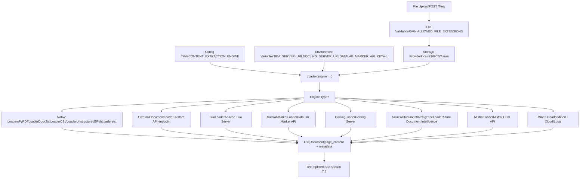
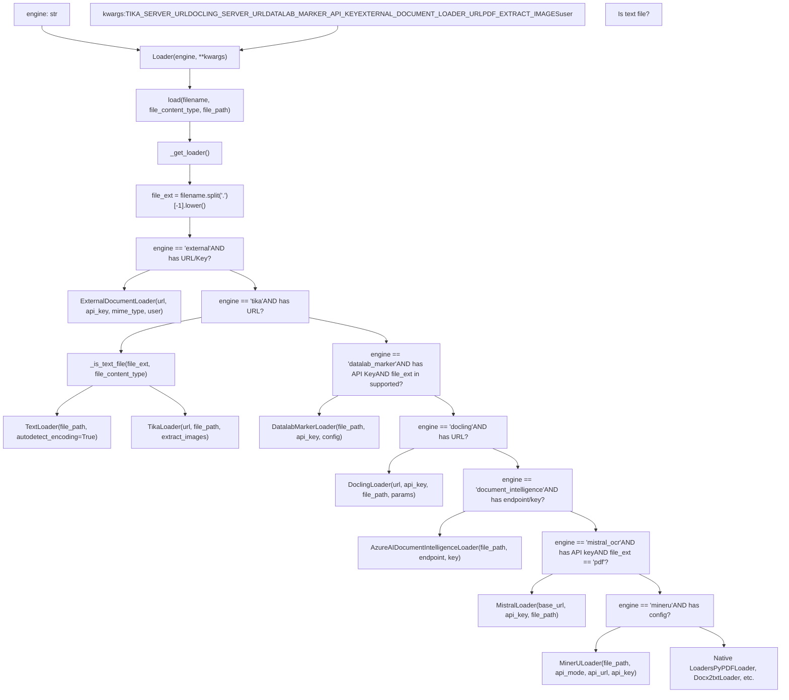
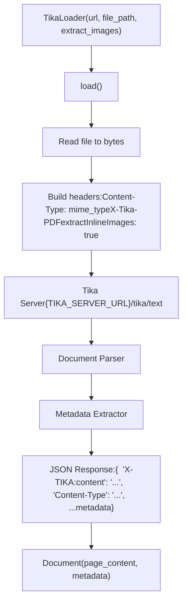
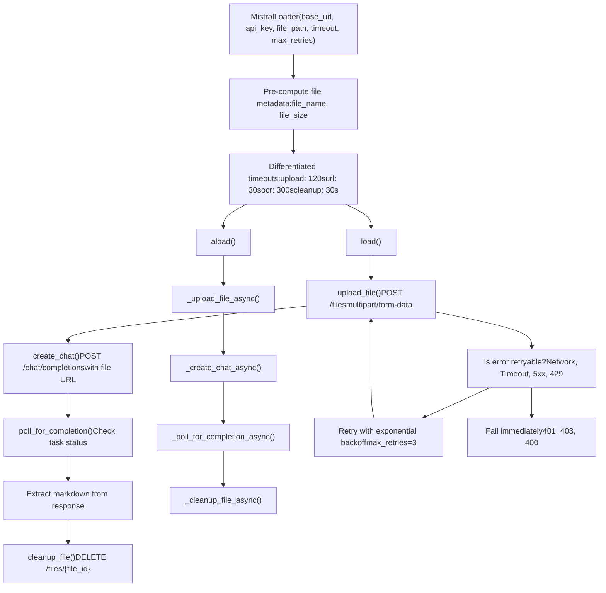
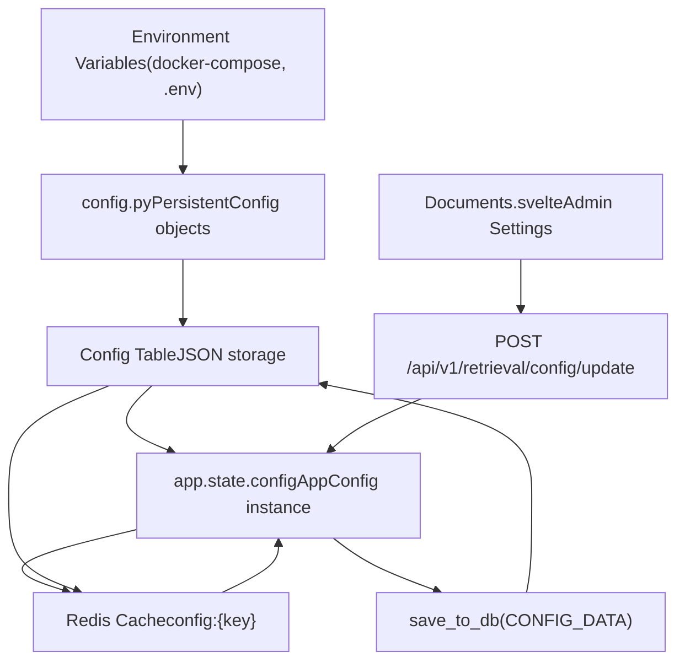
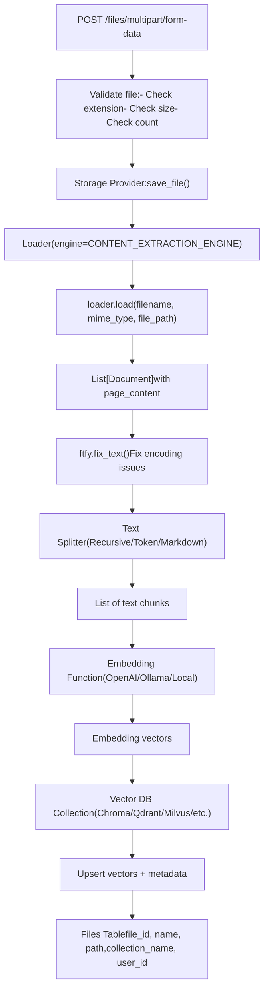

# Content Extraction Engines

Relevant source files

-   [backend/open\_webui/config.py](https://github.com/open-webui/open-webui/blob/a7271532/backend/open_webui/config.py)
-   [backend/open\_webui/main.py](https://github.com/open-webui/open-webui/blob/a7271532/backend/open_webui/main.py)
-   [backend/open\_webui/retrieval/loaders/datalab\_marker.py](https://github.com/open-webui/open-webui/blob/a7271532/backend/open_webui/retrieval/loaders/datalab_marker.py)
-   [backend/open\_webui/retrieval/loaders/external\_document.py](https://github.com/open-webui/open-webui/blob/a7271532/backend/open_webui/retrieval/loaders/external_document.py)
-   [backend/open\_webui/retrieval/loaders/external\_web.py](https://github.com/open-webui/open-webui/blob/a7271532/backend/open_webui/retrieval/loaders/external_web.py)
-   [backend/open\_webui/retrieval/loaders/main.py](https://github.com/open-webui/open-webui/blob/a7271532/backend/open_webui/retrieval/loaders/main.py)
-   [backend/open\_webui/retrieval/loaders/mineru.py](https://github.com/open-webui/open-webui/blob/a7271532/backend/open_webui/retrieval/loaders/mineru.py)
-   [backend/open\_webui/retrieval/loaders/mistral.py](https://github.com/open-webui/open-webui/blob/a7271532/backend/open_webui/retrieval/loaders/mistral.py)
-   [backend/open\_webui/retrieval/utils.py](https://github.com/open-webui/open-webui/blob/a7271532/backend/open_webui/retrieval/utils.py)
-   [backend/open\_webui/routers/retrieval.py](https://github.com/open-webui/open-webui/blob/a7271532/backend/open_webui/routers/retrieval.py)
-   [backend/open\_webui/utils/middleware.py](https://github.com/open-webui/open-webui/blob/a7271532/backend/open_webui/utils/middleware.py)
-   [src/lib/apis/retrieval/index.ts](https://github.com/open-webui/open-webui/blob/a7271532/src/lib/apis/retrieval/index.ts)
-   [src/lib/components/admin/Settings/Documents.svelte](https://github.com/open-webui/open-webui/blob/a7271532/src/lib/components/admin/Settings/Documents.svelte)
-   [src/lib/components/admin/Settings/WebSearch.svelte](https://github.com/open-webui/open-webui/blob/a7271532/src/lib/components/admin/Settings/WebSearch.svelte)

## Purpose and Scope

Content Extraction Engines are the pluggable document parsing subsystems within Open WebUI's RAG pipeline. These engines convert uploaded files (PDFs, Office documents, images, etc.) into text content suitable for embedding and retrieval. This document covers the architecture, available engines, configuration options, and integration points for document content extraction.

For information about the complete document ingestion and RAG pipeline, see [Document Ingestion Pipeline](/open-webui/open-webui/7.1-document-ingestion-pipeline). For text splitting and chunking strategies applied after extraction, see [Text Splitting and Chunking](/open-webui/open-webui/7.3-text-splitting-and-chunking).

---

## System Architecture

The content extraction system is built on a flexible engine abstraction that supports both native (local) parsers and external API-based extraction services. The system routes documents through the appropriate engine based on configuration and file type.


**Sources:**

-   [backend/open\_webui/retrieval/loaders/main.py184-310](https://github.com/open-webui/open-webui/blob/a7271532/backend/open_webui/retrieval/loaders/main.py#L184-L310)
-   [backend/open\_webui/config.py857-887](https://github.com/open-webui/open-webui/blob/a7271532/backend/open_webui/config.py#L857-L887)
-   [backend/open\_webui/main.py254-286](https://github.com/open-webui/open-webui/blob/a7271532/backend/open_webui/main.py#L254-L286)

---

## Loader Class and Engine Selection

The `Loader` class in `main.py` acts as a factory that instantiates the appropriate extraction engine based on configuration. Engine selection considers both the configured engine type and file characteristics.


**Sources:**

-   [backend/open\_webui/retrieval/loaders/main.py184-356](https://github.com/open-webui/open-webui/blob/a7271532/backend/open_webui/retrieval/loaders/main.py#L184-L356)

---

## Default Native Loaders

When `CONTENT_EXTRACTION_ENGINE` is empty or set to `""`, the system uses native loaders from `langchain_community`. These loaders run locally without external API dependencies.

### Supported File Types and Loaders

| File Extension | Loader Class | Notes |
| --- | --- | --- |
| `.pdf` | `PyPDFLoader` | Supports `PDF_EXTRACT_IMAGES` for OCR |
| `.csv` | `CSVLoader` | Comma-separated values |
| `.doc`, `.docx` | `Docx2txtLoader` | Microsoft Word documents |
| `.epub` | `UnstructuredEPubLoader` | Electronic publications |
| `.html` | `BSHTMLLoader` | HTML documents |
| `.md` | `TextLoader` | Markdown files |
| `.msg` | `OutlookMessageLoader` | Outlook messages |
| `.odt` | `UnstructuredODTLoader` | OpenDocument Text |
| `.pptx` | `UnstructuredPowerPointLoader` | PowerPoint presentations |
| `.rst` | `UnstructuredRSTLoader` | reStructuredText |
| `.txt` | `TextLoader` | Plain text with encoding detection |
| `.xls`, `.xlsx` | `UnstructuredExcelLoader` | Excel spreadsheets |
| `.xml` | `UnstructuredXMLLoader` | XML documents |
| Source code files | `TextLoader` | 40+ extensions (see `known_source_ext`) |

### PDF Image Extraction

The native PDF loader supports OCR through the `PDF_EXTRACT_IMAGES` configuration:

```
# Configuration in main.py
app.state.config.PDF_EXTRACT_IMAGES = PDF_EXTRACT_IMAGES

# Usage in Loader._get_loader()
if file_ext == "pdf":
    loader = PyPDFLoader(
        file_path,
        extract_images=self.kwargs.get("PDF_EXTRACT_IMAGES")
    )
```
When enabled, PyPDFLoader extracts embedded images from PDFs and attempts OCR on them to capture text content that may not be directly selectable.

**Sources:**

-   [backend/open\_webui/retrieval/loaders/main.py38-356](https://github.com/open-webui/open-webui/blob/a7271532/backend/open_webui/retrieval/loaders/main.py#L38-L356)
-   [backend/open\_webui/config.py917](https://github.com/open-webui/open-webui/blob/a7271532/backend/open_webui/config.py#L917-L917)

---

## External Document Loader

The `external` engine routes documents to a custom API endpoint, enabling integration with proprietary or specialized document processing services.

### Configuration

| Variable | Purpose |
| --- | --- |
| `EXTERNAL_DOCUMENT_LOADER_URL` | Base URL of the external API |
| `EXTERNAL_DOCUMENT_LOADER_API_KEY` | Bearer token for authentication |

### API Protocol

The external loader sends document content via PUT request to the `/process` endpoint:

> **[Mermaid sequence]**
> *(图表结构无法解析)*

### User Context Headers

When `ENABLE_FORWARD_USER_INFO_HEADERS` is enabled, the loader includes user metadata headers (`X-User-Id`, `X-User-Email`, `X-User-Name`, `X-User-Role`) in the request, enabling user-specific processing logic in the external API.

**Sources:**

-   [backend/open\_webui/retrieval/loaders/external\_document.py1-90](https://github.com/open-webui/open-webui/blob/a7271532/backend/open_webui/retrieval/loaders/external_document.py#L1-L90)
-   [backend/open\_webui/retrieval/loaders/main.py214-225](https://github.com/open-webui/open-webui/blob/a7271532/backend/open_webui/retrieval/loaders/main.py#L214-L225)

---

## Apache Tika Server

The `tika` engine uses Apache Tika for enterprise-grade document parsing. Tika supports hundreds of file formats through its unified API.

### Architecture


### Configuration

| Variable | Required | Purpose |
| --- | --- | --- |
| `TIKA_SERVER_URL` | Yes | Base URL of Tika server (e.g., `http://tika:9998`) |
| `PDF_EXTRACT_IMAGES` | No | Enable inline image extraction for PDFs |

### Text File Optimization

The Tika loader includes an optimization for text files: when the file extension is in `known_source_ext` or the MIME type starts with `text/`, the system bypasses Tika and uses the native `TextLoader` for faster processing.

```
# Optimization in Loader._get_loader()
if self._is_text_file(file_ext, file_content_type):
    loader = TextLoader(file_path, autodetect_encoding=True)
else:
    loader = TikaLoader(url=self.kwargs.get("TIKA_SERVER_URL"), ...)
```
**Sources:**

-   [backend/open\_webui/retrieval/loaders/main.py92-234](https://github.com/open-webui/open-webui/blob/a7271532/backend/open_webui/retrieval/loaders/main.py#L92-L234)
-   [backend/open\_webui/config.py873](https://github.com/open-webui/open-webui/blob/a7271532/backend/open_webui/config.py#L873-L873)

---

## DataLab Marker API

The `datalab_marker` engine uses the DataLab Marker service for high-quality document conversion, particularly excelling at PDFs with complex layouts, tables, and mathematical content.

### Supported File Types

PDFs, Office documents (Word, Excel, PowerPoint), OpenDocument formats, HTML, EPUB, and images (PNG, JPEG, WebP, GIF, TIFF).

### Configuration Parameters


### API Flow

The DataLab Marker API uses an asynchronous polling pattern:

> **[Mermaid sequence]**
> *(图表结构无法解析)*

### Additional Configuration Format

The `DATALAB_MARKER_ADDITIONAL_CONFIG` accepts a JSON string with advanced options:

```
{
  "disable_links": true,
  "keep_pageheader_in_output": false,
  "keep_pagefooter_in_output": false,
  "filter_blank_pages": true,
  "drop_repeated_text": true,
  "layout_coverage_threshold": 0.5,
  "merge_threshold": 0.8,
  "height_tolerance": 2,
  "gap_threshold": 0.1,
  "image_threshold": 0.05,
  "min_line_length": 5,
  "level_count": 3,
  "default_level": 1
}
```
**Sources:**

-   [backend/open\_webui/retrieval/loaders/datalab\_marker.py1-211](https://github.com/open-webui/open-webui/blob/a7271532/backend/open_webui/retrieval/loaders/datalab_marker.py#L1-L211)
-   [backend/open\_webui/retrieval/loaders/main.py235-283](https://github.com/open-webui/open-webui/blob/a7271532/backend/open_webui/retrieval/loaders/main.py#L235-L283)
-   [backend/open\_webui/config.py858-871](https://github.com/open-webui/open-webui/blob/a7271532/backend/open_webui/config.py#L858-L871)
-   [src/lib/components/admin/Settings/Documents.svelte365-535](https://github.com/open-webui/open-webui/blob/a7271532/src/lib/components/admin/Settings/Documents.svelte#L365-L535)

---

## Docling Server

The `docling` engine integrates with a self-hosted or remote Docling server for document conversion. Docling provides clean markdown output with image placeholders.

### Configuration

| Variable | Required | Purpose |
| --- | --- | --- |
| `DOCLING_SERVER_URL` | Yes | Base URL of Docling server |
| `DOCLING_API_KEY` | No | Bearer token (if authentication enabled) |
| `DOCLING_PARAMS` | No | JSON object with additional parameters |

### API Protocol

> **[Mermaid sequence]**
> *(图表结构无法解析)*

### DOCLING\_PARAMS Structure

The `DOCLING_PARAMS` configuration accepts a JSON object that gets merged into the request data:

```
{
  "ocr": true,
  "export_tables": true,
  "export_images": false,
  "table_structure_extraction": true
}
```
The `image_export_mode` is always set to `"placeholder"` by the loader, inserting markdown placeholders like `!<FileRef file-url="https://github.com/open-webui/open-webui/blob/a7271532/image" undefined file-path="image">Hii</FileRef>` rather than embedding full images.

**Sources:**

-   [backend/open\_webui/retrieval/loaders/main.py133-303](https://github.com/open-webui/open-webui/blob/a7271532/backend/open_webui/retrieval/loaders/main.py#L133-L303)
-   [backend/open\_webui/config.py874-877](https://github.com/open-webui/open-webui/blob/a7271532/backend/open_webui/config.py#L874-L877)
-   [src/lib/components/admin/Settings/Documents.svelte550-606](https://github.com/open-webui/open-webui/blob/a7271532/src/lib/components/admin/Settings/Documents.svelte#L550-L606)

---

## Azure Document Intelligence

The `document_intelligence` engine uses Azure's AI Document Intelligence service (formerly Form Recognizer) for OCR and layout analysis.

### Configuration

| Variable | Required | Purpose |
| --- | --- | --- |
| `DOCUMENT_INTELLIGENCE_ENDPOINT` | Yes | Azure endpoint URL |
| `DOCUMENT_INTELLIGENCE_KEY` | Yes | Azure subscription key |
| `DOCUMENT_INTELLIGENCE_MODEL` | No | Model ID (default: "prebuilt-document") |

### Integration

This engine uses `AzureAIDocumentIntelligenceLoader` from `langchain_community`, which authenticates using `DefaultAzureCredential` or the provided key:

```
# In Loader._get_loader()
from azure.identity import DefaultAzureCredential

loader = AzureAIDocumentIntelligenceLoader(
    file_path=file_path,
    client=None,  # Will be created internally
    model=self.kwargs.get("DOCUMENT_INTELLIGENCE_MODEL", "prebuilt-document"),
    credential=DefaultAzureCredential() if not key else None,
    api_endpoint=endpoint,
    api_key=key,
)
```
### Supported Models

Azure Document Intelligence offers several prebuilt models:

-   `prebuilt-document` - General document analysis
-   `prebuilt-layout` - Layout and reading order
-   `prebuilt-read` - Text extraction with reading order
-   `prebuilt-invoice` - Invoice-specific extraction
-   `prebuilt-receipt` - Receipt-specific extraction
-   Custom trained models

**Sources:**

-   [backend/open\_webui/retrieval/loaders/main.py304-319](https://github.com/open-webui/open-webui/blob/a7271532/backend/open_webui/retrieval/loaders/main.py#L304-L319)
-   [backend/open\_webui/config.py877-880](https://github.com/open-webui/open-webui/blob/a7271532/backend/open_webui/config.py#L877-L880)

---

## Mistral OCR API

The `mistral_ocr` engine leverages Mistral's OCR-capable models for PDF document processing. This engine is optimized for PDFs and includes sophisticated retry logic and performance optimizations.

### Architecture


### Configuration

| Variable | Required | Purpose |
| --- | --- | --- |
| `MISTRAL_OCR_API_BASE_URL` | No | Base URL (default: [https://api.mistral.ai/v1](https://api.mistral.ai/v1)) |
| `MISTRAL_OCR_API_KEY` | Yes | Mistral API key |

### Performance Optimizations

The Mistral loader includes several performance enhancements:

1.  **Differentiated Timeouts**: Upload operations timeout at 2 minutes, URL operations at 30 seconds, OCR processing at 5 minutes (configurable), and cleanup at 30 seconds. This prevents fast operations from waiting unnecessarily.

2.  **Connection Pooling**: Uses `requests.Session()` (sync) and `aiohttp.ClientSession()` (async) with keepalive optimization for reduced connection overhead.

3.  **Intelligent Retry Logic**: Classifies errors as retryable (network errors, timeouts, 5xx, 429) or non-retryable (401, 403, 400) with exponential backoff.

4.  **Conditional Debug Logging**: Debug messages are only processed when debug mode is enabled, avoiding string formatting overhead.

5.  **Memory-Efficient Streaming**: Large files are streamed in chunks rather than loaded entirely into memory.


### API Workflow

> **[Mermaid sequence]**
> *(图表结构无法解析)*

**Sources:**

-   [backend/open\_webui/retrieval/loaders/mistral.py1-570](https://github.com/open-webui/open-webui/blob/a7271532/backend/open_webui/retrieval/loaders/mistral.py#L1-L570)
-   [backend/open\_webui/retrieval/loaders/main.py320-329](https://github.com/open-webui/open-webui/blob/a7271532/backend/open_webui/retrieval/loaders/main.py#L320-L329)
-   [backend/open\_webui/config.py880-882](https://github.com/open-webui/open-webui/blob/a7271532/backend/open_webui/config.py#L880-L882)

---

## MinerU Parser

The `mineru` engine integrates with MinerU document parser, supporting both cloud and local deployment modes. MinerU specializes in PDF parsing with advanced table, formula, and OCR capabilities.

### Deployment Modes

MinerU operates in two distinct modes:

| Mode | Description | API Pattern | Use Case |
| --- | --- | --- | --- |
| `cloud` | Managed MinerU service | Async task-based polling | Production with minimal ops overhead |
| `local` | Self-hosted MinerU API | Synchronous processing | On-premise deployments, data privacy |

### Configuration

| Variable | Required | Mode | Purpose |
| --- | --- | --- | --- |
| `MINERU_API_MODE` | Yes | Both | "cloud" or "local" |
| `MINERU_API_URL` | Yes | Both | API endpoint URL |
| `MINERU_API_KEY` | Conditional | cloud only | Authentication key |
| `MINERU_API_TIMEOUT` | No | Both | Request timeout (default: 300s) |
| `MINERU_PARAMS` | No | Both | JSON object with processing options |

### MINERU\_PARAMS Structure

```
{
  "enable_ocr": false,
  "enable_formula": true,
  "enable_table": true,
  "language": "en",
  "model_version": "pipeline",
  "page_ranges": "1-10,15,20-25"
}
```
### Cloud API Flow (Asynchronous)

> **[Mermaid sequence]**
> *(图表结构无法解析)*

### Local API Flow (Synchronous)

> **[Mermaid sequence]**
> *(图表结构无法解析)*

### Error Handling

Both modes include robust error handling:

-   **404**: File not found (invalid path)
-   **400**: Invalid parameters or empty results
-   **504**: Timeout during processing (cloud polling or local sync)
-   **502**: Invalid response format or API errors
-   **500**: Unexpected internal errors

**Sources:**

-   [backend/open\_webui/retrieval/loaders/mineru.py1-308](https://github.com/open-webui/open-webui/blob/a7271532/backend/open_webui/retrieval/loaders/mineru.py#L1-L308)
-   [backend/open\_webui/retrieval/loaders/main.py330-342](https://github.com/open-webui/open-webui/blob/a7271532/backend/open_webui/retrieval/loaders/main.py#L330-L342)
-   [backend/open\_webui/config.py882-887](https://github.com/open-webui/open-webui/blob/a7271532/backend/open_webui/config.py#L882-L887)
-   [src/lib/components/admin/Settings/Documents.svelte607-711](https://github.com/open-webui/open-webui/blob/a7271532/src/lib/components/admin/Settings/Documents.svelte#L607-L711)

---

## Configuration Management

Content extraction engine configuration is managed through a two-tier system: environment variables for initial setup and persistent database storage for runtime updates.

### Configuration Loading


### Engine-Specific Configuration Variables

The following table maps each engine to its required and optional configuration variables:

| Engine | Required Variables | Optional Variables |
| --- | --- | --- |
| `default` | None | `PDF_EXTRACT_IMAGES` |
| `external` | `EXTERNAL_DOCUMENT_LOADER_URL`
`EXTERNAL_DOCUMENT_LOADER_API_KEY` | None |
| `tika` | `TIKA_SERVER_URL` | `PDF_EXTRACT_IMAGES` |
| `datalab_marker` | `DATALAB_MARKER_API_KEY` | `DATALAB_MARKER_API_BASE_URL`
`DATALAB_MARKER_*` (12 config options) |
| `docling` | `DOCLING_SERVER_URL` | `DOCLING_API_KEY`
`DOCLING_PARAMS` |
| `document_intelligence` | `DOCUMENT_INTELLIGENCE_ENDPOINT`
`DOCUMENT_INTELLIGENCE_KEY` | `DOCUMENT_INTELLIGENCE_MODEL` |
| `mistral_ocr` | `MISTRAL_OCR_API_KEY` | `MISTRAL_OCR_API_BASE_URL` |
| `mineru` | `MINERU_API_MODE`
`MINERU_API_URL` | `MINERU_API_KEY` (cloud only)
`MINERU_API_TIMEOUT`
`MINERU_PARAMS` |

### Admin UI Configuration Flow

The admin settings interface provides a dropdown to select the extraction engine and dynamically renders engine-specific configuration forms:

```
<!-- Engine selection dropdown -->
<select bind:value={RAGConfig.CONTENT_EXTRACTION_ENGINE}>
  <option value="">{$i18n.t('Default')}</option>
  <option value="external">{$i18n.t('External')}</option>
  <option value="tika">{$i18n.t('Tika')}</option>
  <option value="docling">{$i18n.t('Docling')}</option>
  <option value="datalab_marker">{$i18n.t('Datalab Marker API')}</option>
  <option value="document_intelligence">{$i18n.t('Document Intelligence')}</option>
  <option value="mistral_ocr">{$i18n.t('Mistral OCR')}</option>
  <option value="mineru">{$i18n.t('MinerU')}</option>
</select>

<!-- Conditional rendering of engine-specific forms -->
{#if RAGConfig.CONTENT_EXTRACTION_ENGINE === 'datalab_marker'}
  <!-- DataLab Marker configuration form -->
{:else if RAGConfig.CONTENT_EXTRACTION_ENGINE === 'tika'}
  <!-- Tika configuration form -->
{/if}
```
The `submitHandler` function validates required fields before submission:

```
if (RAGConfig.CONTENT_EXTRACTION_ENGINE === 'tika' && RAGConfig.TIKA_SERVER_URL === '') {
  toast.error($i18n.t('Tika Server URL required.'));
  return;
}
```
**Sources:**

-   [backend/open\_webui/config.py139-887](https://github.com/open-webui/open-webui/blob/a7271532/backend/open_webui/config.py#L139-L887)
-   [backend/open\_webui/main.py857-887](https://github.com/open-webui/open-webui/blob/a7271532/backend/open_webui/main.py#L857-L887)
-   [src/lib/components/admin/Settings/Documents.svelte141-711](https://github.com/open-webui/open-webui/blob/a7271532/src/lib/components/admin/Settings/Documents.svelte#L141-L711)

---

## Integration with Document Processing Pipeline

Content extraction engines are invoked as the first stage of document processing, immediately after file upload and storage.

### End-to-End Flow


### Code Integration Points

The loader is instantiated in the file processing route:

```
# In backend/open_webui/routers/retrieval.py (approximate location)
loader = Loader(
    engine=request.app.state.config.CONTENT_EXTRACTION_ENGINE,
    TIKA_SERVER_URL=request.app.state.config.TIKA_SERVER_URL,
    DOCLING_SERVER_URL=request.app.state.config.DOCLING_SERVER_URL,
    DATALAB_MARKER_API_KEY=request.app.state.config.DATALAB_MARKER_API_KEY,
    # ... other engine-specific configs
    user=user,
)

docs = loader.load(filename, file_content_type, file_path)

# Apply ftfy to fix encoding issues
docs = [
    Document(
        page_content=ftfy.fix_text(doc.page_content),
        metadata=doc.metadata
    )
    for doc in docs
]
```
The extracted documents then flow into the text splitting stage (see [Text Splitting and Chunking](/open-webui/open-webui/7.3-text-splitting-and-chunking)) before embedding generation.

**Sources:**

-   [backend/open\_webui/retrieval/loaders/main.py190-201](https://github.com/open-webui/open-webui/blob/a7271532/backend/open_webui/retrieval/loaders/main.py#L190-L201)
-   [backend/open\_webui/routers/retrieval.py1-262](https://github.com/open-webui/open-webui/blob/a7271532/backend/open_webui/routers/retrieval.py#L1-L262)
