# Text Splitting and Chunking

Relevant source files

-   [backend/open\_webui/config.py](https://github.com/open-webui/open-webui/blob/a7271532/backend/open_webui/config.py)
-   [backend/open\_webui/main.py](https://github.com/open-webui/open-webui/blob/a7271532/backend/open_webui/main.py)
-   [backend/open\_webui/retrieval/loaders/datalab\_marker.py](https://github.com/open-webui/open-webui/blob/a7271532/backend/open_webui/retrieval/loaders/datalab_marker.py)
-   [backend/open\_webui/retrieval/loaders/external\_document.py](https://github.com/open-webui/open-webui/blob/a7271532/backend/open_webui/retrieval/loaders/external_document.py)
-   [backend/open\_webui/retrieval/loaders/external\_web.py](https://github.com/open-webui/open-webui/blob/a7271532/backend/open_webui/retrieval/loaders/external_web.py)
-   [backend/open\_webui/retrieval/loaders/main.py](https://github.com/open-webui/open-webui/blob/a7271532/backend/open_webui/retrieval/loaders/main.py)
-   [backend/open\_webui/retrieval/loaders/mineru.py](https://github.com/open-webui/open-webui/blob/a7271532/backend/open_webui/retrieval/loaders/mineru.py)
-   [backend/open\_webui/retrieval/loaders/mistral.py](https://github.com/open-webui/open-webui/blob/a7271532/backend/open_webui/retrieval/loaders/mistral.py)
-   [backend/open\_webui/retrieval/utils.py](https://github.com/open-webui/open-webui/blob/a7271532/backend/open_webui/retrieval/utils.py)
-   [backend/open\_webui/routers/retrieval.py](https://github.com/open-webui/open-webui/blob/a7271532/backend/open_webui/routers/retrieval.py)
-   [backend/open\_webui/utils/middleware.py](https://github.com/open-webui/open-webui/blob/a7271532/backend/open_webui/utils/middleware.py)
-   [src/lib/apis/retrieval/index.ts](https://github.com/open-webui/open-webui/blob/a7271532/src/lib/apis/retrieval/index.ts)
-   [src/lib/components/admin/Settings/Documents.svelte](https://github.com/open-webui/open-webui/blob/a7271532/src/lib/components/admin/Settings/Documents.svelte)
-   [src/lib/components/admin/Settings/WebSearch.svelte](https://github.com/open-webui/open-webui/blob/a7271532/src/lib/components/admin/Settings/WebSearch.svelte)

This page documents the text splitting and chunking system used in Open WebUI's RAG (Retrieval-Augmented Generation) pipeline. Text splitting is the process of breaking down large documents into smaller, semantically meaningful chunks that can be efficiently embedded and retrieved.

For information about document content extraction that occurs before chunking, see [Content Extraction Engines](/open-webui/open-webui/7.2-content-extraction-engines). For information about embedding generation that occurs after chunking, see [Embedding Generation](/open-webui/open-webui/7.4-embedding-generation).

## Purpose and Scope

Text splitting is a critical component of the RAG system that transforms extracted document content into appropriately-sized chunks for vector embedding. This page covers:

-   Available text splitter implementations
-   Chunk size and overlap configuration
-   How different splitters handle various document types
-   Integration with the document ingestion pipeline

## System Overview

The chunking system sits between content extraction and embedding generation in the RAG pipeline. After a document's text content is extracted, it must be divided into chunks that are:

1.  Small enough to fit within embedding model token limits
2.  Large enough to contain meaningful semantic context
3.  Appropriately overlapped to prevent information loss at chunk boundaries

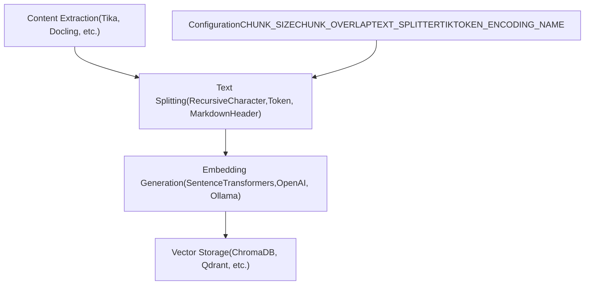
**Sources:** [backend/open\_webui/routers/retrieval.py32-36](https://github.com/open-webui/open-webui/blob/a7271532/backend/open_webui/routers/retrieval.py#L32-L36) [backend/open\_webui/config.py252-253](https://github.com/open-webui/open-webui/blob/a7271532/backend/open_webui/config.py#L252-L253) [backend/open\_webui/main.py888-890](https://github.com/open-webui/open-webui/blob/a7271532/backend/open_webui/main.py#L888-L890)

## Configuration Parameters

The chunking system is configured through persistent configuration values that can be modified via the admin settings UI.

| Parameter | Environment Variable | Default | Purpose |
| --- | --- | --- | --- |
| `CHUNK_SIZE` | `CHUNK_SIZE` | 1500 | Maximum number of characters per chunk |
| `CHUNK_OVERLAP` | `CHUNK_OVERLAP` | 100 | Number of overlapping characters between chunks |
| `TEXT_SPLITTER` | `RAG_TEXT_SPLITTER` | `"recursive"` | Splitter type: `"recursive"`, `"token"`, or `"markdown_header"` |
| `TIKTOKEN_ENCODING_NAME` | `TIKTOKEN_ENCODING_NAME` | `"cl100k_base"` | Encoding for token-based splitting |

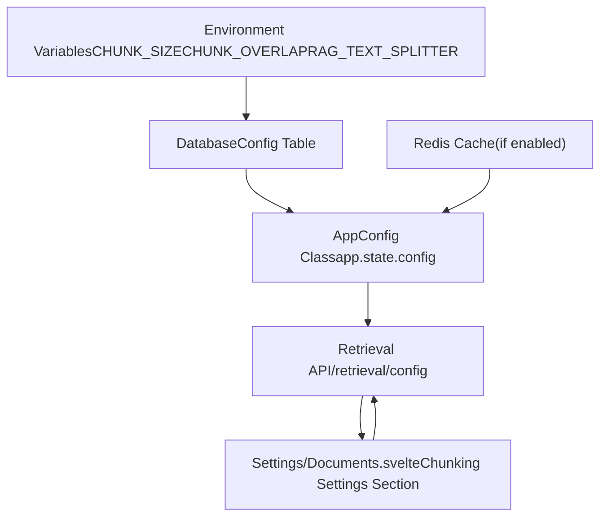
**Sources:** [backend/open\_webui/config.py1-50](https://github.com/open-webui/open-webui/blob/a7271532/backend/open_webui/config.py#L1-L50) [backend/open\_webui/main.py888-893](https://github.com/open-webui/open-webui/blob/a7271532/backend/open_webui/main.py#L888-L893) [backend/open\_webui/routers/retrieval.py249-261](https://github.com/open-webui/open-webui/blob/a7271532/backend/open_webui/routers/retrieval.py#L249-L261) [backend/open\_webui/routers/retrieval.py443-504](https://github.com/open-webui/open-webui/blob/a7271532/backend/open_webui/routers/retrieval.py#L443-L504)

## Text Splitter Types

Open WebUI uses LangChain's text splitter implementations to handle different document structures and requirements.

### Recursive Character Text Splitter

The default and most versatile splitter that recursively tries different separators to find natural breakpoints.

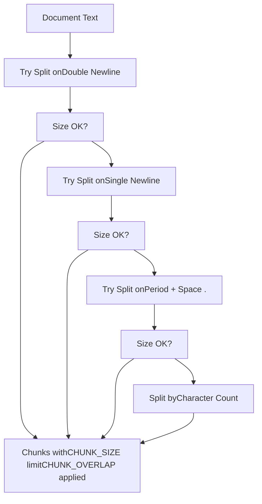
**Characteristics:**

-   Recursively tries separators in order: `["\n\n", "\n", " ", ""]`
-   Attempts to preserve paragraph and sentence boundaries
-   Falls back to character-level splitting if necessary
-   Best for general-purpose text documents

**Sources:** [backend/open\_webui/routers/retrieval.py32-36](https://github.com/open-webui/open-webui/blob/a7271532/backend/open_webui/routers/retrieval.py#L32-L36)

### Token Text Splitter

Uses tiktoken tokenization to split text based on token count rather than character count, ensuring chunks fit within model token limits.

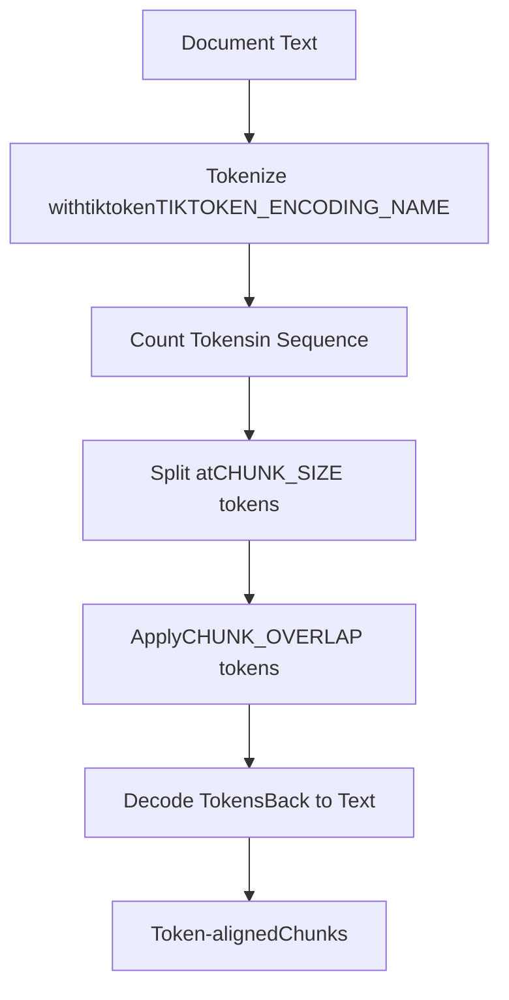
**Characteristics:**

-   Splits by token count, not character count
-   Ensures compatibility with embedding model token limits
-   Uses tiktoken encodings (e.g., `"cl100k_base"` for GPT-4)
-   More precise for transformer-based models
-   Token count directly maps to model input size

**Configuration:**

-   Token counting determined by `TIKTOKEN_ENCODING_NAME`
-   Common encodings: `"cl100k_base"` (GPT-4), `"p50k_base"` (GPT-3)

**Sources:** [backend/open\_webui/routers/retrieval.py32-36](https://github.com/open-webui/open-webui/blob/a7271532/backend/open_webui/routers/retrieval.py#L32-L36) [backend/open\_webui/config.py889](https://github.com/open-webui/open-webui/blob/a7271532/backend/open_webui/config.py#L889-L889) [backend/open\_webui/main.py889](https://github.com/open-webui/open-webui/blob/a7271532/backend/open_webui/main.py#L889-L889)

### Markdown Header Text Splitter

Specialized splitter that preserves Markdown document structure by splitting on header boundaries.

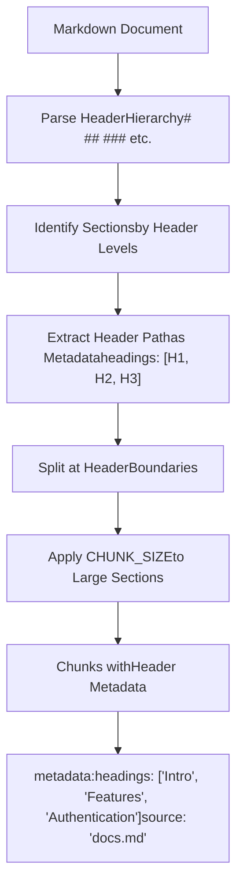
**Characteristics:**

-   Splits on Markdown headers (`#`, `##`, `###`, etc.)
-   Preserves document hierarchy in chunk metadata
-   Stores header path as `metadata["headings"]` list
-   Ideal for structured documentation and API docs
-   Maintains semantic document structure

**Metadata Enhancement:** The header path is stored in chunk metadata and used during hybrid search for improved retrieval relevance (see [Retrieval Strategies](/open-webui/open-webui/7.6-retrieval-strategies)).

**Sources:** [backend/open\_webui/routers/retrieval.py32-36](https://github.com/open-webui/open-webui/blob/a7271532/backend/open_webui/routers/retrieval.py#L32-L36) [backend/open\_webui/retrieval/utils.py189-193](https://github.com/open-webui/open-webui/blob/a7271532/backend/open_webui/retrieval/utils.py#L189-L193)

## Chunking in the Document Pipeline

The text splitting process is integrated into the broader document ingestion pipeline, which processes uploaded files and web-scraped content.

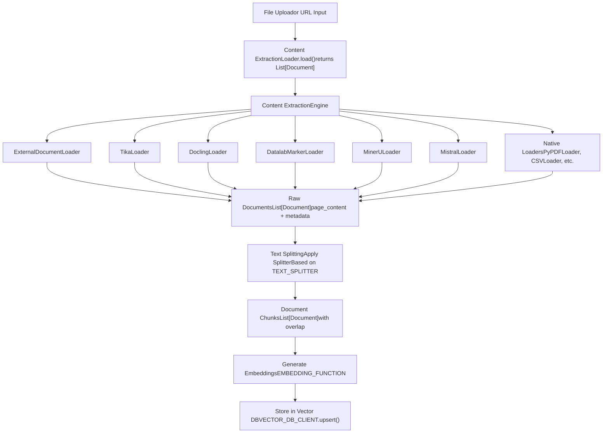
**Sources:** [backend/open\_webui/retrieval/loaders/main.py184-201](https://github.com/open-webui/open-webui/blob/a7271532/backend/open_webui/retrieval/loaders/main.py#L184-L201) [backend/open\_webui/routers/retrieval.py32-36](https://github.com/open-webui/open-webui/blob/a7271532/backend/open_webui/routers/retrieval.py#L32-L36)

## Chunk Overlap Strategy

Chunk overlap prevents information loss at chunk boundaries by including a sliding window of text from the previous chunk.

```
Document: "The quick brown fox jumps over the lazy dog. The dog was sleeping under a tree."

CHUNK_SIZE = 40 characters
CHUNK_OVERLAP = 10 characters

Chunk 1: "The quick brown fox jumps over the l"
          |----------- 40 chars -----------|

Chunk 2:              "over the lazy dog. The dog was slee"
          |--10 overlap--|---- 30 new -----|

Chunk 3:                            "dog was sleeping under a tree."
                        |--10 overlap--|-- remaining --|
```
**Visual Representation:**

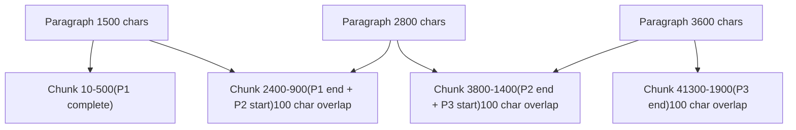
**Benefits of Overlap:**

1.  **Prevents Context Loss:** Sentences or concepts split across chunk boundaries remain retrievable
2.  **Improves Retrieval:** Multiple chunks may contain the same key information, increasing recall
3.  **Maintains Coherence:** Overlapping context helps LLMs understand chunk relationships

**Trade-offs:**

-   Increased storage requirements (duplicate text)
-   More chunks to process during embedding
-   Higher computational cost

**Sources:** [backend/open\_webui/config.py252-253](https://github.com/open-webui/open-webui/blob/a7271532/backend/open_webui/config.py#L252-L253) [backend/open\_webui/main.py892](https://github.com/open-webui/open-webui/blob/a7271532/backend/open_webui/main.py#L892-L892)

## Text Enrichment for Hybrid Search

When hybrid search is enabled, chunk metadata is enriched with additional context to improve BM25 (keyword-based) retrieval performance.

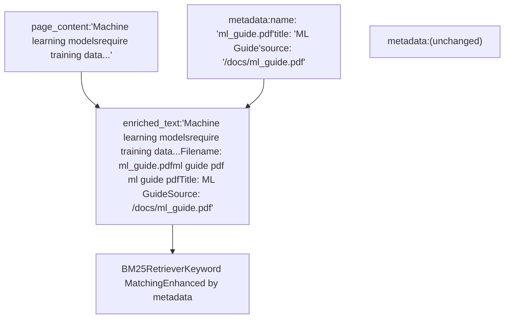
**Enrichment Process:**

The `get_enriched_texts()` function in [backend/open\_webui/retrieval/utils.py170-205](https://github.com/open-webui/open-webui/blob/a7271532/backend/open_webui/retrieval/utils.py#L170-L205) adds metadata fields to chunk text:

1.  **Filename** (repeated twice for extra weight)
2.  **Title** (if available)
3.  **Section headings** (from Markdown splitter metadata)
4.  **Source URL/path**
5.  **Snippet** (for web search results)

This enrichment happens when:

-   `ENABLE_RAG_HYBRID_SEARCH` is enabled
-   `ENABLE_RAG_HYBRID_SEARCH_ENRICHED_TEXTS` is enabled
-   Querying with `query_doc_with_hybrid_search()`

**Sources:** [backend/open\_webui/retrieval/utils.py170-205](https://github.com/open-webui/open-webui/blob/a7271532/backend/open_webui/retrieval/utils.py#L170-L205) [backend/open\_webui/retrieval/utils.py240-244](https://github.com/open-webui/open-webui/blob/a7271532/backend/open_webui/retrieval/utils.py#L240-L244)

## Splitter Selection and Usage

The text splitter is selected based on the `TEXT_SPLITTER` configuration value and instantiated when processing documents.

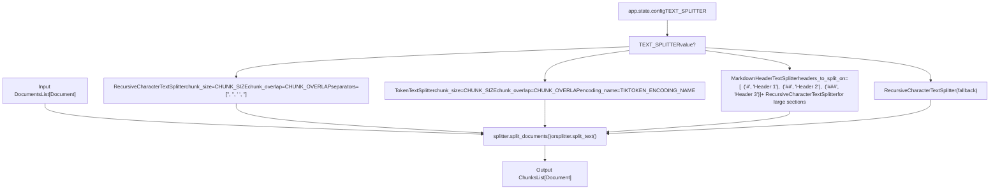
**Implementation Note:** While the configuration exposes splitter selection via `TEXT_SPLITTER`, the actual instantiation and usage of these splitters occurs in the document processing code that was truncated in the provided files. The splitters are imported from `langchain_text_splitters` at [backend/open\_webui/routers/retrieval.py32-36](https://github.com/open-webui/open-webui/blob/a7271532/backend/open_webui/routers/retrieval.py#L32-L36)

**Sources:** [backend/open\_webui/routers/retrieval.py32-36](https://github.com/open-webui/open-webui/blob/a7271532/backend/open_webui/routers/retrieval.py#L32-L36) [backend/open\_webui/config.py888-890](https://github.com/open-webui/open-webui/blob/a7271532/backend/open_webui/config.py#L888-L890) [backend/open\_webui/routers/retrieval.py496-498](https://github.com/open-webui/open-webui/blob/a7271532/backend/open_webui/routers/retrieval.py#L496-L498)

## Integration with Embeddings

After text splitting, chunks are prepared for embedding generation. The chunked documents flow into the embedding system with appropriate batch sizing.

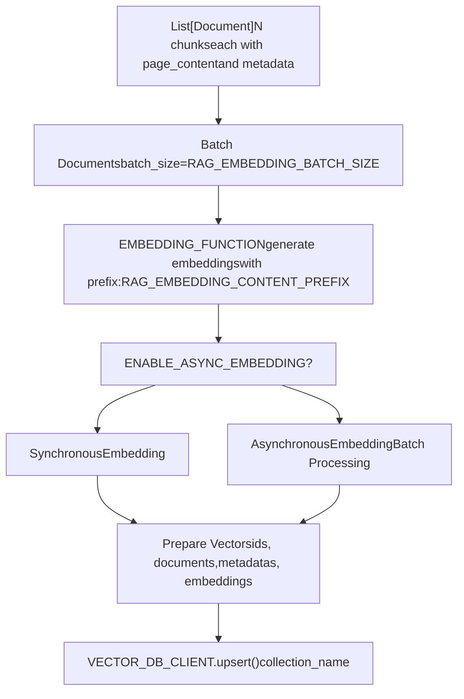
**Embedding Process:**

1.  Chunks are batched according to `RAG_EMBEDDING_BATCH_SIZE`
2.  `RAG_EMBEDDING_CONTENT_PREFIX` is prepended to chunk text (if configured)
3.  Embedding function generates vector representations
4.  Vectors are stored with chunk metadata in the vector database

**Batch Size Considerations:**

-   Smaller batches: Lower memory usage, more API calls
-   Larger batches: Higher throughput, higher memory usage
-   Default: 1 (conservative, works for all systems)

**Sources:** [backend/open\_webui/main.py894-897](https://github.com/open-webui/open-webui/blob/a7271532/backend/open_webui/main.py#L894-L897) [backend/open\_webui/config.py234-235](https://github.com/open-webui/open-webui/blob/a7271532/backend/open_webui/config.py#L234-L235) [backend/open\_webui/routers/retrieval.py258-260](https://github.com/open-webui/open-webui/blob/a7271532/backend/open_webui/routers/retrieval.py#L258-L260)

## Configuration via Admin UI

The chunking settings are exposed through the admin settings interface, allowing runtime configuration without code changes.

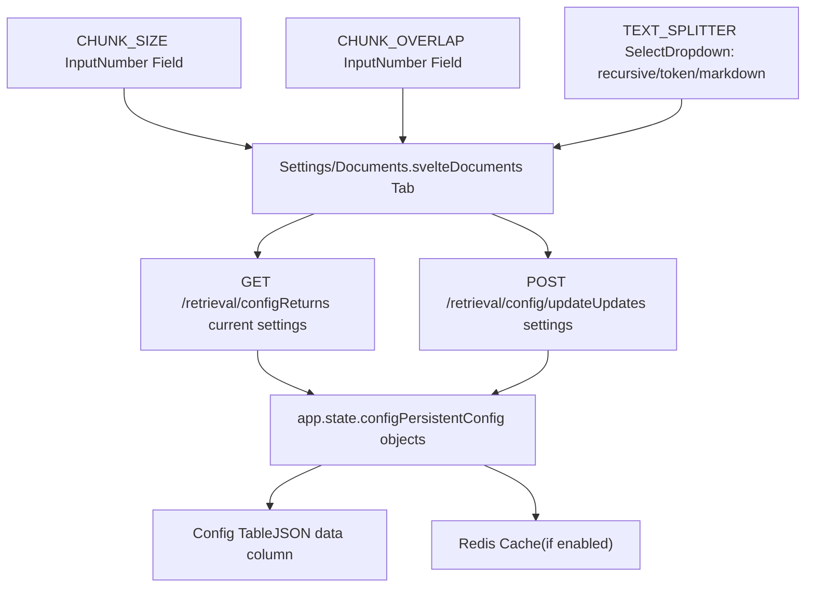
**Configuration Flow:**

1.  Admin opens Settings → Documents
2.  UI fetches current config via `GET /retrieval/config`
3.  Admin modifies CHUNK\_SIZE, CHUNK\_OVERLAP, or TEXT\_SPLITTER
4.  On save, `POST /retrieval/config/update` persists changes
5.  Changes are immediately available for new document uploads
6.  Existing embedded documents are not automatically re-chunked

**Important:** Changing chunking parameters does not automatically re-process existing documents. To apply new settings to existing files, use the "Reindex Knowledge Files" feature in the admin settings.

**Sources:** [src/lib/components/admin/Settings/Documents.svelte1-274](https://github.com/open-webui/open-webui/blob/a7271532/src/lib/components/admin/Settings/Documents.svelte#L1-L274) [backend/open\_webui/routers/retrieval.py443-504](https://github.com/open-webui/open-webui/blob/a7271532/backend/open_webui/routers/retrieval.py#L443-L504) [src/lib/apis/retrieval/index.ts3-91](https://github.com/open-webui/open-webui/blob/a7271532/src/lib/apis/retrieval/index.ts#L3-L91)

## Best Practices

### Choosing Chunk Size

| Document Type | Recommended CHUNK\_SIZE | Reasoning |
| --- | --- | --- |
| Technical documentation | 1000-1500 chars | Preserves code blocks and technical explanations |
| General articles | 1500-2000 chars | Maintains paragraph-level coherence |
| Chat logs / Conversations | 500-1000 chars | Keeps individual exchanges intact |
| Academic papers | 2000-3000 chars | Preserves complex arguments and citations |
| Code files | 1000-1500 chars | Keeps function/class definitions together |

### Choosing Chunk Overlap

**General Rule:** Set overlap to 10-15% of chunk size.

-   Too small (<5%): Risk of losing context at boundaries
-   Too large (>30%): Excessive redundancy, wasted storage
-   Sweet spot: 10-20% of CHUNK\_SIZE

**Examples:**

-   CHUNK\_SIZE=1500 → CHUNK\_OVERLAP=150-225
-   CHUNK\_SIZE=2000 → CHUNK\_OVERLAP=200-300

### Choosing Text Splitter

| Splitter | Best For | Avoid For |
| --- | --- | --- |
| `recursive` | General documents, mixed content | Highly structured docs with strict formatting |
| `token` | Precise token control, working with specific models | General use (unnecessary precision overhead) |
| `markdown_header` | Technical docs, wikis, structured markdown | Unstructured text, non-markdown documents |

**Sources:** [backend/open\_webui/routers/retrieval.py32-36](https://github.com/open-webui/open-webui/blob/a7271532/backend/open_webui/routers/retrieval.py#L32-L36) [backend/open\_webui/config.py888-893](https://github.com/open-webui/open-webui/blob/a7271532/backend/open_webui/config.py#L888-L893)
