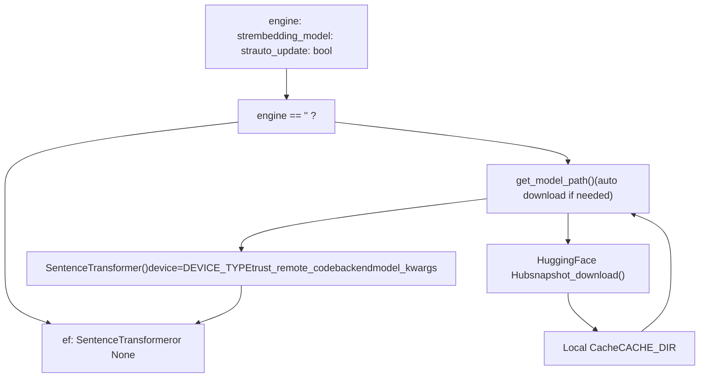
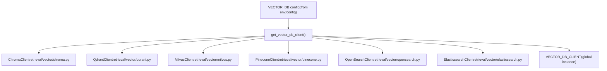
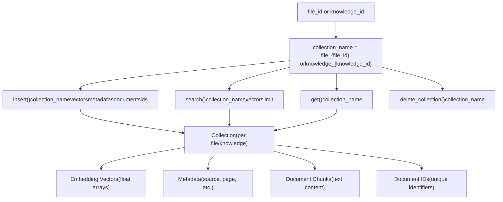
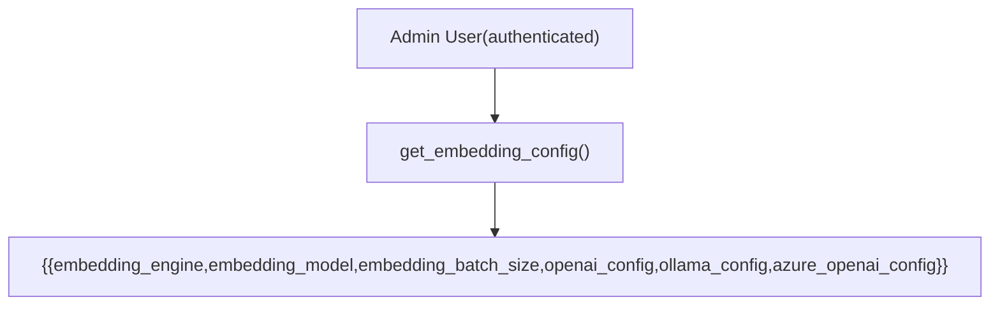
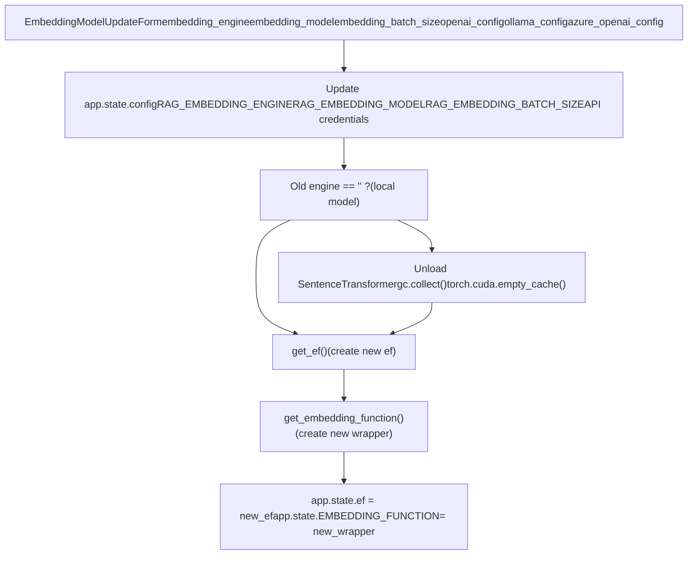
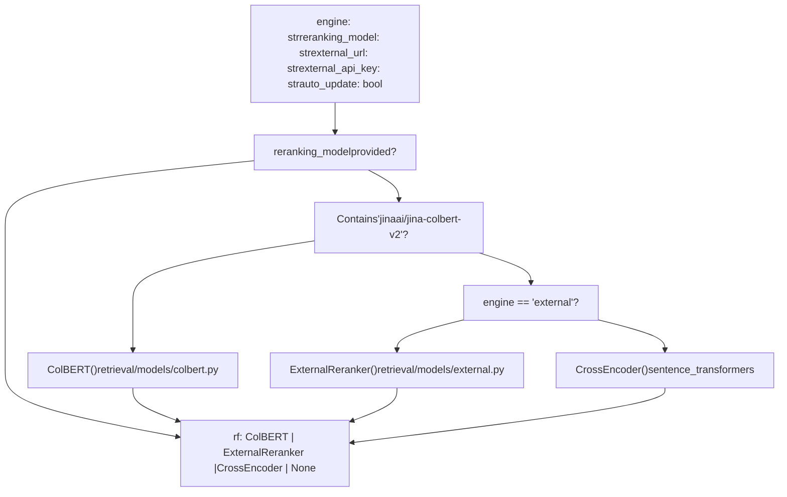
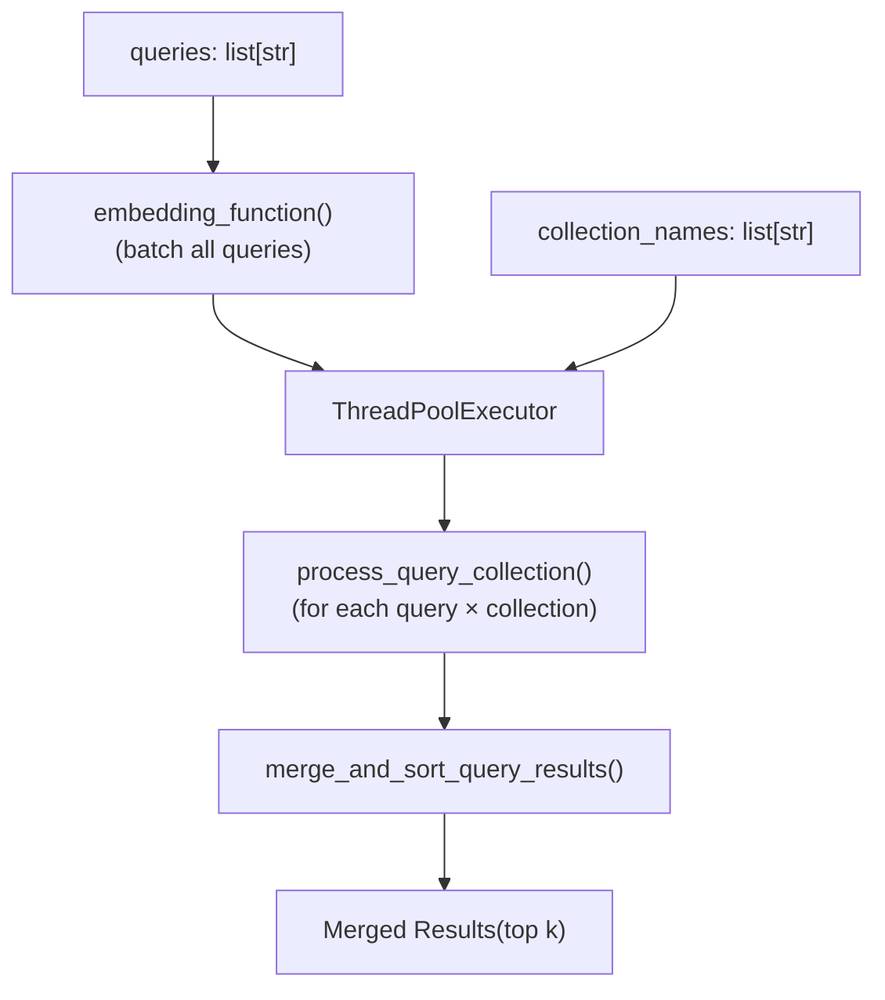

# Embedding and Vector Storage

Relevant source files

-   [backend/open\_webui/config.py](https://github.com/open-webui/open-webui/blob/a7271532/backend/open_webui/config.py)
-   [backend/open\_webui/main.py](https://github.com/open-webui/open-webui/blob/a7271532/backend/open_webui/main.py)
-   [backend/open\_webui/retrieval/loaders/datalab\_marker.py](https://github.com/open-webui/open-webui/blob/a7271532/backend/open_webui/retrieval/loaders/datalab_marker.py)
-   [backend/open\_webui/retrieval/loaders/external\_document.py](https://github.com/open-webui/open-webui/blob/a7271532/backend/open_webui/retrieval/loaders/external_document.py)
-   [backend/open\_webui/retrieval/loaders/external\_web.py](https://github.com/open-webui/open-webui/blob/a7271532/backend/open_webui/retrieval/loaders/external_web.py)
-   [backend/open\_webui/retrieval/loaders/main.py](https://github.com/open-webui/open-webui/blob/a7271532/backend/open_webui/retrieval/loaders/main.py)
-   [backend/open\_webui/retrieval/loaders/mineru.py](https://github.com/open-webui/open-webui/blob/a7271532/backend/open_webui/retrieval/loaders/mineru.py)
-   [backend/open\_webui/retrieval/loaders/mistral.py](https://github.com/open-webui/open-webui/blob/a7271532/backend/open_webui/retrieval/loaders/mistral.py)
-   [backend/open\_webui/retrieval/utils.py](https://github.com/open-webui/open-webui/blob/a7271532/backend/open_webui/retrieval/utils.py)
-   [backend/open\_webui/routers/retrieval.py](https://github.com/open-webui/open-webui/blob/a7271532/backend/open_webui/routers/retrieval.py)
-   [backend/open\_webui/utils/middleware.py](https://github.com/open-webui/open-webui/blob/a7271532/backend/open_webui/utils/middleware.py)
-   [src/lib/apis/retrieval/index.ts](https://github.com/open-webui/open-webui/blob/a7271532/src/lib/apis/retrieval/index.ts)
-   [src/lib/components/admin/Settings/Documents.svelte](https://github.com/open-webui/open-webui/blob/a7271532/src/lib/components/admin/Settings/Documents.svelte)
-   [src/lib/components/admin/Settings/WebSearch.svelte](https://github.com/open-webui/open-webui/blob/a7271532/src/lib/components/admin/Settings/WebSearch.svelte)

This page documents the embedding generation and vector storage subsystem within Open WebUI's RAG pipeline. It covers the embedding engines (local, Ollama, OpenAI, Azure OpenAI), embedding models, vector database options (ChromaDB, Qdrant, Milvus, Pinecone, OpenSearch, Elasticsearch), and the configuration system that ties them together.

For information about document processing before embedding, see [Document Processing Pipeline](/open-webui/open-webui/9.1-tiptap-editor-architecture). For retrieval strategies that use these embeddings, see [Retrieval Strategies](/open-webui/open-webui/9.3-collaborative-editing).

## System Architecture

The embedding and vector storage system consists of three main layers: embedding generation, vector storage, and configuration management. The system supports multiple embedding engines and six different vector database backends.

### Embedding and Storage Flow

```mermaid
flowchart TD
    Docs["Document Chunks(from text splitters)"]
    EmbeddingEngine["get_embedding_function()retrieval/utils.py"]
    LocalEF["SentenceTransformerLocal Models"]
    OllamaEF["Ollama APIEmbedding Endpoint"]
    OpenAIEF["OpenAI APItext-embedding-*"]
    AzureEF["Azure OpenAIEmbedding Deployment"]
    EF["app.state.ef(SentenceTransformer)"]
    EMBEDDING_FUNCTION["app.state.EMBEDDING_FUNCTION(Callable wrapper)"]
    VectorClient["VECTOR_DB_CLIENTretrieval/vector/factory.py"]
    Chroma["ChromaDBchromadb==1.0.20"]
    Qdrant["Qdrantqdrant-client==1.14.3"]
    Milvus["Milvuspymilvus==2.5.0"]
    Pinecone["Pineconepinecone==6.0.2"]
    OpenSearch["OpenSearchopensearch-py==2.8.0"]
    Elastic["Elasticsearchelasticsearch==9.1.0"]
    Config["app.state.configRAG_EMBEDDING_ENGINERAG_EMBEDDING_MODELVECTOR_DB"]

    EmbeddingEngine --> LocalEF
    EmbeddingEngine --> OllamaEF
    EmbeddingEngine --> OpenAIEF
    EmbeddingEngine --> AzureEF
    EF --> EMBEDDING_FUNCTION
    VectorClient --> Chroma
    VectorClient --> Qdrant
    VectorClient --> Milvus
    VectorClient --> Pinecone
    VectorClient --> OpenSearch
    VectorClient --> Elastic
    Docs --> EMBEDDING_FUNCTION
    EMBEDDING --> FUNCTION_VectorClient
    Config --> EmbeddingEngine
    Config --> VectorClient
```


**Sources:** [backend/open\_webui/main.py952-1010](https://github.com/open-webui/open-webui/blob/a7271532/backend/open_webui/main.py#L952-L1010) [backend/open\_webui/retrieval/utils.py](https://github.com/open-webui/open-webui/blob/a7271532/backend/open_webui/retrieval/utils.py) [backend/open\_webui/retrieval/vector/factory.py](https://github.com/open-webui/open-webui/blob/a7271532/backend/open_webui/retrieval/vector/factory.py)

## Embedding Engines and Models

### Embedding Engine Configuration

Open WebUI supports four embedding engines, configured via `RAG_EMBEDDING_ENGINE`:

| Engine | Value | Description | Configuration Required |
| --- | --- | --- | --- |
| Local | `""` (empty string) | SentenceTransformer models running locally | Model name/path |
| Ollama | `"ollama"` | Ollama embedding API | `RAG_OLLAMA_BASE_URL`, `RAG_OLLAMA_API_KEY` |
| OpenAI | `"openai"` | OpenAI embedding API | `RAG_OPENAI_API_BASE_URL`, `RAG_OPENAI_API_KEY` |
| Azure OpenAI | `"azure_openai"` | Azure OpenAI deployment | `RAG_AZURE_OPENAI_BASE_URL`, `RAG_AZURE_OPENAI_API_KEY`, `RAG_AZURE_OPENAI_API_VERSION` |

**Sources:** [backend/open\_webui/config.py](https://github.com/open-webui/open-webui/blob/a7271532/backend/open_webui/config.py) [backend/open\_webui/main.py858-877](https://github.com/open-webui/open-webui/blob/a7271532/backend/open_webui/main.py#L858-L877)

### Local Embedding Initialization


The `get_ef()` function in [backend/open\_webui/routers/retrieval.py120-141](https://github.com/open-webui/open-webui/blob/a7271532/backend/open_webui/routers/retrieval.py#L120-L141) initializes local embedding models:

-   Uses `SentenceTransformer` from the `sentence-transformers` library
-   Automatically downloads models from HuggingFace Hub if needed
-   Configures device placement (`DEVICE_TYPE`: cpu/cuda/mps)
-   Respects `RAG_EMBEDDING_MODEL_TRUST_REMOTE_CODE` for custom models
-   Supports custom backends via `SENTENCE_TRANSFORMERS_BACKEND`

**Sources:** [backend/open\_webui/routers/retrieval.py120-141](https://github.com/open-webui/open-webui/blob/a7271532/backend/open_webui/routers/retrieval.py#L120-L141) [backend/open\_webui/retrieval/utils.py46-81](https://github.com/open-webui/open-webui/blob/a7271532/backend/open_webui/retrieval/utils.py#L46-L81) [backend/open\_webui/env.py](https://github.com/open-webui/open-webui/blob/a7271532/backend/open_webui/env.py)

### Embedding Function Wrapper

The main application creates a unified embedding function interface at [backend/open\_webui/main.py976-1004](https://github.com/open-webui/open-webui/blob/a7271532/backend/open_webui/main.py#L976-L1004):

```
app.state.EMBEDDING_FUNCTION = get_embedding_function(
    engine=app.state.config.RAG_EMBEDDING_ENGINE,
    embedding_model=app.state.config.RAG_EMBEDDING_MODEL,
    embedding_function=app.state.ef,  # Local SentenceTransformer instance
    url=(...),  # API base URL based on engine
    key=(...),  # API key based on engine
    embedding_batch_size=app.state.config.RAG_EMBEDDING_BATCH_SIZE,
    azure_api_version=(...)  # Azure-specific
)
```
This wrapper handles:

-   Batch processing of embeddings
-   Prefix injection for queries vs documents (`RAG_EMBEDDING_QUERY_PREFIX`, `RAG_EMBEDDING_CONTENT_PREFIX`)
-   User context passing for API-based engines
-   Engine-specific parameter handling

**Sources:** [backend/open\_webui/main.py976-1004](https://github.com/open-webui/open-webui/blob/a7271532/backend/open_webui/main.py#L976-L1004) [backend/open\_webui/retrieval/utils.py](https://github.com/open-webui/open-webui/blob/a7271532/backend/open_webui/retrieval/utils.py)

### Embedding Prefixes

The system supports prefix injection to improve retrieval quality:

| Prefix Type | Config Variable | Usage |
| --- | --- | --- |
| Query Prefix | `RAG_EMBEDDING_QUERY_PREFIX` | Added to search queries |
| Content Prefix | `RAG_EMBEDDING_CONTENT_PREFIX` | Added to document chunks during indexing |

These prefixes are applied in [backend/open\_webui/retrieval/utils.py52-82](https://github.com/open-webui/open-webui/blob/a7271532/backend/open_webui/retrieval/utils.py#L52-L82) within the `VectorSearchRetriever` class.

**Sources:** [backend/open\_webui/config.py](https://github.com/open-webui/open-webui/blob/a7271532/backend/open_webui/config.py) [backend/open\_webui/retrieval/utils.py52-82](https://github.com/open-webui/open-webui/blob/a7271532/backend/open_webui/retrieval/utils.py#L52-L82)

## Vector Database Storage

### Vector Database Factory


The vector database client is initialized as a singleton via the factory pattern in [backend/open\_webui/retrieval/vector/factory.py](https://github.com/open-webui/open-webui/blob/a7271532/backend/open_webui/retrieval/vector/factory.py) The `VECTOR_DB_CLIENT` global instance is used throughout the application.

**Sources:** [backend/open\_webui/retrieval/vector/factory.py](https://github.com/open-webui/open-webui/blob/a7271532/backend/open_webui/retrieval/vector/factory.py) [backend/requirements.txt60-67](https://github.com/open-webui/open-webui/blob/a7271532/backend/requirements.txt#L60-L67)

### Vector Database Options

#### ChromaDB (Default)

```
chromadb==1.0.20
```
-   **Default vector store** for Open WebUI
-   Embedded database, no separate server required
-   Persistent storage in `CHROMA_DATA_PATH`
-   Supports metadata filtering and distance metrics

**Sources:** [backend/requirements.txt62](https://github.com/open-webui/open-webui/blob/a7271532/backend/requirements.txt#L62-L62)

#### Qdrant

```
qdrant-client==1.14.3
```
-   High-performance vector search engine
-   Supports both embedded and server modes
-   Advanced filtering capabilities
-   Requires `QDRANT_URL` configuration

**Sources:** [backend/requirements.txt64](https://github.com/open-webui/open-webui/blob/a7271532/backend/requirements.txt#L64-L64)

#### Milvus

```
pymilvus==2.5.0
```
-   Distributed vector database
-   **Supports multi-tenancy** via collection aliases
-   Scalable for large deployments
-   Requires `MILVUS_URI` configuration

**Sources:** [backend/requirements.txt63](https://github.com/open-webui/open-webui/blob/a7271532/backend/requirements.txt#L63-L63)

#### Pinecone

```
pinecone==6.0.2
```
-   Managed cloud vector database
-   Serverless scaling
-   Requires `PINECONE_API_KEY` and `PINECONE_ENVIRONMENT`

**Sources:** [backend/requirements.txt67](https://github.com/open-webui/open-webui/blob/a7271532/backend/requirements.txt#L67-L67)

#### OpenSearch

```
opensearch-py==2.8.0
```
-   Distributed search and analytics engine
-   Supports hybrid search (BM25 + vector)
-   Requires OpenSearch cluster configuration

**Sources:** [backend/requirements.txt61](https://github.com/open-webui/open-webui/blob/a7271532/backend/requirements.txt#L61-L61)

#### Elasticsearch

```
elasticsearch==9.1.0
```
-   Distributed search engine with vector capabilities
-   Dense vector search with HNSW algorithm
-   Requires Elasticsearch cluster

**Sources:** [backend/requirements.txt66](https://github.com/open-webui/open-webui/blob/a7271532/backend/requirements.txt#L66-L66)

### Collection Management

Vector databases organize embeddings into collections, where each knowledge base or file gets its own collection:


Each collection stores:

-   **Vectors**: Embedding arrays (dimension determined by embedding model)
-   **Documents**: Original text chunks
-   **Metadatas**: Source information, page numbers, file paths
-   **IDs**: Unique identifiers for each chunk

**Sources:** [backend/open\_webui/retrieval/utils.py84-116](https://github.com/open-webui/open-webui/blob/a7271532/backend/open_webui/retrieval/utils.py#L84-L116) [backend/open\_webui/retrieval/vector/main.py](https://github.com/open-webui/open-webui/blob/a7271532/backend/open_webui/retrieval/vector/main.py)

## Embedding API Configuration

### Embedding Configuration Endpoint


The GET endpoint at [backend/open\_webui/routers/retrieval.py231-251](https://github.com/open-webui/open-webui/blob/a7271532/backend/open_webui/routers/retrieval.py#L231-L251) returns current embedding configuration to admin users.

**Sources:** [backend/open\_webui/routers/retrieval.py231-251](https://github.com/open-webui/open-webui/blob/a7271532/backend/open_webui/routers/retrieval.py#L231-L251)

### Embedding Update Endpoint


The update endpoint at [backend/open\_webui/routers/retrieval.py279-398](https://github.com/open-webui/open-webui/blob/a7271532/backend/open_webui/routers/retrieval.py#L279-L398) handles embedding model changes:

1.  **Unloads old model** if switching from local engine (frees VRAM)
2.  **Updates configuration** for the new engine and model
3.  **Initializes new embedding function** via `get_ef()`
4.  **Creates new wrapper** with appropriate API credentials
5.  **Updates application state** with new functions

**Sources:** [backend/open\_webui/routers/retrieval.py279-398](https://github.com/open-webui/open-webui/blob/a7271532/backend/open_webui/routers/retrieval.py#L279-L398)

### Frontend Configuration Interface

The admin settings UI for embedding configuration is implemented in [src/lib/components/admin/Settings/Documents.svelte1-265](https://github.com/open-webui/open-webui/blob/a7271532/src/lib/components/admin/Settings/Documents.svelte#L1-L265):

| UI Element | Config Variable | Lines |
| --- | --- | --- |
| Embedding Engine Dropdown | `embeddingEngine` | 41 |
| Embedding Model Input | `embeddingModel` | 42 |
| Batch Size Input | `embeddingBatchSize` | 43 |
| OpenAI URL/Key | `OpenAIUrl`, `OpenAIKey` | 46-47 |
| Azure URL/Key/Version | `AzureOpenAIUrl`, `AzureOpenAIKey`, `AzureOpenAIVersion` | 49-51 |
| Ollama URL/Key | `OllamaUrl`, `OllamaKey` | 53-54 |

The `embeddingModelUpdateHandler()` at [src/lib/components/admin/Settings/Documents.svelte66-136](https://github.com/open-webui/open-webui/blob/a7271532/src/lib/components/admin/Settings/Documents.svelte#L66-L136) performs validation and calls the update API.

**Sources:** [src/lib/components/admin/Settings/Documents.svelte1-265](https://github.com/open-webui/open-webui/blob/a7271532/src/lib/components/admin/Settings/Documents.svelte#L1-L265) [src/lib/apis/retrieval/index.ts155-229](https://github.com/open-webui/open-webui/blob/a7271532/src/lib/apis/retrieval/index.ts#L155-L229)

## Reranking Models

### Reranking Function Initialization


The reranking function supports three types:

1.  **ColBERT** ([colbert-ai==0.2.21](https://github.com/open-webui/open-webui/blob/a7271532/colbert-ai==0.2.21)): Multi-vector retrieval model for precise reranking
2.  **External Reranker**: HTTP API-based reranking service
3.  **CrossEncoder**: Local reranking model via sentence-transformers

**Sources:** [backend/open\_webui/routers/retrieval.py143-192](https://github.com/open-webui/open-webui/blob/a7271532/backend/open_webui/routers/retrieval.py#L143-L192) [backend/requirements.txt77](https://github.com/open-webui/open-webui/blob/a7271532/backend/requirements.txt#L77-L77)

### Reranking Integration

The reranking function is initialized at [backend/open\_webui/main.py1006-1010](https://github.com/open-webui/open-webui/blob/a7271532/backend/open_webui/main.py#L1006-L1010):

```
app.state.RERANKING_FUNCTION = get_reranking_function(
    app.state.config.RAG_RERANKING_ENGINE,
    app.state.config.RAG_RERANKING_MODEL,
    reranking_function=app.state.rf,
)
```
This is used in hybrid search scenarios (see [Retrieval Strategies](/open-webui/open-webui/9.3-collaborative-editing)) to improve ranking quality after initial retrieval.

**Sources:** [backend/open\_webui/main.py1006-1010](https://github.com/open-webui/open-webui/blob/a7271532/backend/open_webui/main.py#L1006-L1010) [backend/open\_webui/retrieval/utils.py118-207](https://github.com/open-webui/open-webui/blob/a7271532/backend/open_webui/retrieval/utils.py#L118-L207)

## Batch Processing and Optimization

### Embedding Batch Size

The `RAG_EMBEDDING_BATCH_SIZE` configuration controls how many documents are embedded in a single API call or GPU batch:

-   **Default**: 1 (process one at a time)
-   **API engines**: Reduces API calls and improves throughput
-   **Local models**: Optimizes GPU utilization

Configured at [backend/open\_webui/main.py998](https://github.com/open-webui/open-webui/blob/a7271532/backend/open_webui/main.py#L998-L998) and passed to the embedding function wrapper.

**Sources:** [backend/open\_webui/main.py998](https://github.com/open-webui/open-webui/blob/a7271532/backend/open_webui/main.py#L998-L998) [backend/open\_webui/config.py](https://github.com/open-webui/open-webui/blob/a7271532/backend/open_webui/config.py)

### Parallel Query Processing

When querying multiple collections, the system uses `ThreadPoolExecutor` for parallel processing:


The `query_collection()` function at [backend/open\_webui/retrieval/utils.py287-336](https://github.com/open-webui/open-webui/blob/a7271532/backend/open_webui/retrieval/utils.py#L287-L336):

1.  Generates all query embeddings in a single batch
2.  Launches parallel queries across all collection × query combinations
3.  Merges and deduplicates results
4.  Returns top-k results sorted by relevance

**Sources:** [backend/open\_webui/retrieval/utils.py287-336](https://github.com/open-webui/open-webui/blob/a7271532/backend/open_webui/retrieval/utils.py#L287-L336)

## Storage and Memory Management

### VRAM Management for Local Models

When switching from local embedding models, the system explicitly cleans up GPU memory:

```
if request.app.state.config.RAG_EMBEDDING_ENGINE == "":
    # Unload current internal embedding model
    request.app.state.ef = None
    request.app.state.EMBEDDING_FUNCTION = None
    import gc
    gc.collect()
    if DEVICE_TYPE == "cuda":
        import torch
        if torch.cuda.is_available():
            torch.cuda.empty_cache()
```
This prevents VRAM exhaustion when changing models at [backend/open\_webui/routers/retrieval.py286-297](https://github.com/open-webui/open-webui/blob/a7271532/backend/open_webui/routers/retrieval.py#L286-L297)

**Sources:** [backend/open\_webui/routers/retrieval.py286-297](https://github.com/open-webui/open-webui/blob/a7271532/backend/open_webui/routers/retrieval.py#L286-L297)

### Model Caching

Local embedding models are cached in `CACHE_DIR` to avoid repeated downloads. The `get_model_path()` function handles:

-   Checking local cache
-   Downloading from HuggingFace Hub if needed
-   Auto-update based on `RAG_EMBEDDING_MODEL_AUTO_UPDATE`

**Sources:** [backend/open\_webui/retrieval/utils.py](https://github.com/open-webui/open-webui/blob/a7271532/backend/open_webui/retrieval/utils.py) [backend/open\_webui/config.py](https://github.com/open-webui/open-webui/blob/a7271532/backend/open_webui/config.py)

## Configuration Summary

### Environment Variables

| Variable | Purpose | Default |
| --- | --- | --- |
| `RAG_EMBEDDING_ENGINE` | Embedding engine selection | `""` (local) |
| `RAG_EMBEDDING_MODEL` | Model name/path | Required |
| `RAG_EMBEDDING_BATCH_SIZE` | Batch size for embedding | 1 |
| `RAG_EMBEDDING_QUERY_PREFIX` | Prefix for query embeddings | `""` |
| `RAG_EMBEDDING_CONTENT_PREFIX` | Prefix for document embeddings | `""` |
| `RAG_OPENAI_API_BASE_URL` | OpenAI API base URL | \- |
| `RAG_OPENAI_API_KEY` | OpenAI API key | \- |
| `RAG_OLLAMA_BASE_URL` | Ollama API base URL | \- |
| `RAG_OLLAMA_API_KEY` | Ollama API key | \- |
| `RAG_AZURE_OPENAI_BASE_URL` | Azure OpenAI endpoint | \- |
| `RAG_AZURE_OPENAI_API_KEY` | Azure OpenAI key | \- |
| `RAG_AZURE_OPENAI_API_VERSION` | Azure API version | \- |
| `RAG_RERANKING_ENGINE` | Reranking engine | `""` |
| `RAG_RERANKING_MODEL` | Reranking model | \- |
| `RAG_EXTERNAL_RERANKER_URL` | External reranker URL | \- |
| `RAG_EXTERNAL_RERANKER_API_KEY` | External reranker key | \- |
| `VECTOR_DB` | Vector database selection | `"chroma"` |

**Sources:** [backend/open\_webui/config.py](https://github.com/open-webui/open-webui/blob/a7271532/backend/open_webui/config.py) [backend/open\_webui/env.py](https://github.com/open-webui/open-webui/blob/a7271532/backend/open_webui/env.py)

### Application State Variables

The main application maintains these state variables:

| State Variable | Type | Purpose |
| --- | --- | --- |
| `app.state.ef` | `SentenceTransformer | None` | Local embedding model instance |
| `app.state.EMBEDDING_FUNCTION` | `Callable` | Unified embedding function wrapper |
| `app.state.rf` | `ColBERT | CrossEncoder | None` | Reranking model instance |
| `app.state.RERANKING_FUNCTION` | `Callable` | Unified reranking function wrapper |
| `VECTOR_DB_CLIENT` | `VectorDBClient` | Global vector database client instance |

**Sources:** [backend/open\_webui/main.py944-1010](https://github.com/open-webui/open-webui/blob/a7271532/backend/open_webui/main.py#L944-L1010) [backend/open\_webui/retrieval/vector/factory.py](https://github.com/open-webui/open-webui/blob/a7271532/backend/open_webui/retrieval/vector/factory.py)
