# Retrieval Strategies

Relevant source files

-   [backend/open\_webui/config.py](https://github.com/open-webui/open-webui/blob/a7271532/backend/open_webui/config.py)
-   [backend/open\_webui/main.py](https://github.com/open-webui/open-webui/blob/a7271532/backend/open_webui/main.py)
-   [backend/open\_webui/retrieval/loaders/datalab\_marker.py](https://github.com/open-webui/open-webui/blob/a7271532/backend/open_webui/retrieval/loaders/datalab_marker.py)
-   [backend/open\_webui/retrieval/loaders/external\_document.py](https://github.com/open-webui/open-webui/blob/a7271532/backend/open_webui/retrieval/loaders/external_document.py)
-   [backend/open\_webui/retrieval/loaders/external\_web.py](https://github.com/open-webui/open-webui/blob/a7271532/backend/open_webui/retrieval/loaders/external_web.py)
-   [backend/open\_webui/retrieval/loaders/main.py](https://github.com/open-webui/open-webui/blob/a7271532/backend/open_webui/retrieval/loaders/main.py)
-   [backend/open\_webui/retrieval/loaders/mineru.py](https://github.com/open-webui/open-webui/blob/a7271532/backend/open_webui/retrieval/loaders/mineru.py)
-   [backend/open\_webui/retrieval/loaders/mistral.py](https://github.com/open-webui/open-webui/blob/a7271532/backend/open_webui/retrieval/loaders/mistral.py)
-   [backend/open\_webui/retrieval/utils.py](https://github.com/open-webui/open-webui/blob/a7271532/backend/open_webui/retrieval/utils.py)
-   [backend/open\_webui/routers/retrieval.py](https://github.com/open-webui/open-webui/blob/a7271532/backend/open_webui/routers/retrieval.py)
-   [backend/open\_webui/utils/middleware.py](https://github.com/open-webui/open-webui/blob/a7271532/backend/open_webui/utils/middleware.py)
-   [src/lib/apis/retrieval/index.ts](https://github.com/open-webui/open-webui/blob/a7271532/src/lib/apis/retrieval/index.ts)
-   [src/lib/components/admin/Settings/Documents.svelte](https://github.com/open-webui/open-webui/blob/a7271532/src/lib/components/admin/Settings/Documents.svelte)
-   [src/lib/components/admin/Settings/WebSearch.svelte](https://github.com/open-webui/open-webui/blob/a7271532/src/lib/components/admin/Settings/WebSearch.svelte)

## Purpose and Scope

This document covers the retrieval strategies used in Open WebUI's RAG (Retrieval Augmented Generation) system. It describes how the system queries vector databases to find relevant document chunks, including vector search, hybrid search combining BM25 and embeddings, text enrichment, and reranking techniques.

For information about document processing and embedding generation, see [Embedding and Vector Storage](/open-webui/open-webui/6.2-chat-request-processing-flow). For details on how retrieved content is injected into chat prompts, see [RAG Integration](/open-webui/open-webui/5.2-content-rendering-pipeline).

## Retrieval Architecture Overview

Open WebUI implements a multi-stage retrieval pipeline that progresses from broad retrieval to precise ranking:

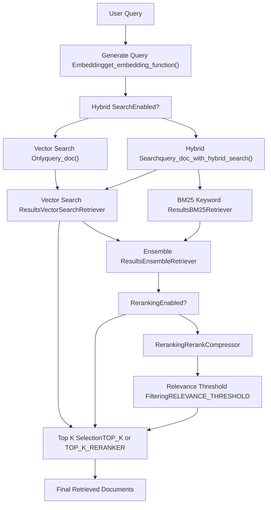
**Sources:** [backend/open\_webui/retrieval/utils.py207-314](https://github.com/open-webui/open-webui/blob/a7271532/backend/open_webui/retrieval/utils.py#L207-L314) [backend/open\_webui/config.py832-850](https://github.com/open-webui/open-webui/blob/a7271532/backend/open_webui/config.py#L832-L850)

## Vector Search

Vector search is the baseline retrieval strategy that uses semantic similarity between query and document embeddings.

### VectorSearchRetriever Implementation

The system implements a LangChain-compatible retriever for vector search:

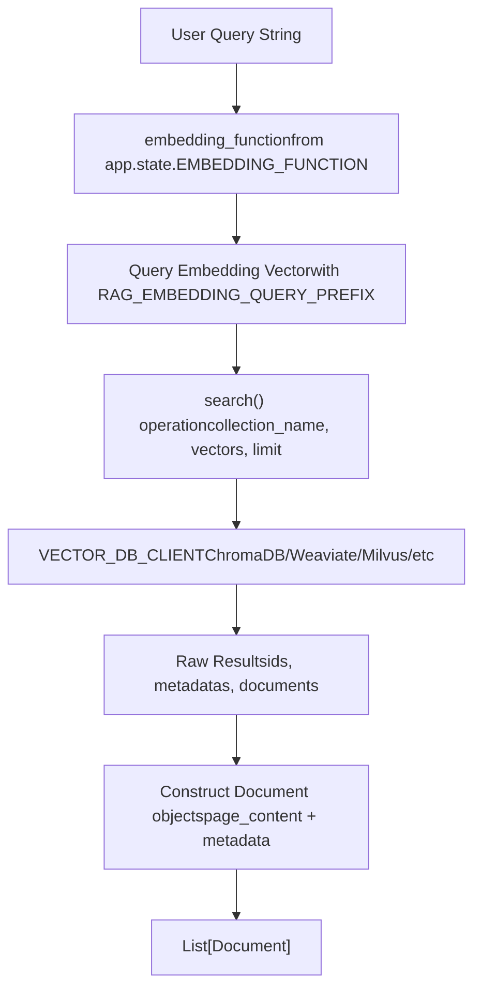
The `VectorSearchRetriever` class provides asynchronous vector search:

| Component | Code Entity | Description |
| --- | --- | --- |
| Retriever Class | `VectorSearchRetriever` | LangChain BaseRetriever implementation |
| Async Method | `_aget_relevant_documents()` | Performs embedding + vector search |
| Embedding | `await self.embedding_function(query, RAG_EMBEDDING_QUERY_PREFIX)` | Generates query embedding with prefix |
| Search Call | `VECTOR_DB_CLIENT.search()` | Queries vector database |
| Result Limit | `self.top_k` | Number of results to retrieve |

**Sources:** [backend/open\_webui/retrieval/utils.py88-132](https://github.com/open-webui/open-webui/blob/a7271532/backend/open_webui/retrieval/utils.py#L88-L132) [backend/open\_webui/config.py218-237](https://github.com/open-webui/open-webui/blob/a7271532/backend/open_webui/config.py#L218-L237)

### Direct Vector Query

For simple use cases, the `query_doc()` function provides direct vector search without LangChain abstractions:

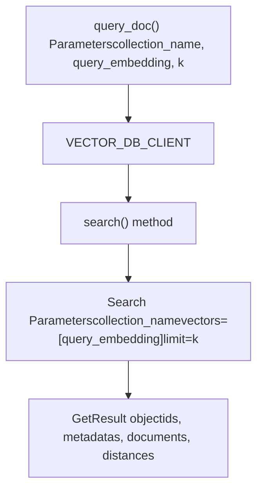
**Sources:** [backend/open\_webui/retrieval/utils.py135-152](https://github.com/open-webui/open-webui/blob/a7271532/backend/open_webui/retrieval/utils.py#L135-L152)

## Hybrid Search Strategy

Hybrid search combines semantic vector search with keyword-based BM25 search to improve retrieval quality. This addresses the limitation of vector search alone, which may miss exact keyword matches.

### Hybrid Search Pipeline

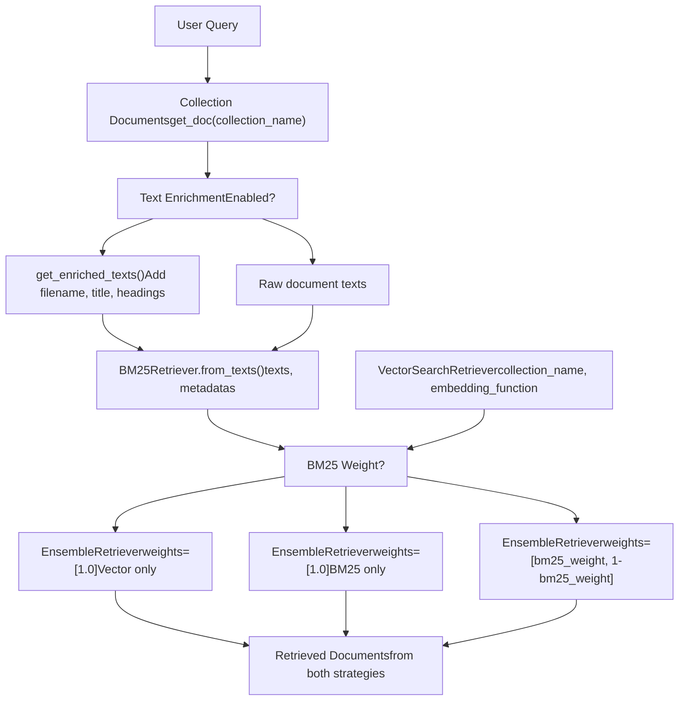
### Configuration Parameters

| Parameter | Type | Default | Purpose |
| --- | --- | --- | --- |
| `ENABLE_RAG_HYBRID_SEARCH` | boolean | varies | Enable/disable hybrid search |
| `HYBRID_BM25_WEIGHT` | float | configurable | Weight for BM25 (0-1), remainder for vector |
| `ENABLE_RAG_HYBRID_SEARCH_ENRICHED_TEXTS` | boolean | varies | Add metadata to texts for better BM25 |
| `TOP_K` | integer | 4 | Initial results before reranking |
| `TOP_K_RERANKER` | integer | 4 | Results after reranking |

**Sources:** [backend/open\_webui/retrieval/utils.py207-314](https://github.com/open-webui/open-webui/blob/a7271532/backend/open_webui/retrieval/utils.py#L207-L314) [backend/open\_webui/config.py832-850](https://github.com/open-webui/open-webui/blob/a7271532/backend/open_webui/config.py#L832-L850) [backend/open\_webui/main.py832-850](https://github.com/open-webui/open-webui/blob/a7271532/backend/open_webui/main.py#L832-L850)

## Text Enrichment for BM25

The `get_enriched_texts()` function enhances document texts with metadata to improve BM25 keyword matching:

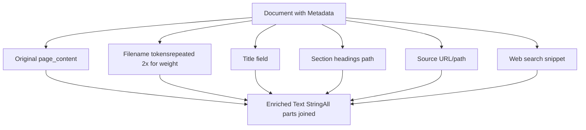
### Enrichment Process

The enrichment adds weighted metadata to improve keyword-based retrieval:

1.  **Filename Processing**: Extracts filename, tokenizes by splitting on `_`, `-`, `.`, and repeats twice for extra BM25 weight
2.  **Title Addition**: Adds document title if present in metadata
3.  **Section Headings**: Includes hierarchical section path from markdown splitter metadata
4.  **Source Information**: Adds source URL or file path
5.  **Snippet Inclusion**: For web search results, includes the snippet text

Example enriched text structure:

```
[Original content]
Filename: report.pdf report pdf report pdf
Title: Q4 Financial Analysis
Section: Executive Summary > Key Findings
Source: /uploads/reports/report.pdf
```
**Sources:** [backend/open\_webui/retrieval/utils.py169-204](https://github.com/open-webui/open-webui/blob/a7271532/backend/open_webui/retrieval/utils.py#L169-L204)

## Reranking

After initial retrieval, reranking refines results using more sophisticated scoring models. This two-stage approach balances efficiency (fast initial retrieval) with accuracy (precise reranking).

### Reranking Architecture

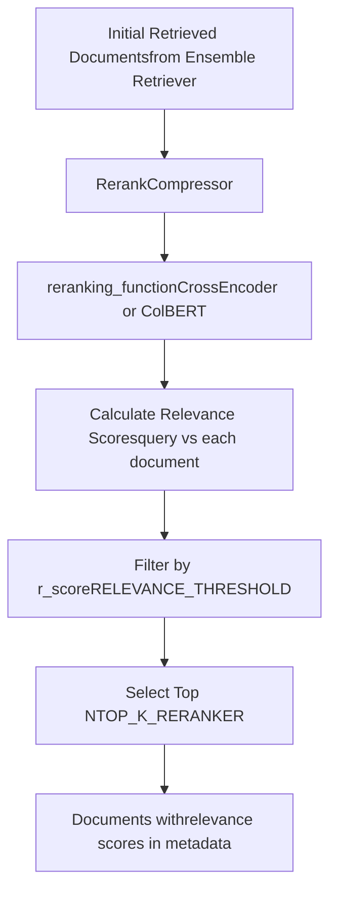
### Reranking Models

The system supports three reranking strategies:

| Model Type | Implementation | Code Entity | Use Case |
| --- | --- | --- | --- |
| CrossEncoder | `sentence_transformers.CrossEncoder` | `get_rf()` default | General purpose, fast |
| ColBERT | `open_webui.retrieval.models.colbert.ColBERT` | `get_rf()` for jina-colbert-v2 | Multi-vector matching |
| External | `open_webui.retrieval.models.external.ExternalReranker` | `get_rf()` with external engine | Custom API endpoint |

### RerankCompressor Implementation

The `RerankCompressor` is a LangChain document compressor that performs reranking:

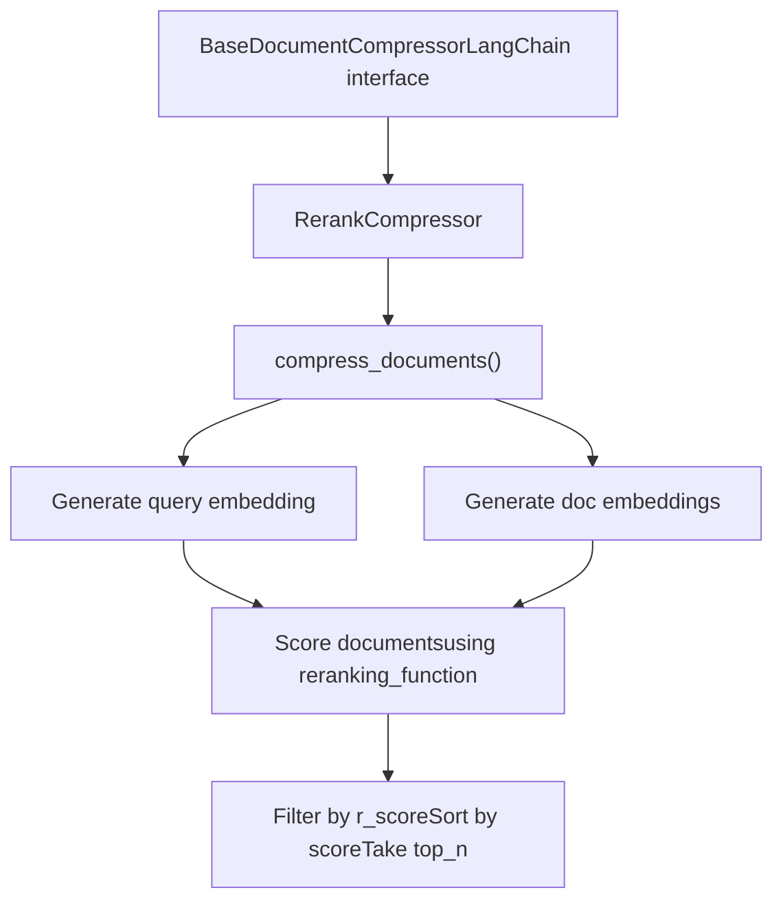
**Sources:** [backend/open\_webui/retrieval/utils.py452-560](https://github.com/open-webui/open-webui/blob/a7271532/backend/open_webui/retrieval/utils.py#L452-L560) [backend/open\_webui/routers/retrieval.py146-215](https://github.com/open-webui/open-webui/blob/a7271532/backend/open_webui/routers/retrieval.py#L146-L215)

### ContextualCompressionRetriever

The reranking is integrated using LangChain's `ContextualCompressionRetriever`:

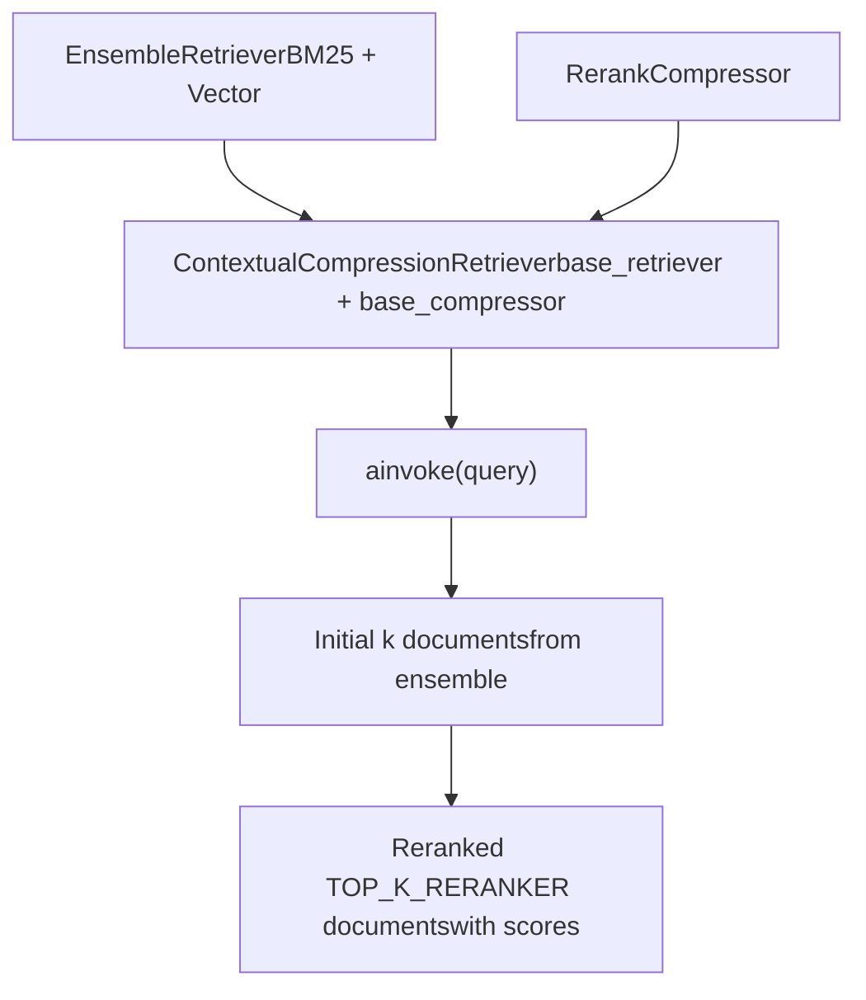
**Sources:** [backend/open\_webui/retrieval/utils.py272-283](https://github.com/open-webui/open-webui/blob/a7271532/backend/open_webui/retrieval/utils.py#L272-L283)

## Query Processing

The retrieval system processes queries through embedding and supports multi-query strategies:

### Query Embedding Pipeline

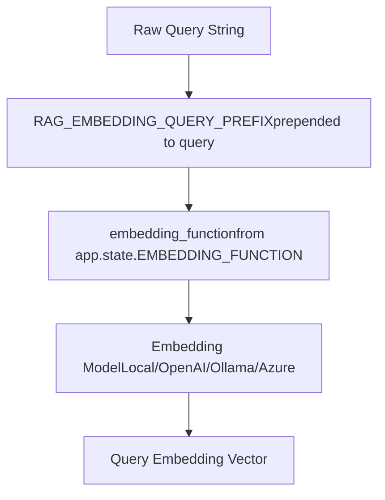
### Multi-Query Collection Retrieval

The `query_collection()` function supports querying multiple collections with multiple queries:

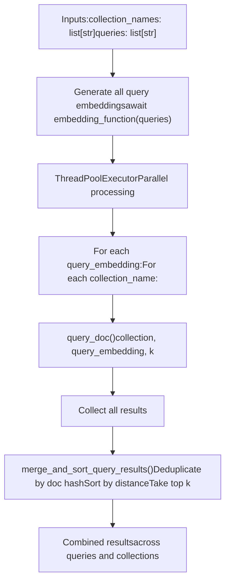
**Sources:** [backend/open\_webui/retrieval/utils.py402-458](https://github.com/open-webui/open-webui/blob/a7271532/backend/open_webui/retrieval/utils.py#L402-L458) [backend/open\_webui/retrieval/utils.py338-382](https://github.com/open-webui/open-webui/blob/a7271532/backend/open_webui/retrieval/utils.py#L338-L382)

## Configuration Management

Retrieval strategy configuration is managed through the `AppConfig` system with persistence:

### Configuration Flow

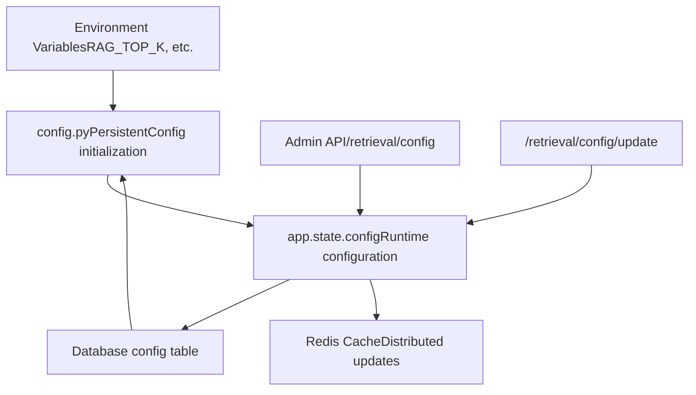
### Key Configuration Endpoints

| Endpoint | Method | Purpose |
| --- | --- | --- |
| `/retrieval/config` | GET | Get current RAG configuration |
| `/retrieval/config/update` | POST | Update RAG settings |
| `/retrieval/query/settings` | GET | Get query settings (k, r, template) |
| `/retrieval/query/settings/update` | POST | Update query settings |

### Runtime Configuration Access

Configuration values are accessed through the application state:

```
# In request handlers:
top_k = request.app.state.config.TOP_K
top_k_reranker = request.app.state.config.TOP_K_RERANKER
relevance_threshold = request.app.state.config.RELEVANCE_THRESHOLD
hybrid_bm25_weight = request.app.state.config.HYBRID_BM25_WEIGHT
enable_hybrid = request.app.state.config.ENABLE_RAG_HYBRID_SEARCH
```
**Sources:** [backend/open\_webui/config.py224-283](https://github.com/open-webui/open-webui/blob/a7271532/backend/open_webui/config.py#L224-L283) [backend/open\_webui/routers/retrieval.py434-550](https://github.com/open-webui/open-webui/blob/a7271532/backend/open_webui/routers/retrieval.py#L434-L550) [backend/open\_webui/main.py832-850](https://github.com/open-webui/open-webui/blob/a7271532/backend/open_webui/main.py#L832-L850)

## Integration with Chat Pipeline

Retrieval strategies are invoked during chat processing through the middleware system:

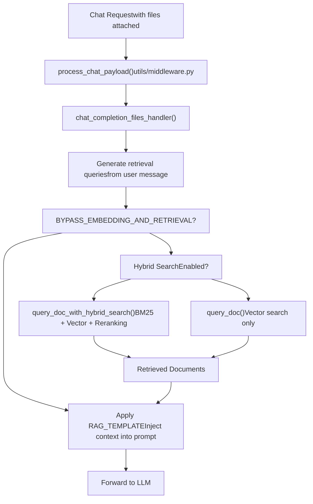
### File-Based Retrieval Flow

When files are attached to a chat:

1.  **Query Generation**: System optionally generates optimized retrieval queries from the user message
2.  **Collection Lookup**: Maps file IDs to vector collection names
3.  **Retrieval Execution**: Calls appropriate retrieval strategy based on configuration
4.  **Context Assembly**: Combines retrieved documents with metadata (sources, citations)
5.  **Template Application**: Injects retrieved context into the prompt using `RAG_TEMPLATE`

**Sources:** [backend/open\_webui/utils/middleware.py895-1169](https://github.com/open-webui/open-webui/blob/a7271532/backend/open_webui/utils/middleware.py#L895-L1169) [backend/open\_webui/retrieval/utils.py583-715](https://github.com/open-webui/open-webui/blob/a7271532/backend/open_webui/retrieval/utils.py#L583-L715)

## Result Merging and Deduplication

When querying multiple collections or using multiple queries, results are merged and deduplicated:

### Merge Algorithm

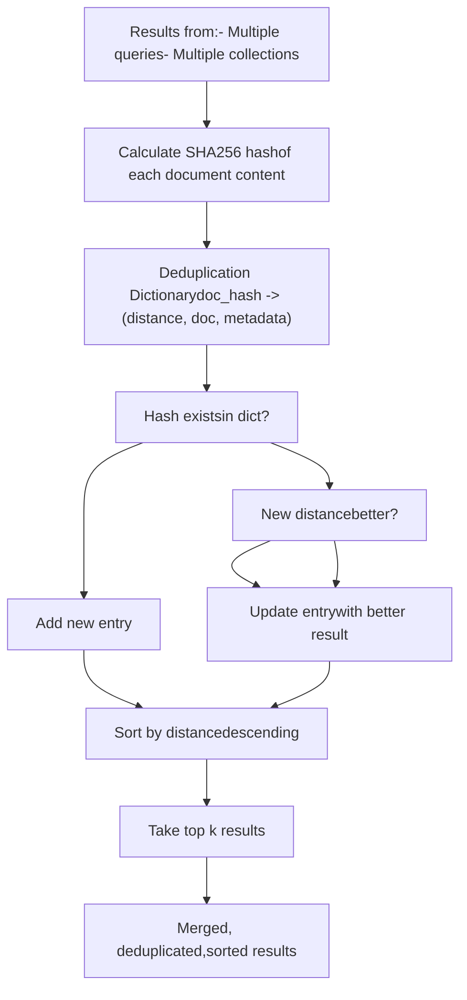
The merging logic ensures:

-   No duplicate documents (based on content hash)
-   Best score retained for duplicates
-   Results sorted by relevance
-   Configurable top-k selection

**Sources:** [backend/open\_webui/retrieval/utils.py338-382](https://github.com/open-webui/open-webui/blob/a7271532/backend/open_webui/retrieval/utils.py#L338-L382)

## Frontend Configuration Interface

The retrieval strategy settings are configurable through the admin interface:

### Query Settings UI

The admin panel exposes the following controls:

| Setting | UI Control | Config Path |
| --- | --- | --- |
| Top K | Number input | `TOP_K` |
| Relevance Threshold | Slider (0-1) | `RELEVANCE_THRESHOLD` |
| Enable Hybrid Search | Toggle switch | `ENABLE_RAG_HYBRID_SEARCH` |
| BM25 Weight | Slider (0-1) | `HYBRID_BM25_WEIGHT` |
| Top K Reranker | Number input | `TOP_K_RERANKER` |
| Enable Enriched Texts | Toggle switch | `ENABLE_RAG_HYBRID_SEARCH_ENRICHED_TEXTS` |

**Sources:** [src/lib/components/admin/Settings/Documents.svelte1-274](https://github.com/open-webui/open-webui/blob/a7271532/src/lib/components/admin/Settings/Documents.svelte#L1-L274) [src/lib/apis/retrieval/index.ts93-154](https://github.com/open-webui/open-webui/blob/a7271532/src/lib/apis/retrieval/index.ts#L93-L154)
