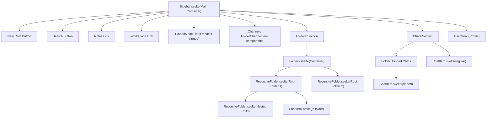
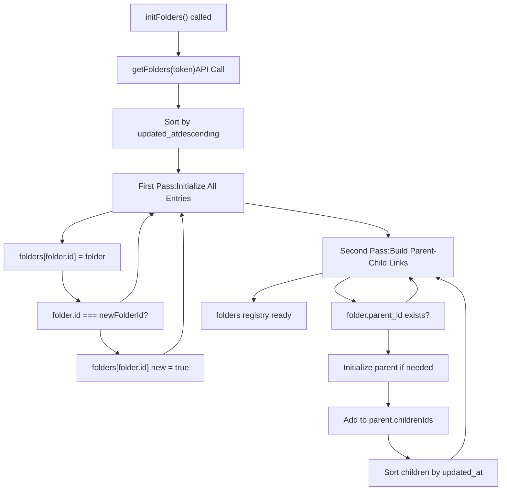
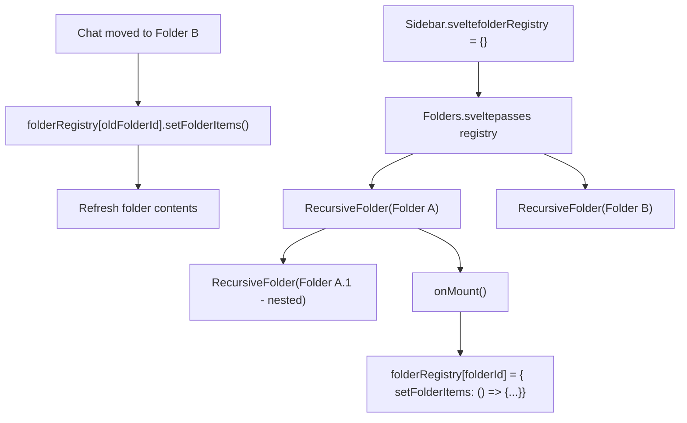
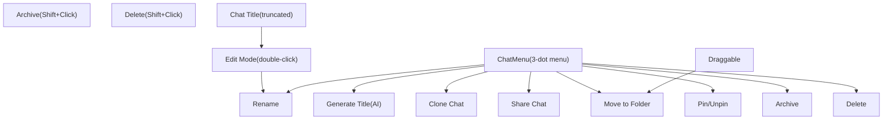
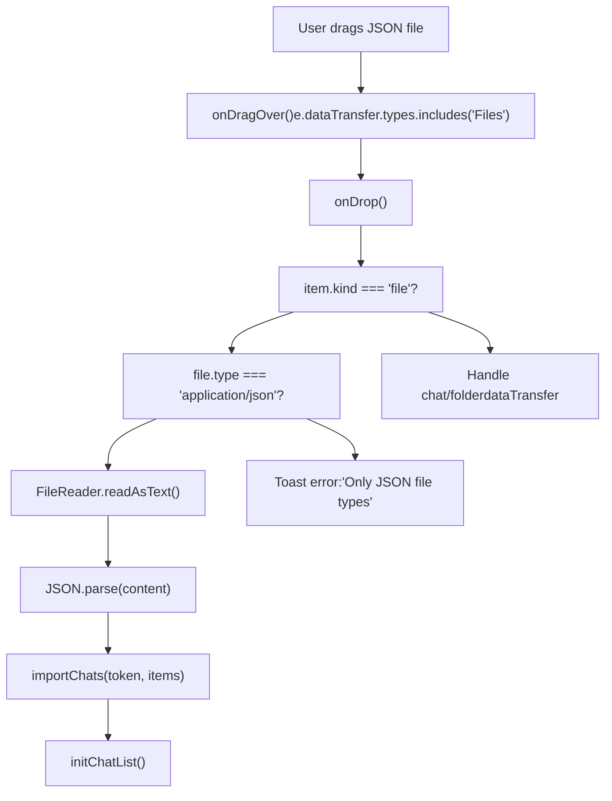

# Navigation and Organization

Relevant source files

-   [backend/open\_webui/migrations/versions/1af9b942657b\_migrate\_tags.py](https://github.com/open-webui/open-webui/blob/a7271532/backend/open_webui/migrations/versions/1af9b942657b_migrate_tags.py)
-   [backend/open\_webui/migrations/versions/3ab32c4b8f59\_update\_tags.py](https://github.com/open-webui/open-webui/blob/a7271532/backend/open_webui/migrations/versions/3ab32c4b8f59_update_tags.py)
-   [backend/open\_webui/migrations/versions/c69f45358db4\_add\_folder\_table.py](https://github.com/open-webui/open-webui/blob/a7271532/backend/open_webui/migrations/versions/c69f45358db4_add_folder_table.py)
-   [src/lib/apis/folders/index.ts](https://github.com/open-webui/open-webui/blob/a7271532/src/lib/apis/folders/index.ts)
-   [src/lib/components/common/ConfirmDialog.svelte](https://github.com/open-webui/open-webui/blob/a7271532/src/lib/components/common/ConfirmDialog.svelte)
-   [src/lib/components/common/DragGhost.svelte](https://github.com/open-webui/open-webui/blob/a7271532/src/lib/components/common/DragGhost.svelte)
-   [src/lib/components/common/Folder.svelte](https://github.com/open-webui/open-webui/blob/a7271532/src/lib/components/common/Folder.svelte)
-   [src/lib/components/icons/Document.svelte](https://github.com/open-webui/open-webui/blob/a7271532/src/lib/components/icons/Document.svelte)
-   [src/lib/components/layout/Sidebar.svelte](https://github.com/open-webui/open-webui/blob/a7271532/src/lib/components/layout/Sidebar.svelte)
-   [src/lib/components/layout/Sidebar/ChatItem.svelte](https://github.com/open-webui/open-webui/blob/a7271532/src/lib/components/layout/Sidebar/ChatItem.svelte)
-   [src/lib/components/layout/Sidebar/Folders.svelte](https://github.com/open-webui/open-webui/blob/a7271532/src/lib/components/layout/Sidebar/Folders.svelte)
-   [src/lib/components/layout/Sidebar/Folders/FolderMenu.svelte](https://github.com/open-webui/open-webui/blob/a7271532/src/lib/components/layout/Sidebar/Folders/FolderMenu.svelte)
-   [src/lib/components/layout/Sidebar/RecursiveFolder.svelte](https://github.com/open-webui/open-webui/blob/a7271532/src/lib/components/layout/Sidebar/RecursiveFolder.svelte)
-   [src/lib/components/workspace/Knowledge/ItemMenu.svelte](https://github.com/open-webui/open-webui/blob/a7271532/src/lib/components/workspace/Knowledge/ItemMenu.svelte)

This document covers Open WebUI's navigation and organization system, which provides users with a hierarchical sidebar for organizing chats into folders, pinning important conversations, and accessing channels. The system supports unlimited folder nesting, drag-and-drop organization, and persistent expansion states.

For information about the chat interface itself, see [Chat System](/open-webui/open-webui/4-chat-system). For details about search functionality within the sidebar, see [Chat Component Architecture](/open-webui/open-webui/4.1-chat-component-architecture). For sharing chats with others, see [Chat Sharing](/open-webui/open-webui/8.5-chat-sharing).

## Purpose and Scope

The Navigation and Organization system encompasses:

-   **Sidebar Component**: Main navigation container with collapsible sections
-   **Folder System**: Recursive folder hierarchy with drag-and-drop support
-   **Chat Items**: Individual chat entries with context menus and actions
-   **Pinned Chats**: Special section for pinned conversations
-   **Channels**: Team collaboration spaces (when enabled)
-   **Drag-and-Drop**: Organizing chats and folders via drag-and-drop
-   **State Persistence**: Folder expansion states and sidebar width

The system is implemented primarily in the frontend with Svelte components, backed by folder and chat APIs for persistence.

## Component Hierarchy

The sidebar navigation follows a hierarchical component structure with clear parent-child relationships:

**Sidebar Component Hierarchy**


Sources: [src/lib/components/layout/Sidebar.svelte1-1379](https://github.com/open-webui/open-webui/blob/a7271532/src/lib/components/layout/Sidebar.svelte#L1-L1379) [src/lib/components/layout/Sidebar/Folders.svelte1-63](https://github.com/open-webui/open-webui/blob/a7271532/src/lib/components/layout/Sidebar/Folders.svelte#L1-L63) [src/lib/components/layout/Sidebar/RecursiveFolder.svelte1-663](https://github.com/open-webui/open-webui/blob/a7271532/src/lib/components/layout/Sidebar/RecursiveFolder.svelte#L1-L663)

## Data Structures

The folder system uses a nested data structure that is flattened into a registry for efficient lookups:

**Folder Data Structure**

| Field | Type | Description |
| --- | --- | --- |
| `id` | string | UUID for the folder |
| `parent_id` | string | null | Parent folder ID (null for root folders) |
| `user_id` | string | Owner user ID |
| `name` | string | Folder display name |
| `items` | JSON | Contains `chat_ids` and `file_ids` arrays |
| `meta` | JSON | Metadata including `icon` (emoji shortcode) |
| `is_expanded` | boolean | Whether folder is currently expanded |
| `created_at` | DateTime | Creation timestamp |
| `updated_at` | DateTime | Last modification timestamp |
| `childrenIds` | string\[\] | (Client-side only) Array of child folder IDs |

**Chat Data Structure (Organization Fields)**

| Field | Type | Description |
| --- | --- | --- |
| `id` | string | UUID for the chat |
| `folder_id` | string | null | Parent folder ID (null for root chats) |
| `pinned` | boolean | Whether chat is pinned |
| `meta` | JSON | Metadata including `tags` array |

Sources: [backend/open\_webui/migrations/versions/c69f45358db4\_add\_folder\_table.py1-51](https://github.com/open-webui/open-webui/blob/a7271532/backend/open_webui/migrations/versions/c69f45358db4_add_folder_table.py#L1-L51) [backend/open\_webui/migrations/versions/1af9b942657b\_migrate\_tags.py1-152](https://github.com/open-webui/open-webui/blob/a7271532/backend/open_webui/migrations/versions/1af9b942657b_migrate_tags.py#L1-L152)

## Folder Initialization Algorithm

The folder system uses a two-pass initialization algorithm to build the hierarchical structure from a flat list:

**Folder Initialization Data Flow**


The implementation in code:

```
// First pass: Initialize all folder entries
for (const folder of folderList) {
    folders[folder.id] = { ...(folders[folder.id] || {}), ...folder };
    if (newFolderId && folder.id === newFolderId) {
        folders[folder.id].new = true;
    }
}

// Second pass: Tie child folders to their parents
for (const folder of folderList) {
    if (folder.parent_id) {
        if (!folders[folder.parent_id]) {
            folders[folder.parent_id] = {}; // Placeholder
        }
        folders[folder.parent_id].childrenIds =
            folders[folder.parent_id].childrenIds
            ? [...folders[folder.parent_id].childrenIds, folder.id]
            : [folder.id];

        // Sort children by updated_at
        folders[folder.parent_id].childrenIds.sort((a, b) => {
            return folders[b].updated_at - folders[a].updated_at;
        });
    }
}
```
Sources: [src/lib/components/layout/Sidebar.svelte100-142](https://github.com/open-webui/open-webui/blob/a7271532/src/lib/components/layout/Sidebar.svelte#L100-L142)

## Folder Registry Pattern

The system uses a registry pattern to allow parent components to trigger operations on deeply nested folders:

**Folder Registry Pattern**


Each `RecursiveFolder` registers itself in the shared registry on mount:

```
onMount(async () => {
    folderRegistry[folderId] = {
        setFolderItems: () => {
            setFolderItems();
        }
    };
    // ... dragListeners setup
});
```
This allows the sidebar to refresh folder contents without prop drilling:

```
// When a chat is moved from one folder to another
if (chat.folder_id) {
    folderRegistry[chat.folder_id]?.setFolderItems();
}
```
Sources: [src/lib/components/layout/Sidebar/RecursiveFolder.svelte251-258](https://github.com/open-webui/open-webui/blob/a7271532/src/lib/components/layout/Sidebar/RecursiveFolder.svelte#L251-L258) [src/lib/components/layout/Sidebar.svelte1162-1163](https://github.com/open-webui/open-webui/blob/a7271532/src/lib/components/layout/Sidebar.svelte#L1162-L1163) [src/lib/components/layout/Sidebar/Folders.svelte26-30](https://github.com/open-webui/open-webui/blob/a7271532/src/lib/components/layout/Sidebar/Folders.svelte#L26-L30)

## Drag-and-Drop System

The drag-and-drop system supports organizing chats and folders through a custom implementation that transfers data via `dataTransfer`:

**Drag-and-Drop Data Flow**

> **[Mermaid sequence]**
> *(图表结构无法解析)*

**Drag Image Suppression**: Both `ChatItem` and `RecursiveFolder` use a transparent 1x1 PNG as the drag image to hide the default browser drag preview:

```
const dragImage = new Image();
dragImage.src = 'data:image/png;base64,iVBORw0KGgoAAAANSUhEUgAAAAEAAAABCAQAAAC1HAwCAAAAC0lEQVR42mNkYAAAAAYAAjCB0C8AAAAASUVORK5CYII=';

const onDragStart = (event) => {
    event.dataTransfer.setDragImage(dragImage, 0, 0);
    // ... set data
};
```
A custom `DragGhost` component renders a styled preview at the cursor position during drag.

Sources: [src/lib/components/layout/Sidebar/ChatItem.svelte176-213](https://github.com/open-webui/open-webui/blob/a7271532/src/lib/components/layout/Sidebar/ChatItem.svelte#L176-L213) [src/lib/components/layout/Sidebar/RecursiveFolder.svelte74-249](https://github.com/open-webui/open-webui/blob/a7271532/src/lib/components/layout/Sidebar/RecursiveFolder.svelte#L74-L249) [src/lib/components/common/DragGhost.svelte1-38](https://github.com/open-webui/open-webui/blob/a7271532/src/lib/components/common/DragGhost.svelte#L1-L38)

## State Management

The navigation system manages several types of state:

**State Management Architecture**

```mermaid
flowchart TD
    showSidebar["showSidebar(boolean)"]
    sidebarWidth["sidebarWidth(number)"]
    selectedFolder["selectedFolder(Folder | null)"]
    chats["chats(Chat[])"]
    pinnedChats["pinnedChats(Chat[])"]
    folders_store["_folders(Folder[])"]
    sidebar_ls["localStorage.sidebar('true' | 'false')"]
    width_ls["localStorage.sidebarWidth(220-480)"]
    folder_state["localStorage[folderId-folder-state](per folder)"]
    folders_local["folders = {}(Folder registry)"]
    folderRegistry["folderRegistry = {}(Method registry)"]
    showFolders["showFolders(boolean)"]
    showChannels["showChannels(boolean)"]
    open["open(boolean)"]
    chats_local["chats(Chat[] | null)"]
    edit["edit(boolean)"]
    dragged["dragged(boolean)"]
    RecursiveFolder["RecursiveFolder"]
    ChatItem["ChatItem"]
    PinnedSection["PinnedSection"]

    showSidebar --> sidebar_ls
    sidebarWidth --> width_ls
    open --> folder_state
    folders --> store_folders_local
    folderRegistry --> RecursiveFolder
    selectedFolder --> RecursiveFolder
    chats --> ChatItem
    pinnedChats --> PinnedSection
```


**Sidebar Width Resizing**: The sidebar supports dynamic width adjustment between 220px and 480px (MIN\_WIDTH and MAX\_WIDTH):

```
const resizeSidebarHandler = (endClientX) => {
    const dx = endClientX - startClientX;
    const newSidebarWidth = Math.min(MAX_WIDTH, Math.max(MIN_WIDTH, startWidth + dx));

    sidebarWidth.set(newSidebarWidth);
    document.documentElement.style.setProperty('--sidebar-width', `${newSidebarWidth}px`);
};
```
The width is persisted to localStorage and applied via CSS custom property.

Sources: [src/lib/components/layout/Sidebar.svelte382-414](https://github.com/open-webui/open-webui/blob/a7271532/src/lib/components/layout/Sidebar.svelte#L382-L414) [src/lib/components/layout/Sidebar/RecursiveFolder.svelte251-276](https://github.com/open-webui/open-webui/blob/a7271532/src/lib/components/layout/Sidebar/RecursiveFolder.svelte#L251-L276) [src/lib/components/common/Folder.svelte106-112](https://github.com/open-webui/open-webui/blob/a7271532/src/lib/components/common/Folder.svelte#L106-L112)

## API Integration

The navigation system interacts with several backend APIs:

**Folder API Endpoints**

| Endpoint | Method | Purpose |
| --- | --- | --- |
| `/folders/` | GET | Fetch all folders for current user |
| `/folders/` | POST | Create new folder |
| `/folders/{id}` | GET | Get folder by ID |
| `/folders/{id}` | DELETE | Delete folder (optionally with contents) |
| `/folders/{id}/update` | POST | Update folder name/meta/data |
| `/folders/{id}/update/expanded` | POST | Update `is_expanded` state |
| `/folders/{id}/update/parent` | POST | Move folder to new parent |

**Chat Organization Endpoints**

| Endpoint | Method | Purpose |
| --- | --- | --- |
| `/chats/folder/{id}` | GET | Get chats in folder (paginated) |
| `/chats/{id}/folder` | POST | Move chat to folder |
| `/chats/{id}/pin/toggle` | POST | Toggle chat pinned status |

**Folder Creation Flow**:

```
const createFolder = async ({ name, data }) => {
    name = name?.trim();
    if (!name) {
        toast.error($i18n.t('Folder name cannot be empty.'));
        return;
    }

    // Check for duplicate names
    const rootFolders = Object.values(folders).filter((folder) => folder.parent_id === null);
    if (rootFolders.find((folder) => folder.name.toLowerCase() === name.toLowerCase())) {
        // Append number to name
        let i = 1;
        while (rootFolders.find((folder) => folder.name.toLowerCase() === `${name} ${i}`.toLowerCase())) {
            i++;
        }
        name = `${name} ${i}`;
    }

    // Create via API
    const res = await createNewFolder(localStorage.token, { name, data });
    if (res) {
        await initFolders();
        showFolders = true;
    }
};
```
Sources: [src/lib/apis/folders/index.ts1-275](https://github.com/open-webui/open-webui/blob/a7271532/src/lib/apis/folders/index.ts#L1-L275) [src/lib/components/layout/Sidebar.svelte144-189](https://github.com/open-webui/open-webui/blob/a7271532/src/lib/components/layout/Sidebar.svelte#L144-L189)

## Chat Item Component

The `ChatItem` component represents individual chats in the sidebar with context actions:

**ChatItem Component Features**


**Title Generation**: When the user clicks the "Generate" button in edit mode, the system uses the chat's model to generate a title:

```
const generateTitleHandler = async () => {
    generating = true;
    if (!chat) {
        chat = await getChatById(localStorage.token, id);
    }

    const messages = (chat.chat?.messages ?? []).map((message) => {
        return {
            role: message.role,
            content: message.content
        };
    });

    const model = chat.chat.models.at(0) ?? chat.models.at(0) ?? '';
    const generatedTitle = await generateTitle(localStorage.token, model, messages);

    if (generatedTitle && generatedTitle !== title) {
        editChatTitle(id, generatedTitle);
    }
    generating = false;
};
```
Sources: [src/lib/components/layout/Sidebar/ChatItem.svelte1-571](https://github.com/open-webui/open-webui/blob/a7271532/src/lib/components/layout/Sidebar/ChatItem.svelte#L1-L571) [src/lib/components/layout/Sidebar/ChatItem.svelte282-317](https://github.com/open-webui/open-webui/blob/a7271532/src/lib/components/layout/Sidebar/ChatItem.svelte#L282-L317)

## Recursive Folder Rendering

The `RecursiveFolder` component supports unlimited nesting through Svelte's `<svelte:self>` pattern:

**Recursive Rendering Pattern**

```
{#if folders[folderId]?.childrenIds}
    {@const children = folders[folderId]?.childrenIds
        .map((id) => folders[id])
        .sort((a, b) =>
            a.name.localeCompare(b.name, undefined, {
                numeric: true,
                sensitivity: 'base'
            })
        )}

    {#each children as childFolder (`${folderId}-${childFolder.id}`)}
        <svelte:self
            bind:folderRegistry
            {folders}
            folderId={childFolder.id}
            {shiftKey}
            parentDragged={dragged}
            {onItemMove}
            {onDelete}
            on:import
            on:update
            on:change
        />
    {/each}
{/if}
```
This pattern allows folders to render their children recursively without depth limits.

**Folder Visual States**:

-   **Collapsed**: Shows chevron-right icon, children hidden
-   **Expanded**: Shows chevron-down icon, children visible
-   **Dragged Over**: Gray overlay with `draggedOver` state
-   **Selected**: Gray background when `$selectedFolder.id === folderId`
-   **Edit Mode**: Text input replaces title

Sources: [src/lib/components/layout/Sidebar/RecursiveFolder.svelte610-640](https://github.com/open-webui/open-webui/blob/a7271532/src/lib/components/layout/Sidebar/RecursiveFolder.svelte#L610-L640) [src/lib/components/layout/Sidebar/RecursiveFolder.svelte460-604](https://github.com/open-webui/open-webui/blob/a7271532/src/lib/components/layout/Sidebar/RecursiveFolder.svelte#L460-L604)

## File Import via Drag-and-Drop

Both folders and the main chats section support importing chat JSON files via drag-and-drop:

**File Import Data Flow**


The import handler can optionally set the folder\_id and pinned status for imported chats:

```
const importChatHandler = async (items, pinned = false, folderId = null) => {
    for (const item of items) {
        if (item.chat) {
            await importChats(localStorage.token, [
                {
                    chat: item.chat,
                    meta: item?.meta ?? {},
                    pinned: pinned,
                    folder_id: folderId,
                    created_at: item?.created_at ?? null,
                    updated_at: item?.updated_at ?? null
                }
            ]);
        }
    }
    initChatList();
};
```
Sources: [src/lib/components/layout/Sidebar.svelte274-292](https://github.com/open-webui/open-webui/blob/a7271532/src/lib/components/layout/Sidebar.svelte#L274-L292) [src/lib/components/layout/Sidebar.svelte253-272](https://github.com/open-webui/open-webui/blob/a7271532/src/lib/components/layout/Sidebar.svelte#L253-L272) [src/lib/components/layout/Sidebar/RecursiveFolder.svelte83-201](https://github.com/open-webui/open-webui/blob/a7271532/src/lib/components/layout/Sidebar/RecursiveFolder.svelte#L83-L201)

## Keyboard and Mobile Interactions

The sidebar implements several input modalities:

**Keyboard Shortcuts**:

-   **Shift + Click on Chat Menu**: Shows Archive and Delete buttons instead of regular menu
-   **Enter**: Submits title edit in ChatItem or FolderName input
-   **Escape**: Cancels title edit
-   **Double-click**: Enters edit mode for chat title or folder name

**Mobile Interactions**:

-   **Swipe Gesture**: Swipe right from left edge (< 40px) to open sidebar
-   **Backdrop Click**: Click outside sidebar to close on mobile
-   **Touch Auto-close**: Sidebar automatically closes after navigation on mobile

```
function checkDirection() {
    const screenWidth = window.innerWidth;
    const swipeDistance = Math.abs(touchend.screenX - touchstart.screenX);
    if (touchstart.clientX < 40 && swipeDistance >= screenWidth / 8) {
        if (touchend.screenX < touchstart.screenX) {
            showSidebar.set(false);
        }
        if (touchend.screenX > touchstart.screenX) {
            showSidebar.set(true);
        }
    }
}
```
Sources: [src/lib/components/layout/Sidebar.svelte340-361](https://github.com/open-webui/open-webui/blob/a7271532/src/lib/components/layout/Sidebar.svelte#L340-L361) [src/lib/components/layout/Sidebar.svelte524-539](https://github.com/open-webui/open-webui/blob/a7271532/src/lib/components/layout/Sidebar.svelte#L524-L539) [src/lib/components/layout/Sidebar/ChatItem.svelte253-265](https://github.com/open-webui/open-webui/blob/a7271532/src/lib/components/layout/Sidebar/ChatItem.svelte#L253-L265)

## Collapsible Folder Component

The generic `Folder.svelte` component provides collapsible sections for Models, Channels, Folders, and Chats:

**Folder.svelte Configuration**

| Prop | Type | Default | Purpose |
| --- | --- | --- | --- |
| `open` | boolean | true | Initial expansion state |
| `id` | string | '' | Used for localStorage key |
| `name` | string | '' | Display name |
| `collapsible` | boolean | true | Whether section can collapse |
| `chevron` | boolean | true | Show chevron icon |
| `onAdd` | Function | null | null | Optional add button handler |
| `dragAndDrop` | boolean | true | Enable drag-and-drop |

**State Persistence**: The component persists its open/closed state to localStorage:

```
onMount(() => {
    const state = localStorage.getItem(`${id}-folder-state`);
    if (state !== null) {
        open = state === 'true';
    }
    loaded = true;
});
```
```
onChange={(state) => {
    dispatch('change', state);
    localStorage.setItem(`${id}-folder-state`, `${state}`);
}}
```
Sources: [src/lib/components/common/Folder.svelte1-203](https://github.com/open-webui/open-webui/blob/a7271532/src/lib/components/common/Folder.svelte#L1-L203) [src/lib/components/layout/Sidebar.svelte1019-1030](https://github.com/open-webui/open-webui/blob/a7271532/src/lib/components/layout/Sidebar.svelte#L1019-L1030)

## Delete Confirmation Dialog

Both folders and chats use the `ConfirmDialog` component for deletion with a checkbox option:

**Delete Folder Dialog**:

```
<DeleteConfirmDialog
    bind:show={showDeleteConfirm}
    title={$i18n.t('Delete folder?')}
    on:confirm={() => {
        deleteHandler();
    }}
>
    <div class="text-sm text-gray-700 dark:text-gray-300 flex-1 line-clamp-3 mb-2">
        {$i18n.t(`Are you sure you want to delete "{{NAME}}"?`, {
            NAME: folders[folderId].name
        })}
    </div>

    <div class="flex items-center gap-1.5">
        <input type="checkbox" bind:checked={deleteFolderContents} />
        <div class="text-xs text-gray-500">
            {$i18n.t('Delete all contents inside this folder')}
        </div>
    </div>
</DeleteConfirmDialog>
```
When `deleteFolderContents` is true, the API call includes a query parameter:

```
const res = await fetch(`${WEBUI_API_BASE_URL}/folders/${id}?delete_contents=${deleteContents}`, {
    method: 'DELETE',
    // ...
});
```
Sources: [src/lib/components/layout/Sidebar/RecursiveFolder.svelte419-443](https://github.com/open-webui/open-webui/blob/a7271532/src/lib/components/layout/Sidebar/RecursiveFolder.svelte#L419-L443) [src/lib/apis/folders/index.ts242-274](https://github.com/open-webui/open-webui/blob/a7271532/src/lib/apis/folders/index.ts#L242-L274) [src/lib/components/common/ConfirmDialog.svelte1-183](https://github.com/open-webui/open-webui/blob/a7271532/src/lib/components/common/ConfirmDialog.svelte#L1-L183)
