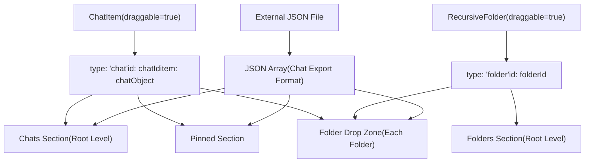
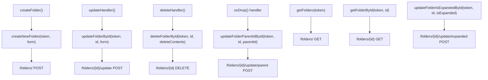

# Sidebar Architecture

Relevant source files

-   [backend/open\_webui/migrations/versions/1af9b942657b\_migrate\_tags.py](https://github.com/open-webui/open-webui/blob/a7271532/backend/open_webui/migrations/versions/1af9b942657b_migrate_tags.py)
-   [backend/open\_webui/migrations/versions/3ab32c4b8f59\_update\_tags.py](https://github.com/open-webui/open-webui/blob/a7271532/backend/open_webui/migrations/versions/3ab32c4b8f59_update_tags.py)
-   [backend/open\_webui/migrations/versions/c69f45358db4\_add\_folder\_table.py](https://github.com/open-webui/open-webui/blob/a7271532/backend/open_webui/migrations/versions/c69f45358db4_add_folder_table.py)
-   [src/lib/apis/folders/index.ts](https://github.com/open-webui/open-webui/blob/a7271532/src/lib/apis/folders/index.ts)
-   [src/lib/components/common/ConfirmDialog.svelte](https://github.com/open-webui/open-webui/blob/a7271532/src/lib/components/common/ConfirmDialog.svelte)
-   [src/lib/components/common/DragGhost.svelte](https://github.com/open-webui/open-webui/blob/a7271532/src/lib/components/common/DragGhost.svelte)
-   [src/lib/components/common/Folder.svelte](https://github.com/open-webui/open-webui/blob/a7271532/src/lib/components/common/Folder.svelte)
-   [src/lib/components/icons/Document.svelte](https://github.com/open-webui/open-webui/blob/a7271532/src/lib/components/icons/Document.svelte)
-   [src/lib/components/layout/Sidebar.svelte](https://github.com/open-webui/open-webui/blob/a7271532/src/lib/components/layout/Sidebar.svelte)
-   [src/lib/components/layout/Sidebar/ChatItem.svelte](https://github.com/open-webui/open-webui/blob/a7271532/src/lib/components/layout/Sidebar/ChatItem.svelte)
-   [src/lib/components/layout/Sidebar/Folders.svelte](https://github.com/open-webui/open-webui/blob/a7271532/src/lib/components/layout/Sidebar/Folders.svelte)
-   [src/lib/components/layout/Sidebar/Folders/FolderMenu.svelte](https://github.com/open-webui/open-webui/blob/a7271532/src/lib/components/layout/Sidebar/Folders/FolderMenu.svelte)
-   [src/lib/components/layout/Sidebar/RecursiveFolder.svelte](https://github.com/open-webui/open-webui/blob/a7271532/src/lib/components/layout/Sidebar/RecursiveFolder.svelte)
-   [src/lib/components/workspace/Knowledge/ItemMenu.svelte](https://github.com/open-webui/open-webui/blob/a7271532/src/lib/components/workspace/Knowledge/ItemMenu.svelte)

The sidebar is the primary navigation and organizational interface in Open WebUI, located on the left side of the application. It manages chat lists, hierarchical folders, channels, pinned models, and provides drag-and-drop functionality for organization. This document covers the sidebar's component hierarchy, state management, resize functionality, and drag-and-drop system.

For information about the chat interface that the sidebar navigates to, see [Chat Component Architecture](/open-webui/open-webui/4.1-chat-component-architecture). For details on the folder system's recursive rendering algorithm, see [Folder System](/open-webui/open-webui/8.2-folder-system).

## Component Hierarchy

The sidebar is composed of a hierarchical tree of components with `Sidebar.svelte` as the orchestrator at the root.

**Sidebar Component Structure**

```mermaid
flowchart TD
    Sidebar["Sidebar.svelte(Main Orchestrator)"]
    UserMenu["UserMenu.svelte(Profile & Settings)"]
    SearchModal["SearchModal.svelte(Search Interface)"]
    ArchivedChatsModal["ArchivedChatsModal.svelte(Archived Chats)"]
    ChannelModal["ChannelModal.svelte(Create Channel)"]
    FolderModal["FolderModal.svelte(Create/Edit Folder)"]
    PinnedModelList["PinnedModelList.svelte(Quick Model Access)"]
    ChannelItems["ChannelItem.svelte[](Channel List)"]
    FoldersContainer["Folders.svelte(Folder Container)"]
    ChatList["ChatItem.svelte[](Chat List)"]
    RecursiveFolder["RecursiveFolder.svelte[](Recursive Rendering)"]
    FolderMenu["FolderMenu.svelte(Edit/Delete/Export)"]
    ChatItem["ChatItem.svelte(Chat in Folder)"]
    ChatItem2["ChatItem.svelte(Root-level Chat)"]
    ChatMenu["ChatMenu.svelte(Chat Actions)"]
    ShareChatModal["ShareChatModal.svelte(Share Dialog)"]
    FolderWrapper["Folder.svelte(Collapsible Wrapper)"]
    FolderWrapper2["Folder.svelte(Section Wrappers)"]

    Sidebar --> UserMenu
    Sidebar --> SearchModal
    Sidebar --> ArchivedChatsModal
    Sidebar --> ChannelModal
    Sidebar --> FolderModal
    Sidebar --> PinnedModelList
    Sidebar --> ChannelItems
    Sidebar --> FoldersContainer
    Sidebar --> ChatList
    FoldersContainer --> RecursiveFolder
    RecursiveFolder --> FolderMenu
    RecursiveFolder --> ChatItem
    ChatList --> ChatItem2
    ChatItem2 --> ChatMenu
    ChatItem2 --> ShareChatModal
    FoldersContainer --> FolderWrapper
    Sidebar --> FolderWrapper2
```


Sources: [src/lib/components/layout/Sidebar.svelte1-1379](https://github.com/open-webui/open-webui/blob/a7271532/src/lib/components/layout/Sidebar.svelte#L1-L1379) [src/lib/components/layout/Sidebar/ChatItem.svelte1-571](https://github.com/open-webui/open-webui/blob/a7271532/src/lib/components/layout/Sidebar/ChatItem.svelte#L1-L571) [src/lib/components/layout/Sidebar/RecursiveFolder.svelte1-663](https://github.com/open-webui/open-webui/blob/a7271532/src/lib/components/layout/Sidebar/RecursiveFolder.svelte#L1-L663) [src/lib/components/layout/Sidebar/Folders.svelte1-63](https://github.com/open-webui/open-webui/blob/a7271532/src/lib/components/layout/Sidebar/Folders.svelte#L1-L63) [src/lib/components/common/Folder.svelte1-203](https://github.com/open-webui/open-webui/blob/a7271532/src/lib/components/common/Folder.svelte#L1-L203)

## Sidebar.svelte: Main Orchestrator

`Sidebar.svelte` serves as the central orchestrator with responsibilities spanning initialization, event handling, state management, and user interactions.

### Key Responsibilities

| Responsibility | Implementation |
| --- | --- |
| **Initialization** | `initChatList()`, `initFolders()`, `initChannels()` functions load data on mount |
| **State Management** | Manages 30+ Svelte stores including `$chats`, `$folders`, `$channels`, `$showSidebar` |
| **Event Handling** | Window-level keyboard, touch, drag-and-drop event listeners |
| **Resize Logic** | Mouse-based width adjustment with `MIN_WIDTH=220px`, `MAX_WIDTH=480px` constraints |
| **Pagination** | Infinite scroll support via `loadMoreChats()` with page tracking |
| **Drag-and-Drop** | File import and chat/folder reorganization |

### State Management

The sidebar coordinates state across multiple Svelte stores:

```mermaid
flowchart TD
    Sidebar["Sidebar.svelte"]
    showSidebar["showSidebar(Visibility)"]
    showSearch["showSearch(Search Modal)"]
    showArchivedChats["showArchivedChats(Archive Modal)"]
    sidebarWidth["sidebarWidth(Resize State)"]
    chats["chats(Chat List)"]
    pinnedChats["pinnedChats(Pinned Chats)"]
    folders["_folders(Folder List)"]
    channels["channels(Channel List)"]
    tags["tags(Tag List)"]
    chatId["chatId(Active Chat)"]
    selectedFolder["selectedFolder(Active Folder)"]
    selectedChatId["selectedChatId(Local Selection)"]
    user["user(Current User)"]
    config["config(Feature Flags)"]
    settings["settings(User Settings)"]
    mobile["mobile(Breakpoint)"]

    Sidebar --> showSidebar
    Sidebar --> showSearch
    Sidebar --> showArchivedChats
    Sidebar --> sidebarWidth
    Sidebar --> chats
    Sidebar --> pinnedChats
    Sidebar --> folders
    Sidebar --> channels
    Sidebar --> tags
    Sidebar --> chatId
    Sidebar --> selectedFolder
    Sidebar --> selectedChatId
    Sidebar --> user
    Sidebar --> config
    Sidebar --> settings
    Sidebar --> mobile
```


Sources: [src/lib/components/layout/Sidebar.svelte6-30](https://github.com/open-webui/open-webui/blob/a7271532/src/lib/components/layout/Sidebar.svelte#L6-L30) [src/lib/components/layout/Sidebar.svelte418-481](https://github.com/open-webui/open-webui/blob/a7271532/src/lib/components/layout/Sidebar.svelte#L418-L481)

### Initialization Flow

The sidebar initializes through a cascading sequence triggered by the `showSidebar` store subscription:

**Sidebar Initialization Sequence**

> **[Mermaid sequence]**
> *(图表结构无法解析)*

Sources: [src/lib/components/layout/Sidebar.svelte207-235](https://github.com/open-webui/open-webui/blob/a7271532/src/lib/components/layout/Sidebar.svelte#L207-L235) [src/lib/components/layout/Sidebar.svelte100-142](https://github.com/open-webui/open-webui/blob/a7271532/src/lib/components/layout/Sidebar.svelte#L100-L142) [src/lib/components/layout/Sidebar.svelte191-205](https://github.com/open-webui/open-webui/blob/a7271532/src/lib/components/layout/Sidebar.svelte#L191-L205) [src/lib/components/layout/Sidebar.svelte446-473](https://github.com/open-webui/open-webui/blob/a7271532/src/lib/components/layout/Sidebar.svelte#L446-L473)

### Folder Hierarchy Construction

The `initFolders()` function constructs a hierarchical folder structure using a two-pass algorithm:

```
// First pass: Initialize all folder entries
for (const folder of folderList) {
    folders[folder.id] = { ...(folders[folder.id] || {}), ...folder };
}

// Second pass: Tie child folders to their parents
for (const folder of folderList) {
    if (folder.parent_id) {
        folders[folder.parent_id].childrenIds = [
            ...(folders[folder.parent_id].childrenIds || []),
            folder.id
        ];
        // Sort children by updated_at
        folders[folder.parent_id].childrenIds.sort((a, b) =>
            folders[b].updated_at - folders[a].updated_at
        );
    }
}
```
This creates a `folders` object where each folder contains:

-   Its own metadata (`id`, `name`, `parent_id`, `meta`, etc.)
-   A `childrenIds` array with sorted child folder IDs

Sources: [src/lib/components/layout/Sidebar.svelte100-142](https://github.com/open-webui/open-webui/blob/a7271532/src/lib/components/layout/Sidebar.svelte#L100-L142)

## Resize Functionality

The sidebar supports mouse-based horizontal resizing with width constraints and persistence.

### Resize Implementation

**Resize Event Flow**

> **[Mermaid stateDiagram]**
> *(图表结构无法解析)*

The resize system uses three handler functions:

| Handler | Trigger | Purpose |
| --- | --- | --- |
| `resizeStartHandler(e)` | `mousedown` on resize edge | Captures initial state: `startClientX`, `startWidth` |
| `resizeSidebarHandler(endClientX)` | `window.mousemove` (while resizing) | Calculates and applies new width with constraints |
| `resizeEndHandler()` | `window.mouseup` | Persists width to `localStorage`, resets state |

Sources: [src/lib/components/layout/Sidebar.svelte382-414](https://github.com/open-webui/open-webui/blob/a7271532/src/lib/components/layout/Sidebar.svelte#L382-L414) [src/lib/components/layout/Sidebar.svelte640-648](https://github.com/open-webui/open-webui/blob/a7271532/src/lib/components/layout/Sidebar.svelte#L640-L648)

### Width Persistence

Width is persisted across sessions using `localStorage`:

```
// On mount: Restore saved width
const width = Number(localStorage.getItem('sidebarWidth'));
if (!Number.isNaN(width) && width >= MIN_WIDTH && width <= MAX_WIDTH) {
    sidebarWidth.set(width);
}

// On resize end: Save width
localStorage.setItem('sidebarWidth', String($sidebarWidth));
```
The width is also applied via CSS custom property: `--sidebar-width`.

Sources: [src/lib/components/layout/Sidebar.svelte418-429](https://github.com/open-webui/open-webui/blob/a7271532/src/lib/components/layout/Sidebar.svelte#L418-L429) [src/lib/components/layout/Sidebar.svelte405](https://github.com/open-webui/open-webui/blob/a7271532/src/lib/components/layout/Sidebar.svelte#L405-L405)

## Drag-and-Drop System

The sidebar implements a comprehensive drag-and-drop system supporting chat reorganization, folder nesting, and JSON file imports.

### Drag Sources and Drop Zones

**Drag-and-Drop Entity Relationships**


Sources: [src/lib/components/layout/Sidebar/ChatItem.svelte180-213](https://github.com/open-webui/open-webui/blob/a7271532/src/lib/components/layout/Sidebar/ChatItem.svelte#L180-L213) [src/lib/components/layout/Sidebar/RecursiveFolder.svelte220-249](https://github.com/open-webui/open-webui/blob/a7271532/src/lib/components/layout/Sidebar/RecursiveFolder.svelte#L220-L249) [src/lib/components/layout/Sidebar.svelte305-335](https://github.com/open-webui/open-webui/blob/a7271532/src/lib/components/layout/Sidebar.svelte#L305-L335)

### ChatItem Drag Implementation

`ChatItem.svelte` implements draggable behavior with visual feedback:

```
// Set custom transparent drag image
const dragImage = new Image();
dragImage.src = 'data:image/png;base64,...'; // 1x1 transparent pixel
event.dataTransfer.setDragImage(dragImage, 0, 0);

// Transfer data as JSON
event.dataTransfer.setData('text/plain', JSON.stringify({
    type: 'chat',
    id: id,
    item: chat  // Full chat object for import scenarios
}));

dragged = true;
itemElement.style.opacity = '0.5';
```
The component also renders a `DragGhost` overlay that follows the cursor during drag:

```
{#if dragged && x && y}
    <DragGhost {x} {y}>
        <div class="bg-black/80 backdrop-blur-2xl px-2 py-1 rounded-lg">
            <Document className="size-[18px]" />
            <div class="text-xs text-white line-clamp-1">{title}</div>
        </div>
    </DragGhost>
{/if}
```
Sources: [src/lib/components/layout/Sidebar/ChatItem.svelte176-213](https://github.com/open-webui/open-webui/blob/a7271532/src/lib/components/layout/Sidebar/ChatItem.svelte#L176-L213) [src/lib/components/layout/Sidebar/ChatItem.svelte334-345](https://github.com/open-webui/open-webui/blob/a7271532/src/lib/components/layout/Sidebar/ChatItem.svelte#L334-L345)

### Drop Zone Handling

Drop zones in the sidebar handle three types of drops:

1.  **Chat drops**: Relocate chat to folder or root level
2.  **Folder drops**: Change folder parent (nesting)
3.  **File drops**: Import JSON chat exports

Example drop handler from `RecursiveFolder.svelte`:

```
const onDrop = async (e) => {
    e.preventDefault();
    e.stopPropagation();

    for (const item of Array.from(e.dataTransfer.items)) {
        if (item.kind === 'file') {
            // Handle JSON file import
            const file = item.getAsFile();
            const reader = new FileReader();
            reader.onload = async (event) => {
                const fileContent = JSON.parse(event.target.result);
                dispatch('import', { folderId, items: fileContent });
            };
            reader.readAsText(file);
        } else {
            // Handle chat or folder drop
            const data = JSON.parse(e.dataTransfer.getData('text/plain'));
            const { type, id, item } = data;

            if (type === 'chat') {
                await updateChatFolderIdById(token, id, folderId);
            } else if (type === 'folder') {
                await updateFolderParentIdById(token, id, folderId);
            }
        }
    }
};
```
Sources: [src/lib/components/layout/Sidebar/RecursiveFolder.svelte74-202](https://github.com/open-webui/open-webui/blob/a7271532/src/lib/components/layout/Sidebar/RecursiveFolder.svelte#L74-L202)

### Visual Feedback

Drop zones provide visual feedback via a `draggedOver` state:

```
{#if draggedOver}
    <div class="absolute top-0 left-0 w-full h-full rounded-xs
                bg-gray-100/50 dark:bg-gray-700/20 z-50
                pointer-events-none"></div>
{/if}
```
This overlay appears when hovering over a valid drop zone during a drag operation.

Sources: [src/lib/components/layout/Sidebar/RecursiveFolder.svelte461-465](https://github.com/open-webui/open-webui/blob/a7271532/src/lib/components/layout/Sidebar/RecursiveFolder.svelte#L461-L465) [src/lib/components/common/Folder.svelte134-138](https://github.com/open-webui/open-webui/blob/a7271532/src/lib/components/common/Folder.svelte#L134-L138)

## Event Handling

The sidebar manages multiple event systems for user interactions.

### Event Listener Registration

The sidebar registers event listeners during `onMount()` and cleans them up in `onDestroy()`:

| Event | Target | Handler | Purpose |
| --- | --- | --- | --- |
| `keydown` | `window` | `onKeyDown` | Track Shift key for bulk actions |
| `keyup` | `window` | `onKeyUp` | Release Shift key tracking |
| `touchstart` | `window` | `onTouchStart` | Mobile swipe detection start |
| `touchend` | `window` | `onTouchEnd` | Mobile swipe detection end |
| `focus` | `window` | `onFocus` | Window focus handling |
| `blur` | `window` | `onBlur` | Reset selection state |
| `dragover` | `#sidebar` | `onDragOver` | File drag detection |
| `drop` | `#sidebar` | `onDrop` | File drop handling |
| `dragleave` | `#sidebar` | `onDragLeave` | Clear drag state |
| `mousemove` | `window` | Resize handler | Live width adjustment |
| `mouseup` | `window` | `resizeEndHandler` | Finalize resize |

Sources: [src/lib/components/layout/Sidebar.svelte483-497](https://github.com/open-webui/open-webui/blob/a7271532/src/lib/components/layout/Sidebar.svelte#L483-L497) [src/lib/components/layout/Sidebar.svelte499-522](https://github.com/open-webui/open-webui/blob/a7271532/src/lib/components/layout/Sidebar.svelte#L499-L522) [src/lib/components/layout/Sidebar.svelte640-648](https://github.com/open-webui/open-webui/blob/a7271532/src/lib/components/layout/Sidebar.svelte#L640-L648)

### Shift Key Behavior

Holding Shift while hovering over chat items reveals archive/delete actions:

```
{:else if shiftKey && mouseOver}
    <div class="flex items-center space-x-1.5">
        <button on:click={() => archiveChatHandler(id)}>
            <ArchiveBox className="size-4" />
        </button>
        <button on:click={() => deleteChatHandler(id)}>
            <GarbageBin />
        </button>
    </div>
{/if}
```
Sources: [src/lib/components/layout/Sidebar/ChatItem.svelte472-497](https://github.com/open-webui/open-webui/blob/a7271532/src/lib/components/layout/Sidebar/ChatItem.svelte#L472-L497)

### Mobile Touch Gestures

The sidebar detects swipe gestures on mobile to show/hide the sidebar:

```
const checkDirection = () => {
    const screenWidth = window.innerWidth;
    const swipeDistance = Math.abs(touchend.screenX - touchstart.screenX);

    // Only trigger if swipe starts within 40px of left edge
    // and covers at least 1/8 of screen width
    if (touchstart.clientX < 40 && swipeDistance >= screenWidth / 8) {
        if (touchend.screenX < touchstart.screenX) {
            showSidebar.set(false);  // Swipe left to close
        }
        if (touchend.screenX > touchstart.screenX) {
            showSidebar.set(true);   // Swipe right to open
        }
    }
};
```
Sources: [src/lib/components/layout/Sidebar.svelte340-361](https://github.com/open-webui/open-webui/blob/a7271532/src/lib/components/layout/Sidebar.svelte#L340-L361)

## Folder Registry Pattern

The sidebar uses a registry pattern to maintain references to folder components for imperative operations.

### Registry Structure

```
let folderRegistry = {};

// In RecursiveFolder.onMount()
folderRegistry[folderId] = {
    setFolderItems: () => {
        setFolderItems();  // Refresh folder's chat list
    }
};
```
This pattern enables the parent to trigger data refreshes in specific folder instances:

```
// After moving a chat, refresh the origin folder's contents
folderRegistry[chat.folder_id]?.setFolderItems();
```
**Folder Registry Communication Pattern**

> **[Mermaid sequence]**
> *(图表结构无法解析)*

Sources: [src/lib/components/layout/Sidebar.svelte92](https://github.com/open-webui/open-webui/blob/a7271532/src/lib/components/layout/Sidebar.svelte#L92-L92) [src/lib/components/layout/Sidebar/RecursiveFolder.svelte252-257](https://github.com/open-webui/open-webui/blob/a7271532/src/lib/components/layout/Sidebar/RecursiveFolder.svelte#L252-L257) [src/lib/components/layout/Sidebar.svelte1162](https://github.com/open-webui/open-webui/blob/a7271532/src/lib/components/layout/Sidebar.svelte#L1162-L1162)

## Pagination System

The sidebar supports infinite scroll pagination for large chat lists.

### Pagination State

Pagination is controlled by three pieces of state:

```
let chatListLoading = false;        // Loading indicator
let allChatsLoaded = false;         // End of list marker
$scrollPaginationEnabled = false;   // Feature toggle (store)
$currentChatPage = 1;               // Current page number (store)
```
### Scroll Detection

Chat list container monitors scroll position to trigger pagination:

```
<div on:scroll={(e) => {
    const scrollTop = e.target.scrollTop;
    const scrollHeight = e.target.scrollHeight;
    const clientHeight = e.target.clientHeight;

    // Trigger when scrolled near bottom
    if ($scrollPaginationEnabled &&
        !allChatsLoaded &&
        !chatListLoading &&
        scrollHeight - scrollTop - clientHeight < 100) {
        loadMoreChats();
    }
}}>
```
### Load More Implementation

```
const loadMoreChats = async () => {
    chatListLoading = true;
    currentChatPage.set($currentChatPage + 1);

    let newChatList = await getChatList(localStorage.token, $currentChatPage);

    // Detect end of list
    allChatsLoaded = newChatList.length === 0;

    // Append to existing chats
    await chats.set([...($chats ?? []), ...newChatList]);

    chatListLoading = false;
};
```
Sources: [src/lib/components/layout/Sidebar.svelte79-81](https://github.com/open-webui/open-webui/blob/a7271532/src/lib/components/layout/Sidebar.svelte#L79-L81) [src/lib/components/layout/Sidebar.svelte237-251](https://github.com/open-webui/open-webui/blob/a7271532/src/lib/components/layout/Sidebar.svelte#L237-L251)

## Sidebar Sections

The sidebar is organized into distinct sections, each wrapped in collapsible `Folder` components.

### Section Layout

| Section | Condition | Component | Purpose |
| --- | --- | --- | --- |
| **Header** | Always | Native elements | Logo, name, sidebar toggle |
| **Actions** | Always | Native buttons | New Chat, Search, Notes, Workspace |
| **Pinned Models** | `$models.length > 0` | `PinnedModelList` | Quick model access |
| **Channels** | Feature enabled | `ChannelItem[]` | Group/DM channels |
| **Folders** | Feature enabled | `Folders` → `RecursiveFolder[]` | Hierarchical folders |
| **Pinned Chats** | `$pinnedChats.length > 0` | `ChatItem[]` | Pinned chat list |
| **Chats** | Always | `ChatItem[]` | Regular chat list |
| **Footer** | Always | `UserMenu` | User profile menu |

Each section (except header/footer) uses the `Folder` component for collapsibility:

```
<Folder
    id="sidebar-channels"
    bind:open={showChannels}
    name={$i18n.t('Channels')}
    onAdd={() => showCreateChannel = true}
    onAddLabel={$i18n.t('Create Channel')}
>
    <!-- Channel items -->
</Folder>
```
Sources: [src/lib/components/layout/Sidebar.svelte1019-1030](https://github.com/open-webui/open-webui/blob/a7271532/src/lib/components/layout/Sidebar.svelte#L1019-L1030) [src/lib/components/layout/Sidebar.svelte1032-1065](https://github.com/open-webui/open-webui/blob/a7271532/src/lib/components/layout/Sidebar.svelte#L1032-L1065) [src/lib/components/layout/Sidebar.svelte1067-1119](https://github.com/open-webui/open-webui/blob/a7271532/src/lib/components/layout/Sidebar.svelte#L1067-L1119) [src/lib/components/layout/Sidebar.svelte1121-1187](https://github.com/open-webui/open-webui/blob/a7271532/src/lib/components/layout/Sidebar.svelte#L1121-L1187)

## API Integration

The sidebar integrates with backend APIs for data operations.

### Folder API Operations


Sources: [src/lib/apis/folders/index.ts9-35](https://github.com/open-webui/open-webui/blob/a7271532/src/lib/apis/folders/index.ts#L9-L35) [src/lib/apis/folders/index.ts37-66](https://github.com/open-webui/open-webui/blob/a7271532/src/lib/apis/folders/index.ts#L37-L66) [src/lib/apis/folders/index.ts68-97](https://github.com/open-webui/open-webui/blob/a7271532/src/lib/apis/folders/index.ts#L68-L97) [src/lib/apis/folders/index.ts99-129](https://github.com/open-webui/open-webui/blob/a7271532/src/lib/apis/folders/index.ts#L99-L129) [src/lib/apis/folders/index.ts169-201](https://github.com/open-webui/open-webui/blob/a7271532/src/lib/apis/folders/index.ts#L169-L201) [src/lib/apis/folders/index.ts131-167](https://github.com/open-webui/open-webui/blob/a7271532/src/lib/apis/folders/index.ts#L131-L167) [src/lib/apis/folders/index.ts242-274](https://github.com/open-webui/open-webui/blob/a7271532/src/lib/apis/folders/index.ts#L242-L274)

### Chat API Operations

The sidebar also uses chat APIs for organization:

| Function | Endpoint | Purpose |
| --- | --- | --- |
| `getChatList(token, page)` | `GET /chats?page={page}` | Fetch paginated chat list |
| `getPinnedChatList(token)` | `GET /chats/pinned` | Fetch pinned chats |
| `updateChatFolderIdById(token, id, folderId)` | `POST /chats/{id}/folder` | Move chat to folder |
| `toggleChatPinnedStatusById(token, id)` | `POST /chats/{id}/pin` | Pin/unpin chat |
| `importChats(token, chats)` | `POST /chats/import` | Import chat JSON |

Sources: [src/lib/components/layout/Sidebar.svelte36-43](https://github.com/open-webui/open-webui/blob/a7271532/src/lib/components/layout/Sidebar.svelte#L36-L43)

## Database Schema

The sidebar's data is backed by folder and chat tables with hierarchical relationships.

### Folder Table Schema

```
CREATE TABLE folder (
    id TEXT NOT NULL,
    parent_id TEXT,
    user_id TEXT NOT NULL,
    name TEXT NOT NULL,
    items JSON,
    meta JSON,
    is_expanded BOOLEAN DEFAULT FALSE NOT NULL,
    created_at DATETIME DEFAULT CURRENT_TIMESTAMP NOT NULL,
    updated_at DATETIME DEFAULT CURRENT_TIMESTAMP NOT NULL,
    PRIMARY KEY (id, user_id)
);
```
Key fields:

-   `parent_id`: NULL for root folders, otherwise parent folder's ID
-   `items`: JSON object with `chat_ids` and `file_ids` arrays
-   `meta`: JSON object for arbitrary metadata (e.g., `icon` emoji)
-   `is_expanded`: Persists UI expansion state

Sources: [backend/open\_webui/migrations/versions/c69f45358db4\_add\_folder\_table.py19-39](https://github.com/open-webui/open-webui/blob/a7271532/backend/open_webui/migrations/versions/c69f45358db4_add_folder_table.py#L19-L39)

### Chat-Folder Relationship

Chats link to folders via the `folder_id` column:

```
ALTER TABLE chat ADD COLUMN folder_id TEXT;
```
A chat belongs to at most one folder (`folder_id` is nullable). The sidebar filters chats by `folder_id` when rendering folder contents.

Sources: [backend/open\_webui/migrations/versions/c69f45358db4\_add\_folder\_table.py41-44](https://github.com/open-webui/open-webui/blob/a7271532/backend/open_webui/migrations/versions/c69f45358db4_add_folder_table.py#L41-L44)

### Migration History

The folder system was added in migration `c69f45358db4`, which also migrated the older tag-based organization to the new pinned/meta system. Prior migrations show the evolution:

1.  `1af9b942657b`: Migrated tags to new structure, added `pinned` and `meta` columns to `chat`
2.  `3ab32c4b8f59`: Updated tag primary key to `(id, user_id)` compound key
3.  `c69f45358db4`: Added `folder` table and `chat.folder_id` column

Sources: [backend/open\_webui/migrations/versions/1af9b942657b\_migrate\_tags.py22-147](https://github.com/open-webui/open-webui/blob/a7271532/backend/open_webui/migrations/versions/1af9b942657b_migrate_tags.py#L22-L147) [backend/open\_webui/migrations/versions/3ab32c4b8f59\_update\_tags.py22-65](https://github.com/open-webui/open-webui/blob/a7271532/backend/open_webui/migrations/versions/3ab32c4b8f59_update_tags.py#L22-L65) [backend/open\_webui/migrations/versions/c69f45358db4\_add\_folder\_table.py18-45](https://github.com/open-webui/open-webui/blob/a7271532/backend/open_webui/migrations/versions/c69f45358db4_add_folder_table.py#L18-L45)
