# Folder System

Relevant source files

-   [backend/open\_webui/migrations/versions/1af9b942657b\_migrate\_tags.py](https://github.com/open-webui/open-webui/blob/a7271532/backend/open_webui/migrations/versions/1af9b942657b_migrate_tags.py)
-   [backend/open\_webui/migrations/versions/3ab32c4b8f59\_update\_tags.py](https://github.com/open-webui/open-webui/blob/a7271532/backend/open_webui/migrations/versions/3ab32c4b8f59_update_tags.py)
-   [backend/open\_webui/migrations/versions/c69f45358db4\_add\_folder\_table.py](https://github.com/open-webui/open-webui/blob/a7271532/backend/open_webui/migrations/versions/c69f45358db4_add_folder_table.py)
-   [src/lib/apis/folders/index.ts](https://github.com/open-webui/open-webui/blob/a7271532/src/lib/apis/folders/index.ts)
-   [src/lib/components/common/ConfirmDialog.svelte](https://github.com/open-webui/open-webui/blob/a7271532/src/lib/components/common/ConfirmDialog.svelte)
-   [src/lib/components/common/DragGhost.svelte](https://github.com/open-webui/open-webui/blob/a7271532/src/lib/components/common/DragGhost.svelte)
-   [src/lib/components/common/Folder.svelte](https://github.com/open-webui/open-webui/blob/a7271532/src/lib/components/common/Folder.svelte)
-   [src/lib/components/icons/Document.svelte](https://github.com/open-webui/open-webui/blob/a7271532/src/lib/components/icons/Document.svelte)
-   [src/lib/components/layout/Sidebar.svelte](https://github.com/open-webui/open-webui/blob/a7271532/src/lib/components/layout/Sidebar.svelte)
-   [src/lib/components/layout/Sidebar/ChatItem.svelte](https://github.com/open-webui/open-webui/blob/a7271532/src/lib/components/layout/Sidebar/ChatItem.svelte)
-   [src/lib/components/layout/Sidebar/Folders.svelte](https://github.com/open-webui/open-webui/blob/a7271532/src/lib/components/layout/Sidebar/Folders.svelte)
-   [src/lib/components/layout/Sidebar/Folders/FolderMenu.svelte](https://github.com/open-webui/open-webui/blob/a7271532/src/lib/components/layout/Sidebar/Folders/FolderMenu.svelte)
-   [src/lib/components/layout/Sidebar/RecursiveFolder.svelte](https://github.com/open-webui/open-webui/blob/a7271532/src/lib/components/layout/Sidebar/RecursiveFolder.svelte)
-   [src/lib/components/workspace/Knowledge/ItemMenu.svelte](https://github.com/open-webui/open-webui/blob/a7271532/src/lib/components/workspace/Knowledge/ItemMenu.svelte)

## Overview

The folder system provides hierarchical organization of chats in Open WebUI's sidebar. Users can create nested folder structures to categorize and manage their conversations, similar to a file system. The system supports drag-and-drop operations for organizing chats into folders and rearranging the folder hierarchy itself.

For information about the sidebar container and chat list management, see [Sidebar Architecture](/open-webui/open-webui/7.2-content-extraction-engines). For details on chat item operations (pinning, archiving, tagging), see [Chat Item Management](/open-webui/open-webui/7.4-embedding-generation).

## Data Model

### Database Schema

The folder system is backed by a `folder` table with support for parent-child relationships and per-user ownership:

**Folder Table Structure:**

| Column | Type | Description |
| --- | --- | --- |
| `id` | Text | Primary key, folder identifier |
| `parent_id` | Text (nullable) | Reference to parent folder, null for root folders |
| `user_id` | Text | Owner of the folder |
| `name` | Text | Display name of the folder |
| `items` | JSON (nullable) | Metadata about contained items |
| `meta` | JSON (nullable) | Additional metadata (e.g., icon emoji) |
| `is_expanded` | Boolean | UI state for expand/collapse |
| `created_at` | DateTime | Creation timestamp |
| `updated_at` | DateTime | Last modification timestamp |

The `chat` table also has a `folder_id` column establishing the many-to-one relationship between chats and folders.

**Sources:** [backend/open\_webui/migrations/versions/c69f45358db4\_add\_folder\_table.py19-44](https://github.com/open-webui/open-webui/blob/a7271532/backend/open_webui/migrations/versions/c69f45358db4_add_folder_table.py#L19-L44)

### Folder-Chat Relationship Diagram

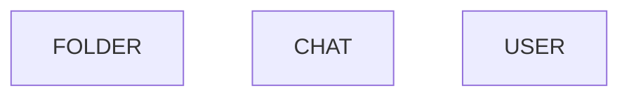
**Sources:** [backend/open\_webui/migrations/versions/c69f45358db4\_add\_folder\_table.py19-50](https://github.com/open-webui/open-webui/blob/a7271532/backend/open_webui/migrations/versions/c69f45358db4_add_folder_table.py#L19-L50)

## Frontend Architecture

### Component Hierarchy

The folder UI consists of several nested components that work together to render the hierarchical structure:

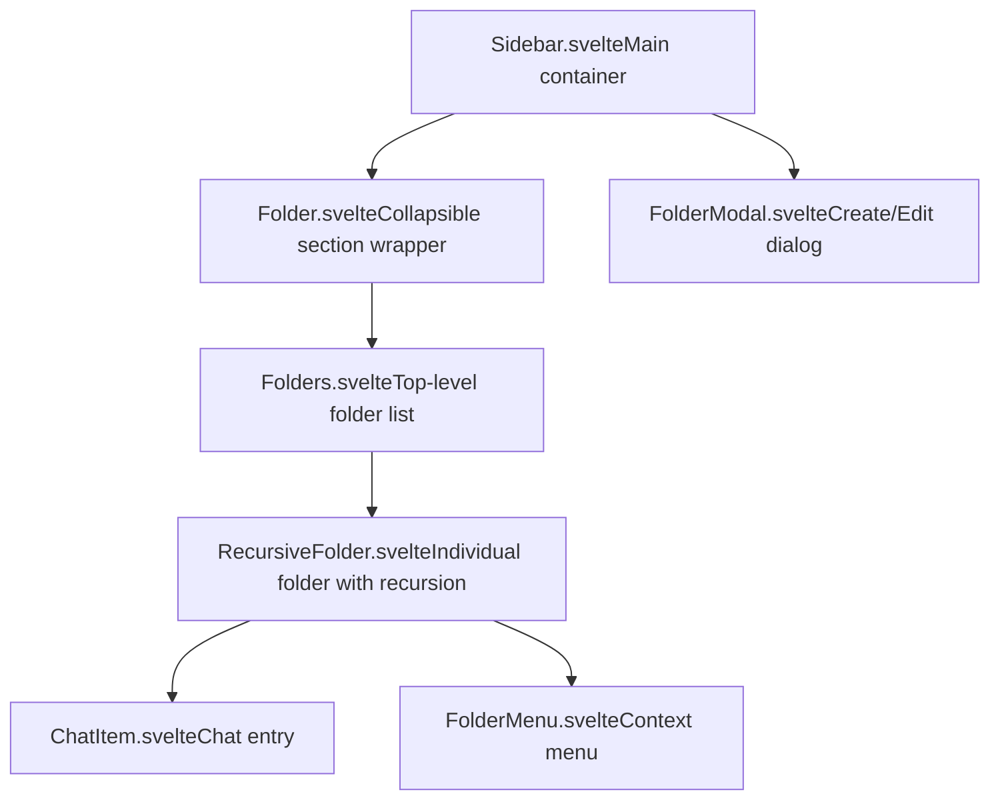
**Sources:** [src/lib/components/layout/Sidebar.svelte982-1033](https://github.com/open-webui/open-webui/blob/a7271532/src/lib/components/layout/Sidebar.svelte#L982-L1033) [src/lib/components/layout/Sidebar/Folders.svelte1-63](https://github.com/open-webui/open-webui/blob/a7271532/src/lib/components/layout/Sidebar/Folders.svelte#L1-L63) [src/lib/components/layout/Sidebar/RecursiveFolder.svelte1-663](https://github.com/open-webui/open-webui/blob/a7271532/src/lib/components/layout/Sidebar/RecursiveFolder.svelte#L1-L663)

### State Management

The folder system maintains state across multiple layers:

**Global Stores (Svelte):**

-   `_folders` - Array of all folder objects for the current user
-   `selectedFolder` - Currently selected folder for filtering chat view

**Local State in Sidebar:**

-   `folders` - Object mapping folder IDs to folder data with computed `childrenIds`
-   `folderRegistry` - Object mapping folder IDs to component instances for imperative control

**Folder Tree Construction:**

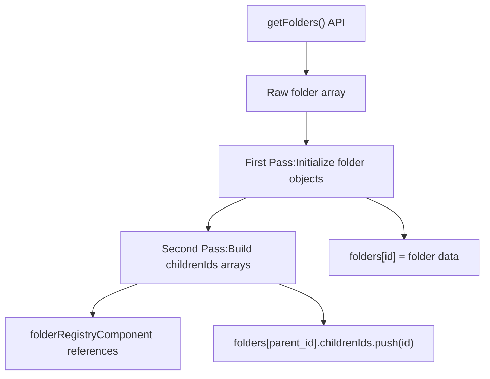
**Sources:** [src/lib/components/layout/Sidebar.svelte93-135](https://github.com/open-webui/open-webui/blob/a7271532/src/lib/components/layout/Sidebar.svelte#L93-L135)

The initialization logic in `initFolders()` performs a two-pass algorithm:

1.  **First Pass:** Populate `folders` object with raw folder data
2.  **Second Pass:** Build parent-child relationships by populating `childrenIds` arrays on parent folders

This structure enables efficient recursive rendering and maintains referential integrity.

**Sources:** [src/lib/components/layout/Sidebar.svelte93-135](https://github.com/open-webui/open-webui/blob/a7271532/src/lib/components/layout/Sidebar.svelte#L93-L135)

## API Layer

### Folder Operations

The frontend communicates with the backend through a TypeScript API client:

**API Functions:**

| Function | Method | Endpoint | Purpose |
| --- | --- | --- | --- |
| `createNewFolder` | POST | `/folders/` | Create new folder |
| `getFolders` | GET | `/folders/` | Fetch all user folders |
| `getFolderById` | GET | `/folders/{id}` | Fetch single folder |
| `updateFolderById` | POST | `/folders/{id}/update` | Update name/meta/data |
| `updateFolderIsExpandedById` | POST | `/folders/{id}/update/expanded` | Update expand state |
| `updateFolderParentIdById` | POST | `/folders/{id}/update/parent` | Move folder in hierarchy |
| `deleteFolderById` | DELETE | `/folders/{id}` | Delete folder (optionally with contents) |

**Sources:** [src/lib/apis/folders/index.ts1-275](https://github.com/open-webui/open-webui/blob/a7271532/src/lib/apis/folders/index.ts#L1-L275)

### Folder Creation Flow

> **[Mermaid sequence]**
> *(图表结构无法解析)*

**Sources:** [src/lib/components/layout/Sidebar.svelte137-181](https://github.com/open-webui/open-webui/blob/a7271532/src/lib/components/layout/Sidebar.svelte#L137-L181) [src/lib/apis/folders/index.ts9-35](https://github.com/open-webui/open-webui/blob/a7271532/src/lib/apis/folders/index.ts#L9-L35)

The creation handler in `Sidebar.svelte` includes duplicate name detection with auto-numbering:

```
// Example: If "Projects" exists, creates "Projects 1", "Projects 2", etc.
```
**Sources:** [src/lib/components/layout/Sidebar.svelte143-155](https://github.com/open-webui/open-webui/blob/a7271532/src/lib/components/layout/Sidebar.svelte#L143-L155)

## Recursive Folder Rendering

### RecursiveFolder Component

The `RecursiveFolder.svelte` component implements self-recursion to render nested folder hierarchies:

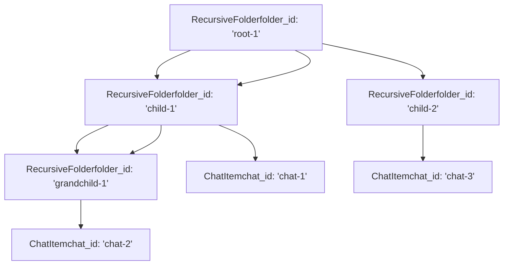
**Sources:** [src/lib/components/layout/Sidebar/RecursiveFolder.svelte620-639](https://github.com/open-webui/open-webui/blob/a7271532/src/lib/components/layout/Sidebar/RecursiveFolder.svelte#L620-L639)

### Folder Item Loading

Folders lazy-load their chat contents when expanded:

**Loading States:**

-   `chats = null` - Not loaded (folder collapsed)
-   `chats = []` - Loaded but empty
-   `chats = [...]` - Loaded with items

**Sources:** [src/lib/components/layout/Sidebar/RecursiveFolder.svelte369-384](https://github.com/open-webui/open-webui/blob/a7271532/src/lib/components/layout/Sidebar/RecursiveFolder.svelte#L369-L384)

The `setFolderItems()` method fetches chats only when the folder is open:

```
// Triggered on folder expand
if (open) {
    chats = await getChatListByFolderId(localStorage.token, folderId);
}
```
**Sources:** [src/lib/components/layout/Sidebar/RecursiveFolder.svelte370-380](https://github.com/open-webui/open-webui/blob/a7271532/src/lib/components/layout/Sidebar/RecursiveFolder.svelte#L370-L380)

### Folder Registry Pattern

The `folderRegistry` object maintains references to folder component instances, enabling parent components to imperatively trigger updates:

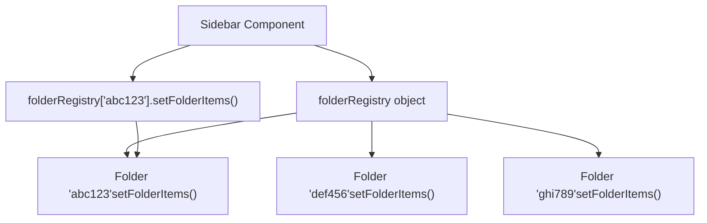
**Sources:** [src/lib/components/layout/Sidebar/RecursiveFolder.svelte251-257](https://github.com/open-webui/open-webui/blob/a7271532/src/lib/components/layout/Sidebar/RecursiveFolder.svelte#L251-L257) [src/lib/components/layout/Sidebar/Folders.svelte26-36](https://github.com/open-webui/open-webui/blob/a7271532/src/lib/components/layout/Sidebar/Folders.svelte#L26-L36)

Each folder registers itself on mount:

```
folderRegistry[folderId] = {
    setFolderItems: () => {
        setFolderItems();
    }
};
```
**Sources:** [src/lib/components/layout/Sidebar/RecursiveFolder.svelte253-256](https://github.com/open-webui/open-webui/blob/a7271532/src/lib/components/layout/Sidebar/RecursiveFolder.svelte#L253-L256)

## Drag and Drop System

### Drag and Drop Architecture

The folder system implements comprehensive drag-and-drop for both chats and folders:

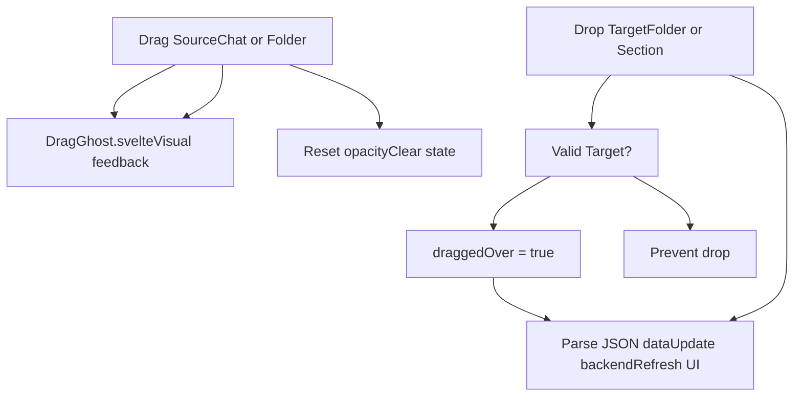
**Sources:** [src/lib/components/layout/Sidebar/RecursiveFolder.svelte74-249](https://github.com/open-webui/open-webui/blob/a7271532/src/lib/components/layout/Sidebar/RecursiveFolder.svelte#L74-L249) [src/lib/components/layout/Sidebar/ChatItem.svelte180-213](https://github.com/open-webui/open-webui/blob/a7271532/src/lib/components/layout/Sidebar/ChatItem.svelte#L180-L213)

### Data Transfer Format

Dragged items encode their type and data as JSON in the `dataTransfer` object:

**Chat Format:**

```
{
  "type": "chat",
  "id": "chat-uuid",
  "item": { /* full chat object */ }
}
```
**Folder Format:**

```
{
  "type": "folder",
  "id": "folder-uuid"
}
```
**Sources:** [src/lib/components/layout/Sidebar/ChatItem.svelte186-193](https://github.com/open-webui/open-webui/blob/a7271532/src/lib/components/layout/Sidebar/ChatItem.svelte#L186-L193) [src/lib/components/layout/Sidebar/RecursiveFolder.svelte225-231](https://github.com/open-webui/open-webui/blob/a7271532/src/lib/components/layout/Sidebar/RecursiveFolder.svelte#L225-L231)

### Drop Handler Logic

The `RecursiveFolder` component handles three drop scenarios:

1.  **JSON File Drop:** Import chats from file
2.  **Folder Drop:** Move folder into this folder (change parent)
3.  **Chat Drop:** Move chat into this folder

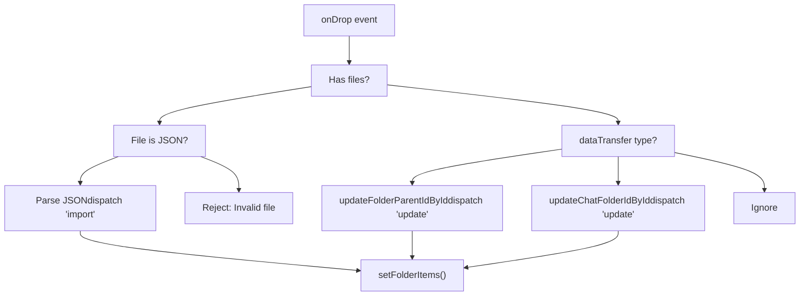
**Sources:** [src/lib/components/layout/Sidebar/RecursiveFolder.svelte83-202](https://github.com/open-webui/open-webui/blob/a7271532/src/lib/components/layout/Sidebar/RecursiveFolder.svelte#L83-L202)

### Visual Feedback

The system provides visual feedback during drag operations:

**Drag Ghost:** A custom semi-transparent element follows the cursor showing what's being dragged.

**Sources:** [src/lib/components/layout/Sidebar/RecursiveFolder.svelte447-458](https://github.com/open-webui/open-webui/blob/a7271532/src/lib/components/layout/Sidebar/RecursiveFolder.svelte#L447-L458) [src/lib/components/common/DragGhost.svelte1-31](https://github.com/open-webui/open-webui/blob/a7271532/src/lib/components/common/DragGhost.svelte#L1-L31)

**Drop Target Highlight:** Folders show a semi-transparent overlay when dragged over.

**Sources:** [src/lib/components/layout/Sidebar/RecursiveFolder.svelte461-465](https://github.com/open-webui/open-webui/blob/a7271532/src/lib/components/layout/Sidebar/RecursiveFolder.svelte#L461-L465)

## Folder Operations

### Rename Operation

Folders can be renamed via double-click or context menu:

> **[Mermaid sequence]**
> *(图表结构无法解析)*

**Sources:** [src/lib/components/layout/Sidebar/RecursiveFolder.svelte386-349](https://github.com/open-webui/open-webui/blob/a7271532/src/lib/components/layout/Sidebar/RecursiveFolder.svelte#L386-L349) [src/lib/components/layout/Sidebar/RecursiveFolder.svelte551-581](https://github.com/open-webui/open-webui/blob/a7271532/src/lib/components/layout/Sidebar/RecursiveFolder.svelte#L551-L581)

The rename handler includes validation and error handling:

**Sources:** [src/lib/components/layout/Sidebar/RecursiveFolder.svelte306-349](https://github.com/open-webui/open-webui/blob/a7271532/src/lib/components/layout/Sidebar/RecursiveFolder.svelte#L306-L349)

### Delete Operation

Folder deletion supports two modes:

1.  **Delete folder only:** Chats are moved to root level
2.  **Delete folder and contents:** All chats are deleted

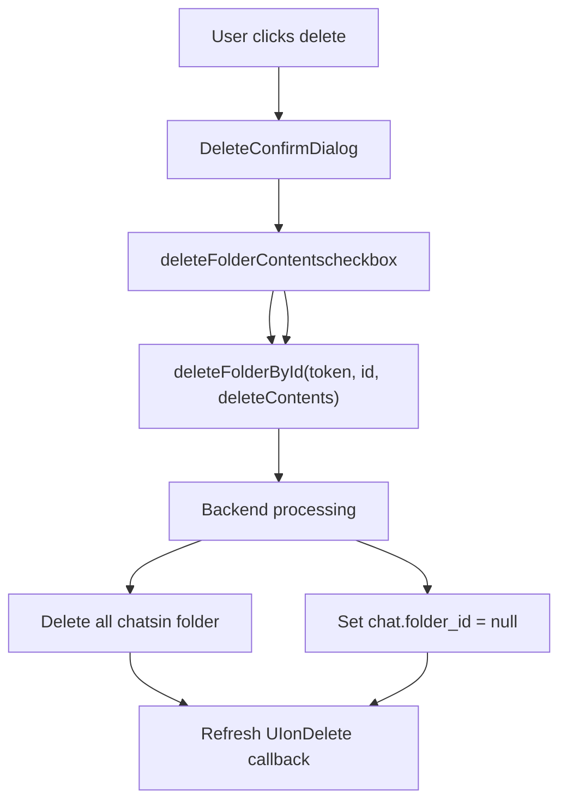
**Sources:** [src/lib/components/layout/Sidebar/RecursiveFolder.svelte292-304](https://github.com/open-webui/open-webui/blob/a7271532/src/lib/components/layout/Sidebar/RecursiveFolder.svelte#L292-L304) [src/lib/components/layout/Sidebar/RecursiveFolder.svelte419-443](https://github.com/open-webui/open-webui/blob/a7271532/src/lib/components/layout/Sidebar/RecursiveFolder.svelte#L419-L443)

### Export Operation

Folders can be exported as JSON files containing all chats:

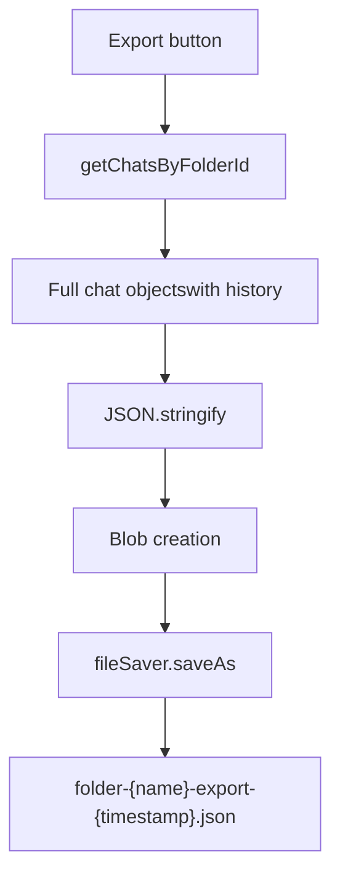
**Sources:** [src/lib/components/layout/Sidebar/RecursiveFolder.svelte402-416](https://github.com/open-webui/open-webui/blob/a7271532/src/lib/components/layout/Sidebar/RecursiveFolder.svelte#L402-L416)

## Expand/Collapse State Management

### Persistent Expand State

Folder expand/collapse state is persisted to the backend with debouncing:

> **[Mermaid sequence]**
> *(图表结构无法解析)*

**Sources:** [src/lib/components/layout/Sidebar/RecursiveFolder.svelte351-367](https://github.com/open-webui/open-webui/blob/a7271532/src/lib/components/layout/Sidebar/RecursiveFolder.svelte#L351-L367)

The debounce mechanism prevents excessive API calls when users rapidly toggle folders:

**Sources:** [src/lib/components/layout/Sidebar/RecursiveFolder.svelte362-367](https://github.com/open-webui/open-webui/blob/a7271532/src/lib/components/layout/Sidebar/RecursiveFolder.svelte#L362-L367)

### Folder Selection

Clicking a folder name (not the chevron) navigates to a filtered view showing only that folder's chats:

**Sources:** [src/lib/components/layout/Sidebar/RecursiveFolder.svelte490-514](https://github.com/open-webui/open-webui/blob/a7271532/src/lib/components/layout/Sidebar/RecursiveFolder.svelte#L490-L514)

The click handler uses a timer to distinguish single-click (select) from double-click (rename):

```
clickTimer = setTimeout(async () => {
    const folder = await getFolderById(localStorage.token, folderId);
    if (folder) {
        await selectedFolder.set(folder);
    }
    await goto('/');
    // ...
}, 100); // 100ms delay
```
**Sources:** [src/lib/components/layout/Sidebar/RecursiveFolder.svelte497-513](https://github.com/open-webui/open-webui/blob/a7271532/src/lib/components/layout/Sidebar/RecursiveFolder.svelte#L497-L513)

## Chat-Folder Integration

### Moving Chats to Folders

Chats can be moved to folders through multiple mechanisms:

1.  **Drag and drop** from chat list to folder
2.  **Drag and drop** from one folder to another
3.  **Context menu** "Move to Folder" option

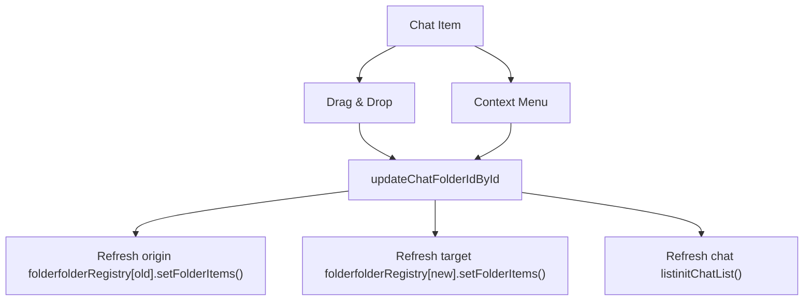
**Sources:** [src/lib/components/layout/Sidebar/ChatItem.svelte142-163](https://github.com/open-webui/open-webui/blob/a7271532/src/lib/components/layout/Sidebar/ChatItem.svelte#L142-L163) [src/lib/components/layout/Sidebar/RecursiveFolder.svelte173-190](https://github.com/open-webui/open-webui/blob/a7271532/src/lib/components/layout/Sidebar/RecursiveFolder.svelte#L173-L190)

### Removing Chats from Folders

When a chat is dragged from a folder to the root "Chats" section:

**Sources:** [src/lib/components/layout/Sidebar.svelte1046-1101](https://github.com/open-webui/open-webui/blob/a7271532/src/lib/components/layout/Sidebar.svelte#L1046-L1101)

The handler checks if the chat has a `folder_id` and clears it:

```
if (chat.folder_id) {
    const res = await updateChatFolderIdById(localStorage.token, chat.id, null);
    folderRegistry[chat.folder_id]?.setFolderItems();
}
```
**Sources:** [src/lib/components/layout/Sidebar.svelte1068-1077](https://github.com/open-webui/open-webui/blob/a7271532/src/lib/components/layout/Sidebar.svelte#L1068-L1077)

## UI Features

### Folder Metadata

Folders support metadata including custom icons:

**Meta Object:**

```
{
  "icon": ":emoji_shortcode:"
}
```
**Sources:** [src/lib/components/layout/Sidebar/RecursiveFolder.svelte528-539](https://github.com/open-webui/open-webui/blob/a7271532/src/lib/components/layout/Sidebar/RecursiveFolder.svelte#L528-L539)

The folder button shows either the custom emoji or a chevron:

```
{#if folders[folderId]?.meta?.icon}
    <Emoji className="size-3.5" shortCode={folders[folderId].meta.icon} />
{:else}
    <ChevronDown/Right />
{/if}
```
**Sources:** [src/lib/components/layout/Sidebar/RecursiveFolder.svelte528-548](https://github.com/open-webui/open-webui/blob/a7271532/src/lib/components/layout/Sidebar/RecursiveFolder.svelte#L528-L548)

### Folder Menu

The context menu provides quick access to folder operations:

| Menu Item | Action | API Call |
| --- | --- | --- |
| Edit | Open FolderModal | None (modal handles update) |
| Export | Download as JSON | `getChatsByFolderId` |
| Delete | Show confirmation | `deleteFolderById` |

**Sources:** [src/lib/components/layout/Sidebar/Folders/FolderMenu.svelte1-83](https://github.com/open-webui/open-webui/blob/a7271532/src/lib/components/layout/Sidebar/Folders/FolderMenu.svelte#L1-L83)

### Import via File Drop

Users can drag JSON files onto folders to import chats:

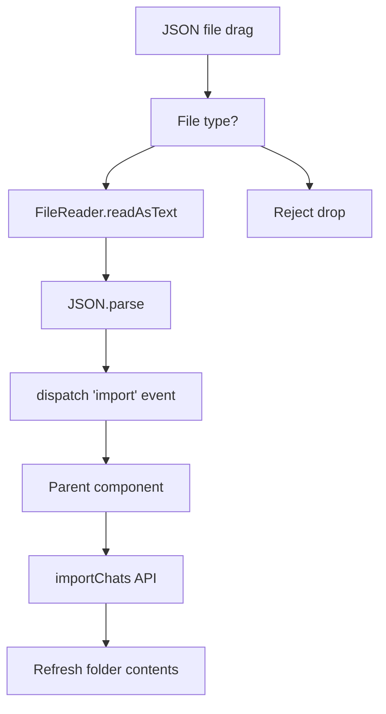
**Sources:** [src/lib/components/layout/Sidebar/RecursiveFolder.svelte93-127](https://github.com/open-webui/open-webui/blob/a7271532/src/lib/components/layout/Sidebar/RecursiveFolder.svelte#L93-L127)

The import data structure matches the export format, containing chat objects with metadata:

**Sources:** [src/lib/components/layout/Sidebar.svelte239-258](https://github.com/open-webui/open-webui/blob/a7271532/src/lib/components/layout/Sidebar.svelte#L239-L258)

### Collapsible Section Wrapper

The generic `Folder.svelte` component provides a reusable collapsible section for UI organization:

**Usage in Sidebar:**

-   "Models" section (pinned models)
-   "Channels" section (communication channels)
-   "Folders" section (user folders)
-   "Chats" section (chat list)

**Sources:** [src/lib/components/layout/Sidebar.svelte936-1033](https://github.com/open-webui/open-webui/blob/a7271532/src/lib/components/layout/Sidebar.svelte#L936-L1033) [src/lib/components/common/Folder.svelte1-203](https://github.com/open-webui/open-webui/blob/a7271532/src/lib/components/common/Folder.svelte#L1-L203)

This component also supports drag-and-drop for importing chats:

**Sources:** [src/lib/components/common/Folder.svelte33-104](https://github.com/open-webui/open-webui/blob/a7271532/src/lib/components/common/Folder.svelte#L33-L104)
