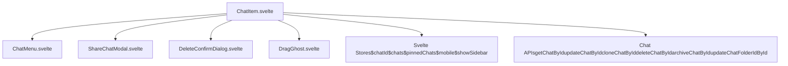
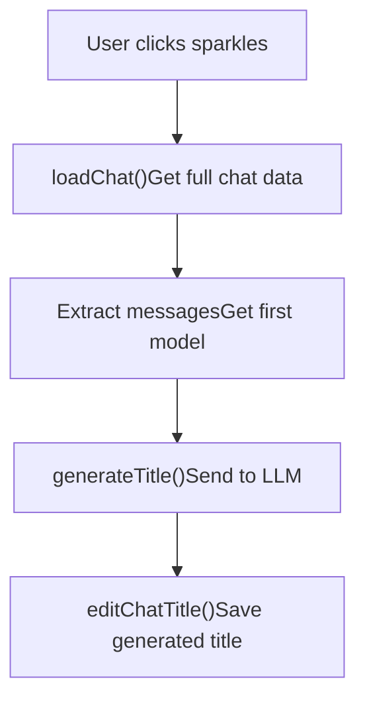
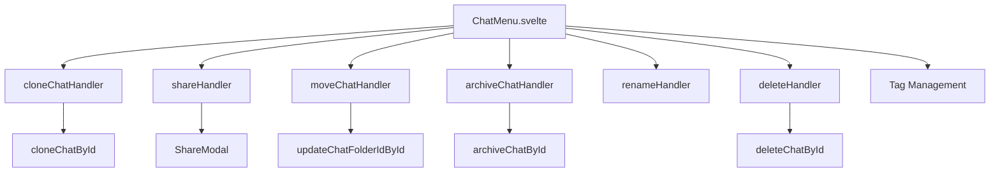
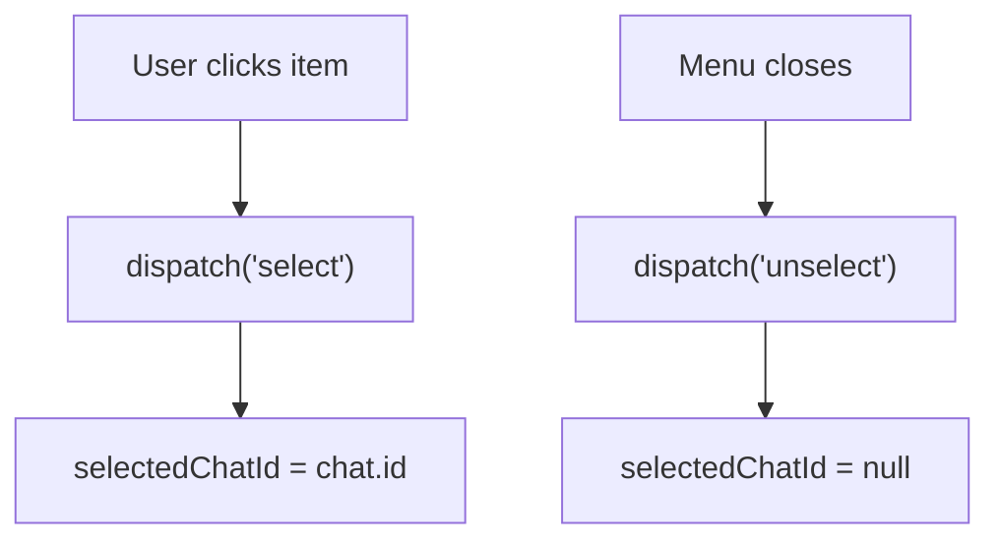
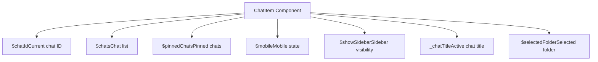

# Chat Item Management

Relevant source files

-   [backend/open\_webui/migrations/versions/1af9b942657b\_migrate\_tags.py](https://github.com/open-webui/open-webui/blob/a7271532/backend/open_webui/migrations/versions/1af9b942657b_migrate_tags.py)
-   [backend/open\_webui/migrations/versions/3ab32c4b8f59\_update\_tags.py](https://github.com/open-webui/open-webui/blob/a7271532/backend/open_webui/migrations/versions/3ab32c4b8f59_update_tags.py)
-   [backend/open\_webui/migrations/versions/c69f45358db4\_add\_folder\_table.py](https://github.com/open-webui/open-webui/blob/a7271532/backend/open_webui/migrations/versions/c69f45358db4_add_folder_table.py)
-   [src/lib/apis/folders/index.ts](https://github.com/open-webui/open-webui/blob/a7271532/src/lib/apis/folders/index.ts)
-   [src/lib/components/common/ConfirmDialog.svelte](https://github.com/open-webui/open-webui/blob/a7271532/src/lib/components/common/ConfirmDialog.svelte)
-   [src/lib/components/common/DragGhost.svelte](https://github.com/open-webui/open-webui/blob/a7271532/src/lib/components/common/DragGhost.svelte)
-   [src/lib/components/common/Folder.svelte](https://github.com/open-webui/open-webui/blob/a7271532/src/lib/components/common/Folder.svelte)
-   [src/lib/components/icons/Document.svelte](https://github.com/open-webui/open-webui/blob/a7271532/src/lib/components/icons/Document.svelte)
-   [src/lib/components/layout/Sidebar.svelte](https://github.com/open-webui/open-webui/blob/a7271532/src/lib/components/layout/Sidebar.svelte)
-   [src/lib/components/layout/Sidebar/ChatItem.svelte](https://github.com/open-webui/open-webui/blob/a7271532/src/lib/components/layout/Sidebar/ChatItem.svelte)
-   [src/lib/components/layout/Sidebar/Folders.svelte](https://github.com/open-webui/open-webui/blob/a7271532/src/lib/components/layout/Sidebar/Folders.svelte)
-   [src/lib/components/layout/Sidebar/Folders/FolderMenu.svelte](https://github.com/open-webui/open-webui/blob/a7271532/src/lib/components/layout/Sidebar/Folders/FolderMenu.svelte)
-   [src/lib/components/layout/Sidebar/RecursiveFolder.svelte](https://github.com/open-webui/open-webui/blob/a7271532/src/lib/components/layout/Sidebar/RecursiveFolder.svelte)
-   [src/lib/components/workspace/Knowledge/ItemMenu.svelte](https://github.com/open-webui/open-webui/blob/a7271532/src/lib/components/workspace/Knowledge/ItemMenu.svelte)

## Purpose and Scope

This document covers the `ChatItem` component, which represents individual chat entries in the sidebar. The component handles title editing, cloning, deletion, archiving, sharing, tagging, and drag-and-drop operations for organizing chats. For information about the broader sidebar structure and folder hierarchy, see [Folder System](/open-webui/open-webui/7.3-text-splitting-and-chunking). For details about the chat list display and pagination, see [Sidebar Architecture](/open-webui/open-webui/7.2-content-extraction-engines).

Sources: [src/lib/components/layout/Sidebar/ChatItem.svelte1-571](https://github.com/open-webui/open-webui/blob/a7271532/src/lib/components/layout/Sidebar/ChatItem.svelte#L1-L571)

## Component Architecture

The `ChatItem` component is instantiated for each chat in the sidebar, displaying the chat title and providing contextual actions through hover menus. The component supports both normal display mode and inline editing mode for title updates.

### ChatItem Component Structure


**ChatItem Props and State**

| Prop | Type | Purpose |
| --- | --- | --- |
| `id` | string | Unique chat identifier |
| `title` | string | Display title for the chat |
| `selected` | boolean | Whether this item is currently selected |
| `shiftKey` | boolean | Shift key state for bulk operations |
| `className` | string | Additional CSS classes |
| `onDragEnd` | function | Callback after drag operation completes |

Sources: [src/lib/components/layout/Sidebar/ChatItem.svelte46-54](https://github.com/open-webui/open-webui/blob/a7271532/src/lib/components/layout/Sidebar/ChatItem.svelte#L46-L54) [src/lib/components/layout/Sidebar/ChatItem.svelte56-62](https://github.com/open-webui/open-webui/blob/a7271532/src/lib/components/layout/Sidebar/ChatItem.svelte#L56-L62)

### Display Modes

The component operates in two primary modes:

1.  **Normal Mode**: Displays the chat title as a clickable link
2.  **Edit Mode**: Shows an inline text input for renaming

> **[Mermaid stateDiagram]**
> *(图表结构无法解析)*

Sources: [src/lib/components/layout/Sidebar/ChatItem.svelte353-432](https://github.com/open-webui/open-webui/blob/a7271532/src/lib/components/layout/Sidebar/ChatItem.svelte#L353-L432)

## Title Management

### Manual Title Editing

Users can rename chats through double-click activation or via the context menu. The component tracks edit state with the `confirmEdit` flag and manages the title input lifecycle.

**Edit Flow**:

1.  User double-clicks chat item or selects "Rename" from menu
2.  `renameHandler` sets `confirmEdit = true` and focuses input
3.  Input field displays with current title selected
4.  User modifies title and presses Enter or clicks away
5.  `editChatTitle` updates the chat via API

> **[Mermaid sequence]**
> *(图表结构无法解析)*

**Key Functions**:

-   `renameHandler()` - Activates edit mode [src/lib/components/layout/Sidebar/ChatItem.svelte267-280](https://github.com/open-webui/open-webui/blob/a7271532/src/lib/components/layout/Sidebar/ChatItem.svelte#L267-L280)
-   `editChatTitle(id, title)` - Persists title changes [src/lib/components/layout/Sidebar/ChatItem.svelte77-95](https://github.com/open-webui/open-webui/blob/a7271532/src/lib/components/layout/Sidebar/ChatItem.svelte#L77-L95)
-   `chatTitleInputKeydownHandler(e)` - Handles Enter/Escape keys [src/lib/components/layout/Sidebar/ChatItem.svelte253-265](https://github.com/open-webui/open-webui/blob/a7271532/src/lib/components/layout/Sidebar/ChatItem.svelte#L253-L265)

Sources: [src/lib/components/layout/Sidebar/ChatItem.svelte73-95](https://github.com/open-webui/open-webui/blob/a7271532/src/lib/components/layout/Sidebar/ChatItem.svelte#L73-L95) [src/lib/components/layout/Sidebar/ChatItem.svelte267-280](https://github.com/open-webui/open-webui/blob/a7271532/src/lib/components/layout/Sidebar/ChatItem.svelte#L267-L280) [src/lib/components/layout/Sidebar/ChatItem.svelte353-388](https://github.com/open-webui/open-webui/blob/a7271532/src/lib/components/layout/Sidebar/ChatItem.svelte#L353-L388)

### AI-Powered Title Generation

The component supports automatic title generation using LLM analysis of the chat content. This is triggered by clicking the sparkles button during edit mode.

**Generation Process**:


**Implementation Details**:

-   `generating` flag prevents duplicate requests [src/lib/components/layout/Sidebar/ChatItem.svelte167](https://github.com/open-webui/open-webui/blob/a7271532/src/lib/components/layout/Sidebar/ChatItem.svelte#L167-L167)
-   Extracts `role` and `content` from message history [src/lib/components/layout/Sidebar/ChatItem.svelte288-293](https://github.com/open-webui/open-webui/blob/a7271532/src/lib/components/layout/Sidebar/ChatItem.svelte#L288-L293)
-   Uses first model from chat configuration [src/lib/components/layout/Sidebar/ChatItem.svelte295](https://github.com/open-webui/open-webui/blob/a7271532/src/lib/components/layout/Sidebar/ChatItem.svelte#L295-L295)
-   Calls `generateTitle(token, model, messages)` API [src/lib/components/layout/Sidebar/ChatItem.svelte299-304](https://github.com/open-webui/open-webui/blob/a7271532/src/lib/components/layout/Sidebar/ChatItem.svelte#L299-L304)

Sources: [src/lib/components/layout/Sidebar/ChatItem.svelte282-317](https://github.com/open-webui/open-webui/blob/a7271532/src/lib/components/layout/Sidebar/ChatItem.svelte#L282-L317) [src/lib/components/layout/Sidebar/ChatItem.svelte459-470](https://github.com/open-webui/open-webui/blob/a7271532/src/lib/components/layout/Sidebar/ChatItem.svelte#L459-L470)

## Chat Operations

### ChatMenu Integration

The `ChatMenu` component provides a dropdown menu with all chat operations. It appears on hover or when the item is selected.


Sources: [src/lib/components/layout/Sidebar/ChatItem.svelte500-524](https://github.com/open-webui/open-webui/blob/a7271532/src/lib/components/layout/Sidebar/ChatItem.svelte#L500-L524)

### Clone Operation

Creates a duplicate of the chat with all messages and configuration.

**Clone Handler**:

```
cloneChatHandler(id)
├── Call cloneChatById(token, id, title)
├── title = i18n.t('Clone of {{TITLE}}', {TITLE: title})
├── Navigate to /c/{new_id}
└── Refresh chat lists ($chats, $pinnedChats)
```
Sources: [src/lib/components/layout/Sidebar/ChatItem.svelte97-116](https://github.com/open-webui/open-webui/blob/a7271532/src/lib/components/layout/Sidebar/ChatItem.svelte#L97-L116)

### Delete Operation

Deletion requires confirmation through `DeleteConfirmDialog`. If the deleted chat is currently open, the user is redirected to the home page.

**Delete Flow**:

1.  User clicks delete from menu
2.  `showDeleteConfirm` set to true
3.  User confirms in modal
4.  `deleteChatHandler(id)` called
5.  API call to `deleteChatById`
6.  If `$chatId === id`, navigate to `/` and reset `chatId`
7.  Dispatch 'change' event to parent

Sources: [src/lib/components/layout/Sidebar/ChatItem.svelte118-135](https://github.com/open-webui/open-webui/blob/a7271532/src/lib/components/layout/Sidebar/ChatItem.svelte#L118-L135) [src/lib/components/layout/Sidebar/ChatItem.svelte322-332](https://github.com/open-webui/open-webui/blob/a7271532/src/lib/components/layout/Sidebar/ChatItem.svelte#L322-L332) [src/lib/components/layout/Sidebar/ChatItem.svelte513-515](https://github.com/open-webui/open-webui/blob/a7271532/src/lib/components/layout/Sidebar/ChatItem.svelte#L513-L515)

### Archive Operation

Archiving removes chats from the main list without deleting them. Archived chats can be accessed through the "Archived Chats" modal.

Sources: [src/lib/components/layout/Sidebar/ChatItem.svelte137-140](https://github.com/open-webui/open-webui/blob/a7271532/src/lib/components/layout/Sidebar/ChatItem.svelte#L137-L140) [src/lib/components/layout/Sidebar/ChatItem.svelte474-484](https://github.com/open-webui/open-webui/blob/a7271532/src/lib/components/layout/Sidebar/ChatItem.svelte#L474-L484)

### Move to Folder

Chats can be moved between folders or removed from folders entirely.

**Move Handler**:

```
moveChatHandler(chatId, folderId)
├── Validate chatId and folderId exist
├── Call updateChatFolderIdById(token, chatId, folderId)
├── Refresh chat lists
├── Dispatch 'change' event
└── Show success/error toast
```
Sources: [src/lib/components/layout/Sidebar/ChatItem.svelte142-163](https://github.com/open-webui/open-webui/blob/a7271532/src/lib/components/layout/Sidebar/ChatItem.svelte#L142-L163)

### Share Operation

Opens the `ShareChatModal` for generating public share links.

Sources: [src/lib/components/layout/Sidebar/ChatItem.svelte72](https://github.com/open-webui/open-webui/blob/a7271532/src/lib/components/layout/Sidebar/ChatItem.svelte#L72-L72) [src/lib/components/layout/Sidebar/ChatItem.svelte320](https://github.com/open-webui/open-webui/blob/a7271532/src/lib/components/layout/Sidebar/ChatItem.svelte#L320-L320) [src/lib/components/layout/Sidebar/ChatItem.svelte505-507](https://github.com/open-webui/open-webui/blob/a7271532/src/lib/components/layout/Sidebar/ChatItem.svelte#L505-L507)

## Drag and Drop System

### Drag Implementation

The ChatItem component implements HTML5 drag-and-drop for organizing chats into folders or changing their order.

**Drag State Management**:

| State Variable | Purpose |
| --- | --- |
| `draggable` | Whether item can be dragged (false until chat data loaded) |
| `dragged` | Currently being dragged |
| `x`, `y` | Current drag coordinates for ghost element |
| `itemElement` | Reference to DOM element |

**Drag Event Handlers**:

> **[Mermaid sequence]**
> *(图表结构无法解析)*

**Data Transfer Format**:

```
{
  "type": "chat",
  "id": "chat-uuid",
  "item": {
    "chat": {...},
    "meta": {...},
    "created_at": 123456789,
    "updated_at": 123456789
  }
}
```
Sources: [src/lib/components/layout/Sidebar/ChatItem.svelte165-213](https://github.com/open-webui/open-webui/blob/a7271532/src/lib/components/layout/Sidebar/ChatItem.svelte#L165-L213) [src/lib/components/layout/Sidebar/ChatItem.svelte180-197](https://github.com/open-webui/open-webui/blob/a7271532/src/lib/components/layout/Sidebar/ChatItem.svelte#L180-L197) [src/lib/components/layout/Sidebar/ChatItem.svelte334-345](https://github.com/open-webui/open-webui/blob/a7271532/src/lib/components/layout/Sidebar/ChatItem.svelte#L334-L345)

### Lazy Loading Chat Data

The component implements lazy loading: full chat data is only fetched when the user hovers over the item, enabling drag operations.

**Load Flow**:

```
mouseOver = true
    ├── loadChat() triggered
    ├── draggable = false
    ├── chat = getChatById(token, id)
    └── draggable = true
```
Sources: [src/lib/components/layout/Sidebar/ChatItem.svelte58-70](https://github.com/open-webui/open-webui/blob/a7271532/src/lib/components/layout/Sidebar/ChatItem.svelte#L58-L70)

### Visual Feedback

The `DragGhost` component displays a semi-transparent preview following the cursor during drag operations.

Sources: [src/lib/components/layout/Sidebar/ChatItem.svelte334-345](https://github.com/open-webui/open-webui/blob/a7271532/src/lib/components/layout/Sidebar/ChatItem.svelte#L334-L345) [src/lib/components/common/DragGhost.svelte1-31](https://github.com/open-webui/open-webui/blob/a7271532/src/lib/components/common/DragGhost.svelte#L1-L31)

## Selection and Keyboard Navigation

### Selection State

The component supports selection tracking for keyboard navigation and bulk operations.

**Selection Events**:

-   `on:select` - Dispatched when chat is clicked
-   `on:unselect` - Dispatched when chat menu closes or focus lost


Sources: [src/lib/components/layout/Sidebar/ChatItem.svelte51-52](https://github.com/open-webui/open-webui/blob/a7271532/src/lib/components/layout/Sidebar/ChatItem.svelte#L51-L52) [src/lib/components/layout/Sidebar/ChatItem.svelte399-401](https://github.com/open-webui/open-webui/blob/a7271532/src/lib/components/layout/Sidebar/ChatItem.svelte#L399-L401) [src/lib/components/layout/Sidebar/ChatItem.svelte529-531](https://github.com/open-webui/open-webui/blob/a7271532/src/lib/components/layout/Sidebar/ChatItem.svelte#L529-L531)

### Shift Key Behavior

When Shift key is held, the menu displays quick action buttons (Archive, Delete) instead of the dropdown menu.

**Conditional Menu Display**:

```
if (shiftKey && mouseOver)
    Show: Archive button, Delete button
else
    Show: ChatMenu dropdown
```
Sources: [src/lib/components/layout/Sidebar/ChatItem.svelte472-497](https://github.com/open-webui/open-webui/blob/a7271532/src/lib/components/layout/Sidebar/ChatItem.svelte#L472-L497)

### Keyboard Shortcuts

The component supports keyboard shortcuts through hidden button elements:

-   `#delete-chat-button` - Triggered by global keyboard shortcut when chat is active

Sources: [src/lib/components/layout/Sidebar/ChatItem.svelte546-566](https://github.com/open-webui/open-webui/blob/a7271532/src/lib/components/layout/Sidebar/ChatItem.svelte#L546-L566)

## State Management and Events

### Parent Communication

The component dispatches events to notify the parent Sidebar component of state changes:

| Event | Payload | Purpose |
| --- | --- | --- |
| `select` | none | Item was clicked |
| `unselect` | none | Item lost focus |
| `change` | none | Chat list needs refresh |
| `tag` | `{type, name}` | Tag was added/removed |

Sources: [src/lib/components/layout/Sidebar/ChatItem.svelte7](https://github.com/open-webui/open-webui/blob/a7271532/src/lib/components/layout/Sidebar/ChatItem.svelte#L7-L7) [src/lib/components/layout/Sidebar/ChatItem.svelte93](https://github.com/open-webui/open-webui/blob/a7271532/src/lib/components/layout/Sidebar/ChatItem.svelte#L93-L93) [src/lib/components/layout/Sidebar/ChatItem.svelte519-524](https://github.com/open-webui/open-webui/blob/a7271532/src/lib/components/layout/Sidebar/ChatItem.svelte#L519-L524)

### Store Integration

The component reads and updates several global Svelte stores:


Sources: [src/lib/components/layout/Sidebar/ChatItem.svelte9-31](https://github.com/open-webui/open-webui/blob/a7271532/src/lib/components/layout/Sidebar/ChatItem.svelte#L9-L31)

### Lifecycle Management

The component uses Svelte lifecycle hooks for event listener management:

**onMount**:

-   Registers click outside handler for edit mode
-   Attaches drag event listeners to `itemElement`

**onDestroy**:

-   Removes all event listeners to prevent memory leaks

Sources: [src/lib/components/layout/Sidebar/ChatItem.svelte228-239](https://github.com/open-webui/open-webui/blob/a7271532/src/lib/components/layout/Sidebar/ChatItem.svelte#L228-L239) [src/lib/components/layout/Sidebar/ChatItem.svelte241-249](https://github.com/open-webui/open-webui/blob/a7271532/src/lib/components/layout/Sidebar/ChatItem.svelte#L241-L249)

## UI States and Styling

### Active State Indicators

The component applies different styles based on its state:

| Condition | CSS Class | Purpose |
| --- | --- | --- |
| `id === $chatId` | `bg-gray-100 dark:bg-gray-900 selected` | Currently active chat |
| `confirmEdit` | Same as active | Edit mode active |
| `selected` | `bg-gray-100 dark:bg-gray-950 selected` | Selected for keyboard nav |
| Default | `group-hover:bg-gray-100 dark:group-hover:bg-gray-950` | Hover state |

Sources: [src/lib/components/layout/Sidebar/ChatItem.svelte356-361](https://github.com/open-webui/open-webui/blob/a7271532/src/lib/components/layout/Sidebar/ChatItem.svelte#L356-L361) [src/lib/components/layout/Sidebar/ChatItem.svelte392-397](https://github.com/open-webui/open-webui/blob/a7271532/src/lib/components/layout/Sidebar/ChatItem.svelte#L392-L397)

### Menu Button Visibility

The menu button uses CSS visibility classes to appear only on hover or when the item is active/selected:

```
visible when:
    - id === $chatId (currently open)
    - confirmEdit (editing)
    - selected (keyboard selection)

invisible + group-hover:visible when:
    - none of above
```
Sources: [src/lib/components/layout/Sidebar/ChatItem.svelte437-447](https://github.com/open-webui/open-webui/blob/a7271532/src/lib/components/layout/Sidebar/ChatItem.svelte#L437-L447)
