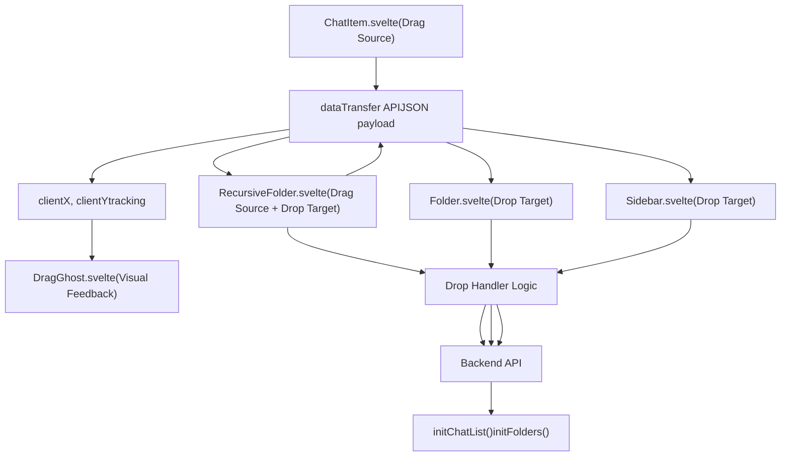
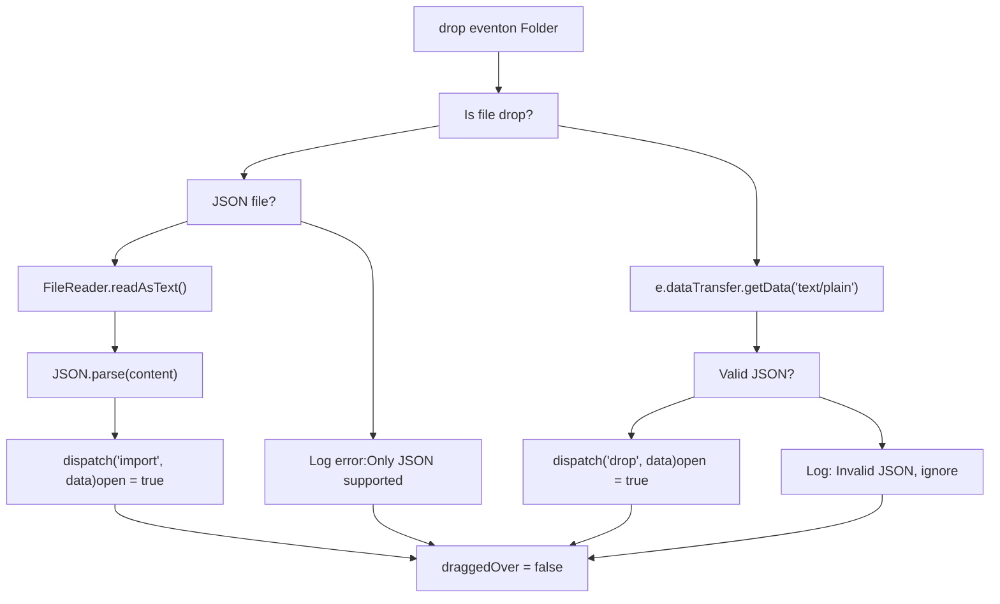
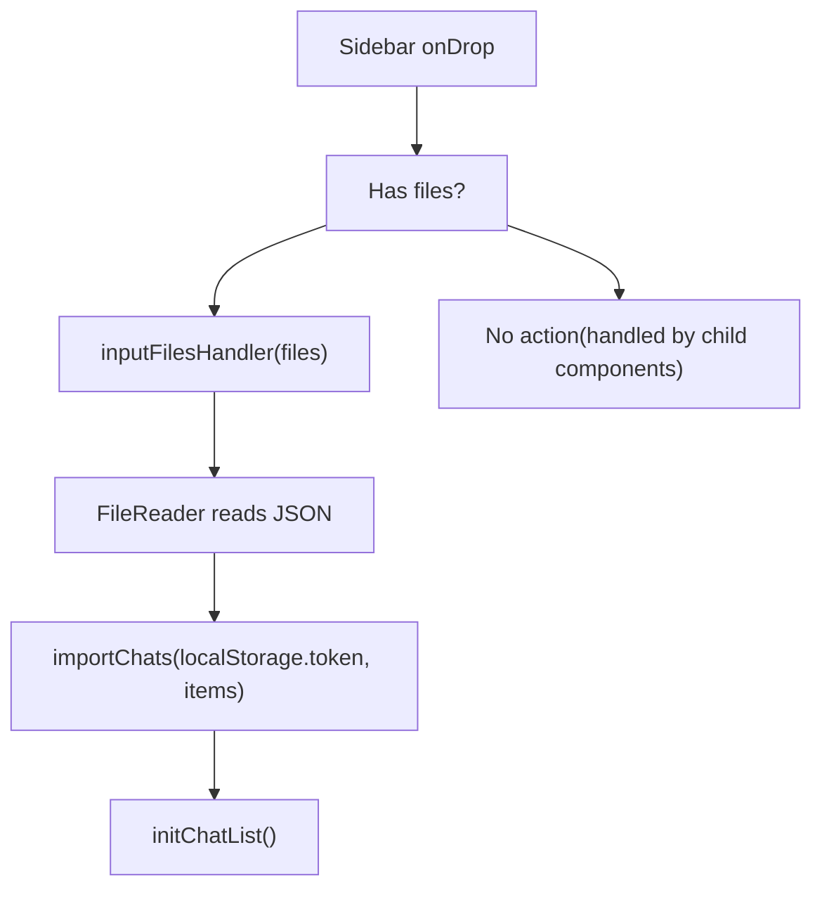
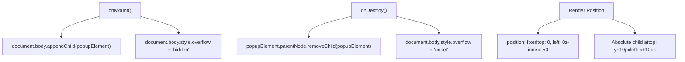
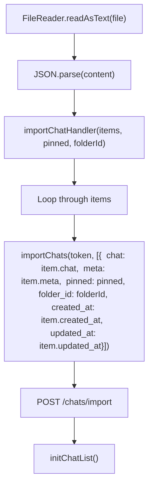
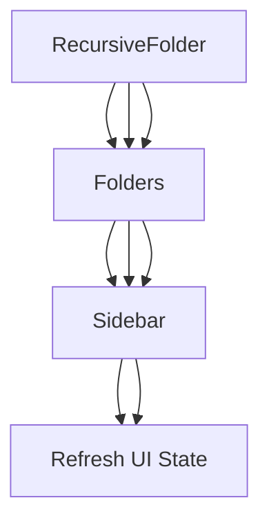

# Drag and Drop System

Relevant source files

-   [backend/open\_webui/migrations/versions/1af9b942657b\_migrate\_tags.py](https://github.com/open-webui/open-webui/blob/a7271532/backend/open_webui/migrations/versions/1af9b942657b_migrate_tags.py)
-   [backend/open\_webui/migrations/versions/3ab32c4b8f59\_update\_tags.py](https://github.com/open-webui/open-webui/blob/a7271532/backend/open_webui/migrations/versions/3ab32c4b8f59_update_tags.py)
-   [backend/open\_webui/migrations/versions/c69f45358db4\_add\_folder\_table.py](https://github.com/open-webui/open-webui/blob/a7271532/backend/open_webui/migrations/versions/c69f45358db4_add_folder_table.py)
-   [src/lib/apis/folders/index.ts](https://github.com/open-webui/open-webui/blob/a7271532/src/lib/apis/folders/index.ts)
-   [src/lib/components/common/ConfirmDialog.svelte](https://github.com/open-webui/open-webui/blob/a7271532/src/lib/components/common/ConfirmDialog.svelte)
-   [src/lib/components/common/DragGhost.svelte](https://github.com/open-webui/open-webui/blob/a7271532/src/lib/components/common/DragGhost.svelte)
-   [src/lib/components/common/Folder.svelte](https://github.com/open-webui/open-webui/blob/a7271532/src/lib/components/common/Folder.svelte)
-   [src/lib/components/icons/Document.svelte](https://github.com/open-webui/open-webui/blob/a7271532/src/lib/components/icons/Document.svelte)
-   [src/lib/components/layout/Sidebar.svelte](https://github.com/open-webui/open-webui/blob/a7271532/src/lib/components/layout/Sidebar.svelte)
-   [src/lib/components/layout/Sidebar/ChatItem.svelte](https://github.com/open-webui/open-webui/blob/a7271532/src/lib/components/layout/Sidebar/ChatItem.svelte)
-   [src/lib/components/layout/Sidebar/Folders.svelte](https://github.com/open-webui/open-webui/blob/a7271532/src/lib/components/layout/Sidebar/Folders.svelte)
-   [src/lib/components/layout/Sidebar/Folders/FolderMenu.svelte](https://github.com/open-webui/open-webui/blob/a7271532/src/lib/components/layout/Sidebar/Folders/FolderMenu.svelte)
-   [src/lib/components/layout/Sidebar/RecursiveFolder.svelte](https://github.com/open-webui/open-webui/blob/a7271532/src/lib/components/layout/Sidebar/RecursiveFolder.svelte)
-   [src/lib/components/workspace/Knowledge/ItemMenu.svelte](https://github.com/open-webui/open-webui/blob/a7271532/src/lib/components/workspace/Knowledge/ItemMenu.svelte)

The Drag and Drop System enables users to reorganize chats and folders within the sidebar through intuitive drag-and-drop interactions. The system supports two primary use cases: (1) moving chat items and folders between organizational containers (folders, pinned section, main chats list), and (2) importing chat data by dropping JSON files onto drop zones. This document covers the frontend drag-and-drop implementation, visual feedback mechanisms, and backend integration points. For information about the folder hierarchy structure itself, see [Folder System](/open-webui/open-webui/8.2-folder-system). For chat organization features, see [Chat Item Management](/open-webui/open-webui/8.3-chat-item-management).

## System Architecture

The drag-and-drop system is distributed across multiple components, each handling specific aspects of the interaction lifecycle. The architecture separates drag sources (items that can be dragged), drop targets (containers that accept drops), and visual feedback components.

### Component Interaction Flow


**Sources:** [src/lib/components/layout/Sidebar/ChatItem.svelte180-213](https://github.com/open-webui/open-webui/blob/a7271532/src/lib/components/layout/Sidebar/ChatItem.svelte#L180-L213) [src/lib/components/layout/Sidebar/RecursiveFolder.svelte74-249](https://github.com/open-webui/open-webui/blob/a7271532/src/lib/components/layout/Sidebar/RecursiveFolder.svelte#L74-L249) [src/lib/components/common/Folder.svelte33-104](https://github.com/open-webui/open-webui/blob/a7271532/src/lib/components/common/Folder.svelte#L33-L104) [src/lib/components/common/DragGhost.svelte1-38](https://github.com/open-webui/open-webui/blob/a7271532/src/lib/components/common/DragGhost.svelte#L1-L38)

### Data Transfer Protocol

The drag-and-drop system uses the HTML5 DataTransfer API to pass structured information between drag sources and drop targets. The payload contains type discrimination and full item data to support various drop scenarios.

**Payload Structure:**

```
{
  type: 'chat' | 'folder',
  id: string,
  item?: object  // Full chat or folder object for cross-context operations
}
```
**Sources:** [src/lib/components/layout/Sidebar/ChatItem.svelte186-193](https://github.com/open-webui/open-webui/blob/a7271532/src/lib/components/layout/Sidebar/ChatItem.svelte#L186-L193) [src/lib/components/layout/Sidebar/RecursiveFolder.svelte225-231](https://github.com/open-webui/open-webui/blob/a7271532/src/lib/components/layout/Sidebar/RecursiveFolder.svelte#L225-L231)

## Drag Sources

### ChatItem Draggable Implementation

The `ChatItem` component implements draggable functionality for individual chat entries. Each chat item becomes draggable only after the chat data is loaded via lazy loading on mouse hover.

**Key Implementation Details:**

| Feature | Implementation | File Reference |
| --- | --- | --- |
| Draggable State | `draggable` binding conditionally set based on `chat` data availability | [ChatItem.svelte59-69](https://github.com/open-webui/open-webui/blob/a7271532/ChatItem.svelte#L59-L69) |
| Drag Initiation | `dragstart` event handler sets transparent drag image and payload | [ChatItem.svelte180-197](https://github.com/open-webui/open-webui/blob/a7271532/ChatItem.svelte#L180-L197) |
| Visual Opacity | Element opacity set to `0.5` during drag operation | [ChatItem.svelte196](https://github.com/open-webui/open-webui/blob/a7271532/ChatItem.svelte#L196-L196) |
| Coordinate Tracking | `drag` event updates `x` and `y` for ghost positioning | [ChatItem.svelte199-204](https://github.com/open-webui/open-webui/blob/a7271532/ChatItem.svelte#L199-L204) |

**Drag Event Handler Flow:**

> **[Mermaid sequence]**
> *(图表结构无法解析)*

**Sources:** [src/lib/components/layout/Sidebar/ChatItem.svelte56-213](https://github.com/open-webui/open-webui/blob/a7271532/src/lib/components/layout/Sidebar/ChatItem.svelte#L56-L213)

### RecursiveFolder Draggable Implementation

Folders are also draggable, allowing hierarchical reorganization. The `RecursiveFolder` component prevents drag operations on child elements when a parent folder is being dragged via the `parentDragged` prop.

**Drag Prevention Logic:**

-   If `dragged` or `parentDragged` is true, the folder's drop handlers exit early
-   This prevents invalid operations like dropping a folder into itself or its descendants

**Sources:** [src/lib/components/layout/Sidebar/RecursiveFolder.svelte74-89](https://github.com/open-webui/open-webui/blob/a7271532/src/lib/components/layout/Sidebar/RecursiveFolder.svelte#L74-L89) [src/lib/components/layout/Sidebar/RecursiveFolder.svelte220-249](https://github.com/open-webui/open-webui/blob/a7271532/src/lib/components/layout/Sidebar/RecursiveFolder.svelte#L220-L249)

## Drop Targets

### Folder Drop Target

The `Folder.svelte` component serves as a generic collapsible folder with drop target capabilities. It accepts two types of drops:

1.  **JSON File Drops:** For importing chat data
2.  **Item Drops:** For organizational moves (delegated to parent components via `drop` event)

**Drop Handler Architecture:**


**Sources:** [src/lib/components/common/Folder.svelte39-97](https://github.com/open-webui/open-webui/blob/a7271532/src/lib/components/common/Folder.svelte#L39-L97)

### RecursiveFolder Drop Target

The `RecursiveFolder` component implements complex drop logic for hierarchical folder operations. It handles four scenarios:

1.  **JSON file import** - imports chats into the folder
2.  **Folder dropped on folder** - updates parent-child relationship via `updateFolderParentIdById`
3.  **Chat dropped on folder** - moves chat via `updateChatFolderIdById`
4.  **Chat from external source** (no existing chat) - imports then moves

**Drop Logic Implementation:**

**Sources:** [src/lib/components/layout/Sidebar/RecursiveFolder.svelte83-201](https://github.com/open-webui/open-webui/blob/a7271532/src/lib/components/layout/Sidebar/RecursiveFolder.svelte#L83-L201)

### Sidebar Drop Zones

The `Sidebar.svelte` component defines multiple drop zones for top-level organizational areas:

| Drop Zone | ID | Accepts | Action |
| --- | --- | --- | --- |
| Main Sidebar | `sidebar` | JSON files | Import chats via `inputFilesHandler` |
| Folders Section | `sidebar-folders` | Chat items, Folders | Move to root level (parent\_id = null) |
| Chats Section | `sidebar-chats` | Chat items, Folders | Unpin + move to main list |
| Pinned Section | `sidebar-pinned-chats` | Chat items | Pin + unassign folder |

**Sidebar-Level Drop Handler:**


**Sources:** [src/lib/components/layout/Sidebar.svelte305-335](https://github.com/open-webui/open-webui/blob/a7271532/src/lib/components/layout/Sidebar.svelte#L305-L335)

### Specialized Drop Logic in Folders Section

The "Folders" section drop handler in `Sidebar.svelte` specifically handles moving folders back to the root level:

```
// When folder is dropped on "Folders" section header
on:drop={async (e) => {
    const { type, id } = e.detail;
    if (type === 'folder') {
        if (folders[id].parent_id === null) return; // Already at root

        await updateFolderParentIdById(localStorage.token, id, null);
        await initFolders();
    }
}}
```
**Sources:** [src/lib/components/layout/Sidebar.svelte1078-1097](https://github.com/open-webui/open-webui/blob/a7271532/src/lib/components/layout/Sidebar.svelte#L1078-L1097)

## Visual Feedback System

### DragGhost Component

The `DragGhost` component provides a custom visual indicator that follows the cursor during drag operations. It renders in a fixed-position overlay at calculated coordinates offset from the cursor position.

**Component Structure:**


**DragGhost Usage in ChatItem:**

The ghost displays a styled preview with the chat document icon and title:

```
{#if dragged && x && y}
  <DragGhost {x} {y}>
    <div class="bg-black/80 backdrop-blur-2xl px-2 py-1 rounded-lg w-fit max-w-40">
      <div class="flex items-center gap-1">
        <Document className="size-[18px]" strokeWidth="2" />
        <div class="text-xs text-white line-clamp-1">{title}</div>
      </div>
    </div>
  </DragGhost>
{/if}
```
**Sources:** [src/lib/components/common/DragGhost.svelte1-38](https://github.com/open-webui/open-webui/blob/a7271532/src/lib/components/common/DragGhost.svelte#L1-L38) [src/lib/components/layout/Sidebar/ChatItem.svelte334-345](https://github.com/open-webui/open-webui/blob/a7271532/src/lib/components/layout/Sidebar/ChatItem.svelte#L334-L345) [src/lib/components/layout/Sidebar/RecursiveFolder.svelte447-458](https://github.com/open-webui/open-webui/blob/a7271532/src/lib/components/layout/Sidebar/RecursiveFolder.svelte#L447-L458)

### Drop Target Visual States

Drop targets display visual feedback when a draggable item hovers over them. The `draggedOver` state triggers an overlay:

```
{#if draggedOver}
  <div class="absolute top-0 left-0 w-full h-full rounded-xs
              bg-gray-100/50 dark:bg-gray-700/20
              bg-opacity-50 dark:bg-opacity-10
              z-50 pointer-events-none touch-none">
  </div>
{/if}
```
**Sources:** [src/lib/components/common/Folder.svelte134-137](https://github.com/open-webui/open-webui/blob/a7271532/src/lib/components/common/Folder.svelte#L134-L137) [src/lib/components/layout/Sidebar/RecursiveFolder.svelte461-464](https://github.com/open-webui/open-webui/blob/a7271532/src/lib/components/layout/Sidebar/RecursiveFolder.svelte#L461-L464)

## Backend Integration

### Chat Movement Operations

Moving chats between organizational containers requires backend API calls to persist the new folder assignment:

**API Function:** `updateChatFolderIdById(token, chatId, folderId)`

**Flow:**

> **[Mermaid sequence]**
> *(图表结构无法解析)*

**Sources:** [src/lib/components/layout/Sidebar/RecursiveFolder.svelte173-189](https://github.com/open-webui/open-webui/blob/a7271532/src/lib/components/layout/Sidebar/RecursiveFolder.svelte#L173-L189) [src/lib/components/layout/Sidebar.svelte1136-1170](https://github.com/open-webui/open-webui/blob/a7271532/src/lib/components/layout/Sidebar.svelte#L1136-L1170)

### Folder Movement Operations

Moving folders updates the parent-child relationship in the folder hierarchy:

**API Function:** `updateFolderParentIdById(token, folderId, parentId)`

**Special Cases:**

-   Setting `parentId = null` moves the folder to the root level
-   The system prevents circular references (cannot drop a folder into itself or its descendants)

**Sources:** [src/lib/apis/folders/index.ts169-201](https://github.com/open-webui/open-webui/blob/a7271532/src/lib/apis/folders/index.ts#L169-L201) [src/lib/components/layout/Sidebar/RecursiveFolder.svelte140-148](https://github.com/open-webui/open-webui/blob/a7271532/src/lib/components/layout/Sidebar/RecursiveFolder.svelte#L140-L148)

### Chat Import Operations

JSON file drops trigger the import flow, which creates new chat entries in the database:

**Import Handler Flow:**


**Sources:** [src/lib/components/layout/Sidebar.svelte253-272](https://github.com/open-webui/open-webui/blob/a7271532/src/lib/components/layout/Sidebar.svelte#L253-L272) [src/lib/components/layout/Sidebar.svelte274-292](https://github.com/open-webui/open-webui/blob/a7271532/src/lib/components/layout/Sidebar.svelte#L274-L292)

## Event Coordination

### Folder Registry System

The `folderRegistry` object maintains references to folder instances for programmatic updates. This enables cross-folder coordination when items move between containers.

**Registry Structure:**

```
folderRegistry[folderId] = {
  setFolderItems: () => { /* refresh folder contents */ }
}
```
**Usage Example - Origin Folder Refresh:**

```
const onItemMove = (e) => {
  if (e.originFolderId) {
    folderRegistry[e.originFolderId]?.setFolderItems();
  }
};
```
This ensures that when a chat moves from Folder A to Folder B, Folder A's displayed contents refresh to remove the moved item.

**Sources:** [src/lib/components/layout/Sidebar/RecursiveFolder.svelte252-257](https://github.com/open-webui/open-webui/blob/a7271532/src/lib/components/layout/Sidebar/RecursiveFolder.svelte#L252-L257) [src/lib/components/layout/Sidebar/Folders.svelte26-30](https://github.com/open-webui/open-webui/blob/a7271532/src/lib/components/layout/Sidebar/Folders.svelte#L26-L30) [src/lib/components/layout/Sidebar.svelte1162](https://github.com/open-webui/open-webui/blob/a7271532/src/lib/components/layout/Sidebar.svelte#L1162-L1162)

### Event Dispatch Chain

Drop operations trigger a chain of custom events that propagate up the component hierarchy:


**Event Handlers in Sidebar:**

| Event | Trigger | Action |
| --- | --- | --- |
| `update` | Folder structure changed | Call `initChatList()` to refresh chat list and folders |
| `import` | JSON file dropped | Call `importChatHandler` with folder ID context |
| `change` | Chat contents changed | Reset `selectedFolder` to null, refresh list |

**Sources:** [src/lib/components/layout/Sidebar/Folders.svelte52-60](https://github.com/open-webui/open-webui/blob/a7271532/src/lib/components/layout/Sidebar/Folders.svelte#L52-L60) [src/lib/components/layout/Sidebar.svelte1107-1117](https://github.com/open-webui/open-webui/blob/a7271532/src/lib/components/layout/Sidebar.svelte#L1107-L1117) [src/lib/components/layout/Sidebar.svelte1126-1130](https://github.com/open-webui/open-webui/blob/a7271532/src/lib/components/layout/Sidebar.svelte#L1126-L1130)

## Transparent Drag Image

To enable custom drag ghost rendering, the system sets a transparent 1x1 pixel image as the browser's native drag image:

```
const dragImage = new Image();
dragImage.src = 'data:image/png;base64,iVBORw0KGgoAAAANSUhEUgAAAAEAAAABCAQAAAC1HAwCAAAAC0lEQVR42mNkYAAAAAYAAjCB0C8AAAAASUVORK5CYII=';

const onDragStart = (event) => {
  event.dataTransfer.setDragImage(dragImage, 0, 0);
  // ... rest of handler
};
```
This technique allows the `DragGhost` component to provide the visible drag preview while the browser's default ghost is invisible.

**Sources:** [src/lib/components/layout/Sidebar/ChatItem.svelte176-183](https://github.com/open-webui/open-webui/blob/a7271532/src/lib/components/layout/Sidebar/ChatItem.svelte#L176-L183) [src/lib/components/layout/Sidebar/RecursiveFolder.svelte213-222](https://github.com/open-webui/open-webui/blob/a7271532/src/lib/components/layout/Sidebar/RecursiveFolder.svelte#L213-L222)

## Keyboard Interactions

The system integrates with keyboard state for enhanced interactions. The `shiftKey` prop is passed down the component hierarchy to enable alternate behaviors:

**ChatItem Shift Behavior:**

When shift is held during hover, the ChatItem displays quick actions (Archive, Delete) instead of the standard menu:

```
{:else if shiftKey && mouseOver}
  <div class="flex items-center self-center space-x-1.5">
    <button on:click={() => { archiveChatHandler(id); }}>
      <ArchiveBox />
    </button>
    <button on:click={() => { deleteChatHandler(id); }}>
      <GarbageBin />
    </button>
  </div>
{/if}
```
**Sources:** [src/lib/components/layout/Sidebar/ChatItem.svelte472-497](https://github.com/open-webui/open-webui/blob/a7271532/src/lib/components/layout/Sidebar/ChatItem.svelte#L472-L497) [src/lib/components/layout/Sidebar.svelte363-373](https://github.com/open-webui/open-webui/blob/a7271532/src/lib/components/layout/Sidebar.svelte#L363-L373)
