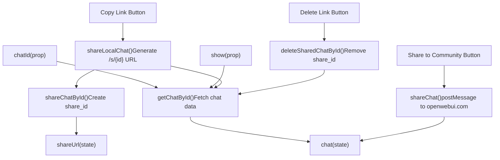
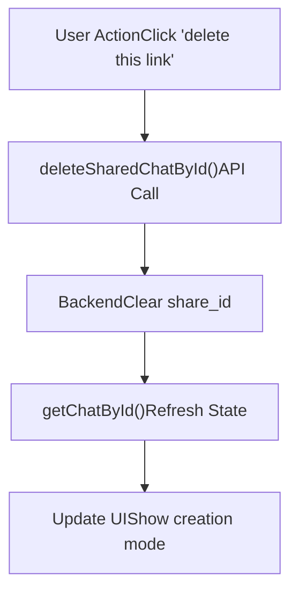

# Chat Sharing

Relevant source files

-   [src/lib/components/chat/ShareChatModal.svelte](https://github.com/open-webui/open-webui/blob/a7271532/src/lib/components/chat/ShareChatModal.svelte)

## Purpose and Scope

This document explains the chat sharing system in Open WebUI, which allows users to generate public shareable links to their chat conversations. Chat sharing operates in two modes: **local shareable links** for sharing within the same Open WebUI instance, and **Open WebUI Community sharing** for publishing chats to the public community platform at openwebui.com.

For information about chat organization and navigation, see [Sidebar Architecture](/open-webui/open-webui/8.1-sidebar-architecture). For details about chat data persistence, see [Message History Tree](/open-webui/open-webui/4.3-message-history-tree).

---

## Sharing Modes Overview

Open WebUI supports two distinct sharing mechanisms, each serving different use cases:

| Sharing Mode | Target Audience | Authentication Required | Data Location |
| --- | --- | --- | --- |
| **Local Link** | Users with instance access | No (public URL) | Same Open WebUI instance |
| **Community** | Public internet users | No | openwebui.com platform |

The local link mode generates a public URL (`/s/{share_id}`) that allows anyone with the link to view the chat conversation as a read-only snapshot. The community mode exports the chat data to the Open WebUI Community platform via cross-origin postMessage communication.

**Sources:** [src/lib/components/chat/ShareChatModal.svelte19-55](https://github.com/open-webui/open-webui/blob/a7271532/src/lib/components/chat/ShareChatModal.svelte#L19-L55)

---

## ShareChatModal Component Architecture


**Component Structure**

The `ShareChatModal` component is implemented as a reactive Svelte modal dialog that orchestrates the sharing workflow. The component maintains two primary state variables:

-   `chat`: The full chat object fetched from the backend, including the `share_id` field if previously shared
-   `shareUrl`: The generated shareable URL in the format `${window.location.origin}/s/${sharedChat.id}`

The component uses reactive statements to automatically fetch chat data when the modal is opened (`$: if (show)`), implementing change detection via the `isDifferentChat()` helper to avoid redundant API calls.

**Sources:** [src/lib/components/chat/ShareChatModal.svelte1-82](https://github.com/open-webui/open-webui/blob/a7271532/src/lib/components/chat/ShareChatModal.svelte#L1-L82)

---

## Local Shareable Link Generation

### Share Creation Flow

The `shareLocalChat()` function implements the local link generation workflow:

1.  **Share ID Creation**: Calls `shareChatById()` API endpoint which generates a unique `share_id` for the chat
2.  **URL Construction**: Builds the public URL using `window.location.origin` and the returned `share_id`
3.  **State Refresh**: Fetches the updated chat object to synchronize the `share_id` in component state
4.  **Clipboard Copy**: Copies the URL to clipboard using browser-specific handling

**Sources:** [src/lib/components/chat/ShareChatModal.svelte19-28](https://github.com/open-webui/open-webui/blob/a7271532/src/lib/components/chat/ShareChatModal.svelte#L19-L28)

### Safari-Specific Clipboard Handling

Safari requires special clipboard handling due to security restrictions on asynchronous clipboard writes. The component detects Safari via user agent string and uses the `ClipboardItem` API with promise-based blob construction:

```
const getUrlPromise = async () => {
    const url = await shareLocalChat();
    return new Blob([url], { type: 'text/plain' });
};

navigator.clipboard.write([
    new ClipboardItem({
        'text/plain': getUrlPromise()
    })
]);
```
For non-Safari browsers, the standard `copyToClipboard()` utility function is used directly.

**Sources:** [src/lib/components/chat/ShareChatModal.svelte147-174](https://github.com/open-webui/open-webui/blob/a7271532/src/lib/components/chat/ShareChatModal.svelte#L147-L174)

### Share State Management

The component tracks three distinct share states:

| State | `chat.share_id` | UI Behavior |
| --- | --- | --- |
| **Never Shared** | `null` or `undefined` | Shows creation message |
| **Previously Shared** | Valid share\_id string | Shows existing link with delete option |
| **Share Deleted** | `null` (after deletion) | Reverts to never shared state |

When a chat has an existing `share_id`, the UI displays:

-   A link to view the shared chat: `/s/{chat.share_id}`
-   A delete button to revoke the share
-   Updated button text: "Update and Copy Link" instead of "Copy Link"

**Sources:** [src/lib/components/chat/ShareChatModal.svelte98-124](https://github.com/open-webui/open-webui/blob/a7271532/src/lib/components/chat/ShareChatModal.svelte#L98-L124)

---

## Open WebUI Community Sharing

### Cross-Origin Communication Flow

The `shareChat()` function implements a secure cross-origin data transfer protocol using the `window.postMessage()` API:

1.  **Tab Opening**: Opens `https://openwebui.com/chats/upload` in a new tab
2.  **Handshake**: Waits for the community platform to signal readiness with a `'loaded'` message
3.  **Origin Validation**: Verifies `event.origin` matches `https://openwebui.com` before sending data
4.  **Data Transfer**: Posts a JSON payload containing:
    -   `chat`: The complete chat object from `chat.chat`
    -   `models`: Filtered model list matching models used in the conversation

This approach ensures the user reviews the shared content in the community platform's UI before final publication.

**Sources:** [src/lib/components/chat/ShareChatModal.svelte30-55](https://github.com/open-webui/open-webui/blob/a7271532/src/lib/components/chat/ShareChatModal.svelte#L30-L55)

### Feature Flag Control

Community sharing is conditionally enabled via the `config.features.enable_community_sharing` flag. When disabled, the "Share to Open WebUI Community" button is hidden from the UI. This allows instance administrators to disable public sharing while retaining local link functionality.

**Sources:** [src/lib/components/chat/ShareChatModal.svelte129-140](https://github.com/open-webui/open-webui/blob/a7271532/src/lib/components/chat/ShareChatModal.svelte#L129-L140)

---

## Share Link Revocation

### Deletion Workflow


The component provides a link-style button for deleting existing shares. When clicked:

1.  **API Call**: Invokes `deleteSharedChatById(localStorage.token, chatId)`
2.  **Backend Processing**: Backend clears the `share_id` field from the chat record
3.  **State Refresh**: Fetches updated chat object with `getChatById()`
4.  **UI Update**: Component reactively updates to show the "never shared" state

Once deleted, the public `/s/{share_id}` URL becomes invalid and returns a 404 or access denied error.

**Sources:** [src/lib/components/chat/ShareChatModal.svelte107-118](https://github.com/open-webui/open-webui/blob/a7271532/src/lib/components/chat/ShareChatModal.svelte#L107-L118)

---

## Component Integration

### Modal Trigger Pattern

The `ShareChatModal` component is designed to be triggered from various locations in the application through a common pattern:

```
<ShareChatModal bind:show={showShareChatModal} chatId={currentChatId} />
```
Parent components control modal visibility via the `show` prop binding and pass the target chat via the `chatId` prop. The component handles all sharing logic internally, emitting no events back to the parent (fire-and-forget pattern).

**Sources:** [src/lib/components/chat/ShareChatModal.svelte13-82](https://github.com/open-webui/open-webui/blob/a7271532/src/lib/components/chat/ShareChatModal.svelte#L13-L82)

### Internationalization

All user-facing strings are internationalized using the context-provided `i18n` instance:

-   Modal title: `$i18n.t('Share Chat')`
-   Status messages: `$i18n.t('You have shared this chat')`, `$i18n.t('before')`
-   Button labels: `$i18n.t('Copy Link')`, `$i18n.t('Share to Open WebUI Community')`
-   Toast notifications: `$i18n.t('Copied shared chat URL to clipboard!')`

For details on the internationalization system, see [Translation System Architecture](/open-webui/open-webui/15.1-translation-system-architecture).

**Sources:** [src/lib/components/chat/ShareChatModal.svelte17-187](https://github.com/open-webui/open-webui/blob/a7271532/src/lib/components/chat/ShareChatModal.svelte#L17-L187)

---

## Security Considerations

### Access Control

Local shared chats are **publicly accessible** URLs that do not require authentication. The backend must implement appropriate access control:

-   Shared chats should be read-only
-   Sensitive metadata (user emails, API keys) should be filtered
-   Rate limiting should prevent enumeration attacks on share IDs

### Cross-Origin Security

The community sharing implementation validates message origins:

```
if (event.origin !== url) return;
```
This prevents malicious sites from intercepting the chat data via compromised event listeners. However, the data is still transmitted to the community platform, so users must trust that platform.

**Sources:** [src/lib/components/chat/ShareChatModal.svelte39-54](https://github.com/open-webui/open-webui/blob/a7271532/src/lib/components/chat/ShareChatModal.svelte#L39-L54)

---

## Usage Patterns

### Typical User Flow

1.  User completes a chat conversation
2.  User opens share modal (via context menu or share button)
3.  For local sharing:
    -   User clicks "Copy Link"
    -   System generates share\_id and copies URL
    -   User pastes URL to share with others
4.  For community sharing:
    -   User clicks "Share to Open WebUI Community"
    -   New tab opens for review and publication
    -   User completes publication on community platform

### Re-sharing Behavior

When a chat is already shared (`chat.share_id` exists):

-   "Copy Link" button changes to "Update and Copy Link"
-   The share\_id remains stable (no new ID generated)
-   The shareable URL continues to work with current chat state
-   Messages sent **after** initial share are **included** in the shared view (unlike snapshot model)

**Note:** The UI message states "Messages you send after creating your link won't be shared," but the actual implementation updates the shared chat with new messages. This may be a documentation inconsistency.

**Sources:** [src/lib/components/chat/ShareChatModal.svelte120-187](https://github.com/open-webui/open-webui/blob/a7271532/src/lib/components/chat/ShareChatModal.svelte#L120-L187)

---

## API Contract

### Backend Endpoints

The component expects three backend API functions:

| Function | Endpoint Pattern | Purpose |
| --- | --- | --- |
| `shareChatById(token, chatId)` | `POST /chats/{id}/share` | Create or retrieve share\_id |
| `deleteSharedChatById(token, chatId)` | `DELETE /chats/{id}/share` | Clear share\_id |
| `getChatById(token, chatId)` | `GET /chats/{id}` | Fetch chat with share\_id |

**Expected Response Structure:**

```
{
    id: string,           // Chat ID
    share_id: string | null,  // Public share identifier
    chat: {              // Chat content
        models: string[],
        messages: object[],
        // ... other fields
    }
}
```
**Sources:** [src/lib/components/chat/ShareChatModal.svelte6-26](https://github.com/open-webui/open-webui/blob/a7271532/src/lib/components/chat/ShareChatModal.svelte#L6-L26)
