# Rich Text Input System

Relevant source files

-   [CHANGELOG.md](https://github.com/open-webui/open-webui/blob/a7271532/CHANGELOG.md)
-   [package-lock.json](https://github.com/open-webui/open-webui/blob/a7271532/package-lock.json)
-   [package.json](https://github.com/open-webui/open-webui/blob/a7271532/package.json)
-   [src/app.css](https://github.com/open-webui/open-webui/blob/a7271532/src/app.css)
-   [src/lib/components/ChangelogModal.svelte](https://github.com/open-webui/open-webui/blob/a7271532/src/lib/components/ChangelogModal.svelte)
-   [src/lib/components/common/RichTextInput.svelte](https://github.com/open-webui/open-webui/blob/a7271532/src/lib/components/common/RichTextInput.svelte)
-   [src/lib/components/icons/XMark.svelte](https://github.com/open-webui/open-webui/blob/a7271532/src/lib/components/icons/XMark.svelte)

The Rich Text Input System provides a sophisticated WYSIWYG editing experience throughout Open WebUI, built on the Tiptap editor framework with ProseMirror as its underlying document model. This system handles bidirectional Markdown ↔ HTML conversion, supports collaborative real-time editing via Yjs CRDT, and integrates AI-powered autocompletion. The primary use case is the chat message input field, though the component is also used for notes, prompts, and other text editing contexts.

For information about message rendering after submission, see [Message Rendering](/open-webui/open-webui/5-message-rendering). For details on the chat interface that hosts the input, see [Chat System](/open-webui/open-webui/4-chat-system).

---

## System Architecture

The Rich Text Input System is implemented as a reusable Svelte component with a modular extension architecture. At its core is the Tiptap v3 editor, which wraps ProseMirror to provide a modern plugin-based API. The system maintains three synchronized representations of content: Markdown (for storage/API), HTML (for rendering), and JSON (ProseMirror document structure).

```mermaid
flowchart TD
    RichTextInput["RichTextInput.svelteMain Component"]
    FormattingButtons["FormattingButtons.svelteToolbar UI"]
    TiptapEditor["Editor@tiptap/core"]
    ProseMirror["ProseMirrorDocument Model"]
    Marked["marked.parse()Markdown → HTML"]
    Turndown["TurndownServiceHTML → Markdown"]
    StarterKit["StarterKitBasic Editing"]
    TableKit["TableKitTable Support"]
    ListKit["ListKitLists & Tasks"]
    CodeBlockLowlight["CodeBlockLowlightSyntax Highlighting"]
    ImageExt["Image ExtensionImage Handling"]
    FileHandler["FileHandlerDrag & Drop"]
    Mention["Mention@-mentions"]
    AIAutocomp["AIAutocompletionCustom Extension"]
    YjsProvider["SocketIOCollaborationProviderReal-time Sync"]
    YjsDoc["Y.DocCRDT Document"]
    BubbleMenu["BubbleMenuSelection Toolbar"]
    FloatingMenu["FloatingMenuBlock Toolbar"]

    RichTextInput --> TiptapEditor
    TiptapEditor --> ProseMirror
    RichTextInput --> Marked
    RichTextInput --> Turndown
    TiptapEditor --> StarterKit
    TiptapEditor --> TableKit
    TiptapEditor --> ListKit
    TiptapEditor --> CodeBlockLowlight
    TiptapEditor --> ImageExt
    TiptapEditor --> FileHandler
    TiptapEditor --> Mention
    TiptapEditor --> AIAutocomp
    TiptapEditor --> BubbleMenu
    TiptapEditor --> FloatingMenu
    TiptapEditor --> YjsProvider
    YjsProvider --> YjsDoc
    FormattingButtons --> TiptapEditor
    ProseMirror --> Marked
    ProseMirror --> Turndown
```
**Sources:** [src/lib/components/common/RichTextInput.svelte1-1460](https://github.com/open-webui/open-webui/blob/a7271532/src/lib/components/common/RichTextInput.svelte#L1-L1460) [package.json67-147](https://github.com/open-webui/open-webui/blob/a7271532/package.json#L67-L147)

---

## Core Component Structure

### RichTextInput.svelte Properties

The `RichTextInput` component exposes numerous configuration properties that control its behavior:

| Property | Type | Default | Purpose |
| --- | --- | --- | --- |
| `value` | string | `''` | Markdown content (two-way binding) |
| `html` | string | `''` | HTML content representation |
| `richText` | boolean | `true` | Enable/disable rich formatting |
| `editable` | boolean | `true` | Control editor editability |
| `placeholder` | string | `'Type here...'` | Placeholder text |
| `suggestions` | object | `null` | Mention suggestion configuration |
| `collaboration` | boolean | `false` | Enable collaborative editing |
| `documentId` | string | `''` | Document ID for collaboration |
| `socket` | object | `null` | Socket.IO client for collaboration |
| `user` | object | `null` | User info for collaboration |
| `autocomplete` | boolean | `false` | Enable AI autocompletion |
| `generateAutoCompletion` | Function | `async () => null` | AI completion generator |
| `dragHandle` | boolean | `false` | Enable list item drag handles |
| `image` | boolean | `false` | Enable image support |
| `fileHandler` | boolean | `false` | Enable file drag-and-drop |
| `showFormattingToolbar` | boolean | `true` | Show bubble/floating menus |

**Sources:** [src/lib/components/common/RichTextInput.svelte164-261](https://github.com/open-webui/open-webui/blob/a7271532/src/lib/components/common/RichTextInput.svelte#L164-L261)

### Editor Initialization Flow

> **[Mermaid sequence]**
> *(图表结构无法解析)*

**Sources:** [src/lib/components/common/RichTextInput.svelte639-677](https://github.com/open-webui/open-webui/blob/a7271532/src/lib/components/common/RichTextInput.svelte#L639-L677) [src/lib/components/common/RichTextInput.svelte683-833](https://github.com/open-webui/open-webui/blob/a7271532/src/lib/components/common/RichTextInput.svelte#L683-L833)

---

## Extension System

### Built-in Extensions

The editor is configured with extensions during initialization in `onMount`:

```mermaid
flowchart TD
    SK["StarterKit"]
    PH["Placeholder"]
    CC["CharacterCount"]
    SD["SelectionDecoration"]
    CB["CodeBlockLowlight"]
    TY["Typography"]
    TK["TableKit"]
    LK["ListKit"]
    IM["Image"]
    FH["FileHandler"]
    MN["Mention"]
    AI["AIAutocompletion"]
    BM["BubbleMenu"]
    FM["FloatingMenu"]
    YE["Yjs Extension"]
    Editor["Editor Instance"]

    Editor --> SK
    Editor --> PH
    Editor --> CC
    Editor --> SD
    Editor --> CB
    Editor --> TY
    Editor --> TK
    Editor --> LK
    Editor --> IM
    Editor --> FH
    Editor --> MN
    Editor --> AI
    Editor --> BM
    Editor --> FM
    Editor --> YE
```
**Extension Configuration Details:**

-   **StarterKit** [src/lib/components/common/RichTextInput.svelte686-688](https://github.com/open-webui/open-webui/blob/a7271532/src/lib/components/common/RichTextInput.svelte#L686-L688): Provides basic editing features (bold, italic, headings, lists, etc.)
-   **CodeBlockLowlight** [src/lib/components/common/RichTextInput.svelte695-697](https://github.com/open-webui/open-webui/blob/a7271532/src/lib/components/common/RichTextInput.svelte#L695-L697): Syntax highlighting using lowlight instance with all hljs languages
-   **TableKit** [src/lib/components/common/RichTextInput.svelte699-701](https://github.com/open-webui/open-webui/blob/a7271532/src/lib/components/common/RichTextInput.svelte#L699-L701): Resizable tables with header support
-   **ListKit** [src/lib/components/common/RichTextInput.svelte702-706](https://github.com/open-webui/open-webui/blob/a7271532/src/lib/components/common/RichTextInput.svelte#L702-L706): Bullet lists, ordered lists, and nested task lists
-   **Placeholder** [src/lib/components/common/RichTextInput.svelte690](https://github.com/open-webui/open-webui/blob/a7271532/src/lib/components/common/RichTextInput.svelte#L690-L690): Shows placeholder text when editor is empty
-   **CharacterCount** [src/lib/components/common/RichTextInput.svelte718](https://github.com/open-webui/open-webui/blob/a7271532/src/lib/components/common/RichTextInput.svelte#L718-L718): Tracks character/word count
-   **Image** [src/lib/components/common/RichTextInput.svelte719](https://github.com/open-webui/open-webui/blob/a7271532/src/lib/components/common/RichTextInput.svelte#L719-L719): Custom image extension for handling base64 images
-   **FileHandler** [src/lib/components/common/RichTextInput.svelte720-727](https://github.com/open-webui/open-webui/blob/a7271532/src/lib/components/common/RichTextInput.svelte#L720-L727): Drag-and-drop and paste file handling
-   **Mention** [src/lib/components/common/RichTextInput.svelte709-716](https://github.com/open-webui/open-webui/blob/a7271532/src/lib/components/common/RichTextInput.svelte#L709-L716): @-mention support with custom suggestions
-   **AIAutocompletion** [src/lib/components/common/RichTextInput.svelte728-745](https://github.com/open-webui/open-webui/blob/a7271532/src/lib/components/common/RichTextInput.svelte#L728-L745): Custom extension for AI-powered text completion

**Sources:** [src/lib/components/common/RichTextInput.svelte683-771](https://github.com/open-webui/open-webui/blob/a7271532/src/lib/components/common/RichTextInput.svelte#L683-L771)

### Custom Extensions

#### SelectionDecoration Extension

Maintains visual selection state when editor loses focus:

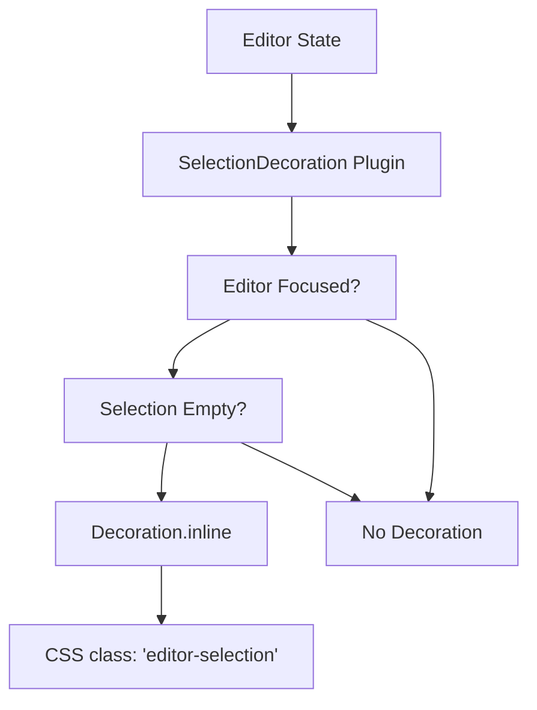
**Sources:** [src/lib/components/common/RichTextInput.svelte598-623](https://github.com/open-webui/open-webui/blob/a7271532/src/lib/components/common/RichTextInput.svelte#L598-L623) [src/app.css68-71](https://github.com/open-webui/open-webui/blob/a7271532/src/app.css#L68-L71)

#### ListItemDragHandle Extension

Enables drag-and-drop reordering of list items with visual feedback:

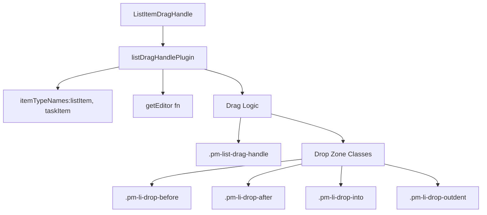
The extension uses ProseMirror plugin architecture to track mouse events and apply decoration classes for visual drop zones.

**Sources:** [src/lib/components/common/RichTextInput.svelte625-637](https://github.com/open-webui/open-webui/blob/a7271532/src/lib/components/common/RichTextInput.svelte#L625-L637) [src/app.css699-806](https://github.com/open-webui/open-webui/blob/a7271532/src/app.css#L699-L806)

#### AIAutocompletion Extension

Provides ghost text suggestions using AI completions:

**Configuration:** [src/lib/components/common/RichTextInput.svelte728-745](https://github.com/open-webui/open-webui/blob/a7271532/src/lib/components/common/RichTextInput.svelte#L728-L745)

The extension calls the provided `generateAutoCompletion` function with current text, displays suggestions as decorations with the `.ai-autocompletion` class, and handles Tab key to accept suggestions.

**Sources:** [src/lib/components/common/RichTextInput.svelte119](https://github.com/open-webui/open-webui/blob/a7271532/src/lib/components/common/RichTextInput.svelte#L119-L119) [src/app.css544-549](https://github.com/open-webui/open-webui/blob/a7271532/src/app.css#L544-L549)

---

## Content Format Conversion

### Markdown to HTML Pipeline

When initializing the editor with Markdown content, the conversion pipeline handles GFM (GitHub Flavored Markdown) with custom extensions:

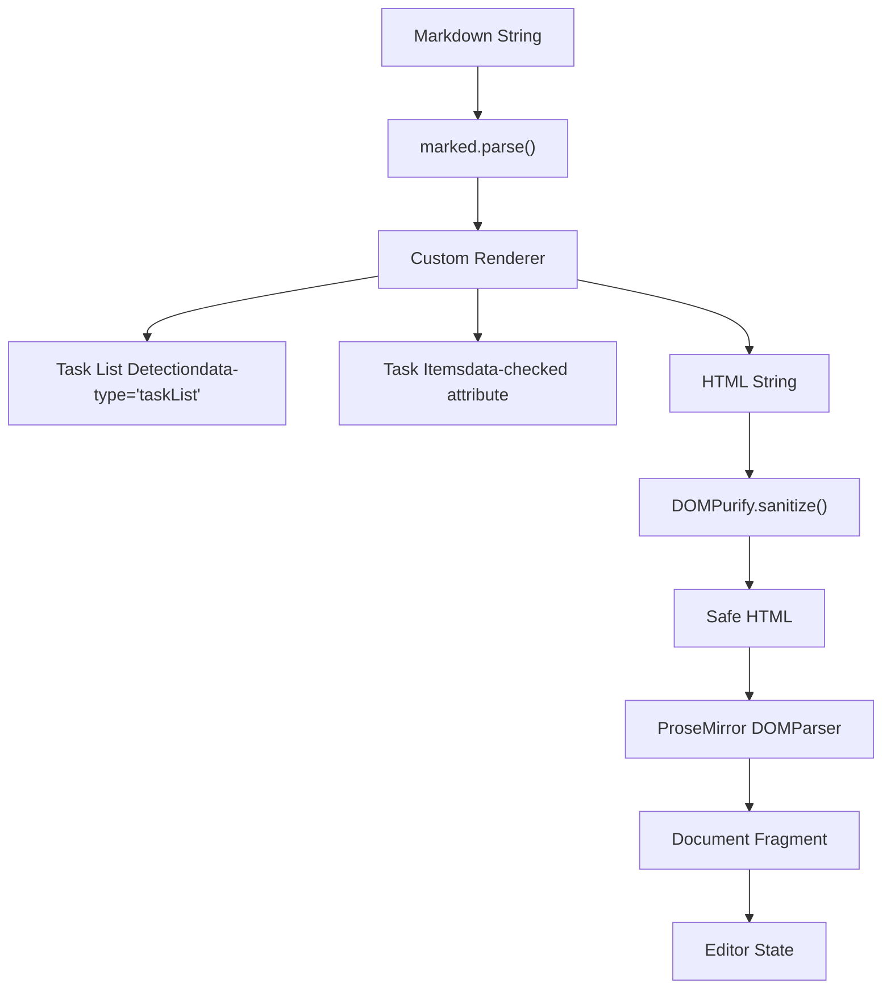
The custom `marked` renderer configuration converts task lists to the format expected by Tiptap's TaskList extension:

**Marked Configuration:** [src/lib/components/common/RichTextInput.svelte5-29](https://github.com/open-webui/open-webui/blob/a7271532/src/lib/components/common/RichTextInput.svelte#L5-L29)

```
marked.use({
  breaks: true,
  gfm: true,
  renderer: {
    list(body, ordered, start) {
      const isTaskList = body.includes('data-checked=');
      if (isTaskList) {
        return `<ul data-type="taskList">${body}</ul>`;
      }
      // ... standard list handling
    },
    listitem(text, task, checked) {
      if (task) {
        const checkedAttr = checked ? 'true' : 'false';
        return `<li data-type="taskItem" data-checked="${checkedAttr}">${text}</li>`;
      }
      return `<li>${text}</li>`;
    }
  }
});
```
**Sources:** [src/lib/components/common/RichTextInput.svelte5-29](https://github.com/open-webui/open-webui/blob/a7271532/src/lib/components/common/RichTextInput.svelte#L5-L29) [src/lib/components/common/RichTextInput.svelte340-372](https://github.com/open-webui/open-webui/blob/a7271532/src/lib/components/common/RichTextInput.svelte#L340-L372)

### HTML to Markdown Pipeline

The reverse conversion uses Turndown with custom rules and the GFM plugin:

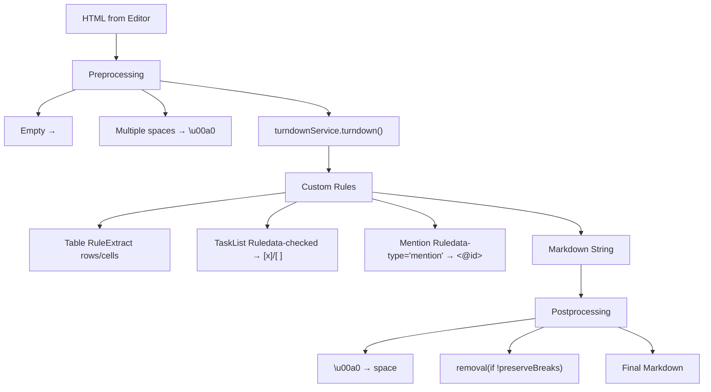
**Turndown Service Configuration:**

1.  **Base Configuration** [src/lib/components/common/RichTextInput.svelte33-40](https://github.com/open-webui/open-webui/blob/a7271532/src/lib/components/common/RichTextInput.svelte#L33-L40):

    -   `codeBlockStyle: 'fenced'` - Use \`\`\` for code blocks
    -   `headingStyle: 'atx'` - Use # for headings
    -   `escape` disabled to preserve special characters
    -   GFM plugin for table/strikethrough support
2.  **Custom Table Rule** [src/lib/components/common/RichTextInput.svelte51-82](https://github.com/open-webui/open-webui/blob/a7271532/src/lib/components/common/RichTextInput.svelte#L51-L82):

    -   Extracts table rows with `querySelectorAll('tr')`
    -   Converts cells to `| cell | cell |` format
    -   Adds separator `| --- | --- |` after first row
    -   Handles multi-sheet tables
3.  **Task List Rule** [src/lib/components/common/RichTextInput.svelte84-94](https://github.com/open-webui/open-webui/blob/a7271532/src/lib/components/common/RichTextInput.svelte#L84-L94):

    -   Detects `data-checked="true"` or `data-checked="false"`
    -   Converts to `- [x]` or `- [ ]` format
4.  **Mention Rule** [src/lib/components/common/RichTextInput.svelte97-106](https://github.com/open-webui/open-webui/blob/a7271532/src/lib/components/common/RichTextInput.svelte#L97-L106):

    -   Detects `<span data-type="mention">`
    -   Extracts `data-id` and `data-mention-suggestion-char`
    -   Converts to `<@id>` format for model mentions

**Conversion Trigger:**

The conversion happens in the `onTransaction` handler every time the document changes:

[src/lib/components/common/RichTextInput.svelte774-832](https://github.com/open-webui/open-webui/blob/a7271532/src/lib/components/common/RichTextInput.svelte#L774-L832)

```
onTransaction: () => {
  htmlValue = editor.getHTML();
  jsonValue = editor.getJSON();

  if (richText) {
    mdValue = turndownService.turndown(htmlValue
      .replace(/<p><\/p>/g, '<br/>')
      .replace(/ {2,}/g, (m) => m.replace(/ /g, '\u00a0'))
    ).replace(/\u00a0/g, ' ');
  }

  onChange({ html: htmlValue, json: jsonValue, md: mdValue });
  value = mdValue; // Two-way binding update
}
```
**Sources:** [src/lib/components/common/RichTextInput.svelte31-106](https://github.com/open-webui/open-webui/blob/a7271532/src/lib/components/common/RichTextInput.svelte#L31-L106) [src/lib/components/common/RichTextInput.svelte774-832](https://github.com/open-webui/open-webui/blob/a7271532/src/lib/components/common/RichTextInput.svelte#L774-L832)

---

## Template Variable System

The editor supports template variables in the format `{{VARIABLE_NAME}}` which can be replaced programmatically:

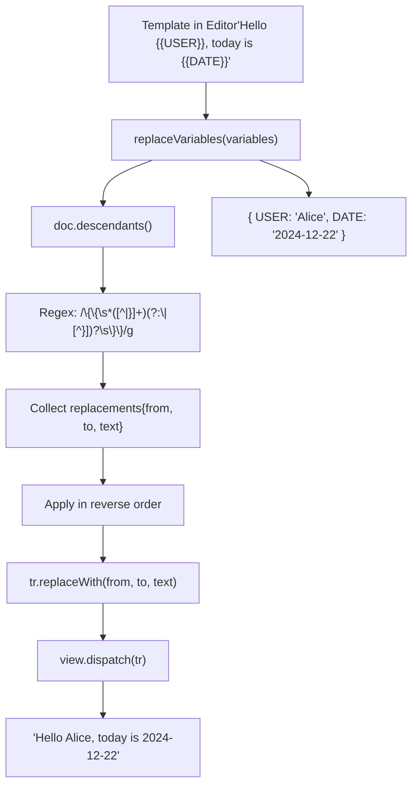
**Implementation:** [src/lib/components/common/RichTextInput.svelte468-509](https://github.com/open-webui/open-webui/blob/a7271532/src/lib/components/common/RichTextInput.svelte#L468-L509)

The `replaceVariables` method:

1.  Traverses all text nodes using `doc.descendants()`
2.  Uses regex to find `{{VAR_NAME}}` or `{{VAR_NAME|default}}` patterns
3.  Collects all replacements with positions
4.  Applies replacements in reverse order to maintain correct positions
5.  Only dispatches transaction if changes were made

**Template Selection:**

The `selectNextTemplate` function [src/lib/components/common/RichTextInput.svelte557-580](https://github.com/open-webui/open-webui/blob/a7271532/src/lib/components/common/RichTextInput.svelte#L557-L580) finds and selects the next template variable, allowing users to Tab through templates. This is triggered by Tab key in message input mode [src/lib/components/common/RichTextInput.svelte905-920](https://github.com/open-webui/open-webui/blob/a7271532/src/lib/components/common/RichTextInput.svelte#L905-L920)

**Sources:** [src/lib/components/common/RichTextInput.svelte468-509](https://github.com/open-webui/open-webui/blob/a7271532/src/lib/components/common/RichTextInput.svelte#L468-L509) [src/lib/components/common/RichTextInput.svelte525-580](https://github.com/open-webui/open-webui/blob/a7271532/src/lib/components/common/RichTextInput.svelte#L525-L580)

---

## UI Menus and Toolbars

### BubbleMenu (Selection Toolbar)

Appears when text is selected, providing formatting options:

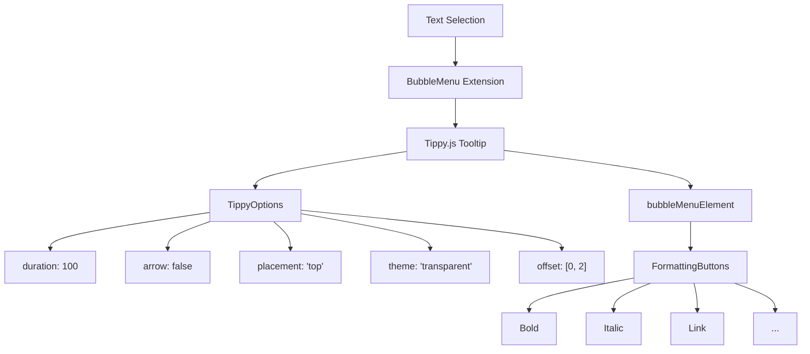
**Configuration:** [src/lib/components/common/RichTextInput.svelte748-757](https://github.com/open-webui/open-webui/blob/a7271532/src/lib/components/common/RichTextInput.svelte#L748-L757)

The BubbleMenu uses Tiptap v2 extension [src/lib/components/common/RichTextInput.svelte125](https://github.com/open-webui/open-webui/blob/a7271532/src/lib/components/common/RichTextInput.svelte#L125-L125) due to styling issues with v3. The menu element is bound to `bubbleMenuElement` and contains the `FormattingButtons` component.

**Sources:** [src/lib/components/common/RichTextInput.svelte125-126](https://github.com/open-webui/open-webui/blob/a7271532/src/lib/components/common/RichTextInput.svelte#L125-L126) [src/lib/components/common/RichTextInput.svelte748-757](https://github.com/open-webui/open-webui/blob/a7271532/src/lib/components/common/RichTextInput.svelte#L748-L757)

### FloatingMenu (Block Toolbar)

Appears on empty lines, providing block-level options:

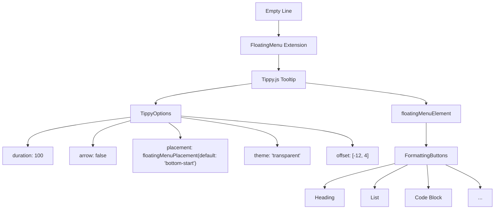
**Configuration:** [src/lib/components/common/RichTextInput.svelte758-767](https://github.com/open-webui/open-webui/blob/a7271532/src/lib/components/common/RichTextInput.svelte#L758-L767)

The `floatingMenuPlacement` prop [src/lib/components/common/RichTextInput.svelte261](https://github.com/open-webui/open-webui/blob/a7271532/src/lib/components/common/RichTextInput.svelte#L261-L261) allows customization of menu position.

**Sources:** [src/lib/components/common/RichTextInput.svelte126](https://github.com/open-webui/open-webui/blob/a7271532/src/lib/components/common/RichTextInput.svelte#L126-L126) [src/lib/components/common/RichTextInput.svelte758-767](https://github.com/open-webui/open-webui/blob/a7271532/src/lib/components/common/RichTextInput.svelte#L758-L767)

### FormattingButtons Component

The `FormattingButtons.svelte` component provides the actual toolbar UI rendered inside both menus. It conditionally shows formatting options based on:

-   Current selection state (e.g., link button only when text selected)
-   Active formatting (highlighting currently active formats)
-   Editor capabilities (e.g., table buttons only when TableKit enabled)

**Sources:** [src/lib/components/common/RichTextInput.svelte141](https://github.com/open-webui/open-webui/blob/a7271532/src/lib/components/common/RichTextInput.svelte#L141-L141)

---

## Collaborative Editing

### Yjs CRDT Integration

When `collaboration={true}`, the editor initializes a `SocketIOCollaborationProvider` that synchronizes the document using Yjs Conflict-free Replicated Data Type:

> **[Mermaid sequence]**
> *(图表结构无法解析)*

**Provider Initialization:** [src/lib/components/common/RichTextInput.svelte679-682](https://github.com/open-webui/open-webui/blob/a7271532/src/lib/components/common/RichTextInput.svelte#L679-L682)

```
if (collaboration && documentId && socket && user) {
  const { SocketIOCollaborationProvider } = await import('./RichTextInput/Collaboration');
  provider = new SocketIOCollaborationProvider(documentId, socket, user, content);
}
```
The provider is then passed to the editor as an extension: [src/lib/components/common/RichTextInput.svelte770](https://github.com/open-webui/open-webui/blob/a7271532/src/lib/components/common/RichTextInput.svelte#L770-L770)

```
...(collaboration && provider ? [provider.getEditorExtension()] : [])
```
### Cursor Presence

Remote user cursors are rendered with color-coded visual indicators:

**CSS Styling:** [src/app.css660-686](https://github.com/open-webui/open-webui/blob/a7271532/src/app.css#L660-L686)

-   `.ProseMirror-yjs-cursor`: The cursor line itself (1px border-left/right)
-   `.ProseMirror-yjs-cursor > div`: Username label above cursor
-   Colors are dynamically assigned per user by the Yjs provider

**Sources:** [src/lib/components/common/RichTextInput.svelte147-148](https://github.com/open-webui/open-webui/blob/a7271532/src/lib/components/common/RichTextInput.svelte#L147-L148) [src/lib/components/common/RichTextInput.svelte679-682](https://github.com/open-webui/open-webui/blob/a7271532/src/lib/components/common/RichTextInput.svelte#L679-L682) [src/lib/components/common/RichTextInput.svelte770](https://github.com/open-webui/open-webui/blob/a7271532/src/lib/components/common/RichTextInput.svelte#L770-L770) [src/app.css660-686](https://github.com/open-webui/open-webui/blob/a7271532/src/app.css#L660-L686)

---

## Programmatic API

### Public Methods

The `RichTextInput` component exposes several methods via `export let`:

| Method | Parameters | Description |
| --- | --- | --- |
| `setText` | `text: string` | Replace entire content with plain text, splitting on `\n` |
| `insertContent` | `content: string` | Insert Markdown content at current selection |
| `replaceVariables` | `variables: object` | Replace `{{VAR}}` templates with values |
| `replaceCommandWithText` | `text: string` | Replace word at cursor (used for prompt insertion) |
| `setContent` | `content: any` | Set editor content (HTML, JSON, or Markdown) |
| `focus` | \- | Focus the editor and scroll to selection |
| `getWordAtDocPos` | \- | Get the word at current cursor position |

**setText Implementation:** [src/lib/components/common/RichTextInput.svelte418-452](https://github.com/open-webui/open-webui/blob/a7271532/src/lib/components/common/RichTextInput.svelte#L418-L452)

Handles multi-line text by creating paragraph nodes:

```
export const setText = (text: string) => {
  if (!editor) return;
  text = text.replaceAll('\n\n', '\n');
  editor.commands.clearContent();

  const { state, view } = editor;
  const { schema, tr } = state;

  if (text.includes('\n')) {
    const lines = text.split('\n');
    const nodes = lines.map((line) =>
      schema.nodes.paragraph.create({}, line ? schema.text(line) : undefined)
    );
    const fragment = Fragment.fromArray(nodes);
    tr.replaceSelectionWith(fragment, false);
    view.dispatch(tr);
  } else if (text === '') {
    editor.commands.clearContent();
  } else {
    const paragraph = schema.nodes.paragraph.create({}, schema.text(text));
    tr.replaceSelectionWith(paragraph, false);
    view.dispatch(tr);
  }

  selectNextTemplate(editor.view.state, editor.view.dispatch);
  focus();
};
```
**replaceCommandWithText Implementation:** [src/lib/components/common/RichTextInput.svelte327-416](https://github.com/open-webui/open-webui/blob/a7271532/src/lib/components/common/RichTextInput.svelte#L327-L416)

Supports two modes:

1.  **Plain text mode:** Replaces word at cursor, handling multi-line with paragraph breaks
2.  **Rich text mode (`insertPromptAsRichText=true`):** Converts Markdown to ProseMirror nodes before insertion

**Sources:** [src/lib/components/common/RichTextInput.svelte288-585](https://github.com/open-webui/open-webui/blob/a7271532/src/lib/components/common/RichTextInput.svelte#L288-L585)

---

## File Handling

### FileHandler Extension

Enables drag-and-drop and paste of files into the editor:

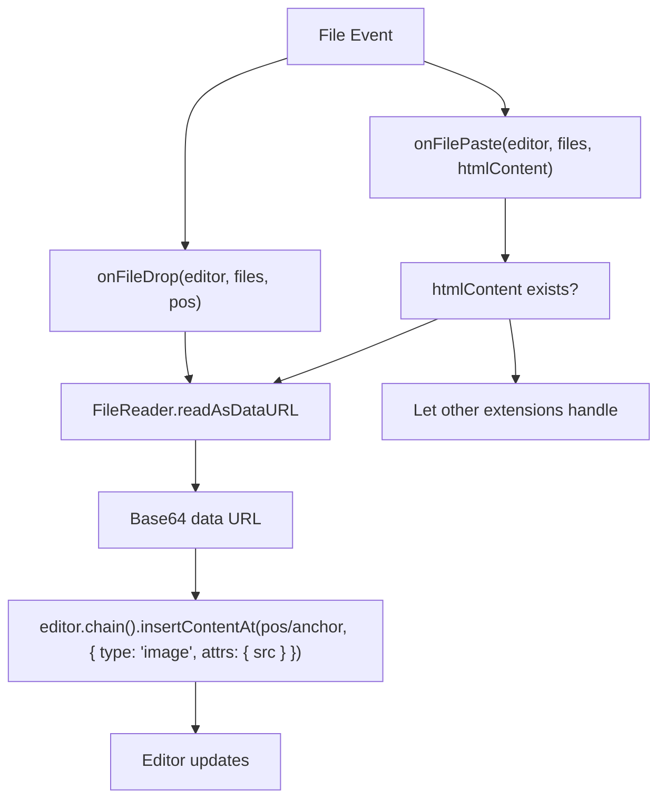
**Default Handlers:** [src/lib/components/common/RichTextInput.svelte194-239](https://github.com/open-webui/open-webui/blob/a7271532/src/lib/components/common/RichTextInput.svelte#L194-L239)

Both `onFileDrop` and `onFilePaste` are configurable props that default to inserting images as base64 data URLs. The parent component can override these to handle file uploads to a server instead.

**Extension Configuration:** [src/lib/components/common/RichTextInput.svelte720-727](https://github.com/open-webui/open-webui/blob/a7271532/src/lib/components/common/RichTextInput.svelte#L720-L727)

```
...(fileHandler
  ? [
      FileHandler.configure({
        onDrop: onFileDrop,
        onPaste: onFilePaste
      })
    ]
  : [])
```
**Sources:** [src/lib/components/common/RichTextInput.svelte194-239](https://github.com/open-webui/open-webui/blob/a7271532/src/lib/components/common/RichTextInput.svelte#L194-L239) [src/lib/components/common/RichTextInput.svelte720-727](https://github.com/open-webui/open-webui/blob/a7271532/src/lib/components/common/RichTextInput.svelte#L720-L727)

---

## Special Input Modes

### Message Input Mode

When `messageInput={true}`, the editor enables special keyboard handling for chat:

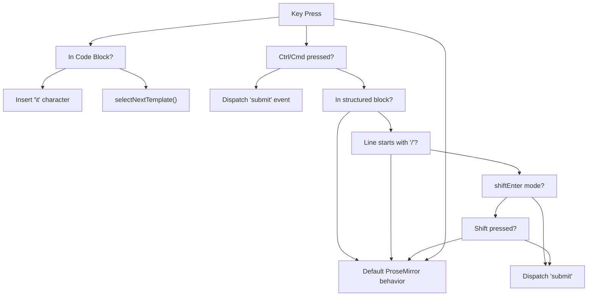
**Implementation:** [src/lib/components/common/RichTextInput.svelte886-996](https://github.com/open-webui/open-webui/blob/a7271532/src/lib/components/common/RichTextInput.svelte#L886-L996)

Key handling logic:

1.  **Tab key:** Select next template variable, or insert tab in code blocks
2.  **Enter key:**
    -   With Ctrl/Cmd: Always submit
    -   Without Ctrl/Cmd: Submit if not in code/list AND not a command line
    -   Respects `shiftEnter` prop to require Shift for line breaks
3.  **Slash commands:** Lines starting with `/` are never submitted on plain Enter

**Sources:** [src/lib/components/common/RichTextInput.svelte886-996](https://github.com/open-webui/open-webui/blob/a7271532/src/lib/components/common/RichTextInput.svelte#L886-L996)

### Large Text Handling

When `largeTextAsFile={true}`, pasted text exceeding `PASTED_TEXT_CHARACTER_LIMIT` is converted to a file:

[src/lib/components/common/RichTextInput.svelte143](https://github.com/open-webui/open-webui/blob/a7271532/src/lib/components/common/RichTextInput.svelte#L143-L143)

This feature dispatches a `paste-large-text` event with the text content, allowing the parent component to handle it as a file upload rather than inserting directly into the editor.

**Sources:** [src/lib/components/common/RichTextInput.svelte258-259](https://github.com/open-webui/open-webui/blob/a7271532/src/lib/components/common/RichTextInput.svelte#L258-L259)

---

## Styling and CSS

### Prose Classes

The editor uses Tailwind Typography plugin with custom prose classes:

| Class | Purpose | Source |
| --- | --- | --- |
| `.input-prose` | Full-featured prose styling for rich text | [src/app.css97-99](https://github.com/open-webui/open-webui/blob/a7271532/src/app.css#L97-L99) |
| `.input-prose-sm` | Smaller text variant | [src/app.css101-103](https://github.com/open-webui/open-webui/blob/a7271532/src/app.css#L101-L103) |
| `.ProseMirror` | Editor container styling | [src/app.css360-366](https://github.com/open-webui/open-webui/blob/a7271532/src/app.css#L360-L366) |
| `.tiptap` | Content area styling | [src/app.css379-575](https://github.com/open-webui/open-webui/blob/a7271532/src/app.css#L379-L575) |

### Task List Styling

Task lists receive special nested structure styling:

[src/app.css379-443](https://github.com/open-webui/open-webui/blob/a7271532/src/app.css#L379-L443) [src/app.css472-536](https://github.com/open-webui/open-webui/blob/a7271532/src/app.css#L472-L536)

```
.tiptap ul[data-type='taskList'] {
  list-style: none;
  margin-left: 0;
  padding: 0;

  li {
    align-items: start;
    display: flex;

    > label {
      flex: 0 0 auto;
      margin-right: 0.5rem;
      margin-top: 0.2rem;
    }

    > div {
      flex: 1 1 auto;
    }
  }

  li[data-checked='true'] > div {
    opacity: 0.5;
    text-decoration: line-through;
  }
}
```
### Table Styling

Tables receive GitHub-flavored markdown styling:

[src/app.css629-653](https://github.com/open-webui/open-webui/blob/a7271532/src/app.css#L629-L653)

```
.tiptap table {
  @apply w-full text-sm text-left text-gray-500 dark:text-gray-400;
}

.tiptap thead {
  @apply text-xs text-gray-700 uppercase bg-gray-50 dark:bg-gray-850;
}

.tiptap th, .tiptap td {
  @apply px-3 py-1.5 border border-gray-100/30 dark:border-gray-850/30;
}
```
### Code Block Styling

Code blocks use the lowlight syntax highlighter with custom colors:

[src/app.css551-627](https://github.com/open-webui/open-webui/blob/a7271532/src/app.css#L551-L627)

Syntax highlighting classes (`.hljs-*`) are defined for comments, variables, strings, keywords, etc., providing consistent code presentation across themes.

**Sources:** [src/app.css97-809](https://github.com/open-webui/open-webui/blob/a7271532/src/app.css#L97-L809)

---

## Configuration Summary

### Required Props for Common Use Cases

**Basic Rich Text Editor:**

```
<RichTextInput bind:value richText={true} />
```
**Chat Message Input:**

```
<RichTextInput
  bind:value
  messageInput={true}
  shiftEnter={true}
  autocomplete={true}
  generateAutoCompletion={aiCompletionFn}
  suggestions={mentionSuggestions}
  fileHandler={true}
  onFileDrop={handleFileDrop}
/>
```
**Collaborative Note Editor:**

```
<RichTextInput
  bind:value
  richText={true}
  collaboration={true}
  documentId={noteId}
  socket={socketClient}
  user={currentUser}
  dragHandle={true}
  image={true}
/>
```
**Plain Text Input (Markdown mode with no formatting):**

```
<RichTextInput
  bind:value
  richText={false}
  showFormattingToolbar={false}
/>
```
**Sources:** [src/lib/components/common/RichTextInput.svelte164-261](https://github.com/open-webui/open-webui/blob/a7271532/src/lib/components/common/RichTextInput.svelte#L164-L261)
