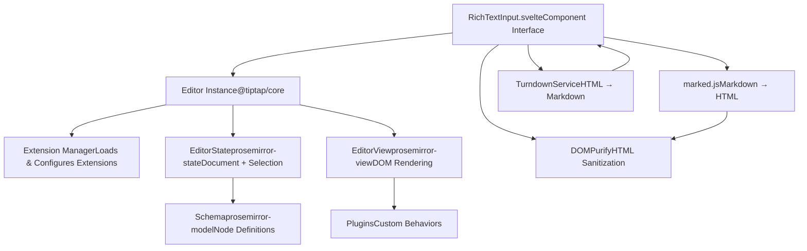
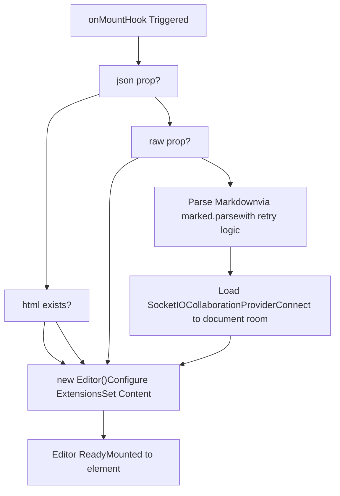
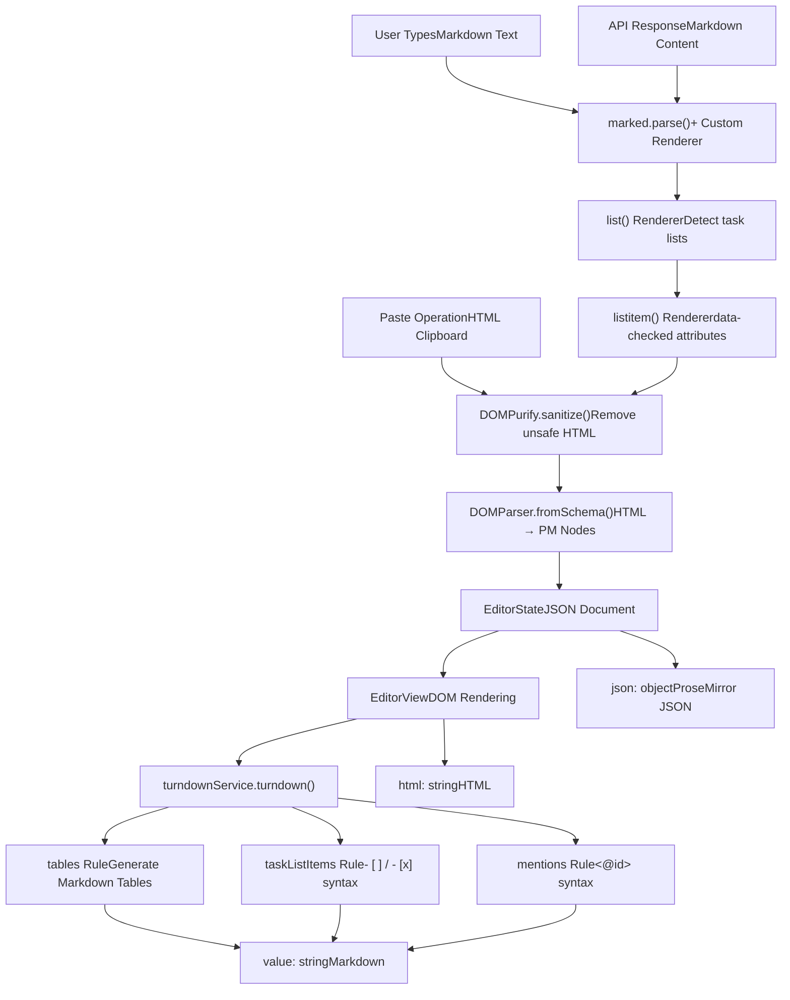
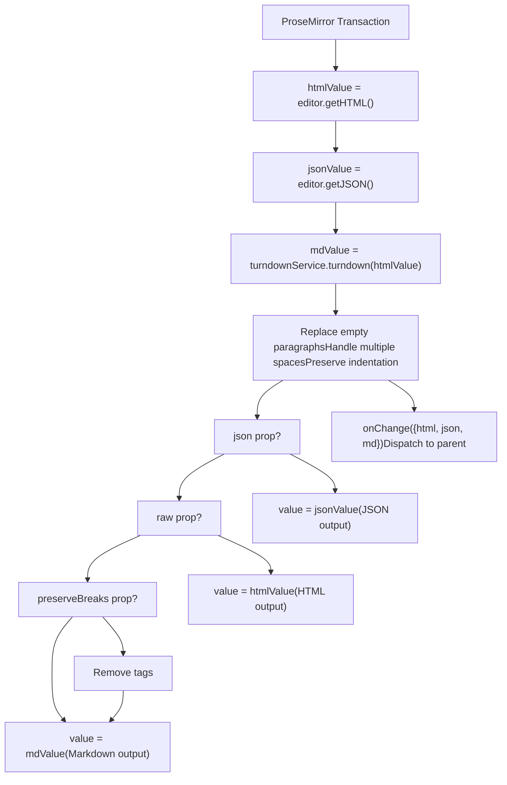
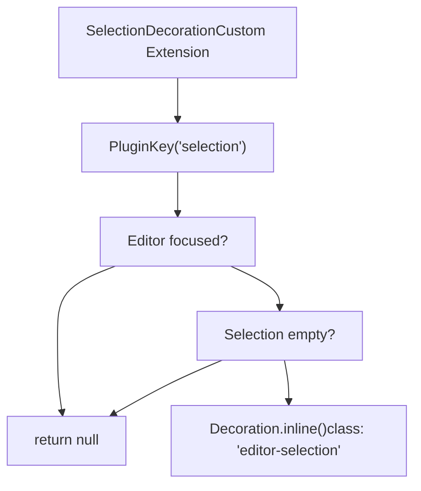
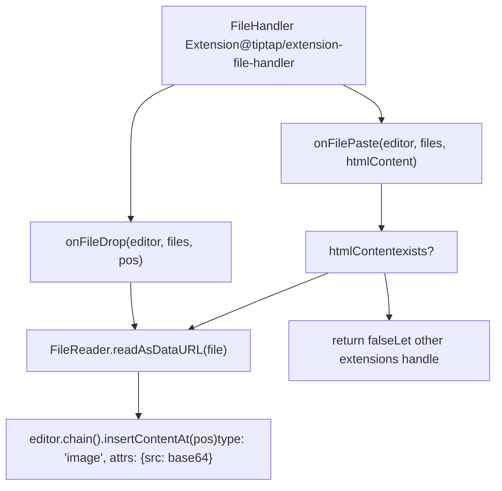
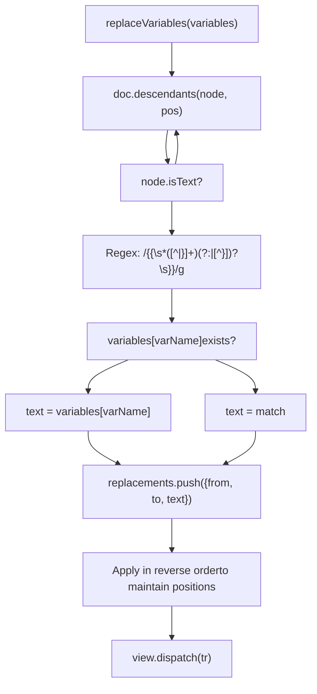
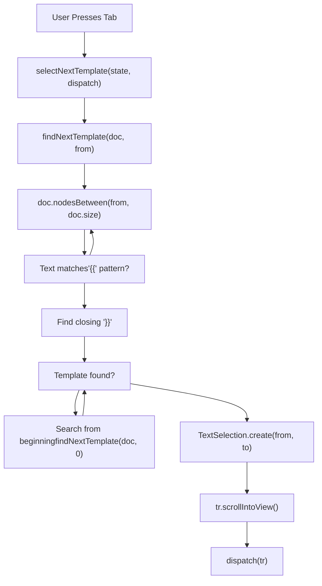
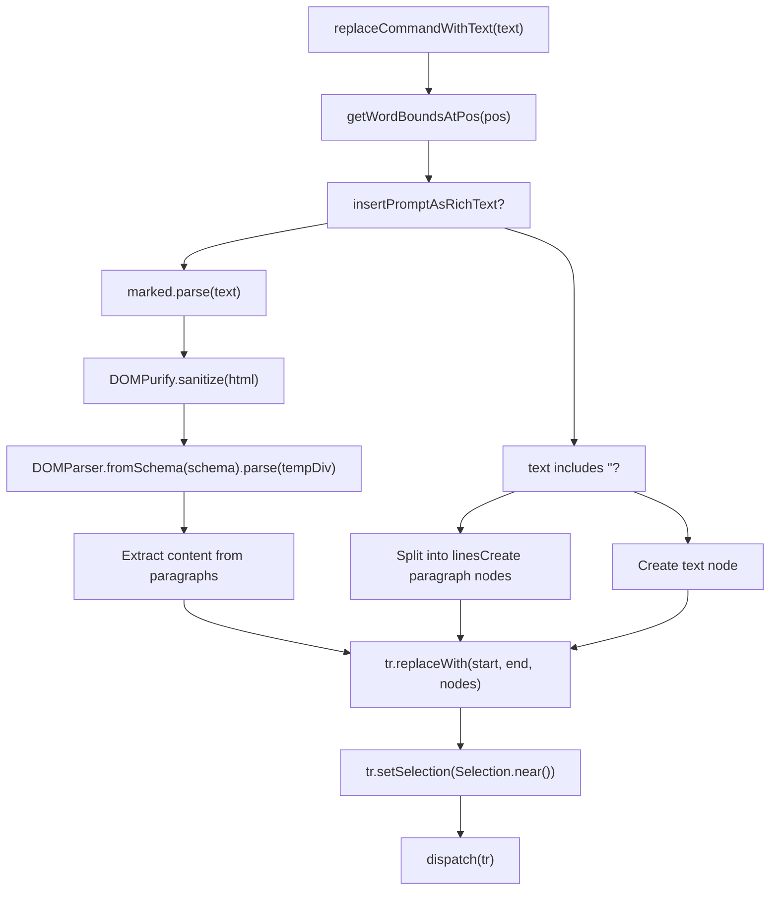

# Tiptap Editor Architecture

Relevant source files

-   [CHANGELOG.md](https://github.com/open-webui/open-webui/blob/a7271532/CHANGELOG.md)
-   [package-lock.json](https://github.com/open-webui/open-webui/blob/a7271532/package-lock.json)
-   [package.json](https://github.com/open-webui/open-webui/blob/a7271532/package.json)
-   [src/app.css](https://github.com/open-webui/open-webui/blob/a7271532/src/app.css)
-   [src/lib/components/ChangelogModal.svelte](https://github.com/open-webui/open-webui/blob/a7271532/src/lib/components/ChangelogModal.svelte)
-   [src/lib/components/common/RichTextInput.svelte](https://github.com/open-webui/open-webui/blob/a7271532/src/lib/components/common/RichTextInput.svelte)
-   [src/lib/components/icons/XMark.svelte](https://github.com/open-webui/open-webui/blob/a7271532/src/lib/components/icons/XMark.svelte)

## Purpose and Scope

This page documents the architecture of the Tiptap-based rich text editor component (`RichTextInput.svelte`) used throughout Open WebUI for message composition, note editing, and other text input scenarios. The editor provides WYSIWYG editing capabilities, real-time collaboration, Markdown/HTML bidirectional conversion, and extensive customization through a modular extension system.

For information about how the editor is used in the message input system, see [Message Input System](/open-webui/open-webui/4.2-message-input-system). For details on collaborative editing implementation, see [Collaborative Editing](/open-webui/open-webui/9.3-collaborative-editing). For content format conversion specifics, see [Content Format Conversion](/open-webui/open-webui/9.2-content-format-conversion).

---

## Editor Core Architecture

The `RichTextInput` component is built on [Tiptap v3](https://tiptap.dev/), which itself is a framework wrapper around [ProseMirror](https://prosemirror.net/), a modular rich text editor toolkit. The architecture consists of four primary layers:


**Sources:** [src/lib/components/common/RichTextInput.svelte1-184](https://github.com/open-webui/open-webui/blob/a7271532/src/lib/components/common/RichTextInput.svelte#L1-L184) [package.json67-84](https://github.com/open-webui/open-webui/blob/a7271532/package.json#L67-L84)

### Editor Initialization

The editor is instantiated in the `onMount` lifecycle hook with conditional content loading based on the `json`, `raw`, and `collaboration` props:


The editor initialization sequence at [src/lib/components/common/RichTextInput.svelte639-773](https://github.com/open-webui/open-webui/blob/a7271532/src/lib/components/common/RichTextInput.svelte#L639-L773) demonstrates conditional content preparation and extension loading. The `tryParse` function at [src/lib/components/common/RichTextInput.svelte657-672](https://github.com/open-webui/open-webui/blob/a7271532/src/lib/components/common/RichTextInput.svelte#L657-L672) implements retry logic for Markdown parsing to handle race conditions during initial render.

**Sources:** [src/lib/components/common/RichTextInput.svelte639-773](https://github.com/open-webui/open-webui/blob/a7271532/src/lib/components/common/RichTextInput.svelte#L639-L773)

---

## Extension System

Tiptap's extension system provides modular functionality through a composable plugin architecture. The editor loads extensions conditionally based on props, enabling different feature sets for different use cases (message input vs. note editing vs. temporary chat).

### Extension Loading Pipeline

```mermaid
flowchart TD
    StarterKit["StarterKitBasic FormattingParagraph, Bold, Italic, etc."]
    Placeholder["PlaceholderEmpty State Text"]
    CharacterCount["CharacterCountCharacter Statistics"]
    SelectionDecoration["SelectionDecorationCustom ExtensionVisual Selection Highlight"]
    CodeBlockLowlight["CodeBlockLowlightSyntax Highlightinglowlight + highlight.js"]
    Typography["TypographySmart Quotes, Dashes"]
    TableKit["TableKitResizable Tables"]
    ListKit["ListKitTask Lists + Nesting"]
    BubbleMenu["BubbleMenuText Selection Toolbar"]
    FloatingMenu["FloatingMenuBlock Insertion Menu"]
    Mention["Mention@Model Suggestions"]
    Image["ImageCustom Image Extension"]
    FileHandler["FileHandlerDrag & Drop Files"]
    AIAutocompletion["AIAutocompletionCustom ExtensionGhost Text Suggestions"]
    ListItemDragHandle["ListItemDragHandleCustom ExtensionReorder List Items"]
    CollabExtension["Collaboration Extensionprovider.getEditorExtension()"]
    Editor["Editor Instance"]

    StarterKit --> Editor
    Placeholder --> Editor
    CharacterCount --> Editor
    SelectionDecoration --> Editor
    CodeBlockLowlight --> Editor
    Typography --> Editor
    TableKit --> Editor
    ListKit --> Editor
    BubbleMenu --> Editor
    FloatingMenu --> Editor
    Mention --> Editor
    Image --> Editor
    FileHandler --> Editor
    AIAutocompletion --> Editor
    ListItemDragHandle --> Editor
    CollabExtension --> Editor
```


**Sources:** [src/lib/components/common/RichTextInput.svelte685-770](https://github.com/open-webui/open-webui/blob/a7271532/src/lib/components/common/RichTextInput.svelte#L685-L770)

### Extension Configuration Matrix

| Extension | Package | Prop Requirement | Configuration |
| --- | --- | --- | --- |
| `StarterKit` | `@tiptap/starter-kit` | Always loaded | `link: link` prop |
| `Placeholder` | `@tiptap/extensions` | Always loaded | `placeholder: () => _placeholder, showOnlyWhenEditable: false` |
| `CharacterCount` | `@tiptap/extensions` | Always loaded | Empty config `{}` |
| `SelectionDecoration` | Custom | Always loaded | No config |
| `CodeBlockLowlight` | `@tiptap/extension-code-block-lowlight` | `richText=true` | `lowlight` instance with all languages |
| `Typography` | `@tiptap/extension-typography` | `richText=true` | Default config |
| `TableKit` | `@tiptap/extension-table` | `richText=true` | `table: { resizable: true }` |
| `ListKit` | `@tiptap/extension-list` | `richText=true` | `taskItem: { nested: true }` |
| `BubbleMenu` | `@tiptap/extension-bubble-menu` | `richText=true && showFormattingToolbar=true` | Tippy options with custom element |
| `FloatingMenu` | `@tiptap/extension-floating-menu` | `richText=true && showFormattingToolbar=true` | Tippy options with custom element |
| `Mention` | `@tiptap/extension-mention` | `suggestions != null` | `HTMLAttributes, suggestions` callback |
| `Image` | Custom | `image=true` | No config |
| `FileHandler` | `@tiptap/extension-file-handler` | `fileHandler=true` | `onDrop, onPaste` callbacks |
| `AIAutocompletion` | Custom | `autocomplete=true` | `generateCompletion` async function |
| `ListItemDragHandle` | Custom | `dragHandle=true` | No config |
| Collaboration | via provider | `collaboration=true && provider != null` | Yjs integration |

**Sources:** [src/lib/components/common/RichTextInput.svelte685-770](https://github.com/open-webui/open-webui/blob/a7271532/src/lib/components/common/RichTextInput.svelte#L685-L770) [package.json67-84](https://github.com/open-webui/open-webui/blob/a7271532/package.json#L67-L84)

### Core Extensions Detail

#### StarterKit

The `StarterKit` extension at [src/lib/components/common/RichTextInput.svelte686-688](https://github.com/open-webui/open-webui/blob/a7271532/src/lib/components/common/RichTextInput.svelte#L686-L688) bundles fundamental editing capabilities:

-   **Document structure**: `Document`, `Paragraph`, `Text`, `Heading` (h1-h6)
-   **Formatting marks**: `Bold`, `Italic`, `Strike`, `Code`
-   **Lists**: `BulletList`, `OrderedList`, `ListItem`
-   **Block elements**: `Blockquote`, `CodeBlock`, `HorizontalRule`, `HardBreak`
-   **History**: `History` (undo/redo with Ctrl+Z/Ctrl+Shift+Z)
-   **Dropcursor**: Visual cursor for drag-and-drop operations

#### TableKit Configuration

At [src/lib/components/common/RichTextInput.svelte699-701](https://github.com/open-webui/open-webui/blob/a7271532/src/lib/components/common/RichTextInput.svelte#L699-L701) `TableKit` is configured with `resizable: true`, enabling column width adjustment via drag handles. The table rendering styles are defined in [src/app.css629-653](https://github.com/open-webui/open-webui/blob/a7271532/src/app.css#L629-L653) with Tailwind classes for borders, padding, and responsive behavior.

#### ListKit with Task Lists

The `ListKit` configuration at [src/lib/components/common/RichTextInput.svelte702-706](https://github.com/open-webui/open-webui/blob/a7271532/src/lib/components/common/RichTextInput.svelte#L702-L706) enables nested task lists (`nested: true`). Task list items render with checkboxes and support `data-checked="true"` attributes. The CSS styling at [src/app.css379-443](https://github.com/open-webui/open-webui/blob/a7271532/src/app.css#L379-L443) handles checkbox rendering, strikethrough for completed tasks, and nested list indentation.

**Sources:** [src/lib/components/common/RichTextInput.svelte686-706](https://github.com/open-webui/open-webui/blob/a7271532/src/lib/components/common/RichTextInput.svelte#L686-L706) [src/app.css379-653](https://github.com/open-webui/open-webui/blob/a7271532/src/app.css#L379-L653)

---

## Content Format Conversion

The editor operates in three content formats: **Markdown** (user-facing), **HTML** (internal representation), and **JSON** (ProseMirror document structure). Bidirectional conversion is handled by `marked.js` (Markdown → HTML) and `TurndownService` (HTML → Markdown).

### Conversion Pipeline Architecture


**Sources:** [src/lib/components/common/RichTextInput.svelte1-833](https://github.com/open-webui/open-webui/blob/a7271532/src/lib/components/common/RichTextInput.svelte#L1-L833)

### Marked.js Custom Renderer

The `marked` configuration at [src/lib/components/common/RichTextInput.svelte5-29](https://github.com/open-webui/open-webui/blob/a7271532/src/lib/components/common/RichTextInput.svelte#L5-L29) includes custom renderers for task lists:

```
marked.use({
  breaks: true,
  gfm: true,
  renderer: {
    list(body, ordered, start) {
      const isTaskList = body.includes('data-checked=');
      if (isTaskList) {
        return `<ul data-type="taskList">${body}</ul>`;
      }
      // Standard list rendering
    },
    listitem(text, task, checked) {
      if (task) {
        const checkedAttr = checked ? 'true' : 'false';
        return `<li data-type="taskItem" data-checked="${checkedAttr}">${text}</li>`;
      }
      return `<li>${text}</li>`;
    }
  }
});
```
This converts Markdown task list syntax (`- [ ]` and `- [x]`) into HTML with `data-type` and `data-checked` attributes that ProseMirror's `ListKit` extension recognizes.

**Sources:** [src/lib/components/common/RichTextInput.svelte5-29](https://github.com/open-webui/open-webui/blob/a7271532/src/lib/components/common/RichTextInput.svelte#L5-L29)

### TurndownService Custom Rules

The `TurndownService` initialization at [src/lib/components/common/RichTextInput.svelte31-106](https://github.com/open-webui/open-webui/blob/a7271532/src/lib/components/common/RichTextInput.svelte#L31-L106) includes several custom rules:

#### Table Conversion Rule

At [src/lib/components/common/RichTextInput.svelte51-82](https://github.com/open-webui/open-webui/blob/a7271532/src/lib/components/common/RichTextInput.svelte#L51-L82) the `tables` rule generates GitHub Flavored Markdown tables:

```
turndownService.addRule('tables', {
  filter: 'table',
  replacement: function (content, node) {
    const rows = Array.from(node.querySelectorAll('tr'));
    let markdown = '\n';
    rows.forEach((row, rowIndex) => {
      const cells = Array.from(row.querySelectorAll('th, td'));
      const cellContents = cells.map((cell) => {
        let cellContent = turndownService.turndown(cell.innerHTML).trim();
        cellContent = cellContent.replace(/^\n+|\n+$/g, '');
        return cellContent;
      });
      markdown += '| ' + cellContents.join(' | ') + ' |\n';
      if (rowIndex === 0) {
        const separator = cells.map(() => '---').join(' | ');
        markdown += '| ' + separator + ' |\n';
      }
    });
    return markdown + '\n';
  }
});
```
This rule extracts table rows, converts each cell to Markdown, and adds the separator row after the header.

#### Task List Conversion Rule

At [src/lib/components/common/RichTextInput.svelte84-94](https://github.com/open-webui/open-webui/blob/a7271532/src/lib/components/common/RichTextInput.svelte#L84-L94) the `taskListItems` rule converts task list HTML back to Markdown:

```
turndownService.addRule('taskListItems', {
  filter: (node) =>
    node.nodeName === 'LI' &&
    (node.getAttribute('data-checked') === 'true' ||
      node.getAttribute('data-checked') === 'false'),
  replacement: function (content, node) {
    const checked = node.getAttribute('data-checked') === 'true';
    content = content.replace(/^\s+/, '');
    return `- [${checked ? 'x' : ' '}] ${content}\n`;
  }
});
```
#### Mention Conversion Rule

At [src/lib/components/common/RichTextInput.svelte97-106](https://github.com/open-webui/open-webui/blob/a7271532/src/lib/components/common/RichTextInput.svelte#L97-L106) the `mentions` rule converts Tiptap mention spans to the `<@id>` syntax used for model mentions:

```
turndownService.addRule('mentions', {
  filter: (node) => node.nodeName === 'SPAN' && node.getAttribute('data-type') === 'mention',
  replacement: (_content, node: HTMLElement) => {
    const id = node.getAttribute('data-id') || '';
    const ch = node.getAttribute('data-mention-suggestion-char') || '@';
    return `<${ch}${id}>`;
  }
});
```
This allows model mentions like `@llama3.2:latest` to be stored as Markdown but render with special styling in the editor.

**Sources:** [src/lib/components/common/RichTextInput.svelte31-106](https://github.com/open-webui/open-webui/blob/a7271532/src/lib/components/common/RichTextInput.svelte#L31-L106)

### Transaction Hook: Content Sync

The `onTransaction` hook at [src/lib/components/common/RichTextInput.svelte774-833](https://github.com/open-webui/open-webui/blob/a7271532/src/lib/components/common/RichTextInput.svelte#L774-L833) runs after every editor change and synchronizes content between formats:


This architecture ensures that the `value` prop is always synchronized with the editor's internal state, and parent components receive all three formats via the `onChange` callback.

**Sources:** [src/lib/components/common/RichTextInput.svelte774-833](https://github.com/open-webui/open-webui/blob/a7271532/src/lib/components/common/RichTextInput.svelte#L774-L833)

---

## Custom Extensions

The editor includes three custom-built extensions that extend Tiptap's functionality beyond the built-in extensions.

### SelectionDecoration Extension

The `SelectionDecoration` extension at [src/lib/components/common/RichTextInput.svelte598-623](https://github.com/open-webui/open-webui/blob/a7271532/src/lib/components/common/RichTextInput.svelte#L598-L623) adds visual highlighting for text selections when the editor is unfocused:


The `.editor-selection` CSS class at [src/app.css68-71](https://github.com/open-webui/open-webui/blob/a7271532/src/app.css#L68-L71) applies a blue semi-transparent background to selected text when the editor loses focus, improving visual feedback during multi-component interactions.

**Sources:** [src/lib/components/common/RichTextInput.svelte598-623](https://github.com/open-webui/open-webui/blob/a7271532/src/lib/components/common/RichTextInput.svelte#L598-L623) [src/app.css68-71](https://github.com/open-webui/open-webui/blob/a7271532/src/app.css#L68-L71)

### AIAutocompletion Extension

The `AIAutocompletion` extension at [src/lib/components/common/RichTextInput.svelte729-744](https://github.com/open-webui/open-webui/blob/a7271532/src/lib/components/common/RichTextInput.svelte#L729-L744) provides ghost text suggestions similar to GitHub Copilot. It's imported from a separate file and configured with a `generateCompletion` async function:

```
AIAutocompletion.configure({
  generateCompletion: async (text) => {
    if (text.trim().length === 0) return null;
    const suggestion = await generateAutoCompletion(text).catch(() => null);
    if (!suggestion || suggestion.trim().length === 0) return null;
    return suggestion;
  }
})
```
The extension tracks cursor position and current text context, requests completions from the parent component's `generateAutoCompletion` prop, and renders suggestions as gray ghost text via the `.ai-autocompletion::after` CSS rule at [src/app.css544-549](https://github.com/open-webui/open-webui/blob/a7271532/src/app.css#L544-L549)

**Sources:** [src/lib/components/common/RichTextInput.svelte119-744](https://github.com/open-webui/open-webui/blob/a7271532/src/lib/components/common/RichTextInput.svelte#L119-L744) [src/app.css544-549](https://github.com/open-webui/open-webui/blob/a7271532/src/app.css#L544-L549)

### ListItemDragHandle Extension

The `ListItemDragHandle` extension at [src/lib/components/common/RichTextInput.svelte627-637](https://github.com/open-webui/open-webui/blob/a7271532/src/lib/components/common/RichTextInput.svelte#L627-L637) adds drag handles to list items and task items, enabling drag-and-drop reordering:

```
const ListItemDragHandle = Extension.create({
  name: 'listItemDragHandle',
  addProseMirrorPlugins() {
    return [
      listDragHandlePlugin({
        itemTypeNames: ['listItem', 'taskItem'],
        getEditor: () => this.editor
      })
    ];
  }
});
```
The plugin is implemented in a separate file and adds:

-   Visual drag handles that appear on hover (`.pm-list-drag-handle` at [src/app.css699-741](https://github.com/open-webui/open-webui/blob/a7271532/src/app.css#L699-L741))
-   Drop target indicators (`.pm-li-drop-before`, `.pm-li-drop-after`, `.pm-li-drop-into` at [src/app.css749-805](https://github.com/open-webui/open-webui/blob/a7271532/src/app.css#L749-L805))
-   Transaction logic for reordering nodes in the ProseMirror document

**Sources:** [src/lib/components/common/RichTextInput.svelte625-637](https://github.com/open-webui/open-webui/blob/a7271532/src/lib/components/common/RichTextInput.svelte#L625-L637) [src/app.css699-805](https://github.com/open-webui/open-webui/blob/a7271532/src/app.css#L699-L805)

---

## File Handling System

The editor supports file uploads via drag-and-drop and paste operations through the `FileHandler` extension and custom callbacks.

### File Handler Configuration


The `onFileDrop` callback at [src/lib/components/common/RichTextInput.svelte194-212](https://github.com/open-webui/open-webui/blob/a7271532/src/lib/components/common/RichTextInput.svelte#L194-L212) reads each dropped file as a base64 data URL and inserts it as an image node at the drop position. The `onFilePaste` callback at [src/lib/components/common/RichTextInput.svelte214-239](https://github.com/open-webui/open-webui/blob/a7271532/src/lib/components/common/RichTextInput.svelte#L214-L239) follows a similar pattern but checks for HTML content first to avoid interfering with rich text paste operations.

Both callbacks are exported props, allowing parent components to override the default behavior for custom file processing workflows (e.g., uploading to a server before insertion).

**Sources:** [src/lib/components/common/RichTextInput.svelte194-727](https://github.com/open-webui/open-webui/blob/a7271532/src/lib/components/common/RichTextInput.svelte#L194-L727)

---

## Variable Substitution System

The editor includes a variable substitution system for template strings like `{{CLIPBOARD}}`, `{{CURRENT_DATE}}`, and custom variables. The `replaceVariables` function at [src/lib/components/common/RichTextInput.svelte468-509](https://github.com/open-webui/open-webui/blob/a7271532/src/lib/components/common/RichTextInput.svelte#L468-L509) traverses the ProseMirror document tree and replaces matched patterns:


The function collects all replacements first, then applies them in reverse order to prevent position conflicts when text lengths change. This approach is more efficient than applying replacements during traversal, which would require recalculating positions after each change.

The regex pattern `{{VARNAME|defaultValue}}` supports optional default values separated by `|`, though only the variable name is used for lookup in the current implementation.

**Sources:** [src/lib/components/common/RichTextInput.svelte468-509](https://github.com/open-webui/open-webui/blob/a7271532/src/lib/components/common/RichTextInput.svelte#L468-L509)

---

## Template Navigation System

The editor includes a template navigation feature that allows users to jump between variable placeholders using the Tab key. This is particularly useful for prompt templates with multiple fillable fields.

### Template Selection Architecture


The `findNextTemplate` function at [src/lib/components/common/RichTextInput.svelte525-554](https://github.com/open-webui/open-webui/blob/a7271532/src/lib/components/common/RichTextInput.svelte#L525-L554) searches for template patterns starting from the current cursor position. If no template is found, it wraps around to search from the document start. The `selectNextTemplate` function at [src/lib/components/common/RichTextInput.svelte557-580](https://github.com/open-webui/open-webui/blob/a7271532/src/lib/components/common/RichTextInput.svelte#L557-L580) creates a text selection spanning the template and scrolls it into view.

This feature is integrated into the keydown handler at [src/lib/components/common/RichTextInput.svelte905-920](https://github.com/open-webui/open-webui/blob/a7271532/src/lib/components/common/RichTextInput.svelte#L905-L920) and only activates when the cursor is not inside a code block.

**Sources:** [src/lib/components/common/RichTextInput.svelte525-930](https://github.com/open-webui/open-webui/blob/a7271532/src/lib/components/common/RichTextInput.svelte#L525-L930)

---

## Message Input Integration

When used as a message input (`messageInput=true`), the editor includes special keyboard handling for Enter and Tab keys:

### Enter Key Behavior

| Condition | Behavior |
| --- | --- |
| Inside code block | Insert newline (default ProseMirror behavior) |
| Inside list (ordered/bullet) | Create new list item or exit list (default) |
| Inside task list | Create new task item (default) |
| `shiftEnter=true` + Shift+Enter | Insert newline (prevent submission) |
| `shiftEnter=true` + Enter | Submit form (dispatch 'submit' event) |
| `shiftEnter=false` + Ctrl/Cmd+Enter | Submit form |
| `shiftEnter=false` + Enter in empty line | Submit form |

The logic at [src/lib/components/common/RichTextInput.svelte923-961](https://github.com/open-webui/open-webui/blob/a7271532/src/lib/components/common/RichTextInput.svelte#L923-L961) checks the node type hierarchy to determine context and dispatches appropriate events to the parent component.

### Tab Key Behavior

| Condition | Behavior |
| --- | --- |
| Inside code block | Insert tab character `\t` |
| Template exists in document | Select next template |
| No template | Default browser/editor behavior |

**Sources:** [src/lib/components/common/RichTextInput.svelte885-961](https://github.com/open-webui/open-webui/blob/a7271532/src/lib/components/common/RichTextInput.svelte#L885-L961)

---

## Text Manipulation API

The component exposes several public methods for programmatic content manipulation:

### `setText(text: string)`

At [src/lib/components/common/RichTextInput.svelte418-452](https://github.com/open-webui/open-webui/blob/a7271532/src/lib/components/common/RichTextInput.svelte#L418-L452) `setText` replaces the entire editor content with plain text, splitting on newlines to create paragraph nodes:

```
export const setText = (text: string) => {
  if (!editor) return;
  text = text.replaceAll('\n\n', '\n');
  editor.commands.clearContent();

  const { state, view } = editor;
  const { schema, tr } = state;

  if (text.includes('\n')) {
    const lines = text.split('\n');
    const nodes = lines.map((line) =>
      schema.nodes.paragraph.create({}, line ? schema.text(line) : undefined)
    );
    const fragment = Fragment.fromArray(nodes);
    tr.replaceSelectionWith(fragment, false);
    view.dispatch(tr);
  } else if (text === '') {
    editor.commands.clearContent();
  } else {
    const paragraph = schema.nodes.paragraph.create({}, schema.text(text));
    tr.replaceSelectionWith(paragraph, false);
    view.dispatch(tr);
  }

  selectNextTemplate(editor.view.state, editor.view.dispatch);
  focus();
};
```
### `insertContent(content: string)`

At [src/lib/components/common/RichTextInput.svelte454-466](https://github.com/open-webui/open-webui/blob/a7271532/src/lib/components/common/RichTextInput.svelte#L454-L466) `insertContent` parses Markdown content and inserts it at the current cursor position:

```
export const insertContent = (content) => {
  if (!editor) return;
  const htmlContent = marked.parse(content);
  editor.commands.insertContent(htmlContent);
  focus();
};
```
### `replaceCommandWithText(text: string)`

At [src/lib/components/common/RichTextInput.svelte327-416](https://github.com/open-webui/open-webui/blob/a7271532/src/lib/components/common/RichTextInput.svelte#L327-L416) `replaceCommandWithText` replaces the word at the cursor with new text, optionally parsing it as Markdown if `insertPromptAsRichText=true`:


This method is used by the command suggestion system to insert prompt templates and model mentions.

**Sources:** [src/lib/components/common/RichTextInput.svelte327-466](https://github.com/open-webui/open-webui/blob/a7271532/src/lib/components/common/RichTextInput.svelte#L327-L466)

---

## Collaboration Integration

When `collaboration=true`, the editor loads the `SocketIOCollaborationProvider` dynamically and initializes real-time collaboration via Yjs CRDTs. The integration point is at [src/lib/components/common/RichTextInput.svelte679-682](https://github.com/open-webui/open-webui/blob/a7271532/src/lib/components/common/RichTextInput.svelte#L679-L682):

```
if (collaboration && documentId && socket && user) {
  const { SocketIOCollaborationProvider } = await import('./RichTextInput/Collaboration');
  provider = new SocketIOCollaborationProvider(documentId, socket, user, content);
}
```
The provider is then passed as an extension at [src/lib/components/common/RichTextInput.svelte770](https://github.com/open-webui/open-webui/blob/a7271532/src/lib/components/common/RichTextInput.svelte#L770-L770):

```
...(collaboration && provider ? [provider.getEditorExtension()] : [])
```
For detailed documentation on the collaboration provider, Yjs integration, and awareness protocol, see [Collaborative Editing](/open-webui/open-webui/9.3-collaborative-editing).

**Sources:** [src/lib/components/common/RichTextInput.svelte679-770](https://github.com/open-webui/open-webui/blob/a7271532/src/lib/components/common/RichTextInput.svelte#L679-L770)

---

## Component Props Reference

### Core Configuration

| Prop | Type | Default | Description |
| --- | --- | --- | --- |
| `editor` | `Editor | null` | `null` | Editor instance reference (bindable) |
| `value` | `string` | `''` | Content value (Markdown by default) |
| `html` | `string` | `''` | Initial HTML content (used if `value` is null) |
| `id` | `string` | `''` | HTML element ID attribute |
| `className` | `string` | `'input-prose min-h-fit h-full'` | CSS classes for editor container |
| `placeholder` | `string` | `$i18n.t('Type here...')` | Placeholder text for empty editor |
| `editable` | `boolean` | `true` | Enable/disable editing |

### Feature Flags

| Prop | Type | Default | Description |
| --- | --- | --- | --- |
| `richText` | `boolean` | `true` | Enable rich text formatting extensions |
| `json` | `boolean` | `false` | Use JSON document format for `value` |
| `raw` | `boolean` | `false` | Use raw HTML for `value` |
| `dragHandle` | `boolean` | `false` | Enable list item drag handles |
| `link` | `boolean` | `false` | Enable link editing |
| `image` | `boolean` | `false` | Enable image extension |
| `fileHandler` | `boolean` | `false` | Enable file drop/paste handling |
| `autocomplete` | `boolean` | `false` | Enable AI autocompletion |
| `messageInput` | `boolean` | `false` | Enable message input mode (special Enter/Tab handling) |
| `shiftEnter` | `boolean` | `false` | Shift+Enter for newline (message input mode) |
| `largeTextAsFile` | `boolean` | `false` | Convert large paste operations to file uploads |
| `insertPromptAsRichText` | `boolean` | `false` | Parse inserted prompts as Markdown |
| `showFormattingToolbar` | `boolean` | `true` | Show bubble/floating menus |
| `preserveBreaks` | `boolean` | `false` | Preserve `<br/>` tags in Markdown output |

### Collaboration

| Prop | Type | Default | Description |
| --- | --- | --- | --- |
| `collaboration` | `boolean` | `false` | Enable collaborative editing |
| `documentId` | `string` | `''` | Unique document ID for collaboration |
| `socket` | `any` | `null` | Socket.io client instance |
| `user` | `any` | `null` | User object for awareness |

### Callbacks

| Prop | Type | Description |
| --- | --- | --- |
| `onChange` | `(e: {html, json, md}) => void` | Called after every content change |
| `onSelectionUpdate` | `(e) => void` | Called when selection changes |
| `oncompositionstart` | `(e) => void` | IME composition start event |
| `oncompositionend` | `(e) => void` | IME composition end event |
| `onFileDrop` | `(editor, files, pos) => void` | File drop handler |
| `onFilePaste` | `(editor, files, htmlContent) => void` | File paste handler |
| `generateAutoCompletion` | `(text) => Promise<string | null>` | AI completion generator |

### Advanced Configuration

| Prop | Type | Default | Description |
| --- | --- | --- | --- |
| `suggestions` | `any` | `null` | Mention suggestions configuration |
| `floatingMenuPlacement` | `string` | `'bottom-start'` | Tippy.js placement for floating menu |
| `files` | `Array` | `[]` | Associated files array |

**Sources:** [src/lib/components/common/RichTextInput.svelte149-273](https://github.com/open-webui/open-webui/blob/a7271532/src/lib/components/common/RichTextInput.svelte#L149-L273)

---

## Styling and CSS Classes

### Editor Container Classes

The editor container at [src/lib/components/common/RichTextInput.svelte360-367](https://github.com/open-webui/open-webui/blob/a7271532/src/lib/components/common/RichTextInput.svelte#L360-L367) receives the `className` prop and applies ProseMirror's default behavior:

```
.ProseMirror {
  @apply h-full min-h-fit max-h-full whitespace-pre-wrap;
}

.ProseMirror:focus {
  outline: none;
}
```
### Prose Styling

The `input-prose` class applied by default includes Tailwind Typography plugin classes optimized for editing:

```
.input-prose {
  @apply prose dark:prose-invert
    prose-headings:font-semibold
    prose-hr:my-4 prose-hr:border-gray-50 prose-hr:dark:border-gray-850
    prose-p:my-1 prose-img:my-1 prose-headings:my-2
    prose-pre:my-0 prose-table:my-1 prose-blockquote:my-0
    prose-ul:my-1 prose-ol:my-1 prose-li:my-0.5
    whitespace-pre-line;
}
```
### Task List Styling

Task list items are styled with custom CSS at [src/app.css379-443](https://github.com/open-webui/open-webui/blob/a7271532/src/app.css#L379-L443) to position checkboxes and apply strikethrough to completed items:

```
.tiptap ul[data-type='taskList'] {
  list-style: none;
  margin-left: 0;
  padding: 0;

  li {
    align-items: start;
    display: flex;

    > label {
      flex: 0 0 auto;
      margin-right: 0.5rem;
      margin-top: 0.2rem;
      user-select: none;
      display: flex;
    }

    > div {
      flex: 1 1 auto;
      align-items: center;
    }
  }

  li[data-checked='true'] {
    > div {
      opacity: 0.5;
      text-decoration: line-through;
    }
  }
}
```
### Mention Styling

Mentions are styled with a light background and colored text at [src/app.css445-465](https://github.com/open-webui/open-webui/blob/a7271532/src/app.css#L445-L465):

```
.mention {
  border-radius: 0.4rem;
  box-decoration-break: clone;
  padding: 0.1rem 0.3rem;
  @apply text-sky-800 dark:text-sky-200
    bg-sky-300/15 dark:bg-sky-500/15;
}
```
**Sources:** [src/app.css97-536](https://github.com/open-webui/open-webui/blob/a7271532/src/app.css#L97-L536)

---

## Performance Considerations

### Lowlight Language Loading

The `lowlight` instance is created with lazy language loaders at [src/lib/components/common/RichTextInput.svelte154-162](https://github.com/open-webui/open-webui/blob/a7271532/src/lib/components/common/RichTextInput.svelte#L154-L162):

```
const lowlight = createLowlight(
  hljs.listLanguages().reduce(
    (obj, lang) => {
      obj[lang] = () => hljs.getLanguage(lang);
      return obj;
    },
    {} as Record<string, any>
  )
);
```
This approach registers all `highlight.js` languages but only loads them when first used in a code block, reducing initial bundle size.

### Collaboration Provider Lazy Loading

The collaboration provider is dynamically imported at [src/lib/components/common/RichTextInput.svelte680](https://github.com/open-webui/open-webui/blob/a7271532/src/lib/components/common/RichTextInput.svelte#L680-L680) using `await import('./RichTextInput/Collaboration')`, preventing the large Yjs/Socket.io dependencies from loading unless collaboration is enabled.

### Markdown Parsing Retry Logic

The `tryParse` function at [src/lib/components/common/RichTextInput.svelte657-672](https://github.com/open-webui/open-webui/blob/a7271532/src/lib/components/common/RichTextInput.svelte#L657-L672) implements retry logic for Markdown parsing to handle race conditions during initial render:

```
async function tryParse(value, attempts = 3, interval = 100) {
  try {
    return marked.parse(value.replaceAll(`\n<br/>`, `<br/>`), {
      breaks: false
    });
  } catch (error) {
    if (attempts <= 1) {
      return value; // Fallback to plain text
    }
    await new Promise((resolve) => setTimeout(resolve, interval));
    return tryParse(value, attempts - 1, interval);
  }
}
```
This prevents parse errors from crashing the editor during hydration.

**Sources:** [src/lib/components/common/RichTextInput.svelte154-682](https://github.com/open-webui/open-webui/blob/a7271532/src/lib/components/common/RichTextInput.svelte#L154-L682)

---

## Extension Points for Customization

The component provides several extension points for parent components to customize behavior:

1.  **Custom File Handlers**: Override `onFileDrop` and `onFilePaste` props to implement custom file upload logic (e.g., server uploads instead of base64 data URLs)

2.  **AI Completion Generator**: Provide `generateAutoCompletion` function to integrate with LLM APIs for context-aware suggestions

3.  **Mention Suggestions**: Configure the `suggestions` prop with custom suggestion logic for @mentions (see Mention extension documentation)

4.  **Content Change Callbacks**: Use `onChange` to synchronize editor state with external stores or trigger side effects

5.  **Selection Callbacks**: Use `onSelectionUpdate` to implement custom toolbars or selection-dependent UI

6.  **Rich Text Flag**: Disable `richText` to create a plain text editor with newline support but no formatting

7.  **Message Input Mode**: Enable `messageInput` with custom Enter/Tab handling for chat interfaces


**Sources:** [src/lib/components/common/RichTextInput.svelte149-273](https://github.com/open-webui/open-webui/blob/a7271532/src/lib/components/common/RichTextInput.svelte#L149-L273)
