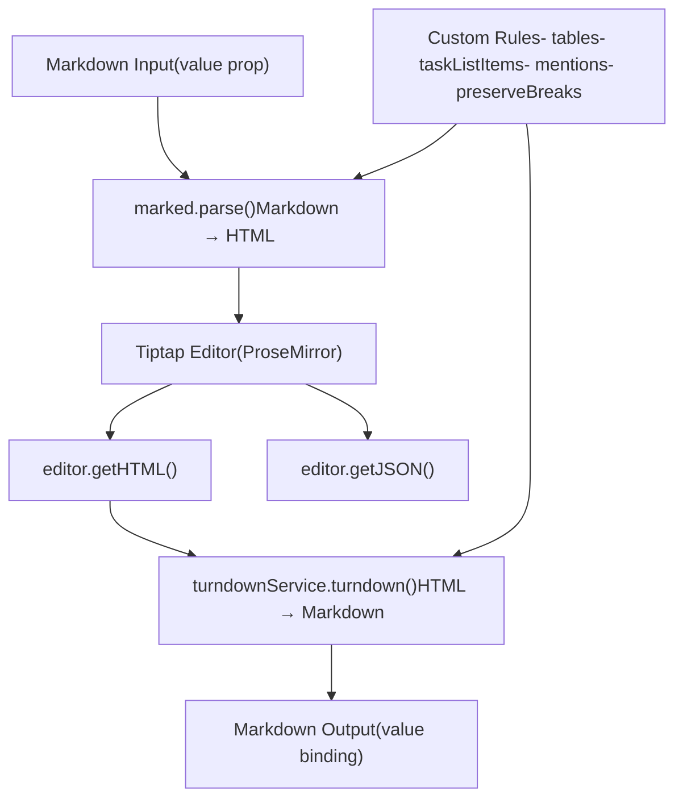
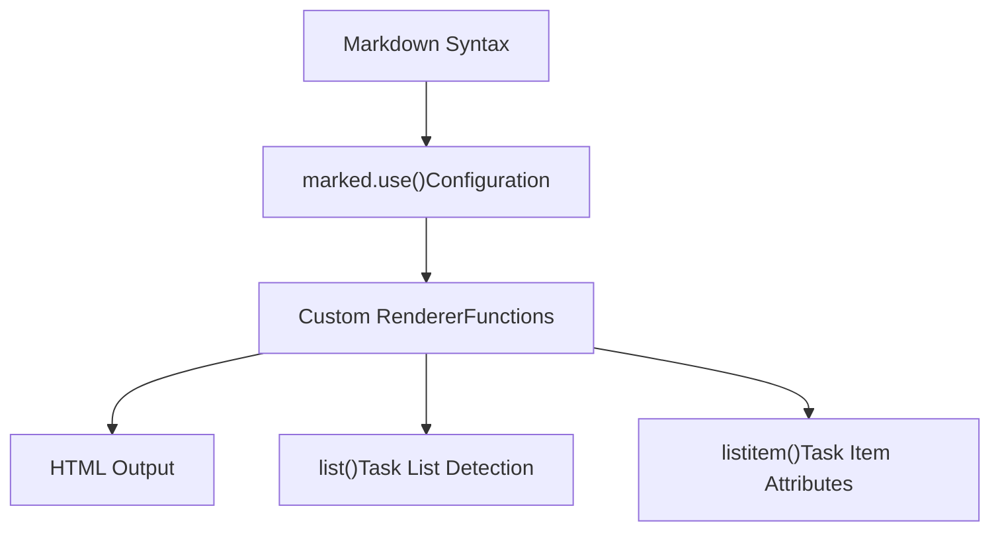
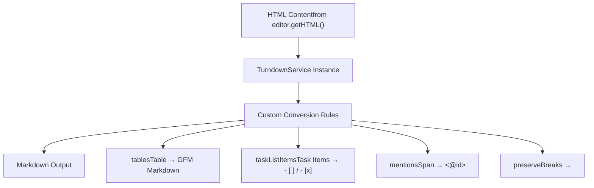

# Content Format Conversion

Relevant source files

-   [CHANGELOG.md](https://github.com/open-webui/open-webui/blob/a7271532/CHANGELOG.md)
-   [package-lock.json](https://github.com/open-webui/open-webui/blob/a7271532/package-lock.json)
-   [package.json](https://github.com/open-webui/open-webui/blob/a7271532/package.json)
-   [src/app.css](https://github.com/open-webui/open-webui/blob/a7271532/src/app.css)
-   [src/lib/components/ChangelogModal.svelte](https://github.com/open-webui/open-webui/blob/a7271532/src/lib/components/ChangelogModal.svelte)
-   [src/lib/components/common/RichTextInput.svelte](https://github.com/open-webui/open-webui/blob/a7271532/src/lib/components/common/RichTextInput.svelte)
-   [src/lib/components/icons/XMark.svelte](https://github.com/open-webui/open-webui/blob/a7271532/src/lib/components/icons/XMark.svelte)

This document explains the bidirectional content format conversion system that translates between Markdown and HTML in the rich text editor. The conversion pipeline enables users to work with Markdown syntax while the Tiptap editor operates on HTML/ProseMirror structures internally.

For information about the overall Tiptap editor architecture and extensions, see [Tiptap Editor Architecture](/open-webui/open-webui/9.1-tiptap-editor-architecture). For collaborative editing features using Yjs CRDT, see [Collaborative Editing](/open-webui/open-webui/9.3-collaborative-editing).

## Purpose and Scope

The content format conversion system provides:

-   **Markdown → HTML conversion** using `marked` library when initializing editor content
-   **HTML → Markdown conversion** using `TurndownService` when extracting user input
-   **Custom rendering rules** for task lists, tables, mentions, and code blocks
-   **Format preservation** for special constructs like line breaks, mentions, and GFM extensions

This system operates transparently during editor transactions, ensuring the external API (via the `value` prop) always receives Markdown while the internal editor state uses HTML/ProseMirror nodes.

## Conversion Pipeline Architecture


**Sources:** [src/lib/components/common/RichTextInput.svelte1-30](https://github.com/open-webui/open-webui/blob/a7271532/src/lib/components/common/RichTextInput.svelte#L1-L30) [src/lib/components/common/RichTextInput.svelte639-677](https://github.com/open-webui/open-webui/blob/a7271532/src/lib/components/common/RichTextInput.svelte#L639-L677)

The conversion occurs at two key points:

1.  **Initialization**: When the component mounts, `marked.parse()` converts the initial Markdown `value` to HTML before passing it to the editor (lines 639-676)
2.  **Transaction Processing**: In the `onTransaction` handler, `turndownService.turndown()` converts the editor's HTML back to Markdown after each change (lines 774-832)

## Markdown to HTML Conversion (marked.js)

The `marked` library converts Markdown syntax to HTML. Custom renderers handle special cases:


**Sources:** [src/lib/components/common/RichTextInput.svelte5-29](https://github.com/open-webui/open-webui/blob/a7271532/src/lib/components/common/RichTextInput.svelte#L5-L29)

### Configuration

The `marked` instance is configured with:

-   `breaks: true` - Enable GitHub Flavored Markdown line breaks
-   `gfm: true` - Enable GitHub Flavored Markdown extensions

**Sources:** [src/lib/components/common/RichTextInput.svelte5-7](https://github.com/open-webui/open-webui/blob/a7271532/src/lib/components/common/RichTextInput.svelte#L5-L7)

### Custom List Renderer

The custom `list()` renderer detects task lists and applies special attributes:

[src/lib/components/common/RichTextInput.svelte9-19](https://github.com/open-webui/open-webui/blob/a7271532/src/lib/components/common/RichTextInput.svelte#L9-L19)

This renderer:

1.  Detects if the list body contains `data-checked=` attributes (indicating task items)
2.  Wraps task lists in `<ul data-type="taskList">` instead of plain `<ul>`
3.  Preserves regular ordered/unordered list handling

### Custom List Item Renderer

The custom `listitem()` renderer handles task items:

[src/lib/components/common/RichTextInput.svelte21-27](https://github.com/open-webui/open-webui/blob/a7271532/src/lib/components/common/RichTextInput.svelte#L21-L27)

This converts Markdown task list syntax (`- [ ]` or `- [x]`) into:

```
<li data-type="taskItem" data-checked="true">Content</li>
```
These attributes are used by Tiptap's `ListKit` extension to render checkboxes.

**Sources:** [src/lib/components/common/RichTextInput.svelte9-29](https://github.com/open-webui/open-webui/blob/a7271532/src/lib/components/common/RichTextInput.svelte#L9-L29)

## HTML to Markdown Conversion (TurndownService)

The `TurndownService` from the `turndown` library converts HTML back to Markdown. Multiple custom rules handle special constructs:




**Sources:** [src/lib/components/common/RichTextInput.svelte31-106](https://github.com/open-webui/open-webui/blob/a7271532/src/lib/components/common/RichTextInput.svelte#L31-L106)

### TurndownService Configuration

Base configuration:

[src/lib/components/common/RichTextInput.svelte33-40](https://github.com/open-webui/open-webui/blob/a7271532/src/lib/components/common/RichTextInput.svelte#L33-L40)

Key settings:

-   `codeBlockStyle: 'fenced'` - Use triple backticks (\`\`\`) for code blocks
-   `headingStyle: 'atx'` - Use `#` prefix for headings
-   `turndownService.escape` override - Disable HTML entity escaping to preserve special characters
-   `turndownService.use(gfm)` - Enable GitHub Flavored Markdown plugin for tables, strikethrough, etc.

**Sources:** [src/lib/components/common/RichTextInput.svelte31-40](https://github.com/open-webui/open-webui/blob/a7271532/src/lib/components/common/RichTextInput.svelte#L31-L40)

## Custom Conversion Rules

### Table Conversion Rule

The `tables` rule converts HTML tables to GFM Markdown format:

[src/lib/components/common/RichTextInput.svelte51-82](https://github.com/open-webui/open-webui/blob/a7271532/src/lib/components/common/RichTextInput.svelte#L51-L82)

This rule:

1.  Extracts all `<tr>` elements from the table
2.  Processes each row's cells (both `<th>` and `<td>`)
3.  Converts cell content to Markdown using recursive `turndownService.turndown()`
4.  Formats rows as `| cell1 | cell2 | cell3 |`
5.  Inserts separator row (`| --- | --- | --- |`) after the first row (header)

The result is standard GFM table syntax:

```
| Header 1 | Header 2 |
| --- | --- |
| Cell 1 | Cell 2 |
```
**Sources:** [src/lib/components/common/RichTextInput.svelte42-82](https://github.com/open-webui/open-webui/blob/a7271532/src/lib/components/common/RichTextInput.svelte#L42-L82)

### Task List Items Rule

The `taskListItems` rule converts task items back to Markdown:

[src/lib/components/common/RichTextInput.svelte84-94](https://github.com/open-webui/open-webui/blob/a7271532/src/lib/components/common/RichTextInput.svelte#L84-L94)

This rule:

1.  Filters `<li>` elements with `data-checked` attribute (`"true"` or `"false"`)
2.  Checks the `data-checked` value to determine checkbox state
3.  Formats as `- [x]` (checked) or `- [ ]` (unchecked)
4.  Strips leading whitespace from content

**Sources:** [src/lib/components/common/RichTextInput.svelte84-94](https://github.com/open-webui/open-webui/blob/a7271532/src/lib/components/common/RichTextInput.svelte#L84-L94)

### Mention Conversion Rule

The `mentions` rule converts Tiptap mention spans to special `<@id>` syntax:

[src/lib/components/common/RichTextInput.svelte96-106](https://github.com/open-webui/open-webui/blob/a7271532/src/lib/components/common/RichTextInput.svelte#L96-L106)

This rule:

1.  Filters `<span>` elements with `data-type="mention"`
2.  Extracts the mention ID from `data-id` attribute
3.  Extracts the trigger character from `data-mention-suggestion-char` (typically `@`)
4.  Formats as `<@id>` (e.g., `<@llama3.2:latest>`)

This syntax is used elsewhere in the codebase for model mentions and variable substitution.

**Sources:** [src/lib/components/common/RichTextInput.svelte96-106](https://github.com/open-webui/open-webui/blob/a7271532/src/lib/components/common/RichTextInput.svelte#L96-L106)

### Preserve Breaks Rule

When `preserveBreaks` prop is enabled, an additional rule preserves `<br>` elements:

[src/lib/components/common/RichTextInput.svelte647-653](https://github.com/open-webui/open-webui/blob/a7271532/src/lib/components/common/RichTextInput.svelte#L647-L653)

This prevents line breaks from being stripped during conversion, which is necessary for certain formatting contexts.

**Sources:** [src/lib/components/common/RichTextInput.svelte647-653](https://github.com/open-webui/open-webui/blob/a7271532/src/lib/components/common/RichTextInput.svelte#L647-L653)

## Integration with Editor Lifecycle

### Initialization Flow

> **[Mermaid sequence]**
> *(图表结构无法解析)*

**Sources:** [src/lib/components/common/RichTextInput.svelte639-683](https://github.com/open-webui/open-webui/blob/a7271532/src/lib/components/common/RichTextInput.svelte#L639-L683)

On component mount (`onMount`):

1.  The initial `value` prop (Markdown) is stored in `content` variable (line 640)
2.  If `json` mode is disabled and not `raw` mode, `marked.parse()` converts Markdown to HTML (lines 656-676)
3.  The converted HTML is passed to the Tiptap `Editor` constructor (lines 683-772)

Special handling:

-   `tryParse()` function retries parsing up to 3 times if `marked` fails (lines 657-672)
-   If parsing fails after retries, falls back to plain text (lines 664-666)
-   Collaboration mode skips content initialization to use Yjs document state (lines 679-682, line 772)

### Transaction Flow

> **[Mermaid sequence]**
> *(图表结构无法解析)*

**Sources:** [src/lib/components/common/RichTextInput.svelte774-832](https://github.com/open-webui/open-webui/blob/a7271532/src/lib/components/common/RichTextInput.svelte#L774-L832)

On every editor transaction:

1.  `editor.getHTML()` extracts current HTML state (line 779)
2.  `editor.getJSON()` extracts current JSON state (line 780)
3.  HTML is processed before conversion:
    -   Empty paragraphs `<p></p>` are replaced with `<br/>` (lines 786, 795)
    -   Multiple spaces are converted to non-breaking spaces `\u00a0` to preserve formatting (lines 787, 797)
    -   Tabs are converted to 4 non-breaking spaces in non-rich-text mode (line 799)
4.  `turndownService.turndown()` converts HTML to Markdown (lines 783-803)
5.  Non-breaking spaces are converted back to regular spaces (lines 789, 802)
6.  If `preserveBreaks` is disabled, `<br/>` tags are stripped (lines 817-819)
7.  The `value` binding is updated with the Markdown output (line 822)
8.  The `onChange` callback is invoked with all formats (lines 805-809)

**Sources:** [src/lib/components/common/RichTextInput.svelte774-832](https://github.com/open-webui/open-webui/blob/a7271532/src/lib/components/common/RichTextInput.svelte#L774-L832)

## Special Content Handling

### Non-Breaking Space Preservation

The conversion pipeline uses a two-step process to preserve multiple consecutive spaces:

[src/lib/components/common/RichTextInput.svelte787-789](https://github.com/open-webui/open-webui/blob/a7271532/src/lib/components/common/RichTextInput.svelte#L787-L789) [src/lib/components/common/RichTextInput.svelte797-802](https://github.com/open-webui/open-webui/blob/a7271532/src/lib/components/common/RichTextInput.svelte#L797-L802)

1.  Replace sequences of 2+ spaces with non-breaking spaces (`\u00a0`)
2.  Convert HTML to Markdown
3.  Replace non-breaking spaces back to regular spaces

This prevents HTML from collapsing multiple spaces while preserving them in the final Markdown output.

### Empty Paragraph Handling

Empty paragraphs are normalized to line breaks:

[src/lib/components/common/RichTextInput.svelte786](https://github.com/open-webui/open-webui/blob/a7271532/src/lib/components/common/RichTextInput.svelte#L786-L786) [src/lib/components/common/RichTextInput.svelte795](https://github.com/open-webui/open-webui/blob/a7271532/src/lib/components/common/RichTextInput.svelte#L795-L795)

The pattern `<p></p>` is replaced with `<br/>` before conversion, ensuring empty lines are properly represented in the Markdown output.

**Sources:** [src/lib/components/common/RichTextInput.svelte782-803](https://github.com/open-webui/open-webui/blob/a7271532/src/lib/components/common/RichTextInput.svelte#L782-L803)

## Mode Variations

### Rich Text Mode

When `richText={true}` (default), full conversion with GFM extensions is enabled:

[src/lib/components/common/RichTextInput.svelte782-789](https://github.com/open-webui/open-webui/blob/a7271532/src/lib/components/common/RichTextInput.svelte#L782-L789)

### Plain Text Mode

When `richText={false}`, simpler conversion with tab preservation:

[src/lib/components/common/RichTextInput.svelte790-803](https://github.com/open-webui/open-webui/blob/a7271532/src/lib/components/common/RichTextInput.svelte#L790-L803)

Additional handling:

-   Tabs are converted to 4 non-breaking spaces (line 799)
-   Paste events force plain-text-only insertion (lines 836-866)

**Sources:** [src/lib/components/common/RichTextInput.svelte782-803](https://github.com/open-webui/open-webui/blob/a7271532/src/lib/components/common/RichTextInput.svelte#L782-L803) [src/lib/components/common/RichTextInput.svelte836-866](https://github.com/open-webui/open-webui/blob/a7271532/src/lib/components/common/RichTextInput.svelte#L836-L866)

## Format Support Matrix

| Markdown Construct | HTML Representation | Custom Rule |
| --- | --- | --- |
| `- [ ]` task item | `<li data-type="taskItem" data-checked="false">` | `listitem()`, `taskListItems` |
| `- [x]` checked task | `<li data-type="taskItem" data-checked="true">` | `listitem()`, `taskListItems` |
| GFM table | `<table><thead><tr><th>...</th></tr></thead>...` | `tables` |
| `<@modelId>` | `<span data-type="mention" data-id="modelId">` | `mentions` |
| Line breaks (`preserveBreaks=true`) | `<br>` / `<br/>` | `preserveBreaks` |
| Code blocks | `<pre><code class="language-xyz">` | Built-in GFM |
| Strikethrough | `<del>` / `<s>` | Built-in GFM |

**Sources:** [src/lib/components/common/RichTextInput.svelte1-106](https://github.com/open-webui/open-webui/blob/a7271532/src/lib/components/common/RichTextInput.svelte#L1-L106) [src/lib/components/common/RichTextInput.svelte647-653](https://github.com/open-webui/open-webui/blob/a7271532/src/lib/components/common/RichTextInput.svelte#L647-L653)

## Dependencies

The conversion system relies on these npm packages:

| Package | Version | Purpose |
| --- | --- | --- |
| `marked` | ^9.1.0 | Markdown → HTML parsing |
| `turndown` | ^7.2.0 | HTML → Markdown conversion |
| `@joplin/turndown-plugin-gfm` | ^1.0.62 | GFM extensions for Turndown |

**Sources:** [package.json71](https://github.com/open-webui/open-webui/blob/a7271532/package.json#L71-L71) [package.json93](https://github.com/open-webui/open-webui/blob/a7271532/package.json#L93-L93) [package.json18](https://github.com/open-webui/open-webui/blob/a7271532/package.json#L18-L18)

The `DOMPurify` library is also used in other parts of the codebase to sanitize HTML before rendering, though it's not directly part of the conversion pipeline.

**Sources:** [src/lib/components/common/RichTextInput.svelte3](https://github.com/open-webui/open-webui/blob/a7271532/src/lib/components/common/RichTextInput.svelte#L3-L3)
