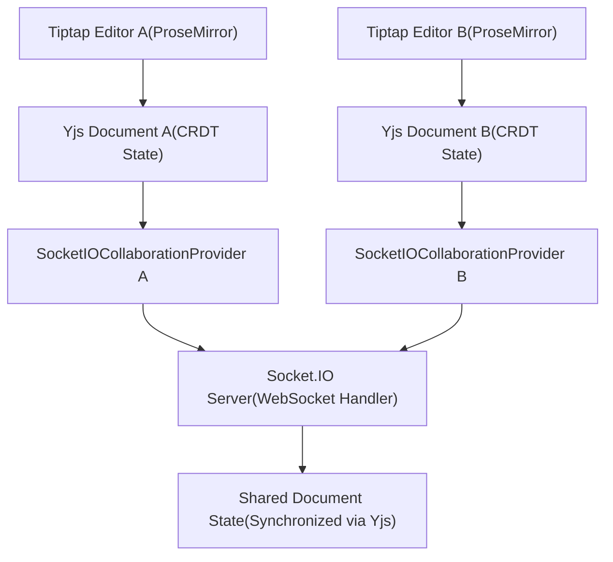
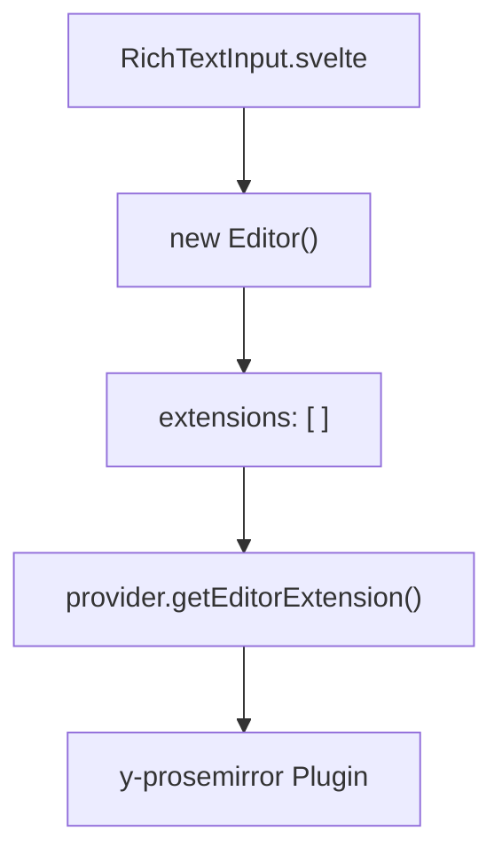
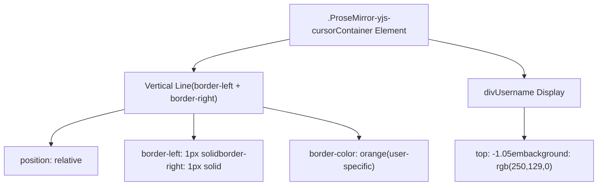
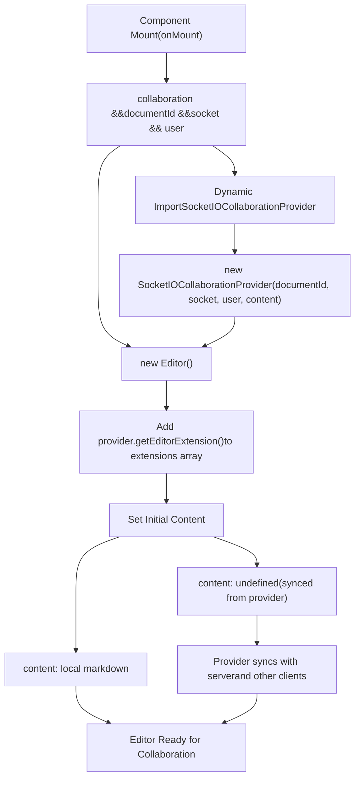
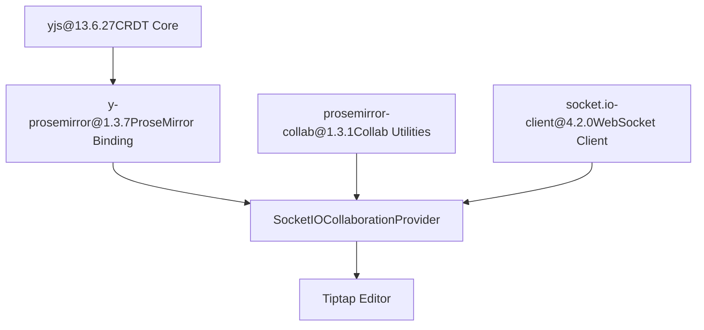

# Collaborative Editing

Relevant source files

-   [CHANGELOG.md](https://github.com/open-webui/open-webui/blob/a7271532/CHANGELOG.md)
-   [package-lock.json](https://github.com/open-webui/open-webui/blob/a7271532/package-lock.json)
-   [package.json](https://github.com/open-webui/open-webui/blob/a7271532/package.json)
-   [src/app.css](https://github.com/open-webui/open-webui/blob/a7271532/src/app.css)
-   [src/lib/components/ChangelogModal.svelte](https://github.com/open-webui/open-webui/blob/a7271532/src/lib/components/ChangelogModal.svelte)
-   [src/lib/components/common/RichTextInput.svelte](https://github.com/open-webui/open-webui/blob/a7271532/src/lib/components/common/RichTextInput.svelte)
-   [src/lib/components/icons/XMark.svelte](https://github.com/open-webui/open-webui/blob/a7271532/src/lib/components/icons/XMark.svelte)

## Purpose and Scope

This document covers the real-time collaborative editing system built into Open WebUI's rich text editor component. The system enables multiple users to simultaneously edit the same document with automatic conflict resolution using Conflict-free Replicated Data Types (CRDTs). Changes are synchronized in real-time through WebSocket connections, with visual indicators showing remote user cursors and selections.

For information about the broader rich text input architecture and Tiptap configuration, see [Tiptap Editor Architecture](/open-webui/open-webui/9.1-tiptap-editor-architecture). For content format conversion between Markdown and HTML, see [Content Format Conversion](/open-webui/open-webui/9.2-content-format-conversion).

---

## Architecture Overview

The collaborative editing system is built on three primary layers:

1.  **CRDT Layer**: Yjs provides the conflict-free replicated data structure that allows concurrent edits without explicit locking or coordination
2.  **Transport Layer**: `SocketIOCollaborationProvider` manages WebSocket communication and synchronizes document state between clients
3.  **Editor Integration Layer**: Tiptap extensions connect the editor's ProseMirror document model to the Yjs CRDT


**Sources:** [src/lib/components/common/RichTextInput.svelte147-148](https://github.com/open-webui/open-webui/blob/a7271532/src/lib/components/common/RichTextInput.svelte#L147-L148) [src/lib/components/common/RichTextInput.svelte679-682](https://github.com/open-webui/open-webui/blob/a7271532/src/lib/components/common/RichTextInput.svelte#L679-L682) [package.json145-147](https://github.com/open-webui/open-webui/blob/a7271532/package.json#L145-L147)

---

## CRDT Foundation with Yjs

Yjs is a CRDT implementation that enables conflict-free synchronization of shared data structures. In Open WebUI, Yjs maintains a shared document representation that multiple editors can concurrently modify without explicit coordination.

### Yjs Integration Points

The collaboration system initializes when three conditions are met:

| Condition | Description | Code Reference |
| --- | --- | --- |
| `collaboration` prop | Must be `true` | [src/lib/components/common/RichTextInput.svelte250](https://github.com/open-webui/open-webui/blob/a7271532/src/lib/components/common/RichTextInput.svelte#L250-L250) |
| `documentId` | Unique identifier for the shared document | [src/lib/components/common/RichTextInput.svelte170](https://github.com/open-webui/open-webui/blob/a7271532/src/lib/components/common/RichTextInput.svelte#L170-L170) |
| `socket` | Active Socket.IO connection | [src/lib/components/common/RichTextInput.svelte166](https://github.com/open-webui/open-webui/blob/a7271532/src/lib/components/common/RichTextInput.svelte#L166-L166) |
| `user` | User identity for presence tracking | [src/lib/components/common/RichTextInput.svelte167](https://github.com/open-webui/open-webui/blob/a7271532/src/lib/components/common/RichTextInput.svelte#L167-L167) |

When these conditions are satisfied, the system dynamically imports the collaboration provider:

```
RichTextInput.svelte:
  - Lines 679-682: Dynamic import and provider initialization
  - if (collaboration && documentId && socket && user)
  - const { SocketIOCollaborationProvider } = await import(...)
  - provider = new SocketIOCollaborationProvider(documentId, socket, user, content)
```
**Sources:** [src/lib/components/common/RichTextInput.svelte679-682](https://github.com/open-webui/open-webui/blob/a7271532/src/lib/components/common/RichTextInput.svelte#L679-L682) [src/lib/components/common/RichTextInput.svelte166-170](https://github.com/open-webui/open-webui/blob/a7271532/src/lib/components/common/RichTextInput.svelte#L166-L170)

---

## SocketIOCollaborationProvider Implementation

The `SocketIOCollaborationProvider` class bridges Yjs's CRDT operations with Socket.IO's real-time transport. This provider is responsible for:

-   Broadcasting local document changes to connected peers
-   Receiving and applying remote changes from other users
-   Managing awareness state for cursor positions and user presence
-   Handling connection lifecycle (connect, disconnect, reconnect)

> **[Mermaid sequence]**
> *(图表结构无法解析)*

**Sources:** [src/lib/components/common/RichTextInput.svelte679-682](https://github.com/open-webui/open-webui/blob/a7271532/src/lib/components/common/RichTextInput.svelte#L679-L682) [src/lib/components/common/RichTextInput.svelte147-148](https://github.com/open-webui/open-webui/blob/a7271532/src/lib/components/common/RichTextInput.svelte#L147-L148)

---

## Tiptap Editor Integration

The collaboration provider exposes a Tiptap extension that integrates Yjs with ProseMirror's document model. This extension is conditionally added to the editor configuration:

```
Editor Extensions Configuration (RichTextInput.svelte:683-772):
  - Line 770: ...(collaboration && provider ? [provider.getEditorExtension()] : [])
  - Line 772: content: collaboration ? undefined : content
```
When collaboration is enabled, the editor's initial content is set to `undefined` because the document state will be synchronized from the provider instead of using the local `content` prop.

### Extension Registration Pattern


The extension returned by `provider.getEditorExtension()` connects the ProseMirror editor state to the Yjs document using the `y-prosemirror` library, which provides bidirectional synchronization between ProseMirror transactions and Yjs operations.

**Sources:** [src/lib/components/common/RichTextInput.svelte683-772](https://github.com/open-webui/open-webui/blob/a7271532/src/lib/components/common/RichTextInput.svelte#L683-L772) [package.json145](https://github.com/open-webui/open-webui/blob/a7271532/package.json#L145-L145)

---

## Remote Presence Indicators

The collaborative editing system displays real-time visual indicators for remote users' cursor positions and selections. This is implemented through CSS classes applied to ProseMirror decorations.

### Cursor Rendering Implementation

The `.ProseMirror-yjs-cursor` class styles remote user cursors:

```
.ProseMirror-yjs-cursor (app.css:664-686):
  - Border-left and border-right create vertical caret line
  - Position: relative with pointer-events: none
  - Color automatically overwritten by user-specific color
  - Username div positioned absolutely above cursor
```

### Username Badge Positioning

Each remote cursor displays the user's name in a small badge above the cursor position:

| CSS Property | Value | Purpose |
| --- | --- | --- |
| `position` | `absolute` | Position relative to cursor |
| `top` | `-1.05em` | Float above cursor line |
| `left` | `-1px` | Align with cursor border |
| `font-size` | `13px` | Readable but unobtrusive |
| `background-color` | `rgb(250, 129, 0)` | Per-user color |
| `color` | `white` | Contrast for readability |
| `padding` | `2px` | Minimal padding |

**Sources:** [src/app.css664-686](https://github.com/open-webui/open-webui/blob/a7271532/src/app.css#L664-L686) [src/app.css660-662](https://github.com/open-webui/open-webui/blob/a7271532/src/app.css#L660-L662)

---

## Initialization and Lifecycle

The collaboration system follows a specific initialization sequence to ensure proper synchronization before editing begins.

### Initialization Flow


**Sources:** [src/lib/components/common/RichTextInput.svelte639-772](https://github.com/open-webui/open-webui/blob/a7271532/src/lib/components/common/RichTextInput.svelte#L639-L772)

### Lifecycle Management

```
Provider Lifecycle (RichTextInput.svelte:268-269, 679-682):
  - Line 268: let provider: SocketIOCollaborationProvider | null = null
  - Lines 679-682: Provider instantiated in onMount
  - Provider reference stored in component state
  - Cleanup handled automatically by Socket.IO disconnection
```
**Sources:** [src/lib/components/common/RichTextInput.svelte268-269](https://github.com/open-webui/open-webui/blob/a7271532/src/lib/components/common/RichTextInput.svelte#L268-L269) [src/lib/components/common/RichTextInput.svelte679-682](https://github.com/open-webui/open-webui/blob/a7271532/src/lib/components/common/RichTextInput.svelte#L679-L682)

---

## State Synchronization Mechanism

Yjs uses a conflict-free synchronization algorithm that merges concurrent edits deterministically. The system operates on these principles:

### CRDT Operation Types

| Operation | Description | Example |
| --- | --- | --- |
| **Insert** | Add content at position | User A inserts "Hello" at position 0 |
| **Delete** | Remove content range | User B deletes characters 5-10 |
| **Format** | Apply formatting | User C bolds text range 2-7 |

All operations are timestamped and causally ordered by Yjs, ensuring that regardless of network latency or operation arrival order, all clients converge to the same final state.

### Synchronization Process

> **[Mermaid sequence]**
> *(图表结构无法解析)*

The CRDT algorithm ensures that both User A and User B arrive at the same final document state ("WorldHello") despite the concurrent, conflicting edits.

**Sources:** [package.json145-147](https://github.com/open-webui/open-webui/blob/a7271532/package.json#L145-L147) [src/app.css664-686](https://github.com/open-webui/open-webui/blob/a7271532/src/app.css#L664-L686)

---

## Dependencies and Package Integration

The collaborative editing system relies on several npm packages working together:

| Package | Version | Role |
| --- | --- | --- |
| `yjs` | ^13.6.27 | CRDT implementation |
| `y-prosemirror` | ^1.3.7 | ProseMirror-Yjs binding |
| `prosemirror-collab` | ^1.3.1 | ProseMirror collaboration utilities |
| `socket.io-client` | ^4.2.0 | WebSocket transport layer |


**Sources:** [package.json103](https://github.com/open-webui/open-webui/blob/a7271532/package.json#L103-L103) [package.json145-147](https://github.com/open-webui/open-webui/blob/a7271532/package.json#L145-L147) [package.json76](https://github.com/open-webui/open-webui/blob/a7271532/package.json#L76-L76) [package.json89](https://github.com/open-webui/open-webui/blob/a7271532/package.json#L89-L89)

---

## Feature Flags and Configuration

The collaborative editing feature is controlled by several configuration points:

```
Configuration Points (RichTextInput.svelte):
  - Line 250: export let collaboration = false
  - Line 170: export let documentId = ''
  - Line 166: export let socket = null
  - Line 167: export let user = null
```
### Enabling Collaboration

To enable collaborative editing for a RichTextInput instance:

```
<RichTextInput
  collaboration={true}
  documentId="unique-doc-id-123"
  socket={socketConnection}
  user={currentUser}
  bind:value={content}
/>
```
When `collaboration` is false, the editor operates in single-user mode with no network synchronization.

**Sources:** [src/lib/components/common/RichTextInput.svelte166-170](https://github.com/open-webui/open-webui/blob/a7271532/src/lib/components/common/RichTextInput.svelte#L166-L170) [src/lib/components/common/RichTextInput.svelte250](https://github.com/open-webui/open-webui/blob/a7271532/src/lib/components/common/RichTextInput.svelte#L250-L250)
