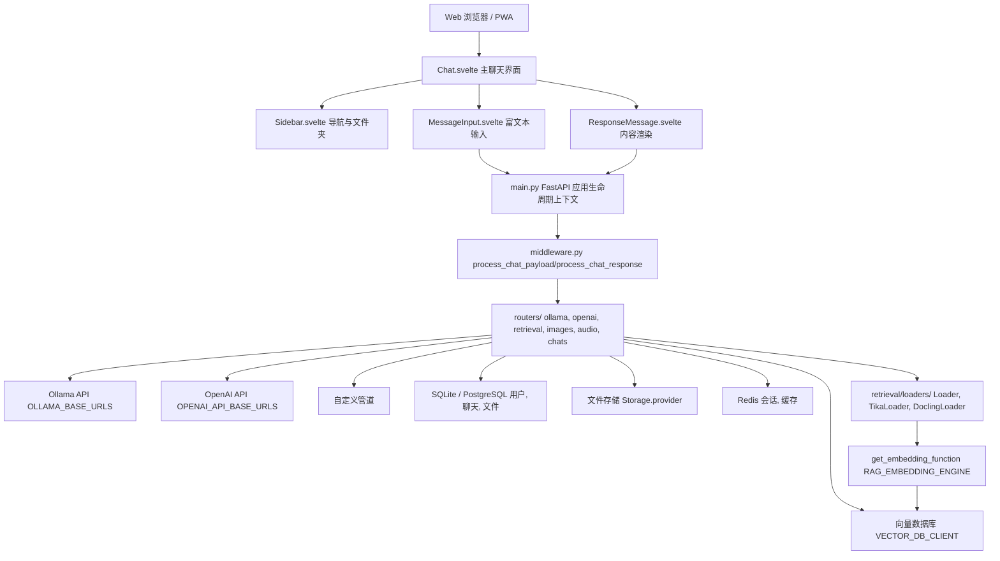
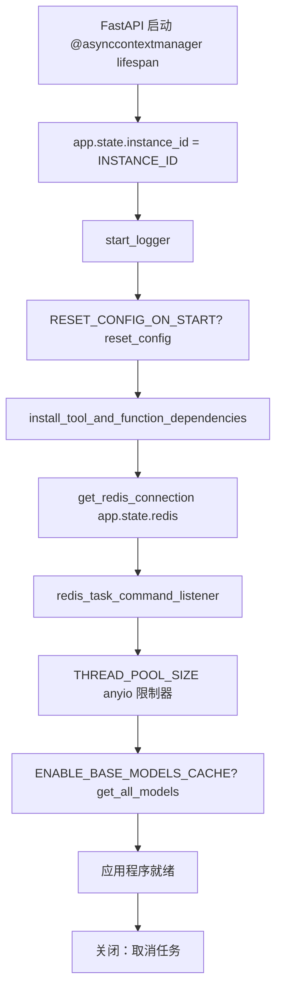
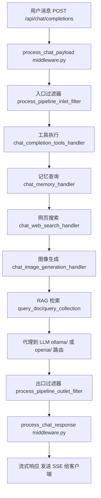
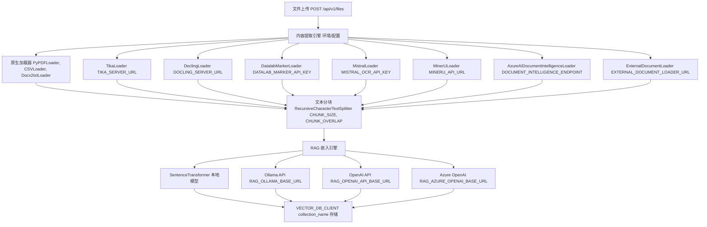
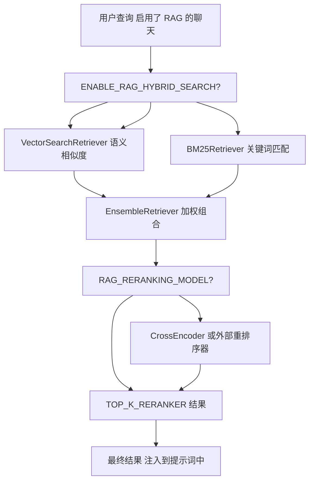
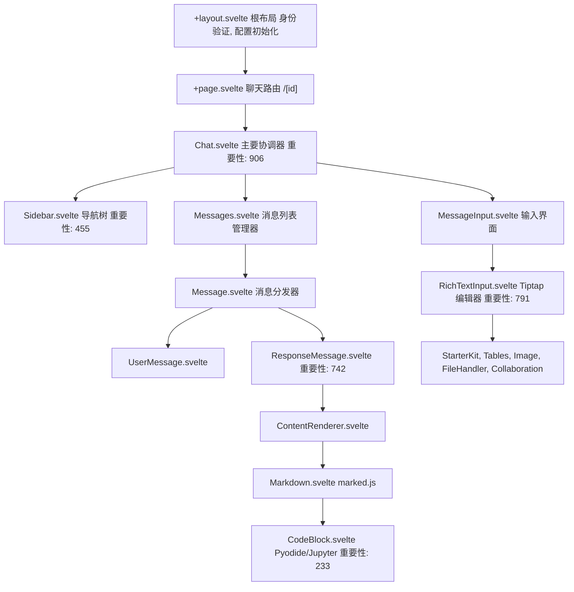
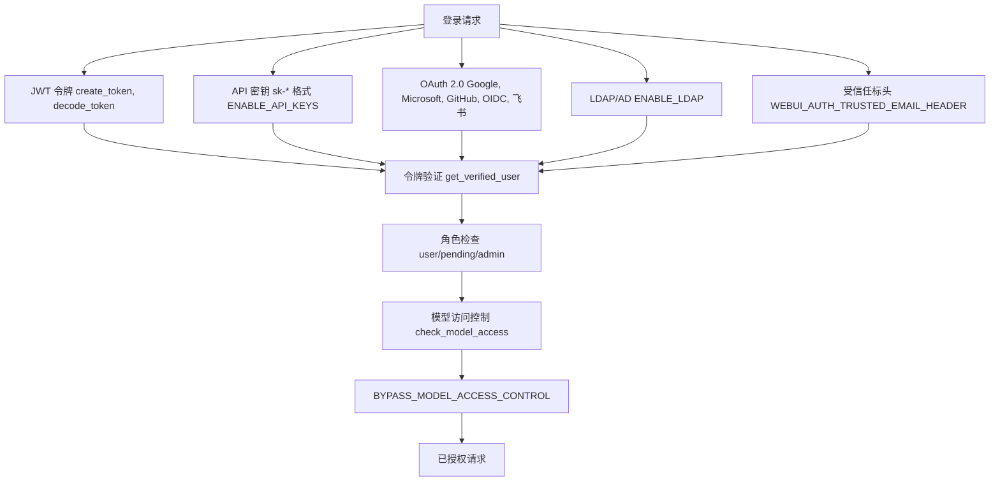

# 概览

相关源文件

-   [LICENSE](https://github.com/open-webui/open-webui/blob/a7271532/LICENSE)
-   [README.md](https://github.com/open-webui/open-webui/blob/a7271532/README.md)
-   [TROUBLESHOOTING.md](https://github.com/open-webui/open-webui/blob/a7271532/TROUBLESHOOTING.md)
-   [backend/open\_webui/config.py](https://github.com/open-webui/open-webui/blob/a7271532/backend/open_webui/config.py)
-   [backend/open\_webui/main.py](https://github.com/open-webui/open-webui/blob/a7271532/backend/open_webui/main.py)
-   [backend/open\_webui/retrieval/loaders/datalab\_marker.py](https://github.com/open-webui/open-webui/blob/a7271532/backend/open_webui/retrieval/loaders/datalab_marker.py)
-   [backend/open\_webui/retrieval/loaders/external\_document.py](https://github.com/open-webui/open-webui/blob/a7271532/backend/open_webui/retrieval/loaders/external_document.py)
-   [backend/open\_webui/retrieval/loaders/external\_web.py](https://github.com/open-webui/open-webui/blob/a7271532/backend/open_webui/retrieval/loaders/external_web.py)
-   [backend/open\_webui/retrieval/loaders/main.py](https://github.com/open-webui/open-webui/blob/a7271532/backend/open_webui/retrieval/loaders/main.py)
-   [backend/open\_webui/retrieval/loaders/mineru.py](https://github.com/open-webui/open-webui/blob/a7271532/backend/open_webui/retrieval/loaders/mineru.py)
-   [backend/open\_webui/retrieval/loaders/mistral.py](https://github.com/open-webui/open-webui/blob/a7271532/backend/open_webui/retrieval/loaders/mistral.py)
-   [backend/open\_webui/retrieval/utils.py](https://github.com/open-webui/open-webui/blob/a7271532/backend/open_webui/retrieval/utils.py)
-   [backend/open\_webui/routers/retrieval.py](https://github.com/open-webui/open-webui/blob/a7271532/backend/open_webui/routers/retrieval.py)
-   [backend/open\_webui/utils/middleware.py](https://github.com/open-webui/open-webui/blob/a7271532/backend/open_webui/utils/middleware.py)
-   [docs/apache.md](https://github.com/open-webui/open-webui/blob/a7271532/docs/apache.md)
-   [src/lib/apis/retrieval/index.ts](https://github.com/open-webui/open-webui/blob/a7271532/src/lib/apis/retrieval/index.ts)
-   [src/lib/components/admin/Settings/Documents.svelte](https://github.com/open-webui/open-webui/blob/a7271532/src/lib/components/admin/Settings/Documents.svelte)
-   [src/lib/components/admin/Settings/WebSearch.svelte](https://github.com/open-webui/open-webui/blob/a7271532/src/lib/components/admin/Settings/WebSearch.svelte)
-   [src/lib/components/chat/Settings/About.svelte](https://github.com/open-webui/open-webui/blob/a7271532/src/lib/components/chat/Settings/About.svelte)
-   [src/lib/constants.ts](https://github.com/open-webui/open-webui/blob/a7271532/src/lib/constants.ts)

Open WebUI 是一个可扩展、自托管的 AI 聊天平台，旨在完全离线运行。它通过各种提供商（包括 Ollama、OpenAI 兼容的 API 和自定义管道）提供与大型语言模型 (LLM) 交互的 Web 界面。该平台内置了检索增强生成 (RAG)、多模型对话、网页搜索集成、身份验证系统以及用于生产部署的企业级功能。

本文档涵盖了高层架构、核心组件和部署选项。有关特定子系统的详细信息，请参阅：[架构概览](/open-webui/open-webui/2-architecture-overview)、[聊天系统](/open-webui/open-webui/4-chat-system)、[RAG 和知识系统](/open-webui/open-webui/7-rag-and-knowledge-system)、[身份验证与安全](/open-webui/open-webui/10-authentication-and-security)。

**来源：** [README.md1-240](https://github.com/open-webui/open-webui/blob/a7271532/README.md#L1-L240) [backend/open\_webui/main.py553-640](https://github.com/open-webui/open-webui/blob/a7271532/backend/open_webui/main.py#L553-L640)

## 目的与范围

Open WebUI 充当用户和 LLM 提供商之间的智能代理层，通过以下功能增强聊天请求：

-   文档检索和语义搜索
-   来自 24 个以上提供商的网页搜索结果
-   函数调用和工具执行
-   记忆和上下文个性化
-   图像生成和编辑
-   实时协作功能

该平台支持从单用户 Docker 容器到具有 Redis 后端会话管理的水平扩展 Kubernetes 集群的各种部署场景。

**来源：** [README.md15-81](https://github.com/open-webui/open-webui/blob/a7271532/README.md#L15-L81) [backend/open\_webui/main.py1-96](https://github.com/open-webui/open-webui/blob/a7271532/backend/open_webui/main.py#L1-L96)

## 系统架构

Open WebUI 遵循三层架构，清晰地分离了表示层 (SvelteKit 前端)、应用逻辑层 (FastAPI 后端) 和数据持久层 (多个数据库后端)。

### 高层组件图


**来源：** [backend/open\_webui/main.py633-672](https://github.com/open-webui/open-webui/blob/a7271532/backend/open_webui/main.py#L633-L672) [backend/open\_webui/utils/middleware.py1-127](https://github.com/open-webui/open-webui/blob/a7271532/backend/open_webui/utils/middleware.py#L1-L127) [src/lib/constants.ts1-104](https://github.com/open-webui/open-webui/blob/a7271532/src/lib/constants.ts#L1-L104)

## 核心技术栈

| 层级 | 技术 | 关键文件 |
| --- | --- | --- |
| **前端框架** | SvelteKit 5 | `src/routes/`, `src/lib/components/` |
| **后端框架** | FastAPI 0.115+ | `backend/open_webui/main.py` |
| **数据库 (RDBMS)** | SQLite / PostgreSQL | `backend/open_webui/internal/db.py` |
| **向量数据库** | ChromaDB / Qdrant / Milvus / 及其它 6 种 | `backend/open_webui/retrieval/vector/` |
| **会话存储** | Redis (可选) | `backend/open_webui/utils/redis.py` |
| **文件存储** | 本地 / S3 / GCS / Azure Blob | `backend/open_webui/storage/provider.py` |
| **文本处理** | LangChain, Sentence Transformers | `backend/open_webui/retrieval/` |
| **富文本编辑** | Tiptap + marked.js | `src/lib/components/chat/MessageInput/` |

**来源：** [backend/open\_webui/main.py1-97](https://github.com/open-webui/open-webui/blob/a7271532/backend/open_webui/main.py#L1-L97) [backend/open\_webui/config.py1-289](https://github.com/open-webui/open-webui/blob/a7271532/backend/open_webui/config.py#L1-L289) [src/lib/constants.ts1-20](https://github.com/open-webui/open-webui/blob/a7271532/src/lib/constants.ts#L1-L20)

## 应用程序初始化与生命周期

FastAPI 应用程序通过结构化的生命周期上下文管理器进行初始化，在接受请求之前设置关键服务：


**来源：** [backend/open\_webui/main.py570-631](https://github.com/open-webui/open-webui/blob/a7271532/backend/open_webui/main.py#L570-L631) [backend/open\_webui/config.py53-70](https://github.com/open-webui/open-webui/blob/a7271532/backend/open_webui/config.py#L53-L70)

### 配置系统

Open WebUI 使用两层配置系统：

1.  **环境变量**：在启动时通过 `backend/open_webui/env.py` 加载。
2.  **持久化配置**：通过 `backend/open_webui/config.py` 中的 `AppConfig` 类存储在数据库中。

`PersistentConfig` 泛型类会自动将环境变量与数据库存储同步，并可选择在 Redis 中缓存它们，以便用于多实例部署。

```python
# 来自 config.py 的示例
class PersistentConfig(Generic[T]):
    def __init__(self, env_name: str, config_path: str, env_value: T)
    # 如果可用，则自动从数据库加载
    # 否则回退到环境变量
```
**来源：** [backend/open\_webui/config.py165-223](https://github.com/open-webui/open-webui/blob/a7271532/backend/open_webui/config.py#L165-L223) [backend/open\_webui/config.py224-284](https://github.com/open-webui/open-webui/blob/a7271532/backend/open_webui/config.py#L224-L284)

## 请求处理流水线

聊天请求流经一个复杂的中间件流水线，该流水线在基础 LLM 请求之上增强了 RAG、网页搜索、工具执行和记忆功能：

### 后端聊天流水线


**来源：** [backend/open\_webui/utils/middleware.py488-513](https://github.com/open-webui/open-webui/blob/a7271532/backend/open_webui/utils/middleware.py#L488-L513) [backend/open\_webui/utils/middleware.py286-514](https://github.com/open-webui/open-webui/blob/a7271532/backend/open_webui/utils/middleware.py#L286-L514) [backend/open\_webui/utils/middleware.py516-552](https://github.com/open-webui/open-webui/blob/a7271532/backend/open_webui/utils/middleware.py#L516-L552)

### 关键中间件函数

| 函数 | 位置 | 用途 |
| --- | --- | --- |
| `process_chat_payload` | `utils/middleware.py:494` | 在发送给 LLM 之前，通过 RAG、工具、网页搜索增强请求 |
| `process_chat_response` | `utils/middleware.py:494` | 处理 LLM 响应，应用出口过滤器 |
| `chat_completion_tools_handler` | `utils/middleware.py:286-514` | 执行函数调用和工具调用 |
| `chat_memory_handler` | `utils/middleware.py:516-552` | 查询用户记忆以进行上下文个性化 |
| `chat_web_search_handler` | `utils/middleware.py:555-715` | 执行网页搜索并注入结果 |
| `chat_image_generation_handler` | `utils/middleware.py:755-954` | 通过 DALL-E/ComfyUI 生成或编辑图像 |

**来源：** [backend/open\_webui/utils/middleware.py1-1300](https://github.com/open-webui/open-webui/blob/a7271532/backend/open_webui/utils/middleware.py#L1-L1300)

## RAG 文档处理架构

检索增强生成系统通过多个可配置引擎处理文档，然后将其存储在向量数据库中：


**来源：** [backend/open\_webui/retrieval/loaders/main.py184-330](https://github.com/open-webui/open-webui/blob/a7271532/backend/open_webui/retrieval/loaders/main.py#L184-L330) [backend/open\_webui/routers/retrieval.py126-224](https://github.com/open-webui/open-webui/blob/a7271532/backend/open_webui/routers/retrieval.py#L126-L224) [backend/open\_webui/retrieval/utils.py55-88](https://github.com/open-webui/open-webui/blob/a7271532/backend/open_webui/retrieval/utils.py#L55-L88)

### 内容提取引擎

| 引擎 | 加载器类 | 配置 | 用例 |
| --- | --- | --- | --- |
| **默认 (Default)** | `TextLoader`, `PyPDFLoader`, `CSVLoader` | 内置 | 代码文件, 简单的 PDF, 结构化数据 |
| **Tika** | `TikaLoader` | `TIKA_SERVER_URL` | Apache Tika 服务器，用于广泛的格式支持 |
| **Docling** | `DoclingLoader` | `DOCLING_SERVER_URL`, `DOCLING_API_KEY` | 高级文档理解 |
| **Datalab Marker** | `DatalabMarkerLoader` | `DATALAB_MARKER_API_KEY` | LLM 增强型 OCR，用于复杂布局 |
| **Mistral OCR** | `MistralLoader` | `MISTRAL_OCR_API_KEY` | Mistral AI 的 OCR 服务 |
| **MinerU** | `MinerULoader` | `MINERU_API_URL`, `MINERU_API_MODE` | 云端或本地文档解析 |
| **Azure 文档智能** | `AzureAIDocumentIntelligenceLoader` | `DOCUMENT_INTELLIGENCE_ENDPOINT` | Azure AI 文档智能 |
| **外部 (External)** | `ExternalDocumentLoader` | `EXTERNAL_DOCUMENT_LOADER_URL` | 自定义加载器 API 端点 |

**来源：** [backend/open\_webui/retrieval/loaders/main.py184-330](https://github.com/open-webui/open-webui/blob/a7271532/backend/open_webui/retrieval/loaders/main.py#L184-L330) [backend/open\_webui/retrieval/loaders/tika.py92-131](https://github.com/open-webui/open-webui/blob/a7271532/backend/open_webui/retrieval/loaders/tika.py#L92-L131) [backend/open\_webui/retrieval/loaders/datalab\_marker.py14-200](https://github.com/open-webui/open-webui/blob/a7271532/backend/open_webui/retrieval/loaders/datalab_marker.py#L14-L200)

### 向量数据库支持

`backend/open_webui/retrieval/vector/factory.py` 中的 `VECTOR_DB_CLIENT` 工厂基于 `VECTOR_DB` 环境变量支持 9 种向量数据库后端：

-   **chromadb** (默认)
-   **qdrant**
-   **milvus**
-   **weaviate**
-   **opensearch**
-   **pgvector** (带有 pgvector 扩展的 PostgreSQL)
-   **pinecone**
-   **s3vector**
-   **oracle23ai**

**来源：** [backend/open\_webui/config.py22](https://github.com/open-webui/open-webui/blob/a7271532/backend/open_webui/config.py#L22-L22) [backend/open\_webui/retrieval/vector/factory.py](https://github.com/open-webui/open-webui/blob/a7271532/backend/open_webui/retrieval/vector/factory.py)

### 混合搜索与重排序

为了提高检索准确度，Open WebUI 支持结合向量相似度与 BM25 关键词匹配的混合搜索：


**来源：** [backend/open\_webui/retrieval/utils.py208-315](https://github.com/open-webui/open-webui/blob/a7271532/backend/open_webui/retrieval/utils.py#L208-L315) [backend/open\_webui/routers/retrieval.py149-224](https://github.com/open-webui/open-webui/blob/a7271532/backend/open_webui/routers/retrieval.py#L149-L224)

## 前端架构

SvelteKit 前端围绕组件层次结构组织，其中 `Chat.svelte` 组件充当主要协调器：

### 前端组件层次结构


**来源：** [src/lib/constants.ts1-20](https://github.com/open-webui/open-webui/blob/a7271532/src/lib/constants.ts#L1-L20) 组件结构根据架构图推断

### 状态管理

Open WebUI 使用 Svelte stores 进行全局状态管理：

| Store | 文件 | 用途 |
| --- | --- | --- |
| `config` | `src/lib/stores/index.ts` | 来自后端的全局配置 |
| `user` | `src/lib/stores/index.ts` | 已认证的用户数据 |
| `models` | `src/lib/stores/index.ts` | 可用的 LLM 模型 |
| `settings` | `src/lib/stores/index.ts` | 用户偏好设置 |
| `showSidebar` | `src/lib/stores/index.ts` | UI 状态 |

**来源：** Store 结构根据典型的 SvelteKit 模式推断

## 身份验证与授权

Open WebUI 实现了多种身份验证方法，并具有基于角色的访问控制：

### 身份验证方法


**来源：** [backend/open\_webui/config.py290-331](https://github.com/open-webui/open-webui/blob/a7271532/backend/open_webui/config.py#L290-L331) [backend/open\_webui/config.py639-821](https://github.com/open-webui/open-webui/blob/a7271532/backend/open_webui/config.py#L639-L821)

### OAuth 配置

OAuth 提供商在 `load_oauth_providers()` 函数中动态注册。支持的提供商包括：

-   **Google**: `GOOGLE_CLIENT_ID`, `GOOGLE_CLIENT_SECRET`
-   **Microsoft**: `MICROSOFT_CLIENT_ID`, `MICROSOFT_CLIENT_SECRET`, `MICROSOFT_CLIENT_TENANT_ID`
-   **GitHub**: `GITHUB_CLIENT_ID`, `GITHUB_CLIENT_SECRET`
-   **OIDC 通用**: `OAUTH_CLIENT_ID`, `OAUTH_CLIENT_SECRET`, `OPENID_PROVIDER_URL`
-   **飞书 (Feishu)**: `FEISHU_CLIENT_ID`, `FEISHU_CLIENT_SECRET`

**来源：** [backend/open\_webui/config.py639-821](https://github.com/open-webui/open-webui/blob/a7271532/backend/open_webui/config.py#L639-L821) [backend/open\_webui/main.py641-647](https://github.com/open-webui/open-webui/blob/a7271532/backend/open_webui/main.py#L641-L647)

## 部署架构

Open WebUI 支持从单容器开发到生产级 Kubernetes 集群的多种部署拓扑：

### 部署选项

| 拓扑 | 用例 | 关键配置 |
| --- | --- | --- |
| **一体化 Docker** | 单用户, 快速启动 | `ghcr.io/open-webui/open-webui:ollama` |
| **独立容器** | UI + 外部 Ollama | `OLLAMA_BASE_URL=http://host:11434` |
| **仅限云端 LLM** | 无本地模型 | 设置了 `OPENAI_API_KEY`, 无 Ollama |
| **Kubernetes** | 生产环境, 扩展 | 用于 Ollama/Redis/PostgreSQL 的 StatefulSets |
| **反向代理** | 带有 SSL 的企业环境 | Apache/Nginx → Open WebUI 后端 |
| **开发环境** | 本地开发 | Vite 开发服务器 `:5173` + 后端 `:8080` |

**来源：** [README.md86-213](https://github.com/open-webui/open-webui/blob/a7271532/README.md#L86-L213) [TROUBLESHOOTING.md1-37](https://github.com/open-webui/open-webui/blob/a7271532/TROUBLESHOOTING.md#L1-L37) [docs/apache.md1-200](https://github.com/open-webui/open-webui/blob/a7271532/docs/apache.md#L1-L200)

### Docker Compose 最小示例

```yaml
# 独立的 UI 和 Ollama 容器
services:
  open-webui:
    image: ghcr.io/open-webui/open-webui:main
    ports:
      - "3000:8080"
    volumes:
      - open-webui:/app/backend/data
    environment:
      - OLLAMA_BASE_URL=http://ollama:11434
    depends_on:
      - ollama

  ollama:
    image: ollama/ollama:latest
    ports:
      - "11434:11434"
    volumes:
      - ollama:/root/.ollama
```
**来源：** [README.md109-170](https://github.com/open-webui/open-webui/blob/a7271532/README.md#L109-L170) Docker Compose 模式根据文档推断

### 生产环境考量

对于生产级部署，关键配置包括：

1.  **数据库**：通过 `DATABASE_URL` 从 SQLite 切换到 PostgreSQL。
2.  **Redis**：通过 `REDIS_URL` 启用会话管理。
3.  **文件存储**：配置 `STORAGE_PROVIDER` (s3/gcs/azure) 形式的云存储。
4.  **向量数据库**：通过 `VECTOR_DB` 选择合适的向量数据库。
5.  **会话**：使用 `WEBUI_SECRET_KEY` 进行会话加密。
6.  **扩展**：为多 worker 部署启用 `ENABLE_WEBSOCKET_SUPPORT`。

**来源：** [backend/open\_webui/config.py1-100](https://github.com/open-webui/open-webui/blob/a7271532/backend/open_webui/config.py#L1-L100) [backend/open\_webui/main.py633-656](https://github.com/open-webui/open-webui/blob/a7271532/backend/open_webui/main.py#L633-L656)

## 关键路由器与 API 端点

FastAPI 后端将 API 端点组织成逻辑路由器：

| 路由器 | 文件 | 关键端点 |
| --- | --- | --- |
| **ollama** | `routers/ollama.py` | `/ollama/api/*` - 代理到 Ollama |
| **openai** | `routers/openai.py` | `/openai/v1/*` - OpenAI 兼容 API |
| **retrieval** | `routers/retrieval.py` | `/api/v1/retrieval/*` - RAG 配置与查询 |
| **chats** | `routers/chats.py` | `/api/v1/chats/*` - 聊天 CRUD 操作 |
| **files** | `routers/files.py` | `/api/v1/files/*` - 文件上传与管理 |
| **users** | `routers/users.py` | `/api/v1/users/*` - 用户管理 |
| **auths** | `routers/auths.py` | `/api/v1/auths/*` - 身份验证 |
| **models** | `routers/models.py` | `/api/v1/models/*` - 模型管理 |
| **images** | `routers/images.py` | `/api/v1/images/*` - 图像生成 |
| **audio** | `routers/audio.py` | `/api/v1/audio/*` - TTS/STT |

**来源：** [backend/open\_webui/main.py70-96](https://github.com/open-webui/open-webui/blob/a7271532/backend/open_webui/main.py#L70-L96) [src/lib/constants.ts6-14](https://github.com/open-webui/open-webui/blob/a7271532/src/lib/constants.ts#L6-L14)

## 环境配置

关键环境变量通过 `backend/open_webui/env.py` 和 `backend/open_webui/config.py` 加载：

### 核心配置变量

| 类别 | 变量 | 默认值 | 用途 |
| --- | --- | --- | --- |
| **数据库** | `DATABASE_URL` | `DATA_DIR` 中的 SQLite | 数据库连接字符串 |
| **LLM 提供商** | `OLLAMA_BASE_URLS` | `["http://localhost:11434"]` | Ollama API 端点 |
|  | `OPENAI_API_BASE_URLS` | `["https://api.openai.com/v1"]` | OpenAI 端点 |
|  | `OPENAI_API_KEYS` | `[]` | OpenAI API 密钥 |
| **RAG** | `RAG_EMBEDDING_ENGINE` | `""` (本地) | 嵌入提供商 |
|  | `RAG_EMBEDDING_MODEL` | \- | 用于嵌入的模型 |
|  | `CONTENT_EXTRACTION_ENGINE` | `""` (默认) | 文档加载器 |
|  | `CHUNK_SIZE` | 1500 | 文本块大小 |
|  | `CHUNK_OVERLAP` | 100 | 块重叠 |
| **存储** | `STORAGE_PROVIDER` | `local` | 文件存储后端 |
|  | `UPLOAD_DIR` | `{DATA_DIR}/uploads` | 本地文件存储 |
| **缓存** | `REDIS_URL` | `None` | Redis 连接字符串 |
| **身份验证** | `WEBUI_SECRET_KEY` | 自动生成 | 会话加密密钥 |
|  | `JWT_EXPIRES_IN` | `4w` | JWT 令牌有效期 |
|  | `ENABLE_OAUTH_SIGNUP` | `False` | 允许 OAuth 注册 |

**来源：** [backend/open\_webui/config.py113-440](https://github.com/open-webui/open-webui/blob/a7271532/backend/open_webui/config.py#L113-L440) [backend/open\_webui/env.py](https://github.com/open-webui/open-webui/blob/a7271532/backend/open_webui/env.py)

## 总结

Open WebUI 是一个全面的 AI 聊天平台，它：

1.  通过 FastAPI 后端将 **LLM 请求代理** 到多个提供商 (Ollama, OpenAI, 自定义)。
2.  通过 RAG、网页搜索、工具执行、记忆和图像生成 **增强对话**。
3.  **支持企业功能**，包括 OAuth/LDAP 身份验证、RBAC、Redis 支持的扩展。
4.  通过 8 个可配置提取引擎 **处理文档**，并存储在 9 个向量数据库中。
5.  **提供丰富 UI**，具有 Tiptap 编辑器、代码执行、Markdown 渲染和响应式设计。
6.  **灵活部署**，从单个 Docker 容器到具有水平扩展能力的 Kubernetes。

要深入探索特定子系统，请参阅本文档开头列出的相关 wiki 页面。

**来源：** [README.md1-240](https://github.com/open-webui/open-webui/blob/a7271532/README.md#L1-L240) [backend/open\_webui/main.py553-672](https://github.com/open-webui/open-webui/blob/a7271532/backend/open_webui/main.py#L553-L672) [backend/open\_webui/utils/middleware.py1-127](https://github.com/open-webui/open-webui/blob/a7271532/backend/open_webui/utils/middleware.py#L1-L127)