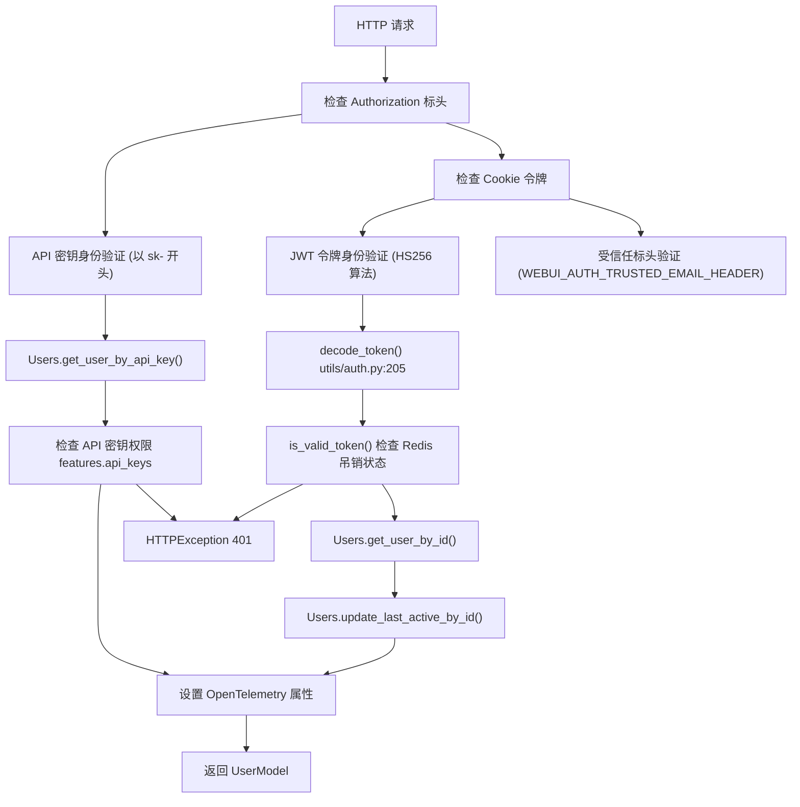
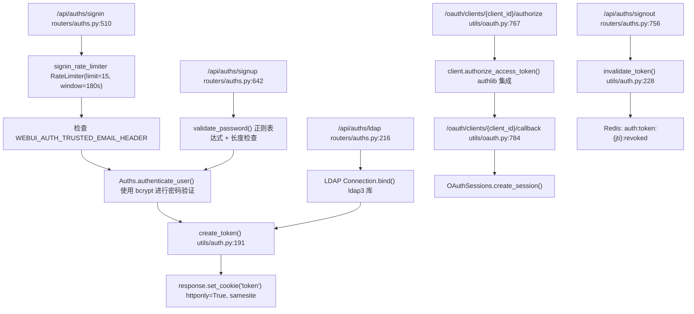
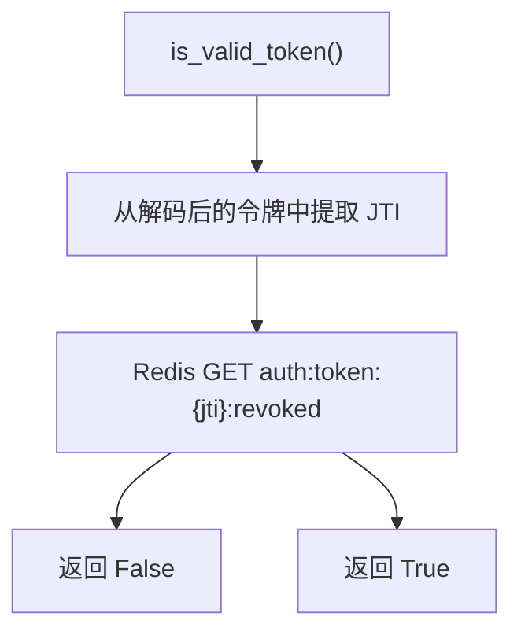
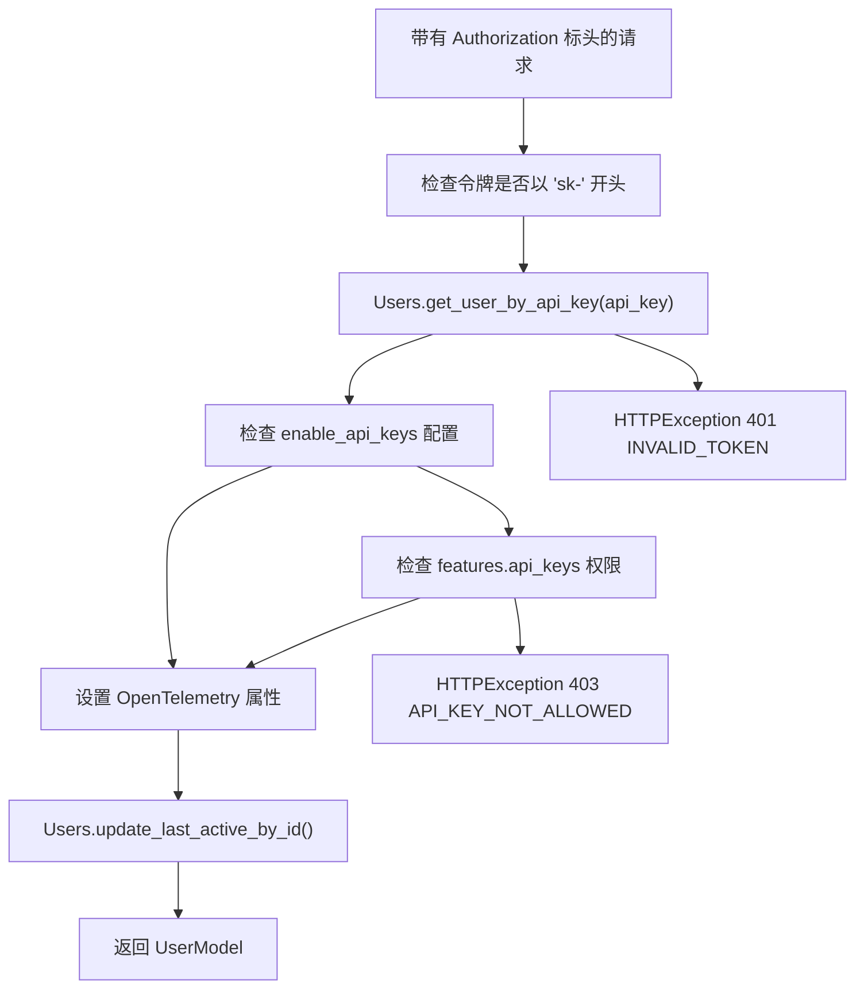
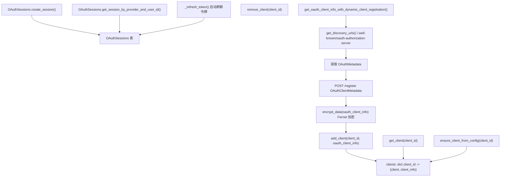
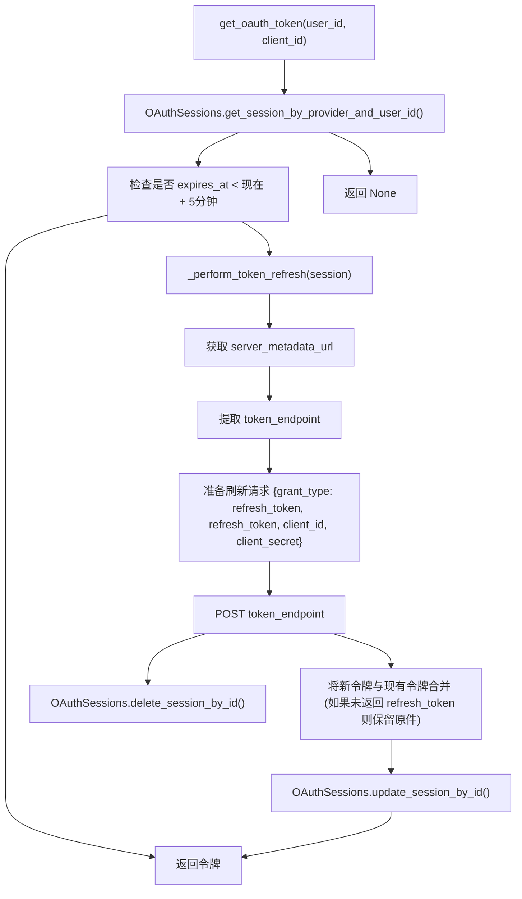
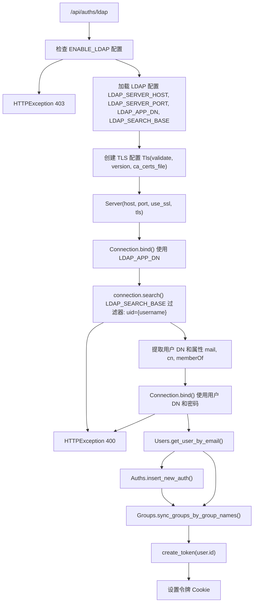
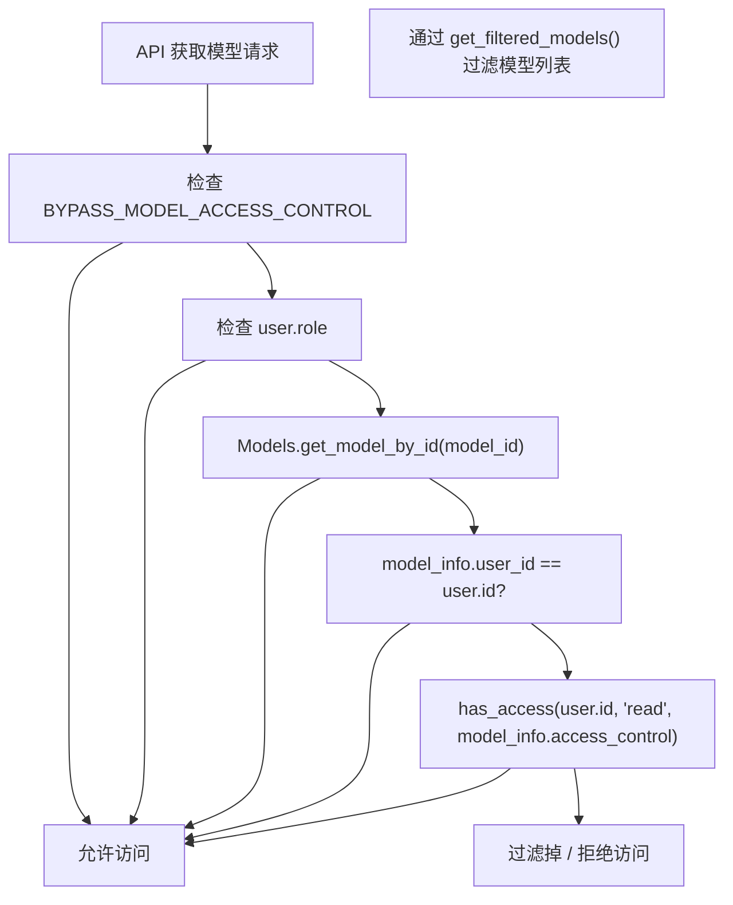
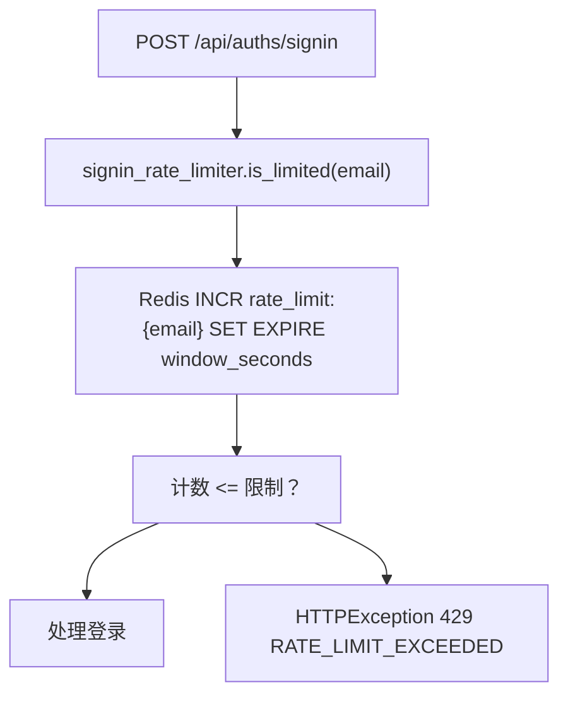

# 身份验证和安全性

相关源文件

-   [backend/open\_webui/env.py](https://github.com/open-webui/open-webui/blob/a7271532/backend/open_webui/env.py)
-   [backend/open\_webui/routers/audio.py](https://github.com/open-webui/open-webui/blob/a7271532/backend/open_webui/routers/audio.py)
-   [backend/open\_webui/routers/auths.py](https://github.com/open-webui/open-webui/blob/a7271532/backend/open_webui/routers/auths.py)
-   [backend/open\_webui/routers/ollama.py](https://github.com/open-webui/open-webui/blob/a7271532/backend/open_webui/routers/ollama.py)
-   [backend/open\_webui/routers/openai.py](https://github.com/open-webui/open-webui/blob/a7271532/backend/open_webui/routers/openai.py)
-   [backend/open\_webui/utils/auth.py](https://github.com/open-webui/open-webui/blob/a7271532/backend/open_webui/utils/auth.py)
-   [backend/open\_webui/utils/embeddings.py](https://github.com/open-webui/open-webui/blob/a7271532/backend/open_webui/utils/embeddings.py)
-   [backend/open\_webui/utils/misc.py](https://github.com/open-webui/open-webui/blob/a7271532/backend/open_webui/utils/misc.py)
-   [backend/open\_webui/utils/oauth.py](https://github.com/open-webui/open-webui/blob/a7271532/backend/open_webui/utils/oauth.py)
-   [backend/open\_webui/utils/response.py](https://github.com/open-webui/open-webui/blob/a7271532/backend/open_webui/utils/response.py)

本文档描述了 Open WebUI 中的身份验证和安全系统，包括身份验证方法、令牌管理、访问控制和安全功能。有关各个身份验证方法的具体实现细节，请参阅[身份验证方法](/open-webui/open-webui/10.1-authentication-methods)。有关 OAuth 的具体配置，请参阅 [OAuth 集成](/open-webui/open-webui/10.2-oauth-integration)。有关 LDAP 设置，请参阅 [LDAP 集成](/open-webui/open-webui/10.3-ldap-integration)。有关基于角色的权限，请参阅[访问控制和 RBAC](/open-webui/open-webui/10.4-access-control-and-rbac)。有关会话处理，请参阅[令牌和会话管理](/open-webui/open-webui/10.5-token-and-session-management)。

## 概览

Open WebUI 实现了一个多层安全架构，支持五种不同的身份验证方法，具有全面的令牌管理、基于角色的访问控制和分布式会话处理。系统使用 JWT 令牌作为主要的身份验证机制，并可选配基于 Redis 的吊销列表、bcrypt 密码哈希以及可配置的安全策略。

**核心安全组件：**

| 组件 | 用途 | 关键文件 |
| --- | --- | --- |
| JWT 身份验证 | 主要的基于令牌的身份验证 | `utils/auth.py` |
| API 密钥身份验证 | 以 `sk-*` 格式进行的编程式访问 | `utils/auth.py` |
| OAuth 2.0 管理器 | 具有动态客户端注册功能的 SSO 集成 | `utils/oauth.py` |
| LDAP 连接器 | Active Directory 集成 | `routers/auths.py` |
| 受信任标头 (Trusted Header) 验证 | 反向代理身份验证 | `routers/auths.py` |
| 令牌吊销 | 基于 Redis 的黑名单 | `utils/auth.py` |
| 密码安全性 | 带有验证功能的 bcrypt 哈希 | `utils/auth.py` |
| 速率限制 | 基于 Redis 的请求节流 | `routers/auths.py` |

来源：[backend/open\_webui/utils/auth.py1-416](https://github.com/open-webui/open-webui/blob/a7271532/backend/open_webui/utils/auth.py#L1-L416) [backend/open\_webui/utils/oauth.py1-1463](https://github.com/open-webui/open-webui/blob/a7271532/backend/open_webui/utils/oauth.py#L1-L1463) [backend/open\_webui/routers/auths.py1-1000](https://github.com/open-webui/open-webui/blob/a7271532/backend/open_webui/routers/auths.py#L1-L1000) [backend/open\_webui/env.py400-476](https://github.com/open-webui/open-webui/blob/a7271532/backend/open_webui/env.py#L400-L476)

## 身份验证架构

### 身份验证方法选择流程


来源：[backend/open\_webui/utils/auth.py269-365](https://github.com/open-webui/open-webui/blob/a7271532/backend/open_webui/utils/auth.py#L269-L365) [backend/open\_webui/utils/auth.py367-398](https://github.com/open-webui/open-webui/blob/a7271532/backend/open_webui/utils/auth.py#L367-L398)

### 身份验证端点架构


来源：[backend/open\_webui/routers/auths.py510-635](https://github.com/open-webui/open-webui/blob/a7271532/backend/open_webui/routers/auths.py#L510-L635) [backend/open\_webui/routers/auths.py642-754](https://github.com/open-webui/open-webui/blob/a7271532/backend/open_webui/routers/auths.py#L642-L754) [backend/open\_webui/routers/auths.py216-503](https://github.com/open-webui/open-webui/blob/a7271532/backend/open_webui/routers/auths.py#L216-L503) [backend/open\_webui/routers/auths.py756-855](https://github.com/open-webui/open-webui/blob/a7271532/backend/open_webui/routers/auths.py#L756-L855)

## JWT 令牌管理

### 令牌结构和生命周期

Open WebUI 使用具有 HS256 签名算法的 JWT 令牌。每个令牌都包含一个唯一的 JTI (JWT ID) 用于吊销跟踪。

**令牌创建：**

```
# 来自 utils/auth.py:191-202 的令牌结构
{
    "id": user.id,          # 用户标识符
    "exp": expire_timestamp, # 过期时间
    "jti": uuid4_string     # 用于吊销的唯一令牌 ID
}
```
**令牌配置：**

| 环境变量 | 默认值 | 用途 |
| --- | --- | --- |
| `WEBUI_SECRET_KEY` | `"t0p-s3cr3t"` | JWT 签名密钥 (HS256) |
| `JWT_EXPIRES_IN` | 配置值 | 令牌过期时长 (例如 `"7d"`, `"24h"`) |
| `WEBUI_AUTH_COOKIE_SAME_SITE` | `"lax"` | Cookie SameSite 策略 |
| `WEBUI_AUTH_COOKIE_SECURE` | `false` | Cookie 是否需要 HTTPS |

来源：[backend/open\_webui/env.py450-473](https://github.com/open-webui/open-webui/blob/a7271532/backend/open_webui/env.py#L450-L473) [backend/open\_webui/utils/auth.py49-50](https://github.com/open-webui/open-webui/blob/a7271532/backend/open_webui/utils/auth.py#L49-L50) [backend/open\_webui/utils/auth.py191-202](https://github.com/open-webui/open-webui/blob/a7271532/backend/open_webui/utils/auth.py#L191-L202)

### 令牌吊销系统

> **[Mermaid sequence]**
> *(图表结构无法解析)*

**令牌验证流程：**


来源：[backend/open\_webui/utils/auth.py213-226](https://github.com/open-webui/open-webui/blob/a7271532/backend/open_webui/utils/auth.py#L213-L226) [backend/open\_webui/utils/auth.py228-248](https://github.com/open-webui/open-webui/blob/a7271532/backend/open_webui/utils/auth.py#L228-L248) [backend/open\_webui/routers/auths.py756-855](https://github.com/open-webui/open-webui/blob/a7271532/backend/open_webui/routers/auths.py#L756-L855)

## 密码安全性

### 密码哈希和验证

Open WebUI 使用 bcrypt 进行密码哈希处理，并具有自动加盐功能。密码验证是可选的，且可通过正则表达式模式进行配置。

**哈希实现：**

```
# 来自 utils/auth.py:160-162
def get_password_hash(password: str) -> str:
    """使用 bcrypt 对密码进行哈希处理"""
    return bcrypt.hashpw(password.encode("utf-8"), bcrypt.gensalt()).decode("utf-8")

# 来自 utils/auth.py:179-188
def verify_password(plain_password: str, hashed_password: str) -> bool:
    """验证密码是否与其哈希值匹配"""
    return bcrypt.checkpw(
        plain_password.encode("utf-8"),
        hashed_password.encode("utf-8")
    )
```
**密码验证配置：**

| 环境变量 | 默认值 | 用途 |
| --- | --- | --- |
| `ENABLE_PASSWORD_VALIDATION` | `false` | 启用正则表达式验证 |
| `PASSWORD_VALIDATION_REGEX_PATTERN` | `^(?=.*[a-z])(?=.*[A-Z])(?=.*\d)(?=.*[^\w\s]).{8,}$` | 要求：小写、大写、数字、特殊字符、长度 8+ |

**密码长度限制：**

-   最大值：72 字节 (bcrypt 限制)
-   超过 72 字节的密码在登录期间会在 UTF-8 边界处被截断
-   验证机制在注册/更改密码期间强制执行最大值

来源：[backend/open\_webui/utils/auth.py160-188](https://github.com/open-webui/open-webui/blob/a7271532/backend/open_webui/utils/auth.py#L160-L188) [backend/open\_webui/env.py421-436](https://github.com/open-webui/open-webui/blob/a7271532/backend/open_webui/env.py#L421-L436) [backend/open\_webui/routers/auths.py577-585](https://github.com/open-webui/open-webui/blob/a7271532/backend/open_webui/routers/auths.py#L577-L585)

## API 密钥身份验证

### API 密钥格式和验证

API 密钥使用 `sk-{无连字符的 uuid}` 格式，其中 UUID 提供了 128 位的随机性。

**API 密钥创建：**

```
# 来自 utils/auth.py:254-256
def create_api_key():
    key = str(uuid.uuid4()).replace("-", "")
    return f"sk-{key}"
```
**API 密钥身份验证流程：**


**API 密钥权限要求：**

| 用户角色 | 要求 |
| --- | --- |
| `admin` | 始终允许 |
| `user` | 需要 `features.api_keys` 权限或 `enable_api_keys` 配置标志 |

来源：[backend/open\_webui/utils/auth.py254-256](https://github.com/open-webui/open-webui/blob/a7271532/backend/open_webui/utils/auth.py#L254-L256) [backend/open\_webui/utils/auth.py367-398](https://github.com/open-webui/open-webui/blob/a7271532/backend/open_webui/utils/auth.py#L367-L398)

## OAuth 2.0 架构

### OAuth 客户端管理

Open WebUI 实现了遵循 RFC 7591 的 OAuth 2.0 动态客户端注册 (DCR)，支持向授权服务器进行自动客户端注册。


**OAuth 客户端元数据结构：**

```
# 来自 utils/oauth.py:86-102
class OAuthClientInformationFull:
    issuer: Optional[str]                    # OAuth 服务器元数据 URL
    client_id: str                           # 客户端标识符
    client_secret: str | None                # 客户端密钥 (如果适用)
    client_id_issued_at: int | None         # Unix 时间戳
    client_secret_expires_at: int | None    # Unix 时间戳
    server_metadata: Optional[OAuthMetadata] # 获取到的元数据
    redirect_uris: list[str]                # 回调 URL
    grant_types: list[str]                  # ["authorization_code", "refresh_token"]
    token_endpoint_auth_method: str         # "client_secret_post" (默认)
```
来源：[backend/open\_webui/utils/oauth.py403-511](https://github.com/open-webui/open-webui/blob/a7271532/backend/open_webui/utils/oauth.py#L403-L511) [backend/open\_webui/utils/oauth.py86-102](https://github.com/open-webui/open-webui/blob/a7271532/backend/open_webui/utils/oauth.py#L86-L102) [backend/open\_webui/utils/oauth.py284-401](https://github.com/open-webui/open-webui/blob/a7271532/backend/open_webui/utils/oauth.py#L284-L401)

### OAuth 授权流程

> **[Mermaid sequence]**
> *(图表结构无法解析)*

**OAuth 令牌存储：**

令牌存储在 `OAuthSessions` 表中，具有自动过期跟踪功能：

```
# 存储在数据库中的令牌结构
{
    "access_token": "...",
    "refresh_token": "...",  # 可选
    "expires_in": 3600,
    "expires_at": 1704067200,  # Unix 时间戳
    "issued_at": 1704063600,   # Unix 时间戳
    "token_type": "Bearer"
}
```
来源：[backend/open\_webui/utils/oauth.py767-782](https://github.com/open-webui/open-webui/blob/a7271532/backend/open_webui/utils/oauth.py#L767-L782) [backend/open\_webui/utils/oauth.py784-863](https://github.com/open-webui/open-webui/blob/a7271532/backend/open_webui/utils/oauth.py#L784-L863) [backend/open\_webui/utils/oauth.py809-830](https://github.com/open-webui/open-webui/blob/a7271532/backend/open_webui/utils/oauth.py#L809-L830)

### OAuth 令牌刷新


**令牌刷新配置：**

-   当 `expires_at < 现在 + 5 分钟` 时，令牌会自动刷新
-   如果新令牌响应中未返回 `refresh_token`，则保留原始 `refresh_token`
-   刷新尝试失败会导致会话被删除
-   可以通过 `force_refresh=True` 参数强制刷新令牌

来源：[backend/open\_webui/utils/oauth.py601-646](https://github.com/open-webui/open-webui/blob/a7271532/backend/open_webui/utils/oauth.py#L601-L646) [backend/open\_webui/utils/oauth.py647-675](https://github.com/open-webui/open-webui/blob/a7271532/backend/open_webui/utils/oauth.py#L647-L675) [backend/open\_webui/utils/oauth.py676-765](https://github.com/open-webui/open-webui/blob/a7271532/backend/open_webui/utils/oauth.py#L676-L765)

## LDAP 身份验证

### LDAP 连接流程


**LDAP 配置变量：**

| 环境变量 | 用途 |
| --- | --- |
| `LDAP_SERVER_HOST` | LDAP 服务器主机名 |
| `LDAP_SERVER_PORT` | LDAP 服务器端口 (389 或 636) |
| `LDAP_USE_TLS` | 启用 TLS/SSL 连接 |
| `LDAP_APP_DN` | 应用程序绑定 DN |
| `LDAP_APP_PASSWORD` | 应用程序绑定密码 |
| `LDAP_SEARCH_BASE` | 用户搜索的基础 DN |
| `LDAP_SEARCH_FILTERS` | 额外的 LDAP 过滤器 |
| `LDAP_ATTRIBUTE_FOR_USERNAME` | 用户名属性 (例如 `uid`, `sAMAccountName`) |
| `LDAP_ATTRIBUTE_FOR_MAIL` | 电子邮件属性 (例如 `mail`) |
| `LDAP_ATTRIBUTE_FOR_GROUPS` | 组属性 (例如 `memberOf`) |

**LDAP 组同步：**

当启用 `ENABLE_LDAP_GROUP_MANAGEMENT` 时：

1.  从 `memberOf` 属性中提取组 DN
2.  从每个 DN 中解析 CN (Common Name)：`CN=GroupName,OU=Groups,DC=example,DC=com` → `GroupName`
3.  如果启用了 `ENABLE_LDAP_GROUP_CREATION`，则可选地通过 `Groups.create_groups_by_group_names()` 创建组
4.  通过 `Groups.sync_groups_by_group_names()` 同步用户的组成员身份

来源：[backend/open\_webui/routers/auths.py216-503](https://github.com/open-webui/open-webui/blob/a7271532/backend/open_webui/routers/auths.py#L216-L503) [backend/open\_webui/routers/auths.py278-390](https://github.com/open-webui/open-webui/blob/a7271532/backend/open_webui/routers/auths.py#L278-L390) [backend/open\_webui/routers/auths.py470-484](https://github.com/open-webui/open-webui/blob/a7271532/backend/open_webui/routers/auths.py#L470-L484)

## 访问控制和模型权限

### 基于角色的访问控制 (RBAC)

Open WebUI 实现了三种具有层级权限的用户角色：

| 角色 | 描述 | 默认分配 |
| --- | --- | --- |
| `admin` | 拥有完整系统访问权限、配置管理 | 仅限第一个注册的用户 |
| `user` | 标准访问权限，具有模型限制 | 之后注册的用户 |
| `pending` | 受限访问权限，需要批准 | 默认不使用 |

**角色执行点：**

```
# 仅限管理员的端点保护 (utils/auth.py:409-415)
def get_admin_user(user=Depends(get_current_user)):
    if user.role != "admin":
        raise HTTPException(status_code=401, detail=ERROR_MESSAGES.ACCESS_PROHIBITED)
    return user

# 已验证用户的端点保护 (utils/auth.py:400-406)
def get_verified_user(user=Depends(get_current_user)):
    if user.role not in {"user", "admin"}:
        raise HTTPException(status_code=401, detail=ERROR_MESSAGES.ACCESS_PROHIBITED)
    return user
```
来源：[backend/open\_webui/utils/auth.py400-415](https://github.com/open-webui/open-webui/blob/a7271532/backend/open_webui/utils/auth.py#L400-L415) [backend/open\_webui/routers/auths.py677-684](https://github.com/open-webui/open-webui/blob/a7271532/backend/open_webui/routers/auths.py#L677-L684)

### 模型访问控制


**模型访问控制绕过：**

`BYPASS_MODEL_ACCESS_CONTROL` 环境变量会禁用所有模型级的访问控制检查，授予所有用户访问所有模型的权限，无论其所有权或 ACL 设置如何。

**模型过滤实现：**

```
# 来自 routers/openai.py:456-466 和 routers/ollama.py:424-434
async def get_filtered_models(models, user):
    filtered_models = []
    for model in models.get("models", []):  # 或者是 OpenAI 的 models.get("data", [])
        model_info = Models.get_model_by_id(model["id"])
        if model_info:
            if user.id == model_info.user_id or has_access(
                user.id, type="read", access_control=model_info.access_control
            ):
                filtered_models.append(model)
    return filtered_models
```
来源：[backend/open\_webui/env.py438-440](https://github.com/open-webui/open-webui/blob/a7271532/backend/open_webui/env.py#L438-L440) [backend/open\_webui/routers/openai.py456-466](https://github.com/open-webui/open-webui/blob/a7271532/backend/open_webui/routers/openai.py#L456-L466) [backend/open\_webui/routers/ollama.py424-434](https://github.com/open-webui/open-webui/blob/a7271532/backend/open_webui/routers/ollama.py#L424-L434)

## 速率限制

### 速率限制器实现

速率限制使用 Redis 进行分布式状态跟踪，具有可配置的限制次数和时间窗口。

**登录速率限制器配置：**

```
# 来自 routers/auths.py:84-86
signin_rate_limiter = RateLimiter(
    redis_client=get_redis_client(),
    limit=5 * 3,    # 15 次请求
    window=60 * 3   # 180 秒 (3 分钟)
)
```
**速率限制流程：**


**速率限制范围：**

-   应用于每个电子邮件地址的登录尝试
-   需要 Redis 连接以存储状态
-   滑动窗口实现（窗口过期后计数重置）
-   超过限制时返回 HTTP 429 (Too Many Requests)

来源：[backend/open\_webui/routers/auths.py84-86](https://github.com/open-webui/open-webui/blob/a7271532/backend/open_webui/routers/auths.py#L84-L86) [backend/open\_webui/routers/auths.py571-576](https://github.com/open-webui/open-webui/blob/a7271532/backend/open_webui/routers/auths.py#L571-L576)

## 受信任标头 (Trusted Header) 验证

受信任标头验证允许反向代理处理身份验证，并通过 HTTP 标头传递用户身份。

**配置：**

| 环境变量 | 用途 |
| --- | --- |
| `WEBUI_AUTH_TRUSTED_EMAIL_HEADER` | 用户电子邮件的标头名称 (例如 `X-Forwarded-Email`) |
| `WEBUI_AUTH_TRUSTED_NAME_HEADER` | 用户显示名称的标头名称 |
| `WEBUI_AUTH_TRUSTED_GROUPS_HEADER` | 组员身份的标头名称 (逗号分隔) |

**受信任标头流程：**

> **[Mermaid sequence]**
> *(图表结构无法解析)*

**安全注意事项：**

-   受信任标头验证 **必须** 在配置得当的反向代理之后使用
-   代理必须从客户端请求中剥离/覆盖这些标头
-   切勿将受信任标头端点直接暴露给互联网
-   用户密码被设置为随机 UUID（身份验证委托给代理）

来源：[backend/open\_webui/env.py412-418](https://github.com/open-webui/open-webui/blob/a7271532/backend/open_webui/env.py#L412-L418) [backend/open\_webui/routers/auths.py518-548](https://github.com/open-webui/open-webui/blob/a7271532/backend/open_webui/routers/auths.py#L518-L548)

## 安全功能

### Cookie 安全配置

所有身份验证 Cookie 均根据环境变量配置了安全标志：

| Cookie 名称 | 用途 | 配置 |
| --- | --- | --- |
| `token` | JWT 身份验证令牌 | `httponly=True`, `samesite=WEBUI_AUTH_COOKIE_SAME_SITE`, `secure=WEBUI_AUTH_COOKIE_SECURE` |
| `oui-session` | 会话跟踪 | 与 `token` 相同 |
| `oauth_id_token` | OAuth ID 令牌 (可选) | 由 `ENABLE_OAUTH_ID_TOKEN_COOKIE` 控制 |
| `oauth_session_id` | OAuth 会话标识符 | 与 `token` 相同 |

**Cookie 标志：**

-   `httponly=True`：防止 JavaScript 访问，减轻 XSS 攻击
-   `samesite`：控制跨站请求行为 (`"lax"`, `"strict"`, 或 `"none"`)
-   `secure`：设置为 `true` 时需要 HTTPS
-   `expires`：设置为 JWT 过期时间戳

来源：[backend/open\_webui/env.py457-473](https://github.com/open-webui/open-webui/blob/a7271532/backend/open_webui/env.py#L457-L473) [backend/open\_webui/routers/auths.py126-137](https://github.com/open-webui/open-webui/blob/a7271532/backend/open_webui/routers/auths.py#L126-L137) [backend/open\_webui/routers/auths.py609-616](https://github.com/open-webui/open-webui/blob/a7271532/backend/open_webui/routers/auths.py#L609-L616)

### 敏感数据加密

**OAuth 客户端凭据加密：**

OAuth 客户端信息（包括 `client_secret`）在存储前使用 Fernet（对称加密）进行加密：

```
# 来自 utils/oauth.py:134-145
FERNET = None
if len(OAUTH_CLIENT_INFO_ENCRYPTION_KEY) != 44:
    key_bytes = hashlib.sha256(OAUTH_CLIENT_INFO_ENCRYPTION_KEY.encode()).digest()
    OAUTH_CLIENT_INFO_ENCRYPTION_KEY = base64.urlsafe_b64encode(key_bytes)
else:
    OAUTH_CLIENT_INFO_ENCRYPTION_KEY = OAUTH_CLIENT_INFO_ENCRYPTION_KEY.encode()

try:
    FERNET = Fernet(OAUTH_CLIENT_INFO_ENCRYPTION_KEY)
except Exception as e:
    log.error(f"Error initializing Fernet with provided key: {e}")
    raise
```
**加密函数：**

```
# 来自 utils/oauth.py:147-165
def encrypt_data(data) -> str:
    """加密数据以便存储"""
    data_json = json.dumps(data)
    encrypted = FERNET.encrypt(data_json.encode()).decode()
    return encrypted

def decrypt_data(data: str):
    """从存储中解密数据"""
    decrypted = FERNET.decrypt(data.encode()).decode()
    return json.loads(decrypted)
```
**加密密钥：**

| 环境变量 | 用途 | 默认值 |
| --- | --- | --- |
| `OAUTH_CLIENT_INFO_ENCRYPTION_KEY` | OAuth 客户端数据密钥 | `WEBUI_SECRET_KEY` |
| `OAUTH_SESSION_TOKEN_ENCRYPTION_KEY` | OAuth 会话令牌密钥 | `WEBUI_SECRET_KEY` |

来源：[backend/open\_webui/utils/oauth.py134-165](https://github.com/open-webui/open-webui/blob/a7271532/backend/open_webui/utils/oauth.py#L134-L165) [backend/open\_webui/env.py493-499](https://github.com/open-webui/open-webui/blob/a7271532/backend/open_webui/env.py#L493-L499)

### 审计日志

审计日志捕捉身份验证和授权事件，用于安全监控和合规。

**审计日志级别：**

| 级别 | 捕捉的事件 |
| --- | --- |
| `NONE` | 禁用 |
| `METADATA` | 用户 ID、端点、时间戳 |
| `REQUEST` | 元数据 + 请求体 (截断至 `MAX_BODY_LOG_SIZE`) |
| `REQUEST_RESPONSE` | 元数据 + 请求 + 响应 |

**配置：**

| 环境变量 | 默认值 | 用途 |
| --- | --- | --- |
| `AUDIT_LOG_LEVEL` | `"NONE"` | 日志详细程度 |
| `AUDIT_LOGS_FILE_PATH` | `{DATA_DIR}/audit.log` | 日志文件位置 |
| `AUDIT_LOG_FILE_ROTATION_SIZE` | `"10MB"` | 轮转阈值 |
| `MAX_BODY_LOG_SIZE` | `2048` | 最大记录请求体字节数 |
| `AUDIT_EXCLUDED_PATHS` | `"/chats,/chat,/folders"` | 审计时排除的路径 |

来源：[backend/open\_webui/env.py778-806](https://github.com/open-webui/open-webui/blob/a7271532/backend/open_webui/env.py#L778-L806)

### OpenTelemetry 集成

身份验证事件使用 OpenTelemetry 进行追踪以实现可观测性：

**身份验证期间设置的 Span 属性：**

```
# 来自 utils/auth.py:290-296
current_span = trace.get_current_span()
if current_span:
    current_span.set_attribute("client.user.id", user.id)
    current_span.set_attribute("client.user.email", user.email)
    current_span.set_attribute("client.user.role", user.role)
    current_span.set_attribute("client.auth.type", "api_key")  # 或 "jwt"
```
**追踪配置：**

OpenTelemetry 追踪通过 [backend/open\_webui/env.py812-875](https://github.com/open-webui/open-webui/blob/a7271532/backend/open_webui/env.py#L812-L875) 中定义的环境变量启用，包括：

-   `ENABLE_OTEL_TRACES`
-   `OTEL_EXPORTER_OTLP_ENDPOINT`
-   `OTEL_SERVICE_NAME`
-   `OTEL_TRACES_SAMPLER`

来源：[backend/open\_webui/utils/auth.py290-296](https://github.com/open-webui/open-webui/blob/a7271532/backend/open_webui/utils/auth.py#L290-L296) [backend/open\_webui/utils/auth.py334-340](https://github.com/open-webui/open-webui/blob/a7271532/backend/open_webui/utils/auth.py#L334-L340) [backend/open\_webui/env.py812-875](https://github.com/open-webui/open-webui/blob/a7271532/backend/open_webui/env.py#L812-L875)

## 会话管理

### 最后活跃状态追踪

用户活动通过后台任务异步追踪，以避免阻塞请求处理：

```
# 来自 utils/auth.py:342-345
if background_tasks:
    background_tasks.add_task(Users.update_last_active_by_id, user.id)
```
**更新间隔配置：**

`DATABASE_USER_ACTIVE_STATUS_UPDATE_INTERVAL` 环境变量控制最后活跃时间戳更新之间的最小间隔（秒）。在高流量场景中，将此值设置得更高可以减少数据库写入负载。

来源：[backend/open\_webui/utils/auth.py342-345](https://github.com/open-webui/open-webui/blob/a7271532/backend/open_webui/utils/auth.py#L342-L345) [backend/open\_webui/env.py331-341](https://github.com/open-webui/open-webui/blob/a7271532/backend/open_webui/env.py#L331-L341)

### 会话持久化

会话通过多种机制实现持久化：

1.  **JWT 令牌**：具有可选 Redis 吊销功能的无状态身份验证
2.  **OAuth 会话**：`OAuthSessions` 表中数据库支持的会话
3.  **Cookies**：针对 Web 浏览器客户端的 HTTP-only Cookie
4.  **Redis**：针对分布式部署的可选会话状态 (通过 `REDIS_URL`)

**会话过期：**

-   JWT 令牌根据 `JWT_EXPIRES_IN` 配置过期
-   OAuth 访问令牌根据来自令牌响应的 `expires_in` 过期
-   Cookie 在 JWT 过期时过期
-   Redis 吊销条目在令牌过期时过期（自动 TTL）

来源：[backend/open\_webui/utils/auth.py191-202](https://github.com/open-webui/open-webui/blob/a7271532/backend/open_webui/utils/auth.py#L191-L202) [backend/open\_webui/env.py361-377](https://github.com/open-webui/open-webui/blob/a7271532/backend/open_webui/env.py#L361-L377)
