# 身份验证方法

相关源文件

-   [backend/open\_webui/env.py](https://github.com/open-webui/open-webui/blob/a7271532/backend/open_webui/env.py)
-   [backend/open\_webui/routers/audio.py](https://github.com/open-webui/open-webui/blob/a7271532/backend/open_webui/routers/audio.py)
-   [backend/open\_webui/routers/auths.py](https://github.com/open-webui/open-webui/blob/a7271532/backend/open_webui/routers/auths.py)
-   [backend/open\_webui/routers/ollama.py](https://github.com/open-webui/open-webui/blob/a7271532/backend/open_webui/routers/ollama.py)
-   [backend/open\_webui/routers/openai.py](https://github.com/open-webui/open-webui/blob/a7271532/backend/open_webui/routers/openai.py)
-   [backend/open\_webui/utils/auth.py](https://github.com/open-webui/open-webui/blob/a7271532/backend/open_webui/utils/auth.py)
-   [backend/open\_webui/utils/embeddings.py](https://github.com/open-webui/open-webui/blob/a7271532/backend/open_webui/utils/embeddings.py)
-   [backend/open\_webui/utils/misc.py](https://github.com/open-webui/open-webui/blob/a7271532/backend/open_webui/utils/misc.py)
-   [backend/open\_webui/utils/oauth.py](https://github.com/open-webui/open-webui/blob/a7271532/backend/open_webui/utils/oauth.py)
-   [backend/open\_webui/utils/response.py](https://github.com/open-webui/open-webui/blob/a7271532/backend/open_webui/utils/response.py)

本页记录了 Open WebUI 中用于验证用户身份的核心身份验证方法。内容涵盖了本地密码身份验证、JWT 令牌生命周期、API 密钥身份验证以及用于反向代理部署的受信任请求头身份验证。

有关 OAuth/OIDC 集成，请参阅 [OAuth 集成](/open-webui/open-webui/10.2-oauth-integration)。有关 LDAP 身份验证，请参阅 [LDAP 集成](/open-webui/open-webui/10.3-ldap-integration)。有关授权与权限，请参阅 [权限与 RBAC](/open-webui/open-webui/10.4-access-control-and-rbac)。有关令牌管理的详细实现，请参阅 [会话与令牌管理](/open-webui/open-webui/10.5-token-and-session-management)。

## 身份验证方法概览

Open WebUI 支持四种主要的身份验证方法，可以独立使用或组合使用：

| 身份验证方法 | 用途 | 令牌格式 | 配置 |
| --- | --- | --- | --- |
| **本地密码** | 通过 Web UI 进行标准用户登录 | Cookie 或 `Authorization` 请求头中的 JWT | `WEBUI_AUTH=true` (默认) |
| **JWT 令牌** | 任何登录方式后的基于会话的身份验证 | `Bearer <token>` | `WEBUI_SECRET_KEY` |
| **API 密钥** | 脚本/应用程序的编程式访问 | `Authorization` 请求头中的 `sk-<uuid>` | `ENABLE_API_KEYS=true` |
| **受信任请求头** | 反向代理身份验证 (SSO) | 自定义请求头中的电子邮件 | `WEBUI_AUTH_TRUSTED_EMAIL_HEADER` |

**来源：** [backend/open\_webui/env.py413-428](https://github.com/open-webui/open-webui/blob/a7271532/backend/open_webui/env.py#L413-L428) [backend/open\_webui/utils/auth.py159-418](https://github.com/open-webui/open-webui/blob/a7271532/backend/open_webui/utils/auth.py#L159-L418) [backend/open\_webui/routers/auths.py507-632](https://github.com/open-webui/open-webui/blob/a7271532/backend/open_webui/routers/auths.py#L507-L632)

## 身份验证配置

### 全局身份验证设置


**来源：** [backend/open\_webui/env.py413-428](https://github.com/open-webui/open-webui/blob/a7271532/backend/open_webui/env.py#L413-L428) [backend/open\_webui/routers/auths.py32-49](https://github.com/open-webui/open-webui/blob/a7271532/backend/open_webui/routers/auths.py#L32-L49)

### 关键配置变量

| 变量 | 类型 | 默认值 | 描述 |
| --- | --- | --- | --- |
| `WEBUI_AUTH` | boolean | `true` | 身份验证系统的总开关 |
| `WEBUI_SECRET_KEY` | string | `"t0p-s3cr3t"` | JWT 签名密钥 (生产环境必须修改) |
| `ENABLE_PASSWORD_AUTH` | boolean | `true` | 允许本地密码身份验证 |
| `ENABLE_API_KEYS` | boolean | 可配置 | 允许创建和使用 API 密钥 |
| `ENABLE_PASSWORD_VALIDATION` | boolean | `false` | 强制执行密码复杂度要求 |
| `PASSWORD_VALIDATION_REGEX_PATTERN` | regex | 复杂模式 | 用于密码验证的正则表达式 |
| `WEBUI_AUTH_COOKIE_SAME_SITE` | string | `"lax"` | 身份验证 Cookie 的 SameSite 属性 |
| `WEBUI_AUTH_COOKIE_SECURE` | boolean | `false` | 身份验证 Cookie 是否要求 HTTPS |

**来源：** [backend/open\_webui/env.py413-481](https://github.com/open-webui/open-webui/blob/a7271532/backend/open_webui/env.py#L413-L481)

## 本地密码身份验证

本地密码身份验证提供传统的用户名/密码登录功能，使用 bcrypt 进行密码哈希处理并签发 JWT 令牌。

### 密码存储与验证


系统使用 bcrypt 进行密码哈希处理，并自动生成盐 (salt)：

-   **哈希处理**：`get_password_hash()` 使用带有 `bcrypt.gensalt()` 的 `bcrypt.hashpw()`。
-   **验证**：`verify_password()` 使用 `bcrypt.checkpw()` 进行恒定时间比较。
-   **长度限制**：bcrypt 强制执行最大 72 字节的限制；较长的密码会被截断，并带有 UTF-8 错误处理。

**来源：** [backend/open\_webui/utils/auth.py162-190](https://github.com/open-webui/open-webui/blob/a7271532/backend/open_webui/utils/auth.py#L162-L190) [backend/open\_webui/routers/auths.py574-585](https://github.com/open-webui/open-webui/blob/a7271532/backend/open_webui/routers/auths.py#L574-L585)

### 密码验证

当 `ENABLE_PASSWORD_VALIDATION=true` 时，密码必须匹配配置的正则表达式模式：

```text
# 默认模式 (来自 env.py:437-442)
PASSWORD_VALIDATION_REGEX_PATTERN = "^(?=.*[a-z])(?=.*[A-Z])(?=.*\d)(?=.*[^\w\s]).{8,}$"
```
默认要求：

-   至少 8 个字符
-   一个小写字母
-   一个大写字母
-   一个数字
-   一个特殊字符

验证发生在 [backend/open\_webui/utils/auth.py167-178](https://github.com/open-webui/open-webui/blob/a7271532/backend/open_webui/utils/auth.py#L167-L178) 的 `validate_password()` 中。

**来源：** [backend/open\_webui/env.py434-442](https://github.com/open-webui/open-webui/blob/a7271532/backend/open_webui/env.py#L434-L442) [backend/open\_webui/utils/auth.py167-178](https://github.com/open-webui/open-webui/blob/a7271532/backend/open_webui/utils/auth.py#L167-L178)

### 登录流程

> **[Mermaid sequence]**
> *(图表结构无法解析)*

**关键实现细节：**

1.  **速率限制**：`signin_rate_limiter` 允许每个电子邮件地址每 3 分钟进行 15 次尝试。
2.  **密码截断**：超过 72 字节的密码会被截断，以确保 bcrypt 兼容性。
3.  **Cookie 设置**：令牌设置在 HTTP-only Cookie 中，具有可配置的 SameSite 和 Secure 属性。
4.  **响应**：返回 JWT 令牌、用户信息和权限。

**来源：** [backend/open\_webui/routers/auths.py507-632](https://github.com/open-webui/open-webui/blob/a7271532/backend/open_webui/routers/auths.py#L507-L632) [backend/open\_webui/routers/auths.py86-88](https://github.com/open-webui/open-webui/blob/a7271532/backend/open_webui/routers/auths.py#L86-L88)

### 注册流程

> **[Mermaid sequence]**
> *(图表结构无法解析)*

**关键实现细节：**

1.  **首位用户**：第一个注册的用户会自动成为管理员；在首位用户注册后，`ENABLE_SIGNUP` 可能被禁用。
2.  **电子邮件验证**：使用 `validate_email_format()` 检查电子邮件结构。
3.  **密码验证**：如果 `ENABLE_PASSWORD_VALIDATION=true`，则强制执行复杂度规则。
4.  **默认组**：如果配置了 `DEFAULT_GROUP_ID`，则自动将用户分配到该组。
5.  **Webhook**：如果配置了 `WEBHOOK_URL`，则触发 Webhook 通知。

**来源：** [backend/open\_webui/routers/auths.py639-751](https://github.com/open-webui/open-webui/blob/a7271532/backend/open_webui/routers/auths.py#L639-L751)

## JWT 令牌身份验证

JWT (JSON Web Token) 是任何身份验证方法之后的主要会话机制。所有身份验证方法最终都会为后续请求签发一个 JWT 令牌。

### 令牌结构与声明 (Claims)


**令牌声明：**

| 声明 (Claim) | 类型 | 描述 |
| --- | --- | --- |
| `id` | string | 用户 ID (主标识符) |
| `exp` | int | 过期时间戳 (Unix 时间戳) |
| `jti` | string | JWT ID (用于撤销追踪的 UUID v4) |

**来源：** [backend/open\_webui/utils/auth.py51-52](https://github.com/open-webui/open-webui/blob/a7271532/backend/open_webui/utils/auth.py#L51-L52) [backend/open\_webui/utils/auth.py193-204](https://github.com/open-webui/open-webui/blob/a7271532/backend/open_webui/utils/auth.py#L193-L204)

### 令牌生命周期

> **[Mermaid stateDiagram]**
> *(图表结构无法解析)*

**令牌过期：**

令牌过期受 `JWT_EXPIRES_IN` 配置控制，由 `parse_duration()` 解析：

-   **格式**：`-1` (永不过期), `0` (会话有效), 或时长字符串 (`30s`, `5m`, `1h`, `7d`, `1w`)。
-   **默认行为**：按每次部署的配置而定。
-   **Cookie 过期**：设置为与 JWT 的 `exp` 声明匹配，以便自动清理。

**令牌撤销：**

当 Redis 可用时，令牌可以在过期前被撤销：

1.  从令牌中提取 `jti` (JWT ID)。
2.  在 Redis 中存储：`{REDIS_KEY_PREFIX}:auth:token:{jti}:revoked` = `"1"`。
3.  将 TTL 设置为等于令牌的剩余寿命。
4.  后续请求在接受令牌前会检查 Redis。

**来源：** [backend/open\_webui/utils/auth.py193-250](https://github.com/open-webui/open-webui/blob/a7271532/backend/open_webui/utils/auth.py#L193-L250) [backend/open\_webui/routers/auths.py589-597](https://github.com/open-webui/open-webui/blob/a7271532/backend/open_webui/routers/auths.py#L589-L597)

### 令牌传输与验证


**`get_current_user()` 中的验证步骤：**

1.  **提取**：从 `Authorization: Bearer` 请求头或 `token` Cookie 中提取令牌。
2.  **解码**：使用 `SESSION_SECRET` 和 `HS256` 算法解码 JWT。
3.  **检查撤销**：查询 Redis 是否有被撤销的 JTI（如果 Redis 可用）。
4.  **验证用户**：使用 `id` 声明从数据库加载用户。
5.  **更新活动**：后台任务更新 `last_active` 时间戳。
6.  **添加遥测**：为 OpenTelemetry span 属性设置用户信息。

**来源：** [backend/open\_webui/utils/auth.py271-367](https://github.com/open-webui/open-webui/blob/a7271532/backend/open_webui/utils/auth.py#L271-L367)

### Cookie 配置

JWT 令牌通过具有安全属性的 HTTP-only Cookie 传输：

```python
response.set_cookie(
    key="token",
    value=token,
    expires=datetime_expires_at,
    httponly=True,                            # JavaScript 无法访问
    samesite=WEBUI_AUTH_COOKIE_SAME_SITE,    # 默认值: "lax"
    secure=WEBUI_AUTH_COOKIE_SECURE          # 默认值: false
)
```
| 属性 | 值 | 用途 |
| --- | --- | --- |
| `httponly` | `True` | 通过阻断 JavaScript 访问来防止 XSS 攻击 |
| `samesite` | `lax`/`strict`/`none` | CSRF 保护；`lax` 允许导航 |
| `secure` | `true`/`false` | 要求使用 HTTPS；在生产环境中应设为 `true` |
| `expires` | ISO 时间戳 | 与 JWT 的 `exp` 匹配，以便自动清理 |

**来源：** [backend/open\_webui/env.py464-480](https://github.com/open-webui/open-webui/blob/a7271532/backend/open_webui/env.py#L464-L480) [backend/open\_webui/routers/auths.py605-613](https://github.com/open-webui/open-webui/blob/a7271532/backend/open_webui/routers/auths.py#L605-L613)

## API 密钥身份验证

API 密钥为 Open WebUI API 的编程式访问提供了长寿命的身份验证令牌。它们专为脚本、CI/CD 流水线和集成而设计。

### API 密钥格式与生成


**格式：** `sk-<32_位十六进制字符>`

**示例：** `sk-a1b2c3d4e5f6g7h8i9j0k1l2m3n4o5p6`

`sk-` 前缀将该令牌标识为 API 密钥（将其与 JWT 令牌区分开来），并遵循常见的 API 密钥惯例。

**来源：** [backend/open\_webui/utils/auth.py256-258](https://github.com/open-webui/open-webui/blob/a7271532/backend/open_webui/utils/auth.py#L256-L258)

### API 密钥管理端点

| 端点 | 方法 | 描述 | 所需权限 |
| --- | --- | --- | --- |
| `/auth/api_key` | POST | 生成新的 API 密钥 | `features.api_keys` 或管理员 |
| `/auth/api_key` | GET | 检索当前 API 密钥 | 已认证用户 |
| `/auth/api_key` | DELETE | 删除 API 密钥 | 已认证用户 |

**密钥管理流程：**

> **[Mermaid sequence]**
> *(图表结构无法解析)*

**来源：** [backend/open\_webui/routers/auths.py1148-1185](https://github.com/open-webui/open-webui/blob/a7271532/backend/open_webui/routers/auths.py#L1148-L1185)

### API 密钥身份验证流程


**验证步骤：**

1.  **前缀检查**：令牌以 `sk-` 开头，以路由到 API 密钥身份验证。
2.  **查找**：在 `users.api_key` 中查询匹配的密钥。
3.  **配置检查**：验证应用级别是否启用了 `ENABLE_API_KEYS`。
4.  **权限检查**：用户必须是管理员或拥有 `features.api_keys` 权限。
5.  **活动更新**：更新 `last_active` 时间戳（同步执行，而非后台执行）。
6.  **遥测**：向 OpenTelemetry span 添加 `client.auth.type="api_key"`。

**来源：** [backend/open\_webui/utils/auth.py288-300](https://github.com/open-webui/open-webui/blob/a7271532/backend/open_webui/utils/auth.py#L288-L300) [backend/open\_webui/utils/auth.py369-399](https://github.com/open-webui/open-webui/blob/a7271532/backend/open_webui/utils/auth.py#L369-L399)

### API 密钥安全考量

| 方面 | 实现方式 | 安全收益 |
| --- | --- | --- |
| **存储** | 在 `users.api_key` 中以明文存储 | 允许查找；用户必须妥善保护密钥 |
| **每用户一个** | 每个用户仅限一个 API 密钥 | 限制了受攻击面 |
| **权限门控** | 需要 `features.api_keys` 权限 | 管理员可控制谁能使用 API 密钥 |
| **全局开关** | `ENABLE_API_KEYS` 配置 | 如果不需要，可以完全禁用 |
| **无过期时间** | 密钥不会自动过期 | 必须手动轮换/删除 |
| **速率限制** | API 密钥未实现速率限制 | 考虑在反向代理中添加 |

**最佳实践：**

-   定期轮换 API 密钥。
-   使用环境变量将密钥存储在客户端应用程序中。
-   删除未使用的 API 密钥。
-   通过活动日志监控 API 密钥的使用情况。
-   如果仅需要 OAuth，考虑禁用 API 密钥。

**来源：** [backend/open\_webui/routers/auths.py1148-1185](https://github.com/open-webui/open-webui/blob/a7271532/backend/open_webui/routers/auths.py#L1148-L1185)

## 受信任请求头身份验证

受信任请求头身份验证通过 Nginx、Apache 等反向代理，或 Authelia、Authentik、Keycloak Gatekeeper 等身份验证网关实现单点登录 (SSO) 集成。

### 配置


**⚠️ 安全警告：** 受信任请求头身份验证假定请求头是由受信任的反向代理注入的。如果直接暴露在互联网上而没有代理，将允许请求头伪造和身份验证绕过。

**配置变量：**

| 变量 | 是否必需 | 示例 | 描述 |
| --- | --- | --- | --- |
| `WEBUI_AUTH_TRUSTED_EMAIL_HEADER` | 是 | `X-Forwarded-User` | 包含用户电子邮件的请求头 |
| `WEBUI_AUTH_TRUSTED_NAME_HEADER` | 否 | `X-Forwarded-Preferred-Username` | 包含用户显示名称的请求头 |
| `WEBUI_AUTH_TRUSTED_GROUPS_HEADER` | 否 | `X-Forwarded-Groups` | 逗号分隔的组名列表 |

**来源：** [backend/open\_webui/env.py425-431](https://github.com/open-webui/open-webui/blob/a7271532/backend/open_webui/env.py#L425-L431) [backend/open\_webui/routers/auths.py515-545](https://github.com/open-webui/open-webui/blob/a7271532/backend/open_webui/routers/auths.py#L515-L545)

### 受信任请求头身份验证流程

> **[Mermaid sequence]**
> *(图表结构无法解析)*

**关键实现细节：**

1.  **请求头要求**：所有请求中必须存在 `WEBUI_AUTH_TRUSTED_EMAIL_HEADER`。
2.  **自动配置**：用户在首次访问时自动创建，并带有随机的 UUID 密码。
3.  **名称解码**：URL 编码的名称将使用 UTF-8 进行解码。
4.  **组同步**：如果配置了 `WEBUI_AUTH_TRUSTED_GROUPS_HEADER`，则在每次登录时同步用户组。
5.  **管理员豁免**：管理员用户跳过用户组同步。
6.  **禁用操作**：启用受信任请求头后，禁止修改密码。

**来源：** [backend/open\_webui/routers/auths.py515-545](https://github.com/open-webui/open-webui/blob/a7271532/backend/open_webui/routers/auths.py#L515-L545) [backend/open\_webui/routers/auths.py195-196](https://github.com/open-webui/open-webui/blob/a7271532/backend/open_webui/routers/auths.py#L195-L196)

### 反向代理配置示例

**配合 Authelia 的 Nginx 配置：**

```nginx
location / {
    proxy_pass http://open-webui:8080;

    # 从 Authelia 转发身份验证请求头
    proxy_set_header X-Forwarded-User $remote_user;
    proxy_set_header X-Forwarded-Preferred-Username $http_remote_name;
    proxy_set_header X-Forwarded-Groups $http_remote_groups;

    # 标准代理请求头
    proxy_set_header Host $host;
    proxy_set_header X-Real-IP $remote_addr;
    proxy_set_header X-Forwarded-For $proxy_add_x_forwarded_for;
    proxy_set_header X-Forwarded-Proto $scheme;
}
```
**Open WebUI 环境：**

```bash
WEBUI_AUTH_TRUSTED_EMAIL_HEADER=X-Forwarded-User
WEBUI_AUTH_TRUSTED_NAME_HEADER=X-Forwarded-Preferred-Username
WEBUI_AUTH_TRUSTED_GROUPS_HEADER=X-Forwarded-Groups
```
**来源：** [backend/open\_webui/routers/auths.py515-545](https://github.com/open-webui/open-webui/blob/a7271532/backend/open_webui/routers/auths.py#L515-L545)

### 受信任请求头 + JWT 验证

配置受信任请求头后，Open WebUI 仍会签发 JWT 令牌，但会增加额外的验证：


位于 [backend/open\_webui/utils/auth.py326-334](https://github.com/open-webui/open-webui/blob/a7271532/backend/open_webui/utils/auth.py#L326-L334) 的此项额外检查可以防止在代理的身份验证已更改但 JWT Cookie 仍然有效的情况下发生会话劫持。

**来源：** [backend/open\_webui/utils/auth.py326-334](https://github.com/open-webui/open-webui/blob/a7271532/backend/open_webui/utils/auth.py#L326-L334)

## 请求身份验证流程

传入请求的完整身份验证流程整合了所有身份验证方法：

```mermaid
flowchart TD
    Start["传入 HTTP 请求"]
    ExtractToken["从 Authorization 请求头或 Cookie 中提取令牌"]
    CheckFormat["检查令牌格式"]
    IsAPIKey["令牌是否以 'sk-' 开头？"]
    IsJWT["是否为有效的 JWT 格式？"]
    GetUserByKey["Users.get_user_by_api_key()"]
    CheckAPIEnabled["检查 ENABLE_API_KEYS"]
    CheckAPIPermission["检查 features.api_keys 权限"]
    ReturnAPIUser["返回用户对象"]
    DecodeJWT["decode_token()"]
    CheckRevoked["is_valid_token() (Redis 撤销检查)"]
    GetUserByID["Users.get_user_by_id()"]
    CheckTrustedHeader["是否配置了受信任电子邮件请求头？"]
    ValidateTrustedHeader["验证请求头是否匹配 user.email"]
    UpdateLastActive["后台执行: update_last_active_by_id()"]
    ReturnJWTUser["返回用户对象"]
    NoToken["未找到令牌"]
    InvalidToken["令牌无效或已过期"]
    RevokedToken["令牌已被撤销"]
    UserNotFound["未找到用户"]
    HeaderMismatch["受信任请求头不匹配"]
    Unauthorized["401 Unauthorized"]

    Start --> ExtractToken
    ExtractToken --> CheckFormat
    CheckFormat -- 是 --> IsAPIKey
    IsAPIKey -- 是 --> GetUserByKey
    IsAPIKey -- 否 --> IsJWT
    GetUserByKey --> CheckAPIEnabled
    CheckAPIEnabled -- 是 --> CheckAPIPermission
    CheckAPIPermission -- 是 --> ReturnAPIUser
    CheckAPIEnabled -- 否 --> Unauthorized
    CheckAPIPermission -- 否 --> Unauthorized
    GetUserByKey -- 失败 --> UserNotFound
    IsJWT -- 是 --> DecodeJWT
    IsJWT -- 否 --> InvalidToken
    DecodeJWT -- 成功 --> CheckRevoked
    DecodeJWT -- 失败 --> InvalidToken
    CheckRevoked -- 是 --> GetUserByID
    CheckRevoked -- 否 --> RevokedToken
    GetUserByID -- 成功 --> CheckTrustedHeader
    GetUserByID -- 失败 --> UserNotFound
    CheckTrustedHeader -- 否 --> UpdateLastActive
    CheckTrustedHeader -- 是 --> ValidateTrustedHeader
    ValidateTrustedHeader -- 是 --> UpdateLastActive
    ValidateTrustedHeader -- 否 --> HeaderMismatch
    UpdateLastActive --> ReturnJWTUser
    ExtractToken -- 无内容 --> NoToken
    NoToken --> Unauthorized
    InvalidToken --> Unauthorized
    RevokedToken --> Unauthorized
    UserNotFound --> Unauthorized
    HeaderMismatch --> Unauthorized
```


**来源：** [backend/open\_webui/utils/auth.py271-367](https://github.com/open-webui/open-webui/blob/a7271532/backend/open_webui/utils/auth.py#L271-L367) [backend/open\_webui/utils/auth.py369-399](https://github.com/open-webui/open-webui/blob/a7271532/backend/open_webui/utils/auth.py#L369-L399)

## 身份验证中间件与依赖

### FastAPI 依赖注入

Open WebUI 在路由处理器中使用 FastAPI 的依赖注入进行身份验证：

| 依赖项 | 所需角色 | 用法 |
| --- | --- | --- |
| `get_current_user` | 任何已认证用户 | 基础身份验证检查 |
| `get_verified_user` | `user` 或 `admin` | 排除状态为 `pending` 的用户 |
| `get_admin_user` | `admin` | 仅限管理员的端点 |

**用法示例：**

```python
# 来自 auths.py
@router.get("/admin/config")
async def get_admin_config(request: Request, user=Depends(get_admin_user)):
    # 仅管理员可以访问
    return {"config": ...}

@router.post("/update/profile")
async def update_profile(form_data: UpdateProfileForm, session_user=Depends(get_verified_user)):
    # 仅限已验证用户（非待处理状态）
    return Users.update_user_by_id(session_user.id, form_data)
```
**来源：** [backend/open\_webui/utils/auth.py402-418](https://github.com/open-webui/open-webui/blob/a7271532/backend/open_webui/utils/auth.py#L402-L418) [backend/open\_webui/routers/auths.py169-184](https://github.com/open-webui/open-webui/blob/a7271532/backend/open_webui/routers/auths.py#L169-L184)

### HTTPBearer 安全方案

`bearer_security` 对象处理 HTTP Bearer 令牌的提取：

```python
bearer_security = HTTPBearer(auto_error=False)
```
-   **禁用自动错误 (Auto-error disabled)**：当令牌不存在时返回 `None` 而不是抛出异常。
-   **回退到 Cookie**：如果 Bearer 令牌缺失，`get_current_user()` 会检查 Cookie。
-   **OpenAPI 集成**：自动在 API 文档中记录身份验证要求。

**来源：** [backend/open\_webui/utils/auth.py159](https://github.com/open-webui/open-webui/blob/a7271532/backend/open_webui/utils/auth.py#L159-L159) [backend/open\_webui/utils/auth.py275-283](https://github.com/open-webui/open-webui/blob/a7271532/backend/open_webui/utils/auth.py#L275-L283)

## 身份验证状态与遥测

### OpenTelemetry 集成

所有的身份验证方法都会向当前的 span 添加遥测属性：

```python
current_span = trace.get_current_span()
if current_span:
    current_span.set_attribute("client.user.id", user.id)
    current_span.set_attribute("client.user.email", user.email)
    current_span.set_attribute("client.user.role", user.role)
    current_span.set_attribute("client.auth.type", "jwt" | "api_key")
```
这使得在 Jaeger 或 Honeycomb 等分布式追踪系统中可以进行身份验证追踪。

**来源：** [backend/open\_webui/utils/auth.py293-298](https://github.com/open-webui/open-webui/blob/a7271532/backend/open_webui/utils/auth.py#L293-L298) [backend/open\_webui/utils/auth.py337-342](https://github.com/open-webui/open-webui/blob/a7271532/backend/open_webui/utils/auth.py#L337-L342)

### 速率限制

登录端点实现了速率限制，以防止暴力破解攻击：

```python
signin_rate_limiter = RateLimiter(
    redis_client=get_redis_client(),
    limit=5 * 3,      # 15 次尝试
    window=60 * 3     # 3 分钟
)
```
-   **限制**：每 3 分钟窗口期内 15 次尝试。
-   **键**：按电子邮件地址进行哈希处理。
-   **要求 Redis**：如果 Redis 不可用，则回退到无速率限制。
-   **响应**：超出限制时返回 429 Too Many Requests。

**来源：** [backend/open\_webui/routers/auths.py86-88](https://github.com/open-webui/open-webui/blob/a7271532/backend/open_webui/routers/auths.py#L86-L88) [backend/open\_webui/routers/auths.py568-572](https://github.com/open-webui/open-webui/blob/a7271532/backend/open_webui/routers/auths.py#L568-L572)

## 身份验证方法总结

下表总结了何时使用每种身份验证方法：

| 方法 | 最适合用于 | 安全等级 | 过期时间 | 是否可撤销 |
| --- | --- | --- | --- | --- |
| **本地密码** | 终端用户通过 Web UI | 高 (bcrypt + JWT) | 可配置 | 是 (通过 JWT) |
| **JWT 令牌** | 任何验证后的会话管理 | 高 (HMAC-SHA256) | 可配置 | 是 (配合 Redis) |
| **API 密钥** | 脚本、CI/CD、集成 | 中 (无自动过期) | 永不 | 仅通过删除 |
| **受信任请求头** | 配合反向代理的 SSO | 取决于代理 | 基于会话 | 通过代理 |

有关与外部提供商的 OAuth 集成，请参阅 [OAuth 集成](/open-webui/open-webui/10.2-oauth-integration)。有关企业目录的 LDAP 身份验证，请参阅 [LDAP 集成](/open-webui/open-webui/10.3-ldap-integration)。
