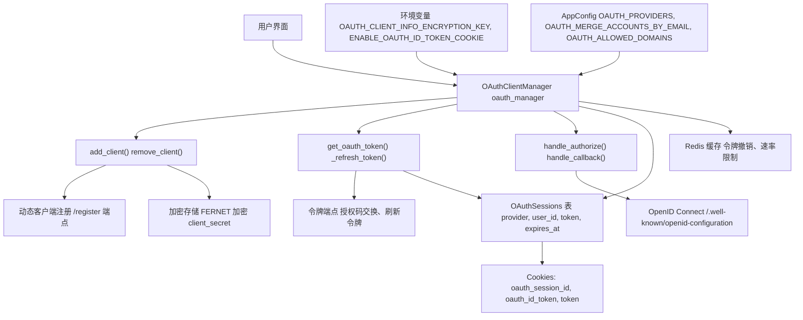
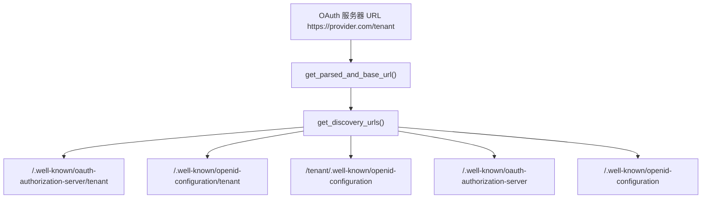
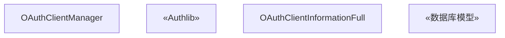
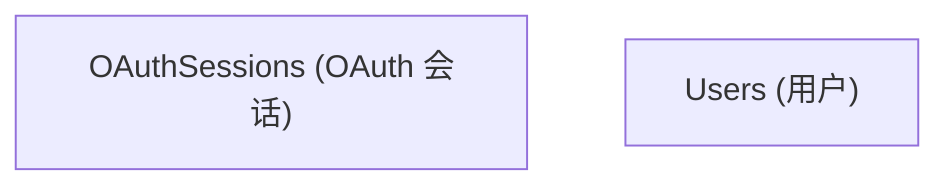
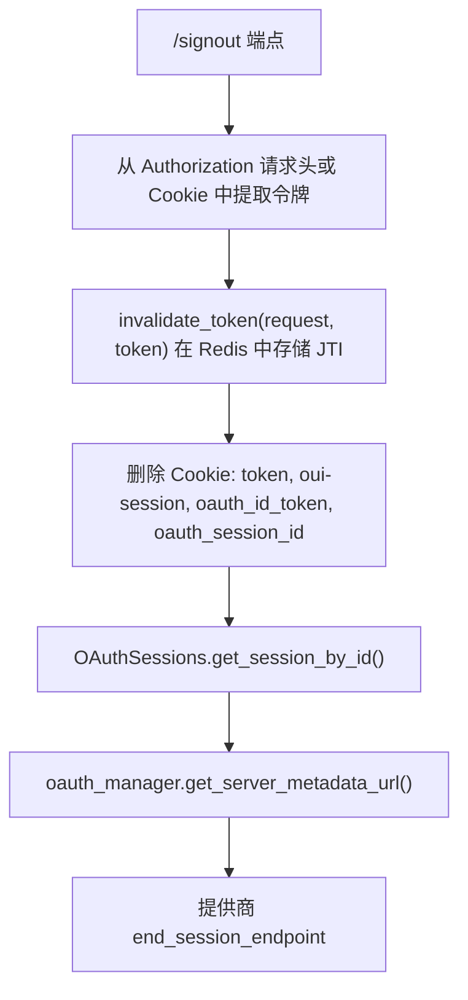
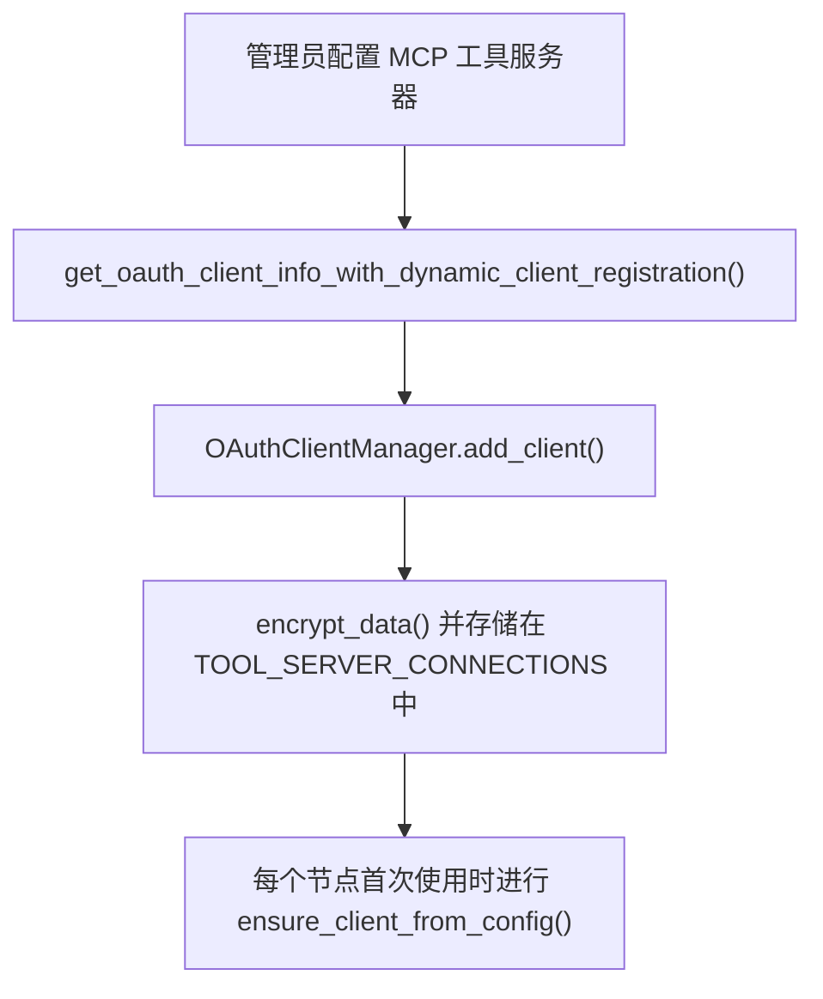

# OAuth 集成

相关源文件

-   [backend/open\_webui/env.py](https://github.com/open-webui/open-webui/blob/a7271532/backend/open_webui/env.py)
-   [backend/open\_webui/routers/audio.py](https://github.com/open-webui/open-webui/blob/a7271532/backend/open_webui/routers/audio.py)
-   [backend/open\_webui/routers/auths.py](https://github.com/open-webui/open-webui/blob/a7271532/backend/open_webui/routers/auths.py)
-   [backend/open\_webui/routers/ollama.py](https://github.com/open-webui/open-webui/blob/a7271532/backend/open_webui/routers/ollama.py)
-   [backend/open\_webui/routers/openai.py](https://github.com/open-webui/open-webui/blob/a7271532/backend/open_webui/routers/openai.py)
-   [backend/open\_webui/utils/auth.py](https://github.com/open-webui/open-webui/blob/a7271532/backend/open_webui/utils/auth.py)
-   [backend/open\_webui/utils/embeddings.py](https://github.com/open-webui/open-webui/blob/a7271532/backend/open_webui/utils/embeddings.py)
-   [backend/open\_webui/utils/misc.py](https://github.com/open-webui/open-webui/blob/a7271532/backend/open_webui/utils/misc.py)
-   [backend/open\_webui/utils/oauth.py](https://github.com/open-webui/open-webui/blob/a7271532/backend/open_webui/utils/oauth.py)
-   [backend/open\_webui/utils/response.py](https://github.com/open-webui/open-webui/blob/a7271532/backend/open_webui/utils/response.py)

本文档描述了 Open WebUI 中的 OAuth 2.0/2.1 身份验证系统，内容涵盖了动态客户端注册、令牌管理、会话处理以及与 LLM 提供者请求的集成。

有关常规身份验证方法（JWT、API 密钥、LDAP），请参阅 [身份验证方法](/open-webui/open-webui/10.1-authentication-methods)。有关访问控制和基于角色的权限，请参阅 [权限与 RBAC](/open-webui/open-webui/10.4-access-control-and-rbac)。

---

## 目的与架构

Open WebUI 实现了 OAuth 2.0/2.1 用于企业级单点登录 (SSO) 以及与外部服务的安全集成。该系统支持：

-   遵循 OAuth 2.0 规范的**动态客户端注册 (DCR)**。
-   **多提供商支持**（Google, Microsoft, GitHub, OpenID Connect, 飞书, 自定义 OIDC）。
-   带有服务器端会话存储的**自动令牌刷新**。
-   用于工具服务器身份验证的 **MCP (模型上下文协议) OAuth**。
-   用于向 LLM API 转发用户令牌的**系统 OAuth 模式**。

OAuth 实现主要包含在 `OAuthClientManager` 类中，该类处理客户端注册、令牌生命周期以及提供商元数据发现。

**来源：** [backend/open\_webui/utils/oauth.py403-511](https://github.com/open-webui/open-webui/blob/a7271532/backend/open_webui/utils/oauth.py#L403-L511) [backend/open\_webui/env.py483-499](https://github.com/open-webui/open-webui/blob/a7271532/backend/open_webui/env.py#L483-L499)

---

## 系统架构


**来源：** [backend/open\_webui/utils/oauth.py403-511](https://github.com/open-webui/open-webui/blob/a7271532/backend/open_webui/utils/oauth.py#L403-L511) [backend/open\_webui/models/oauth\_sessions.py](https://github.com/open-webui/open-webui/blob/a7271532/backend/open_webui/models/oauth_sessions.py) [backend/open\_webui/env.py483-499](https://github.com/open-webui/open-webui/blob/a7271532/backend/open_webui/env.py#L483-L499)

---

## 动态客户端注册

Open WebUI 会使用 OAuth 2.0 动态客户端注册 (RFC 7591) 自动向提供商注册为 OAuth 客户端。这为 MCP 工具服务器省去了手动配置客户端 ID/密钥的麻烦。

### 注册流程

> **[Mermaid sequence]**
> *(图表结构无法解析)*

### 发现 URL 生成

系统根据 MCP 规范和 OpenID Connect 标准尝试多个发现端点：


**关键函数：** `get_oauth_client_info_with_dynamic_client_registration(request, client_id, oauth_server_url, oauth_server_key)` 执行完整的注册工作流。

**来源：** [backend/open\_webui/utils/oauth.py243-280](https://github.com/open-webui/open-webui/blob/a7271532/backend/open_webui/utils/oauth.py#L243-L280) [backend/open\_webui/utils/oauth.py284-401](https://github.com/open-webui/open-webui/blob/a7271532/backend/open_webui/utils/oauth.py#L284-L401)

### 客户端元数据结构

| 类 | 字段 | 用途 |
| --- | --- | --- |
| `OAuthClientMetadata` | `client_name`, `redirect_uris`, `grant_types`, `response_types`, `scope`, `token_endpoint_auth_method` | 注册期间发送 |
| `OAuthClientInformationFull` | `client_id`, `client_secret`, `client_id_issued_at`, `client_secret_expires_at`, `issuer`, `server_metadata` | 从提供商接收并存储在本地 |
| `OAuthMetadata` (来自 MCP) | `authorization_endpoint`, `token_endpoint`, `registration_endpoint`, `scopes_supported`, `code_challenge_methods_supported` | 提供商的能力 |

**来源：** [backend/open\_webui/utils/oauth.py86-102](https://github.com/open-webui/open-webui/blob/a7271532/backend/open_webui/utils/oauth.py#L86-L102)

---

## OAuthClientManager

`OAuthClientManager` 类编排了所有的 OAuth 操作。每个应用程序创建一个实例并存储在 `app.state.oauth_manager` 中。


### 客户端懒加载

`ensure_client_from_config(client_id)` 实现了从持久化配置中懒加载 OAuth 客户端：

1.  检查 `client_id` 是否已注册在 `self.clients` 中。
2.  如果没有，在 `TOOL_SERVER_CONNECTIONS` 中搜索匹配的 MCP 服务器。
3.  从配置中解密 `oauth_client_info`。
4.  调用 `add_client()` 向 Authlib 注册。
5.  返回客户端实例。

这使得 OAuth 客户端可以在多节点部署中工作，而无需在启动时在每个节点上进行初始化。

**来源：** [backend/open\_webui/utils/oauth.py453-495](https://github.com/open-webui/open-webui/blob/a7271532/backend/open_webui/utils/oauth.py#L453-L495)

---

## 令牌管理与刷新

OAuth 令牌存储在服务器端的 `OAuthSessions` 数据库表中，并在过期前自动刷新。

### 令牌存储模式


`token` JSON 字段包含：

-   `access_token` - 当前访问令牌。
-   `refresh_token` - 用于续期的令牌。
-   `expires_in` - 距离过期的秒数。
-   `expires_at` - Unix 时间戳（计算得出）。
-   `issued_at` - Unix 时间戳（记录值）。
-   `token_type` - 通常为 "Bearer"。
-   `scope` - 已授予的权限范围。
-   `id_token` - 可选的 OpenID Connect ID 令牌。

**来源：** [backend/open\_webui/models/oauth\_sessions.py](https://github.com/open-webui/open-webui/blob/a7271532/backend/open_webui/models/oauth_sessions.py)

### 自动令牌刷新

> **[Mermaid sequence]**
> *(图表结构无法解析)*

**关键逻辑：**

-   当满足 `expires_at - now < 5 分钟` 时触发刷新。
-   如果未返回新的 `refresh_token`，则保留旧的。
-   刷新失败将删除该会话（用户必须重新授权）。
-   通过数据库事务隔离确保并发安全。

**来源：** [backend/open\_webui/utils/oauth.py601-675](https://github.com/open-webui/open-webui/blob/a7271532/backend/open_webui/utils/oauth.py#L601-L675) [backend/open\_webui/utils/oauth.py676-765](https://github.com/open-webui/open-webui/blob/a7271532/backend/open_webui/utils/oauth.py#L676-L765)

### 令牌刷新实现

`_perform_token_refresh(session)` 函数：

1.  通过 `get_client(client_id)` 检索 `client`。
2.  从服务器元数据 URL 获取 `token_endpoint`。
3.  构造带有 `grant_type=refresh_token` 的刷新请求。
4.  如果可用，则包含 `client_secret`（取决于 `token_endpoint_auth_method`）。
5.  将响应与现有令牌数据合并。
6.  根据 `expires_in` 重新计算 `expires_at`。

**来源：** [backend/open\_webui/utils/oauth.py676-765](https://github.com/open-webui/open-webui/blob/a7271532/backend/open_webui/utils/oauth.py#L676-L765)

---

## 授权流程

### 用户发起的 OAuth 登录

> **[Mermaid sequence]**
> *(图表结构无法解析)*

**重要：** `authorize_access_token(request)` 调用绝不能显式包含 `client_id`/`client_secret`，因为 Authlib 已经配置了这些信息。再次传递它们会导致拼接错误（例如 "ID1,ID1"）。

**来源：** [backend/open\_webui/utils/oauth.py767-782](https://github.com/open-webui/open-webui/blob/a7271532/backend/open_webui/utils/oauth.py#L767-L782) [backend/open\_webui/utils/oauth.py784-892](https://github.com/open-webui/open-webui/blob/a7271532/backend/open_webui/utils/oauth.py#L784-L892)

### 回调错误处理

`_build_oauth_callback_error_message(e)` 函数提供了用户友好的错误消息：

```text
# 处理的错误类型：
- OAuth2Error: 提取 error 和 error_description
- HTTPException: 提取 detail
- aiohttp.ClientResponseError: 显示上游状态
- KeyError (state): 表示会话已过期
- 通用 Exception: 显示异常消息
```
错误消息经过清理（移除换行符，最大 200 字符），以便安全地用于重定向。

**来源：** [backend/open\_webui/utils/oauth.py168-196](https://github.com/open-webui/open-webui/blob/a7271532/backend/open_webui/utils/oauth.py#L168-L196)

---

## 会话管理

### 基于 Cookie 的会话追踪

OAuth 会话使用了三个 Cookie：

| Cookie | 类型 | 用途 | 设置者 |
| --- | --- | --- | --- |
| `token` | JWT | 用户身份验证令牌 | 所有身份验证方法 |
| `oauth_session_id` | 字符串 | 链接到 `OAuthSessions.id` | `handle_callback()` |
| `oauth_id_token` | JWT | OpenID Connect ID 令牌（可选） | 当 `ENABLE_OAUTH_ID_TOKEN_COOKIE=True` 时的 `handle_callback()` |

**配置：**

-   `WEBUI_AUTH_COOKIE_SAME_SITE` - SameSite 策略（默认: "lax"）。
-   `WEBUI_AUTH_COOKIE_SECURE` - 是否要求 HTTPS（默认: false）。

**来源：** [backend/open\_webui/env.py457-473](https://github.com/open-webui/open-webui/blob/a7271532/backend/open_webui/env.py#L457-L473)

### 退出流程


如果提供商支持 RP 发起的注销（OpenID Connect `end_session_endpoint`），用户将被重定向到该处，并附带 `id_token_hint` 和 `post_logout_redirect_uri`。

**来源：** [backend/open\_webui/routers/auths.py756-823](https://github.com/open-webui/open-webui/blob/a7271532/backend/open_webui/routers/auths.py#L756-L823)

---

## 与 API 请求的集成

### 系统 OAuth 身份验证模式

当 API 端点配置了 `auth_type: "system_oauth"` 时，用户的 OAuth 令牌将被转发到 LLM 提供者：

> **[Mermaid sequence]**
> *(图表结构无法解析)*

**实现：**

```python
elif auth_type == "system_oauth":
    cookies = request.cookies
    oauth_token = None
    try:
        if request.cookies.get("oauth_session_id", None):
            oauth_token = await request.app.state.oauth_manager.get_oauth_token(
                user.id,
                request.cookies.get("oauth_session_id", None),
            )
    except Exception as e:
        log.error(f"Error getting OAuth token: {e}")

    if oauth_token:
        token = f"{oauth_token.get('access_token', '')}"
```
**来源：** [backend/open\_webui/routers/openai.py155-169](https://github.com/open-webui/open-webui/blob/a7271532/backend/open_webui/routers/openai.py#L155-L169)

### MCP 工具服务器 OAuth

对于模型上下文协议 (MCP) 工具服务器，客户端 ID 格式为 `mcp:{server_id}`。这些客户端从 `TOOL_SERVER_CONNECTIONS` 配置中懒加载。

**来源：** [backend/open\_webui/utils/oauth.py453-495](https://github.com/open-webui/open-webui/blob/a7271532/backend/open_webui/utils/oauth.py#L453-L495)

---

## 安全特性

### 客户端密钥加密

所有 OAuth 客户端凭据在静态存储时均使用 Fernet 对称加密进行加密：

```python
# 如果密钥不是 44 字节，则进行密钥衍生
if len(OAUTH_CLIENT_INFO_ENCRYPTION_KEY) != 44:
    key_bytes = hashlib.sha256(OAUTH_CLIENT_INFO_ENCRYPTION_KEY.encode()).digest()
    OAUTH_CLIENT_INFO_ENCRYPTION_KEY = base64.urlsafe_b64encode(key_bytes)

FERNET = Fernet(OAUTH_CLIENT_INFO_ENCRYPTION_KEY)

def encrypt_data(data) -> str:
    data_json = json.dumps(data)
    encrypted = FERNET.encrypt(data_json.encode()).decode()
    return encrypted

def decrypt_data(data: str):
    decrypted = FERNET.decrypt(data.encode()).decode()
    return json.loads(decrypted)
```
**配置：**

-   `OAUTH_CLIENT_INFO_ENCRYPTION_KEY` - 加密密钥（默认为 `WEBUI_SECRET_KEY`）。
-   `OAUTH_SESSION_TOKEN_ENCRYPTION_KEY` - 用于会话令牌的独立密钥（留作后用）。

**来源：** [backend/open\_webui/utils/oauth.py132-165](https://github.com/open-webui/open-webui/blob/a7271532/backend/open_webui/utils/oauth.py#L132-L165) [backend/open\_webui/env.py493-499](https://github.com/open-webui/open-webui/blob/a7271532/backend/open_webui/env.py#L493-L499)

### PKCE 支持

当提供商宣称支持时，会自动启用用于代码交换的证明密钥 (PKCE, RFC 7636)：

```python
if (
    oauth_client_info.server_metadata
    and oauth_client_info.server_metadata.code_challenge_methods_supported
):
    if "S256" in oauth_client_info.server_metadata.code_challenge_methods_supported:
        kwargs["code_challenge_method"] = "S256"
```
**来源：** [backend/open\_webui/utils/oauth.py434-445](https://github.com/open-webui/open-webui/blob/a7271532/backend/open_webui/utils/oauth.py#L434-L445)

### 基于组的访问控制

OAuth 提供商可以通过声明 (claims) 提供组成员身份，从而实现自动角色分配：

```python
# 使用通配符和正则表达式进行组过滤
def is_in_blocked_groups(group_name: str, groups: list) -> bool:
    """
    检查组名是否匹配任何被屏蔽的模式。
    支持精确匹配、Shell 风格通配符 (*, ?) 以及正则表达式模式。
    """
    for group_pattern in groups:
        # 精确匹配
        if group_name == group_pattern:
            return True

        # 正则表达式匹配
        if any(char in group_pattern for char in ["^", "$", "[", "]", "(", ")"]):
            try:
                if re.search(group_pattern, group_name):
                    return True
            except re.error:
                pass

        # 通配符匹配
        if "*" in group_pattern or "?" in group_pattern:
            if fnmatch.fnmatch(group_name, group_pattern):
                return True

    return False
```
**配置：**

-   `OAUTH_GROUPS_CLAIM` - 包含组信息的声明名称（默认: "groups"）。
-   `OAUTH_BLOCKED_GROUPS` - 拒绝访问的组模式。
-   `OAUTH_ALLOWED_ROLES` - 访问所需的角色。
-   `OAUTH_ADMIN_ROLES` - 授予管理员访问权限的角色。

**来源：** [backend/open\_webui/utils/oauth.py199-240](https://github.com/open-webui/open-webui/blob/a7271532/backend/open_webui/utils/oauth.py#L199-L240)

### 预检授权检查 (Preflight Authorization Check)

在存储注册的客户端之前，系统会通过测试授权端点来选择性地验证它：

```python
async def _preflight_authorization_url(self, client, client_info) -> bool:
    redirect_uri = str(client_info.redirect_uris[0]) if client_info.redirect_uris else None

    try:
        auth_data = await client.create_authorization_url(redirect_uri=redirect_uri)
        authorization_url = auth_data.get("url")

        async with aiohttp.ClientSession(trust_env=True) as session:
            async with session.get(authorization_url, allow_redirects=False) as resp:
                if resp.status < 400:
                    return True

                # 检查 invalid_client 错误
                error_message = await resp.text()
                if "invalid_client" in error_message.lower():
                    return False
    except Exception as e:
        log.debug(f"Skipping OAuth preflight: {e}")

    return True
```
这能及早发现注册失败（例如，重定向 URI 无效、客户端密钥已过期）。

**来源：** [backend/open\_webui/utils/oauth.py512-577](https://github.com/open-webui/open-webui/blob/a7271532/backend/open_webui/utils/oauth.py#L512-L577)

---

## 配置参考

### 环境变量

| 变量 | 默认值 | 描述 |
| --- | --- | --- |
| `ENABLE_OAUTH_EMAIL_FALLBACK` | `False` | 如果缺少用户名声明，则使用电子邮件声明 |
| `ENABLE_OAUTH_ID_TOKEN_COOKIE` | `True` | 在 Cookie 中存储 ID 令牌以便 SSO 注销 |
| `OAUTH_CLIENT_INFO_ENCRYPTION_KEY` | `WEBUI_SECRET_KEY` | 用于客户端密钥加密的 Fernet 密钥 |
| `OAUTH_SESSION_TOKEN_ENCRYPTION_KEY` | `WEBUI_SECRET_KEY` | 预留给未来的会话加密 |
| `WEBUI_AUTH_COOKIE_SAME_SITE` | `"lax"` | Cookie 的 SameSite 属性 |
| `WEBUI_AUTH_COOKIE_SECURE` | `False` | 是否要求 Cookie 使用 HTTPS |

**来源：** [backend/open\_webui/env.py483-499](https://github.com/open-webui/open-webui/blob/a7271532/backend/open_webui/env.py#L483-L499)

### AppConfig OAuth 设置

这些设置通过 `PersistentConfig` 存储在数据库中，并可通过 `request.app.state.config` 访问：

| 设置项 | 类型 | 用途 |
| --- | --- | --- |
| `ENABLE_OAUTH_SIGNUP` | `bool` | 允许通过 OAuth 创建新用户 |
| `OAUTH_MERGE_ACCOUNTS_BY_EMAIL` | `bool` | 将 OAuth 登录链接到现有账户 |
| `ENABLE_OAUTH_ROLE_MANAGEMENT` | `bool` | 根据 OAuth 声明更新用户角色 |
| `ENABLE_OAUTH_GROUP_MANAGEMENT` | `bool` | 从 OAuth 同步组成员身份 |
| `ENABLE_OAUTH_GROUP_CREATION` | `bool` | 根据 OAuth 声明自动创建组 |
| `OAUTH_BLOCKED_GROUPS` | `list[str]` | 拒绝访问的组模式 |
| `OAUTH_ROLES_CLAIM` | `str` | 包含角色信息的声明 |
| `OAUTH_SUB_CLAIM` | `str` | 用户唯一标识符的声明 |
| `OAUTH_GROUPS_CLAIM` | `str` | 包含组列表的声明 |
| `OAUTH_EMAIL_CLAIM` | `str` | 包含电子邮件地址的声明 |
| `OAUTH_PICTURE_CLAIM` | `str` | 包含个人资料图片 URL 的声明 |
| `OAUTH_USERNAME_CLAIM` | `str` | 包含用户名的声明 |
| `OAUTH_ALLOWED_ROLES` | `list[str]` | 访问所需的角色 |
| `OAUTH_ADMIN_ROLES` | `list[str]` | 授予管理员特权的角色 |
| `OAUTH_ALLOWED_DOMAINS` | `list[str]` | 电子邮件域名白名单 |
| `OAUTH_UPDATE_PICTURE_ON_LOGIN` | `bool` | 登录时根据 OAuth 声明更新头像 |
| `OAUTH_ACCESS_TOKEN_REQUEST_INCLUDE_CLIENT_ID` | `bool` | 在令牌请求体中包含 client\_id |
| `OAUTH_AUDIENCE` | `str` | OAuth audience 参数 |
| `OAUTH_GROUPS_SEPARATOR` | `str` | 解析组声明的分隔符 |
| `OAUTH_ROLES_SEPARATOR` | `str` | 解析角色声明的分隔符 |

**来源：** [backend/open\_webui/utils/oauth.py109-129](https://github.com/open-webui/open-webui/blob/a7271532/backend/open_webui/utils/oauth.py#L109-L129)

---

## API 端点

### OAuth 身份验证路由

| 端点 | 方法 | 用途 | 处理器 |
| --- | --- | --- | --- |
| `/oauth/{provider}/authorize` | GET | 发起 OAuth 流程 | `handle_authorize()` |
| `/oauth/clients/{client_id}/callback` | GET | 处理提供商回调 | `handle_callback()` |
| `/signout` | GET | 注销并清理会话 | `signout()` |

**来源：** [backend/open\_webui/routers/auths.py756-823](https://github.com/open-webui/open-webui/blob/a7271532/backend/open_webui/routers/auths.py#L756-L823)

### 动态注册流程


**来源：** [backend/open\_webui/utils/oauth.py284-401](https://github.com/open-webui/open-webui/blob/a7271532/backend/open_webui/utils/oauth.py#L284-L401)

---

## 错误处理

### 常见 OAuth 错误

| 错误模式 | 原因 | 解决方法 |
| --- | --- | --- |
| `invalid_client` | 客户端 ID/密钥不正确或已过期 | 通过动态客户端注册重新注册 |
| `invalid_grant` | 授权码已过期或已被使用 | 重新尝试授权流程 |
| `unauthorized_client` | 重定向 URI 不匹配 | 验证注册中的 `redirect_uris` |
| `access_denied` | 用户拒绝授权 | 无法通过编程方式修复 |
| `Missing state parameter` | OAuth 流程中会话过期 | 用户必须重新发起登录 |
| `Token exchange failed` | 提供商返回错误而非令牌 | 检查提供商日志，验证凭据 |

**错误消息构造：** 所有 OAuth 回调错误都通过 `_build_oauth_callback_error_message(e)` 进行清理，以生成简洁、面向用户的消息，不包含堆栈追踪或内部细节。

**来源：** [backend/open\_webui/utils/oauth.py168-196](https://github.com/open-webui/open-webui/blob/a7271532/backend/open_webui/utils/oauth.py#L168-L196)

### 令牌刷新失败处理

当 `_perform_token_refresh(session)` 失败时：

1.  函数返回 `None`。
2.  `get_oauth_token()` 中的调用代码检测到失败。
3.  通过 `OAuthSessions.delete_session_by_id(session.id)` 删除会话。
4.  用户收到 `None` 令牌，触发重新身份验证。

**来源：** [backend/open\_webui/utils/oauth.py636-640](https://github.com/open-webui/open-webui/blob/a7271532/backend/open_webui/utils/oauth.py#L636-L640)

---

## 多节点部署考量

### 客户端注册持久化

OAuth 客户端凭据必须存储在持久化配置中（由数据库支持的 `TOOL_SERVER_CONNECTIONS`），而不是仅存在于内存中，因为：

1.  动态注册在一个节点上发生一次。
2.  其他节点需要相同的 `client_id`/`client_secret` 来刷新令牌。
3.  `ensure_client_from_config()` 在每个节点上懒加载客户端。

### 会话存储

`OAuthSessions` 数据库表提供了跨节点的会话访问：

-   所有节点都可以查询并更新同一个会话。
-   在一个节点上的令牌刷新会更新所有节点的数据库。
-   会话共享不强制要求 Redis（Redis 仅用于令牌撤销）。

**来源：** [backend/open\_webui/utils/oauth.py453-495](https://github.com/open-webui/open-webui/blob/a7271532/backend/open_webui/utils/oauth.py#L453-L495)

---

## 实现说明

### 为什么要使用服务器端会话存储？

不同于标准的客户端存储令牌模式，Open WebUI 将令牌存储在服务器端的 `OAuthSessions` 中，原因如下：

1.  **安全性**：刷新令牌永远不会暴露给浏览器。
2.  **自动刷新**：后端处理令牌生命周期，无需前端介入。
3.  **多设备支持**：通过 `oauth_session_id` Cookie，同一个会话可以从多个设备访问。
4.  **可审计性**：数据库追踪令牌的使用情况和过期时间。

### 令牌端点身份验证方法

`OAuthClientMetadata` 中的 `token_endpoint_auth_method` 字段支持：

-   `client_secret_post` (默认) - 凭据位于 POST 请求体中。
-   `client_secret_basic` - 凭据位于 Authorization 请求头中 (HTTP Basic)。
-   `none` - 无密钥的公开客户端。

系统会根据提供商的 `token_endpoint_auth_methods_supported` 元数据自动选择方法。

**来源：** [backend/open\_webui/utils/oauth.py86-90](https://github.com/open-webui/open-webui/blob/a7271532/backend/open_webui/utils/oauth.py#L86-L90) [backend/open\_webui/utils/oauth.py326-334](https://github.com/open-webui/open-webui/blob/a7271532/backend/open_webui/utils/oauth.py#L326-L334)

### Authlib 集成

Open WebUI 使用了 Authlib 库的 Starlette 集成：

```python
from authlib.integrations.starlette_client import OAuth
from authlib.oidc.core import UserInfo

self.oauth = OAuth()
client = self.oauth.register(
    name=client_id,
    client_id=oauth_client_info.client_id,
    client_secret=oauth_client_info.client_secret,
    client_kwargs={...},
    server_metadata_url=oauth_client_info.issuer
)
```
**关键方法：**

-   `client.authorize_redirect(request, redirect_uri)` - 生成授权 URL。
-   `client.authorize_access_token(request)` - 交换令牌码。
-   `client.parse_id_token(request, token)` - 验证并解析 ID 令牌。

**来源：** [backend/open\_webui/utils/oauth.py405-451](https://github.com/open-webui/open-webui/blob/a7271532/backend/open_webui/utils/oauth.py#L405-L451)
