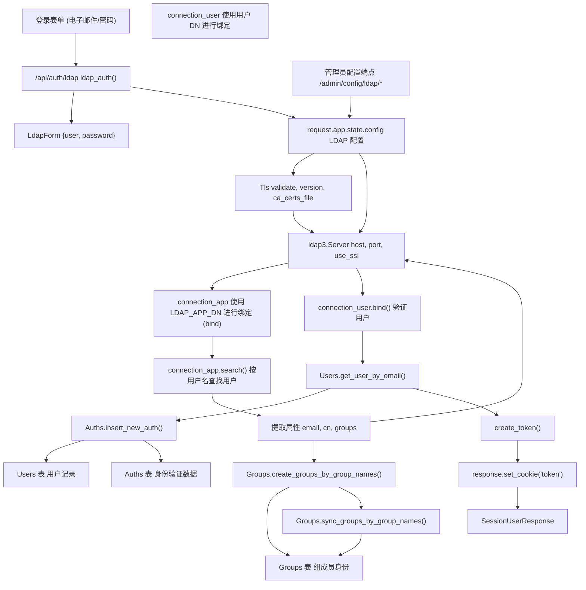
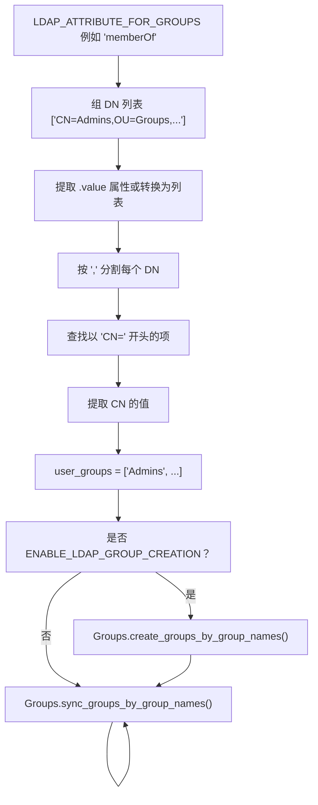

# LDAP 集成

相关源文件

-   [backend/open\_webui/env.py](https://github.com/open-webui/open-webui/blob/a7271532/backend/open_webui/env.py)
-   [backend/open\_webui/routers/audio.py](https://github.com/open-webui/open-webui/blob/a7271532/backend/open_webui/routers/audio.py)
-   [backend/open\_webui/routers/auths.py](https://github.com/open-webui/open-webui/blob/a7271532/backend/open_webui/routers/auths.py)
-   [backend/open\_webui/routers/ollama.py](https://github.com/open-webui/open-webui/blob/a7271532/backend/open_webui/routers/ollama.py)
-   [backend/open\_webui/routers/openai.py](https://github.com/open-webui/open-webui/blob/a7271532/backend/open_webui/routers/openai.py)
-   [backend/open\_webui/utils/auth.py](https://github.com/open-webui/open-webui/blob/a7271532/backend/open_webui/utils/auth.py)
-   [backend/open\_webui/utils/embeddings.py](https://github.com/open-webui/open-webui/blob/a7271532/backend/open_webui/utils/embeddings.py)
-   [backend/open\_webui/utils/misc.py](https://github.com/open-webui/open-webui/blob/a7271532/backend/open_webui/utils/misc.py)
-   [backend/open\_webui/utils/oauth.py](https://github.com/open-webui/open-webui/blob/a7271532/backend/open_webui/utils/oauth.py)
-   [backend/open\_webui/utils/response.py](https://github.com/open-webui/open-webui/blob/a7271532/backend/open_webui/utils/response.py)

本文档涵盖了 Open WebUI 中的 LDAP (轻量级目录访问协议) 身份验证集成，包括配置、身份验证流程、用户配置以及组同步。有关基于 OAuth 的身份验证，请参阅 [OAuth 集成](/open-webui/open-webui/10.2-oauth-integration)。有关通用身份验证概念和 JWT 令牌管理，请参阅 [身份验证方法](/open-webui/open-webui/10.1-authentication-methods)。

## 概述

Open WebUI 支持 LDAP 身份验证，以便与 Active Directory 或其他 LDAP 服务器集成。该集成允许用户使用其目录凭据进行身份验证，在首次登录时自动配置用户，并可选地从 LDAP 目录同步组成员身份。

LDAP 实现使用了 `ldap3` Python 库，并支持：

-   TLS/SSL 加密连接。
-   自定义证书验证。
-   灵活的属性映射。
-   用于用户访问控制的搜索过滤器。
-   自动用户配置。
-   LDAP 组到 Open WebUI 组的同步。
-   自动创建组。

## 架构


**来源：** [backend/open\_webui/routers/auths.py218-500](https://github.com/open-webui/open-webui/blob/a7271532/backend/open_webui/routers/auths.py#L218-L500) [backend/open\_webui/routers/auths.py1055-1140](https://github.com/open-webui/open-webui/blob/a7271532/backend/open_webui/routers/auths.py#L1055-L1140)

## 配置

### LDAP 服务器配置

LDAP 服务器设置存储在应用程序的动态配置系统中，可以通过管理员 API 端点或环境变量进行管理。

| 配置参数 | 类型 | 描述 | 默认值 |
| --- | --- | --- | --- |
| `ENABLE_LDAP` | bool | 启用/禁用 LDAP 身份验证的总开关 | `false` |
| `LDAP_SERVER_LABEL` | string | LDAP 服务器的显示名称 | 必需 |
| `LDAP_SERVER_HOST` | string | LDAP 服务器主机名或 IP 地址 | 必需 |
| `LDAP_SERVER_PORT` | int | LDAP 服务器端口 | `389` (明文), `636` (TLS) |
| `LDAP_ATTRIBUTE_FOR_MAIL` | string | 包含电子邮件地址的 LDAP 属性 | `"mail"` |
| `LDAP_ATTRIBUTE_FOR_USERNAME` | string | 包含用户名的 LDAP 属性 | `"uid"` |
| `LDAP_APP_DN` | string | 用于应用程序绑定的专有名称 (Distinguished Name) | 必需 |
| `LDAP_APP_PASSWORD` | string | 应用程序 DN 的密码 | 必需 |
| `LDAP_SEARCH_BASE` | string | 用户搜索的基准 DN | 必需 |
| `LDAP_SEARCH_FILTERS` | string | 用于限制访问的额外 LDAP 过滤器 | `""` |
| `LDAP_USE_TLS` | bool | 启用 TLS/SSL 加密 | `true` |
| `LDAP_CA_CERT_FILE` | string | CA 证书文件的路径 | `None` |
| `LDAP_VALIDATE_CERT` | bool | 验证服务器证书 | `true` |
| `LDAP_CIPHERS` | string | TLS 密码套件规范 | `"ALL"` |

**来源：** [backend/open\_webui/routers/auths.py1039-1053](https://github.com/open-webui/open-webui/blob/a7271532/backend/open_webui/routers/auths.py#L1039-L1053) [backend/open\_webui/routers/auths.py1055-1072](https://github.com/open-webui/open-webui/blob/a7271532/backend/open_webui/routers/auths.py#L1055-L1072)

### 配置 API 端点

#### 获取 LDAP 启用状态

```text
GET /api/auth/admin/config/ldap
```
返回 `{"ENABLE_LDAP": bool}`。

#### 更新 LDAP 启用状态

```text
POST /api/auth/admin/config/ldap
请求体: {"enable_ldap": bool}
```
#### 获取 LDAP 服务器配置

```text
GET /api/auth/admin/config/ldap/server
```
返回一个包含所有服务器设置的 `LdapServerConfig` 对象。

#### 更新 LDAP 服务器配置

```text
POST /api/auth/admin/config/ldap/server
请求体: LdapServerConfig
```
验证必填字段并更新配置。必填字段：`label`, `host`, `attribute_for_mail`, `attribute_for_username`, `app_dn`, `app_dn_password`, `search_base`。

**来源：** [backend/open\_webui/routers/auths.py1125-1140](https://github.com/open-webui/open-webui/blob/a7271532/backend/open_webui/routers/auths.py#L1125-L1140) [backend/open\_webui/routers/auths.py1074-1122](https://github.com/open-webui/open-webui/blob/a7271532/backend/open_webui/routers/auths.py#L1074-L1122)

## 身份验证流程

> **[Mermaid sequence]**
> *(图表结构无法解析)*

**来源：** [backend/open\_webui/routers/auths.py218-500](https://github.com/open-webui/open-webui/blob/a7271532/backend/open_webui/routers/auths.py#L218-L500)

### 分步流程

1.  **安全验证** [backend/open\_webui/routers/auths.py220-228](https://github.com/open-webui/open-webui/blob/a7271532/backend/open_webui/routers/auths.py#L220-L228)
    -   验证 `ENABLE_LDAP` 已启用。
    -   验证 `ENABLE_PASSWORD_AUTH` 已启用（LDAP 需要密码身份验证）。
2.  **加载配置** [backend/open\_webui/routers/auths.py230-249](https://github.com/open-webui/open-webui/blob/a7271532/backend/open_webui/routers/auths.py#L230-L249)
    -   从 `request.app.state.config` 加载所有 LDAP 配置参数。
    -   配置 TLS 设置，包括证书验证。
3.  **TLS 配置** [backend/open\_webui/routers/auths.py251-260](https://github.com/open-webui/open-webui/blob/a7271532/backend/open_webui/routers/auths.py#L251-L260)
    ```python
    tls = Tls(
        validate=LDAP_VALIDATE_CERT,
        version=PROTOCOL_TLS,
        ca_certs_file=LDAP_CA_CERT_FILE,
        ciphers=LDAP_CIPHERS,
    )
    ```
4.  **服务器连接** [backend/open\_webui/routers/auths.py262-278](https://github.com/open-webui/open-webui/blob/a7271532/backend/open_webui/routers/auths.py#L262-L278)
    -   使用主机、端口和 TLS 设置创建 `ldap3.Server` 实例。
    -   使用应用 DN 凭据创建 `connection_app`。
    -   使用应用账户进行绑定（用于搜索用户）。
5.  **用户搜索** [backend/open\_webui/routers/auths.py280-308](https://github.com/open-webui/open-webui/blob/a7271532/backend/open_webui/routers/auths.py#L280-L308)
    -   构建搜索属性列表，包括用户名、电子邮件、cn。
    -   如果启用了组管理，将组属性添加到搜索中。
    -   执行 LDAP 搜索，过滤器为：`(&(uid={username}){LDAP_SEARCH_FILTERS})`。
    -   从搜索结果中提取用户条目。
6.  **属性提取** [backend/open\_webui/routers/auths.py309-324](https://github.com/open-webui/open-webui/blob/a7271532/backend/open_webui/routers/auths.py#L309-L324)
    -   从配置的用户名属性中提取 `username`。
    -   提取并规范化 `email`（处理字符串、列表或属性值）。
    -   提取 `cn` (通用名称)。
    -   提取 `user_dn`（用于身份验证的专有名称）。
7.  **用户验证** [backend/open\_webui/routers/auths.py389-398](https://github.com/open-webui/open-webui/blob/a7271532/backend/open_webui/routers/auths.py#L389-L398)
    -   使用用户 DN 创建新的 LDAP 连接。
    -   尝试使用用户密码进行绑定。
    -   如果绑定失败，则身份验证失败。
8.  **用户配置 (Provisioning)** [backend/open\_webui/routers/auths.py400-432](https://github.com/open-webui/open-webui/blob/a7271532/backend/open_webui/routers/auths.py#L400-L432)
    -   检查本地是否存在该用户：`Users.get_user_by_email(email)`。
    -   如果是新用户：
        -   如果是首位用户则分配“admin”角色，否则使用 `DEFAULT_USER_ROLE`。
        -   创建认证条目：`Auths.insert_new_auth(email, uuid, cn, role)`。
        -   应用默认组分配。
9.  **会话创建** [backend/open\_webui/routers/auths.py434-465](https://github.com/open-webui/open-webui/blob/a7271532/backend/open_webui/routers/auths.py#L434-L465)
    -   验证用户：`Auths.authenticate_user_by_email(email)`。
    -   根据 `JWT_EXPIRES_IN` 计算令牌过期时间。
    -   创建 JWT 令牌：`create_token(data={"id": user.id}, expires_delta)`。
    -   在 HTTP-only Cookie 中设置令牌。
    -   获取用户权限。
10. **返回响应** [backend/open\_webui/routers/auths.py482-492](https://github.com/open-webui/open-webui/blob/a7271532/backend/open_webui/routers/auths.py#L482-L492)
    -   返回包含令牌、用户详情和权限的 `SessionUserResponse`。

**来源：** [backend/open\_webui/routers/auths.py218-500](https://github.com/open-webui/open-webui/blob/a7271532/backend/open_webui/routers/auths.py#L218-L500)

## 组同步

### 配置

LDAP 组管理由额外的配置参数控制：

| 参数 | 类型 | 描述 |
| --- | --- | --- |
| `ENABLE_LDAP_GROUP_MANAGEMENT` | bool | 启用从 LDAP 的组同步功能 |
| `ENABLE_LDAP_GROUP_CREATION` | bool | 自动创建不存在的组 |
| `LDAP_ATTRIBUTE_FOR_GROUPS` | string | 包含组成员身份的 LDAP 属性 |

**来源：** [backend/open\_webui/routers/auths.py280-296](https://github.com/open-webui/open-webui/blob/a7271532/backend/open_webui/routers/auths.py#L280-L296)

### 组提取过程


**来源：** [backend/open\_webui/routers/auths.py326-387](https://github.com/open-webui/open-webui/blob/a7271532/backend/open_webui/routers/auths.py#L326-L387) [backend/open\_webui/routers/auths.py467-480](https://github.com/open-webui/open-webui/blob/a7271532/backend/open_webui/routers/auths.py#L467-L480)

### 组 DN 解析

系统从 LDAP 专有名称 (DN) 中提取组名：

1.  **检索组属性** [backend/open\_webui/routers/auths.py327-338](https://github.com/open-webui/open-webui/blob/a7271532/backend/open_webui/routers/auths.py#L327-L338)
    -   从 LDAP 条目中访问配置的组属性。
    -   处理不同的数据类型：属性值、可迭代对象或字符串。
2.  **规范化为列表** [backend/open\_webui/routers/auths.py335-352](https://github.com/open-webui/open-webui/blob/a7271532/backend/open_webui/routers/auths.py#L335-L352)
    ```python
    if hasattr(group_dns, "value"):
        group_dns = group_dns.value
    elif hasattr(group_dns, "__iter__") and not isinstance(group_dns, (str, bytes)):
        group_dns = list(group_dns)

    if isinstance(group_dns, list):
        group_dns = [str(item) for item in group_dns]
    else:
        group_dns = [str(group_dns)]
    ```
3.  **从每个 DN 中提取 CN** [backend/open\_webui/routers/auths.py354-377](https://github.com/open-webui/open-webui/blob/a7271532/backend/open_webui/routers/auths.py#L354-L377)
    -   通过逗号分割 DN：`"CN=Admins,OU=Groups,DC=example,DC=com"`。
    -   找到以 `"CN="` 开头的组件。
    -   提取 `"CN="` 之后的值。
    -   通过日志记录优雅地处理解析错误。
4.  **构建组列表** [backend/open\_webui/routers/auths.py368-380](https://github.com/open-webui/open-webui/blob/a7271532/backend/open_webui/routers/auths.py#L368-L380)
    -   将提取出的 CN 追加到 `user_groups` 列表中。
    -   记录最终的组列表以便调试。

**来源：** [backend/open\_webui/routers/auths.py326-387](https://github.com/open-webui/open-webui/blob/a7271532/backend/open_webui/routers/auths.py#L326-L387)

### 组创建

当 `ENABLE_LDAP_GROUP_CREATION` 启用时：

```python
Groups.create_groups_by_group_names(user.id, user_groups)
```
这会在同步成员身份之前，在本地数据库中创建任何尚不存在的组。

**来源：** [backend/open\_webui/routers/auths.py472-473](https://github.com/open-webui/open-webui/blob/a7271532/backend/open_webui/routers/auths.py#L472-L473)

### 组同步

身份验证后，如果用户不是管理员且启用了组管理：

```python
Groups.sync_groups_by_group_names(user.id, user_groups)
```
这将使用从 LDAP 提取的组来同步用户的组成员身份，将用户添加到新组中，并从其不再属于的组中移除。

**来源：** [backend/open\_webui/routers/auths.py475-480](https://github.com/open-webui/open-webui/blob/a7271532/backend/open_webui/routers/auths.py#L475-L480)

## 数据模型

### LdapForm

用于 LDAP 身份验证的请求模型：

```python
class LdapForm(BaseModel):
    user: str      # 要验证的用户名
    password: str  # 用户密码
```
**来源：** [backend/open\_webui/models/auths.py](https://github.com/open-webui/open-webui/blob/a7271532/backend/open_webui/models/auths.py)（在 [backend/open\_webui/routers/auths.py219](https://github.com/open-webui/open-webui/blob/a7271532/backend/open_webui/routers/auths.py#L219-L219) 中被引用）

### LdapServerConfig

LDAP 服务器设置的配置模型：

```python
class LdapServerConfig(BaseModel):
    label: str
    host: str
    port: Optional[int] = None
    attribute_for_mail: str = "mail"
    attribute_for_username: str = "uid"
    app_dn: str
    app_dn_password: str
    search_base: str
    search_filters: str = ""
    use_tls: bool = True
    certificate_path: Optional[str] = None
    validate_cert: bool = True
    ciphers: Optional[str] = "ALL"
```
**来源：** [backend/open\_webui/routers/auths.py1039-1053](https://github.com/open-webui/open-webui/blob/a7271532/backend/open_webui/routers/auths.py#L1039-L1053)

### LdapConfigForm

用于启用/禁用 LDAP 的简单模型：

```python
class LdapConfigForm(BaseModel):
    enable_ldap: Optional[bool] = None
```
**来源：** [backend/open\_webui/routers/auths.py1130-1132](https://github.com/open-webui/open-webui/blob/a7271532/backend/open_webui/routers/auths.py#L1130-L1132)

## 安全考量

### TLS/SSL 配置

LDAP 集成支持 TLS 加密以保护传输中的凭据：

1.  **TLS 验证** [backend/open\_webui/routers/auths.py242-244](https://github.com/open-webui/open-webui/blob/a7271532/backend/open_webui/routers/auths.py#L242-L244)
    -   `LDAP_VALIDATE_CERT`：控制证书验证。
    -   映射到 `CERT_REQUIRED`（验证）或 `CERT_NONE`（跳过验证）。
2.  **证书颁发机构 (CA)** [backend/open\_webui/routers/auths.py241](https://github.com/open-webui/open-webui/blob/a7271532/backend/open_webui/routers/auths.py#L241-L241)
    -   `LDAP_CA_CERT_FILE`：针对自定义 CA 的 CA 证书文件路径。
3.  **密码套件配置** [backend/open\_webui/routers/auths.py245-249](https://github.com/open-webui/open-webui/blob/a7271532/backend/open_webui/routers/auths.py#L245-L249)
    -   `LDAP_CIPHERS`：允许指定 TLS 密码套件。
    -   如果未配置，默认值为 "ALL"。
4.  **创建 TLS 对象** [backend/open\_webui/routers/auths.py252-257](https://github.com/open-webui/open-webui/blob/a7271532/backend/open_webui/routers/auths.py#L252-L257)
    ```python
    tls = Tls(
        validate=LDAP_VALIDATE_CERT,
        version=PROTOCOL_TLS,
        ca_certs_file=LDAP_CA_CERT_FILE,
        ciphers=LDAP_CIPHERS,
    )
    ```

**来源：** [backend/open\_webui/routers/auths.py251-260](https://github.com/open-webui/open-webui/blob/a7271532/backend/open_webui/routers/auths.py#L251-L260)

### 应用 DN

LDAP 集成使用两类连接：

1.  **应用连接 (Application Connection)** [backend/open\_webui/routers/auths.py270-278](https://github.com/open-webui/open-webui/blob/a7271532/backend/open_webui/routers/auths.py#L270-L278)
    -   使用 `LDAP_APP_DN` 和 `LDAP_APP_PASSWORD` 进行绑定。
    -   用于搜索目录。
    -   应具有对用户条目和组属性的读取权限。
    -   身份验证类型：`"SIMPLE"` 或 `"ANONYMOUS"`（如果未提供 DN）。
2.  **用户连接 (User Connection)** [backend/open\_webui/routers/auths.py390-398](https://github.com/open-webui/open-webui/blob/a7271532/backend/open_webui/routers/auths.py#L390-L398)
    -   使用用户 DN 和提供的密码进行绑定。
    -   用于验证用户凭据。
    -   身份验证类型：`"SIMPLE"`。

**来源：** [backend/open\_webui/routers/auths.py270-278](https://github.com/open-webui/open-webui/blob/a7271532/backend/open_webui/routers/auths.py#L270-L278) [backend/open\_webui/routers/auths.py390-398](https://github.com/open-webui/open-webui/blob/a7271532/backend/open_webui/routers/auths.py#L390-L398)

### 密码处理

-   从不存储来自 LDAP 的密码。
-   创建用户记录时使用随机 UUID 作为密码哈希 [backend/open\_webui/routers/auths.py411](https://github.com/open-webui/open-webui/blob/a7271532/backend/open_webui/routers/auths.py#L411-L411)。
-   密码验证通过 LDAP 绑定操作进行。
-   本地认证中的密码被限制为 72 字节，以确保 bcrypt 兼容性 [backend/open\_webui/routers/auths.py574-581](https://github.com/open-webui/open-webui/blob/a7271532/backend/open_webui/routers/auths.py#L574-L581)。

**来源：** [backend/open\_webui/routers/auths.py409-413](https://github.com/open-webui/open-webui/blob/a7271532/backend/open_webui/routers/auths.py#L409-L413)

### 搜索过滤器

`LDAP_SEARCH_FILTERS` 参数允许限制哪些 LDAP 用户可以进行身份验证：

```python
search_filter=f"(&({LDAP_ATTRIBUTE_FOR_USERNAME}={escape_filter_chars(form_data.user.lower())}){LDAP_SEARCH_FILTERS})"
```
过滤器示例：

-   `"(objectClass=person)"` - 仅限人员对象。
-   `"(memberOf=CN=WebUIUsers,OU=Groups,DC=example,DC=com)"` - 仅限特定组的成员。
-   `"(&(objectClass=user)(!(userAccountControl:1.2.840.113556.1.4.803:=2)))"` - Active Directory 中已启用的账户。

**来源：** [backend/open\_webui/routers/auths.py300-304](https://github.com/open-webui/open-webui/blob/a7271532/backend/open_webui/routers/auths.py#L300-L304)

## 错误处理

LDAP 身份验证流程包含全面的错误处理：

| 错误情况 | HTTP 状态码 | 错误消息 |
| --- | --- | --- |
| LDAP 未启用 | 400 | "LDAP authentication is not enabled" |
| 密码验证已禁用 | 403 | ERROR\_MESSAGES.ACTION\_PROHIBITED |
| TLS 配置错误 | 400 | "Failed to configure TLS for LDAP connection." |
| 应用程序绑定失败 | 400 | "Application account bind failed" |
| 在 LDAP 中未找到用户 | 400 | "User not found in the LDAP server" |
| 无电子邮件属性 | 400 | "User does not have a valid email address." |
| 用户验证失败 | 400 | "Authentication failed." |
| 用户名不匹配 | 400 | "User record mismatch." |
| 通用 LDAP 错误 | 400 | "LDAP authentication failed." |
| 用户创建错误 | 500 | ERROR\_MESSAGES.CREATE\_USER\_ERROR |

**来源：** [backend/open\_webui/routers/auths.py221-222](https://github.com/open-webui/open-webui/blob/a7271532/backend/open_webui/routers/auths.py#L221-L222) [backend/open\_webui/routers/auths.py224-228](https://github.com/open-webui/open-webui/blob/a7271532/backend/open_webui/routers/auths.py#L224-L228) [backend/open\_webui/routers/auths.py258-260](https://github.com/open-webui/open-webui/blob/a7271532/backend/open_webui/routers/auths.py#L258-L260) [backend/open\_webui/routers/auths.py277-278](https://github.com/open-webui/open-webui/blob/a7271532/backend/open_webui/routers/auths.py#L277-L278) [backend/open\_webui/routers/auths.py306-307](https://github.com/open-webui/open-webui/blob/a7271532/backend/open_webui/routers/auths.py#L306-L307) [backend/open\_webui/routers/auths.py314-315](https://github.com/open-webui/open-webui/blob/a7271532/backend/open_webui/routers/auths.py#L314-L315) [backend/open\_webui/routers/auths.py397-398](https://github.com/open-webui/open-webui/blob/a7271532/backend/open_webui/routers/auths.py#L397-L397) [backend/open\_webui/routers/auths.py496](https://github.com/open-webui/open-webui/blob/a7271532/backend/open_webui/routers/auths.py#L496-L496) [backend/open\_webui/routers/auths.py494](https://github.com/open-webui/open-webui/blob/a7271532/backend/open_webui/routers/auths.py#L494-L494) [backend/open\_webui/routers/auths.py497-499](https://github.com/open-webui/open-webui/blob/a7271532/backend/open_webui/routers/auths.py#L497-L499)

## 与其他系统的集成

### 用户配置 (User Provisioning)

LDAP 身份验证集成了标准的用户配置流程：

1.  **用户创建** [backend/open\_webui/routers/auths.py408-420](https://github.com/open-webui/open-webui/blob/a7271532/backend/open_webui/routers/auths.py#L408-L420)
    -   使用 `Auths.insert_new_auth()` 创建用户记录。
    -   首位用户成为管理员，后续用户获得 `DEFAULT_USER_ROLE`。
    -   分配随机 UUID 作为密码哈希（不用于身份验证）。
2.  **默认组分配** [backend/open\_webui/routers/auths.py421-424](https://github.com/open-webui/open-webui/blob/a7271532/backend/open_webui/routers/auths.py#L421-L424)
    -   调用 `apply_default_group_assignment()` 并使用 `DEFAULT_GROUP_ID`。
    -   确保所有用户在首次登录时都被添加到默认组。

**来源：** [backend/open\_webui/routers/auths.py400-432](https://github.com/open-webui/open-webui/blob/a7271532/backend/open_webui/routers/auths.py#L400-L432)

### JWT 令牌生成

LDAP 身份验证成功后，系统遵循标准的 JWT 令牌流程：

1.  **令牌过期** [backend/open\_webui/routers/auths.py437-440](https://github.com/open-webui/open-webui/blob/a7271532/backend/open_webui/routers/auths.py#L437-L440)
    -   解析 `JWT_EXPIRES_IN` 配置。
    -   计算过期时间戳。
2.  **令牌创建** [backend/open\_webui/routers/auths.py442-445](https://github.com/open-webui/open-webui/blob/a7271532/backend/open_webui/routers/auths.py#L442-L445)
    -   调用 `create_token(data={"id": user.id}, expires_delta)`。
    -   令牌包含用户 ID 和过期时间。
3.  **Cookie 配置** [backend/open\_webui/routers/auths.py448-461](https://github.com/open-webui/open-webui/blob/a7271532/backend/open_webui/routers/auths.py#L448-L461)
    -   设置 HTTP-only Cookie 以防止 JavaScript 访问。
    -   使用配置的 `WEBUI_AUTH_COOKIE_SAME_SITE` 和 `WEBUI_AUTH_COOKIE_SECURE`。
    -   设置 Cookie 过期时间以匹配令牌过期时间。

**来源：** [backend/open\_webui/routers/auths.py437-461](https://github.com/open-webui/open-webui/blob/a7271532/backend/open_webui/routers/auths.py#L437-L461)

### 权限系统

经过 LDAP 认证的用户通过与本地用户相同的系统接收权限：

```python
user_permissions = get_permissions(
    user.id, request.app.state.config.USER_PERMISSIONS
)
```
响应在 `SessionUserResponse` 对象中包含权限信息。

**来源：** [backend/open\_webui/routers/auths.py463-465](https://github.com/open-webui/open-webui/blob/a7271532/backend/open_webui/routers/auths.py#L463-L465)

## 日志

LDAP 集成包含用于调试的详细日志：

```text
log.info(f"LDAP search attributes: {search_attributes}")
log.info(f"LDAP raw group DNs for user {username}: {group_dns}")
log.info(f"LDAP groups for user {username}: {user_groups} (total: {len(user_groups)})")
log.info(f"Successfully synced groups for user {user.id}: {user_groups}")
log.error(f"TLS configuration error: {str(e)}")
log.error(f"LDAP user creation error: {str(err)}")
log.error(f"Failed to sync groups for user {user.id}: {e}")
log.error(f"LDAP authentication error: {str(e)}")
```
日志级别由 `MAIN` 日志源级别配置控制。

**来源：** [backend/open\_webui/routers/auths.py83-84](https://github.com/open-webui/open-webui/blob/a7271532/backend/open_webui/routers/auths.py#L83-L84) [backend/open\_webui/routers/auths.py259](https://github.com/open-webui/open-webui/blob/a7271532/backend/open_webui/routers/auths.py#L259-L259) [backend/open\_webui/routers/auths.py294-298](https://github.com/open-webui/open-webui/blob/a7271532/backend/open_webui/routers/auths.py#L294-L298) [backend/open\_webui/routers/auths.py329-380](https://github.com/open-webui/open-webui/blob/a7271532/backend/open_webui/routers/auths.py#L329-L380) [backend/open\_webui/routers/auths.py429-430](https://github.com/open-webui/open-webui/blob/a7271532/backend/open_webui/routers/auths.py#L429-L430) [backend/open\_webui/routers/auths.py476-480](https://github.com/open-webui/open-webui/blob/a7271532/backend/open_webui/routers/auths.py#L476-L480) [backend/open\_webui/routers/auths.py498-499](https://github.com/open-webui/open-webui/blob/a7271532/backend/open_webui/routers/auths.py#L498-L499)
