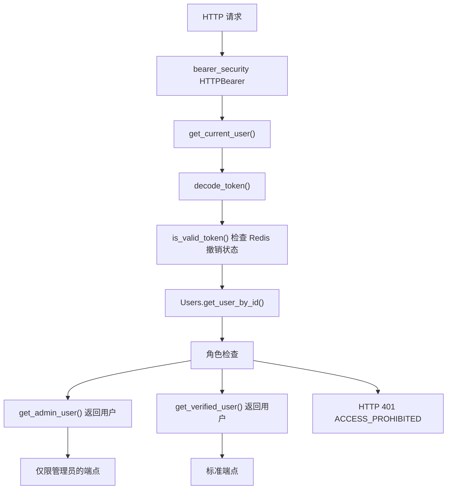
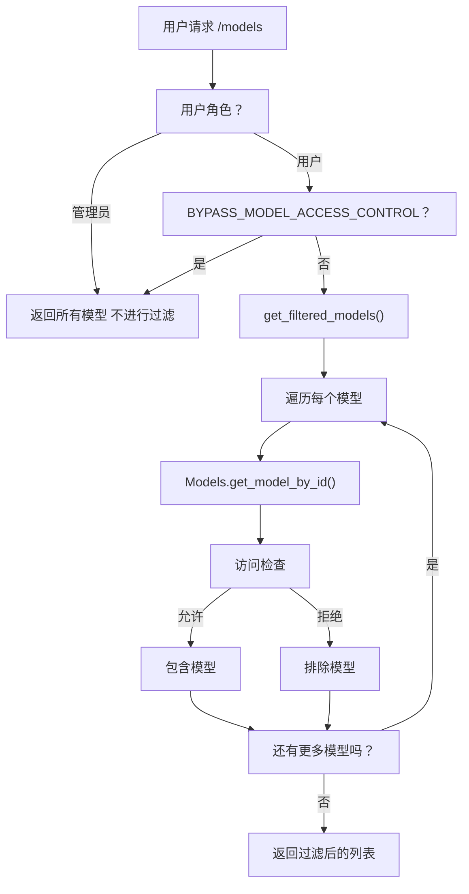
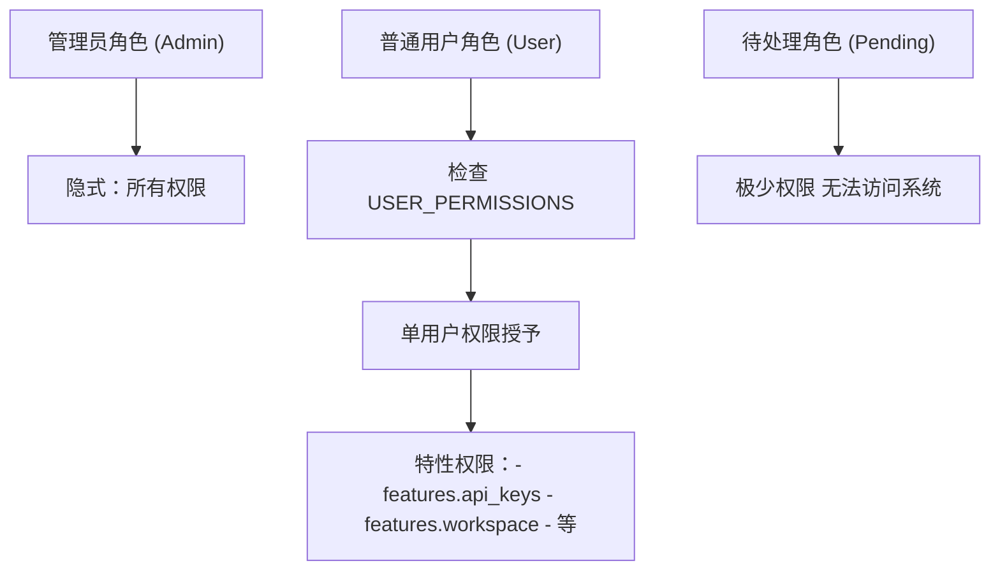
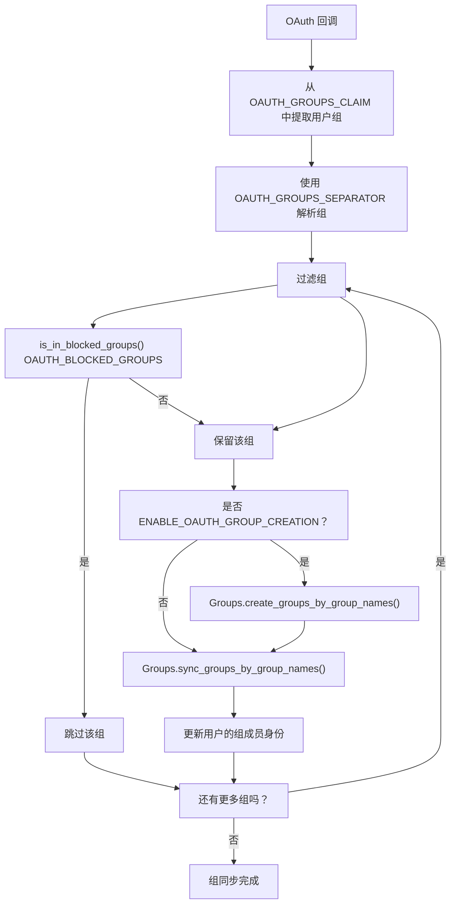
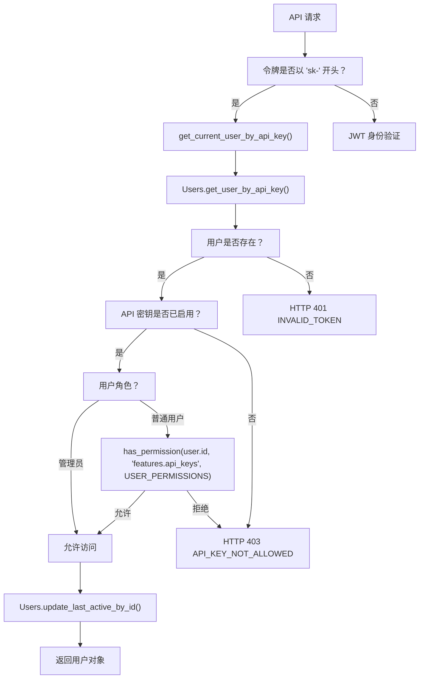
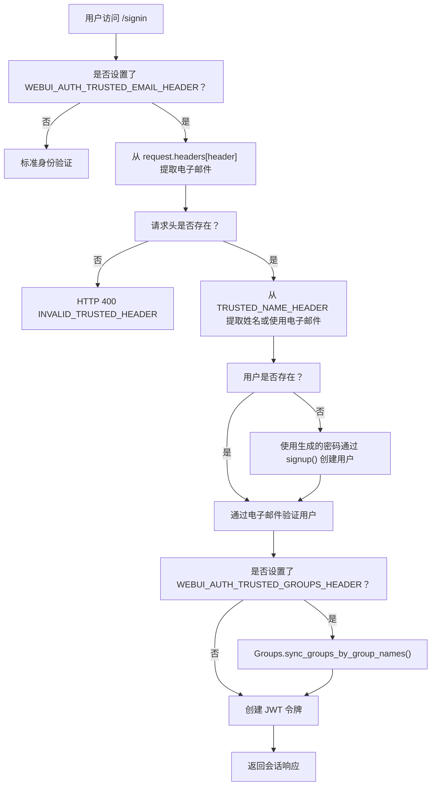

# 访问控制与 RBAC

相关源文件

-   [backend/open\_webui/env.py](https://github.com/open-webui/open-webui/blob/a7271532/backend/open_webui/env.py)
-   [backend/open\_webui/routers/audio.py](https://github.com/open-webui/open-webui/blob/a7271532/backend/open_webui/routers/audio.py)
-   [backend/open\_webui/routers/auths.py](https://github.com/open-webui/open-webui/blob/a7271532/backend/open_webui/routers/auths.py)
-   [backend/open\_webui/routers/ollama.py](https://github.com/open-webui/open-webui/blob/a7271532/backend/open_webui/routers/ollama.py)
-   [backend/open\_webui/routers/openai.py](https://github.com/open-webui/open-webui/blob/a7271532/backend/open_webui/routers/openai.py)
-   [backend/open\_webui/utils/auth.py](https://github.com/open-webui/open-webui/blob/a7271532/backend/open_webui/utils/auth.py)
-   [backend/open\_webui/utils/embeddings.py](https://github.com/open-webui/open-webui/blob/a7271532/backend/open_webui/utils/embeddings.py)
-   [backend/open\_webui/utils/misc.py](https://github.com/open-webui/open-webui/blob/a7271532/backend/open_webui/utils/misc.py)
-   [backend/open\_webui/utils/oauth.py](https://github.com/open-webui/open-webui/blob/a7271532/backend/open_webui/utils/oauth.py)
-   [backend/open\_webui/utils/response.py](https://github.com/open-webui/open-webui/blob/a7271532/backend/open_webui/utils/response.py)

本文档描述了 Open WebUI 中的访问控制和基于角色的访问控制 (RBAC) 机制。内容涵盖了用户角色、模型权限、组管理以及权限系统。有关身份验证方法（JWT、OAuth、LDAP、API 密钥），请参阅 [身份验证方法](/open-webui/open-webui/10.1-authentication-methods)。有关令牌管理和会话，请参阅 [令牌与会话管理](/open-webui/open-webui/10.5-token-and-session-management)。

---

## 用户角色

Open WebUI 实现了一个三级角色系统，用于控制对管理功能和系统特性的访问。

### 角色定义

| 角色 | 描述 | 访问级别 |
| --- | --- | --- |
| `admin` | 完整系统访问权限 | 可访问所有端点、管理用户、配置系统设置 |
| `user` | 标准已验证用户 | 可使用聊天功能、访问获准的模型、有限的配置权限 |
| `pending` | 未经验证的用户 | 访问权限有限或无权限，等待批准 |

### 角色分配

用户在创建时通过多种机制被分配角色：

**初始管理员创建**：第一个注册的用户自动获得 `admin` 角色 ([backend/open\_webui/routers/auths.py677](https://github.com/open-webui/open-webui/blob/a7271532/backend/open_webui/routers/auths.py#L677-L677))：

```python
role = "admin" if not has_users else request.app.state.config.DEFAULT_USER_ROLE
```
**默认角色配置**：后续用户将获得 `DEFAULT_USER_ROLE` 配置中指定的角色 ([backend/open\_webui/routers/auths.py409-410](https://github.com/open-webui/open-webui/blob/a7271532/backend/open_webui/routers/auths.py#L409-L410))。

**OAuth 角色管理**：当启用 `ENABLE_OAUTH_ROLE_MANAGEMENT` 时，角色根据 `OAUTH_ROLES_CLAIM`、`OAUTH_ALLOWED_ROLES` 和 `OAUTH_ADMIN_ROLES` 配置从 OAuth 提供商的声明 (claims) 中确定 ([backend/open\_webui/utils/oauth.py113-124](https://github.com/open-webui/open-webui/blob/a7271532/backend/open_webui/utils/oauth.py#L113-L124))。

**LDAP 身份验证**：LDAP 用户被分配角色的方式与标准注册类似，第一个用户成为管理员 ([backend/open\_webui/routers/auths.py406-410](https://github.com/open-webui/open-webui/blob/a7271532/backend/open_webui/routers/auths.py#L406-L410))。

**来源**： [backend/open\_webui/routers/auths.py642-754](https://github.com/open-webui/open-webui/blob/a7271532/backend/open_webui/routers/auths.py#L642-L754) [backend/open\_webui/utils/oauth.py109-130](https://github.com/open-webui/open-webui/blob/a7271532/backend/open_webui/utils/oauth.py#L109-L130)

---

## 基于角色的端点保护

### 依赖注入模式

Open WebUI 使用 FastAPI 依赖注入在端点层级强制执行角色要求：


**图表：基于角色的端点访问控制流程**

**来源**： [backend/open\_webui/utils/auth.py269-416](https://github.com/open-webui/open-webui/blob/a7271532/backend/open_webui/utils/auth.py#L269-L416)

### 访问控制函数

**`get_current_user()`** ([backend/open\_webui/utils/auth.py269-365](https://github.com/open-webui/open-webui/blob/a7271532/backend/open_webui/utils/auth.py#L269-L365))：验证身份凭据（JWT 令牌或 API 密钥）并返回用户对象。不强制执行角色要求。

**`get_verified_user()`** ([backend/open\_webui/utils/auth.py400-406](https://github.com/open-webui/open-webui/blob/a7271532/backend/open_webui/utils/auth.py#L400-L406))：确保用户具有 `user` 或 `admin` 角色。以 HTTP 401 拒绝 `pending` 用户。

**`get_admin_user()`** ([backend/open\_webui/utils/auth.py409-415](https://github.com/open-webui/open-webui/blob/a7271532/backend/open_webui/utils/auth.py#L409-L415))：确保用户专门具有 `admin` 角色。以 HTTP 401 拒绝非管理员用户。

### 用法示例

配置相关的端点要求管理员权限：

```python
@router.get("/config")
async def get_config(request: Request, user=Depends(get_admin_user)):
    return {
        "ENABLE_OPENAI_API": request.app.state.config.ENABLE_OPENAI_API,
        # ...
    }
```
聊天相关的端点要求已验证的用户权限：

```python
@router.get("/models")
async def get_models(request: Request, user=Depends(get_verified_user)):
    # ...
```
**来源**： [backend/open\_webui/routers/openai.py207-214](https://github.com/open-webui/open-webui/blob/a7271532/backend/open_webui/routers/openai.py#L207-L214) [backend/open\_webui/routers/ollama.py267-273](https://github.com/open-webui/open-webui/blob/a7271532/backend/open_webui/routers/ollama.py#L267-L273) [backend/open\_webui/routers/audio.py192-226](https://github.com/open-webui/open-webui/blob/a7271532/backend/open_webui/routers/audio.py#L192-L226)

---

## 模型访问控制

模型访问控制限制哪些用户可以使用特定的模型。该系统独立于用户角色运行，允许对模型使用进行细粒度的控制。

### 访问控制数据结构

存储在 `Models` 数据库表中的每个模型都有一个 `access_control` 字段，其中包含权限数据：

-   **所有者**：模型创建者的 `user_id` 隐式拥有完整访问权限。
-   **访问控制列表**：定义其他用户和组的读取/写入权限。

### 模型过滤流程


**图表：模型访问控制过滤**

**来源**： [backend/open\_webui/routers/openai.py456-625](https://github.com/open-webui/open-webui/blob/a7271532/backend/open_webui/routers/openai.py#L456-L625) [backend/open\_webui/routers/ollama.py424-486](https://github.com/open-webui/open-webui/blob/a7271532/backend/open_webui/routers/ollama.py#L424-L486)

### 绕过模型访问控制

当 `BYPASS_MODEL_ACCESS_CONTROL` 环境变量 ([backend/open\_webui/env.py438-440](https://github.com/open-webui/open-webui/blob/a7271532/backend/open_webui/env.py#L438-L440)) 设置为 `true` 时，将禁用所有模型过滤。这在以下场景中非常有用：

-   开发环境。
-   所有用户都应访问所有模型的小型团队。
-   无需按模型设置权限的简易部署。

启用后：

-   将完全跳过 `get_filtered_models()`。
-   无论访问控制设置如何，所有模型都会返回给所有用户。
-   管理员用户始终会绕过过滤，无论此标志如何设置。

**来源**： [backend/open\_webui/env.py438-440](https://github.com/open-webui/open-webui/blob/a7271532/backend/open_webui/env.py#L438-L440) [backend/open\_webui/routers/openai.py622-625](https://github.com/open-webui/open-webui/blob/a7271532/backend/open_webui/routers/openai.py#L622-L625) [backend/open\_webui/routers/ollama.py484-486](https://github.com/open-webui/open-webui/blob/a7271532/backend/open_webui/routers/ollama.py#L484-L486) [backend/open\_webui/utils/embeddings.py43-44](https://github.com/open-webui/open-webui/blob/a7271532/backend/open_webui/utils/embeddings.py#L43-L44)

### 访问控制函数

**`has_access(user_id, type, access_control)`** ([backend/open\_webui/utils/access\_control.py](https://github.com/open-webui/open-webui/blob/a7271532/backend/open_webui/utils/access_control.py))：根据模型的访问控制配置，检查用户是否具有指定的权限类型（`read`、`write`）。在模型过滤逻辑中被引用。

**`check_model_access(user, model)`** ([backend/open\_webui/utils/models.py](https://github.com/open-webui/open-webui/blob/a7271532/backend/open_webui/utils/models.py))：在聊天/嵌入请求的模型选择期间，验证用户对特定模型的访问权限，如果拒绝访问则抛出异常。

**来源**： [backend/open\_webui/routers/openai.py50-462](https://github.com/open-webui/open-webui/blob/a7271532/backend/open_webui/routers/openai.py#L50-L462) [backend/open\_webui/routers/ollama.py53-430](https://github.com/open-webui/open-webui/blob/a7271532/backend/open_webui/routers/ollama.py#L53-L430)

---

## 权限系统

除了基于角色的访问，Open WebUI 还实现了一个细粒度的权限系统，用于控制单个用户的特性访问。

### 权限存储与检索

权限存储在 `USER_PERMISSIONS` 配置中，并使用 `get_permissions()` 函数检索 ([backend/open\_webui/utils/access\_control.py](https://github.com/open-webui/open-webui/blob/a7271532/backend/open_webui/utils/access_control.py))：

```python
user_permissions = get_permissions(
    user.id, request.app.state.config.USER_PERMISSIONS
)
```
权限对象在会话响应中返回 ([backend/open\_webui/routers/auths.py139-159](https://github.com/open-webui/open-webui/blob/a7271532/backend/open_webui/routers/auths.py#L139-L159))：

```json
{
    "token": "token",
    "id": "user.id",
    "role": "user.role",
    "permissions": "user_permissions",
    "..." : "..."
}
```
### 权限检查

**`has_permission(user_id, permission_key, user_permissions_config)`** ([backend/open\_webui/utils/access\_control.py](https://github.com/open-webui/open-webui/blob/a7271532/backend/open_webui/utils/access_control.py))：检查用户是否拥有特定权限。用于特性门控 (feature gates)。

**示例**：API 密钥特性访问检查 ([backend/open\_webui/utils/auth.py376-386](https://github.com/open-webui/open-webui/blob/a7271532/backend/open_webui/utils/auth.py#L376-L386))：

```python
if not request.state.enable_api_keys or (
    user.role != "admin"
    and not has_permission(
        user.id,
        "features.api_keys",
        request.app.state.config.USER_PERMISSIONS,
    )
):
    raise HTTPException(
        status.HTTP_403_FORBIDDEN, detail=ERROR_MESSAGES.API_KEY_NOT_ALLOWED
    )
```
### 权限层级


**图表：各角色的权限层级**

**来源**： [backend/open\_webui/utils/auth.py376-386](https://github.com/open-webui/open-webui/blob/a7271532/backend/open_webui/utils/auth.py#L376-L386) [backend/open\_webui/routers/auths.py139-620](https://github.com/open-webui/open-webui/blob/a7271532/backend/open_webui/routers/auths.py#L139-L620)

---

## 组管理

组提供了一种组织用户并应用批量权限的方法。组可以手动管理，也可以从外部提供商（OAuth, LDAP）同步。

### OAuth 组管理

当启用 `ENABLE_OAUTH_GROUP_MANAGEMENT` 时，在身份验证期间，组会从 OAuth 提供商的声明 (claims) 中同步。


**图表：OAuth 组同步流程**

**配置变量**：

-   `ENABLE_OAUTH_GROUP_MANAGEMENT` ([backend/open\_webui/utils/oauth.py114](https://github.com/open-webui/open-webui/blob/a7271532/backend/open_webui/utils/oauth.py#L114-L114))：启用组同步。
-   `ENABLE_OAUTH_GROUP_CREATION` ([backend/open\_webui/utils/oauth.py115](https://github.com/open-webui/open-webui/blob/a7271532/backend/open_webui/utils/oauth.py#L115-L115))：允许创建新组。
-   `OAUTH_GROUPS_CLAIM` ([backend/open\_webui/utils/oauth.py119](https://github.com/open-webui/open-webui/blob/a7271532/backend/open_webui/utils/oauth.py#L119-L119))：包含组信息的 JWT 声明。
-   `OAUTH_GROUPS_SEPARATOR` ([backend/open\_webui/utils/oauth.py45](https://github.com/open-webui/open-webui/blob/a7271532/backend/open_webui/utils/oauth.py#L45-L45))：组名的分隔符。
-   `OAUTH_BLOCKED_GROUPS` ([backend/open\_webui/utils/oauth.py116](https://github.com/open-webui/open-webui/blob/a7271532/backend/open_webui/utils/oauth.py#L116-L116))：要排除的组。

**来源**： [backend/open\_webui/utils/oauth.py42-241](https://github.com/open-webui/open-webui/blob/a7271532/backend/open_webui/utils/oauth.py#L42-L241)

### LDAP 组管理

LDAP 身份验证可以从目录属性中提取并同步组。

**组提取** ([backend/open\_webui/routers/auths.py329-391](https://github.com/open-webui/open-webui/blob/a7271532/backend/open_webui/routers/auths.py#L329-L391))：

1.  使用配置的 `LDAP_ATTRIBUTE_FOR_GROUPS` 属性搜索 LDAP。
2.  解析专有名称 (DN) 以提取通用名称 (CN)。
3.  为用户构建组名列表。

**组同步** ([backend/open\_webui/routers/auths.py470-484](https://github.com/open-webui/open-webui/blob/a7271532/backend/open_webui/routers/auths.py#L470-L484))：

```python
if ENABLE_LDAP_GROUP_MANAGEMENT and user_groups:
    if ENABLE_LDAP_GROUP_CREATION:
        Groups.create_groups_by_group_names(user.id, user_groups)
    try:
        Groups.sync_groups_by_group_names(user.id, user_groups)
    except Exception as e:
        log.error(f"Failed to sync groups for user {user.id}: {e}")
```
**配置变量**：

-   `ENABLE_LDAP_GROUP_MANAGEMENT` ([backend/open\_webui/routers/auths.py278-279](https://github.com/open-webui/open-webui/blob/a7271532/backend/open_webui/routers/auths.py#L278-L279))。
-   `ENABLE_LDAP_GROUP_CREATION` ([backend/open\_webui/routers/auths.py281](https://github.com/open-webui/open-webui/blob/a7271532/backend/open_webui/routers/auths.py#L281-L281))。
-   `LDAP_ATTRIBUTE_FOR_GROUPS` ([backend/open\_webui/routers/auths.py282](https://github.com/open-webui/open-webui/blob/a7271532/backend/open_webui/routers/auths.py#L282-L282))。

**来源**： [backend/open\_webui/routers/auths.py278-484](https://github.com/open-webui/open-webui/blob/a7271532/backend/open_webui/routers/auths.py#L278-L484)

### 受信任请求头组管理

对于反向代理部署，可以通过受信任的 HTTP 请求头提供组信息 ([backend/open\_webui/routers/auths.py540-548](https://github.com/open-webui/open-webui/blob/a7271532/backend/open_webui/routers/auths.py#L540-L548))：

```python
if WEBUI_AUTH_TRUSTED_GROUPS_HEADER and user and user.role != "admin":
    group_names = request.headers.get(
        WEBUI_AUTH_TRUSTED_GROUPS_HEADER, ""
    ).split(",")
    group_names = [name.strip() for name in group_names if name.strip()]

    if group_names:
        Groups.sync_groups_by_group_names(user.id, group_names)
```
**配置**： `WEBUI_AUTH_TRUSTED_GROUPS_HEADER` ([backend/open\_webui/env.py416-418](https://github.com/open-webui/open-webui/blob/a7271532/backend/open_webui/env.py#L416-L418))。

**来源**： [backend/open\_webui/env.py416-418](https://github.com/open-webui/open-webui/blob/a7271532/backend/open_webui/env.py#L416-L418) [backend/open\_webui/routers/auths.py540-548](https://github.com/open-webui/open-webui/blob/a7271532/backend/open_webui/routers/auths.py#L540-L548)

### 组屏蔽模式 (Group Blocking Patterns)

`is_in_blocked_groups()` 函数 ([backend/open\_webui/utils/oauth.py199-241](https://github.com/open-webui/open-webui/blob/a7271532/backend/open_webui/utils/oauth.py#L199-L241)) 支持三种模式类型来屏蔽组：

| 模式类型 | 示例 | 描述 |
| --- | --- | --- |
| 精确匹配 | `"admin-group"` | 屏蔽精确的组名 |
| Shell 通配符 | `"temp-*"` | 屏蔽匹配通配符 (*, ?) 的组 |
| 正则表达式 | `"^test-.*-dev$"` | 屏蔽匹配正则表达式模式的组 |

**来源**： [backend/open\_webui/utils/oauth.py199-241](https://github.com/open-webui/open-webui/blob/a7271532/backend/open_webui/utils/oauth.py#L199-L241)

---

## API 密钥授权

API 密钥提供了对 Open WebUI 的编程式访问，无需用户凭据。它们遵循 `sk-*` 格式。

### API 密钥验证流程


**图表：API 密钥授权流程**

**密钥生成**：API 密钥使用 `create_api_key()` 生成 ([backend/open\_webui/utils/auth.py254-256](https://github.com/open-webui/open-webui/blob/a7271532/backend/open_webui/utils/auth.py#L254-L256))：

```python
def create_api_key():
    key = str(uuid.uuid4()).replace("-", "")
    return f"sk-{key}"
```
**授权检查** ([backend/open\_webui/utils/auth.py367-397](https://github.com/open-webui/open-webui/blob/a7271532/backend/open_webui/utils/auth.py#L367-L397))：

1.  验证数据库中是否存在 API 密钥。
2.  检查是否全局启用了 API 密钥 (`enable_api_keys`)。
3.  对于非管理员用户，检查 `features.api_keys` 权限。
4.  更新用户的最后活跃时间戳。
5.  返回用户对象。

**来源**： [backend/open\_webui/utils/auth.py254-397](https://github.com/open-webui/open-webui/blob/a7271532/backend/open_webui/utils/auth.py#L254-L397)

---

## 受信任请求头身份验证

受信任请求头身份验证允许反向代理 (Apache, Nginx) 处理身份验证，并通过 HTTP 请求头传递用户信息。这对于 SSO 集成非常有用。

### 配置

三个环境变量控制受信任请求头身份验证：

| 变量 | 用途 | 示例 |
| --- | --- | --- |
| `WEBUI_AUTH_TRUSTED_EMAIL_HEADER` | 包含用户电子邮件的请求头 | `X-Forwarded-User` |
| `WEBUI_AUTH_TRUSTED_NAME_HEADER` | 包含用户姓名的请求头 | `X-Forwarded-Name` |
| `WEBUI_AUTH_TRUSTED_GROUPS_HEADER` | 包含用户组的请求头 (逗号分隔) | `X-Forwarded-Groups` |

**来源**： [backend/open\_webui/env.py412-418](https://github.com/open-webui/open-webui/blob/a7271532/backend/open_webui/env.py#L412-L418)

### 身份验证流程


**图表：受信任请求头身份验证流程**

**实现** ([backend/open\_webui/routers/auths.py518-548](https://github.com/open-webui/open-webui/blob/a7271532/backend/open_webui/routers/auths.py#L518-L548))：

1.  检查 `WEBUI_AUTH_TRUSTED_EMAIL_HEADER` 是否存在。
2.  从请求头中提取电子邮件（必填）。
3.  如果已配置，则从 `WEBUI_AUTH_TRUSTED_NAME_HEADER` 提取姓名。
4.  如果用户不存在，则自动创建。
5.  如果已配置，则从 `WEBUI_AUTH_TRUSTED_GROUPS_HEADER` 提取并同步组。
6.  生成 JWT 令牌并返回会话。

**安全提示**：此身份验证方法会完全绕过密码检查。反向代理必须配置安全，以防止请求头伪造。

**来源**： [backend/open\_webui/env.py412-418](https://github.com/open-webui/open-webui/blob/a7271532/backend/open_webui/env.py#L412-L418) [backend/open\_webui/routers/auths.py518-548](https://github.com/open-webui/open-webui/blob/a7271532/backend/open_webui/routers/auths.py#L518-L548) [backend/open\_webui/utils/auth.py324-332](https://github.com/open-webui/open-webui/blob/a7271532/backend/open_webui/utils/auth.py#L324-L332)

---

## 访问控制配置参考

### 环境变量

| 变量 | 类型 | 默认值 | 描述 |
| --- | --- | --- | --- |
| `BYPASS_MODEL_ACCESS_CONTROL` | boolean | `false` | 禁用模型访问控制过滤 |
| `WEBUI_AUTH_TRUSTED_EMAIL_HEADER` | string | `null` | 受信任电子邮件的 HTTP 请求头 |
| `WEBUI_AUTH_TRUSTED_NAME_HEADER` | string | `null` | 受信任姓名的 HTTP 请求头 |
| `WEBUI_AUTH_TRUSTED_GROUPS_HEADER` | string | `null` | 受信任组的 HTTP 请求头 |
| `ENABLE_OAUTH_ROLE_MANAGEMENT` | boolean | 视情况而定 | 启用 OAuth 角色分配 |
| `ENABLE_OAUTH_GROUP_MANAGEMENT` | boolean | 视情况而定 | 启用 OAuth 组同步 |
| `ENABLE_OAUTH_GROUP_CREATION` | boolean | 视情况而定 | 允许从 OAuth 创建组 |
| `ENABLE_LDAP_GROUP_MANAGEMENT` | boolean | 视情况而定 | 启用 LDAP 组同步 |
| `ENABLE_LDAP_GROUP_CREATION` | boolean | 视情况而定 | 允许从 LDAP 创建组 |

**来源**： [backend/open\_webui/env.py412-440](https://github.com/open-webui/open-webui/blob/a7271532/backend/open_webui/env.py#L412-L440)

### OAuth 配置

| 变量 | 用途 |
| --- | --- |
| `OAUTH_ROLES_CLAIM` | 包含用户角色的 JWT 声明 (claim) |
| `OAUTH_GROUPS_CLAIM` | 包含用户组的 JWT 声明 (claim) |
| `OAUTH_ALLOWED_ROLES` | 获准角色的白名单 |
| `OAUTH_ADMIN_ROLES` | 授予管理员访问权限的角色 |
| `OAUTH_BLOCKED_GROUPS` | 排除在同步之外的组模式 |
| `OAUTH_GROUPS_SEPARATOR` | 用于解析组列表的分隔符 |
| `OAUTH_ROLES_SEPARATOR` | 用于解析角色列表的分隔符 |

**来源**： [backend/open\_webui/utils/oauth.py42-54](https://github.com/open-webui/open-webui/blob/a7271532/backend/open_webui/utils/oauth.py#L42-L54)

### 默认行为

-   **首位用户**：自动分配 `admin` 角色。
-   **后续用户**：分配 `DEFAULT_USER_ROLE`（可配置）。
-   **模型访问**：默认情况下，对非管理员用户进行过滤。
-   **API 密钥**：非管理员用户需要明确的权限授予。
-   **组**：除非启用了 OAuth/LDAP 组管理，否则不进行同步。

**来源**： [backend/open\_webui/routers/auths.py677](https://github.com/open-webui/open-webui/blob/a7271532/backend/open_webui/routers/auths.py#L677-L677) [backend/open\_webui/config.py](https://github.com/open-webui/open-webui/blob/a7271532/backend/open_webui/config.py)

---

## 集成点

### 会话响应格式

用户权限和角色信息在身份验证响应中返回 ([backend/open\_webui/routers/auths.py143-632](https://github.com/open-webui/open-webui/blob/a7271532/backend/open_webui/routers/auths.py#L143-L632))：

```json
{
    "token": "eyJ...",
    "token_type": "Bearer",
    "expires_at": 1234567890,
    "id": "user-id",
    "email": "user@example.com",
    "name": "User Name",
    "role": "user",
    "profile_image_url": "...",
    "permissions": {
        "features.api_keys": true,
        "features.workspace": true,
        "..." : true
    }
}
```
### 模型响应过滤

模型列表端点 (`/models`, `/api/tags`) 根据以下内容过滤结果：

1.  用户角色（`admin` 绕过过滤）。
2.  `BYPASS_MODEL_ACCESS_CONTROL` 标志。
3.  模型所有权 (`user_id`)。
4.  访问控制列表 (`has_access()` 检查)。

**来源**： [backend/open\_webui/routers/openai.py456-625](https://github.com/open-webui/open-webui/blob/a7271532/backend/open_webui/routers/openai.py#L456-L625) [backend/open\_webui/routers/ollama.py424-487](https://github.com/open-webui/open-webui/blob/a7271532/backend/open_webui/routers/ollama.py#L424-L487)

### 转发用户信息请求头 (Forward User Info Headers)

启用 `ENABLE_FORWARD_USER_INFO_HEADERS` 后，通过 `include_user_info_headers()` 函数，用户信息会包含在发往外部服务的请求中。这允许后端服务根据已验证的用户执行其自身的访问控制或日志记录。

**来源**： [backend/open\_webui/env.py191-193](https://github.com/open-webui/open-webui/blob/a7271532/backend/open_webui/env.py#L191-L193) [backend/open\_webui/utils/headers.py](https://github.com/open-webui/open-webui/blob/a7271532/backend/open_webui/utils/headers.py) [backend/open\_webui/routers/openai.py72-142](https://github.com/open-webui/open-webui/blob/a7271532/backend/open_webui/routers/openai.py#L72-L142) [backend/open\_webui/routers/ollama.py88-137](https://github.com/open-webui/open-webui/blob/a7271532/backend/open_webui/routers/ollama.py#L88-L137)

---

**来源**：以上各章节均包含内联源码引用。
