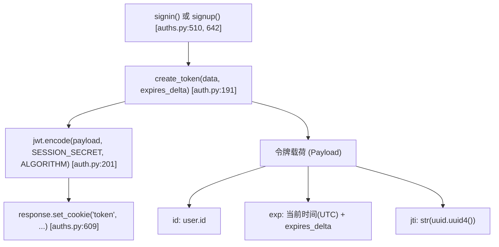
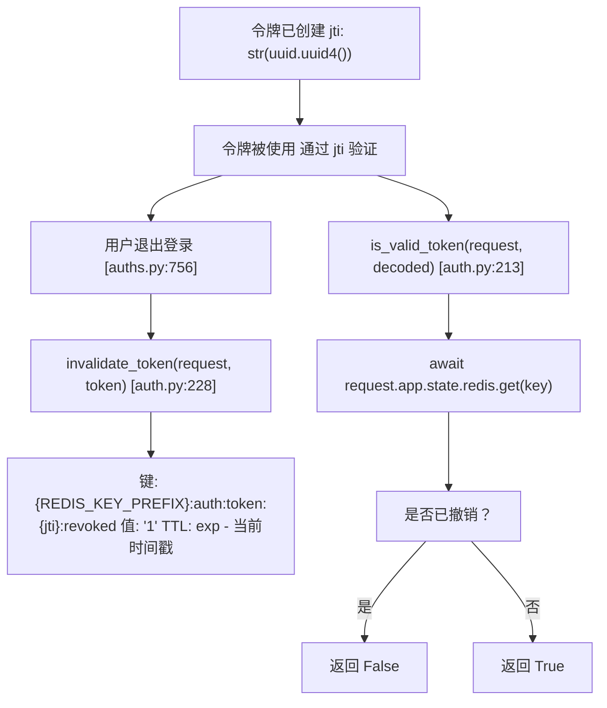
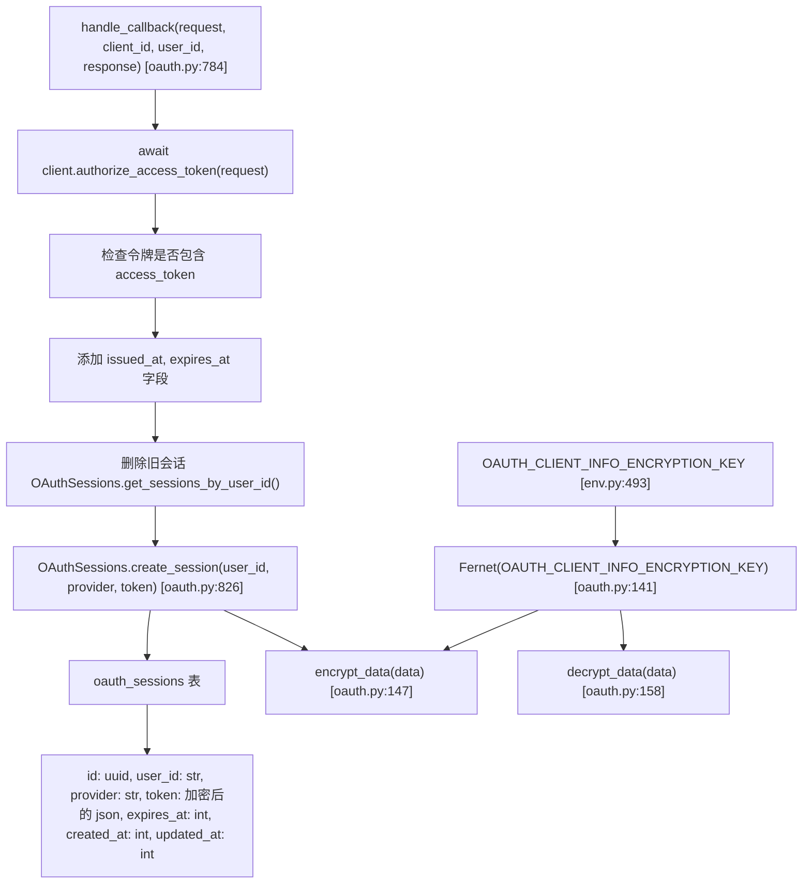
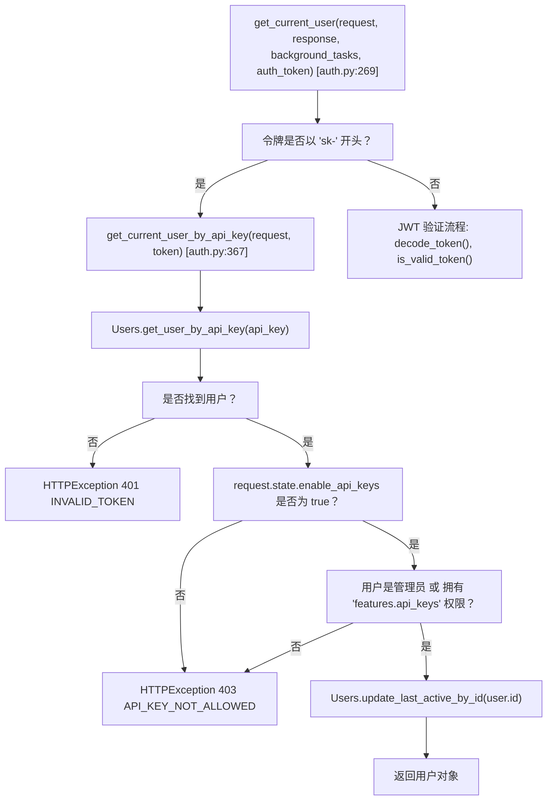

# 会话与令牌管理

相关源文件

-   [backend/open\_webui/env.py](https://github.com/open-webui/open-webui/blob/a7271532/backend/open_webui/env.py)
-   [backend/open\_webui/routers/audio.py](https://github.com/open-webui/open-webui/blob/a7271532/backend/open_webui/routers/audio.py)
-   [backend/open\_webui/routers/auths.py](https://github.com/open-webui/open-webui/blob/a7271532/backend/open_webui/routers/auths.py)
-   [backend/open\_webui/routers/ollama.py](https://github.com/open-webui/open-webui/blob/a7271532/backend/open_webui/routers/ollama.py)
-   [backend/open\_webui/routers/openai.py](https://github.com/open-webui/open-webui/blob/a7271532/backend/open_webui/routers/openai.py)
-   [backend/open\_webui/utils/auth.py](https://github.com/open-webui/open-webui/blob/a7271532/backend/open_webui/utils/auth.py)
-   [backend/open\_webui/utils/embeddings.py](https://github.com/open-webui/open-webui/blob/a7271532/backend/open_webui/utils/embeddings.py)
-   [backend/open\_webui/utils/misc.py](https://github.com/open-webui/open-webui/blob/a7271532/backend/open_webui/utils/misc.py)
-   [backend/open\_webui/utils/oauth.py](https://github.com/open-webui/open-webui/blob/a7271532/backend/open_webui/utils/oauth.py)
-   [backend/open\_webui/utils/response.py](https://github.com/open-webui/open-webui/blob/a7271532/backend/open_webui/utils/response.py)

本文档涵盖了 Open WebUI 中的会话与令牌管理系统，包括 JWT 令牌的创建与验证、基于 Redis 的令牌撤销、OAuth 会话存储以及 Cookie 配置。本页重点介绍令牌生命周期和会话持久化的技术实现。

有关身份验证方法（密码、LDAP、OAuth）的信息，请参阅 [身份验证方法](/open-webui/open-webui/10.1-authentication-methods)。有关 OAuth 提供商配置和用户配置的详情，请参阅 [OAuth 集成](/open-webui/open-webui/10.2-oauth-integration)。

---

## 概览

Open WebUI 实现了一个多层级的身份验证系统，包含：

-   用于无状态身份验证的 **JWT 令牌**，支持可选的基于 Redis 的撤销功能。
-   用于编程式访问的 **API 密钥** (格式: `sk-{uuid}`)。
-   用于基于浏览器的会话持久化的 **HTTP Cookie**。
-   存储在服务器端且带有加密令牌数据的 **OAuth 会话**。

该系统同时支持无状态 (JWT) 和有状态（Redis 撤销、OAuth 会话）身份验证模式。

---

## JWT 令牌系统

### 令牌创建

JWT 令牌是使用 [backend/open\_webui/utils/auth.py191-202](https://github.com/open-webui/open-webui/blob/a7271532/backend/open_webui/utils/auth.py#L191-L202) 中的 `create_token()` 函数创建的。

**令牌创建流程**


**来源：** [backend/open\_webui/utils/auth.py191-202](https://github.com/open-webui/open-webui/blob/a7271532/backend/open_webui/utils/auth.py#L191-L202) [backend/open\_webui/routers/auths.py597-616](https://github.com/open-webui/open-webui/blob/a7271532/backend/open_webui/routers/auths.py#L597-L616)

### 令牌结构

每个 JWT 令牌包含：

| 声明 (Claim) | 描述 | 来源 |
| --- | --- | --- |
| `id` | 用户标识符 | 在 `data` 参数中传递 |
| `exp` | 过期时间戳 (Unix 时间戳) | 根据 `JWT_EXPIRES_IN` 配置计算 |
| `jti` | JWT ID (UUID v4) | 为撤销追踪而生成 |

令牌使用 [backend/open\_webui/env.py450-455](https://github.com/open-webui/open-webui/blob/a7271532/backend/open_webui/env.py#L450-L455) 中的 `WEBUI_SECRET_KEY` 并通过 **HS256** 算法进行签名。

**来源：** [backend/open\_webui/utils/auth.py191-202](https://github.com/open-webui/open-webui/blob/a7271532/backend/open_webui/utils/auth.py#L191-L202) [backend/open\_webui/env.py450-455](https://github.com/open-webui/open-webui/blob/a7271532/backend/open_webui/env.py#L450-L455)

### 令牌验证

令牌验证发生在 [backend/open\_webui/utils/auth.py269-364](https://github.com/open-webui/open-webui/blob/a7271532/backend/open_webui/utils/auth.py#L269-L364) 的 `get_current_user()` 中。

**令牌验证序列**

> **[Mermaid sequence]**
> *(图表结构无法解析)*

**来源：** [backend/open\_webui/utils/auth.py269-364](https://github.com/open-webui/open-webui/blob/a7271532/backend/open_webui/utils/auth.py#L269-L364) [backend/open\_webui/utils/auth.py205-210](https://github.com/open-webui/open-webui/blob/a7271532/backend/open_webui/utils/auth.py#L205-L210) [backend/open\_webui/utils/auth.py213-225](https://github.com/open-webui/open-webui/blob/a7271532/backend/open_webui/utils/auth.py#L213-L225)

### 令牌过期配置

令牌过期受 `JWT_EXPIRES_IN` 配置参数控制，该参数支持时长格式：

-   `-1` 或 `0`：永不过期。
-   带单位的数字：`30d`, `12h`, `60m`, `3600s`, `500ms`, `2w`。

该值由 [backend/open\_webui/utils/misc.py428-456](https://github.com/open-webui/open-webui/blob/a7271532/backend/open_webui/utils/misc.py#L428-L456) 中的 `parse_duration()` 解析并转换为 `timedelta` 对象。在身份验证期间，这在 [backend/open\_webui/routers/auths.py592-595](https://github.com/open-webui/open-webui/blob/a7271532/backend/open_webui/routers/auths.py#L592-L595) 处进行计算。

**来源：** [backend/open\_webui/routers/auths.py592-595](https://github.com/open-webui/open-webui/blob/a7271532/backend/open_webui/routers/auths.py#L592-L595) [backend/open\_webui/utils/misc.py428-456](https://github.com/open-webui/open-webui/blob/a7271532/backend/open_webui/utils/misc.py#L428-L456)

---

## 令牌撤销

Open WebUI 实现了一个可选的基于 Redis 的令牌撤销系统，使用 JWT ID (`jti`) 声明。

### 基于 Redis 的撤销架构


**来源：** [backend/open\_webui/utils/auth.py213-247](https://github.com/open-webui/open-webui/blob/a7271532/backend/open_webui/utils/auth.py#L213-L247) [backend/open\_webui/env.py361-377](https://github.com/open-webui/open-webui/blob/a7271532/backend/open_webui/env.py#L361-L377)

### 撤销实现

位于 [backend/open\_webui/utils/auth.py228-247](https://github.com/open-webui/open-webui/blob/a7271532/backend/open_webui/utils/auth.py#L228-L247) 的 `invalidate_token()` 函数执行撤销操作：

1.  使用 `decode_token(token)` 解码令牌以提取 `jti` 和 `exp`。
2.  计算 TTL：`ttl = exp - int(datetime.now(UTC).timestamp())`。
3.  如果 TTL > 0，则存储在 Redis 中：`await redis.set(key, "1", ex=ttl)`。
    -   键格式：`{REDIS_KEY_PREFIX}:auth:token:{jti}:revoked`
    -   值：`"1"`
    -   过期时间：TTL 秒

在验证期间，[backend/open\_webui/utils/auth.py213-225](https://github.com/open-webui/open-webui/blob/a7271532/backend/open_webui/utils/auth.py#L213-L225) 处的 `is_valid_token()` 会检查该键是否存在于 Redis 中。如果存在，令牌将被拒绝。

**注意：** 撤销功能需要通过 [backend/open\_webui/env.py361](https://github.com/open-webui/open-webui/blob/a7271532/backend/open_webui/env.py#L361-L361) 中的 `REDIS_URL` 配置 Redis。

**来源：** [backend/open\_webui/utils/auth.py228-247](https://github.com/open-webui/open-webui/blob/a7271532/backend/open_webui/utils/auth.py#L228-L247) [backend/open\_webui/utils/auth.py213-225](https://github.com/open-webui/open-webui/blob/a7271532/backend/open_webui/utils/auth.py#L213-L225) [backend/open\_webui/env.py361-364](https://github.com/open-webui/open-webui/blob/a7271532/backend/open_webui/env.py#L361-L364)

---

## Cookie 配置

### Cookie 设置概览

Open WebUI 设置具有可配置安全属性的身份验证 Cookie：

| 环境变量 | 默认值 | 用途 |
| --- | --- | --- |
| `WEBUI_SESSION_COOKIE_SAME_SITE` | `lax` | 会话 Cookie 的 SameSite 属性 |
| `WEBUI_SESSION_COOKIE_SECURE` | `false` | 会话 Cookie 的 Secure 标志 |
| `WEBUI_AUTH_COOKIE_SAME_SITE` | (继承会话设置) | 身份验证专用 Cookie 的 SameSite 属性 |
| `WEBUI_AUTH_COOKIE_SECURE` | (继承会话设置) | 身份验证专用 Cookie 的 Secure 标志 |

配置在 [backend/open\_webui/env.py457-473](https://github.com/open-webui/open-webui/blob/a7271532/backend/open_webui/env.py#L457-L473) 中加载。

**来源：** [backend/open\_webui/env.py457-473](https://github.com/open-webui/open-webui/blob/a7271532/backend/open_webui/env.py#L457-L473)

### Cookie 设置实现

Cookie 在登录、注册和 LDAP 身份验证等流程中设置：

```python
# auths.py 中使用的模式
response.set_cookie(
    key="token",
    value=token,
    expires=datetime_expires_at,
    httponly=True,  # JavaScript 无法访问
    samesite=WEBUI_AUTH_COOKIE_SAME_SITE,
    secure=WEBUI_AUTH_COOKIE_SECURE,
)
```
Cookie 设置的位置：

-   登录 (Signin): [backend/open\_webui/routers/auths.py609-616](https://github.com/open-webui/open-webui/blob/a7271532/backend/open_webui/routers/auths.py#L609-L616)
-   注册 (Signup): [backend/open\_webui/routers/auths.py704-711](https://github.com/open-webui/open-webui/blob/a7271532/backend/open_webui/routers/auths.py#L704-L711)
-   LDAP: [backend/open\_webui/routers/auths.py451-464](https://github.com/open-webui/open-webui/blob/a7271532/backend/open_webui/routers/auths.py#L451-L464)
-   会话用户: [backend/open\_webui/routers/auths.py126-137](https://github.com/open-webui/open-webui/blob/a7271532/backend/open_webui/routers/auths.py#L126-L137)

**来源：** [backend/open\_webui/routers/auths.py609-616](https://github.com/open-webui/open-webui/blob/a7271532/backend/open_webui/routers/auths.py#L609-L616) [backend/open\_webui/routers/auths.py704-711](https://github.com/open-webui/open-webui/blob/a7271532/backend/open_webui/routers/auths.py#L704-L711) [backend/open\_webui/routers/auths.py451-464](https://github.com/open-webui/open-webui/blob/a7271532/backend/open_webui/routers/auths.py#L451-L464)

### Cookie 类型

系统管理多种类型的 Cookie：

| Cookie 名称 | 用途 | 设置者 | 退出登录时删除 |
| --- | --- | --- | --- |
| `token` | JWT 身份验证令牌 | signin/signup | 是 |
| `oui-session` | 会话标识符 | (socket.io) | 是 |
| `oauth_id_token` | OAuth ID 令牌 | OAuth 回调 | 是 |
| `oauth_session_id` | OAuth 会话引用 | OAuth 回调 | 是 |

位于 [backend/open\_webui/routers/auths.py756-829](https://github.com/open-webui/open-webui/blob/a7271532/backend/open_webui/routers/auths.py#L756-L829) 的退出登录功能会删除所有 Cookie 并撤销令牌：

```python
# 从 Authorization 请求头或 Cookie 中提取令牌
token = auth_cred.credentials if auth_header else request.cookies.get("token")

# 如果 Redis 可用，在 Redis 中撤销令牌
if token:
    await invalidate_token(request, token)

# 删除所有身份验证 Cookie
response.delete_cookie("token")
response.delete_cookie("oui-session")
response.delete_cookie("oauth_id_token")
```
**来源：** [backend/open\_webui/routers/auths.py756-829](https://github.com/open-webui/open-webui/blob/a7271532/backend/open_webui/routers/auths.py#L756-L829)

---

## OAuth 会话管理

OAuth 会话存储在服务器端，并带有加密的令牌数据，与 JWT 身份验证相互独立。

### OAuth 会话存储

**OAuth 会话存储架构**


**来源：** [backend/open\_webui/utils/oauth.py784-836](https://github.com/open-webui/open-webui/blob/a7271532/backend/open_webui/utils/oauth.py#L784-L836) [backend/open\_webui/utils/oauth.py147-165](https://github.com/open-webui/open-webui/blob/a7271532/backend/open_webui/utils/oauth.py#L147-L165) [backend/open\_webui/env.py493-499](https://github.com/open-webui/open-webui/blob/a7271532/backend/open_webui/env.py#L493-L499)

### 令牌加密

OAuth 令牌在存入数据库前，会使用 [backend/open\_webui/utils/oauth.py147-155](https://github.com/open-webui/open-webui/blob/a7271532/backend/open_webui/utils/oauth.py#L147-L155) 中的 `encrypt_data()` 函数进行加密：

1.  使用 `json.dumps(data)` 将令牌数据序列化为 JSON。
2.  Fernet 密码器加密 JSON 字符串：`FERNET.encrypt(data_json.encode())`。
3.  加密后的字符串（字节解码为字符串）存储在 `token` 列中。

加密密钥在模块加载时从 `OAUTH_CLIENT_INFO_ENCRYPTION_KEY` 初始化：

-   如果密钥长度不等于 44 字节：计算 SHA256 哈希并进行 base64url 编码。
-   如果密钥长度等于 44 字节：直接使用。
-   默认值：来自 [backend/open\_webui/env.py493-499](https://github.com/open-webui/open-webui/blob/a7271532/backend/open_webui/env.py#L493-L499) 的 `WEBUI_SECRET_KEY`。

Fernet 实例在 [backend/open\_webui/utils/oauth.py134-144](https://github.com/open-webui/open-webui/blob/a7271532/backend/open_webui/utils/oauth.py#L134-L144) 处创建。

**来源：** [backend/open\_webui/utils/oauth.py147-165](https://github.com/open-webui/open-webui/blob/a7271532/backend/open_webui/utils/oauth.py#L147-L165) [backend/open\_webui/utils/oauth.py134-144](https://github.com/open-webui/open-webui/blob/a7271532/backend/open_webui/utils/oauth.py#L134-L144) [backend/open\_webui/env.py493-499](https://github.com/open-webui/open-webui/blob/a7271532/backend/open_webui/env.py#L493-L499)

### 令牌刷新机制

OAuth 令牌在需要时由 `get_oauth_token()` 自动刷新：

**OAuth 令牌刷新序列**

> **[Mermaid sequence]**
> *(图表结构无法解析)*

**来源：** [backend/open\_webui/utils/oauth.py601-645](https://github.com/open-webui/open-webui/blob/a7271532/backend/open_webui/utils/oauth.py#L601-L645) [backend/open\_webui/utils/oauth.py647-674](https://github.com/open-webui/open-webui/blob/a7271532/backend/open_webui/utils/oauth.py#L647-L674) [backend/open\_webui/utils/oauth.py676-765](https://github.com/open-webui/open-webui/blob/a7271532/backend/open_webui/utils/oauth.py#L676-L765)

[backend/open\_webui/utils/oauth.py601-765](https://github.com/open-webui/open-webui/blob/a7271532/backend/open_webui/utils/oauth.py#L601-L765) 中的令牌刷新逻辑：

1.  **检查过期**：`datetime.now() + timedelta(minutes=5) >= datetime.fromtimestamp(session.expires_at)` 或 `force_refresh=True`。
2.  **获取令牌端点**：GET `server_metadata_url` 以检索 `token_endpoint`。
3.  **请求新令牌**：POST 到 `token_endpoint`，附带：
    -   `grant_type=refresh_token`
    -   `refresh_token=token["refresh_token"]`
    -   `client_id` 以及可选的 `client_secret`。
4.  **处理响应**：
    -   如果响应中不包含 `refresh_token`，则保留旧的。
    -   添加 `issued_at = datetime.now().timestamp()`。
    -   计算 `expires_at = datetime.now().timestamp() + expires_in`。
5.  **更新会话**：调用 `OAuthSessions.update_session_by_id(session.id, new_token_data)`。

**来源：** [backend/open\_webui/utils/oauth.py601-645](https://github.com/open-webui/open-webui/blob/a7271532/backend/open_webui/utils/oauth.py#L601-L645) [backend/open\_webui/utils/oauth.py676-765](https://github.com/open-webui/open-webui/blob/a7271532/backend/open_webui/utils/oauth.py#L676-L765)

---

## API 密钥身份验证

API 密钥为编程式访问提供了一种替代的身份验证机制。

### API 密钥格式与存储

-   **格式**：`sk-{uuid}`，其中 uuid 使用 `str(uuid.uuid4()).replace("-", "")` 生成且不含连字符。
-   **生成**：位于 [backend/open\_webui/utils/auth.py254-256](https://github.com/open-webui/open-webui/blob/a7271532/backend/open_webui/utils/auth.py#L254-L256) 的 `create_api_key()`。
-   **存储**：存储在 `users` 表的 `api_key` 列。
-   **创建端点**：`POST /api/v1/auths/api_key`（需要管理员权限或 `features.api_keys` 权限）。

**来源：** [backend/open\_webui/utils/auth.py254-256](https://github.com/open-webui/open-webui/blob/a7271532/backend/open_webui/utils/auth.py#L254-L256) [backend/open\_webui/routers/auths.py](https://github.com/open-webui/open-webui/blob/a7271532/backend/open_webui/routers/auths.py)

### API 密钥验证

**API 密钥验证流程**


**来源：** [backend/open\_webui/utils/auth.py269-298](https://github.com/open-webui/open-webui/blob/a7271532/backend/open_webui/utils/auth.py#L269-L298) [backend/open\_webui/utils/auth.py367-397](https://github.com/open-webui/open-webui/blob/a7271532/backend/open_webui/utils/auth.py#L367-L397)

[backend/open\_webui/utils/auth.py367-397](https://github.com/open-webui/open-webui/blob/a7271532/backend/open_webui/utils/auth.py#L367-L397) 处的 API 密钥验证会检查：

1.  是否存在具有匹配 API 密钥的用户（通过 `Users.get_user_by_api_key(api_key)`）。
2.  `request.state.enable_api_keys` 是否为 true（受后端配置控制）。
3.  用户是管理员，或者通过 `has_permission(user.id, "features.api_keys", request.app.state.config.USER_PERMISSIONS)` 确认其拥有 `features.api_keys` 权限。

如果验证成功，将通过 `Users.update_last_active_by_id(user.id)` 同步更新用户的最后活跃时间戳。

**来源：** [backend/open\_webui/utils/auth.py367-397](https://github.com/open-webui/open-webui/blob/a7271532/backend/open_webui/utils/auth.py#L367-L397)

---

## 会话生命周期图

**会话生命周期状态图**

**来源：** [backend/open\_webui/routers/auths.py510-829](https://github.com/open-webui/open-webui/blob/a7271532/backend/open_webui/routers/auths.py#L510-L829) [backend/open\_webui/utils/oauth.py601-765](https://github.com/open-webui/open-webui/blob/a7271532/backend/open_webui/utils/oauth.py#L601-L765) [backend/open\_webui/utils/auth.py191-247](https://github.com/open-webui/open-webui/blob/a7271532/backend/open_webui/utils/auth.py#L191-L247)

---

## 配置参考

### 环境变量

| 变量 | 类型 | 默认值 | 描述 |
| --- | --- | --- | --- |
| `WEBUI_SECRET_KEY` | string | `"t0p-s3cr3t"` | JWT 签名密钥 (HS256 算法) - 存储为 `SESSION_SECRET` 常量 |
| `JWT_EXPIRES_IN` | duration | (取决于具体配置) | 令牌过期时间 (例如 `"30d"`, `"12h"`) |
| `WEBUI_SESSION_COOKIE_SAME_SITE` | string | `"lax"` | 会话 Cookie 的 SameSite 属性 (`"lax"`, `"strict"`, 或 `"none"`) |
| `WEBUI_SESSION_COOKIE_SECURE` | bool | `false` | 会话 Cookie 的 Secure 标志 (HTTPS 环境下设为 `true`) |
| `WEBUI_AUTH_COOKIE_SAME_SITE` | string | (继承会话设置) | 身份验证 Cookie 的 SameSite 属性 |
| `WEBUI_AUTH_COOKIE_SECURE` | bool | (继承会话设置) | 身份验证 Cookie 的 Secure 标志 |
| `REDIS_URL` | string | `""` | 用于令牌撤销的 Redis 连接 URL |
| `REDIS_KEY_PREFIX` | string | `"open-webui"` | 所有 Redis 键的前缀 |
| `OAUTH_CLIENT_INFO_ENCRYPTION_KEY` | string | (默认为 `WEBUI_SECRET_KEY`) | 用于在数据库中加密 OAuth 令牌的 Fernet 密钥 |
| `OAUTH_SESSION_TOKEN_ENCRYPTION_KEY` | string | (默认为 `WEBUI_SECRET_KEY`) | OAuth 会话令牌的备用加密密钥 |
| `ENABLE_OAUTH_ID_TOKEN_COOKIE` | bool | `true` | 在 Cookie 中存储 OAuth ID 令牌供客户端访问 |

**来源：** [backend/open\_webui/env.py450-499](https://github.com/open-webui/open-webui/blob/a7271532/backend/open_webui/env.py#L450-L499) [backend/open\_webui/utils/auth.py49-50](https://github.com/open-webui/open-webui/blob/a7271532/backend/open_webui/utils/auth.py#L49-L50)

### Redis 键模式

| 键模式 | 用途 | TTL |
| --- | --- | --- |
| `{prefix}:auth:token:{jti}:revoked` | 已撤销的 JWT 令牌 | 令牌过期时间 |

**来源：** [backend/open\_webui/utils/auth.py219-243](https://github.com/open-webui/open-webui/blob/a7271532/backend/open_webui/utils/auth.py#L219-L243)

### 数据库表

**oauth\_sessions 表：**

-   `id`：UUID 主键。
-   `user_id`：指向 users 表的外键。
-   `provider`：OAuth 提供商标识符（例如 `"google"`, `"github"`）。
-   `token`：加密后的 JSON，包含 access\_token, refresh\_token, expires\_at。
-   `expires_at`：令牌过期时间戳。
-   `created_at`：会话创建时间戳。
-   `updated_at`：最后更新时间戳。

**来源：** [backend/open\_webui/models/oauth\_sessions.py](https://github.com/open-webui/open-webui/blob/a7271532/backend/open_webui/models/oauth_sessions.py)

---

## 安全考量

1.  **JWT 密钥**：在生产环境中，必须将 `WEBUI_SECRET_KEY` 从默认值修改。
2.  **Cookie 安全**：使用 HTTPS 时，启用 `WEBUI_AUTH_COOKIE_SECURE=true`。
3.  **SameSite**：为 SameSite 属性使用 `strict` 或 `lax`。
4.  **令牌撤销**：配置 Redis，以便在退出登录时立即使令牌失效。
5.  **API 密钥**：通过 `ENABLE_API_KEYS_ENDPOINT_RESTRICTIONS` 进行限制。
6.  **OAuth 加密**：使用与 JWT 密钥不同的唯一 `OAUTH_CLIENT_INFO_ENCRYPTION_KEY`。

**来源：** [backend/open\_webui/env.py457-506](https://github.com/open-webui/open-webui/blob/a7271532/backend/open_webui/env.py#L457-L506) [backend/open\_webui/utils/auth.py52-53](https://github.com/open-webui/open-webui/blob/a7271532/backend/open_webui/utils/auth.py#L52-L53)
