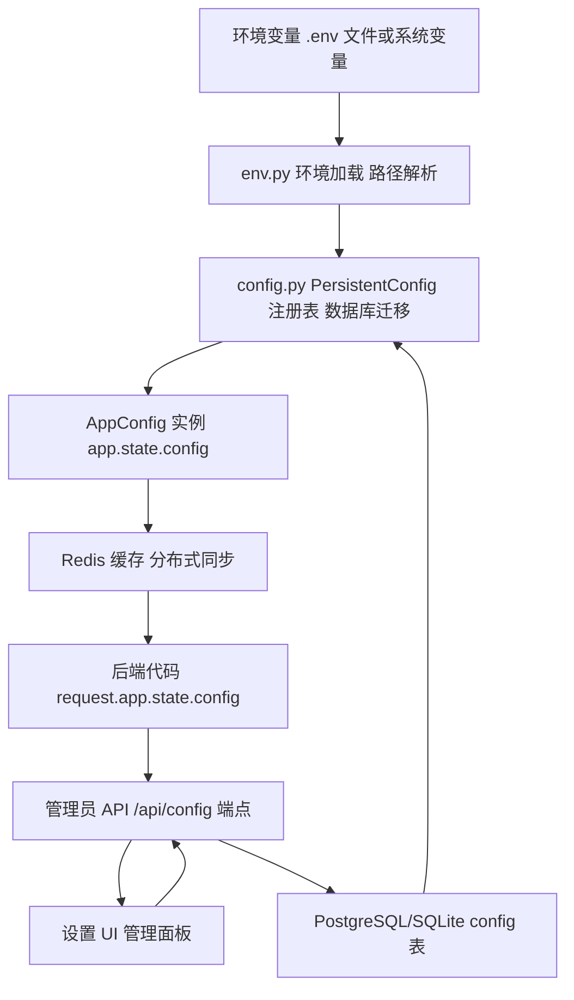
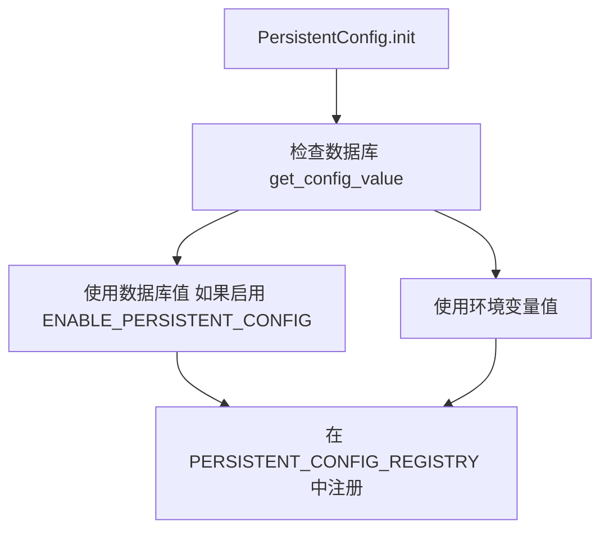
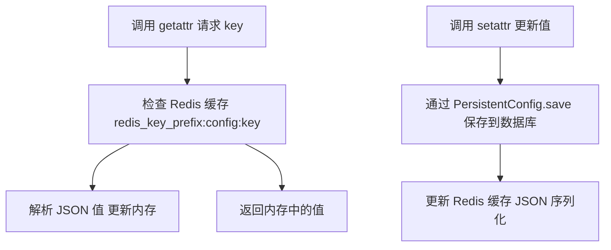
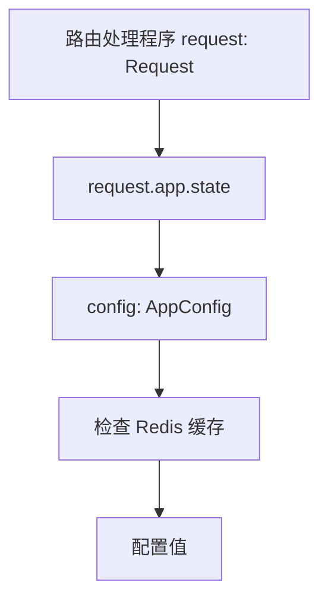
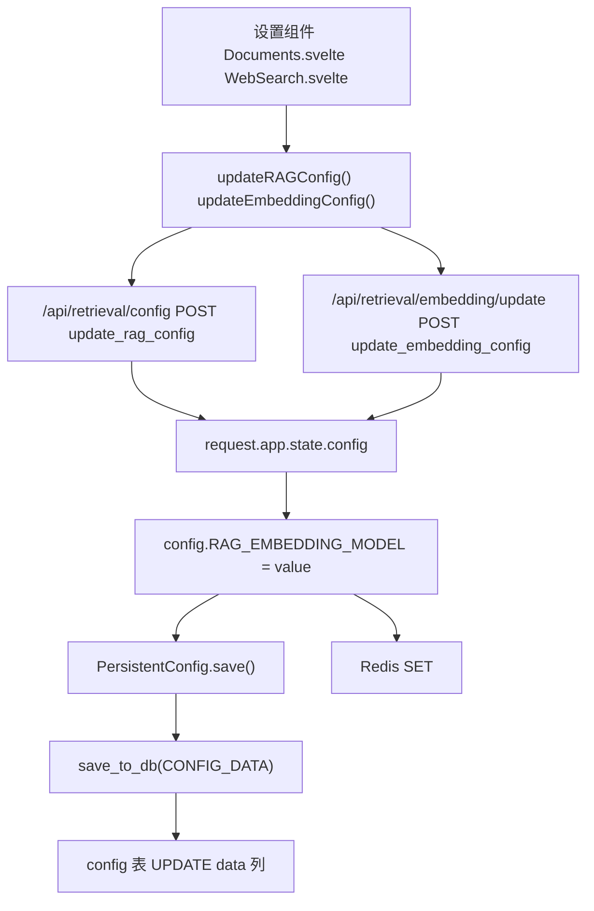
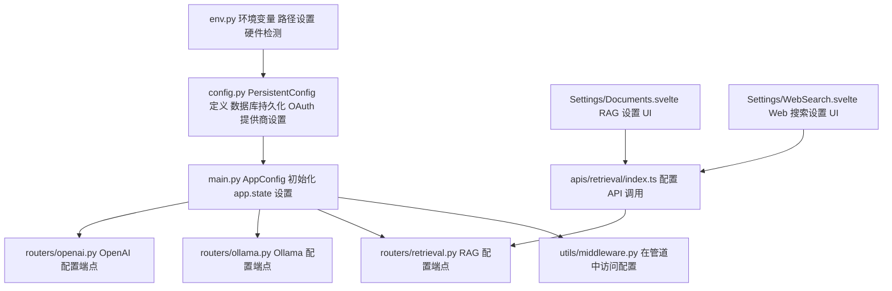
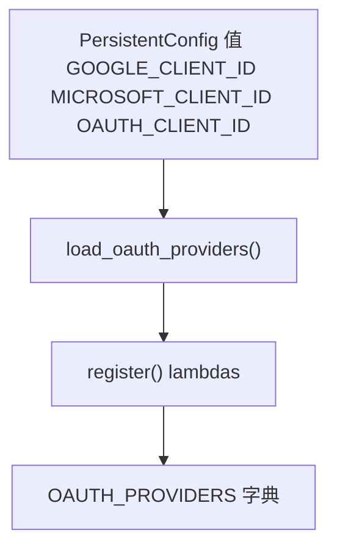

# 配置管理

相关源文件

-   [backend/open\_webui/config.py](https://github.com/open-webui/open-webui/blob/a7271532/backend/open_webui/config.py)
-   [backend/open\_webui/env.py](https://github.com/open-webui/open-webui/blob/a7271532/backend/open_webui/env.py)
-   [backend/open\_webui/main.py](https://github.com/open-webui/open-webui/blob/a7271532/backend/open_webui/main.py)
-   [backend/open\_webui/retrieval/loaders/datalab\_marker.py](https://github.com/open-webui/open-webui/blob/a7271532/backend/open_webui/retrieval/loaders/datalab_marker.py)
-   [backend/open\_webui/retrieval/loaders/external\_document.py](https://github.com/open-webui/open-webui/blob/a7271532/backend/open_webui/retrieval/loaders/external_document.py)
-   [backend/open\_webui/retrieval/loaders/external\_web.py](https://github.com/open-webui/open-webui/blob/a7271532/backend/open_webui/retrieval/loaders/external_web.py)
-   [backend/open\_webui/retrieval/loaders/main.py](https://github.com/open-webui/open-webui/blob/a7271532/backend/open_webui/retrieval/loaders/main.py)
-   [backend/open\_webui/retrieval/loaders/mineru.py](https://github.com/open-webui/open-webui/blob/a7271532/backend/open_webui/retrieval/loaders/mineru.py)
-   [backend/open\_webui/retrieval/loaders/mistral.py](https://github.com/open-webui/open-webui/blob/a7271532/backend/open_webui/retrieval/loaders/mistral.py)
-   [backend/open\_webui/retrieval/utils.py](https://github.com/open-webui/open-webui/blob/a7271532/backend/open_webui/retrieval/utils.py)
-   [backend/open\_webui/routers/audio.py](https://github.com/open-webui/open-webui/blob/a7271532/backend/open_webui/routers/audio.py)
-   [backend/open\_webui/routers/auths.py](https://github.com/open-webui/open-webui/blob/a7271532/backend/open_webui/routers/auths.py)
-   [backend/open\_webui/routers/ollama.py](https://github.com/open-webui/open-webui/blob/a7271532/backend/open_webui/routers/ollama.py)
-   [backend/open\_webui/routers/openai.py](https://github.com/open-webui/open-webui/blob/a7271532/backend/open_webui/routers/openai.py)
-   [backend/open\_webui/routers/retrieval.py](https://github.com/open-webui/open-webui/blob/a7271532/backend/open_webui/routers/retrieval.py)
-   [backend/open\_webui/utils/auth.py](https://github.com/open-webui/open-webui/blob/a7271532/backend/open_webui/utils/auth.py)
-   [backend/open\_webui/utils/embeddings.py](https://github.com/open-webui/open-webui/blob/a7271532/backend/open_webui/utils/embeddings.py)
-   [backend/open\_webui/utils/middleware.py](https://github.com/open-webui/open-webui/blob/a7271532/backend/open_webui/utils/middleware.py)
-   [backend/open\_webui/utils/misc.py](https://github.com/open-webui/open-webui/blob/a7271532/backend/open_webui/utils/misc.py)
-   [backend/open\_webui/utils/oauth.py](https://github.com/open-webui/open-webui/blob/a7271532/backend/open_webui/utils/oauth.py)
-   [backend/open\_webui/utils/response.py](https://github.com/open-webui/open-webui/blob/a7271532/backend/open_webui/utils/response.py)
-   [src/lib/apis/retrieval/index.ts](https://github.com/open-webui/open-webui/blob/a7271532/src/lib/apis/retrieval/index.ts)
-   [src/lib/components/admin/Settings/Documents.svelte](https://github.com/open-webui/open-webui/blob/a7271532/src/lib/components/admin/Settings/Documents.svelte)
-   [src/lib/components/admin/Settings/WebSearch.svelte](https://github.com/open-webui/open-webui/blob/a7271532/src/lib/components/admin/Settings/WebSearch.svelte)

## 目的和范围

本文档解释了 Open WebUI 的两层配置管理系统，该系统结合了环境变量与持久化数据库存储。该系统允许在运行时更新配置，同时保持对基于环境配置的向后兼容性。

有关初始部署设置和环境变量参考，请参阅[环境配置](/open-webui/open-webui/3.3-environment-configuration)。有关数据库设置详情，请参阅[数据和存储层](/open-webui/open-webui/2.4-data-and-storage-layer)。

## 配置架构概览

Open WebUI 使用混合配置方法，将静态环境变量与动态数据库持久化设置相结合：


**来源：** [backend/open\_webui/env.py1-100](https://github.com/open-webui/open-webui/blob/a7271532/backend/open_webui/env.py#L1-L100) [backend/open\_webui/config.py1-150](https://github.com/open-webui/open-webui/blob/a7271532/backend/open_webui/config.py#L1-L150) [backend/open\_webui/main.py638-656](https://github.com/open-webui/open-webui/blob/a7271532/backend/open_webui/main.py#L638-L656)

## 核心配置类

### Config 数据库模型

`Config` SQLAlchemy 模型将所有持久化配置存储在单个 JSON 列中：

| 列名 | 类型 | 描述 |
| --- | --- | --- |
| `id` | Integer | 主键 |
| `data` | JSON | 所有配置键值对 |
| `version` | Integer | 配置版本号 |
| `created_at` | DateTime | 创建时间戳 |
| `updated_at` | DateTime | 最后更新时间戳 |

配置以嵌套 JSON 的形式存储，使用点分隔路径（例如 `oauth.google.client_id`）。

**来源：** [backend/open\_webui/config.py73-81](https://github.com/open-webui/open-webui/blob/a7271532/backend/open_webui/config.py#L73-L81)

### PersistentConfig 类

`PersistentConfig` 是一个泛型类，管理单个配置值，并具有自动的环境变量/数据库回退机制：


关键方法和属性：

-   **`__init__(env_name, config_path, env_value)`** - 使用环境变量名称、数据库路径和默认值进行初始化
-   **`value`** - 当前配置值（如果数据库可用则取数据库值，否则取环境变量值）
-   **`update()`** - 当全局调用 `save_config()` 时，从数据库刷新值
-   **`save()`** - 将当前值持久化到数据库

**来源：** [backend/open\_webui/config.py165-222](https://github.com/open-webui/open-webui/blob/a7271532/backend/open_webui/config.py#L165-L222)

配置声明示例：

```
ENABLE_SIGNUP = PersistentConfig(
    "ENABLE_SIGNUP",
    "auth.enable_signup",
    os.environ.get("ENABLE_SIGNUP", "True").lower() == "true"
)
```
**来源：** [backend/open\_webui/config.py742-743](https://github.com/open-webui/open-webui/blob/a7271532/backend/open_webui/config.py#L742-L743)

### AppConfig 类

`AppConfig` 提供运行时的配置访问，并支持基于 Redis 的分布式缓存：


关键特性：

-   **`_state`** - 将配置键映射到 `PersistentConfig` 实例的字典
-   **`_redis`** - 用于分布式同步的 Redis 连接
-   **`__getattr__`** - 在返回值之前检查 Redis 是否有更新
-   **`__setattr__`** - 保存到数据库并广播到 Redis

**来源：** [backend/open\_webui/config.py224-284](https://github.com/open-webui/open-webui/blob/a7271532/backend/open_webui/config.py#L224-L284)

## 配置初始化流程

配置系统在应用程序启动期间分三个阶段进行初始化：

> **[Mermaid sequence]**
> *(图表结构无法解析)*

**来源：** [backend/open\_webui/env.py34-70](https://github.com/open-webui/open-webui/blob/a7271532/backend/open_webui/env.py#L34-L70) [backend/open\_webui/config.py53-70](https://github.com/open-webui/open-webui/blob/a7271532/backend/open_webui/config.py#L53-L70) [backend/open\_webui/config.py107-125](https://github.com/open-webui/open-webui/blob/a7271532/backend/open_webui/config.py#L107-L125) [backend/open\_webui/main.py570-656](https://github.com/open-webui/open-webui/blob/a7271532/backend/open_webui/main.py#L570-L656)

配置文件按以下顺序处理：

1.  **env.py** - 加载环境变量并设置路径
2.  **config.py** - 运行迁移，加载数据库配置，创建 `PersistentConfig` 实例
3.  **main.py** - 创建 `AppConfig` 实例并初始化 `app.state.config`

**来源：** [backend/open\_webui/main.py441-479](https://github.com/open-webui/open-webui/blob/a7271532/backend/open_webui/main.py#L441-L479) [backend/open\_webui/config.py1-50](https://github.com/open-webui/open-webui/blob/a7271532/backend/open_webui/config.py#L1-L50)

## 配置访问模式

### 后端访问模式

后端代码通过 FastAPI 的 request 对象访问配置：


访问模式示例：

```
# 在路由处理程序中
embedding_model = request.app.state.config.RAG_EMBEDDING_MODEL

# 在中间件中
if request.app.state.config.ENABLE_WEB_SEARCH:
    # ... web 搜索逻辑
```
**来源：** [backend/open\_webui/utils/middleware.py555-625](https://github.com/open-webui/open-webui/blob/a7271532/backend/open_webui/utils/middleware.py#L555-L625) [backend/open\_webui/routers/retrieval.py249-261](https://github.com/open-webui/open-webui/blob/a7271532/backend/open_webui/routers/retrieval.py#L249-L261)

### 基于 Redis 的分布式缓存

当配置了 Redis 时，`AppConfig` 会自动跨多个实例同步配置更新：

> **[Mermaid sequence]**
> *(图表结构无法解析)*

Redis 键使用的格式为：`{REDIS_KEY_PREFIX}:config:{CONFIG_KEY}`

**来源：** [backend/open\_webui/config.py251-283](https://github.com/open-webui/open-webui/blob/a7271532/backend/open_webui/config.py#L251-L283) [backend/open\_webui/env.py361-367](https://github.com/open-webui/open-webui/blob/a7271532/backend/open_webui/env.py#L361-L367)

## 配置更新流

配置可以在运行时通过管理员 API 端点进行更新：


**来源：** [src/lib/components/admin/Settings/Documents.svelte141-234](https://github.com/open-webui/open-webui/blob/a7271532/src/lib/components/admin/Settings/Documents.svelte#L141-L234) [backend/open\_webui/routers/retrieval.py329-441](https://github.com/open-webui/open-webui/blob/a7271532/backend/open_webui/routers/retrieval.py#L329-L441) [backend/open\_webui/config.py251-261](https://github.com/open-webui/open-webui/blob/a7271532/backend/open_webui/config.py#L251-L261)

### 更新 API 端点

关键配置端点：

| 端点 | 方法 | 用途 | 仅限管理员 |
| --- | --- | --- | --- |
| `/api/retrieval/config` | GET | 获取 RAG 配置 | 是 |
| `/api/retrieval/config` | POST | 更新 RAG 配置 | 是 |
| `/api/retrieval/embedding` | GET | 获取嵌入配置 | 是 |
| `/api/retrieval/embedding/update` | POST | 更新嵌入模型 | 是 |
| `/api/openai/config` | GET | 获取 OpenAI 配置 | 是 |
| `/api/openai/config/update` | POST | 更新 OpenAI 配置 | 是 |
| `/api/ollama/config` | GET | 获取 Ollama 配置 | 是 |
| `/api/ollama/config/update` | POST | 更新 Ollama 配置 | 是 |

**来源：** [backend/open\_webui/routers/retrieval.py443-522](https://github.com/open-webui/open-webui/blob/a7271532/backend/open_webui/routers/retrieval.py#L443-L522) [backend/open\_webui/routers/openai.py207-231](https://github.com/open-webui/open-webui/blob/a7271532/backend/open_webui/routers/openai.py#L207-L231) [backend/open\_webui/routers/ollama.py235-259](https://github.com/open-webui/open-webui/blob/a7271532/backend/open_webui/routers/ollama.py#L235-L259)

## 关键配置类别

Open WebUI 跨多个功能领域管理配置：

| 类别 | 关键配置 | 数据库位置 | 源文件 |
| --- | --- | --- | --- |
| **身份验证 (Authentication)** | `ENABLE_SIGNUP`, `JWT_EXPIRES_IN`, `ENABLE_API_KEYS` | `auth.*` | config.py:290-316 |
| **OAuth** | `GOOGLE_CLIENT_ID`, `OAUTH_MERGE_ACCOUNTS_BY_EMAIL`, `ENABLE_OAUTH_SIGNUP` | `oauth.*` | config.py:327-800 |
| **LDAP** | `ENABLE_LDAP`, `LDAP_SERVER_HOST`, `LDAP_SEARCH_BASE` | `ldap.*` | config.py:795-813 |
| **RAG/嵌入 (Embedding)** | `RAG_EMBEDDING_MODEL`, `RAG_EMBEDDING_ENGINE`, `CHUNK_SIZE` | `rag.*` | config.py:836-916 |
| **Web 搜索** | `ENABLE_WEB_SEARCH`, `WEB_SEARCH_ENGINE`, `SEARXNG_QUERY_URL` | `web.*` | config.py:923-983 |
| **图像生成** | `ENABLE_IMAGE_GENERATION`, `IMAGE_GENERATION_ENGINE`, `COMFYUI_BASE_URL` | `image.*` | config.py:1088-1112 |
| **音频** | `AUDIO_TTS_ENGINE`, `AUDIO_STT_ENGINE`, `WHISPER_MODEL` | `audio.*` | config.py:1126-1202 |
| **Ollama** | `ENABLE_OLLAMA_API`, `OLLAMA_BASE_URLS`, `OLLAMA_API_CONFIGS` | `ollama.*` | config.py:681-683 |
| **OpenAI** | `ENABLE_OPENAI_API`, `OPENAI_API_BASE_URLS`, `OPENAI_API_KEYS` | `openai.*` | config.py:693-696 |

**来源：** [backend/open\_webui/config.py286-1202](https://github.com/open-webui/open-webui/blob/a7271532/backend/open_webui/config.py#L286-L1202)

### 非持久化环境变量

某些配置值仅限环境，不支持数据库持久化：

| 变量 | 用途 | 定义位置 |
| --- | --- | --- |
| `DATA_DIR` | 数据存储目录 | env.py:210-233 |
| `DATABASE_URL` | 数据库连接字符串 | env.py:257-286 |
| `REDIS_URL` | Redis 连接字符串 | env.py:361 |
| `WEBUI_SECRET_KEY` | JWT 签名密钥 | env.py:450-455 |
| `DEVICE_TYPE` | 硬件加速 (cpu/cuda/mps) | env.py:44-69 |
| `ENABLE_PERSISTENT_CONFIG` | 启用/禁用数据库持久化 | config.py:160-162 |
| `ENABLE_OAUTH_PERSISTENT_CONFIG` | 启用/禁用 OAuth 数据库持久化 | config.py:328-330 |

**来源：** [backend/open\_webui/env.py210-455](https://github.com/open-webui/open-webui/blob/a7271532/backend/open_webui/env.py#L210-L455) [backend/open\_webui/config.py160-330](https://github.com/open-webui/open-webui/blob/a7271532/backend/open_webui/config.py#L160-L330)

## 配置文件组织

配置系统跨越多个文件，具有不同的职责：


**文件职责：**

-   **env.py** - 加载环境变量、路径解析、硬件检测
-   **config.py** - 配置持久化、`PersistentConfig` 注册表、OAuth 设置
-   **main.py** - 应用程序初始化、`AppConfig` 实例化
-   **routers/retrieval.py** - RAG 和嵌入配置 API
-   **routers/ollama.py** - Ollama 连接配置 API
-   **routers/openai.py** - OpenAI 连接配置 API
-   **Settings/\*.svelte** - 用于配置的管理员 UI 组件

**来源：** [backend/open\_webui/env.py1-50](https://github.com/open-webui/open-webui/blob/a7271532/backend/open_webui/env.py#L1-L50) [backend/open\_webui/config.py1-100](https://github.com/open-webui/open-webui/blob/a7271532/backend/open_webui/config.py#L1-L100) [backend/open\_webui/main.py1-100](https://github.com/open-webui/open-webui/blob/a7271532/backend/open_webui/main.py#L1-L100) [backend/open\_webui/routers/retrieval.py1-50](https://github.com/open-webui/open-webui/blob/a7271532/backend/open_webui/routers/retrieval.py#L1-L50) [src/lib/components/admin/Settings/Documents.svelte1-50](https://github.com/open-webui/open-webui/blob/a7271532/src/lib/components/admin/Settings/Documents.svelte#L1-L50)

## 特殊配置功能

### OAuth 动态配置

OAuth 提供商可以在运行时通过数据库进行配置。`load_oauth_providers()` 函数根据 `PersistentConfig` 值重新构建 `OAUTH_PROVIDERS` 字典：


当 OAuth 配置更新时，必须调用 `load_oauth_providers()` 来重新构建提供商注册表。

**来源：** [backend/open\_webui/config.py639-821](https://github.com/open-webui/open-webui/blob/a7271532/backend/open_webui/config.py#L639-L821)

### 配置重置

`RESET_CONFIG_ON_START` 环境变量会在启动期间触发 `reset_config()`，它会删除 `config` 表中的所有行，从而强制所有配置回退到环境变量：

```
if RESET_CONFIG_ON_START:
    reset_config()
```
**来源：** [backend/open\_webui/main.py575-576](https://github.com/open-webui/open-webui/blob/a7271532/backend/open_webui/main.py#L575-L576) [backend/open\_webui/config.py101-105](https://github.com/open-webui/open-webui/blob/a7271532/backend/open_webui/config.py#L101-L105)

### 遗留 config.json 迁移

在初始化期间，如果 `{DATA_DIR}/config.json` 存在，它会自动迁移到数据库：

```
if os.path.exists(f"{DATA_DIR}/config.json"):
    data = load_json_config()
    save_to_db(data)
    os.rename(f"{DATA_DIR}/config.json", f"{DATA_DIR}/old_config.json")
```
**来源：** [backend/open\_webui/config.py108-112](https://github.com/open-webui/open-webui/blob/a7271532/backend/open_webui/config.py#L108-L112)

## 配置访问控制

所有配置更新端点都需要管理员身份验证：

```
@router.post("/config/update")
async def update_config(
    request: Request,
    form_data: ConfigForm,
    user=Depends(get_admin_user)  # 仅限管理员
):
```
普通用户只能通过使用 `get_verified_user` 的端点读取其被允许的配置。

**来源：** [backend/open\_webui/routers/retrieval.py443-444](https://github.com/open-webui/open-webui/blob/a7271532/backend/open_webui/routers/retrieval.py#L443-L444) [backend/open\_webui/utils/auth.py225-285](https://github.com/open-webui/open-webui/blob/a7271532/backend/open_webui/utils/auth.py#L225-L285)
