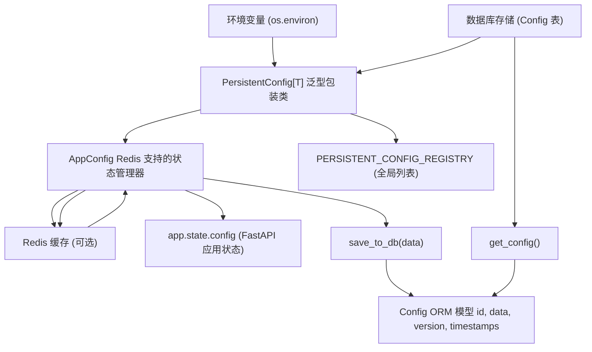
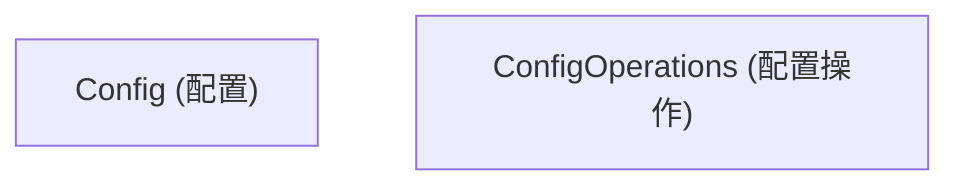
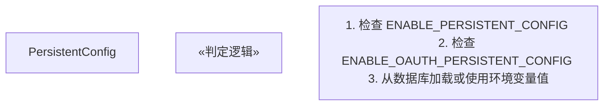
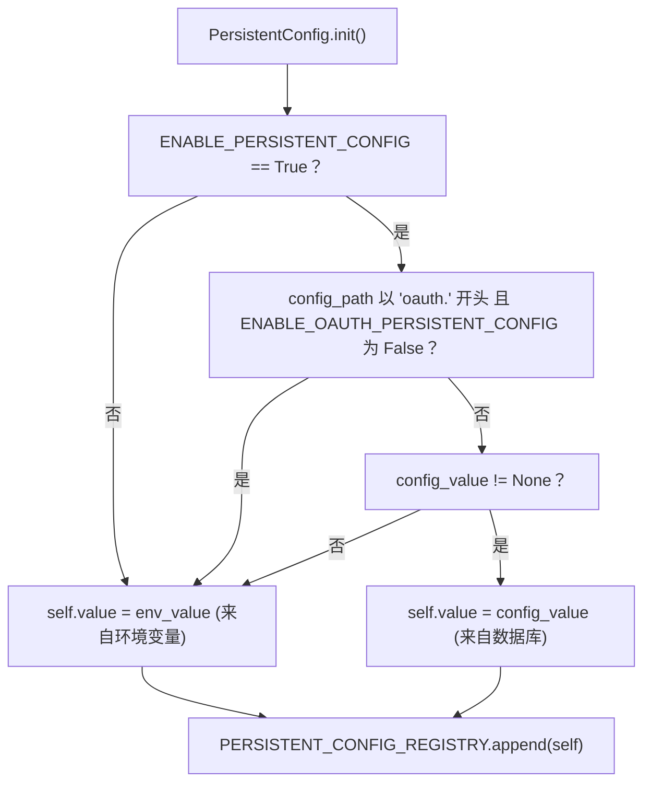
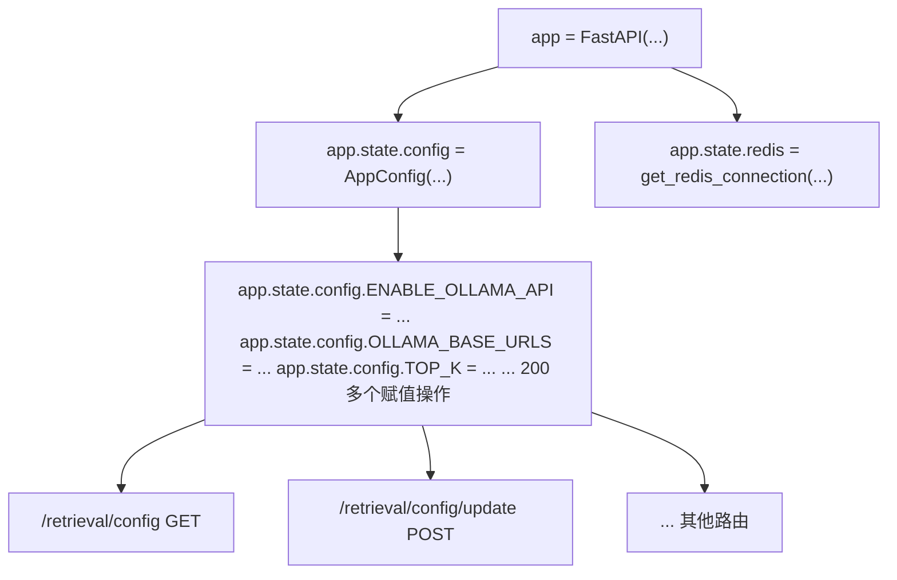
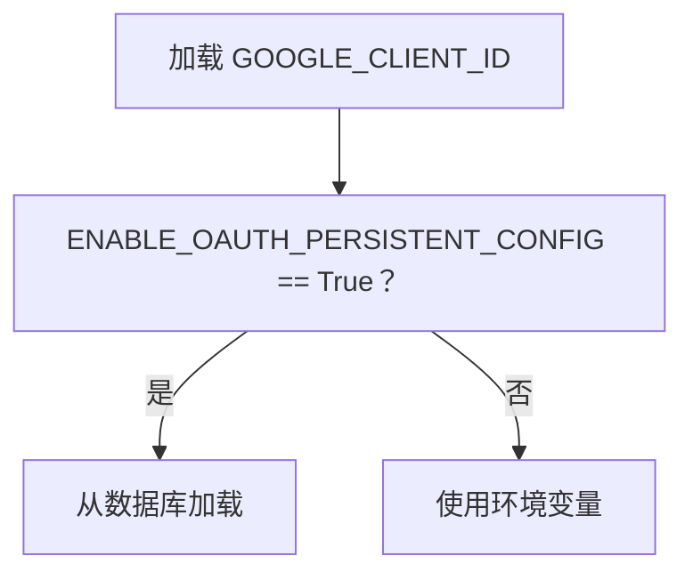
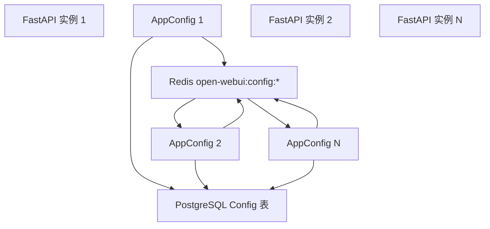
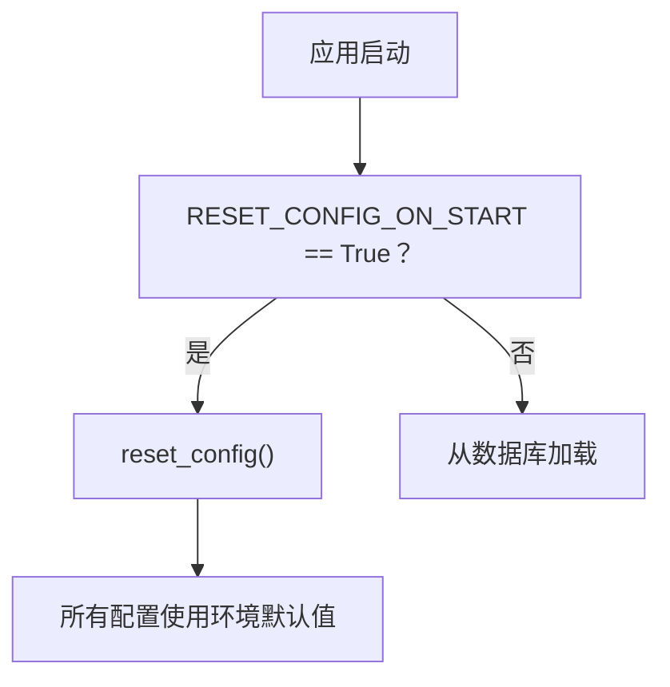
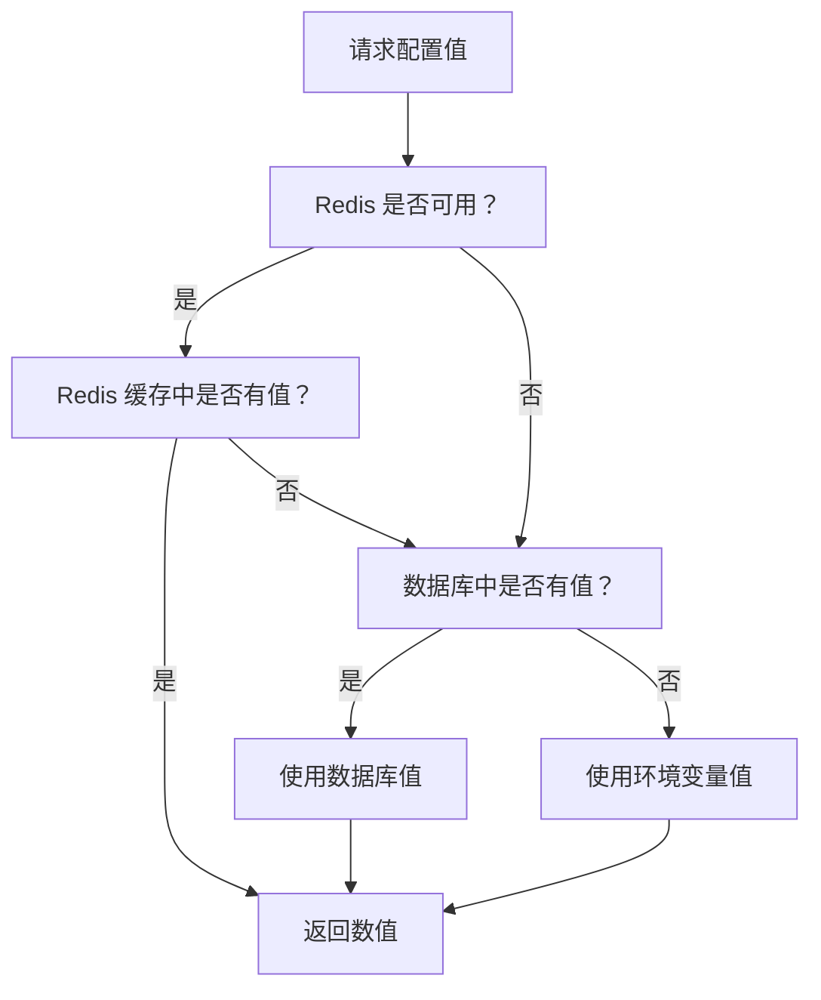

# 持久化配置系统

相关源文件

-   [backend/open\_webui/config.py](https://github.com/open-webui/open-webui/blob/a7271532/backend/open_webui/config.py)
-   [backend/open\_webui/main.py](https://github.com/open-webui/open-webui/blob/a7271532/backend/open_webui/main.py)
-   [backend/open\_webui/retrieval/loaders/datalab\_marker.py](https://github.com/open-webui/open-webui/blob/a7271532/backend/open_webui/retrieval/loaders/datalab_marker.py)
-   [backend/open\_webui/retrieval/loaders/external\_document.py](https://github.com/open-webui/open-webui/blob/a7271532/backend/open_webui/retrieval/loaders/external_document.py)
-   [backend/open\_webui/retrieval/loaders/external\_web.py](https://github.com/open-webui/open-webui/blob/a7271532/backend/open_webui/retrieval/loaders/external_web.py)
-   [backend/open\_webui/retrieval/loaders/main.py](https://github.com/open-webui/open-webui/blob/a7271532/backend/open_webui/retrieval/loaders/main.py)
-   [backend/open\_webui/retrieval/loaders/mineru.py](https://github.com/open-webui/open-webui/blob/a7271532/backend/open_webui/retrieval/loaders/mineru.py)
-   [backend/open\_webui/retrieval/loaders/mistral.py](https://github.com/open-webui/open-webui/blob/a7271532/backend/open_webui/retrieval/loaders/mistral.py)
-   [backend/open\_webui/retrieval/utils.py](https://github.com/open-webui/open-webui/blob/a7271532/backend/open_webui/retrieval/utils.py)
-   [backend/open\_webui/routers/retrieval.py](https://github.com/open-webui/open-webui/blob/a7271532/backend/open_webui/routers/retrieval.py)
-   [backend/open\_webui/utils/middleware.py](https://github.com/open-webui/open-webui/blob/a7271532/backend/open_webui/utils/middleware.py)
-   [src/lib/apis/retrieval/index.ts](https://github.com/open-webui/open-webui/blob/a7271532/src/lib/apis/retrieval/index.ts)
-   [src/lib/components/admin/Settings/Documents.svelte](https://github.com/open-webui/open-webui/blob/a7271532/src/lib/components/admin/Settings/Documents.svelte)
-   [src/lib/components/admin/Settings/WebSearch.svelte](https://github.com/open-webui/open-webui/blob/a7271532/src/lib/components/admin/Settings/WebSearch.svelte)

## 目的与范围

持久化配置系统提供了一个二级配置管理层，将环境变量与由数据库支持的持久化存储相结合。该系统允许在运行时更新配置值，并在应用重启后保持持久化，同时为分布式部署提供了可选的基于 Redis 的缓存。

有关环境变量初始化和硬件检测的信息，请参阅 [环境配置](/open-webui/open-webui/11.1-environment-configuration)。有关管理这些设置的用户界面，请参阅 [设置 UI](/open-webui/open-webui/11.3-settings-ui)。

## 系统架构


**来源：** [backend/open\_webui/config.py1-285](https://github.com/open-webui/open-webui/blob/a7271532/backend/open_webui/config.py#L1-L285)

## 数据库存储层

### Config ORM 模型

`Config` 表将配置数据存储为带有版本号和时间戳的 JSON blob：


配置数据以嵌套 JSON 结构存储，其中类似 `"oauth.google.client_id"` 的路径映射到嵌套字典中：

```json
{
  "version": 0,
  "ui": {},
  "oauth": {
    "google": {
      "client_id": "...",
      "client_secret": "..."
    }
  }
}
```
**来源：** [backend/open\_webui/config.py73-155](https://github.com/open-webui/open-webui/blob/a7271532/backend/open_webui/config.py#L73-L155)

### 配置迁移

在启动时，如果 `DATA_DIR` 中存在旧版的 `config.json` 文件，它将自动迁移到数据库中：

| 操作 | 函数 | 描述 |
| --- | --- | --- |
| 加载 JSON | `load_json_config()` | 从 DATA\_DIR 读取 config.json |
| 保存到数据库 | `save_to_db(data)` | 插入或更新 Config 表 |
| 迁移 | 启动时自动执行 | 将 config.json 重命名为 old\_config.json |

**来源：** [backend/open\_webui/config.py83-111](https://github.com/open-webui/open-webui/blob/a7271532/backend/open_webui/config.py#L83-L111)

## PersistentConfig 类

### 类型安全配置包装器

`PersistentConfig[T]` 是一个包装单个配置值的泛型类，提供了类型安全以及环境变量与数据库存储之间的自动同步：


**来源：** [backend/open\_webui/config.py165-222](https://github.com/open-webui/open-webui/blob/a7271532/backend/open_webui/config.py#L165-L222)

### 初始化逻辑

当创建一个 `PersistentConfig` 实例时，它遵循如下优先级链：


**来源：** [backend/open\_webui/config.py166-187](https://github.com/open-webui/open-webui/blob/a7271532/backend/open_webui/config.py#L166-L187)

### 配置更新机制

当全局配置被保存时，会调用 `update()` 方法，允许所有注册的实例刷新其值：

| 方法 | 用途 | 触发者 |
| --- | --- | --- |
| `update()` | 从数据库刷新值 | 由 `save_config()` 调用 |
| `save()` | 将值写入数据库 | 由 `AppConfig.__setattr__` 调用 |

**来源：** [backend/open\_webui/config.py205-221](https://github.com/open-webui/open-webui/blob/a7271532/backend/open_webui/config.py#L205-L221)

## AppConfig 类

### Redis 支持的状态管理器

`AppConfig` 提供了一个类字典接口，具有自动持久化和可选的 Redis 缓存功能：


**来源：** [backend/open\_webui/config.py224-283](https://github.com/open-webui/open-webui/blob/a7271532/backend/open_webui/config.py#L224-L283)

### 属性访问流程

#### 读取操作 (`__getattr__`)

> **[Mermaid sequence]**
> *(图表结构无法解析)*

**来源：** [backend/open\_webui/config.py262-283](https://github.com/open-webui/open-webui/blob/a7271532/backend/open_webui/config.py#L262-L283)

#### 写入操作 (`__setattr__`)

> **[Mermaid sequence]**
> *(图表结构无法解析)*

**来源：** [backend/open\_webui/config.py251-260](https://github.com/open-webui/open-webui/blob/a7271532/backend/open_webui/config.py#L251-L260)

## 配置注册表

### 全局注册表模式

所有 `PersistentConfig` 实例都会自动注册在一个全局列表中，从而实现了批量更新：

**来源：** [backend/open\_webui/config.py139-155](https://github.com/open-webui/open-webui/blob/a7271532/backend/open_webui/config.py#L139-L155)

### 注册表用法示例

注册表在 `save_config()` 中被用来将更改传播到所有配置实例：

| 步骤 | 操作 | 效果 |
| --- | --- | --- |
| 1 | `save_to_db(config)` | 持久化到数据库 |
| 2 | `CONFIG_DATA = config` | 更新全局状态 |
| 3 | `for config_item in PERSISTENT_CONFIG_REGISTRY` | 遍历注册表 |
| 4 | `config_item.update()` | 从数据库刷新每个实例 |

**来源：** [backend/open\_webui/config.py142-155](https://github.com/open-webui/open-webui/blob/a7271532/backend/open_webui/config.py#L142-L155)

## 应用集成

### FastAPI 应用状态

在启动期间，`AppConfig` 实例被附加到 FastAPI 的应用状态中：


**来源：** [backend/open\_webui/main.py633-656](https://github.com/open-webui/open-webui/blob/a7271532/backend/open_webui/main.py#L633-L656) [backend/open\_webui/main.py681-1200](https://github.com/open-webui/open-webui/blob/a7271532/backend/open_webui/main.py#L681-L1200)

### 路由中的配置使用

路由通过 `request.app.state.config` 访问配置：

```python
# 来自检索路由器的示例
@router.get("/config")
async def get_rag_config(request: Request, user=Depends(get_admin_user)):
    return {
        "RAG_TEMPLATE": request.app.state.config.RAG_TEMPLATE,
        "TOP_K": request.app.state.config.TOP_K,
        "CHUNK_SIZE": request.app.state.config.CHUNK_SIZE,
        # ... 更多配置值
    }
```
**来源：** [backend/open\_webui/routers/retrieval.py443-527](https://github.com/open-webui/open-webui/blob/a7271532/backend/open_webui/routers/retrieval.py#L443-L527)

## 配置更新流程

### 端到端更新过程

> **[Mermaid sequence]**
> *(图表结构无法解析)*

**来源：** [backend/open\_webui/config.py142-155](https://github.com/open-webui/open-webui/blob/a7271532/backend/open_webui/config.py#L142-L155) [backend/open\_webui/config.py251-283](https://github.com/open-webui/open-webui/blob/a7271532/backend/open_webui/config.py#L251-L283) [backend/open\_webui/routers/retrieval.py824-921](https://github.com/open-webui/open-webui/blob/a7271532/backend/open_webui/routers/retrieval.py#L824-L921)

## 配置类别

### 主要配置组

系统管理多个领域的配置：

| 类别 | 示例配置 | 配置路径前缀 |
| --- | --- | --- |
| 身份验证 | `JWT_EXPIRES_IN`, `ENABLE_API_KEYS` | `auth.*` |
| OAuth | `GOOGLE_CLIENT_ID`, `OAUTH_SCOPES` | `oauth.*` |
| RAG | `RAG_EMBEDDING_MODEL`, `CHUNK_SIZE` | 多种 |
| LLM 提供者 | `OLLAMA_BASE_URLS`, `OPENAI_API_KEYS` | 多种 |
| Web UI | `ENABLE_SIGNUP`, `DEFAULT_MODELS` | 多种 |
| 联网搜索 | `WEB_SEARCH_ENGINE`, `BRAVE_SEARCH_API_KEY` | `web.*` |

**来源：** [backend/open\_webui/config.py290-821](https://github.com/open-webui/open-webui/blob/a7271532/backend/open_webui/config.py#L290-L821)

### OAuth 配置特殊处理

OAuth 配置具有一个特殊的 `ENABLE_OAUTH_PERSISTENT_CONFIG` 标志，用于控制是否从数据库加载：


这允许管理员选择是通过环境变量管理 OAuth 设置（出于安全性考量），还是通过数据库管理（出于便捷性考量）。

**来源：** [backend/open\_webui/config.py173-180](https://github.com/open-webui/open-webui/blob/a7271532/backend/open_webui/config.py#L173-L180) [backend/open\_webui/config.py328-330](https://github.com/open-webui/open-webui/blob/a7271532/backend/open_webui/config.py#L328-L330)

## Redis 分发层

### 多实例同步

配置了 Redis 后，系统支持分布式部署，多个 Open WebUI 实例共享配置状态：


Redis 键的模式为 `{redis_key_prefix}:config:{config_key}`，默认值为 `open-webui:config:{config_key}`。

**来源：** [backend/open\_webui/config.py224-283](https://github.com/open-webui/open-webui/blob/a7271532/backend/open_webui/config.py#L224-L283) [backend/open\_webui/main.py649-655](https://github.com/open-webui/open-webui/blob/a7271532/backend/open_webui/main.py#L649-L655)

## 配置重置

### 重置机制

系统提供了一个 `reset_config()` 函数来清除所有持久化配置：

```python
def reset_config():
    with get_db() as db:
        db.query(Config).delete()
        db.commit()
```
这由 `RESET_CONFIG_ON_START` 环境变量触发：


**来源：** [backend/open\_webui/config.py101-105](https://github.com/open-webui/open-webui/blob/a7271532/backend/open_webui/config.py#L101-L105) [backend/open\_webui/main.py575-576](https://github.com/open-webui/open-webui/blob/a7271532/backend/open_webui/main.py#L575-L576)

## 配置优先级

### 数值解析顺序

系统按以下优先级顺序（从高到低）解析配置值：

1.  通过 API 进行的**运行时更新**（持久化到数据库和 Redis）。
2.  **数据库存储**（Config 表）。
3.  **环境变量**（初始值）。


**来源：** [backend/open\_webui/config.py165-222](https://github.com/open-webui/open-webui/blob/a7271532/backend/open_webui/config.py#L165-L222) [backend/open\_webui/config.py262-283](https://github.com/open-webui/open-webui/blob/a7271532/backend/open_webui/config.py#L262-L283)
