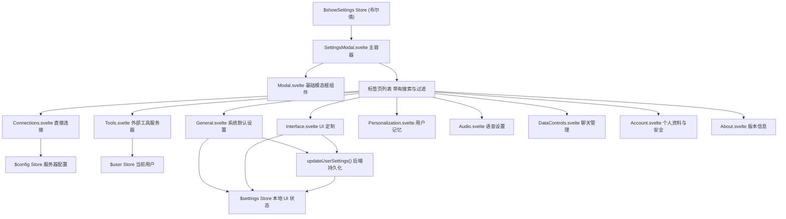
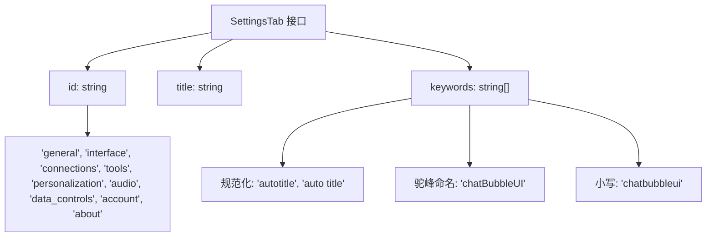
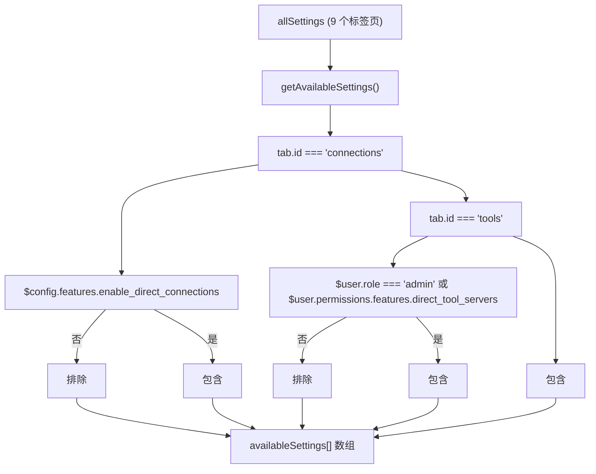
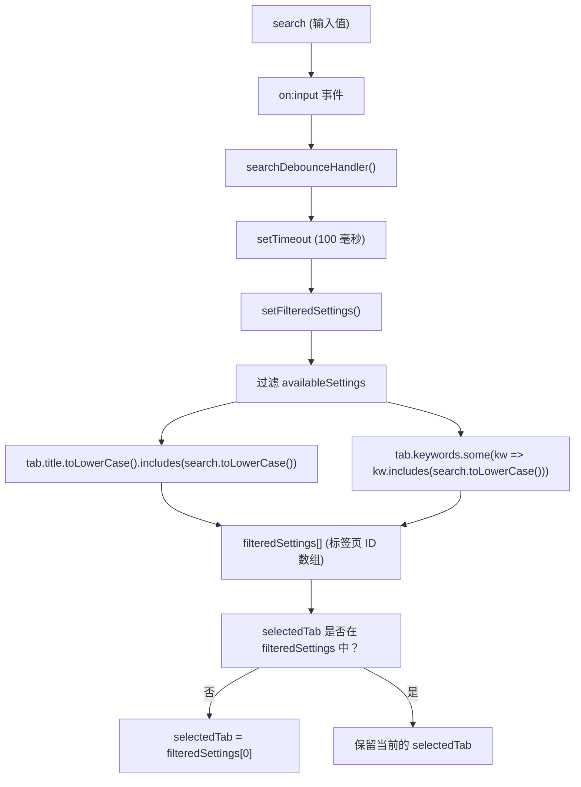
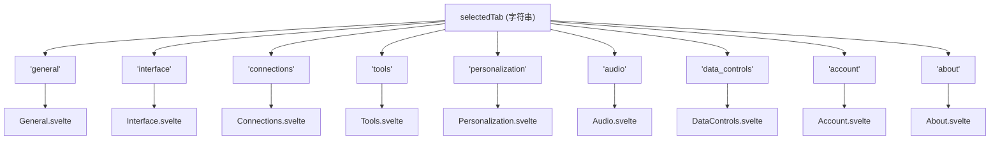
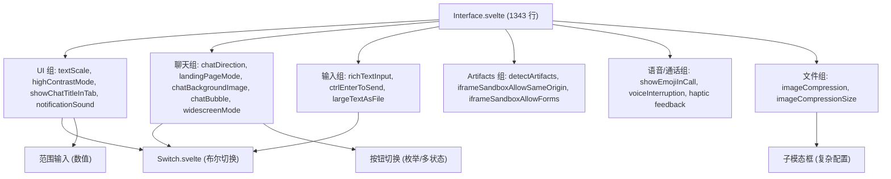
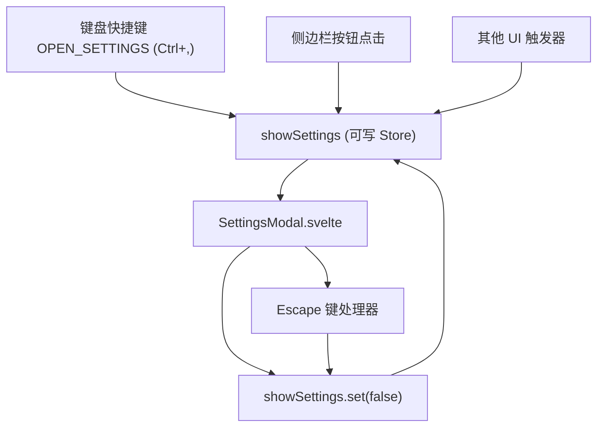
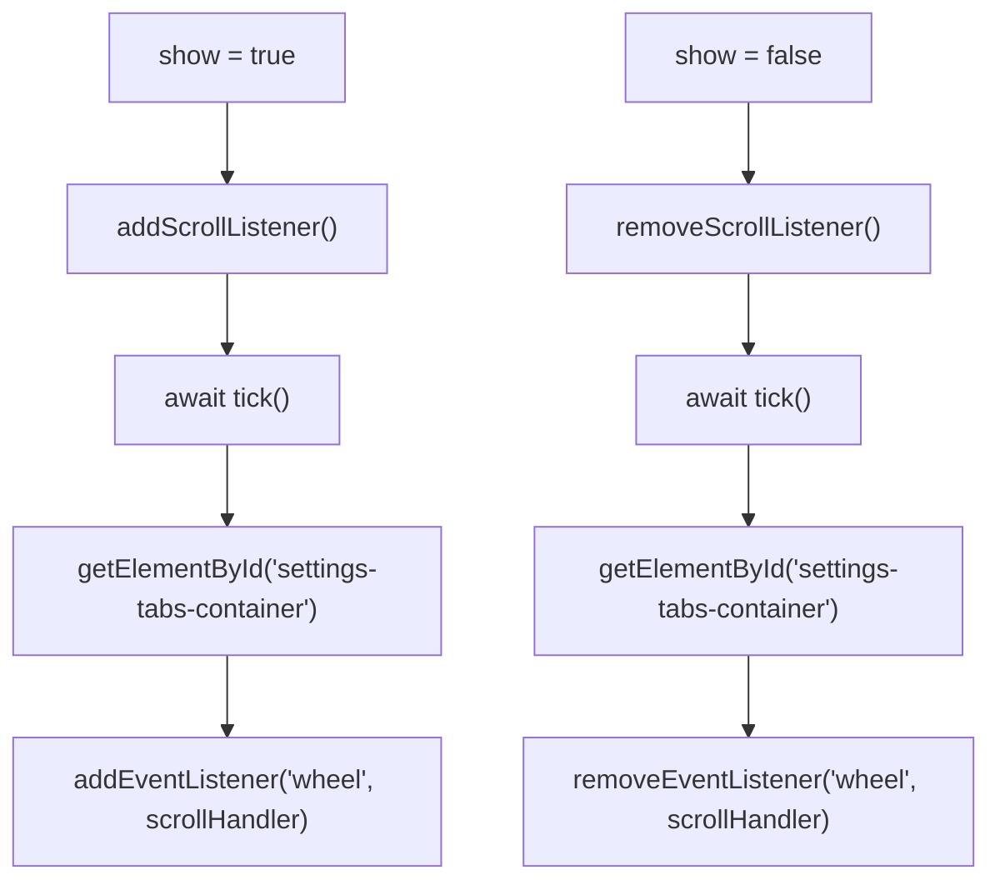
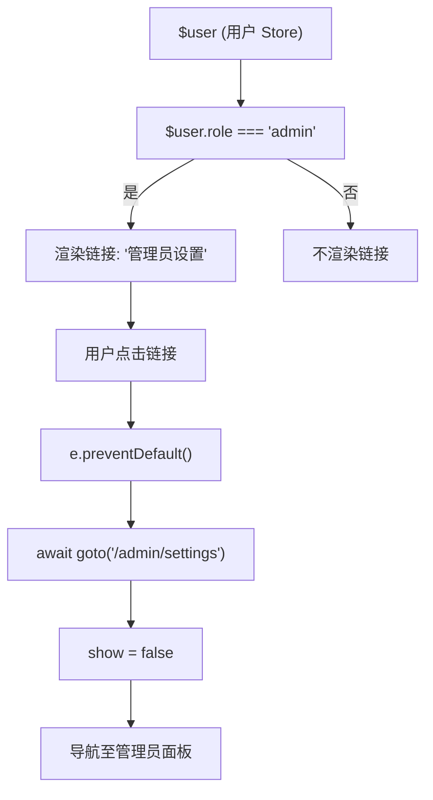

# 设置 UI

相关源文件

-   [src/lib/components/chat/Messages.svelte](https://github.com/open-webui/open-webui/blob/a7271532/src/lib/components/chat/Messages.svelte)
-   [src/lib/components/chat/Messages/ResponseMessage.svelte](https://github.com/open-webui/open-webui/blob/a7271532/src/lib/components/chat/Messages/ResponseMessage.svelte)
-   [src/lib/components/chat/Messages/UserMessage.svelte](https://github.com/open-webui/open-webui/blob/a7271532/src/lib/components/chat/Messages/UserMessage.svelte)
-   [src/lib/components/chat/Settings/Interface.svelte](https://github.com/open-webui/open-webui/blob/a7271532/src/lib/components/chat/Settings/Interface.svelte)
-   [src/lib/components/chat/SettingsModal.svelte](https://github.com/open-webui/open-webui/blob/a7271532/src/lib/components/chat/SettingsModal.svelte)
-   [src/lib/components/common/Modal.svelte](https://github.com/open-webui/open-webui/blob/a7271532/src/lib/components/common/Modal.svelte)
-   [src/lib/utils/index.ts](https://github.com/open-webui/open-webui/blob/a7271532/src/lib/utils/index.ts)
-   [src/routes/(app)/+layout.svelte](https://github.com/open-webui/open-webui/blob/a7271532/src/routes/(app)/+layout.svelte)
-   [src/routes/(app)/+page.svelte](https://github.com/open-webui/open-webui/blob/a7271532/src/routes/(app)/+page.svelte)
-   [src/routes/(app)/c/\[id\]/+page.svelte](src/routes/(app)/c/%5Bid%5D/+page.svelte)

## 目的与范围

设置 UI (`SettingsModal.svelte`) 是用于配置应用程序偏好设置、账户详情和特性行为的主要用户界面。它提供了一个带有搜索功能的标签页界面，将数十个配置选项组织到九个主要类别中。本文档涵盖了该模态框的架构、标签页系统、搜索过滤以及与后端持久层的集成。

该模态框在根布局 [src/routes/(app)/+layout.svelte304](https://github.com/open-webui/open-webui/blob/a7271532/src/routes/(app)/+layout.svelte#L304-L304) 中渲染，并由 `$showSettings` store 控制。设置通过 `updateUserSettings()` API 调用持久化到后端数据库。

有关持久化配置存储层的信息，请参阅第 11.2 页（持久化配置系统）。有关控制标签页可见性的身份验证和用户权限，请参阅第 10 页（身份验证与安全）。

---

## 架构概览

设置模态框遵循基于标签页的架构，每个标签页加载一个负责特定设置领域的独立组件。该模态框包含基于角色的标签页可见性、基于关键词的搜索以及将更改自动持久化到后端。


**来源：** [src/lib/components/chat/SettingsModal.svelte1-920](https://github.com/open-webui/open-webui/blob/a7271532/src/lib/components/chat/SettingsModal.svelte#L1-L920)

---

## 组件层级与文件结构

设置模态框由一个主协调组件和九个专门的标签页组件组成：

| 组件文件 | 用途 | 代码行数 |
| --- | --- | --- |
| `SettingsModal.svelte` | 主模态框容器、标签页路由、搜索 | 920 |
| `Settings/General.svelte` | 系统提示词、参数、语言 | 约 400 |
| `Settings/Interface.svelte` | UI 缩放、聊天气泡、通知 | 1343 |
| `Settings/Connections.svelte` | 直接 API 连接管理 | 约 200 |
| `Settings/Tools.svelte` | 外部工具服务器配置 | 约 200 |
| `Settings/Personalization.svelte` | 记忆、自定义指令 | 约 300 |
| `Settings/Audio.svelte` | TTS/STT、语音设置 | 约 400 |
| `Settings/DataControls.svelte` | 导入/导出、归档聊天 | 约 200 |
| `Settings/Account.svelte` | 个人资料、密码、API 密钥 | 约 300 |
| `Settings/About.svelte` | 版本、许可证、链接 | 约 150 |

**来源：** [src/lib/components/chat/SettingsModal.svelte10-16](https://github.com/open-webui/open-webui/blob/a7271532/src/lib/components/chat/SettingsModal.svelte#L10-L16)

---

## 标签页系统与注册

### 标签页定义结构

**标签页定义：`SettingsTab` 接口**

每个标签页都带有一个 ID、本地化标题以及用于搜索功能的详尽关键词：


`allSettings` 数组包含所有可能的标签页：

```typescript
interface SettingsTab {
  id: string;
  title: string;
  keywords: string[];
}

const allSettings: SettingsTab[] = [
  { id: 'general', title: 'General', keywords: [...] },
  { id: 'interface', title: 'Interface', keywords: [...] },
  // ... 其他 7 个标签页
];
```
**“界面 (interface)”标签页的关键词覆盖示例** (共 123 个关键词)：

-   布尔设置：`'highContrastMode'`, `'high contrast mode'`
-   特性名称：`'widescreen mode'`, `'chat bubble ui'`, `'haptic feedback'`
-   相关术语：`'android'`, `'beta'`, `'fullscreen'`

**来源：** [src/lib/components/chat/SettingsModal.svelte42-469](https://github.com/open-webui/open-webui/blob/a7271532/src/lib/components/chat/SettingsModal.svelte#L42-L469)

### 基于角色的标签页可见性

**函数：`getAvailableSettings()`**

并非所有标签页对所有用户都可见。`getAvailableSettings()` 函数根据 `$config` 和 `$user` 权限过滤标签页：


**可见性规则：**

| 标签页 ID | 可见性条件 |
| --- | --- |
| `'connections'` | `$config.features.enable_direct_connections === true` |
| `'tools'` | `$user.role === 'admin'` 或 `$user.permissions.features.direct_tool_servers === true` |
| 其他所有标签页 | 始终可见 |

**来源：** [src/lib/components/chat/SettingsModal.svelte477-492](https://github.com/open-webui/open-webui/blob/a7271532/src/lib/components/chat/SettingsModal.svelte#L477-L492)

---

## 搜索与过滤系统

### 搜索实现

**函数：`searchDebounceHandler()` 和 `setFilteredSettings()`**

该模态框包含一个搜索输入框（仅限桌面端，移动端隐藏），通过与标签页标题和关键词匹配来过滤标签页：


**搜索算法：**

1.  用户在搜索输入框（ID: `'search-input-settings-modal'`）中键入。
2.  `searchDebounceHandler()` 设置 100 毫秒超时后调用 `setFilteredSettings()`。
3.  `setFilteredSettings()` 过滤 `availableSettings`：
    -   如果 `tab.title.toLowerCase().includes(search.toLowerCase())` 则匹配。
    -   或者，如果 `tab.keywords` 的任何元素包含搜索词（小写）则匹配。
4.  如果当前 `selectedTab` 不在 `filteredSettings` 中，则自动选择第一个匹配项。
5.  空搜索 (`search === ''`) 会显示所有 `availableSettings`。

**来源：** [src/lib/components/chat/SettingsModal.svelte510-518](https://github.com/open-webui/open-webui/blob/a7271532/src/lib/components/chat/SettingsModal.svelte#L510-L518) [src/lib/components/chat/SettingsModal.svelte494-508](https://github.com/open-webui/open-webui/blob/a7271532/src/lib/components/chat/SettingsModal.svelte#L494-L508) [src/lib/components/chat/SettingsModal.svelte593-612](https://github.com/open-webui/open-webui/blob/a7271532/src/lib/components/chat/SettingsModal.svelte#L593-L612)

### 关键词覆盖

关键词系统非常详尽。例如，“界面 (interface)”标签页包含 123 个关键词，涵盖了各种拼写和变体：

-   包含/不含空格：`'autotitle'`, `'auto title'`。
-   驼峰命名变体：`'chatBubbleUI'`, `'chat bubble ui'`。
-   特定特性：`'widescreen mode'`, `'fullscreen'`, `'haptic feedback'`。
-   相关概念：`'android'`, `'beta'`, `'copy formatted text'`。

**来源：** [src/lib/components/chat/SettingsModal.svelte81-207](https://github.com/open-webui/open-webui/blob/a7271532/src/lib/components/chat/SettingsModal.svelte#L81-L207)

---

## 设置持久化

### 保存流程

**函数：`saveSettings(updated)`**

当用户在任何标签页组件中修改设置时，更改将通过 `saveSettings` 回调持久化：

> **[Mermaid sequence]**
> *(图表结构无法解析)*

**位于 [src/lib/components/chat/SettingsModal.svelte520-525](https://github.com/open-webui/open-webui/blob/a7271532/src/lib/components/chat/SettingsModal.svelte#L520-L525) 的实现：**

```javascript
const saveSettings = async (updated) => {
  console.log(updated);
  await settings.set({ ...$settings, ...updated });
  await models.set(await getModels());
  await updateUserSettings(localStorage.token, { ui: $settings });
};
```
**保存序列：**

1.  标签页组件调用 `saveSettings({ changedKey: newValue })`。
2.  将 `updated` 对象合并到 `$settings` store：`{ ...$settings, ...updated }`。
3.  调用 `getModels()` 刷新模型列表（对于连接更改至关重要）。
4.  调用 `updateUserSettings(localStorage.token, { ui: $settings })` 持久化到后端。
5.  标签页组件通过 `on:save` 事件或内联方式显示成功提示 (toast)。

**来源：** [src/lib/components/chat/SettingsModal.svelte520-525](https://github.com/open-webui/open-webui/blob/a7271532/src/lib/components/chat/SettingsModal.svelte#L520-L525) [src/lib/components/chat/SettingsModal.svelte527-532](https://github.com/open-webui/open-webui/blob/a7271532/src/lib/components/chat/SettingsModal.svelte#L527-L532)

### 模型刷新

在设置更改后调用 `getModels()` 至关重要，因为多项设置会影响模型的可用性：

-   **直接连接**：如果启用了 `$config.features.enable_direct_connections` 且设置了 `$settings.directConnections`，则会包含来自这些连接的模型。
-   该函数将基础模型与外部兼容 OpenAI 的端点合并。

**来源：** [src/lib/components/chat/SettingsModal.svelte527-532](https://github.com/open-webui/open-webui/blob/a7271532/src/lib/components/chat/SettingsModal.svelte#L527-L532)

---

## 标签页组件与渲染

### 条件标签页渲染

**变量：`selectedTab` (字符串)**

主内容区域使用 Svelte 的 `{#if}/{:else if}` 块，根据 `selectedTab` 渲染相应的标签页组件：


**位于 [src/lib/components/chat/SettingsModal.svelte862-916](https://github.com/open-webui/open-webui/blob/a7271532/src/lib/components/chat/SettingsModal.svelte#L862-L916) 的标签页组件调用模式：**

**模式 1：传递 `saveSettings` + 监听 `on:save` 事件**

```html
{#if selectedTab === 'interface'}
  <Interface
    {saveSettings}
    on:save={() => {
      toast.success($i18n.t('Settings saved successfully!'));
    }}
  />
{/if}
```
**模式 2：使用内联提示包装 `saveSettings`**

```html
{#if selectedTab === 'connections'}
  <Connections
    saveSettings={async (updated) => {
      await saveSettings(updated);
      toast.success($i18n.t('Settings saved successfully!'));
    }}
  />
{/if}
```
大多数标签页使用模式 1（常规、界面、个性化、音频、账户、关于）。只有“连接”和“工具”使用模式 2。

**来源：** [src/lib/components/chat/SettingsModal.svelte862-916](https://github.com/open-webui/open-webui/blob/a7271532/src/lib/components/chat/SettingsModal.svelte#L862-L916)

---

## 标签页专用组件

### 界面标签页示例

**组件：`Interface.svelte`**

“界面”标签页是最复杂的设置标签页，代码行数达 1343 行，管理着数十项 UI 偏好设置，并组织在逻辑组中：


**选定的界面设置：**

| 设置键 | 类型 | 取值范围 | 描述 |
| --- | --- | --- | --- |
| `textScale` | `number` | 1.0-1.5 | UI 字体缩放倍数 (null 为默认) |
| `highContrastMode` | `boolean` | true/false | 增强对比度以提高无障碍性 |
| `notificationSound` | `boolean` | true/false | 消息完成时播放声音 |
| `chatDirection` | `string` | 'LTR', 'RTL', 'auto' | 聊天消息的文字方向 |
| `chatBubble` | `boolean` | true/false | 聊天气泡 UI vs. 传统布局 |
| `widescreenMode` | `boolean` | true/false | 全宽聊天容器 |
| `richTextInput` | `boolean` | true/false | Tiptap 富文本编辑器 vs. 文本框 |
| `imageCompression` | `boolean` | true/false | 上传前压缩图像 |
| `iframeSandboxAllowSameOrigin` | `boolean` | true/false | 允许 Artifacts 访问同源资源 |

**用于高级配置的子模态框：**

-   `ManageFloatingActionButtonsModal`：配置文本选择操作。
-   `ManageImageCompressionModal`：设置压缩尺寸。

**来源：** [src/lib/components/chat/Settings/Interface.svelte1-1343](https://github.com/open-webui/open-webui/blob/a7271532/src/lib/components/chat/Settings/Interface.svelte#L1-L1343) [src/lib/components/chat/Settings/Interface.svelte197-272](https://github.com/open-webui/open-webui/blob/a7271532/src/lib/components/chat/Settings/Interface.svelte#L197-L272)

### 通用设置模式

所有标签页组件都遵循类似的模式：

1.  **在 onMount 中进行状态初始化**：从 `$settings` store 加载数值。
2.  **响应式保存处理器**：调用带有更新值的 `saveSettings()` prop。
3.  **表单结构**：每个设置都在带有标签和控件的弹性行 (flex row) 中。
4.  **无障碍性**：所有控件都具有 `aria-labelledby` 属性。
5.  **条件区块**：某些设置仅在其他设置选定时可见。

**来源：** [src/lib/components/chat/Settings/Interface.svelte197-272](https://github.com/open-webui/open-webui/blob/a7271532/src/lib/components/chat/Settings/Interface.svelte#L197-L272)

---

## 模态框集成与生命周期

### 通过 Store 激活

**Store: `showSettings` (Writable<boolean>)**

模态框的可见性由 `showSettings` Svelte store 控制，这是一个布尔类型的可写 store：


**位于 [src/routes/(app)/+layout.svelte304](https://github.com/open-webui/open-webui/blob/a7271532/src/routes/(app)/+layout.svelte#L304-L304) 的模态框实例化：**

```html
<SettingsModal bind:show={$showSettings} />
```
模态框在根布局中实例化一次并保留在 DOM 中。`bind:show` 指令创建了与 `SettingsModal.svelte` 中 `show` prop 的双向绑定。

**位于 [src/routes/(app)/+layout.svelte220-223](https://github.com/open-webui/open-webui/blob/a7271532/src/routes/(app)/+layout.svelte#L220-L223) 的键盘快捷键注册：**

```javascript
else if (isShortcutMatch(event, shortcuts[Shortcut.OPEN_SETTINGS])) {
  console.log('Shortcut triggered: OPEN_SETTINGS');
  event.preventDefault();
  showSettings.set(!$showSettings);
}
```
**来源：** [src/routes/(app)/+layout.svelte304](https://github.com/open-webui/open-webui/blob/a7271532/src/routes/(app)/+layout.svelte#L304-L304) [src/routes/(app)/+layout.svelte220-223](https://github.com/open-webui/open-webui/blob/a7271532/src/routes/(app)/+layout.svelte#L220-L223) [src/lib/components/chat/SettingsModal.svelte34](https://github.com/open-webui/open-webui/blob/a7271532/src/lib/components/chat/SettingsModal.svelte#L34-L34)

### 模态框基础组件

**组件：`Modal.svelte`**

`SettingsModal` 包装了 [src/lib/components/chat/SettingsModal.svelte572](https://github.com/open-webui/open-webui/blob/a7271532/src/lib/components/chat/SettingsModal.svelte#L572-L572) 处的通用 `Modal.svelte` 基础组件：

```html
<Modal size="2xl" bind:show>
  <!-- 设置内容 -->
</Modal>
```
**位于 [src/lib/components/common/Modal.svelte1-134](https://github.com/open-webui/open-webui/blob/a7271532/src/lib/components/common/Modal.svelte#L1-L134) 的 Modal.svelte 特性：**

| 特性 | 实现方式 | 用途 |
| --- | --- | --- |
| 焦点陷阱 (Focus trapping) | `focus-trap` 库 | 将键盘导航保持在模态框内 |
| Escape 键处理器 | `handleKeyDown()` + `isTopModal()` | 按下 Escape 键关闭（仅限最顶层模态框） |
| 点击外部关闭 | 背景上的 `on:mousedown` | 点击背景时关闭 |
| Portal 渲染 | `document.body.appendChild(modalElement)` | 在普通 DOM 树外渲染 |
| 尺寸管理 | `sizeToWidth(size)` 函数 | 将 size prop 映射到 Tailwind 宽度类 |
| 滚动锁定 | `document.body.style.overflow = 'hidden'` | 模态框打开时防止页面滚动 |

**SettingsModal 的尺寸映射 (`size="2xl"`)：**

-   `'2xl'` → `'w-[84rem]'` (最大宽度 1344 像素)

**焦点陷阱配置：**

```javascript
focusTrap = FocusTrap.createFocusTrap(modalElement, {
  allowOutsideClick: (e) => {
    return (
      e.target.closest('[data-sonner-toast]') !== null ||
      e.target.closest('.modal-content') === null
    );
  }
});
```
这允许点击 Toast 通知，同时在其他情况下捕获焦点。

**来源：** [src/lib/components/chat/SettingsModal.svelte572](https://github.com/open-webui/open-webui/blob/a7271532/src/lib/components/chat/SettingsModal.svelte#L572-L572) [src/lib/components/common/Modal.svelte1-134](https://github.com/open-webui/open-webui/blob/a7271532/src/lib/components/common/Modal.svelte#L1-L134) [src/lib/components/common/Modal.svelte42-76](https://github.com/open-webui/open-webui/blob/a7271532/src/lib/components/common/Modal.svelte#L42-L76)

### 水平滚动处理

**函数：`scrollHandler()`, `addScrollListener()`, `removeScrollListener()`**

在桌面端，标签页列表是垂直的。在移动端，它是水平且可滚动的。组件添加了自定义的滚轮事件处理，以便在桌面端通过鼠标滚轮实现水平滚动：

```javascript
const scrollHandler = (event) => {
  const settingsTabsContainer = document.getElementById('settings-tabs-container');
  if (settingsTabsContainer) {
    event.preventDefault(); // 防止默认的垂直滚动
    settingsTabsContainer.scrollLeft += event.deltaY; // 进行水平滚动
  }
};
```
**生命周期管理：**


事件监听器在模态框打开时添加，关闭时移除，以避免干扰页面滚动。

**来源：** [src/lib/components/chat/SettingsModal.svelte537-559](https://github.com/open-webui/open-webui/blob/a7271532/src/lib/components/chat/SettingsModal.svelte#L537-L559) [src/lib/components/chat/SettingsModal.svelte36-40](https://github.com/open-webui/open-webui/blob/a7271532/src/lib/components/chat/SettingsModal.svelte#L36-L40)

---

## 管理员设置导航

**组件：管理员设置链接**

管理员用户会在标签页列表底部看到一个额外的链接，用于导航至 `/admin/settings`：


**位于 [src/lib/components/chat/SettingsModal.svelte843-858](https://github.com/open-webui/open-webui/blob/a7271532/src/lib/components/chat/SettingsModal.svelte#L843-L858) 的实现：**

```html
{#if $user?.role === 'admin'}
  <a
    href="/admin/settings"
    class="px-0.5 md:px-2.5 py-1 min-w-fit rounded-xl flex-1 md:flex-none md:mt-auto flex text-left transition ..."
    on:click={async (e) => {
      e.preventDefault();
      await goto('/admin/settings');
      show = false;
    }}
  >
    <div class=" self-center mr-2">
      <UserBadgeCheck strokeWidth="2" />
    </div>
    <div class=" self-center">{$i18n.t('Admin Settings')}</div>
  </a>
{/if}
```
该链接位于标签页列表底部，带有 `md:mt-auto`（在桌面端推到底部）。它提供了从用户级设置到系统级管理员配置的无缝过渡。

**来源：** [src/lib/components/chat/SettingsModal.svelte842-859](https://github.com/open-webui/open-webui/blob/a7271532/src/lib/components/chat/SettingsModal.svelte#L842-L859)

---

## 国际化

设置模态框中所有可见文本都使用 `$i18n.t()` 函数进行翻译：

```html
<div class=" text-lg font-medium self-center">{$i18n.t('Settings')}</div>
```
标签页标题、按钮标签、设置名称和帮助文本都是可翻译的。该模态框支持 Open WebUI 中提供的所有 17 种语言。

**来源：** [src/lib/components/chat/SettingsModal.svelte575](https://github.com/open-webui/open-webui/blob/a7271532/src/lib/components/chat/SettingsModal.svelte#L575-L575) [src/lib/components/chat/SettingsModal.svelte32](https://github.com/open-webui/open-webui/blob/a7271532/src/lib/components/chat/SettingsModal.svelte#L32-L32)

---

## 状态生命周期

**模态框状态图**

下图说明了模态框的状态生命周期：

> **[Mermaid stateDiagram]**
> *(图表结构无法解析)*

**状态转换：**

1.  **Closed → Opening**：由键盘快捷键、按钮点击等触发 `showSettings.set(true)`。
2.  **Opening → Rendered**：模态框组件挂载，`selectedTab` 默认为 `'general'` 或第一个被过滤出的标签页。
3.  **Rendered → Rendered**：用户在搜索框中输入，`setFilteredSettings()` 运行，标签页实时过滤。
4.  **Rendered → TabSwitch**：用户点击标签页按钮，`selectedTab` 更新。
5.  **Rendered → EditingSetting**：用户修改设置控件（开关、输入框、按钮）。
6.  **EditingSetting → Saving**：标签页组件调用 `saveSettings({ key: value })`。
7.  **Saving → Saved**：`updateUserSettings()` API 调用成功完成。
8.  **Saved → Rendered**：显示成功提示，UI 回到就绪状态。
9.  **Rendered → Closing**：用户触发关闭（Escape 键、X 按钮、点击背景）。
10. **Closing → Closed**：设置 `show = false`，模态框卸载，焦点释放。

**来源：** [src/lib/components/chat/SettingsModal.svelte34-40](https://github.com/open-webui/open-webui/blob/a7271532/src/lib/components/chat/SettingsModal.svelte#L34-L40) [src/lib/components/chat/SettingsModal.svelte520-525](https://github.com/open-webui/open-webui/blob/a7271532/src/lib/components/chat/SettingsModal.svelte#L520-L525)

---

## 关键代码符号与参考

| 符号 | 类型 | 位置 | 用途 |
| --- | --- | --- | --- |
| `SettingsModal.svelte` | 组件 | [src/lib/components/chat/SettingsModal.svelte](https://github.com/open-webui/open-webui/blob/a7271532/src/lib/components/chat/SettingsModal.svelte) | 主模态框协调器 |
| `allSettings` | 数组 | [SettingsModal.svelte48-469](https://github.com/open-webui/open-webui/blob/a7271532/SettingsModal.svelte#L48-L469) | 带有关键词的标签页定义 |
| `getAvailableSettings()` | 函数 | [SettingsModal.svelte477-492](https://github.com/open-webui/open-webui/blob/a7271532/SettingsModal.svelte#L477-L492) | 基于角色的标签页过滤 |
| `setFilteredSettings()` | 函数 | [SettingsModal.svelte494-508](https://github.com/open-webui/open-webui/blob/a7271532/SettingsModal.svelte#L494-L508) | 搜索过滤逻辑 |
| `saveSettings()` | 函数 | [SettingsModal.svelte520-525](https://github.com/open-webui/open-webui/blob/a7271532/SettingsModal.svelte#L520-L525) | 将设置持久化到后端 |
| `selectedTab` | 变量 | [SettingsModal.svelte534](https://github.com/open-webui/open-webui/blob/a7271532/SettingsModal.svelte#L534-L534) | 当前活跃的标签页 ID |
| `$showSettings` | Store | [src/lib/stores/index.ts](https://github.com/open-webui/open-webui/blob/a7271532/src/lib/stores/index.ts) | 模态框可见性状态 |
| `updateUserSettings()` | API | [src/lib/apis/users/index.ts](https://github.com/open-webui/open-webui/blob/a7271532/src/lib/apis/users/index.ts) | 后端持久化端点 |
| `Interface.svelte` | 组件 | [src/lib/components/chat/Settings/Interface.svelte](https://github.com/open-webui/open-webui/blob/a7271532/src/lib/components/chat/Settings/Interface.svelte) | UI 定制标签页 |

**来源：** [src/lib/components/chat/SettingsModal.svelte1-920](https://github.com/open-webui/open-webui/blob/a7271532/src/lib/components/chat/SettingsModal.svelte#L1-L920)
