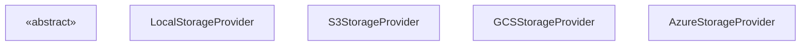
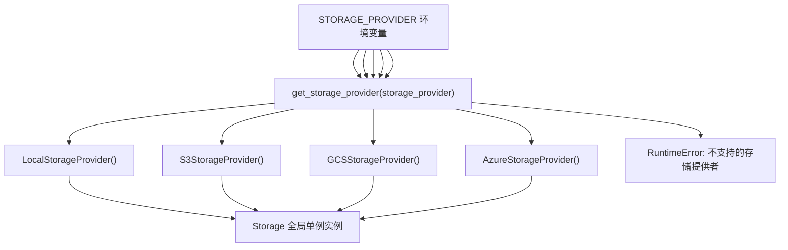
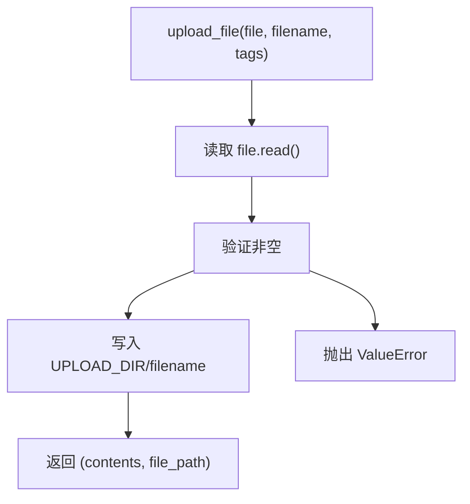
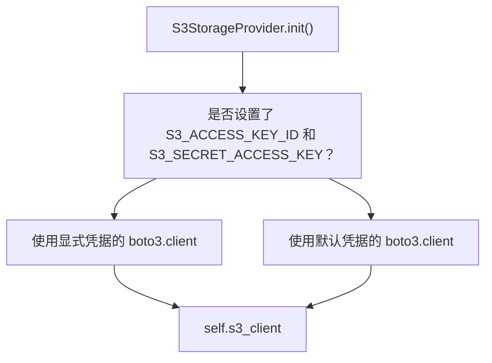
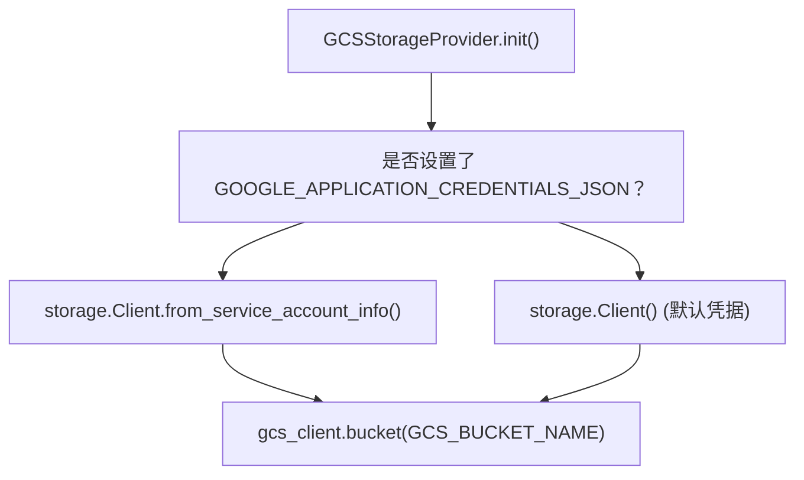
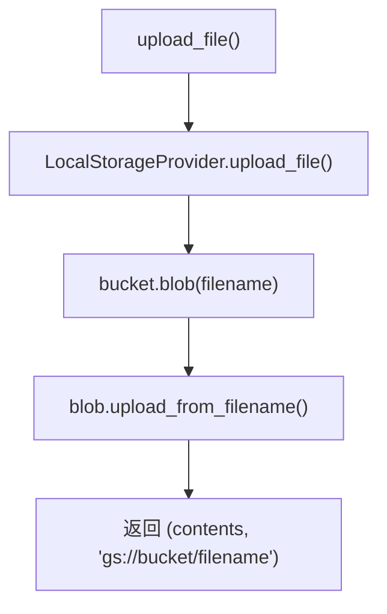
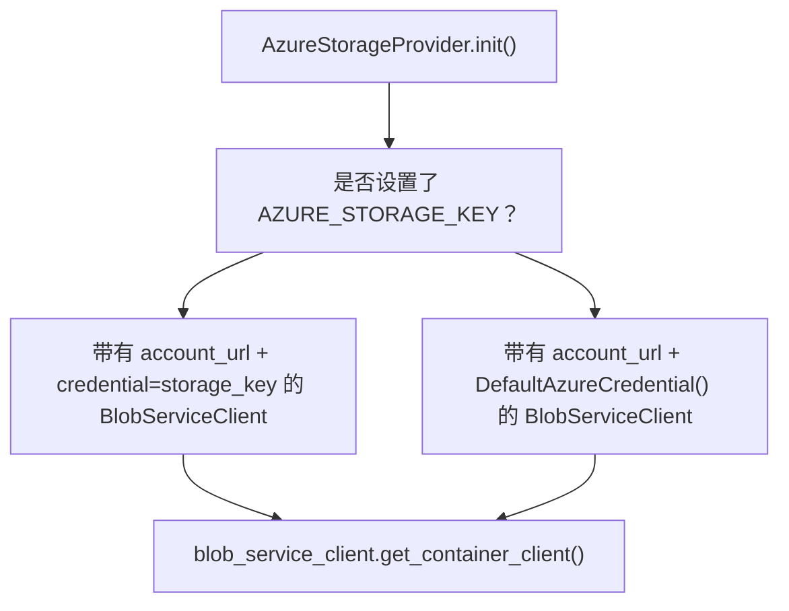
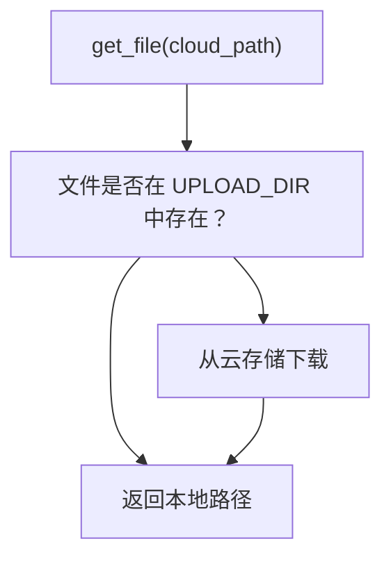

# 存储和文件管理

相关源文件

-   [.github/workflows/integration-test.disabled](https://github.com/open-webui/open-webui/blob/a7271532/.github/workflows/integration-test.disabled)
-   [backend/open\_webui/storage/provider.py](https://github.com/open-webui/open-webui/blob/a7271532/backend/open_webui/storage/provider.py)
-   [backend/open\_webui/test/apps/webui/storage/test\_provider.py](https://github.com/open-webui/open-webui/blob/a7271532/backend/open_webui/test/apps/webui/storage/test_provider.py)
-   [backend/requirements-min.txt](https://github.com/open-webui/open-webui/blob/a7271532/backend/requirements-min.txt)
-   [backend/requirements.txt](https://github.com/open-webui/open-webui/blob/a7271532/backend/requirements.txt)
-   [docker-compose.playwright.yaml](https://github.com/open-webui/open-webui/blob/a7271532/docker-compose.playwright.yaml)
-   [pyproject.toml](https://github.com/open-webui/open-webui/blob/a7271532/pyproject.toml)
-   [uv.lock](https://github.com/open-webui/open-webui/blob/a7271532/uv.lock)

本文档描述了存储提供者 (storage provider) 抽象系统，该系统使 Open WebUI 能够将上传的文件存储在不同的存储后端，包括本地磁盘、S3 兼容存储、Google Cloud Storage (GCS) 和 Azure Blob Storage。该系统为文件操作提供了一个统一的接口，而不受底层存储后端的影响。

有关前端和后端中间件中文件上传处理的信息，请参阅[文件上传和处理](https://github.com/open-webui/open-webui/blob/a7271532/File Upload and Processing)。有关文档处理和 RAG 摄取的信息，请参阅[文档摄取管道](https://github.com/open-webui/open-webui/blob/a7271532/Document Ingestion Pipeline)。

---

## 概览与架构

存储系统围绕一个抽象基类 `StorageProvider` 构建，该类为所有存储后端定义了通用接口。系统使用工厂模式根据配置实例化合适的提供者，并支持混合存储模型，即即使在使用云存储时也可以在本地缓存文件。

### 存储提供者类层次结构

**图表：StorageProvider 类层次结构**


**来源：** [backend/open\_webui/storage/provider.py43-61](https://github.com/open-webui/open-webui/blob/a7271532/backend/open_webui/storage/provider.py#L43-L61) [backend/open\_webui/storage/provider.py63-106](https://github.com/open-webui/open-webui/blob/a7271532/backend/open_webui/storage/provider.py#L63-L106) [backend/open\_webui/storage/provider.py108-224](https://github.com/open-webui/open-webui/blob/a7271532/backend/open_webui/storage/provider.py#L108-L224) [backend/open\_webui/storage/provider.py226-290](https://github.com/open-webui/open-webui/blob/a7271532/backend/open_webui/storage/provider.py#L226-L290) [backend/open\_webui/storage/provider.py292-360](https://github.com/open-webui/open-webui/blob/a7271532/backend/open_webui/storage/provider.py#L292-L360)

### 配置与工厂模式

存储提供者在应用程序启动时根据 `STORAGE_PROVIDER` 环境变量进行选择，并由 `get_storage_provider()` 工厂函数进行实例化：

**图表：存储提供者工厂模式**


**来源：** [backend/open\_webui/storage/provider.py362-377](https://github.com/open-webui/open-webui/blob/a7271532/backend/open_webui/storage/provider.py#L362-L377)

---

## 存储提供者接口

所有存储提供者都实现了 `StorageProvider` 抽象基类，该类定义了四个核心的文件操作方法。

### 抽象方法

| 方法 | 参数 | 返回类型 | 用途 |
| --- | --- | --- | --- |
| `upload_file` | `file: BinaryIO`
`filename: str`
`tags: Dict[str, str]` | `Tuple[bytes, str]` | 上传文件并返回其内容和存储路径 |
| `get_file` | `file_path: str` | `str` | 检索文件并返回其本地路径 |
| `delete_file` | `file_path: str` | `None` | 删除特定文件 |
| `delete_all_files` | 无 | `None` | 从存储中删除所有文件 |

**来源：** [backend/open\_webui/storage/provider.py43-61](https://github.com/open-webui/open-webui/blob/a7271532/backend/open_webui/storage/provider.py#L43-L61)

---

## 本地存储提供者 (Local Storage Provider)

`LocalStorageProvider` 是最简单的实现，它将文件直接存储到本地文件系统中 `UPLOAD_DIR` 指定的目录内。

### 实现详情


### 关键特性

-   **无外部依赖**：仅使用 Python 内置的文件 I/O
-   **即时可用性**：上传后文件立即可供访问
-   **路径格式**：以 `{UPLOAD_DIR}/{filename}` 格式返回路径
-   **空文件验证**：如果文件内容为空，则抛出 `ValueError`

**来源：** [backend/open\_webui/storage/provider.py63-106](https://github.com/open-webui/open-webui/blob/a7271532/backend/open_webui/storage/provider.py#L63-L106)

---

## S3 存储提供者 (S3 Storage Provider)

`S3StorageProvider` 支持 S3 兼容的对象存储服务，包括 AWS S3、MinIO 和其他 S3 兼容后端。

### 身份验证策略

该提供者支持两种身份验证方法：


**工作负载身份支持**：当未显式提供凭据时，提供者会回退到默认的 AWS 凭据链，从而支持 EC2、EKS 和其他 AWS 服务的 IAM 角色。

**来源：** [backend/open\_webui/storage/provider.py108-142](https://github.com/open-webui/open-webui/blob/a7271532/backend/open_webui/storage/provider.py#L108-L142)

### 配置选项

所有配置变量均从 `open_webui.config` 导入：

| 环境变量 | 类型 | 用途 | 默认值 |
| --- | --- | --- | --- |
| `S3_ACCESS_KEY_ID` | string | AWS 访问密钥（使用 IAM 角色时可选） | None |
| `S3_SECRET_ACCESS_KEY` | string | AWS 秘密密钥（使用 IAM 角色时可选） | None |
| `S3_BUCKET_NAME` | string (必填) | 目标 S3 存储桶名称 | \- |
| `S3_REGION_NAME` | string | AWS 区域 | None |
| `S3_ENDPOINT_URL` | string | MinIO/S3 兼容服务的自定义端点 | None |
| `S3_KEY_PREFIX` | string | 用于命名空间对象的键前缀 | "" |
| `S3_USE_ACCELERATE_ENDPOINT` | boolean | 启用 S3 传输加速 (Transfer Acceleration) | False |
| `S3_ADDRESSING_STYLE` | string | 寻址风格 ('path' 或 'virtual') | "auto" |
| `S3_ENABLE_TAGGING` | boolean | 启用 S3 对象标签 (tagging) | False |

**来源：** [backend/open\_webui/storage/provider.py12-21](https://github.com/open-webui/open-webui/blob/a7271532/backend/open_webui/storage/provider.py#L12-L21) [backend/open\_webui/config.py](https://github.com/open-webui/open-webui/blob/a7271532/backend/open_webui/config.py)

### 两阶段上传过程

所有云存储提供者 (S3, GCS, Azure) 均实现了一个两阶段上传过程，其中文件先写入 `UPLOAD_DIR` 中的本地存储，然后再同步到云存储。这种混合方法提供了：

-   **即时本地可用性**：便于文档加载器和 RAG 系统进行处理
-   **持久性**：通过云备份实现
-   **性能**：通过检索操作期间的本地缓存实现

S3 提供者展示了这种模式：

**图表：具有混合存储的 S3 上传流**

> **[Mermaid sequence]**
> *(图表结构无法解析)*

这个两阶段过程确保文件可以在本地立即用于文档处理，同时也被持久化到云存储中，以确保数据的持久性和跨实例的可访问性。

**来源：** [backend/open\_webui/storage/provider.py148-177](https://github.com/open-webui/open-webui/blob/a7271532/backend/open_webui/storage/provider.py#L148-L177) [backend/open\_webui/storage/provider.py65-74](https://github.com/open-webui/open-webui/blob/a7271532/backend/open_webui/storage/provider.py#L65-L74)

### 标签清理 (Tag Sanitization)

S3 对标签值有严格的要求。该提供者包含一个 `sanitize_tag_value()` 方法，用于移除 S3 不允许的字符：

```
# 仅允许: a-zA-Z0-9 äöüÄÖÜß +-=._:/@
@staticmethod
def sanitize_tag_value(s: str) -> str:
    return re.sub(r"[^a-zA-Z0-9 äöüÄÖÜß\+\-=\._:/@]", "", s)
```
**来源：** [backend/open\_webui/storage/provider.py143-147](https://github.com/open-webui/open-webui/blob/a7271532/backend/open_webui/storage/provider.py#L143-L147)

### 文件检索与删除

这两个操作都维持了混合存储模型：

-   **get\_file**：从 S3 下载到本地缓存并返回本地路径
-   **delete\_file**：同时从 S3 和本地存储中删除
-   **delete\_all\_files**：从 S3（遵循 key\_prefix）和本地存储中删除

**来源：** [backend/open\_webui/storage/provider.py178-224](https://github.com/open-webui/open-webui/blob/a7271532/backend/open_webui/storage/provider.py#L178-L224)

---

## GCS 存储提供者 (GCS Storage Provider)

`GCSStorageProvider` 支持 Google Cloud Storage，具有灵活的身份验证选项。

### 身份验证方法


**默认凭据**包括：

-   本地开发机器上的用户凭据
-   Compute Engine 实例上的 Google 元数据服务器凭据
-   来自环境的环境变量服务账号凭据

**来源：** [backend/open\_webui/storage/provider.py226-240](https://github.com/open-webui/open-webui/blob/a7271532/backend/open_webui/storage/provider.py#L226-L240)

### 配置

所有配置变量均从 `open_webui.config` 导入：

| 环境变量 | 类型 | 用途 | 默认值 |
| --- | --- | --- | --- |
| `GCS_BUCKET_NAME` | string (必填) | 目标 GCS 存储桶名称 | \- |
| `GOOGLE_APPLICATION_CREDENTIALS_JSON` | string | 服务账号 JSON 凭据 | None |

当未设置 `GOOGLE_APPLICATION_CREDENTIALS_JSON` 时，`storage.Client()` 会使用以下位置的默认凭据：

-   `GOOGLE_APPLICATION_CREDENTIALS` 文件路径
-   Google Cloud SDK 凭据 (`gcloud auth`)
-   Compute Engine 元数据服务器 (用于工作负载身份)

**来源：** [backend/open\_webui/storage/provider.py22-23](https://github.com/open-webui/open-webui/blob/a7271532/backend/open_webui/storage/provider.py#L22-L23) [backend/open\_webui/storage/provider.py230-239](https://github.com/open-webui/open-webui/blob/a7271532/backend/open_webui/storage/provider.py#L230-L239) [backend/open\_webui/config.py](https://github.com/open-webui/open-webui/blob/a7271532/backend/open_webui/config.py)

### 存储操作与两阶段上传

与 S3 类似，GCS 提供者实现了带本地暂存的两阶段上传模式：


**路径格式**：以 `gs://{bucket_name}/{filename}` 格式返回路径

**来源：** [backend/open\_webui/storage/provider.py241-290](https://github.com/open-webui/open-webui/blob/a7271532/backend/open_webui/storage/provider.py#L241-L290)

---

## Azure 存储提供者 (Azure Storage Provider)

`AzureStorageProvider` 支持 Azure Blob Storage，支持存储密钥和托管身份 (Managed Identity) 身份验证。

### 身份验证策略


**DefaultAzureCredential** 按顺序支持多种身份验证方法：

1.  环境变量
2.  托管身份 (Managed Identity)
3.  Azure CLI 凭据
4.  交互式浏览器身份验证

**来源：** [backend/open\_webui/storage/provider.py292-312](https://github.com/open-webui/open-webui/blob/a7271532/backend/open_webui/storage/provider.py#L292-L312)

### 配置

所有配置变量均从 `open_webui.config` 导入：

| 环境变量 | 类型 | 用途 | 默认值 |
| --- | --- | --- | --- |
| `AZURE_STORAGE_ENDPOINT` | string (必填) | 存储账号端点 URL
(例如 `https://account.blob.core.windows.net`) | \- |
| `AZURE_STORAGE_CONTAINER_NAME` | string (必填) | 目标 Blob 容器名称 | \- |
| `AZURE_STORAGE_KEY` | string | 存储账号访问密钥 | None |

当未设置 `AZURE_STORAGE_KEY` 时，`BlobServiceClient` 使用 `DefaultAzureCredential()`，它会尝试通过以下方式进行身份验证：

-   环境变量 (`AZURE_CLIENT_ID`, `AZURE_TENANT_ID`, `AZURE_CLIENT_SECRET`)
-   托管身份 (适用于 Azure VM、App Service、Functions)
-   Azure CLI 凭据 (`az login`)
-   Visual Studio Code 凭据
-   交互式浏览器身份验证

**来源：** [backend/open\_webui/storage/provider.py24-26](https://github.com/open-webui/open-webui/blob/a7271532/backend/open_webui/storage/provider.py#L24-L26) [backend/open\_webui/storage/provider.py293-311](https://github.com/open-webui/open-webui/blob/a7271532/backend/open_webui/storage/provider.py#L293-L311) [backend/open\_webui/config.py](https://github.com/open-webui/open-webui/blob/a7271532/backend/open_webui/config.py)

### 存储操作与两阶段上传

Azure 提供者遵循相同的两阶段模式：先进行本地暂存，然后上传到云端：

> **[Mermaid sequence]**
> *(图表结构无法解析)*

**路径格式**：以 `{AZURE_STORAGE_ENDPOINT}/{container_name}/{filename}` 格式返回路径

**来源：** [backend/open\_webui/storage/provider.py313-360](https://github.com/open-webui/open-webui/blob/a7271532/backend/open_webui/storage/provider.py#L313-L360)

---

## 测试基础设施

存储系统包含使用各种模拟 (mocking) 和仿真策略针对所有提供者的全面测试。

### 测试覆盖范围

```mermaid
flowchart TD
    TestSuite["存储提供者测试套件"]
    LocalTests["TestLocalStorageProvider"]
    S3Tests["TestS3StorageProvider (@mock_aws)"]
    GCSTests["TestGCSStorageProvider (gcp-storage-emulator)"]
    AzureTests["TestAzureStorageProvider (模拟客户端)"]
    LT1["test_upload_file"]
    LT2["test_get_file"]
    LT3["test_delete_file"]
    LT4["test_delete_all_files"]
    S3T1["test_upload_file"]
    S3T2["test_get_file"]
    S3T3["test_delete_file"]
    S3T4["test_delete_all_files"]
    S3T5["test_init_without_credentials"]
    GCST1["test_upload_file"]
    GCST2["test_get_file"]
    GCST3["test_delete_file"]
    GCST4["test_delete_all_files"]
    AT1["test_upload_file"]
    AT2["test_get_file"]
    AT3["test_delete_file"]
    AT4["test_delete_all_files"]
    AT5["test_get_file_not_found"]

    TestSuite --> LocalTests
    TestSuite --> S3Tests
    TestSuite --> GCSTests
    TestSuite --> AzureTests
    LocalTests --> LT1
    LocalTests --> LT2
    LocalTests --> LT3
    LocalTests --> LT4
    S3Tests --> S3T1
    S3Tests --> S3T2
    S3Tests --> S3T3
    S3Tests --> S3T4
    S3Tests --> S3T5
    GCSTests --> GCST1
    GCSTests --> GCST2
    GCSTests --> GCST3
    GCSTests --> GCST4
    AzureTests --> AT1
    AzureTests --> AT2
    AzureTests --> AT3
    AzureTests --> AT4
    AzureTests --> AT5
```


### 各提供者的测试策略

| 提供者 | 测试策略 | 关键依赖 |
| --- | --- | --- |
| **LocalStorageProvider** | 带有临时目录的真实文件系统操作 | pytest, tmp\_path fixture |
| **S3StorageProvider** | 使用 moto 模拟 AWS 服务 | moto 的 `@mock_aws` 装饰器, boto3 |
| **GCSStorageProvider** | 内存中的 GCS 仿真器 | gcp-storage-emulator 服务器 |
| **AzureStorageProvider** | 使用 unittest.mock 模拟 Azure 客户端 | 用于 BlobServiceClient 的 MagicMock |

**来源：** [backend/open\_webui/test/apps/webui/storage/test\_provider.py1-436](https://github.com/open-webui/open-webui/blob/a7271532/backend/open_webui/test/apps/webui/storage/test_provider.py#L1-L436)

### 通用测试 Fixture

测试使用一个共享的 `mock_upload_dir` 辅助函数来创建临时上传目录并对 `UPLOAD_DIR` 配置进行 monkey-patch：

```
def mock_upload_dir(monkeypatch, tmp_path):
    """用于 monkey-patch UPLOAD_DIR 并创建临时目录的 Fixture。"""
    directory = tmp_path / "uploads"
    directory.mkdir()
    monkeypatch.setattr(provider, "UPLOAD_DIR", str(directory))
    return directory
```
该 Fixture：

1.  在 pytest 的 `tmp_path` 下创建一个临时目录
2.  使用 `monkeypatch.setattr()` 在测试期间覆盖 `provider.UPLOAD_DIR`
3.  返回用于测试断言的目录路径

**来源：** [backend/open\_webui/test/apps/webui/storage/test\_provider.py14-19](https://github.com/open-webui/open-webui/blob/a7271532/backend/open_webui/test/apps/webui/storage/test_provider.py#L14-L19)

---

## 依赖与要求

存储系统根据配置的提供者需要不同的依赖：

### 核心依赖

所有存储提供者均需要：

| 包 | 版本 | 文件 | 用途 |
| --- | --- | --- | --- |
| `aiofiles` | 24.1.0 | requirements.txt:19 | 异步文件 I/O 操作 |

### 云存储依赖

根据 `STORAGE_PROVIDER` 配置所需：

| 提供者 | 包 | 版本 | 文件 | 用途 |
| --- | --- | --- | --- | --- |
| **S3** | `boto3` | 1.41.5 | requirements.txt:116 | 用于 Python 的 AWS SDK (S3 客户端) |
| **GCS** | `google-cloud-storage` | 2.19.0 | requirements.txt:108 | Google Cloud Storage 客户端库 |
| **GCS** | `google-api-python-client` | \- | requirements.txt:103 | Google API 客户端基础库 |
| **GCS** | `google-auth-httplib2` | \- | requirements.txt:104 | Google 身份验证传输 |
| **GCS** | `google-auth-oauthlib` | \- | requirements.txt:105 | Google OAuth2 身份验证 |
| **GCS** | `googleapis-common-protos` | 1.72.0 | requirements.txt:107 | 通用 protobuf 定义 |
| **Azure** | `azure-storage-blob` | 12.24.1 | requirements.txt:99 | Azure Blob Storage 客户端 |
| **Azure** | `azure-identity` | 1.25.0 | requirements.txt:98 | Azure 身份验证 (DefaultAzureCredential) |

### 测试依赖

运行存储提供者测试所需：

| 包 | 版本 | 文件 | 用途 |
| --- | --- | --- | --- |
| `moto[s3]` | \>=5.0.26 | pyproject.toml:141 | AWS 服务模拟 (@mock\_aws 装饰器) |
| `gcp-storage-emulator` | \>=2024.8.3 | pyproject.toml:142 | 用于测试的内存中 GCS 服务器 |
| `docker` | ~7.1.0 | requirements.txt:131 | 用于容器编排的 Docker SDK |
| `pytest` | ~8.4.1 | requirements.txt:132 | Python 测试框架 |
| `pytest-docker` | ~3.2.5 | requirements.txt:133 | 用于 pytest 的 Docker Fixture |

**来源：** [backend/requirements.txt19](https://github.com/open-webui/open-webui/blob/a7271532/backend/requirements.txt#L19-L19) [backend/requirements.txt98-116](https://github.com/open-webui/open-webui/blob/a7271532/backend/requirements.txt#L98-L116) [backend/requirements.txt131-133](https://github.com/open-webui/open-webui/blob/a7271532/backend/requirements.txt#L131-L133) [pyproject.toml131-158](https://github.com/open-webui/open-webui/blob/a7271532/pyproject.toml#L131-L158)

---

## 文件上传处理

存储系统的两阶段上传过程与更广泛的文件上传管道集成。当通过 Open WebUI 上传文件时：

**图表：完整的文件上传管道**

> **[Mermaid sequence]**
> *(图表结构无法解析)*

### 阶段 1：本地暂存

所有提供者首先将文件写入 `UPLOAD_DIR`：

```
# 来自 LocalStorageProvider.upload_file()
contents = file.read()
file_path = f"{UPLOAD_DIR}/{filename}"
with open(file_path, "wb") as f:
    f.write(contents)
```
这确保了文件可立即用于：

-   文档内容提取 (Tika, Docling 等)
-   嵌入生成
-   RAG 处理

**来源：** [backend/open\_webui/storage/provider.py65-74](https://github.com/open-webui/open-webui/blob/a7271532/backend/open_webui/storage/provider.py#L65-L74)

### 阶段 2：云同步

云提供商 (S3, GCS, Azure) 随后将文件上传到远程存储：

| 提供者 | 上传方法 | 结果路径格式 |
| --- | --- | --- |
| S3 | `s3_client.upload_file()` | `s3://{bucket}/{key_prefix}/{filename}` |
| GCS | `blob.upload_from_filename()` | `gs://{bucket}/{filename}` |
| Azure | `blob_client.upload_blob()` | `{endpoint}/{container}/{filename}` |

**来源：** [backend/open\_webui/storage/provider.py148-177](https://github.com/open-webui/open-webui/blob/a7271532/backend/open_webui/storage/provider.py#L148-L177) [backend/open\_webui/storage/provider.py241-250](https://github.com/open-webui/open-webui/blob/a7271532/backend/open_webui/storage/provider.py#L241-L250) [backend/open\_webui/storage/provider.py313-322](https://github.com/open-webui/open-webui/blob/a7271532/backend/open_webui/storage/provider.py#L313-L322)

### 带本地缓存的检索

在检索文件时，云提供商会将其下载到本地缓存：


这种模式针对以下方面进行了优化：

-   **性能**：后续访问使用本地缓存
-   **处理**：文档加载器可以处理本地文件
-   **弹性**：云备份使得在本地存储丢失时可以进行恢复

**来源：** [backend/open\_webui/storage/provider.py178-185](https://github.com/open-webui/open-webui/blob/a7271532/backend/open_webui/storage/provider.py#L178-L185) [backend/open\_webui/storage/provider.py253-262](https://github.com/open-webui/open-webui/blob/a7271532/backend/open_webui/storage/provider.py#L253-L262) [backend/open\_webui/storage/provider.py325-334](https://github.com/open-webui/open-webui/blob/a7271532/backend/open_webui/storage/provider.py#L325-L334)

---

## 全局存储实例

该模块导出了一个单例 `Storage` 实例，该实例在模块导入时根据 `STORAGE_PROVIDER` 环境变量进行初始化：

```
# 位于 backend/open_webui/storage/provider.py 的模块级别
Storage = get_storage_provider(STORAGE_PROVIDER)
```
这个全局 `Storage` 实例提供了活动的存储后端，并在整个代码库中被导入：

```
from open_webui.storage.provider import Storage

# 使用示例：
contents, file_path = Storage.upload_file(file, filename, tags)
local_path = Storage.get_file(file_path)
Storage.delete_file(file_path)
```
单例模式确保了：

-   **单一初始化**：存储后端在启动时配置一次
-   **一致的接口**：所有文件操作都使用同一个提供者实例
-   **后端透明性**：使用 `Storage` 的代码不需要知道哪个提供者处于活动状态

**来源：** [backend/open\_webui/storage/provider.py376-377](https://github.com/open-webui/open-webui/blob/a7271532/backend/open_webui/storage/provider.py#L376-L377)

---

## 错误处理

所有存储提供者都实现了统一的错误处理：

### 通用异常

| 操作 | 异常 | 条件 |
| --- | --- | --- |
| `upload_file` | `ValueError` | 文件内容为空 |
| `upload_file` | `RuntimeError` | 云存储上传失败 |
| `get_file` | `RuntimeError` | 云存储下载失败 |
| `delete_file` | `RuntimeError` | 云存储删除失败 |
| `delete_all_files` | `RuntimeError` | 云存储批量删除失败 |

### 云提供商特定的异常

-   **S3**：将 `botocore.exceptions.ClientError` 封装在 `RuntimeError` 中
-   **GCS**：将 `google.cloud.exceptions.GoogleCloudError` 和 `NotFound` 封装在 `RuntimeError` 中
-   **Azure**：将 `azure.core.exceptions.ResourceNotFoundError` 封装在 `RuntimeError` 中

**来源：** [backend/open\_webui/storage/provider.py63-360](https://github.com/open-webui/open-webui/blob/a7271532/backend/open_webui/storage/provider.py#L63-L360)
