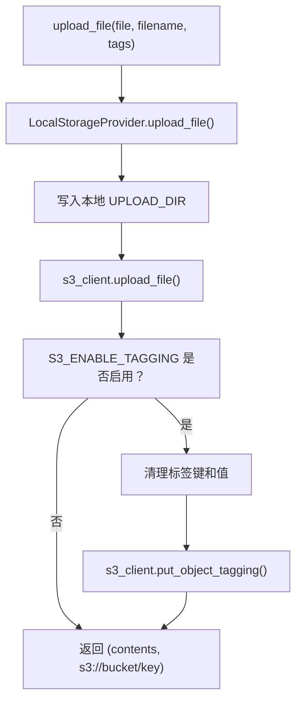
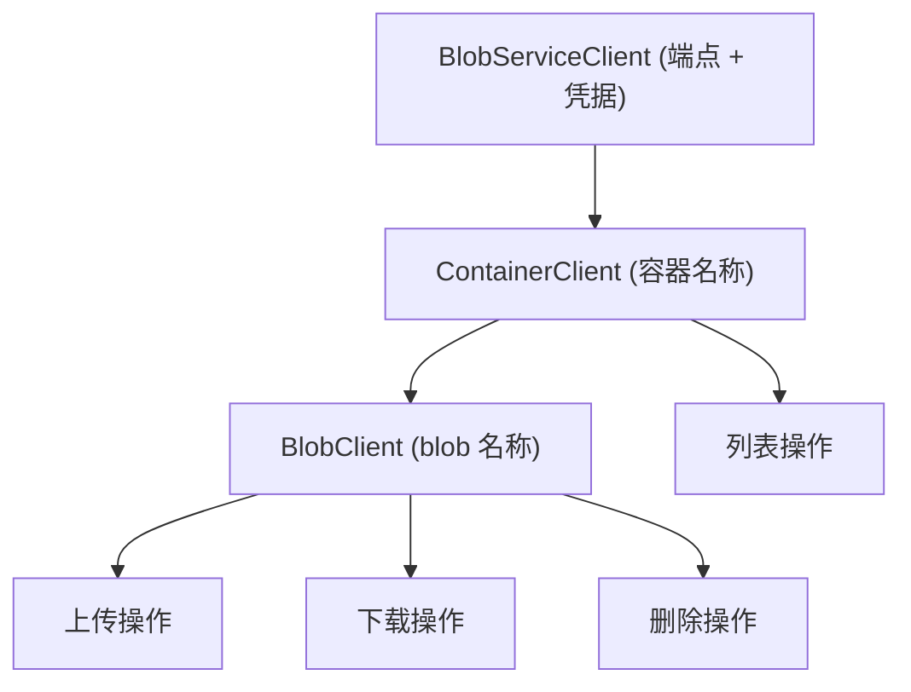
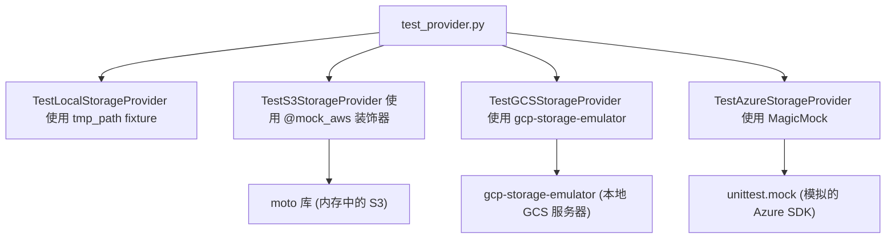

# 存储提供者架构

相关源文件

-   [.github/workflows/integration-test.disabled](https://github.com/open-webui/open-webui/blob/a7271532/.github/workflows/integration-test.disabled)
-   [backend/open\_webui/storage/provider.py](https://github.com/open-webui/open-webui/blob/a7271532/backend/open_webui/storage/provider.py)
-   [backend/open\_webui/test/apps/webui/storage/test\_provider.py](https://github.com/open-webui/open-webui/blob/a7271532/backend/open_webui/test/apps/webui/storage/test_provider.py)
-   [backend/requirements-min.txt](https://github.com/open-webui/open-webui/blob/a7271532/backend/requirements-min.txt)
-   [backend/requirements.txt](https://github.com/open-webui/open-webui/blob/a7271532/backend/requirements.txt)
-   [docker-compose.playwright.yaml](https://github.com/open-webui/open-webui/blob/a7271532/docker-compose.playwright.yaml)
-   [pyproject.toml](https://github.com/open-webui/open-webui/blob/a7271532/pyproject.toml)
-   [uv.lock](https://github.com/open-webui/open-webui/blob/a7271532/uv.lock)

本文档描述了多态存储提供者系统，该系统抽象了多个后端实现的文件存储操作。Open WebUI 通过统一接口支持本地文件系统存储和三种云存储提供商（Amazon S3、Google Cloud Storage、Azure Blob Storage）。有关已上传文件如何在 RAG 系统中处理和使用的信息，请参阅 [文档摄取流水线](/open-webui/open-webui/7.1-document-ingestion-pipeline)。有关数据库存储配置，请参阅 [数据与存储层](/open-webui/open-webui/2.4-data-and-storage-layer)。

## 架构概览

存储系统使用了抽象基类模式，并配合工厂函数在运行时选择适当的提供者。代码库中所有的存储操作都与一个单例的 `Storage` 实例交互，该实例根据 `STORAGE_PROVIDER` 环境变量实现四个具体提供者之一。

```mermaid
flowchart TD
    classId_StorageProvider_19["«abstract» 抽象类"]
    classId_LocalStorageProvider_20["LocalStorageProvider 本地存储"]
    classId_S3StorageProvider_21["S3StorageProvider S3 存储"]
    classId_GCSStorageProvider_22["GCSStorageProvider GCS 存储"]
    classId_AzureStorageProvider_23["AzureStorageProvider Azure 存储"]
    classId_FactoryFunction_24["FactoryFunction 工厂函数"]
    classId_GlobalStorage_25["GlobalStorage 全局存储实例"]

    classId_StorageProvider_19 <|-- classId_LocalStorageProvider_20
    classId_StorageProvider_19 <|-- classId_S3StorageProvider_21
    classId_StorageProvider_19 <|-- classId_GCSStorageProvider_22
    classId_StorageProvider_19 <|-- classId_AzureStorageProvider_23
    classId_FactoryFunction_24 --> classId_StorageProvider_19
    classId_GlobalStorage_25 --> classId_StorageProvider_19
```
**来源：** [backend/open\_webui/storage/provider.py1-375](https://github.com/open-webui/open-webui/blob/a7271532/backend/open_webui/storage/provider.py#L1-L375)

`StorageProvider` 抽象基类定义了所有具体实现必须提供的四个必需方法。工厂函数 `get_storage_provider()` 根据字符串标识符实例化适当的提供者，模块级别的 `Storage` 变量提供了一个在整个应用中使用的单例实例。

**来源：** [backend/open\_webui/storage/provider.py41-59](https://github.com/open-webui/open-webui/blob/a7271532/backend/open_webui/storage/provider.py#L41-L59) [backend/open\_webui/storage/provider.py360-374](https://github.com/open-webui/open-webui/blob/a7271532/backend/open_webui/storage/provider.py#L360-L374)

## 存储提供者接口

`StorageProvider` 抽象基类定义了四种操作：

| 方法 | 参数 | 返回类型 | 用途 |
| --- | --- | --- | --- |
| `upload_file` | `file: BinaryIO`, `filename: str`, `tags: Dict[str, str]` | `Tuple[bytes, str]` | 上传文件并返回其内容和存储路径 |
| `get_file` | `file_path: str` | `str` | 从存储中获取文件并返回本地路径 |
| `delete_file` | `file_path: str` | `None` | 从存储中删除单个文件 |
| `delete_all_files` | 无 | `None` | 从存储中删除所有文件 |

`upload_file` 方法返回一个包含字节格式文件内容和存储特定文件路径（例如 S3 为 `s3://bucket/key`，GCS 为 `gs://bucket/key`）的元组。`get_file` 方法始终返回本地文件系统路径，如有必要，会从云存储下载。

**来源：** [backend/open\_webui/storage/provider.py41-59](https://github.com/open-webui/open-webui/blob/a7271532/backend/open_webui/storage/provider.py#L41-L59)

## 本地存储提供者

`LocalStorageProvider` 将文件直接存储在本地文件系统中由 `UPLOAD_DIR` 配置变量指定的目录下。这是最简单的实现，也是开发环境的默认选项。

### 实现详情

-   **上传**：将文件内容读入内存，写入 `{UPLOAD_DIR}/{filename}`，返回内容和本地路径。
-   **获取**：原样返回文件路径（无需下载）。
-   **删除**：对单个文件使用 `os.remove()`，对批量删除使用 `os.unlink()` 和 `shutil.rmtree()`。
-   **错误处理**：如果文件内容为空则抛出 `ValueError`，如果未找到文件则记录警告日志。

> **[Mermaid sequence]**
> *(图表结构无法解析)*

**来源：** [backend/open\_webui/storage/provider.py61-104](https://github.com/open-webui/open-webui/blob/a7271532/backend/open_webui/storage/provider.py#L61-L104)

`LocalStorageProvider` 不执行任何身份验证或授权检查。文件路径通过将 `UPLOAD_DIR` 与提供的文件名拼接构造。`delete_all_files` 方法递归删除 `UPLOAD_DIR` 的所有内容，处理文件、符号链接和目录。

**来源：** [backend/open\_webui/storage/provider.py89-104](https://github.com/open-webui/open-webui/blob/a7271532/backend/open_webui/storage/provider.py#L89-L104)

## S3 存储提供者

`S3StorageProvider` 将文件存储在 Amazon S3 或兼容 S3 的对象存储服务（MinIO、DigitalOcean Spaces 等）中。它实现了一种两阶段策略：文件首先被写入本地存储，然后上传到 S3。

### 身份验证与配置

该提供者支持两种身份验证模式：

1.  **显式凭据**：当提供了 `S3_ACCESS_KEY_ID` 和 `S3_SECRET_ACCESS_KEY` 时，直接使用它们。
2.  **工作负载标识 (Workload Identity)**：当未提供凭据时，回退到 AWS 默认凭据链（EC2 实例角色、EKS pod 身份等）。

**来源：** [backend/open\_webui/storage/provider.py118-136](https://github.com/open-webui/open-webui/blob/a7271532/backend/open_webui/storage/provider.py#L118-L136)

### 配置变量

| 变量 | 用途 | 默认值 |
| --- | --- | --- |
| `S3_BUCKET_NAME` | 目标 S3 存储桶 | 必需 |
| `S3_REGION_NAME` | AWS 区域 | 必需 |
| `S3_ENDPOINT_URL` | S3 兼容服务的自定义端点 | 可选 |
| `S3_KEY_PREFIX` | 所有对象键的前缀 | 空字符串 |
| `S3_USE_ACCELERATE_ENDPOINT` | 启用 S3 传输加速 (Transfer Acceleration) | `False` |
| `S3_ADDRESSING_STYLE` | 路径样式 (path-style) 或虚拟托管样式 (virtual-hosted-style) | 默认 |
| `S3_ENABLE_TAGGING` | 启用对象标签 (Tagging) | `False` |

**来源：** [backend/open\_webui/storage/provider.py12-21](https://github.com/open-webui/open-webui/blob/a7271532/backend/open_webui/storage/provider.py#L12-L21) [backend/open\_webui/storage/provider.py107-140](https://github.com/open-webui/open-webui/blob/a7271532/backend/open_webui/storage/provider.py#L107-L140)

### 对象标签 (Tagging)

当 `S3_ENABLE_TAGGING` 启用时，提供者使用 `put_object_tagging` API 对已上传的对象应用元数据标签。标签值会经过清理，仅包含 S3 允许的字符（字母数字、空格、德语变音符号以及特定符号：`+-=._:/@`）。


**来源：** [backend/open\_webui/storage/provider.py141-175](https://github.com/open-webui/open-webui/blob/a7271532/backend/open_webui/storage/provider.py#L141-L175)

`sanitize_tag_value` 方法使用正则表达式剔除非允许字符：`[^a-zA-Z0-9 äöüÄÖÜß\+\-=\._:/@]`。

**来源：** [backend/open\_webui/storage/provider.py141-144](https://github.com/open-webui/open-webui/blob/a7271532/backend/open_webui/storage/provider.py#L141-L144)

### 密钥管理与前缀支持

对象键按 `{S3_KEY_PREFIX}/{filename}` 构造。在列出或删除对象时，提供者会跳过任何不以配置的前缀开头的对象，从而实现在多个 Open WebUI 实例之间共享存储桶。

**来源：** [backend/open\_webui/storage/provider.py151](https://github.com/open-webui/open-webui/blob/a7271532/backend/open_webui/storage/provider.py#L151-L151) [backend/open\_webui/storage/provider.py203-205](https://github.com/open-webui/open-webui/blob/a7271532/backend/open_webui/storage/provider.py#L203-L205)

### 下载与清理

`get_file` 方法使用 `download_file()` 将对象从 S3 下载到 `UPLOAD_DIR`。`_extract_s3_key` 辅助函数解析完整的 S3 URI (`s3://bucket/key`) 以提取键部分，`_get_local_file_path` 构造用于下载的本地路径。

**来源：** [backend/open\_webui/storage/provider.py176-222](https://github.com/open-webui/open-webui/blob/a7271532/backend/open_webui/storage/provider.py#L176-L222)

## GCS 存储提供者

`GCSStorageProvider` 将文件存储在 Google Cloud Storage 存储桶中。与 S3 类似，它采用了带有本地暂存的两阶段方法。

### 身份验证

该提供者支持两种身份验证模式：

1.  **服务账户 JSON**：当设置了 `GOOGLE_APPLICATION_CREDENTIALS_JSON` 时，将其解析为 JSON 并使用 `Client.from_service_account_info()`。
2.  **应用默认凭据 (ADC)**：未设置时，使用默认凭据链（本地开发的开发用户凭据、Compute Engine 实例的 GCE 元数据服务器）。

```python
if GOOGLE_APPLICATION_CREDENTIALS_JSON:
    self.gcs_client = storage.Client.from_service_account_info(
        info=json.loads(GOOGLE_APPLICATION_CREDENTIALS_JSON)
    )
else:
    self.gcs_client = storage.Client()
```
**来源：** [backend/open\_webui/storage/provider.py228-237](https://github.com/open-webui/open-webui/blob/a7271532/backend/open_webui/storage/provider.py#L228-L237)

### 文件操作

GCS 提供者使用 `google.cloud.storage` 库的 blob API：

-   **上传**：`blob.upload_from_filename(local_path)` 从本地暂存区上传。
-   **下载**：`blob.download_to_filename(local_path)` 下载到 `UPLOAD_DIR`。
-   **删除**：`blob.delete()` 移除单个对象。
-   **列表**：`bucket.list_blobs()` 枚举所有对象以便进行批量删除。

GCS 中的文件路径使用格式 `gs://{bucket_name}/{filename}`。`get_file` 方法使用 `file_path.removeprefix("gs://").split("/")[1]` 解析此 URI 格式。

**来源：** [backend/open\_webui/storage/provider.py239-288](https://github.com/open-webui/open-webui/blob/a7271532/backend/open_webui/storage/provider.py#L239-L288)

### 错误处理

该提供者捕获来自 GCS SDK 的 `GoogleCloudError` 和 `NotFound` 异常，并将它们作为 `RuntimeError` 重新抛出，并附带描述性消息。这种抽象允许调用代码在所有提供者之间一致地处理存储错误。

**来源：** [backend/open\_webui/storage/provider.py248-249](https://github.com/open-webui/open-webui/blob/a7271532/backend/open_webui/storage/provider.py#L248-L249) [backend/open\_webui/storage/provider.py260-261](https://github.com/open-webui/open-webui/blob/a7271532/backend/open_webui/storage/provider.py#L260-L261) [backend/open\_webui/storage/provider.py269-270](https://github.com/open-webui/open-webui/blob/a7271532/backend/open_webui/storage/provider.py#L269-L270) [backend/open\_webui/storage/provider.py283-284](https://github.com/open-webui/open-webui/blob/a7271532/backend/open_webui/storage/provider.py#L283-L284)

## Azure 存储提供者

`AzureStorageProvider` 将文件存储在 Azure Blob Storage 容器中。它使用了 `azure-storage-blob` SDK。

### 身份验证

该提供者支持两种身份验证模式：

1.  **存储账户密钥**：当提供了 `AZURE_STORAGE_KEY` 时，将其与 `BlobServiceClient(account_url, credential=storage_key)` 配合使用。
2.  **DefaultAzureCredential**：未提供密钥时，使用 `DefaultAzureCredential()`，它支持托管标识 (managed identities)、Azure CLI 凭据以及其他 Azure 身份源。

```python
if storage_key:
    self.blob_service_client = BlobServiceClient(
        account_url=self.endpoint, credential=storage_key
    )
else:
    self.blob_service_client = BlobServiceClient(
        account_url=self.endpoint, credential=DefaultAzureCredential()
    )
```
**来源：** [backend/open\_webui/storage/provider.py296-306](https://github.com/open-webui/open-webui/blob/a7271532/backend/open_webui/storage/provider.py#L296-L306)

### 配置变量

| 变量 | 用途 | 示例 |
| --- | --- | --- |
| `AZURE_STORAGE_ENDPOINT` | 存储账户端点 URL | `https://myaccount.blob.core.windows.net` |
| `AZURE_STORAGE_CONTAINER_NAME` | 容器名称 | `open-webui-files` |
| `AZURE_STORAGE_KEY` | 存储账户密钥 | 可选（可以使用托管标识） |

**来源：** [backend/open\_webui/storage/provider.py24-26](https://github.com/open-webui/open-webui/blob/a7271532/backend/open_webui/storage/provider.py#L24-L26) [backend/open\_webui/storage/provider.py292-294](https://github.com/open-webui/open-webui/blob/a7271532/backend/open_webui/storage/provider.py#L292-L294)

### Blob 操作

Azure 提供者使用了层级化的客户端结构：

-   `BlobServiceClient` - 存储账户的根客户端。
-   `ContainerClient` - 特定容器的客户端（通过 `get_container_client()` 获取）。
-   `BlobClient` - 特定 blob 的客户端（通过 `container_client.get_blob_client()` 获取）。


**来源：** [backend/open\_webui/storage/provider.py298-309](https://github.com/open-webui/open-webui/blob/a7271532/backend/open_webui/storage/provider.py#L298-L309)

### 文件路径格式

Azure blob 路径使用格式 `{endpoint}/{container_name}/{blob_name}`。例如：`https://myaccount.blob.core.windows.net/open-webui-files/document.pdf`。提供者通过按 `/` 分割并提取最后一个组件来从该 URL 中提取 blob 名称。

**来源：** [backend/open\_webui/storage/provider.py317-319](https://github.com/open-webui/open-webui/blob/a7271532/backend/open_webui/storage/provider.py#L317-L319) [backend/open\_webui/storage/provider.py326](https://github.com/open-webui/open-webui/blob/a7271532/backend/open_webui/storage/provider.py#L326-L326) [backend/open\_webui/storage/provider.py338](https://github.com/open-webui/open-webui/blob/a7271532/backend/open_webui/storage/provider.py#L338-L338)

### 上传与下载

-   **上传**：在本地存储暂存后，使用 `blob_client.upload_blob(contents, overwrite=True)` 上传 blob 内容。
-   **下载**：使用 `blob_client.download_blob().readall()` 下载 blob 并写入本地文件。
-   **错误处理**：捕获来自 Azure SDK 的 `ResourceNotFoundError` 并作为 `RuntimeError` 重新抛出。

**来源：** [backend/open\_webui/storage/provider.py311-357](https://github.com/open-webui/open-webui/blob/a7271532/backend/open_webui/storage/provider.py#L311-L357)

## 提供者选择与工厂模式

`get_storage_provider()` 工厂函数根据字符串标识符选择并实例化适当的提供者：

```python
def get_storage_provider(storage_provider: str):
    if storage_provider == "local":
        Storage = LocalStorageProvider()
    elif storage_provider == "s3":
        Storage = S3StorageProvider()
    elif storage_provider == "gcs":
        Storage = GCSStorageProvider()
    elif storage_provider == "azure":
        Storage = AzureStorageProvider()
    else:
        raise RuntimeError(f"Unsupported storage provider: {storage_provider}")
    return Storage
```
**来源：** [backend/open\_webui/storage/provider.py360-372](https://github.com/open-webui/open-webui/blob/a7271532/backend/open_webui/storage/provider.py#L360-L372)

该模块在导入时使用 `STORAGE_PROVIDER` 环境变量创建一个单例实例：

```python
Storage = get_storage_provider(STORAGE_PROVIDER)
```
**来源：** [backend/open\_webui/storage/provider.py374](https://github.com/open-webui/open-webui/blob/a7271532/backend/open_webui/storage/provider.py#L374-L374)

### 受支持的提供者值

| `STORAGE_PROVIDER` 值 | 实现 | 主要用例 |
| --- | --- | --- |
| `local` | `LocalStorageProvider` | 开发、单实例部署 |
| `s3` | `S3StorageProvider` | AWS 部署、S3 兼容服务 |
| `gcs` | `GCSStorageProvider` | Google Cloud 部署 |
| `azure` | `AzureStorageProvider` | Azure 部署 |

如果提供了无效的值，工厂将抛出 `RuntimeError`，消息内容为：`"Unsupported storage provider: {storage_provider}"`。

**来源：** [backend/open\_webui/storage/provider.py360-371](https://github.com/open-webui/open-webui/blob/a7271532/backend/open_webui/storage/provider.py#L360-L371)

## 两阶段上传策略

所有云存储提供者 (`S3StorageProvider`, `GCSStorageProvider`, `AzureStorageProvider`) 都实现了一种两阶段上传策略：

1.  **第一阶段**：调用 `LocalStorageProvider.upload_file()` 将文件写入本地 `UPLOAD_DIR`。
2.  **第二阶段**：使用提供者特定的 SDK 将暂存的文件上传到云存储。

> **[Mermaid sequence]**
> *(图表结构无法解析)*

**来源：** [backend/open\_webui/storage/provider.py146-151](https://github.com/open-webui/open-webui/blob/a7271532/backend/open_webui/storage/provider.py#L146-L151) [backend/open\_webui/storage/provider.py239-247](https://github.com/open-webui/open-webui/blob/a7271532/backend/open_webui/storage/provider.py#L239-L247) [backend/open\_webui/storage/provider.py311-319](https://github.com/open-webui/open-webui/blob/a7271532/backend/open_webui/storage/provider.py#L311-L319)

该策略确保了：

-   本地存在一份副本，以便上传后立即访问。
-   云存储充当持久化的分布式备份。
-   删除操作会同时清理本地和云端副本。

在删除文件时，云提供者始终在从云存储移除后调用 `LocalStorageProvider.delete_file()` 或 `LocalStorageProvider.delete_all_files()`，以保持一致性。

**来源：** [backend/open\_webui/storage/provider.py194-196](https://github.com/open-webui/open-webui/blob/a7271532/backend/open_webui/storage/provider.py#L194-L196) [backend/open\_webui/storage/provider.py213-214](https://github.com/open-webui/open-webui/blob/a7271532/backend/open_webui/storage/provider.py#L213-L214) [backend/open\_webui/storage/provider.py272-273](https://github.com/open-webui/open-webui/blob/a7271532/backend/open_webui/storage/provider.py#L272-L273) [backend/open\_webui/storage/provider.py286-287](https://github.com/open-webui/open-webui/blob/a7271532/backend/open_webui/storage/provider.py#L286-L287) [backend/open\_webui/storage/provider.py344-345](https://github.com/open-webui/open-webui/blob/a7271532/backend/open_webui/storage/provider.py#L344-L345) [backend/open\_webui/storage/provider.py356-357](https://github.com/open-webui/open-webui/blob/a7271532/backend/open_webui/storage/provider.py#L356-L357)

## 配置参考

存储提供者系统完全通过环境变量进行配置。`STORAGE_PROVIDER` 变量决定哪个提供者处于活跃状态。

### 通用配置

```bash
STORAGE_PROVIDER=local|s3|gcs|azure
UPLOAD_DIR=/path/to/upload/directory
```
**来源：** [backend/open\_webui/storage/provider.py27-28](https://github.com/open-webui/open-webui/blob/a7271532/backend/open_webui/storage/provider.py#L27-L28)

### S3 配置

```bash
S3_BUCKET_NAME=my-bucket
S3_REGION_NAME=us-east-1
S3_ENDPOINT_URL=https://s3.amazonaws.com    # 可选
S3_ACCESS_KEY_ID=AKIA...                    # 可选
S3_SECRET_ACCESS_KEY=...                     # 可选
S3_KEY_PREFIX=open-webui/                   # 可选
S3_USE_ACCELERATE_ENDPOINT=false            # 可选
S3_ADDRESSING_STYLE=auto                    # 可选
S3_ENABLE_TAGGING=false                     # 可选
```
**来源：** [backend/open\_webui/storage/provider.py12-21](https://github.com/open-webui/open-webui/blob/a7271532/backend/open_webui/storage/provider.py#L12-L21)

### GCS 配置

```bash
GCS_BUCKET_NAME=my-bucket
GOOGLE_APPLICATION_CREDENTIALS_JSON='{"type": "service_account", ...}'  # 可选
```
如果未设置 `GOOGLE_APPLICATION_CREDENTIALS_JSON`，提供者将使用应用默认凭据 (ADC)。

**来源：** [backend/open\_webui/storage/provider.py22-23](https://github.com/open-webui/open-webui/blob/a7271532/backend/open_webui/storage/provider.py#L22-L23)

### Azure 配置

```bash
AZURE_STORAGE_ENDPOINT=https://myaccount.blob.core.windows.net
AZURE_STORAGE_CONTAINER_NAME=my-container
AZURE_STORAGE_KEY=...                       # 可选
```
如果未设置 `AZURE_STORAGE_KEY`，提供者将使用 `DefaultAzureCredential`（托管标识、Azure CLI 等）。

**来源：** [backend/open\_webui/storage/provider.py24-26](https://github.com/open-webui/open-webui/blob/a7271532/backend/open_webui/storage/provider.py#L24-L26)

## 测试基础设施

存储提供者系统包含通过模拟 (mocking) 和仿真实现的全面单元测试：

-   **本地 (Local)**：使用临时目录直接进行文件系统测试。
-   **S3**：`moto` 库提供内存中的 S3 模拟。
-   **GCS**：`gcp-storage-emulator` 提供本地 GCS 服务器。
-   **Azure**：Python `MagicMock` 对象模拟 Azure SDK。


**来源：** [backend/open\_webui/test/apps/webui/storage/test\_provider.py1-436](https://github.com/open-webui/open-webui/blob/a7271532/backend/open_webui/test/apps/webui/storage/test_provider.py#L1-L436)

每个测试类都验证了：

-   上传操作返回正确的内容和路径。
-   下载操作正确检索文件。
-   删除操作同时从本地和云端存储移除文件。
-   针对空文件、缺失文件和无效操作的错误处理。

测试套件还验证了 `S3StorageProvider` 在没有显式凭据的情况下也能初始化（适用于工作负载标识场景）。

**来源：** [backend/open\_webui/test/apps/webui/storage/test\_provider.py190-200](https://github.com/open-webui/open-webui/blob/a7271532/backend/open_webui/test/apps/webui/storage/test_provider.py#L190-L200)
