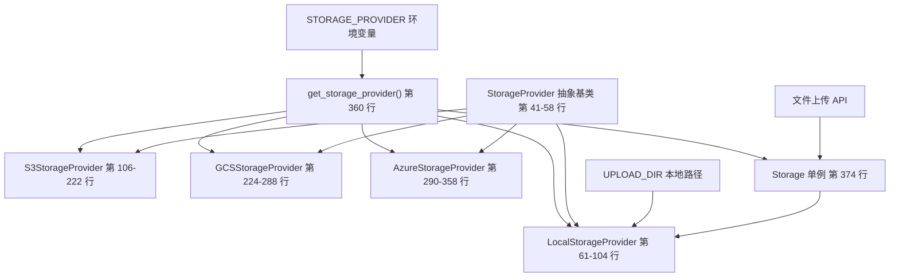
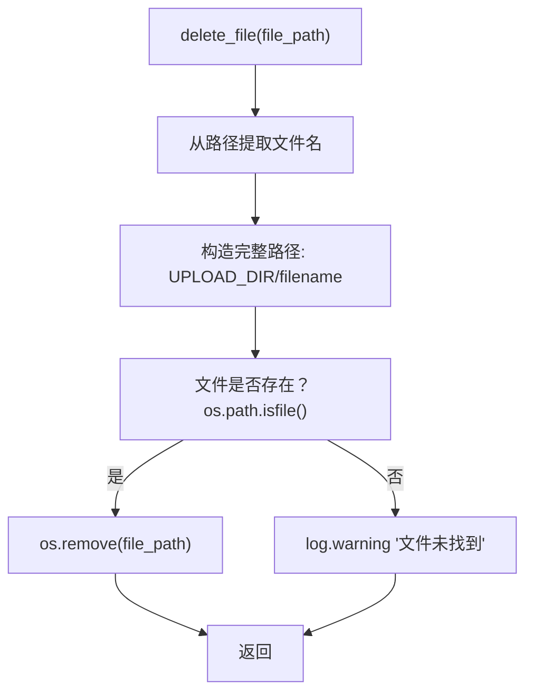
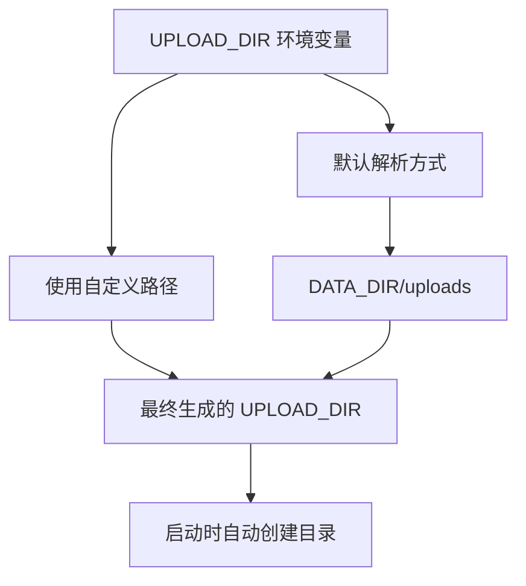

# 本地存储提供者

相关源文件

-   [.github/workflows/integration-test.disabled](https://github.com/open-webui/open-webui/blob/a7271532/.github/workflows/integration-test.disabled)
-   [backend/open\_webui/storage/provider.py](https://github.com/open-webui/open-webui/blob/a7271532/backend/open_webui/storage/provider.py)
-   [backend/open\_webui/test/apps/webui/storage/test\_provider.py](https://github.com/open-webui/open-webui/blob/a7271532/backend/open_webui/test/apps/webui/storage/test_provider.py)
-   [backend/requirements-min.txt](https://github.com/open-webui/open-webui/blob/a7271532/backend/requirements-min.txt)
-   [backend/requirements.txt](https://github.com/open-webui/open-webui/blob/a7271532/backend/requirements.txt)
-   [docker-compose.playwright.yaml](https://github.com/open-webui/open-webui/blob/a7271532/docker-compose.playwright.yaml)
-   [pyproject.toml](https://github.com/open-webui/open-webui/blob/a7271532/pyproject.toml)
-   [uv.lock](https://github.com/open-webui/open-webui/blob/a7271532/uv.lock)

## 目的与范围

本地存储提供者为 Open WebUI 中上传的文件实现了基于文件系统的存储。本文档涵盖了 `LocalStorageProvider` 类，该类使用 `UPLOAD_DIR` 目录直接在服务器的本地文件系统中存储文件。有关云存储选项（S3, Google Cloud Storage, Azure Blob Storage），请参阅 [云存储提供者](/open-webui/open-webui/12.3-cloud-storage-providers)。有关整体存储抽象层，请参阅 [存储提供者架构](/open-webui/open-webui/12.1-storage-provider-architecture)。

**来源：** [backend/open\_webui/storage/provider.py1-104](https://github.com/open-webui/open-webui/blob/a7271532/backend/open_webui/storage/provider.py#L1-L104)

## 存储提供者系统概览

Open WebUI 使用多态存储系统，可以通过 `STORAGE_PROVIDER` 环境变量选择不同的存储后端。`LocalStorageProvider` 是默认实现，也是最简单的选项，适用于单服务器部署。


**来源：** [backend/open\_webui/storage/provider.py41-58](https://github.com/open-webui/open-webui/blob/a7271532/backend/open_webui/storage/provider.py#L41-L58) [backend/open\_webui/storage/provider.py360-374](https://github.com/open-webui/open-webui/blob/a7271532/backend/open_webui/storage/provider.py#L360-L374)

## LocalStorageProvider 实现

`LocalStorageProvider` 类实现了 `StorageProvider` 抽象接口及其四个核心方法。由于该类不维护任何实例状态，所有方法均被定义为静态方法。

### 类结构

```mermaid
flowchart TD
    classId_StorageProvider_26["«abstract» 抽象类"]
    classId_LocalStorageProvider_27["LocalStorageProvider 本地存储"]
    note0["所有方法均为静态<br/>使用 UPLOAD_DIR 常量<br/>无云端依赖"]

    classId_StorageProvider_26 <|-- classId_LocalStorageProvider_27
```
**来源：** [backend/open\_webui/storage/provider.py41-58](https://github.com/open-webui/open-webui/blob/a7271532/backend/open_webui/storage/provider.py#L41-L58) [backend/open\_webui/storage/provider.py61-104](https://github.com/open-webui/open-webui/blob/a7271532/backend/open_webui/storage/provider.py#L61-L104)

## 文件操作

### 上传文件操作

`upload_file` 方法处理文件上传、验证并将其写入磁盘：

> **[Mermaid sequence]**
> *(图表结构无法解析)*

[backend/open\_webui/storage/provider.py62-72](https://github.com/open-webui/open-webui/blob/a7271532/backend/open_webui/storage/provider.py#L62-L72) 处的实现执行以下步骤：

1.  **读取文件内容**：`contents = file.read()`
2.  **验证非空**：如果内容为空，抛出带有 `ERROR_MESSAGES.EMPTY_CONTENT` 的 `ValueError`。
3.  **构造路径**：`file_path = f"{UPLOAD_DIR}/{filename}"`
4.  **写入磁盘**：以二进制写入模式打开文件并写入内容。
5.  **返回元组**：`(contents, file_path)` - 字节格式的内容以及完整的系统路径。

**注意**：`tags` 参数虽为保持接口兼容性而保留，但在 `LocalStorageProvider` 中并未使用。云提供商会使用此参数进行元数据标记。

**来源：** [backend/open\_webui/storage/provider.py62-72](https://github.com/open-webui/open-webui/blob/a7271532/backend/open_webui/storage/provider.py#L62-L72)

### 获取文件操作

`get_file` 方法对本地存储来说是一个透传操作：

```python
@staticmethod
def get_file(file_path: str) -> str:
    """处理从本地存储下载文件。"""
    return file_path
```
由于文件已经存在于本地文件系统中，该方法只需原样返回路径即可。云存储提供者会覆盖此方法，在返回本地路径之前先将文件下载到 `UPLOAD_DIR`。

**来源：** [backend/open\_webui/storage/provider.py74-77](https://github.com/open-webui/open-webui/blob/a7271532/backend/open_webui/storage/provider.py#L74-L77)

### 删除文件操作

`delete_file` 方法移除单个文件并进行安全检查：


来自 [backend/open\_webui/storage/provider.py79-87](https://github.com/open-webui/open-webui/blob/a7271532/backend/open_webui/storage/provider.py#L79-L87) 的实现详情：

-   使用 `filename = file_path.split("/")[-1]` 提取文件名。
-   重新构造路径：`file_path = f"{UPLOAD_DIR}/{filename}"`。
-   使用 `os.path.isfile(file_path)` 检查是否存在。
-   如果存在则使用 `os.remove(file_path)` 移除。
-   如果未找到文件则记录警告日志。

**来源：** [backend/open\_webui/storage/provider.py79-87](https://github.com/open-webui/open-webui/blob/a7271532/backend/open_webui/storage/provider.py#L79-L87)

### 删除所有文件操作

`delete_all_files` 方法递归移除上传目录下的所有内容：

```python
@staticmethod
def delete_all_files() -> None:
    """处理从本地存储删除所有文件。"""
    if os.path.exists(UPLOAD_DIR):
        for filename in os.listdir(UPLOAD_DIR):
            file_path = os.path.join(UPLOAD_DIR, filename)
            try:
                if os.path.isfile(file_path) or os.path.islink(file_path):
                    os.unlink(file_path)  # 删除文件或链接
                elif os.path.isdir(file_path):
                    shutil.rmtree(file_path)  # 删除目录
            except Exception as e:
                log.exception(f"无法删除 {file_path}。原因: {e}")
    else:
        log.warning(f"本地存储中未找到目录 {UPLOAD_DIR}。")
```
该方法：

-   检查 `UPLOAD_DIR` 是否存在。
-   遍历目录下的所有条目。
-   使用 `os.unlink()` 处理文件/符号链接。
-   使用 `shutil.rmtree()` 处理子目录。
-   记录单个文件删除失败的异常。
-   在失败后继续处理剩余项。

**来源：** [backend/open\_webui/storage/provider.py89-103](https://github.com/open-webui/open-webui/blob/a7271532/backend/open_webui/storage/provider.py#L89-L103)

## 配置

### 环境变量

`LocalStorageProvider` 依赖于从 `open_webui.config` 导入的两个配置值：

| 变量 | 类型 | 默认值 | 描述 |
| --- | --- | --- | --- |
| `STORAGE_PROVIDER` | string | `"local"` | 决定使用哪个存储后端 |
| `UPLOAD_DIR` | string | 平台特定 | 文件存储的目录路径 |

**来源：** [backend/open\_webui/storage/provider.py12-29](https://github.com/open-webui/open-webui/blob/a7271532/backend/open_webui/storage/provider.py#L12-L29)

### UPLOAD\_DIR 解析

`UPLOAD_DIR` 路径在配置系统中进行解析（参见 [环境配置](/open-webui/open-webui/11.1-environment-configuration)），通常遵循如下模式：


如果在应用初始化时该目录不存在，系统会自动创建。

**来源：** [backend/open\_webui/storage/provider.py28](https://github.com/open-webui/open-webui/blob/a7271532/backend/open_webui/storage/provider.py#L28-L28)

## 工厂模式与初始化

存储系统使用工厂模式在模块导入时实例化正确的提供者：

```python
def get_storage_provider(storage_provider: str):
    if storage_provider == "local":
        Storage = LocalStorageProvider()
    elif storage_provider == "s3":
        Storage = S3StorageProvider()
    elif storage_provider == "gcs":
        Storage = GCSStorageProvider()
    elif storage_provider == "azure":
        Storage = AzureStorageProvider()
    else:
        raise RuntimeError(f"不支持的存储提供者: {storage_provider}")
    return Storage

Storage = get_storage_provider(STORAGE_PROVIDER)
```
全局单例 `Storage` 在模块导入时创建，并在整个应用中使用。这提供了一个统一的配置点，并允许通过环境变量切换存储后端而无需修改代码。

**来源：** [backend/open\_webui/storage/provider.py360-374](https://github.com/open-webui/open-webui/blob/a7271532/backend/open_webui/storage/provider.py#L360-L374)

## 目录结构与文件组织

通过 `LocalStorageProvider` 上传的文件被扁平化存储在 `UPLOAD_DIR` 目录下：

```text
UPLOAD_DIR/
├── document1.pdf
├── image1.png
├── spreadsheet1.xlsx
├── avatar_abc123.jpg
└── ...
```
**关键特征：**

-   **扁平结构**：默认不含子目录。
-   **保留文件名**：通常使用原始文件名（调用代码可能会添加前缀或哈希）。
-   **无元数据存储**：不同于云提供商，不维护独立的元数据文件。
-   **直接文件系统访问**：应用代码可以使用标准 Python 文件 I/O 直接访问文件。

**来源：** [backend/open\_webui/storage/provider.py69](https://github.com/open-webui/open-webui/blob/a7271532/backend/open_webui/storage/provider.py#L69-L69) [backend/open\_webui/storage/provider.py83](https://github.com/open-webui/open-webui/blob/a7271532/backend/open_webui/storage/provider.py#L83-L83)

## 与云提供商的集成

云存储提供者 (`S3StorageProvider`, `GCSStorageProvider`, `AzureStorageProvider`) 使用了一种利用 `LocalStorageProvider` 的两阶段方法：

> **[Mermaid sequence]**
> *(图表结构无法解析)*

这种混合方法意味着 `UPLOAD_DIR` 充当：

-   `local` 提供者的**主存储**。
-   云端上传的**暂存区**。
-   云端下载的**缓存目录**。

**来源：** [backend/open\_webui/storage/provider.py150](https://github.com/open-webui/open-webui/blob/a7271532/backend/open_webui/storage/provider.py#L150-L150) [backend/open\_webui/storage/provider.py195](https://github.com/open-webui/open-webui/blob/a7271532/backend/open_webui/storage/provider.py#L195-L195) [backend/open\_webui/storage/provider.py243](https://github.com/open-webui/open-webui/blob/a7271532/backend/open_webui/storage/provider.py#L243-L243)

## 错误处理

### 空文件验证

`LocalStorageProvider` 唯一执行的验证是检查空文件：

```python
contents = file.read()
if not contents:
    raise ValueError(ERROR_MESSAGES.EMPTY_CONTENT)
```
这防止了将零字节文件写入磁盘。

**来源：** [backend/open\_webui/storage/provider.py66-68](https://github.com/open-webui/open-webui/blob/a7271532/backend/open_webui/storage/provider.py#L66-L68)

### 文件删除安全性

`delete_file` 方法包含存在性检查：

-   如果文件不存在则静默返回（记录警告日志）。
-   不为缺失文件抛出异常。
-   这防止了删除已删除文件时发生错误。

`delete_all_files` 方法捕获并记录单个删除失败：

```python
try:
    if os.path.isfile(file_path) or os.path.islink(file_path):
        os.unlink(file_path)
    elif os.path.isdir(file_path):
        shutil.rmtree(file_path)
except Exception as e:
    log.exception(f"无法删除 {file_path}。原因: {e}")
```
这确保了部分失败不会中断清理过程。

**来源：** [backend/open\_webui/storage/provider.py84-101](https://github.com/open-webui/open-webui/blob/a7271532/backend/open_webui/storage/provider.py#L84-L101)

## 测试

`LocalStorageProvider` 的测试套件位于 [backend/open\_webui/test/apps/webui/storage/test\_provider.py59-98](https://github.com/open-webui/open-webui/blob/a7271532/backend/open_webui/test/apps/webui/storage/test_provider.py#L59-L98)，包含：

### 测试覆盖范围

| 测试方法 | 目的 | 关键断言 |
| --- | --- | --- |
| `test_upload_file` | 验证文件上传和内容写入 | 文件存在于临时目录，内容匹配，空文件抛出 ValueError |
| `test_get_file` | 验证路径返回 | 返回的路径等于输入路径 |
| `test_delete_file` | 验证删除单个文件 | 操作前文件存在，操作后不存在 |
| `test_delete_all_files` | 验证批量删除 | 多个文件被完全移除 |

### 测试基础设施

测试使用 `monkeypatch` 和 `tmp_path` fixture 来：

1.  创建隔离的临时目录。
2.  对全局 `UPLOAD_DIR` 变量进行打桩 (patch)。
3.  验证操作且不影响真实文件系统。

测试设置示例：

```python
def mock_upload_dir(monkeypatch, tmp_path):
    """用于对 UPLOAD_DIR 进行打桩并创建临时目录的 fixture。"""
    directory = tmp_path / "uploads"
    directory.mkdir()
    monkeypatch.setattr(provider, "UPLOAD_DIR", str(directory))
    return directory
```
**来源：** [backend/open\_webui/test/apps/webui/storage/test\_provider.py14-19](https://github.com/open-webui/open-webui/blob/a7271532/backend/open_webui/test/apps/webui/storage/test_provider.py#L14-L19) [backend/open\_webui/test/apps/webui/storage/test\_provider.py59-98](https://github.com/open-webui/open-webui/blob/a7271532/backend/open_webui/test/apps/webui/storage/test_provider.py#L59-L98)

## 依赖项

`LocalStorageProvider` 的依赖项极少：

```python
import os
import shutil
import logging
from typing import BinaryIO, Tuple, Dict
```
除了 Python 标准库外无需任何外部包，使其成为最轻量级的存储选项。

**来源：** [backend/open\_webui/storage/provider.py1-7](https://github.com/open-webui/open-webui/blob/a7271532/backend/open_webui/storage/provider.py#L1-L7)

## 使用模式

在整个 Open WebUI 代码库中，通过模块级的 `Storage` 单例访问存储提供者：

```python
from open_webui.storage.provider import Storage

# 上传文件
contents, file_path = Storage.upload_file(file_object, "document.pdf", {})

# 获取文件路径 (对于本地存储，这是一个空操作)
local_path = Storage.get_file(file_path)

# 删除文件
Storage.delete_file(file_path)

# 删除所有文件
Storage.delete_all_files()
```
调用方无需知道哪个存储提供者处于活跃状态——所有提供者的接口都是一致的。

**来源：** [backend/open\_webui/storage/provider.py374](https://github.com/open-webui/open-webui/blob/a7271532/backend/open_webui/storage/provider.py#L374-L374)
