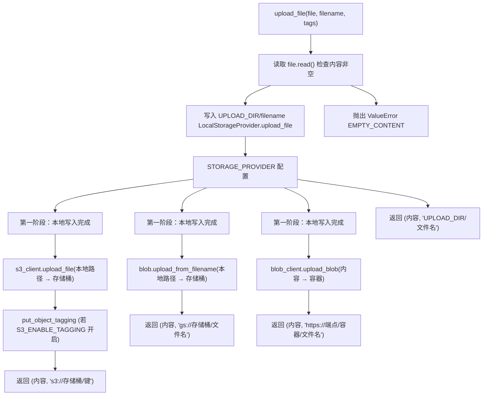
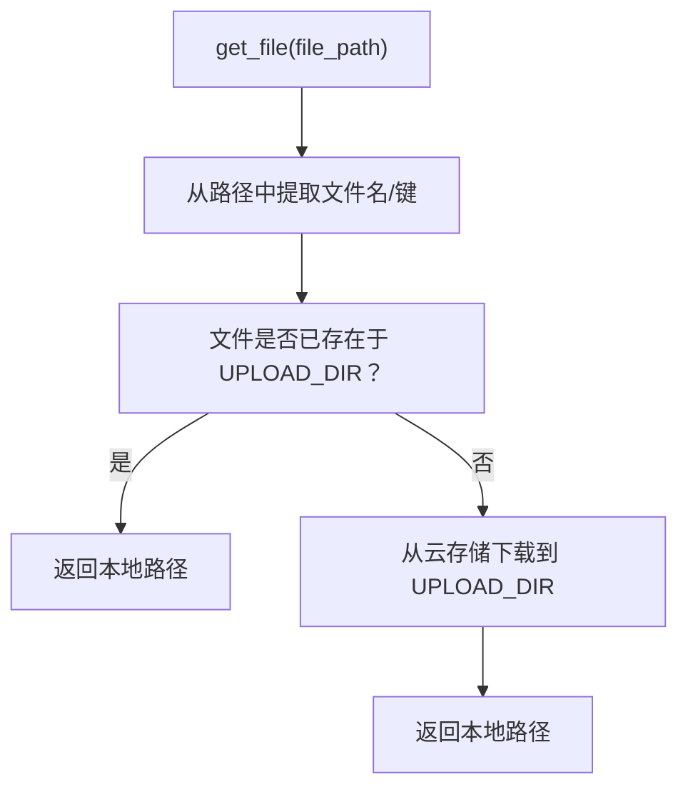

# 文件上传处理

相关源文件

-   [.github/workflows/integration-test.disabled](https://github.com/open-webui/open-webui/blob/a7271532/.github/workflows/integration-test.disabled)
-   [backend/open\_webui/storage/provider.py](https://github.com/open-webui/open-webui/blob/a7271532/backend/open_webui/storage/provider.py)
-   [backend/open\_webui/test/apps/webui/storage/test\_provider.py](https://github.com/open-webui/open-webui/blob/a7271532/backend/open_webui/test/apps/webui/storage/test_provider.py)
-   [backend/requirements-min.txt](https://github.com/open-webui/open-webui/blob/a7271532/backend/requirements-min.txt)
-   [backend/requirements.txt](https://github.com/open-webui/open-webui/blob/a7271532/backend/requirements.txt)
-   [docker-compose.playwright.yaml](https://github.com/open-webui/open-webui/blob/a7271532/docker-compose.playwright.yaml)
-   [pyproject.toml](https://github.com/open-webui/open-webui/blob/a7271532/pyproject.toml)
-   [uv.lock](https://github.com/open-webui/open-webui/blob/a7271532/uv.lock)

## 目的与范围

本文档解释了 Open WebUI 中的文件上传处理系统，特别是其两阶段上传架构：文件首先被写入本地存储，然后可选地同步到云存储后端。本页重点介绍上传流程、返回值以及错误处理的机制。有关存储提供者抽象层的信息，请参阅 [存储提供者架构](/open-webui/open-webui/12.1-storage-provider-architecture)。有关特定提供者实现的详情，请参阅 [本地存储提供者](/open-webui/open-webui/12.2-local-storage-provider) 和 [云存储提供者](/open-webui/open-webui/12.3-cloud-storage-providers)。

## 两阶段上传架构

### 概览

无论配置哪种存储提供者，Open WebUI 中的所有文件上传都遵循一个两阶段过程：

1.  **第一阶段：本地暂存 (Local Staging)** - 文件首先被写入本地文件系统的 `UPLOAD_DIR`。
2.  **第二阶段：云端同步 (Cloud Synchronization)** - 云提供者将本地文件同步到远程存储。

这种架构提供了多项运维优势：

-   **缓存**：本地副本充当频繁访问文件的缓存。
-   **可靠性**：即使云端上传暂时失败，本地上传仍能成功。
-   **性能**：本地文件可以直接提供服务，无需调用云端 API。
-   **一致性**：所有提供者都遵循相同的初始处理路径。

### 按提供商划分的上传流程


**来源：** [backend/open\_webui/storage/provider.py61-357](https://github.com/open-webui/open-webui/blob/a7271532/backend/open_webui/storage/provider.py#L61-L357)

## 第一阶段：本地文件写入

### LocalStorageProvider.upload\_file 方法

无论配置哪种存储提供者，所有文件上传都从调用 `LocalStorageProvider.upload_file` 开始。该方法执行以下操作：

1.  **读取文件内容**：`contents = file.read()` 将整个文件读入内存。
2.  **验证非空**：如果内容为空，抛出 `ValueError(ERROR_MESSAGES.EMPTY_CONTENT)`。
3.  **构造文件路径**：`file_path = f"{UPLOAD_DIR}/{filename}"`。
4.  **写入磁盘**：以二进制写入模式 (`"wb"`) 打开文件并写入内容。
5.  **返回元组**：返回 `(contents, file_path)`。

### 代码结构

```mermaid
flowchart TD
    classId_LocalStorageProvider_28["«static» 静态方法"]
    classId_S3StorageProvider_29["S3StorageProvider"]
    classId_GCSStorageProvider_30["GCSStorageProvider"]
    classId_AzureStorageProvider_31["AzureStorageProvider"]

    classId_LocalStorageProvider_28 <.. classId_S3StorageProvider_29
    classId_LocalStorageProvider_28 <.. classId_GCSStorageProvider_30
    classId_LocalStorageProvider_28 <.. classId_AzureStorageProvider_31
```
**来源：** [backend/open\_webui/storage/provider.py61-72](https://github.com/open-webui/open-webui/blob/a7271532/backend/open_webui/storage/provider.py#L61-L72) [backend/open\_webui/storage/provider.py106-137](https://github.com/open-webui/open-webui/blob/a7271532/backend/open_webui/storage/provider.py#L106-L137) [backend/open\_webui/storage/provider.py224-237](https://github.com/open-webui/open-webui/blob/a7271532/backend/open_webui/storage/provider.py#L224-L237) [backend/open\_webui/storage/provider.py290-309](https://github.com/open-webui/open-webui/blob/a7271532/backend/open_webui/storage/provider.py#L290-L309)

### 文件路径构造

本地文件路径遵循简单的模式：

-   **模式**：`{UPLOAD_DIR}/{filename}`
-   **UPLOAD\_DIR**：通过环境变量配置，通常为 `./data/uploads/`。
-   **filename**：由调用方提供，通常包含唯一标识符（UUID、哈希值）。

示例：`/data/uploads/a1b2c3d4-e5f6-4789-abcd-ef0123456789.pdf`

文件名参数必须是唯一的，以防止覆盖。调用方负责生成唯一的文件名。

**来源：** [backend/open\_webui/storage/provider.py69](https://github.com/open-webui/open-webui/blob/a7271532/backend/open_webui/storage/provider.py#L69-L69)

## 第二阶段：云端同步

### S3StorageProvider 上传流程

> **[Mermaid sequence]**
> *(图表结构无法解析)*

**来源：** [backend/open\_webui/storage/provider.py146-174](https://github.com/open-webui/open-webui/blob/a7271532/backend/open_webui/storage/provider.py#L146-L174)

### S3 特定实现详情

**密钥前缀支持**：`S3_KEY_PREFIX` 环境变量允许在存储桶内组织文件：

-   S3 键构造：`s3_key = os.path.join(self.key_prefix, filename)`。
-   示例：`key_prefix="uploads/"` 产生 `s3://bucket/uploads/filename.pdf`。

**标签清理**：S3 标签必须仅包含特定字符。`sanitize_tag_value` 方法强制执行此项：

```python
# 允许的字符：[a-zA-Z0-9 äöüÄÖÜß\+\-=\._:/@]
return re.sub(r"[^a-zA-Z0-9 äöüÄÖÜß\+\-=\._:/@]", "", s)
```
**标签应用**：标签在上传完成后通过单独的 API 调用应用：

1.  仅在 `S3_ENABLE_TAGGING=true` 且 `tags` 字典非空时应用标签。
2.  对标签键和值进行清理，并转换为 S3 TagSet 格式：`[{"Key": k, "Value": v}, ...]`。
3.  通过 `put_object_tagging` API 调用进行应用。

**身份验证选项**：

-   **显式凭据**：设置 `S3_ACCESS_KEY_ID` 和 `S3_SECRET_ACCESS_KEY`。
-   **工作负载标识**：忽略凭据以使用 IAM 角色（EC2, EKS, ECS）。

**来源：** [backend/open\_webui/storage/provider.py106-174](https://github.com/open-webui/open-webui/blob/a7271532/backend/open_webui/storage/provider.py#L106-L174)

### GCS 与 Azure 上传流程

**GCS 上传序列**：

1.  调用 `LocalStorageProvider.upload_file` → 获取 `(contents, local_path)`。
2.  创建 blob：`blob = self.bucket.blob(filename)`。
3.  上传：`blob.upload_from_filename(local_path)`。
4.  返回：`(contents, f"gs://{bucket_name}/{filename}")`。

**Azure 上传序列**：

1.  调用 `LocalStorageProvider.upload_file` → 获取 `(contents, local_path)`。
2.  获取 blob 客户端：`blob_client = self.container_client.get_blob_client(filename)`。
3.  上传：`blob_client.upload_blob(contents, overwrite=True)`。
4.  返回：`(contents, f"{endpoint}/{container_name}/{filename}")`。

**关键差异**：

-   GCS 从本地文件路径上传。
-   Azure 直接上传内容字节。
-   Azure 始终使用 `overwrite=True` 来替换现有 blob。

**来源：** [backend/open\_webui/storage/provider.py239-249](https://github.com/open-webui/open-webui/blob/a7271532/backend/open_webui/storage/provider.py#L239-L249) [backend/open\_webui/storage/provider.py311-321](https://github.com/open-webui/open-webui/blob/a7271532/backend/open_webui/storage/provider.py#L311-L321)

## 上传返回值

### 返回类型与组成部分

所有的 `upload_file` 方法均返回 `Tuple[bytes, str]`：

1.  **bytes**：原始文件内容（整个文件驻留在内存中）。
2.  **str**：标识存储位置的文件路径或 URL。

内容对于无需重新从磁盘读取的即时处理非常有用。路径字符串通常存储在数据库中，作为后续检索的引用。

### 按提供商划分的文件路径格式

| 提供者 | 格式 | 示例 | 备注 |
| --- | --- | --- | --- |
| `local` | `{UPLOAD_DIR}/{filename}` | `/data/uploads/file.pdf` | 本地文件系统路径 |
| `s3` | `s3://{bucket}/{key}` | `s3://my-bucket/uploads/file.pdf` | S3 URI 格式 |
| `gcs` | `gs://{bucket}/{filename}` | `gs://my-bucket/file.pdf` | GCS URI 格式 |
| `azure` | `https://{endpoint}/{container}/{filename}` | `https://account.blob.core.windows.net/uploads/file.pdf` | 完整的 HTTPS URL |

### 路径格式的意义

路径格式具有多种用途：

1.  **提供者识别**：URI 方案（`s3://`, `gs://`, `https://`）标识了存储后端。
2.  **检索路由**：`get_file` 方法根据路径格式确定检索策略。
3.  **数据库存储**：路径存储在引用该文件的数据库记录中。
4.  **调试**：路径使得在云控制台中定位文件变得容易。

**来源：** [backend/open\_webui/storage/provider.py69-72](https://github.com/open-webui/open-webui/blob/a7271532/backend/open_webui/storage/provider.py#L69-L72) [backend/open\_webui/storage/provider.py169-172](https://github.com/open-webui/open-webui/blob/a7271532/backend/open_webui/storage/provider.py#L169-L172) [backend/open\_webui/storage/provider.py247](https://github.com/open-webui/open-webui/blob/a7271532/backend/open_webui/storage/provider.py#L247-L247) [backend/open\_webui/storage/provider.py319](https://github.com/open-webui/open-webui/blob/a7271532/backend/open_webui/storage/provider.py#L319-L319)

## 错误处理

### 验证错误

**空文件检查**：所有提供者在第一阶段期间都会验证文件内容是否非空：

```python
contents = file.read()
if not contents:
    raise ValueError(ERROR_MESSAGES.EMPTY_CONTENT)
```
该验证发生在 `LocalStorageProvider.upload_file` 中，因此适用于所有提供者。

**来源：** [backend/open\_webui/storage/provider.py66-68](https://github.com/open-webui/open-webui/blob/a7271532/backend/open_webui/storage/provider.py#L66-L68)

### 云端上传错误

每个云提供者都会将云端特定的异常包装在通用的 `RuntimeError` 中：

| 提供者 | 异常类型 | 错误包装 |
| --- | --- | --- |
| S3 | `ClientError` (boto3) | `RuntimeError(f"Error uploading file to S3: {e}")` |
| GCS | `GoogleCloudError` | `RuntimeError(f"Error uploading file to GCS: {e}")` |
| Azure | 通用 `Exception` | `RuntimeError(f"Error uploading file to Azure Blob Storage: {e}")` |

### 错误恢复考量

**部分成功场景**：

-   如果第一阶段成功但第二阶段失败，文件将存在于 `UPLOAD_DIR` 中。
-   由于函数抛出了异常，因此不会创建数据库记录。
-   本地文件变成了“孤儿文件”（存在于磁盘但未被引用）。
-   可能需要手动清理来移除孤儿文件。

**重试行为**：

-   存储提供者内部未实现自动重试逻辑。
-   如有需要，调用方负责实现重试逻辑。
-   云 SDK 客户端（boto3, google-cloud-storage）拥有自己的重试机制。

**来源：** [backend/open\_webui/storage/provider.py173-174](https://github.com/open-webui/open-webui/blob/a7271532/backend/open_webui/storage/provider.py#L173-L174) [backend/open\_webui/storage/provider.py248-249](https://github.com/open-webui/open-webui/blob/a7271532/backend/open_webui/storage/provider.py#L248-L249) [backend/open\_webui/storage/provider.py320-321](https://github.com/open-webui/open-webui/blob/a7271532/backend/open_webui/storage/provider.py#L320-L321)

## 文件元数据与标签

### 标签参数

`upload_file` 方法签名包含 `tags: Dict[str, str]`：

```python
def upload_file(self, file: BinaryIO, filename: str, tags: Dict[str, str]) -> Tuple[bytes, str]
```
目前，仅 S3 实现了标签支持。GCS 和 Azure 提供者接收该参数但会忽略。

### S3 标签实现

**标签处理步骤**：

1.  检查 `S3_ENABLE_TAGGING` 标志且 tags 字典非空。
2.  清理标签键和值：`sanitized_tags = {sanitize_tag_value(k): sanitize_tag_value(v) for k, v in tags.items()}`。
3.  转换为 S3 TagSet 格式：`{"TagSet": [{"Key": k, "Value": v} for k, v in sanitized_tags.items()]}`。
4.  应用标签：`s3_client.put_object_tagging(Bucket=bucket, Key=key, Tagging=tagging)`。

**字符限制**：S3 标签允许：`[a-zA-Z0-9 äöüÄÖÜß\+\-=\._:/@]`

-   字母、数字、空格。
-   德语变音符号。
-   特殊字符：`+ - = . _ : / @`。

### 标签用例

常用的打标签模式：

| 标签键 | 示例值 | 用途 |
| --- | --- | --- |
| `user_id` | `user_abc123` | 将文件与用户关联 |
| `document_type` | `invoice` | 文档分类 |
| `upload_date` | `2024-01-15` | 追踪上传时间戳 |
| `project` | `project_x` | 启用成本分摊 |
| `retention` | `90days` | 支持生命周期策略 |

**来源：** [backend/open\_webui/storage/provider.py142-168](https://github.com/open-webui/open-webui/blob/a7271532/backend/open_webui/storage/provider.py#L142-L168)

## 本地文件缓存

### 缓存行为概览

两阶段架构创建了一个隐式缓存层：

**缓存填充**：

-   所有上传的文件在第一阶段期间都会缓存在 `UPLOAD_DIR` 中。
-   即使对于仅云端的存储配置，也会填充缓存。
-   不强制执行缓存大小限制或淘汰策略。

**缓存持久化**：

-   文件跨应用重启保持持久。
-   无自动过期或清理。
-   通过 `delete_file` 或 `delete_all_files` 方法进行手动清理。

### 缓存检索流程

云提供者的 `get_file` 方法实现了感知缓存的检索：


**S3 的 get\_file**：

```python
def get_file(self, file_path: str) -> str:
    s3_key = self._extract_s3_key(file_path)
    local_file_path = self._get_local_file_path(s3_key)
    self.s3_client.download_file(self.bucket_name, s3_key, local_file_path)
    return local_file_path
```
该方法始终从 S3 下载并返回本地路径。它不检查文件是否已在本地存在，因此每次调用 `get_file` 都会覆盖缓存。

**来源：** [backend/open\_webui/storage/provider.py176-184](https://github.com/open-webui/open-webui/blob/a7271532/backend/open_webui/storage/provider.py#L176-L184) [backend/open\_webui/storage/provider.py251-261](https://github.com/open-webui/open-webui/blob/a7271532/backend/open_webui/storage/provider.py#L251-L261) [backend/open\_webui/storage/provider.py323-333](https://github.com/open-webui/open-webui/blob/a7271532/backend/open_webui/storage/provider.py#L323-L333)

### 缓存管理考量

**存储开销**：

-   云端配置会存储文件两次：本地缓存 + 云存储。
-   未实现自动缓存淘汰。
-   如果没有手动清理，缓存可能会无限制增长。

**性能权衡**：

-   缓存实现了快速的本地文件服务。
-   消除了针对缓存文件的云端 API 延迟。
-   磁盘空间消耗随文件数量增长。

**运维建议**：

-   监控 `UPLOAD_DIR` 的磁盘使用情况。
-   根据需要实现定期的缓存清理。
-   对于高容量部署，考虑实现 LRU（最近最少使用）淘汰机制。

**来源：** [backend/open\_webui/storage/provider.py61-287](https://github.com/open-webui/open-webui/blob/a7271532/backend/open_webui/storage/provider.py#L61-L287)

## 测试基础设施

### 测试提供者实现

测试套件使用了针对各提供者的模拟策略：

| 提供者 | 模拟策略 | 实现方式 |
| --- | --- | --- |
| 本地 | `tmp_path` fixture | 创建临时目录，打桩 `UPLOAD_DIR` |
| S3 | `@mock_aws` 装饰器 | 使用 `moto` 库模拟 boto3 API |
| GCS | `gcp-storage-emulator` | 在 9023 端口运行本地仿真器服务器 |
| Azure | `MagicMock` | 模拟 `BlobServiceClient` 及相关客户端 |

### 上传测试模式

所有提供者测试都遵循一致的模式：

> **[Mermaid sequence]**
> *(图表结构无法解析)*

### 测试覆盖领域

**正向测试用例**：

-   上传有效文件并验证存储。
-   检索文件并验证本地路径。
-   删除单个文件。
-   删除所有文件。

**负向测试用例**：

-   空文件拒绝（抛出 `ValueError`）。
-   存储桶/容器缺失错误。
-   权限错误。
-   网络故障（针对云提供者）。

**边界情况**：

-   对同一个文件名进行多次上传。
-   大文件处理。
-   文件名中的特殊字符。
-   标签清理（仅限 S3）。

**来源：** [backend/open\_webui/test/apps/webui/storage/test\_provider.py59-425](https://github.com/open-webui/open-webui/blob/a7271532/backend/open_webui/test/apps/webui/storage/test_provider.py#L59-L425)

### 模拟上传目录 Fixture

```python
def mock_upload_dir(monkeypatch, tmp_path):
    """用于对 UPLOAD_DIR 进行打桩并创建临时目录的 fixture。"""
    directory = tmp_path / "uploads"
    directory.mkdir()
    monkeypatch.setattr(provider, "UPLOAD_DIR", str(directory))
    return directory
```
该 fixture 确保了：

-   测试使用隔离的临时目录。
-   不干扰真实的上传目录。
-   测试完成后自动清理。
-   确定性的测试行为。

**来源：** [backend/open\_webui/test/apps/webui/storage/test\_provider.py14-19](https://github.com/open-webui/open-webui/blob/a7271532/backend/open_webui/test/apps/webui/storage/test_provider.py#L14-L19)

## 配置参考

### 按提供商划分的环境变量

**本地存储**：

-   `UPLOAD_DIR` - 本地目录路径 (默认：`./data/uploads/`)

**S3 存储**：

-   `S3_BUCKET_NAME` - 必需：存储桶名称。
-   `S3_REGION_NAME` - 必需：AWS 区域 (例如 `us-east-1`)。
-   `S3_ENDPOINT_URL` - 可选：针对兼容 S3 服务的自定义端点。
-   `S3_ACCESS_KEY_ID` - 可选：AWS 访问密钥 (或使用工作负载标识)。
-   `S3_SECRET_ACCESS_KEY` - 可选：AWS 机密密钥 (或使用工作负载标识)。
-   `S3_KEY_PREFIX` - 可选：S3 键的前缀 (例如 `uploads/`)。
-   `S3_USE_ACCELERATE_ENDPOINT` - 可选：启用传输加速。
-   `S3_ADDRESSING_STYLE` - 可选：`path` 或 `virtual` 寻址方式。
-   `S3_ENABLE_TAGGING` - 可选：启用对象标签 (`true`/`false`)。

**GCS 存储**：

-   `GCS_BUCKET_NAME` - 必需：存储桶名称。
-   `GOOGLE_APPLICATION_CREDENTIALS_JSON` - 可选：服务账户 JSON (或使用默认凭据)。

**Azure 存储**：

-   `AZURE_STORAGE_ENDPOINT` - 必需：存储账户端点 URL。
-   `AZURE_STORAGE_CONTAINER_NAME` - 必需：容器名称。
-   `AZURE_STORAGE_KEY` - 可选：存储账户密钥 (或使用托管标识)。

**提供者选择**：

-   `STORAGE_PROVIDER` - 必需：`local`, `s3`, `gcs`, 或 `azure`。

**来源：** [backend/open\_webui/storage/provider.py12-29](https://github.com/open-webui/open-webui/blob/a7271532/backend/open_webui/storage/provider.py#L12-L29)

### 存储提供者初始化

存储提供者初始化为模块级的单例：

```python
Storage = get_storage_provider(STORAGE_PROVIDER)
```
`get_storage_provider` 工厂函数：

```python
def get_storage_provider(storage_provider: str):
    if storage_provider == "local":
        Storage = LocalStorageProvider()
    elif storage_provider == "s3":
        Storage = S3StorageProvider()
    elif storage_provider == "gcs":
        Storage = GCSStorageProvider()
    elif storage_provider == "azure":
        Storage = AzureStorageProvider()
    else:
        raise RuntimeError(f"不支持的存储提供者: {storage_provider}")
    return Storage
```
**来源：** [backend/open\_webui/storage/provider.py360-374](https://github.com/open-webui/open-webui/blob/a7271532/backend/open_webui/storage/provider.py#L360-L374)

## 与文档处理的集成

### 上游调用方

文件上传处理由多个子系统调用：

1.  **RAG 文档摄取** (参见 [文档摄取流水线](/open-webui/open-webui/7.1-document-ingestion-pipeline))
    -   上传 PDF, DOCX 和其他文档。
    -   文件由内容提取引擎处理。
    -   使用打标签将文件与知识库集合关联。
2.  **聊天文件附件** (参见 [文件上传与处理](/open-webui/open-webui/4.4-file-upload-and-processing))
    -   上传聊天消息中用户附加的文件。
    -   支持图像、音频、文档 (40 多种文件类型)。
    -   文件可能被内联嵌入或作为上下文处理。
3.  **用户/工作区资产**
    -   头像图像上传。
    -   自定义品牌资产。
    -   配置文件导入。

### 文件生命周期

> **[Mermaid stateDiagram]**
> *(图表结构无法解析)*

**典型生命周期**：

1.  **上传**：客户端调用 `upload_file` 并提供文件内容。
2.  **存储**：文件写入本地，并可选地写入云存储。
3.  **数据库引用**：调用方将返回的路径存储在数据库中。
4.  **检索**：后续访问时调用 `get_file` 并使用存储的路径。
5.  **处理**：从本地缓存读取文件进行处理。
6.  **删除**：当不再需要时，通过 `delete_file` 移除文件。

**来源：** [backend/open\_webui/storage/provider.py41-58](https://github.com/open-webui/open-webui/blob/a7271532/backend/open_webui/storage/provider.py#L41-L58)
