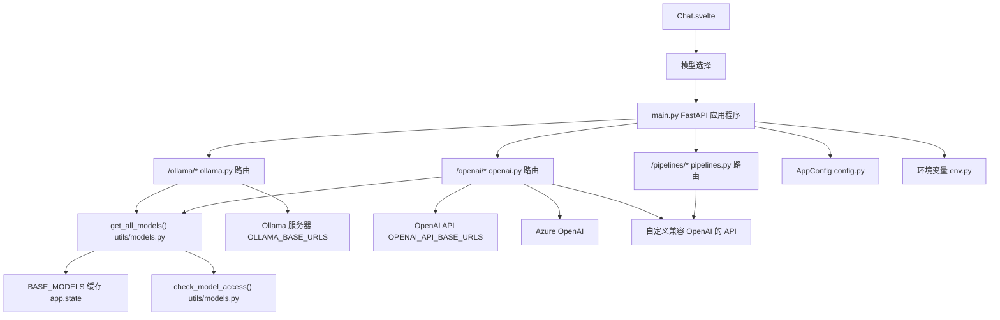
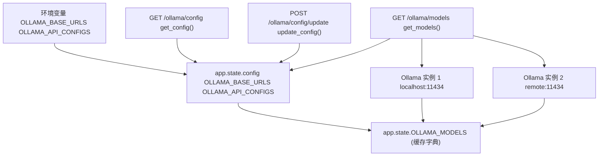
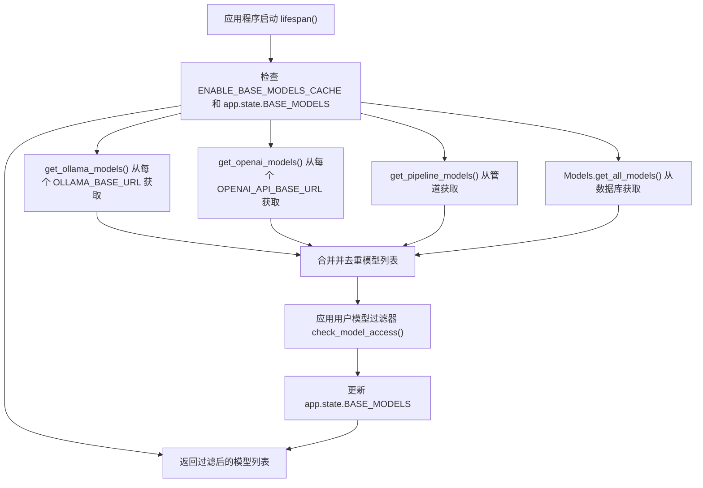
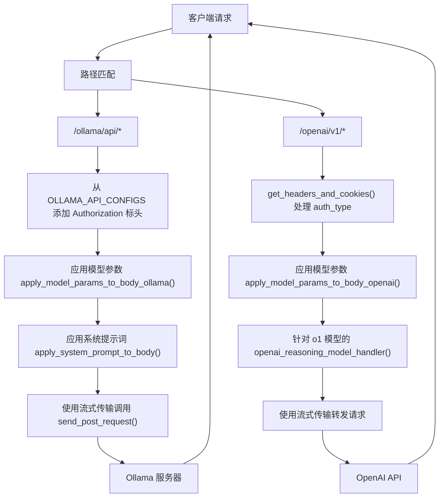
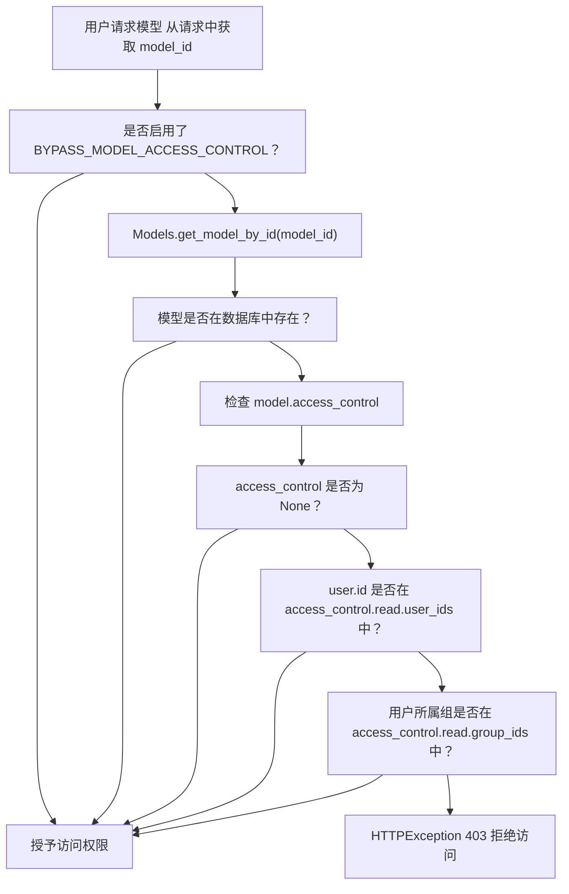
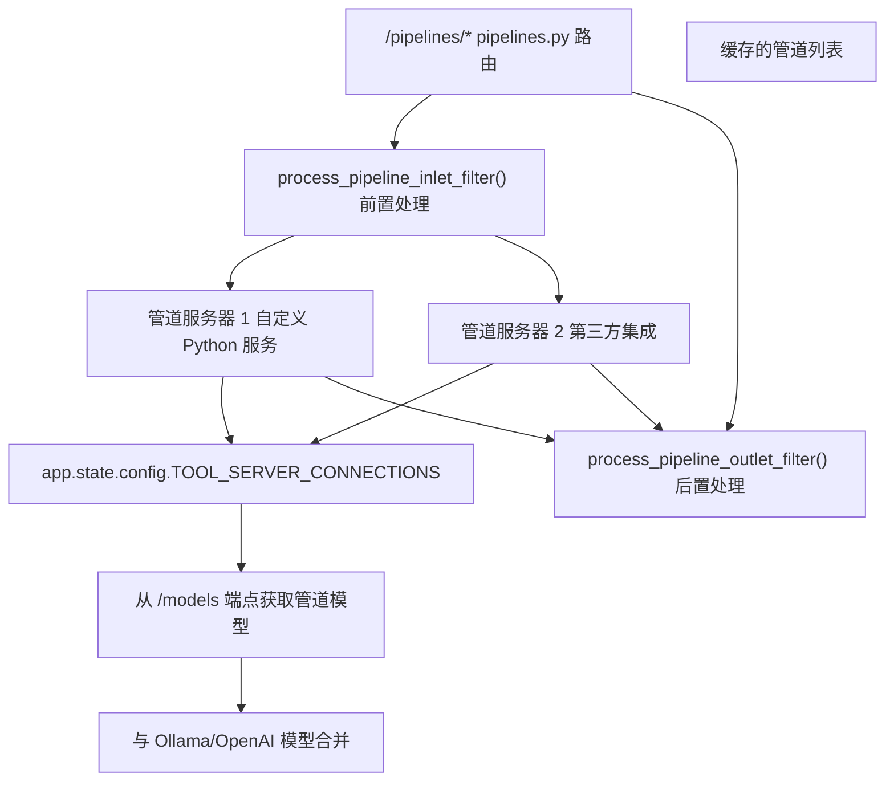
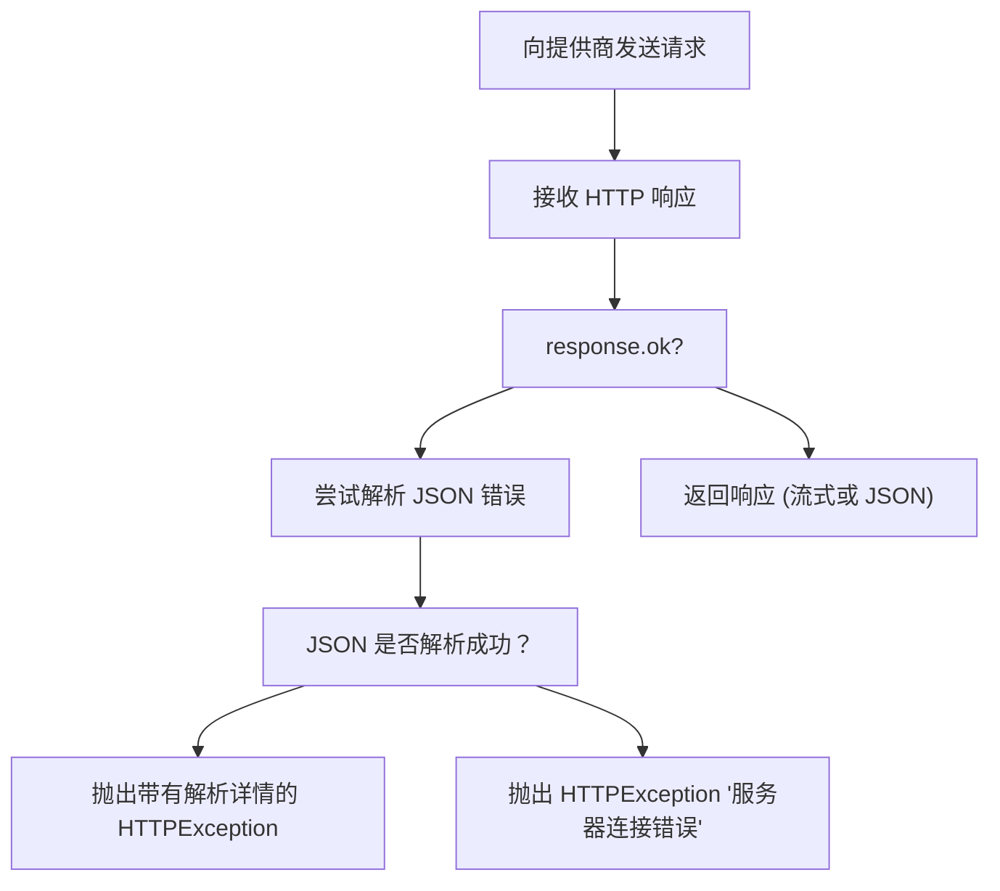
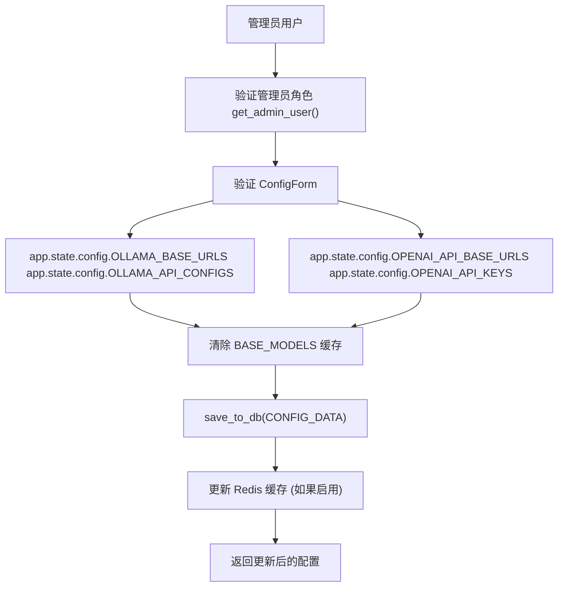

# LLM 提供商集成

相关源文件

-   [backend/open\_webui/config.py](https://github.com/open-webui/open-webui/blob/a7271532/backend/open_webui/config.py)
-   [backend/open\_webui/env.py](https://github.com/open-webui/open-webui/blob/a7271532/backend/open_webui/env.py)
-   [backend/open\_webui/main.py](https://github.com/open-webui/open-webui/blob/a7271532/backend/open_webui/main.py)
-   [backend/open\_webui/retrieval/loaders/datalab\_marker.py](https://github.com/open-webui/open-webui/blob/a7271532/backend/open_webui/retrieval/loaders/datalab_marker.py)
-   [backend/open\_webui/retrieval/loaders/external\_document.py](https://github.com/open-webui/open-webui/blob/a7271532/backend/open_webui/retrieval/loaders/external_document.py)
-   [backend/open\_webui/retrieval/loaders/external\_web.py](https://github.com/open-webui/open-webui/blob/a7271532/backend/open_webui/retrieval/loaders/external_web.py)
-   [backend/open\_webui/retrieval/loaders/main.py](https://github.com/open-webui/open-webui/blob/a7271532/backend/open_webui/retrieval/loaders/main.py)
-   [backend/open\_webui/retrieval/loaders/mineru.py](https://github.com/open-webui/open-webui/blob/a7271532/backend/open_webui/retrieval/loaders/mineru.py)
-   [backend/open\_webui/retrieval/loaders/mistral.py](https://github.com/open-webui/open-webui/blob/a7271532/backend/open_webui/retrieval/loaders/mistral.py)
-   [backend/open\_webui/retrieval/utils.py](https://github.com/open-webui/open-webui/blob/a7271532/backend/open_webui/retrieval/utils.py)
-   [backend/open\_webui/routers/audio.py](https://github.com/open-webui/open-webui/blob/a7271532/backend/open_webui/routers/audio.py)
-   [backend/open\_webui/routers/auths.py](https://github.com/open-webui/open-webui/blob/a7271532/backend/open_webui/routers/auths.py)
-   [backend/open\_webui/routers/ollama.py](https://github.com/open-webui/open-webui/blob/a7271532/backend/open_webui/routers/ollama.py)
-   [backend/open\_webui/routers/openai.py](https://github.com/open-webui/open-webui/blob/a7271532/backend/open_webui/routers/openai.py)
-   [backend/open\_webui/routers/retrieval.py](https://github.com/open-webui/open-webui/blob/a7271532/backend/open_webui/routers/retrieval.py)
-   [backend/open\_webui/utils/auth.py](https://github.com/open-webui/open-webui/blob/a7271532/backend/open_webui/utils/auth.py)
-   [backend/open\_webui/utils/embeddings.py](https://github.com/open-webui/open-webui/blob/a7271532/backend/open_webui/utils/embeddings.py)
-   [backend/open\_webui/utils/middleware.py](https://github.com/open-webui/open-webui/blob/a7271532/backend/open_webui/utils/middleware.py)
-   [backend/open\_webui/utils/misc.py](https://github.com/open-webui/open-webui/blob/a7271532/backend/open_webui/utils/misc.py)
-   [backend/open\_webui/utils/oauth.py](https://github.com/open-webui/open-webui/blob/a7271532/backend/open_webui/utils/oauth.py)
-   [backend/open\_webui/utils/response.py](https://github.com/open-webui/open-webui/blob/a7271532/backend/open_webui/utils/response.py)
-   [src/lib/apis/retrieval/index.ts](https://github.com/open-webui/open-webui/blob/a7271532/src/lib/apis/retrieval/index.ts)
-   [src/lib/components/admin/Settings/Documents.svelte](https://github.com/open-webui/open-webui/blob/a7271532/src/lib/components/admin/Settings/Documents.svelte)
-   [src/lib/components/admin/Settings/WebSearch.svelte](https://github.com/open-webui/open-webui/blob/a7271532/src/lib/components/admin/Settings/WebSearch.svelte)

## 目的和范围

本文档描述了 Open WebUI 如何与大型语言模型 (LLM) 提供商集成，包括 Ollama、OpenAI、Azure OpenAI 和其他兼容 OpenAI 的 API。内容涵盖了代理架构、配置管理、模型聚合、身份验证机制以及请求路由。

有关在 LLM 提供商集成之后发生的聊天处理管道信息，请参阅[后端处理管道](/open-webui/open-webui/6-backend-processing-pipeline)。有关身份验证和用户访问控制的详细信息，请参阅[身份验证和安全性](/open-webui/open-webui/10-authentication-and-security)。

**来源**：[backend/open\_webui/main.py1-97](https://github.com/open-webui/open-webui/blob/a7271532/backend/open_webui/main.py#L1-L97) [backend/open\_webui/routers/ollama.py1-70](https://github.com/open-webui/open-webui/blob/a7271532/backend/open_webui/routers/ollama.py#L1-L70) [backend/open\_webui/routers/openai.py1-55](https://github.com/open-webui/open-webui/blob/a7271532/backend/open_webui/routers/openai.py#L1-L55)

---

## 架构概览

Open WebUI 作为一个智能代理，介于前端应用程序和多个 LLM 提供商之间。系统支持同时运行多个并发提供商，每个提供商都有自己的配置、身份验证和模型目录。

### 系统架构图


**来源**：[backend/open\_webui/main.py633-639](https://github.com/open-webui/open-webui/blob/a7271532/backend/open_webui/main.py#L633-L639) [backend/open\_webui/main.py70-96](https://github.com/open-webui/open-webui/blob/a7271532/backend/open_webui/main.py#L70-L96) [backend/open\_webui/main.py482-487](https://github.com/open-webui/open-webui/blob/a7271532/backend/open_webui/main.py#L482-L487)

---

## 提供商配置

Open WebUI 通过灵活的配置系统支持多个 LLM 提供商。每个提供商可以同时配置多个端点。

### 配置状态管理

应用程序将提供商配置存储在 `app.state.config` 中：

| 配置键 | 类型 | 描述 |
| --- | --- | --- |
| `ENABLE_OLLAMA_API` | `bool` | 启用/禁用 Ollama 集成 |
| `OLLAMA_BASE_URLS` | `list[str]` | Ollama 服务器 URL 列表 |
| `OLLAMA_API_CONFIGS` | `dict` | 每个 URL 的配置（认证、请求头） |
| `ENABLE_OPENAI_API` | `bool` | 启用/禁用兼容 OpenAI 的 API |
| `OPENAI_API_BASE_URLS` | `list[str]` | 兼容 OpenAI 的 API URL 列表 |
| `OPENAI_API_KEYS` | `list[str]` | 每个 URL 对应的 API 密钥 |
| `OPENAI_API_CONFIGS` | `dict` | 每个 URL 的配置对象 |

**来源**：[backend/open\_webui/main.py681-698](https://github.com/open-webui/open-webui/blob/a7271532/backend/open_webui/main.py#L681-L698) [backend/open\_webui/config.py113-440](https://github.com/open-webui/open-webui/blob/a7271532/backend/open_webui/config.py#L113-L440)

### Ollama 配置


位于 `/ollama/*` 的 Ollama 路由提供以下端点：

-   **配置检索**：`GET /ollama/config` 返回当前 Ollama 设置
-   **配置更新**：通过 `OllamaConfigForm` 调用 `POST /ollama/config/update`
-   **模型列表**：`GET /ollama/models` 聚合来自所有已配置 Ollama 服务器的模型

**来源**：[backend/open\_webui/routers/ollama.py207-230](https://github.com/open-webui/open-webui/blob/a7271532/backend/open_webui/routers/ollama.py#L207-L230) [backend/open\_webui/routers/ollama.py233-271](https://github.com/open-webui/open-webui/blob/a7271532/backend/open_webui/routers/ollama.py#L233-L271) [backend/open\_webui/main.py681-686](https://github.com/open-webui/open-webui/blob/a7271532/backend/open_webui/main.py#L681-L686)

### OpenAI 配置

OpenAI 路由通过 `OPENAI_API_CONFIGS` 字典支持多种身份验证方法：

```
# 每个 URL 的配置结构
{
    "auth_type": "bearer" | "none" | "session" | "system_oauth" | "azure_ad",
    "headers": {
        "Custom-Header": "value"
    }
}
```
身份验证类型：

-   **`bearer`** (默认)：在 `Authorization: Bearer <key>` 标头中使用 API 密钥
-   **`none`**：无身份验证
-   **`session`**：转发用户会话 Cookie
-   **`system_oauth`**：使用 Open WebUI OAuth 令牌
-   **`azure_ad` / `microsoft_entra_id`**：使用 Azure AD DefaultAzureCredential

**来源**：[backend/open\_webui/routers/openai.py118-196](https://github.com/open-webui/open-webui/blob/a7271532/backend/open_webui/routers/openai.py#L118-L196) [backend/open\_webui/routers/openai.py208-230](https://github.com/open-webui/open-webui/blob/a7271532/backend/open_webui/routers/openai.py#L208-L230)

### 配置端点

两个路由器都公开了仅限管理员访问的配置端点：

| 端点 | 方法 | 用途 |
| --- | --- | --- |
| `/ollama/config` | GET | 检索 Ollama 配置 |
| `/ollama/config/update` | POST | 更新 Ollama 配置 |
| `/openai/config` | GET | 检索 OpenAI 配置 |
| `/openai/config/update` | POST | 更新 OpenAI 配置 |

**来源**：[backend/open\_webui/routers/ollama.py207-230](https://github.com/open-webui/open-webui/blob/a7271532/backend/open_webui/routers/ollama.py#L207-L230) [backend/open\_webui/routers/openai.py208-230](https://github.com/open-webui/open-webui/blob/a7271532/backend/open_webui/routers/openai.py#L208-L230)

---

## 模型聚合系统

系统将来自多个源的模型聚合到一个统一的目录中，并使用缓存进行性能优化。

### 模型聚合流


**来源**：[backend/open\_webui/main.py606-625](https://github.com/open-webui/open-webui/blob/a7271532/backend/open_webui/main.py#L606-L625) [backend/open\_webui/utils/models.py](https://github.com/open-webui/open-webui/blob/a7271532/backend/open_webui/utils/models.py) (在导入中引用)

### 模型缓存策略

系统实现了两层缓存策略：

1.  **基础模型缓存 (Base Models Cache)**：存储在 `app.state.BASE_MODELS` 中，通过 `ENABLE_BASE_MODELS_CACHE` 启用
    -   在应用程序启动时填充
    -   在所有用户之间共享
    -   生存时间 (TTL) 由 `MODELS_CACHE_TTL` 环境变量控制
2.  **提供商特定缓存 (Provider-Specific Cache)**：存储在 `app.state.OLLAMA_MODELS` 和 `app.state.OPENAI_MODELS` 中
    -   使用 `@cached` 装饰器进行按提供商缓存
    -   TTL 取自 `MODELS_CACHE_TTL`
    -   在配置更新时失效

**来源**：[backend/open\_webui/main.py685-698](https://github.com/open-webui/open-webui/blob/a7271532/backend/open_webui/main.py#L685-L698) [backend/open\_webui/main.py732-733](https://github.com/open-webui/open-webui/blob/a7271532/backend/open_webui/main.py#L732-L733) [backend/open\_webui/env.py546-554](https://github.com/open-webui/open-webui/blob/a7271532/backend/open_webui/env.py#L546-L554)

### Ollama 模型获取

```
# 从 ollama.py 简化而来
async def get_ollama_models(request: Request, url_idx: int = None):
    """从 Ollama 服务器获取模型"""
    if url_idx is None:
        # 从所有已配置的 Ollama 服务器获取
        for idx, url in enumerate(OLLAMA_BASE_URLS):
            models = await send_get_request(f"{url}/api/tags", key)
            # 处理并缓存模型
    else:
        # 从特定服务器获取
        models = await send_get_request(f"{url}/api/tags", key)

    return models
```
该函数聚合来自 `OLLAMA_BASE_URLS` 中配置的所有 Ollama 服务器的模型，并通过 `OLLAMA_API_CONFIGS` 中可选的 API 密钥处理身份验证。

**来源**：[backend/open\_webui/routers/ollama.py233-271](https://github.com/open-webui/open-webui/blob/a7271532/backend/open_webui/routers/ollama.py#L233-L271)

---

## 代理架构

Open WebUI 为 Ollama 和兼容 OpenAI 的 API 实现了双重代理架构，提供请求增强、身份验证处理和响应流式传输。

### 请求路由架构


**来源**：[backend/open\_webui/routers/ollama.py113-188](https://github.com/open-webui/open-webui/blob/a7271532/backend/open_webui/routers/ollama.py#L113-L188) [backend/open\_webui/routers/openai.py118-196](https://github.com/open-webui/open-webui/blob/a7271532/backend/open_webui/routers/openai.py#L118-L196)

### Ollama 代理请求处理程序

Ollama 路由提供的端点镜像了 Ollama API 结构：

| 端点 | 上游路径 | 用途 |
| --- | --- | --- |
| `/ollama/api/chat` | `/api/chat` | 聊天完成 |
| `/ollama/api/generate` | `/api/generate` | 文本生成 |
| `/ollama/api/embeddings` | `/api/embeddings` | 生成嵌入 |
| `/ollama/api/create` | `/api/create` | 从 Modelfile 创建模型 |
| `/ollama/api/pull` | `/api/pull` | 从注册表拉取模型 |
| `/ollama/api/push` | `/api/push` | 将模型推送到注册表 |
| `/ollama/api/copy` | `/api/copy` | 复制模型 |
| `/ollama/api/delete` | `/api/delete` | 删除模型 |
| `/ollama/api/show` | `/api/show` | 显示模型信息 |

代理解行多种转换：

1.  **URL 解析**：从 `OLLAMA_BASE_URLS` 中选择 Ollama 服务器（针对多个服务器使用轮询策略）
2.  **身份验证**：如果已配置，则添加 `Authorization: Bearer <key>` 标头
3.  **载荷增强**：应用数据库中的模型特定参数
4.  **系统提示词注入**：应用模型配置中的系统提示词
5.  **标头转发**：当 `ENABLE_FORWARD_USER_INFO_HEADERS` 为 true 时，可选地转发用户信息标头

**来源**：[backend/open\_webui/routers/ollama.py379-463](https://github.com/open-webui/open-webui/blob/a7271532/backend/open_webui/routers/ollama.py#L379-L463) [backend/open\_webui/routers/ollama.py113-188](https://github.com/open-webui/open-webui/blob/a7271532/backend/open_webui/routers/ollama.py#L113-L188)

### OpenAI 代理请求处理程序

OpenAI 路由通过 `get_headers_and_cookies()` 处理多种身份验证方案：

```
async def get_headers_and_cookies(request, url, key, config, metadata, user):
    """根据 auth_type 构建标头和 Cookie"""
    auth_type = config.get("auth_type")

    if auth_type == "bearer" or auth_type is None:
        headers["Authorization"] = f"Bearer {key}"
    elif auth_type == "session":
        cookies = request.cookies
    elif auth_type == "system_oauth":
        oauth_token = await get_oauth_token(user.id, session_id)
        headers["Authorization"] = f"Bearer {oauth_token['access_token']}"
    elif auth_type in ("azure_ad", "microsoft_entra_id"):
        token = get_microsoft_entra_id_access_token()
        headers["Authorization"] = f"Bearer {token}"
```
**针对推理模型 (Reasoning Models) 的特殊处理** (o1-mini, o1-preview, o1)：

-   将 `max_tokens` 转换为 `max_completion_tokens`
-   将 `system` 角色转换为 `user` (旧版) 或 `developer` (当前)

**来源**：[backend/open\_webui/routers/openai.py118-196](https://github.com/open-webui/open-webui/blob/a7271532/backend/open_webui/routers/openai.py#L118-L196) [backend/open\_webui/routers/openai.py97-115](https://github.com/open-webui/open-webui/blob/a7271532/backend/open_webui/routers/openai.py#L97-L115)

### 流式响应处理

两个代理都通过 `StreamingResponse` 支持流式响应：

> **[Mermaid sequence]**
> *(图表结构无法解析)*

代理使用 `BackgroundTask` 确保在流式传输完成后正确清理 `aiohttp.ClientSession` 和响应对象。

**来源**：[backend/open\_webui/routers/ollama.py161-178](https://github.com/open-webui/open-webui/blob/a7271532/backend/open_webui/routers/ollama.py#L161-L178) [backend/open\_webui/routers/openai.py87-95](https://github.com/open-webui/open-webui/blob/a7271532/backend/open_webui/routers/openai.py#L87-L95)

---

## 模型访问控制

Open WebUI 通过灵活的权限系统实现了按模型和按用户的访问控制。

### 访问控制流


**来源**：[backend/open\_webui/utils/models.py](https://github.com/open-webui/open-webui/blob/a7271532/backend/open_webui/utils/models.py) (引用), [backend/open\_webui/env.py438-440](https://github.com/open-webui/open-webui/blob/a7271532/backend/open_webui/env.py#L438-L440)

### 模型数据库架构

存储在数据库中的模型包含访问控制元数据：

```
# 简化自 Models 表
class Model:
    id: str  # 模型标识符
    user_id: str  # 所有者用户 ID
    base_model_id: str  # 基础模型引用
    name: str
    params: dict  # 模型特定参数
    access_control: dict  # 访问控制配置
    # 结构: {
    #   "read": {
    #     "user_ids": ["user1", "user2"],
    #     "group_ids": ["group1"]
    #   }
    # }
```
当 `BYPASS_MODEL_ACCESS_CONTROL` 环境变量设置为 `true` 时，将禁用所有访问检查，这对于开发或单用户部署非常有用。

**来源**：[backend/open\_webui/models/models.py](https://github.com/open-webui/open-webui/blob/a7271532/backend/open_webui/models/models.py) (在导入中引用)

---

## 管道 (Pipeline) 系统

管道系统为不符合标准 OpenAI/Ollama 模式的自定义模型集成和转换提供了一种插件架构。

### 管道架构


**来源**：[backend/open\_webui/main.py705-707](https://github.com/open-webui/open-webui/blob/a7271532/backend/open_webui/main.py#L705-L707) [backend/open\_webui/routers/pipelines.py](https://github.com/open-webui/open-webui/blob/a7271532/backend/open_webui/routers/pipelines.py) (引用)

### 管道配置

管道通过 `TOOL_SERVER_CONNECTIONS` 环境变量配置：

```
[
  {
    "url": "http://localhost:9000",
    "api_key": "optional_api_key"
  }
]
```
每个管道服务器必须实现管道 API 规范：

-   `GET /models` - 返回管道提供的模型列表
-   `POST /inlet` - 在发送到 LLM 之前预处理请求
-   `POST /outlet` - 后处理来自 LLM 的响应

**来源**：[backend/open\_webui/main.py705-707](https://github.com/open-webui/open-webui/blob/a7271532/backend/open_webui/main.py#L705-L707) [backend/open\_webui/utils/middleware.py54-56](https://github.com/open-webui/open-webui/blob/a7271532/backend/open_webui/utils/middleware.py#L54-L56)

### 入口 (Inlet) 和出口 (Outlet) 过滤器

管道可以通过过滤器函数转换请求和响应：

> **[Mermaid sequence]**
> *(图表结构无法解析)*

**来源**：[backend/open\_webui/routers/pipelines.py](https://github.com/open-webui/open-webui/blob/a7271532/backend/open_webui/routers/pipelines.py) (引用), [backend/open\_webui/utils/middleware.py54-56](https://github.com/open-webui/open-webui/blob/a7271532/backend/open_webui/utils/middleware.py#L54-L56)

---

## 请求标头和用户上下文

当启用 `ENABLE_FORWARD_USER_INFO_HEADERS` 时，Open WebUI 支持将用户信息转发给上游提供商。

### 用户信息标头转发

`include_user_info_headers()` 函数为请求添加用户上下文：

```
def include_user_info_headers(headers: dict, user: UserModel) -> dict:
    """为上游提供商添加用户上下文标头"""
    headers["X-OpenWebUI-User-Id"] = user.id
    headers["X-OpenWebUI-User-Name"] = user.name
    headers["X-OpenWebUI-User-Email"] = user.email
    headers["X-OpenWebUI-User-Role"] = user.role
    # 如果可用，添加特定于聊天的标头：
    # headers["X-OpenWebUI-Chat-Id"] = chat_id
    return headers
```
这使得上游提供商或管道服务器能够：

-   实现按用户的配额或速率限制
-   记录用户活动
-   提供个性化响应
-   执行其自身的访问控制

**来源**：[backend/open\_webui/utils/headers.py2-10](https://github.com/open-webui/open-webui/blob/a7271532/backend/open_webui/utils/headers.py#L2-L10) (文件在导入中引用), [backend/open\_webui/routers/ollama.py88-90](https://github.com/open-webui/open-webui/blob/a7271532/backend/open_webui/routers/ollama.py#L88-L90) [backend/open\_webui/routers/openai.py139-142](https://github.com/open-webui/open-webui/blob/a7271532/backend/open_webui/routers/openai.py#L139-L142)

---

## 负载均衡和故障转移

当为提供商配置了多个 URL 时，Open WebUI 会实现基础的负载分发。

### 简单的轮询选择

目前，系统使用 `random.choice()` 从多个后端 URL 中进行选择：

```
# 来自 ollama.py - 简化版
def get_ollama_url(url_idx: Optional[int] = None):
    if url_idx is None:
        # 从可用 URL 中随机选择
        urls = app.state.config.OLLAMA_BASE_URLS
        return random.choice(urls)
    else:
        return urls[url_idx]
```
**注意**：代码库包含一个 TODO 注释，表明计划实现更复杂的负载均衡：

> "TODO: 实现更智能的负载均衡机制，用于在多个后端实例之间分发请求。当前的实现使用简单的轮询方法 (random.choice)。考虑结合加权轮询、最少连接或最短响应时间等算法，以实现更好的资源利用率和性能优化。"

**来源**：[backend/open\_webui/routers/ollama.py1-3](https://github.com/open-webui/open-webui/blob/a7271532/backend/open_webui/routers/ollama.py#L1-L3)

---

## 错误处理和重试

代理层针对上游提供商故障实现了全面的错误处理。

### 错误响应处理


错误处理会尽可能从提供商响应中提取错误详情：

```
# 从 ollama.py 简化而来
if r.ok is False:
    try:
        res = await r.json()
        if "error" in res:
            raise HTTPException(status_code=r.status, detail=res["error"])
    except HTTPException as e:
        raise e
    except Exception as e:
        raise HTTPException(
            status_code=r.status,
            detail="Open WebUI: Server Connection Error"
        )
```
**来源**：[backend/open\_webui/routers/ollama.py146-159](https://github.com/open-webui/open-webui/blob/a7271532/backend/open_webui/routers/ollama.py#L146-L159)

---

## 配置持久化

提供商配置可以在运行时更新，并通过 `AppConfig` 系统进行持久化。

### 配置更新流


`AppConfig` 类（见[配置管理](/open-webui/open-webui/11-configuration-management)）为配置值提供了一个基于 Redis 的缓存层，确保在分布式部署中多个后端实例之间的一致性。

**来源**：[backend/open\_webui/routers/ollama.py224-230](https://github.com/open-webui/open-webui/blob/a7271532/backend/open_webui/routers/ollama.py#L224-L230) [backend/open\_webui/routers/openai.py224-230](https://github.com/open-webui/open-webui/blob/a7271532/backend/open_webui/routers/openai.py#L224-L230) [backend/open\_webui/config.py224-284](https://github.com/open-webui/open-webui/blob/a7271532/backend/open_webui/config.py#L224-L284)

---

## 与聊天中间件的集成

LLM 提供商集成是聊天处理管道的最后一步，发生在所有中间件转换之后。

### 聊天请求处理流程

> **[Mermaid sequence]**
> *(图表结构无法解析)*

有关中间件管道的详细信息，请参阅[后端处理管道](/open-webui/open-webui/6-backend-processing-pipeline)。

**来源**：[backend/open\_webui/utils/chat.py](https://github.com/open-webui/open-webui/blob/a7271532/backend/open_webui/utils/chat.py) (引用), [backend/open\_webui/utils/middleware.py494](https://github.com/open-webui/open-webui/blob/a7271532/backend/open_webui/utils/middleware.py#L494-L494)

---

## 代码引用摘要

### 关键文件及其角色

| 文件路径 | 主要职责 |
| --- | --- |
| `backend/open_webui/main.py` | 应用程序初始化、路由注册、提供商状态管理 |
| `backend/open_webui/routers/ollama.py` | Ollama API 代理、模型列表、请求转发 |
| `backend/open_webui/routers/openai.py` | OpenAI API 代理、身份验证处理、流式传输 |
| `backend/open_webui/config.py` | 配置持久化、AppConfig 类、Redis 缓存 |
| `backend/open_webui/env.py` | 环境变量加载、验证 |
| `backend/open_webui/utils/models.py` | 模型聚合、访问控制、过滤 |
| `backend/open_webui/utils/payload.py` | 针对不同提供商的请求载荷转换 |
| `backend/open_webui/routers/pipelines.py` | 管道插件系统、入口/出口过滤器 |

**来源**：[backend/open\_webui/main.py1-1000](https://github.com/open-webui/open-webui/blob/a7271532/backend/open_webui/main.py#L1-L1000) [backend/open\_webui/routers/ollama.py1-700](https://github.com/open-webui/open-webui/blob/a7271532/backend/open_webui/routers/ollama.py#L1-L700) [backend/open\_webui/routers/openai.py1-500](https://github.com/open-webui/open-webui/blob/a7271532/backend/open_webui/routers/openai.py#L1-L500)
