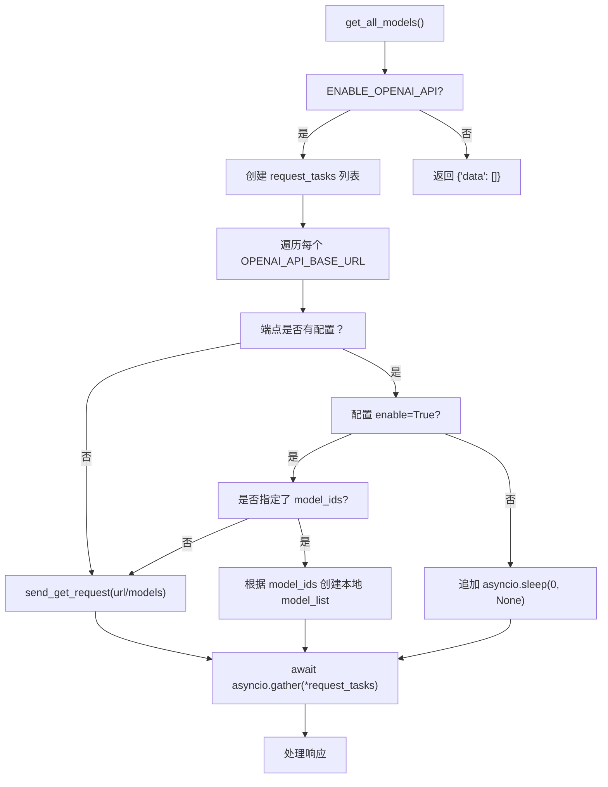
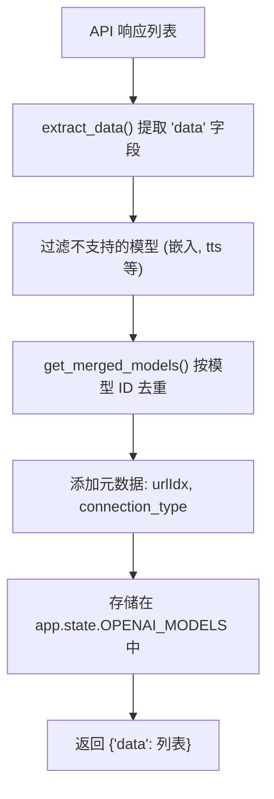
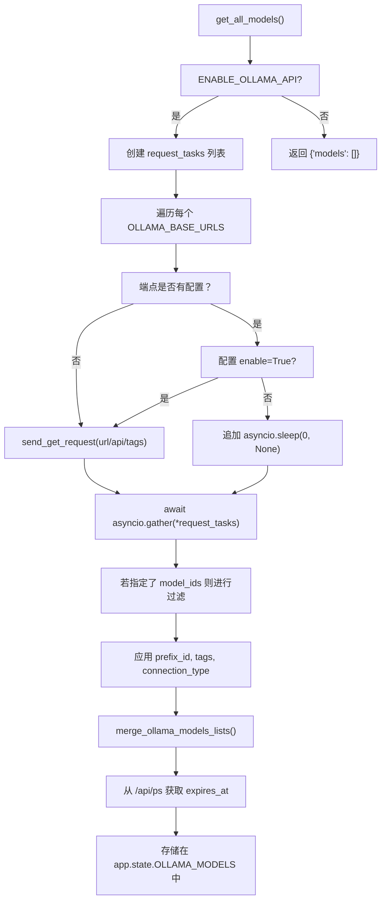
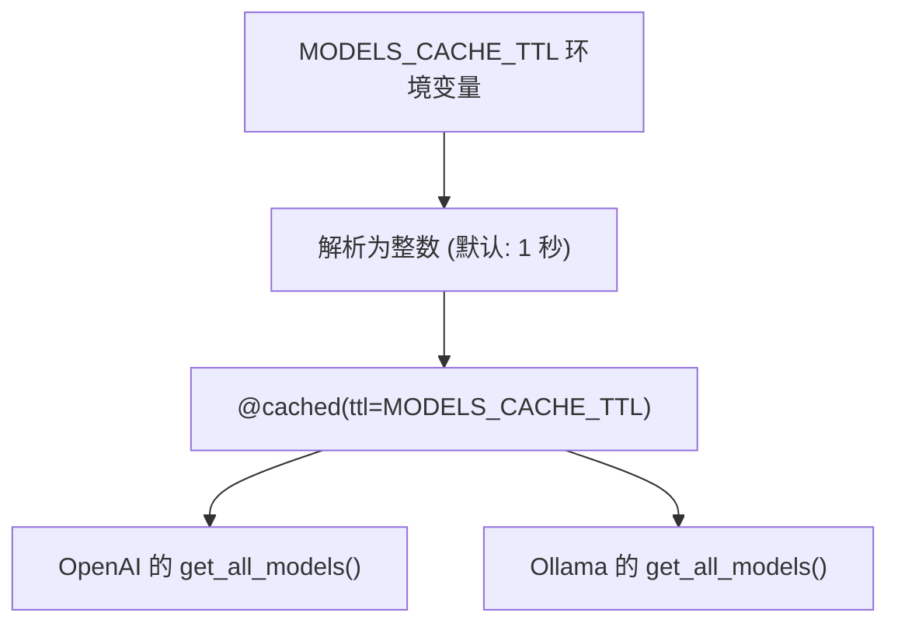
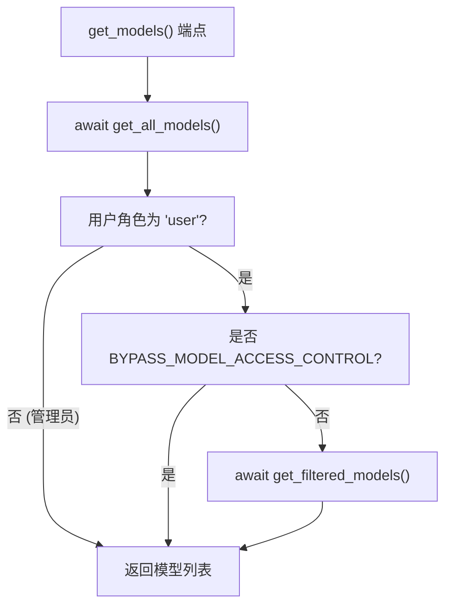
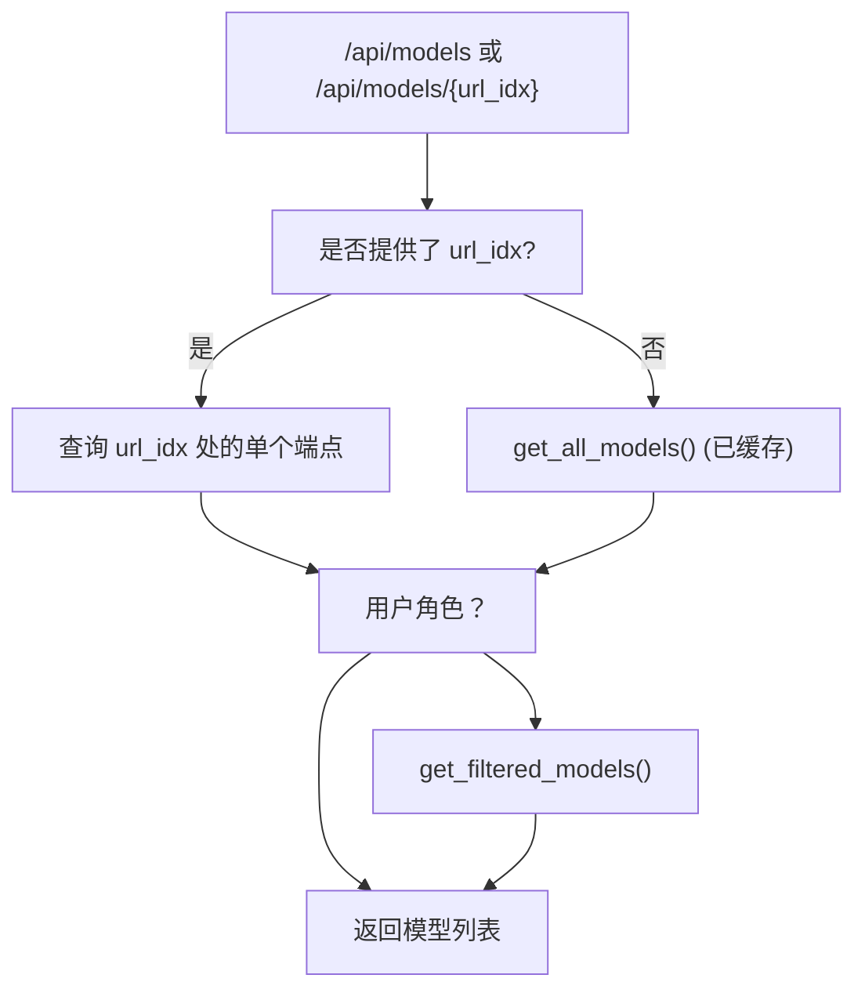

# 模型聚合

相关源文件

-   [backend/open\_webui/env.py](https://github.com/open-webui/open-webui/blob/a7271532/backend/open_webui/env.py)
-   [backend/open\_webui/routers/audio.py](https://github.com/open-webui/open-webui/blob/a7271532/backend/open_webui/routers/audio.py)
-   [backend/open\_webui/routers/auths.py](https://github.com/open-webui/open-webui/blob/a7271532/backend/open_webui/routers/auths.py)
-   [backend/open\_webui/routers/ollama.py](https://github.com/open-webui/open-webui/blob/a7271532/backend/open_webui/routers/ollama.py)
-   [backend/open\_webui/routers/openai.py](https://github.com/open-webui/open-webui/blob/a7271532/backend/open_webui/routers/openai.py)
-   [backend/open\_webui/utils/auth.py](https://github.com/open-webui/open-webui/blob/a7271532/backend/open_webui/utils/auth.py)
-   [backend/open\_webui/utils/embeddings.py](https://github.com/open-webui/open-webui/blob/a7271532/backend/open_webui/utils/embeddings.py)
-   [backend/open\_webui/utils/misc.py](https://github.com/open-webui/open-webui/blob/a7271532/backend/open_webui/utils/misc.py)
-   [backend/open\_webui/utils/oauth.py](https://github.com/open-webui/open-webui/blob/a7271532/backend/open_webui/utils/oauth.py)
-   [backend/open\_webui/utils/response.py](https://github.com/open-webui/open-webui/blob/a7271532/backend/open_webui/utils/response.py)

## 目的与范围

本文档描述了 Open WebUI 中的模型聚合系统。该系统查询多个 LLM 后端端点（包括兼容 OpenAI 的 API 和 Ollama 实例），将其模型目录合并为一个统一列表，并在应用适当的访问控制过滤后呈现给用户。该系统使 Open WebUI 能够作为来自不同来源模型的统一接口。

有关单个模型如何管理和配置的信息，请参阅 [模型访问控制](/open-webui/open-webui/13.4-model-access-control)。有关后端如何代理请求到特定模型的详情，请参阅 [OpenAI 集成](/open-webui/open-webui/13.3-openai-integration) 和 [Ollama 集成](/open-webui/open-webui/13.2-ollama-integration)。

## 系统概览

模型聚合系统执行以下功能：

1.  **并行查询**：向所有配置的后端端点发送并发请求。
2.  **响应处理**：从每个后端提取并规范化模型元数据。
3.  **合并**：合并模型列表，处理重复项并应用配置。
4.  **缓存**：存储聚合结果，并支持基于 TTL 的过期机制。
5.  **过滤**：在返回结果前应用特定于用户的访问控制。

OpenAI 兼容端点和 Ollama 端点的聚合是分开进行的，结果存储在不同的应用状态变量中。

**来源：** [backend/open\_webui/routers/openai.py343-536](https://github.com/open-webui/open-webui/blob/a7271532/backend/open_webui/routers/openai.py#L343-L536) [backend/open\_webui/routers/ollama.py306-421](https://github.com/open-webui/open-webui/blob/a7271532/backend/open_webui/routers/ollama.py#L306-L421)

## 配置结构

### 后端端点配置

OpenAI 和 Ollama 后端都维护着基准 URL 列表及相应的配置对象：

| 配置键 | OpenAI | Ollama | 用途 |
| --- | --- | --- | --- |
| 基准 URL | `OPENAI_API_BASE_URLS` | `OLLAMA_BASE_URLS` | 端点 URL 列表 |
| API 密钥 | `OPENAI_API_KEYS` | 不适用 (在配置中) | 每个端点的认证密钥 |
| 配置项 | `OPENAI_API_CONFIGS` | `OLLAMA_API_CONFIGS` | 每个端点的配置字典 |

### 按端点配置选项

`*_API_CONFIGS` 中的每个端点都以其索引（字符串形式）或旧版 URL 为键，并支持：

```json
{
    "enable": bool,           # 是否查询此端点
    "key": str,               # API 密钥 (仅限 Ollama，OpenAI 使用独立列表)
    "model_ids": list[str],   # 过滤器：仅包含这些模型
    "prefix_id": str,         # 为此端点的所有模型 ID 添加前缀
    "tags": list[str],        # 为所有模型添加标签
    "connection_type": str,   # "local", "external" 等
    "auth_type": str,         # 身份验证方法
    "azure": bool,            # Azure 特定处理
}
```
**来源：** [backend/open\_webui/routers/openai.py207-265](https://github.com/open-webui/open-webui/blob/a7271532/backend/open_webui/routers/openai.py#L207-L265) [backend/open\_webui/routers/ollama.py267-303](https://github.com/open-webui/open-webui/blob/a7271532/backend/open_webui/routers/ollama.py#L267-L303)

## OpenAI 模型聚合

### 请求分发


**来源：** [backend/open\_webui/routers/openai.py343-413](https://github.com/open-webui/open-webui/blob/a7271532/backend/open_webui/routers/openai.py#L343-L413)

[backend/open\_webui/routers/openai.py343-453](https://github.com/open-webui/open-webui/blob/a7271532/backend/open_webui/routers/openai.py#L343-L453) 中的 `get_all_models_responses()` 函数编排了并行请求：

1.  **任务创建**：为每个配置的 URL 创建以下任务之一：
    -   针对已启用且无显式 `model_ids` 的端点，创建 `send_get_request()` 任务。
    -   针对具有显式 `model_ids` 的端点，创建预构建的模型列表。
    -   针对已禁用的端点，创建无操作 (no-op) 的 sleep 任务。
2.  **并行执行**：使用 `asyncio.gather()` 并发执行所有任务，并应用 `AIOHTTP_CLIENT_TIMEOUT_MODEL_LIST` 超时限制。
3.  **后处理**：将端点特定配置（prefix\_id, tags, connection\_type）应用到响应中的每个模型。

### 模型合并与去重


**来源：** [backend/open\_webui/routers/openai.py473-536](https://github.com/open-webui/open-webui/blob/a7271532/backend/open_webui/routers/openai.py#L473-L536)

[backend/open\_webui/routers/openai.py503-530](https://github.com/open-webui/open-webui/blob/a7271532/backend/open_webui/routers/openai.py#L503-L530) 处的合并逻辑：

1.  **提取**：从每个响应中提取 `data` 数组，或直接处理列表形式的响应。
2.  **过滤**：针对 `api.openai.com` 端点，过滤掉包含 "babbage", "dall-e", "davinci", "embedding", "tts" 或 "whisper" 的模型。
3.  **去重**：维护一个以模型 ID 为键的字典；以首次出现的为准。
4.  **添加元数据**：添加 `urlIdx`（端点索引）、`connection_type`、`owned_by: "openai"`，并将原始响应保留在 `openai` 字段中。

### 缓存

`get_all_models()` 函数使用 `@cached()` 装饰器：

```python
@cached(
    ttl=MODELS_CACHE_TTL,
    key=lambda _, user: f"openai_all_models_{user.id}" if user else "openai_all_models",
)
async def get_all_models(request: Request, user: UserModel) -> dict[str, list]:
```
-   **TTL**：通过 `MODELS_CACHE_TTL` 环境变量配置（默认 1 秒）。
-   **缓存键**：按用户划分，以支持针对不同用户的过滤。
-   **后端**：使用 `aiocache` 库。

**来源：** [backend/open\_webui/routers/openai.py469-472](https://github.com/open-webui/open-webui/blob/a7271532/backend/open_webui/routers/openai.py#L469-L472) [backend/open\_webui/env.py546-553](https://github.com/open-webui/open-webui/blob/a7271532/backend/open_webui/env.py#L546-L553)

## Ollama 模型聚合

### 请求分发

Ollama 聚合遵循与 OpenAI 类似的模式，但使用 Ollama 特有的端点：


**来源：** [backend/open\_webui/routers/ollama.py323-421](https://github.com/open-webui/open-webui/blob/a7271532/backend/open_webui/routers/ollama.py#L323-L421)

与 OpenAI 聚合的关键区别：

1.  **端点**：查询 `/api/tags` 而非 `/models`。
2.  **模型过滤**：在 [backend/open\_webui/routers/ollama.py372-378](https://github.com/open-webui/open-webui/blob/a7271532/backend/open_webui/routers/ollama.py#L372-L378) 处在服务器端应用 `model_ids` 过滤。
3.  **已加载模型**：在 [backend/open\_webui/routers/ollama.py399-413](https://github.com/open-webui/open-webui/blob/a7271532/backend/open_webui/routers/ollama.py#L399-L413) 处查询 `/api/ps` 以获取已加载模型的 `expires_at` 时间戳。

### Ollama 特定的合并

```python
def merge_ollama_models_lists(model_lists):
    merged_models = {}
    for idx, model_list in enumerate(model_lists):
        if model_list is not None:
            for model in model_list:
                id = model.get("model")
                if id is not None:
                    if id not in merged_models:
                        model["urls"] = [idx]
                        merged_models[id] = model
                    else:
                        merged_models[id]["urls"].append(idx)
    return list(merged_models.values())
```
不同于 OpenAI（首次出现者胜出），Ollama 的追踪会维护一个 `urls` 列表，指示哪些后端索引提供了该模型。这实现了跨多个 Ollama 实例的负载均衡。

**来源：** [backend/open\_webui/routers/ollama.py306-320](https://github.com/open-webui/open-webui/blob/a7271532/backend/open_webui/routers/ollama.py#L306-L320)

## 缓存机制

### 缓存配置


**来源：** [backend/open\_webui/env.py546-553](https://github.com/open-webui/open-webui/blob/a7271532/backend/open_webui/env.py#L546-L553)

`MODELS_CACHE_TTL` 环境变量控制缓存时长：

-   **数值**：整数秒，或空字符串表示不缓存。
-   **默认值**：1 秒。
-   **按用户划分**：缓存键包含用户 ID，以支持针对用户的过滤。
-   **实现**：使用具有内存后端的 `aiocache` 库。

### 缓存失效

缓存条目在 TTL 到期后自动失效。手动失效发生在以下情况：

-   后端配置更改（URL、API 密钥、配置更新）。
-   用户权限更改（由按用户划分的缓存键处理）。

**来源：** [backend/open\_webui/routers/openai.py469-472](https://github.com/open-webui/open-webui/blob/a7271532/backend/open_webui/routers/openai.py#L469-L472) [backend/open\_webui/routers/ollama.py323-326](https://github.com/open-webui/open-webui/blob/a7271532/backend/open_webui/routers/ollama.py#L323-L326)

## 访问控制与过滤

### 用户级过滤


**来源：** [backend/open\_webui/routers/openai.py539-625](https://github.com/open-webui/open-webui/blob/a7271532/backend/open_webui/routers/openai.py#L539-L625) [backend/open\_webui/routers/ollama.py437-487](https://github.com/open-webui/open-webui/blob/a7271532/backend/open_webui/routers/ollama.py#L437-L487)

[backend/open\_webui/routers/openai.py456-466](https://github.com/open-webui/open-webui/blob/a7271532/backend/open_webui/routers/openai.py#L456-L466) 和 [backend/open\_webui/routers/ollama.py424-434](https://github.com/open-webui/open-webui/blob/a7271532/backend/open_webui/routers/ollama.py#L424-L434) 中的 `get_filtered_models()` 函数：

1.  **迭代**聚合列表中的所有模型。
2.  针对每个模型 ID **查询** `Models` 数据库表。
3.  **检查**用户是否为模型所有者，或是否通过 `has_access()` 拥有读取权限。
4.  **返回**仅通过访问检查的模型。

[backend/open\_webui/env.py438-440](https://github.com/open-webui/open-webui/blob/a7271532/backend/open_webui/env.py#L438-L440) 中的 `BYPASS_MODEL_ACCESS_CONTROL` 环境变量可完全禁用此过滤。

### 模型数据库集成

```python
model_info = Models.get_model_by_id(model["id"])
if model_info:
    if user.id == model_info.user_id or has_access(
        user.id, type="read", access_control=model_info.access_control
    ):
        filtered_models.append(model)
```
数据库中未找到的模型将从结果中排除。这允许管理员通过模型管理界面控制模型的可见性。

**来源：** [backend/open\_webui/routers/openai.py456-466](https://github.com/open-webui/open-webui/blob/a7271532/backend/open_webui/routers/openai.py#L456-L466) [backend/open\_webui/utils/access\_control.py](https://github.com/open-webui/open-webui/blob/a7271532/backend/open_webui/utils/access_control.py)

## 模型存储与状态

### 应用状态变量

聚合后的模型存储在 FastAPI 应用状态中：

| 状态变量 | 类型 | 填充者 | 格式 |
| --- | --- | --- | --- |
| `app.state.OPENAI_MODELS` | `dict` | `get_all_models()` (OpenAI) | `{model_id: model_dict}` |
| `app.state.OLLAMA_MODELS` | `dict` | `get_all_models()` (Ollama) | `{model_id: model_dict}` |
| `app.state.MODELS` | `dict` | 由路由器合并 | `{model_id: model_dict}` |

聚合函数在以下位置填充这些变量：

-   [backend/open\_webui/routers/openai.py535](https://github.com/open-webui/open-webui/blob/a7271532/backend/open_webui/routers/openai.py#L535-L535) - `request.app.state.OPENAI_MODELS = models`
-   [backend/open\_webui/routers/ollama.py418-420](https://github.com/open-webui/open-webui/blob/a7271532/backend/open_webui/routers/ollama.py#L418-L420) - `request.app.state.OLLAMA_MODELS = {...}`

### 模型对象结构

**OpenAI 模型：**

```json
{
  "id": "gpt-4",
  "name": "gpt-4",
  "owned_by": "openai",
  "openai": { /* 原始响应 */ },
  "connection_type": "external",
  "urlIdx": 0,
  "tags": ["production"]
}
```
**Ollama 模型：**

```json
{
  "model": "llama2",
  "name": "llama2",
  "urls": [0, 1],
  "connection_type": "local",
  "tags": ["local"],
  "expires_at": 1704657600
}
```
**来源：** [backend/open\_webui/routers/openai.py521-528](https://github.com/open-webui/open-webui/blob/a7271532/backend/open_webui/routers/openai.py#L521-L528) [backend/open\_webui/routers/ollama.py306-320](https://github.com/open-webui/open-webui/blob/a7271532/backend/open_webui/routers/ollama.py#L306-L320)

## 请求流程

### 完整聚合流程

> **[Mermaid sequence]**
> *(图表结构无法解析)*

**来源：** [backend/open\_webui/routers/openai.py539-625](https://github.com/open-webui/open-webui/blob/a7271532/backend/open_webui/routers/openai.py#L539-L625) [backend/open\_webui/routers/ollama.py437-487](https://github.com/open-webui/open-webui/blob/a7271532/backend/open_webui/routers/ollama.py#L437-L487)

### 端点特定请求流程


**来源：** [backend/open\_webui/routers/openai.py539-625](https://github.com/open-webui/open-webui/blob/a7271532/backend/open_webui/routers/openai.py#L539-L625) [backend/open\_webui/routers/ollama.py437-487](https://github.com/open-webui/open-webui/blob/a7271532/backend/open_webui/routers/ollama.py#L437-L487)

当提供了 `url_idx` 时，系统仅查询该特定后端端点，绕过聚合和缓存。这用于测试单个端点的连通性并检索端点特定的模型元数据。

## 配置更新

### 动态配置

后端配置可以在运行时通过管理员端点更新：

**OpenAI**：[backend/open\_webui/routers/openai.py224-265](https://github.com/open-webui/open-webui/blob/a7271532/backend/open_webui/routers/openai.py#L224-L265) 处的 `POST /api/openai/config/update`
**Ollama**：[backend/open\_webui/routers/ollama.py282-303](https://github.com/open-webui/open-webui/blob/a7271532/backend/open_webui/routers/ollama.py#L282-L303) 处的 `POST /api/ollama/config/update`

更新将持久化到应用的配置系统中，并立即对新请求生效。已缓存的模型列表将继续提供服务直到 TTL 过期。

### 端点验证

在添加或更新端点之前，管理员可以验证连通性：

**OpenAI**：[backend/open\_webui/routers/openai.py635-691](https://github.com/open-webui/open-webui/blob/a7271532/backend/open_webui/routers/openai.py#L635-L691) 处的 `POST /api/openai/verify`
**Ollama**：[backend/open\_webui/routers/ollama.py222-264](https://github.com/open-webui/open-webui/blob/a7271532/backend/open_webui/routers/ollama.py#L222-L264) 处的 `POST /api/ollama/verify`

这些端点测试身份验证和连通性，而不会修改配置。

**来源：** [backend/open\_webui/routers/openai.py635-691](https://github.com/open-webui/open-webui/blob/a7271532/backend/open_webui/routers/openai.py#L635-L691) [backend/open\_webui/routers/ollama.py222-264](https://github.com/open-webui/open-webui/blob/a7271532/backend/open_webui/routers/ollama.py#L222-L264)

## 性能考量

### 并发请求处理

```python
request_tasks = []
for idx, url in enumerate(config.OPENAI_API_BASE_URLS):
    request_tasks.append(send_get_request(f"{url}/models", key))

responses = await asyncio.gather(*request_tasks)
```
系统使用 `asyncio.gather()` 并发发出所有后端请求，最大限度地减少了总延迟。如果有 10 个后端，聚合时间将从顺序求和减少到最慢的单个响应时间。

### 超时配置

-   **模型列表请求**：[backend/open\_webui/env.py685-696](https://github.com/open-webui/open-webui/blob/a7271532/backend/open_webui/env.py#L685-L696) 处的 `AIOHTTP_CLIENT_TIMEOUT_MODEL_LIST` (默认 10 秒)。
-   **常规请求**：[backend/open\_webui/env.py670-678](https://github.com/open-webui/open-webui/blob/a7271532/backend/open_webui/env.py#L670-L678) 处的 `AIOHTTP_CLIENT_TIMEOUT` (默认 300 秒)。

失败或超时的请求返回 `None`，并在合并期间被过滤掉。

### 缓存优化

将 `MODELS_CACHE_TTL` 设置为较高的值（例如 60 秒）可以减轻后端负载，但代价是模型更改的传播会产生延迟。对于模型目录稳定的生产部署，建议设置为 30-300 秒。

**来源：** [backend/open\_webui/env.py546-553](https://github.com/open-webui/open-webui/blob/a7271532/backend/open_webui/env.py#L546-L553) [backend/open\_webui/env.py685-696](https://github.com/open-webui/open-webui/blob/a7271532/backend/open_webui/env.py#L685-L696)
