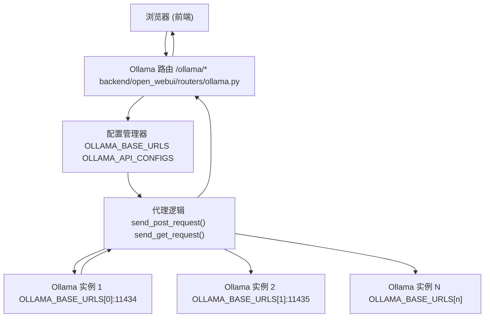
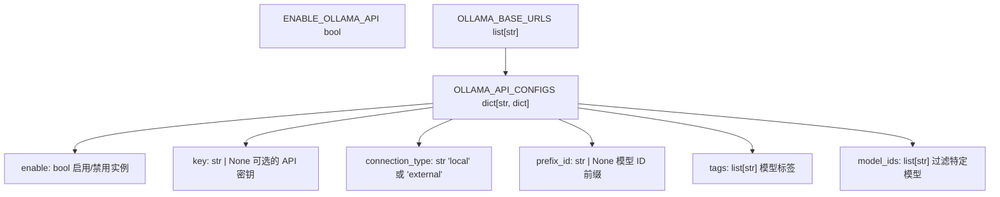
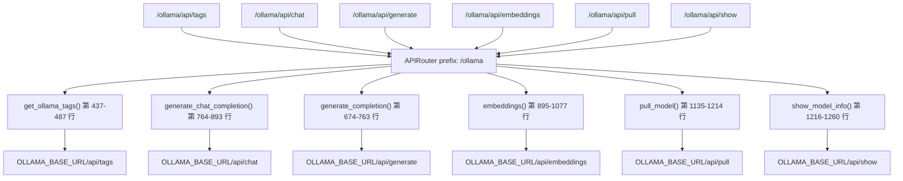
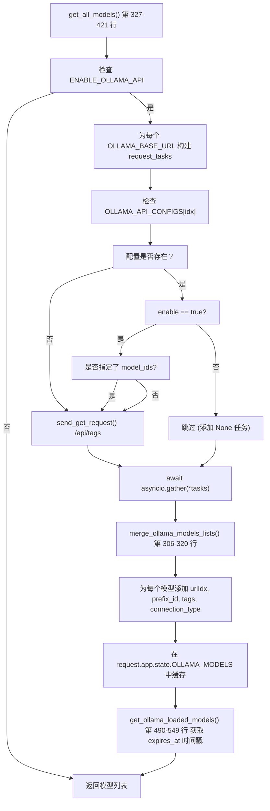
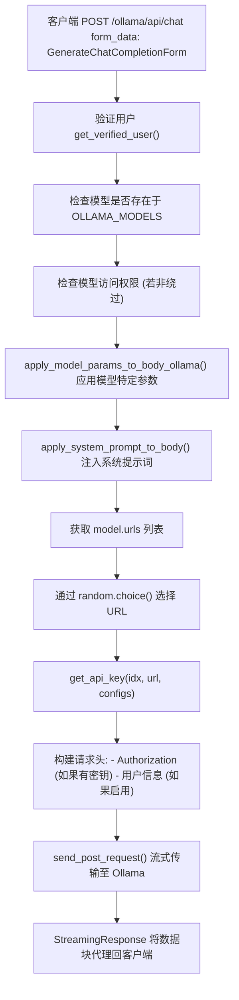
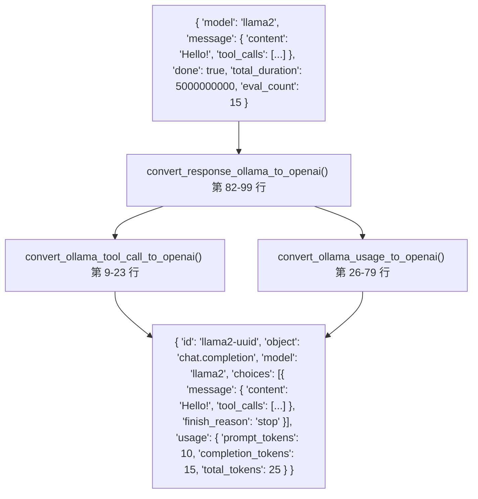
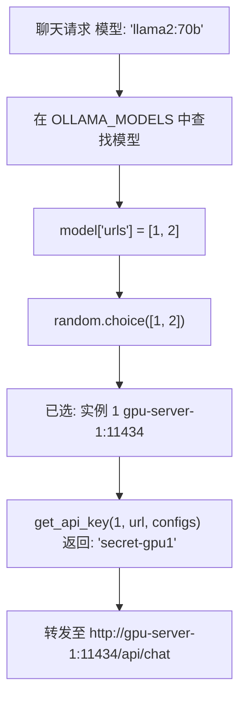

# Ollama 集成

相关源文件

-   [LICENSE](https://github.com/open-webui/open-webui/blob/a7271532/LICENSE)
-   [README.md](https://github.com/open-webui/open-webui/blob/a7271532/README.md)
-   [TROUBLESHOOTING.md](https://github.com/open-webui/open-webui/blob/a7271532/TROUBLESHOOTING.md)
-   [backend/open_webui/env.py](https://github.com/open-webui/open-webui/blob/a7271532/backend/open_webui/env.py)
-   [backend/open_webui/routers/audio.py](https://github.com/open-webui/open-webui/blob/a7271532/backend/open_webui/routers/audio.py)
-   [backend/open_webui/routers/auths.py](https://github.com/open-webui/open-webui/blob/a7271532/backend/open_webui/routers/auths.py)
-   [backend/open_webui/routers/ollama.py](https://github.com/open-webui/open-webui/blob/a7271532/backend/open_webui/routers/ollama.py)
-   [backend/open_webui/routers/openai.py](https://github.com/open-webui/open-webui/blob/a7271532/backend/open_webui/routers/openai.py)
-   [backend/open_webui/utils/auth.py](https://github.com/open-webui/open-webui/blob/a7271532/backend/open_webui/utils/auth.py)
-   [backend/open_webui/utils/embeddings.py](https://github.com/open-webui/open-webui/blob/a7271532/backend/open_webui/utils/embeddings.py)
-   [backend/open_webui/utils/misc.py](https://github.com/open-webui/open-webui/blob/a7271532/backend/open_webui/utils/misc.py)
-   [backend/open_webui/utils/oauth.py](https://github.com/open-webui/open-webui/blob/a7271532/backend/open_webui/utils/oauth.py)
-   [backend/open_webui/utils/response.py](https://github.com/open-webui/open-webui/blob/a7271532/backend/open_webui/utils/response.py)
-   [docs/apache.md](https://github.com/open-webui/open-webui/blob/a7271532/docs/apache.md)
-   [src/lib/components/chat/Settings/About.svelte](https://github.com/open-webui/open-webui/blob/a7271532/src/lib/components/chat/Settings/About.svelte)
-   [src/lib/constants.ts](https://github.com/open-webui/open-webui/blob/a7271532/src/lib/constants.ts)

## 目的与范围

本文档涵盖了 Open WebUI 与 Ollama 服务器的集成，包括代理架构、配置选项和模型管理能力。Open WebUI 作为一个反向代理，位于前端客户端与一个或多个 Ollama 服务器实例之间，提供了身份验证、负载均衡、响应格式转换以及集中式模型访问控制等功能。

有关 OpenAI 集成的信息，请参阅 [OpenAI 集成](/open-webui/open-webui/13.3-openai-integration)。有关模型访问控制特性，请参阅 [模型访问控制](/open-webui/open-webui/13.4-model-access-control)。有关聚合来自多个提供者的模型，请参阅 [模型聚合](/open-webui/open-webui/13.1-model-aggregation)。

---

## 代理架构

Open WebUI 为 Ollama API 请求实现了后端代理，提供了安全性、CORS 解析和增强功能。


**关键设计原则：**

1.  **间接访问**：前端从不直接联系 Ollama 服务器。所有请求都通过 Open WebUI 后端的 `/ollama` 路由进行。
2.  **URL 重写**：发送到 `/ollama/api/tags` 的请求在后端转换为 `OLLAMA_BASE_URL/api/tags`。
3.  **安全层**：在转发请求前，在代理层级强制执行身份验证。
4.  **CORS 解析**：由于前端仅与其自身源通信，后端代理消除了跨域问题。

**来源：** [README.md7-8](https://github.com/open-webui/open-webui/blob/a7271532/README.md#L7-L8) [TROUBLESHOOTING.md3-9](https://github.com/open-webui/open-webui/blob/a7271532/TROUBLESHOOTING.md#L3-L9) [backend/open_webui/routers/ollama.py1-265](https://github.com/open-webui/open-webui/blob/a7271532/backend/open_webui/routers/ollama.py#L1-L265)

---

## 配置

### 环境变量

Ollama 集成的主要配置机制使用 `backend/open_webui/env.py` 中定义的环境变量。

**OLLAMA_BASE_URL** (旧版，单实例)：

```text
OLLAMA_BASE_URL=http://localhost:11434
```
**OLLAMA_BASE_URLS** (现代，多实例)：

```text
# 不直接设置；通过管理员 UI 或 API 配置
```
`OLLAMA_BASE_URLS` 是一个通过应用程序配置系统管理并使用 `AppConfig` 持久化存储在数据库中的列表。

**来源：** [backend/open_webui/env.py1-889](https://github.com/open-webui/open-webui/blob/a7271532/backend/open_webui/env.py#L1-L889) [README.md122-133](https://github.com/open-webui/open-webui/blob/a7271532/README.md#L122-L133)

### 配置数据结构


**配置访问模式：**

```python
# 获取索引为 idx 的实例配置
url = request.app.state.config.OLLAMA_BASE_URLS[idx]
api_config = request.app.state.config.OLLAMA_API_CONFIGS.get(
    str(idx),  # 以字符串索引为键
    request.app.state.config.OLLAMA_API_CONFIGS.get(url, {})  # 旧版：以 URL 为键
)

enable = api_config.get("enable", True)
key = api_config.get("key", None)
connection_type = api_config.get("connection_type", "local")
prefix_id = api_config.get("prefix_id", None)
model_ids = api_config.get("model_ids", [])
```
**来源：** [backend/open_webui/routers/ollama.py267-303](https://github.com/open-webui/open-webui/blob/a7271532/backend/open_webui/routers/ollama.py#L267-L303) [backend/open_webui/routers/ollama.py328-353](https://github.com/open-webui/open-webui/blob/a7271532/backend/open_webui/routers/ollama.py#L328-L353)

### 管理员配置端点

**GET /ollama/config**

```json
{
  "ENABLE_OLLAMA_API": true,
  "OLLAMA_BASE_URLS": ["http://localhost:11434", "http://gpu-server:11434"],
  "OLLAMA_API_CONFIGS": {
    "0": {
      "enable": true,
      "key": null,
      "connection_type": "local",
      "prefix_id": null,
      "tags": [],
      "model_ids": []
    },
    "1": {
      "enable": true,
      "key": "secret-key-123",
      "connection_type": "external",
      "prefix_id": "gpu",
      "tags": ["gpu", "production"],
      "model_ids": ["llama2:latest", "mistral:latest"]
    }
  }
}
```
**POST /ollama/config/update**

更新具有相同结构的配置。仅管理员用户可访问。

**来源：** [backend/open_webui/routers/ollama.py267-303](https://github.com/open-webui/open-webui/blob/a7271532/backend/open_webui/routers/ollama.py#L267-L303)

---

## API 路由与代理行为

Ollama 路由器挂载在 `/ollama` 下，提供了对所有 Ollama API 端点的代理访问。


### 核心路由分类

| 路由模式 | 处理器函数 | 用途 |
| --- | --- | --- |
| `GET /api/tags` | `get_ollama_tags()` | 列出可用模型 |
| `GET /api/ps` | `get_ollama_loaded_models()` | 列出当前已加载的模型 |
| `GET /api/version` | `get_ollama_versions()` | 获取 Ollama 版本信息 |
| `POST /api/generate` | `generate_completion()` | 文本补全 (非聊天) |
| `POST /api/chat` | `generate_chat_completion()` | 聊天补全 |
| `POST /api/embeddings` | `embeddings()` | 生成嵌入 |
| `POST /api/pull` | `pull_model()` | 下载模型 |
| `POST /api/push` | `push_model()` | 上传模型到注册表 |
| `POST /api/create` | `create_model()` | 从 Modelfile 创建模型 |
| `POST /api/copy` | `copy_model()` | 复制/重命名模型 |
| `DELETE /api/delete` | `delete_model()` | 删除模型 |
| `POST /api/show` | `show_model_info()` | 获取模型详情 |

**来源：** [backend/open_webui/routers/ollama.py437-1260](https://github.com/open-webui/open-webui/blob/a7271532/backend/open_webui/routers/ollama.py#L437-L1260)

### 请求转发逻辑

> **[Mermaid sequence]**
> *(图表结构无法解析)*

**关键实现细节：**

1.  **URL 选择**：模型元数据中的 `urlIdx` 或 `urls` 字段决定使用哪个 Ollama 实例。如果多个 URL 可用，则使用 `random.choice()` 进行基础负载均衡。
2.  **API 密钥身份验证**：如果已配置，代理在转发至 Ollama 时会添加 `Authorization: Bearer {key}` 请求头。
3.  **用户信息请求头**：当 `ENABLE_FORWARD_USER_INFO_HEADERS=true` 时，代理在转发请求中包含用户身份标识头。
4.  **流式传输支持**：对于生成端点，使用 `StreamingResponse` 将响应流式传回客户端。

**来源：** [backend/open_webui/routers/ollama.py113-192](https://github.com/open-webui/open-webui/blob/a7271532/backend/open_webui/routers/ollama.py#L113-L192) [backend/open_webui/routers/ollama.py764-893](https://github.com/open-webui/open-webui/blob/a7271532/backend/open_webui/routers/ollama.py#L764-L893)

---

## 模型管理

### 模型发现与聚合


**merge_ollama_models_lists() 算法：**

该函数合并来自多个 Ollama 实例的模型，追踪哪些实例拥有该模型：

```text
# 输入: [response1, response2, ...]
# 每个响应: {"models": [{"model": "llama2:latest", ...}, ...]}

# 输出: 单个列表，每个模型带有 "urls" 字段
# {"model": "llama2:latest", "urls": [0, 2], ...}  # 在实例 0 和 2 上可用
```
这使得 Open WebUI 能够：

1.  显示所有实例中可用的模型。
2.  将请求路由到拥有请求模型的实例。
3.  当多个实例拥有相同模型时实现基础负载均衡。

**来源：** [backend/open_webui/routers/ollama.py306-421](https://github.com/open-webui/open-webui/blob/a7271532/backend/open_webui/routers/ollama.py#L306-L421)

### 模型元数据增强

从 Ollama 实例检索模型后，代理会使用 Open WebUI 特有的字段丰富模型元数据：

| 字段 | 用途 | 来源 |
| --- | --- | --- |
| `urlIdx` | 原始实例索引 | 在合并期间设置 |
| `urls` | 实例索引列表 | 由 `merge_ollama_models_lists()` 填充 |
| `connection_type` | "local" 或 "external" | 来自 `OLLAMA_API_CONFIGS[idx]` |
| `prefix_id` | 命名空间前缀 | 来自 `OLLAMA_API_CONFIGS[idx]` |
| `tags` | 额外分类 | 来自 `OLLAMA_API_CONFIGS[idx]` |
| `expires_at` | 模型驱逐时间戳 | 来自 `/api/ps` 端点 |

**前缀 ID 示例：**

如果 `OLLAMA_API_CONFIGS["1"]["prefix_id"] = "gpu"`，那么来自实例 1 的模型 `llama2:latest` 在聚合列表中变为 `gpu.llama2:latest`。这允许区分运行在不同硬件上的相同模型。

**来源：** [backend/open_webui/routers/ollama.py356-414](https://github.com/open-webui/open-webui/blob/a7271532/backend/open_webui/routers/ollama.py#L356-L414)

### 模型操作

**模型拉取 (下载)**

路由：`POST /ollama/api/pull`

> **[Mermaid sequence]**
> *(图表结构无法解析)*

**模型删除**

路由：`DELETE /ollama/api/delete`

从指定的 Ollama 实例中删除模型。如果模型存在于多个实例（通过 `urls` 字段追踪），则删除操作仅从选定的实例中移除。

**模型展示 (元数据)**

路由：`POST /ollama/api/show`

返回详细的模型信息，包括：

-   模型架构
-   参数
-   模板
-   系统提示词
-   Modelfile 内容

**来源：** [backend/open_webui/routers/ollama.py1135-1260](https://github.com/open-webui/open-webui/blob/a7271532/backend/open_webui/routers/ollama.py#L1135-L1260)

---

## 生成请求流程

### 聊天补全处理


**apply_model_params_to_body_ollama() 函数：**

位于 `backend/open_webui/utils/payload.py`，该函数将 Open WebUI 的模型配置覆盖应用到请求载荷中。它处理如下参数：

-   `temperature`
-   `top_p`, `top_k`
-   `num_predict` (最大 token 数)
-   `stop` 序列
-   `num_ctx` (上下文窗口)

**来源：** [backend/open_webui/routers/ollama.py764-893](https://github.com/open-webui/open-webui/blob/a7271532/backend/open_webui/routers/ollama.py#L764-L893) [backend/open_webui/routers/ollama.py194-199](https://github.com/open-webui/open-webui/blob/a7271532/backend/open_webui/routers/ollama.py#L194-L199)

### 嵌入生成

路由：`POST /ollama/api/embeddings`

```python
class GenerateEmbeddingsForm(BaseModel):
    model: str
    prompt: Optional[str] = None
    input: Optional[Union[str, list[str]]] = None  # 支持批处理
    options: Optional[dict] = None
    keep_alive: Optional[Union[int, str]] = None
    truncate: Optional[bool] = None
```
**批处理：**

当 `input` 是列表时，Ollama 处理每一项并返回 `{"embeddings": [...]}`。Open WebUI 通过 `convert_embedding_response_ollama_to_openai()` 将其转换为 OpenAI 兼容格式。

**来源：** [backend/open_webui/routers/ollama.py895-1077](https://github.com/open-webui/open-webui/blob/a7271532/backend/open_webui/routers/ollama.py#L895-L1077) [backend/open_webui/utils/response.py131-189](https://github.com/open-webui/open-webui/blob/a7271532/backend/open_webui/utils/response.py#L131-L189)

---

## 响应格式转换

Open WebUI 将 Ollama 的原生响应格式转换为 OpenAI 兼容格式，以实现一致的客户端处理。

### 聊天补全转换


**用量指标转换：**

Ollama 提供纳秒级的计时数据：

-   `total_duration`：请求总时长
-   `load_duration`：模型加载时长
-   `prompt_eval_duration`：提示词处理时长
-   `eval_duration`：生成时长
-   `prompt_eval_count`：输入 token 数
-   `eval_count`：输出 token 数

这些数据被转换为 OpenAI 格式：

-   `prompt_tokens`：对应 `prompt_eval_count`
-   `completion_tokens`：对应 `eval_count`
-   `total_tokens`：上述两者之和
-   此外还有自定义字段，如 `response_token/s`, `prompt_token/s`

**来源：** [backend/open_webui/utils/response.py1-129](https://github.com/open-webui/open-webui/blob/a7271532/backend/open_webui/utils/response.py#L1-L129)

### 流式转换

```python
async def convert_streaming_response_ollama_to_openai(ollama_streaming_response):
    async for data in ollama_streaming_response.body_iterator:
        data = json.loads(data)

        # 提取内容并转换格式
        model = data.get("model", "ollama")
        message_content = data.get("message", {}).get("content", None)
        tool_calls = data.get("message", {}).get("tool_calls", None)

        # 转换为 OpenAI 块格式
        data = openai_chat_chunk_message_template(model, message_content, ...)

        line = f"data: {json.dumps(data)}\n\n"
        yield line

    yield "data: [DONE]\n\n"
```
每一个 Ollama 流式数据块都被包装在带有 `data:` 前缀和换行符的 OpenAI SSE 格式中。

**来源：** [backend/open_webui/utils/response.py102-128](https://github.com/open-webui/open-webui/blob/a7271532/backend/open_webui/utils/response.py#L102-L128)

---

## 多实例支持与负载均衡

### 配置示例

```json
{
  "OLLAMA_BASE_URLS": [
    "http://localhost:11434",
    "http://gpu-server-1:11434",
    "http://gpu-server-2:11434"
  ],
  "OLLAMA_API_CONFIGS": {
    "0": {
      "enable": true,
      "connection_type": "local",
      "tags": ["cpu", "dev"]
    },
    "1": {
      "enable": true,
      "key": "secret-gpu1",
      "connection_type": "external",
      "prefix_id": "gpu1",
      "tags": ["gpu", "production"],
      "model_ids": ["llama2:70b", "mixtral:8x7b"]
    },
    "2": {
      "enable": true,
      "key": "secret-gpu2",
      "connection_type": "external",
      "prefix_id": "gpu2",
      "tags": ["gpu", "production"],
      "model_ids": ["llama2:70b", "codellama:34b"]
    }
  }
}
```
### 负载均衡策略


**局限性：**

当前的实现使用 `random.choice()` 进行负载均衡，这具有以下不足：

-   未考虑实例负载。
-   未考虑模型内存占用。
-   未追踪响应时间。
-   可能导致分布不均。

代码中包含一条 TODO 注释，建议未来实现更复杂的算法，如加权轮询 (weighted round-robin)、最小连接数 (least connections) 或最短响应时间。

**来源：** [backend/open_webui/routers/ollama.py1-3](https://github.com/open-webui/open-webui/blob/a7271532/backend/open_webui/routers/ollama.py#L1-L3) [backend/open_webui/routers/ollama.py764-893](https://github.com/open-webui/open-webui/blob/a7271532/backend/open_webui/routers/ollama.py#L764-L893)

---

## 身份验证与安全

### API 密钥身份验证

配置了 `OLLAMA_API_CONFIGS[idx]["key"]` 后，代理会向转发的请求添加认证信息：

```python
def get_api_key(idx, url, configs):
    parsed_url = urlparse(url)
    base_url = f"{parsed_url.scheme}://{parsed_url.netloc}"
    return configs.get(str(idx), configs.get(base_url, {})).get("key", None)

# 在请求转发中：
key = get_api_key(url_idx, url, OLLAMA_API_CONFIGS)
headers = {
    "Content-Type": "application/json",
    **({"Authorization": f"Bearer {key}"} if key else {{}})
}
```
这允许为支持身份验证的 Ollama 实例提供安全保障，同时保持对不支持该功能的实例的向后兼容。

**来源：** [backend/open_webui/routers/ollama.py194-199](https://github.com/open-webui/open-webui/blob/a7271532/backend/open_webui/routers/ollama.py#L194-L199)

### 用户信息转发

当 `ENABLE_FORWARD_USER_INFO_HEADERS=true` 时，代理在转发请求中包含用户身份标识：

```python
if ENABLE_FORWARD_USER_INFO_HEADERS and user:
    headers = include_user_info_headers(headers, user)
    if metadata and metadata.get("chat_id"):
        headers["X-OpenWebUI-Chat-Id"] = metadata.get("chat_id")
```
这实现了：

-   Ollama 服务器端记录每个请求是由哪个 Open WebUI 用户发出的。
-   未来可能实现的 Ollama 层级单用户速率限制。
-   将 Ollama 日志链接到 Open WebUI 用户的审计追踪。

**来源：** [backend/open_webui/routers/ollama.py88-90](https://github.com/open-webui/open-webui/blob/a7271532/backend/open_webui/routers/ollama.py#L88-L90) [backend/open_webui/routers/ollama.py134-137](https://github.com/open-webui/open-webui/blob/a7271532/backend/open_webui/routers/ollama.py#L134-L137)

### 连接验证

路由：`POST /ollama/verify`

仅限管理员的端点，在将 Ollama 实例添加到配置前测试其连通性：

```python
@router.post("/verify")
async def verify_connection(form_data: ConnectionVerificationForm, user=Depends(get_admin_user)):
    async with session.get(f"{url}/api/version", headers=headers) as r:
        if r.status != 200:
            raise Exception(f"HTTP Error: {r.status}")
        return await r.json()
```
成功后返回 Ollama 版本信息，允许管理员在保存前验证配置。

**来源：** [backend/open_webui/routers/ollama.py222-264](https://github.com/open-webui/open-webui/blob/a7271532/backend/open_webui/routers/ollama.py#L222-L264)

---

## 缓存策略

### 模型列表缓存

模型列表通过 `@cached` 装饰器进行缓存，TTL（过期时间）取自 `MODELS_CACHE_TTL` 环境变量：

```python
@cached(
    ttl=MODELS_CACHE_TTL,
    key=lambda _, user: f"ollama_all_models_{user.id}" if user else "ollama_all_models",
)
async def get_all_models(request: Request, user: UserModel = None):
    # 获取并合并来自所有实例的模型
    ...
```
**缓存失效：**

缓存是用户特定的，以遵循单用户模型访问控制。启用访问控制时，缓存键包含用户 ID。

**默认 TTL：**

```python
MODELS_CACHE_TTL = os.environ.get("MODELS_CACHE_TTL", "1")  # 默认 1 秒
```
这种较短的默认 TTL 确保了模型可用性更新能快速传播，同时减轻了重复请求产生的压力。

**来源：** [backend/open_webui/env.py546-553](https://github.com/open-webui/open-webui/blob/a7271532/backend/open_webui/env.py#L546-L553) [backend/open_webui/routers/ollama.py323-326](https://github.com/open-webui/open-webui/blob/a7271532/backend/open_webui/routers/ollama.py#L323-L326)

### 状态存储

处理后的模型数据存储在应用状态中以便快速访问：

```python
request.app.state.OLLAMA_MODELS = {
    model["model"]: model for model in models["models"]
}
```
该字典允许在将请求路由到适当 Ollama 实例时，通过模型 ID 进行 O(1) 复杂度的查找。

**来源：** [backend/open_webui/routers/ollama.py418-420](https://github.com/open-webui/open-webui/blob/a7271532/backend/open_webui/routers/ollama.py#L418-L420)

---

## 故障排除

### 常见连接问题

**问题：“服务器连接错误” (Server Connection Error)**

原因：Open WebUI 容器无法连接到配置的 `OLLAMA_BASE_URL` 处的 Ollama。

解决方法：

1.  **使用宿主机网络** (Docker)：

    ```bash
    docker run -d --network=host -v open-webui:/app/backend/data \
      -e OLLAMA_BASE_URL=http://127.0.0.1:11434 \
      --name open-webui --restart always ghcr.io/open-webui/open-webui:main
    ```

    注意：使用宿主机网络后，端口从 3000 变为 8080。

2.  **使用 host.docker.internal** (Docker Desktop)：

    ```bash
    docker run -d -p 3000:8080 \
      --add-host=host.docker.internal:host-gateway \
      -v open-webui:/app/backend/data \
      --name open-webui --restart always ghcr.io/open-webui/open-webui:main
    ```

3.  **正确的 URL 格式**：确保 URL 包含协议头：

    -   ✅ `http://192.168.1.100:11434`
    -   ❌ `192.168.1.100:11434`
    -   ❌ `localhost:11434`

**来源：** [README.md181-189](https://github.com/open-webui/open-webui/blob/a7271532/README.md#L181-L189) [TROUBLESHOOTING.md12-20](https://github.com/open-webui/open-webui/blob/a7271532/TROUBLESHOOTING.md#L12-L20)

### 超时配置

**问题：模型响应慢导致超时**

默认超时时间为 5 分钟 (300 秒)。对于大型模型或复杂提示词，可以通过以下方式增加超时：

```bash
AIOHTTP_CLIENT_TIMEOUT=600  # 10 分钟
```
**来源：** [TROUBLESHOOTING.md22-23](https://github.com/open-webui/open-webui/blob/a7271532/TROUBLESHOOTING.md#L22-L23) [backend/open_webui/env.py670-678](https://github.com/open-webui/open-webui/blob/a7271532/backend/open_webui/env.py#L670-L678)

### 版本兼容性

Open WebUI 要求 Ollama 版本为 0.1.16 或更高。检查兼容性：

```bash
# 从 Open WebUI UI 查看：设置 > 关于 > Ollama 版本
# 或通过 API 检查：
curl http://localhost:11434/api/version
```
**来源：** [src/lib/constants.ts18](https://github.com/open-webui/open-webui/blob/a7271532/src/lib/constants.ts#L18-L18) [src/lib/components/chat/Settings/About.svelte37-39](https://github.com/open-webui/open-webui/blob/a7271532/src/lib/components/chat/Settings/About.svelte#L37-L39)

### 代理配置

当部署在 Apache/Nginx 反向代理之后时：

```nginx
ProxyPass / http://server.com:3000/ nocanon
ProxyPassReverse / http://server.com:3000/
# WebSocket 支持所需 (v0.5+)
ProxyPass / ws://server.com:3000/ nocanon
ProxyPassReverse / ws://server.com:3000/
```
Ollama 服务器自身也需要正确的网络配置：

```ini
[Service]
Environment="OLLAMA_HOST=0.0.0.0:11434"
Environment="OLLAMA_ORIGINS=http://192.168.1.106:11434,https://models.server.city"
```
**来源：** [docs/apache.md1-206](https://github.com/open-webui/open-webui/blob/a7271532/docs/apache.md#L1-L206)
