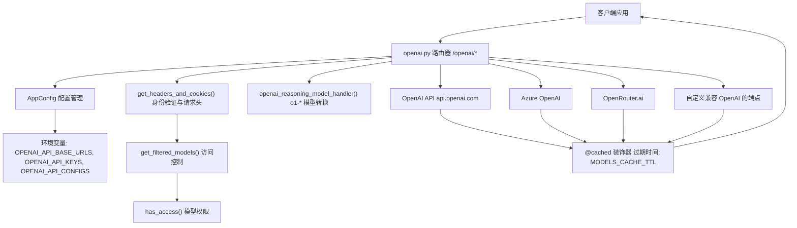
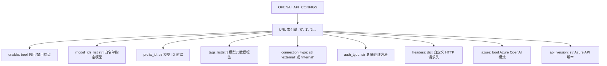
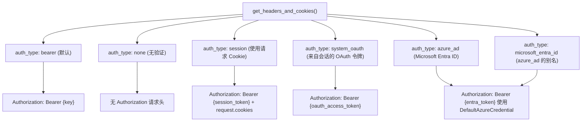
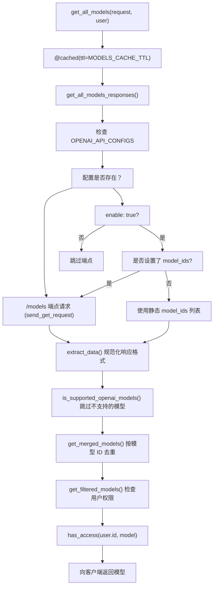
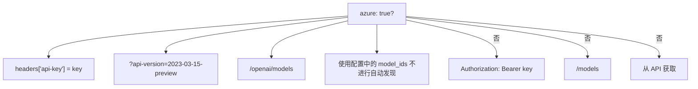
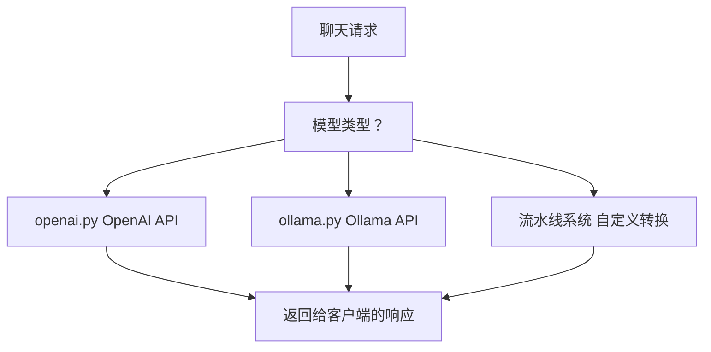

# OpenAI 集成

相关源文件

-   [backend/open\_webui/env.py](https://github.com/open-webui/open-webui/blob/a7271532/backend/open_webui/env.py)
-   [backend/open\_webui/routers/audio.py](https://github.com/open-webui/open-webui/blob/a7271532/backend/open_webui/routers/audio.py)
-   [backend/open\_webui/routers/auths.py](https://github.com/open-webui/open-webui/blob/a7271532/backend/open_webui/routers/auths.py)
-   [backend/open\_webui/routers/ollama.py](https://github.com/open-webui/open-webui/blob/a7271532/backend/open_webui/routers/ollama.py)
-   [backend/open\_webui/routers/openai.py](https://github.com/open-webui/open-webui/blob/a7271532/backend/open_webui/routers/openai.py)
-   [backend/open\_webui/utils/auth.py](https://github.com/open-webui/open-webui/blob/a7271532/backend/open_webui/utils/auth.py)
-   [backend/open\_webui/utils/embeddings.py](https://github.com/open-webui/open-webui/blob/a7271532/backend/open_webui/utils/embeddings.py)
-   [backend/open\_webui/utils/misc.py](https://github.com/open-webui/open-webui/blob/a7271532/backend/open_webui/utils/misc.py)
-   [backend/open\_webui/utils/oauth.py](https://github.com/open-webui/open-webui/blob/a7271532/backend/open_webui/utils/oauth.py)
-   [backend/open\_webui/utils/response.py](https://github.com/open-webui/open-webui/blob/a7271532/backend/open_webui/utils/response.py)

OpenAI 集成子系统提供了一个代理层，将 Open WebUI 连接到兼容 OpenAI 的 API 端点。这包括官方的 OpenAI API、Azure OpenAI 以及实现了兼容接口的第三方提供商。该系统支持多个并发 API 端点，每个端点都具有独立的配置、身份验证方法和模型管理。

有关 Ollama 集成的信息，请参阅 [Ollama 集成](/open-webui/open-webui/13.2-ollama-integration)。有关所有提供者的通用模型聚合，请参阅 [模型聚合](/open-webui/open-webui/13.1-model-aggregation)。

## 系统架构

OpenAI 集成实现为一个 FastAPI 路由器，将请求代理到一个或多个兼容 OpenAI 的后端，同时提供模型访问控制、请求转换和响应缓存等额外功能。

### 组件概览


**来源：** [backend/open\_webui/routers/openai.py1-889](https://github.com/open-webui/open-webui/blob/a7271532/backend/open_webui/routers/openai.py#L1-L889) [backend/open\_webui/env.py1-889](https://github.com/open-webui/open-webui/blob/a7271532/backend/open_webui/env.py#L1-L889)

### 请求流程架构

> **[Mermaid sequence]**
> *(图表结构无法解析)*

**来源：** [backend/open\_webui/routers/openai.py118-180](https://github.com/open-webui/open-webui/blob/a7271532/backend/open_webui/routers/openai.py#L118-L180) [backend/open\_webui/routers/openai.py97-116](https://github.com/open-webui/open-webui/blob/a7271532/backend/open_webui/routers/openai.py#L97-L116) [backend/open\_webui/routers/openai.py183-196](https://github.com/open-webui/open-webui/blob/a7271532/backend/open_webui/routers/openai.py#L183-L196)

## 配置系统

OpenAI 集成支持多个独立的 API 端点，每个端点都有自己的配置、身份验证和模型过滤。

### 配置结构

系统使用三种互补的配置结构：

| 配置项 | 类型 | 用途 | 示例 |
| --- | --- | --- | --- |
| `OPENAI_API_BASE_URLS` | `list[str]` | API 端点 URL 列表 | `["https://api.openai.com/v1", "http://localhost:8000"]` |
| `OPENAI_API_KEYS` | `list[str]` | 与每个 URL 对应的 API 密钥 | `["sk-...", ""]` |
| `OPENAI_API_CONFIGS` | `dict[str, dict]` | 每个 URL 的高级配置 | `{"0": {"enable": true, "model_ids": []}}` |

**来源：** [backend/open\_webui/routers/openai.py207-265](https://github.com/open-webui/open-webui/blob/a7271532/backend/open_webui/routers/openai.py#L207-L265)

### OPENAI\_API\_CONFIGS 架构


**来源：** [backend/open\_webui/routers/openai.py224-265](https://github.com/open-webui/open-webui/blob/a7271532/backend/open_webui/routers/openai.py#L224-L265) [backend/open\_webui/routers/openai.py343-413](https://github.com/open-webui/open-webui/blob/a7271532/backend/open_webui/routers/openai.py#L343-L413)

### 配置端点

路由器公开了用于运行时配置管理的端点：

```text
# GET /openai/config
# 返回当前配置 (仅限管理员)
{
    "ENABLE_OPENAI_API": bool,
    "OPENAI_API_BASE_URLS": list[str],
    "OPENAI_API_KEYS": list[str],
    "OPENAI_API_CONFIGS": dict
}

# POST /openai/config/update
# 更新配置 (仅限管理员)
```
**来源：** [backend/open\_webui/routers/openai.py207-265](https://github.com/open-webui/open-webui/blob/a7271532/backend/open_webui/routers/openai.py#L207-L265)

## 身份验证方法

该集成支持六种身份验证方法，可通过 `OPENAI_API_CONFIGS` 中的 `auth_type` 字段为每个端点单独配置。

### 身份验证方法图


**来源：** [backend/open\_webui/routers/openai.py118-180](https://github.com/open-webui/open-webui/blob/a7271532/backend/open_webui/routers/openai.py#L118-L180) [backend/open\_webui/routers/openai.py183-196](https://github.com/open-webui/open-webui/blob/a7271532/backend/open_webui/routers/openai.py#L183-L196)

### 身份验证实现详情

#### Bearer 令牌 (默认)

```python
# auth_type == "bearer" 或 auth_type 为 None
token = f"{key}"
headers["Authorization"] = f"Bearer {token}"
```
#### 系统 OAuth (System OAuth)

```python
# auth_type == "system_oauth"
oauth_token = await request.app.state.oauth_manager.get_oauth_token(
    user.id,
    request.cookies.get("oauth_session_id", None),
)
token = f"{oauth_token.get('access_token', '')}"
```
这与 OAuth 会话管理系统集成以检索存储的访问令牌。有关 OAuth 会话存储的详情，请参阅 [OAuth 集成](/open-webui/open-webui/10.2-oauth-integration)。

**来源：** [backend/open\_webui/routers/openai.py155-169](https://github.com/open-webui/open-webui/blob/a7271532/backend/open_webui/routers/openai.py#L155-L169)

#### Microsoft Entra ID / Azure AD

```python
# auth_type 为 ("azure_ad", "microsoft_entra_id") 之一
from azure.identity import DefaultAzureCredential, get_bearer_token_provider

token_provider = get_bearer_token_provider(
    DefaultAzureCredential(),
    "https://cognitiveservices.azure.com/.default"
)
token = token_provider()
```
使用 Azure 的 `DefaultAzureCredential` 进行自动凭据发现（托管标识、环境变量、Azure CLI 等）。

**来源：** [backend/open\_webui/routers/openai.py183-196](https://github.com/open-webui/open-webui/blob/a7271532/backend/open_webui/routers/openai.py#L183-L196)

## 模型管理

OpenAI 集成聚合了来自多个端点的模型，并提供了访问控制、过滤和缓存功能。

### 模型聚合流程


**来源：** [backend/open\_webui/routers/openai.py343-537](https://github.com/open-webui/open-webui/blob/a7271532/backend/open_webui/routers/openai.py#L343-L537) [backend/open\_webui/routers/openai.py456-467](https://github.com/open-webui/open-webui/blob/a7271532/backend/open_webui/routers/openai.py#L456-L467)

### 模型响应增强

聚合列表中的每个模型都使用了元数据进行增强：

```json
{
    "id": "model-id",  # 可选前缀: prefix_id
    "name": "model-name",
    "owned_by": "openai",
    "openai": {...},  # 原始模型对象
    "connection_type": "external",  # 来自 OPENAI_API_CONFIGS
    "urlIdx": 0,  # 在 OPENAI_API_BASE_URLS 中的索引
    "tags": []  # 来自 OPENAI_API_CONFIGS
}
```
**来源：** [backend/open\_webui/routers/openai.py503-531](https://github.com/open-webui/open-webui/blob/a7271532/backend/open_webui/routers/openai.py#L503-L531)

### 模型过滤

系统在两个阶段过滤模型：

1.  **OpenAI 官方 API 过滤** - 自动排除来自 `api.openai.com` 的非聊天模型：

    ```python
    excluded = ["babbage", "dall-e", "davinci", "embedding", "tts", "whisper"]
    ```

2.  **用户访问控制过滤** - 检查模型所有权和访问控制列表：

    ```python
    if user.role == "user" and not BYPASS_MODEL_ACCESS_CONTROL:
        models["data"] = await get_filtered_models(models, user)
    ```


**来源：** [backend/open\_webui/routers/openai.py488-502](https://github.com/open-webui/open-webui/blob/a7271532/backend/open_webui/routers/openai.py#L488-L502) [backend/open\_webui/routers/openai.py456-467](https://github.com/open-webui/open-webui/blob/a7271532/backend/open_webui/routers/openai.py#L456-L467) [backend/open\_webui/routers/openai.py622-624](https://github.com/open-webui/open-webui/blob/a7271532/backend/open_webui/routers/openai.py#L622-L624)

## 特殊功能

### OpenAI 推理模型 (Reasoning Models)

OpenAI 的推理模型 (o1-preview, o1-mini, o3-mini) 需要针对系统消息和 token 限制进行特殊处理。

```python
def openai_reasoning_model_handler(payload):
    # 将 max_tokens 转换为 max_completion_tokens
    if "max_tokens" in payload:
        payload["max_completion_tokens"] = payload["max_tokens"]
        del payload["max_tokens"]

    # 处理系统角色转换
    if payload["messages"][0]["role"] == "system":
        model_lower = payload["model"].lower()
        if model_lower.startswith("o1-mini") or model_lower.startswith("o1-preview"):
            # 旧版模型: system → user
            payload["messages"][0]["role"] = "user"
        else:
            # 新版模型: system → developer
            payload["messages"][0]["role"] = "developer"

    return payload
```
**来源：** [backend/open\_webui/routers/openai.py97-116](https://github.com/open-webui/open-webui/blob/a7271532/backend/open_webui/routers/openai.py#L97-L116)

### Azure OpenAI 支持

Azure OpenAI 具有不同的 API 结构，需要特殊处理：


Azure 需要 `api-version` 查询参数，且不支持动态模型发现，因此模型必须在 `model_ids` 中手动指定。

**来源：** [backend/open\_webui/routers/openai.py569-574](https://github.com/open-webui/open-webui/blob/a7271532/backend/open_webui/routers/openai.py#L569-L574) [backend/open\_webui/routers/openai.py655-667](https://github.com/open-webui/open-webui/blob/a7271532/backend/open_webui/routers/openai.py#L655-L667)

### OpenRouter.ai 请求头

OpenRouter.ai 需要特殊的 HTTP 请求头进行请求归因：

```python
headers = {
    "Content-Type": "application/json",
    **(
        {
            "HTTP-Referer": "https://openwebui.com/",
            "X-Title": "Open WebUI",
        }
        if "openrouter.ai" in url
        else {}
    ),
}
```
**来源：** [backend/open\_webui/routers/openai.py126-137](https://github.com/open-webui/open-webui/blob/a7271532/backend/open_webui/routers/openai.py#L126-L137)

### 用户信息请求头 (User Info Headers)

启用 `ENABLE_FORWARD_USER_INFO_HEADERS` 后，系统在代理请求中包含用户身份标识头：

```python
if ENABLE_FORWARD_USER_INFO_HEADERS and user:
    headers = include_user_info_headers(headers, user)
    if metadata and metadata.get("chat_id"):
        headers["X-OpenWebUI-Chat-Id"] = metadata.get("chat_id")
```
这允许后端服务追踪单用户和单聊天的使用情况。

**来源：** [backend/open\_webui/routers/openai.py139-142](https://github.com/open-webui/open-webui/blob/a7271532/backend/open_webui/routers/openai.py#L139-L142) [backend/open\_webui/env.py188-193](https://github.com/open-webui/open-webui/blob/a7271532/backend/open_webui/env.py#L188-L193)

## 文本转语音集成 (Text-to-Speech Integration)

OpenAI 集成通过 `/audio/speech` 端点提供 TTS 能力，并带有响应缓存。

### TTS 请求流程

> **[Mermaid sequence]**
> *(图表结构无法解析)*

缓存机制使用请求体的 SHA-256 哈希来创建确定性的缓存键，防止针对相同请求进行重复的 API 调用。

**来源：** [backend/open\_webui/routers/openai.py268-341](https://github.com/open-webui/open-webui/blob/a7271532/backend/open_webui/routers/openai.py#L268-L341)

## 连接验证

`/verify` 端点在保存配置前测试 API 连通性：

```python
@router.post("/verify")
async def verify_connection(
    request: Request,
    form_data: ConnectionVerificationForm,
    user=Depends(get_admin_user),
):
    # 构建带有身份验证的请求头
    # 测试到 /models 或 /openai/models 端点的连接
    # 返回 成功/错误 响应
```
对于 Azure OpenAI，验证使用带有 `api-version` 参数的 `/openai/models` 端点。

**来源：** [backend/open\_webui/routers/openai.py635-695](https://github.com/open-webui/open-webui/blob/a7271532/backend/open_webui/routers/openai.py#L635-L695)

## 环境配置

OpenAI 集成的关键环境变量：

| 变量 | 类型 | 默认值 | 描述 |
| --- | --- | --- | --- |
| `AIOHTTP_CLIENT_TIMEOUT` | `int` | `300` | 全局 HTTP 超时时间 (秒) |
| `AIOHTTP_CLIENT_TIMEOUT_MODEL_LIST` | `int` | `10` | 获取模型列表的超时时间 |
| `AIOHTTP_CLIENT_SESSION_SSL` | `bool` | `true` | 启用 SSL 验证 |
| `MODELS_CACHE_TTL` | `int` | `1` | 模型列表缓存时长 (秒) |
| `BYPASS_MODEL_ACCESS_CONTROL` | `bool` | `false` | 禁用访问控制检查 |
| `ENABLE_FORWARD_USER_INFO_HEADERS` | `bool` | `false` | 在代理请求中包含用户信息 |

**来源：** [backend/open\_webui/env.py669-696](https://github.com/open-webui/open-webui/blob/a7271532/backend/open_webui/env.py#L669-L696) [backend/open\_webui/env.py546-554](https://github.com/open-webui/open-webui/blob/a7271532/backend/open_webui/env.py#L546-L554) [backend/open\_webui/env.py438-440](https://github.com/open-webui/open-webui/blob/a7271532/backend/open_webui/env.py#L438-L440) [backend/open\_webui/env.py188-193](https://github.com/open-webui/open-webui/blob/a7271532/backend/open_webui/env.py#L188-L193)

## 与聊天流水线的集成

当向 OpenAI 模型发送消息时，聊天流水线会调用 OpenAI 集成：


模型路由由模型元数据中的 `owned_by` 字段决定，该字段在模型聚合期间设置。

**来源：** [backend/open\_webui/routers/openai.py503-531](https://github.com/open-webui/open-webui/blob/a7271532/backend/open_webui/routers/openai.py#L503-L531)
