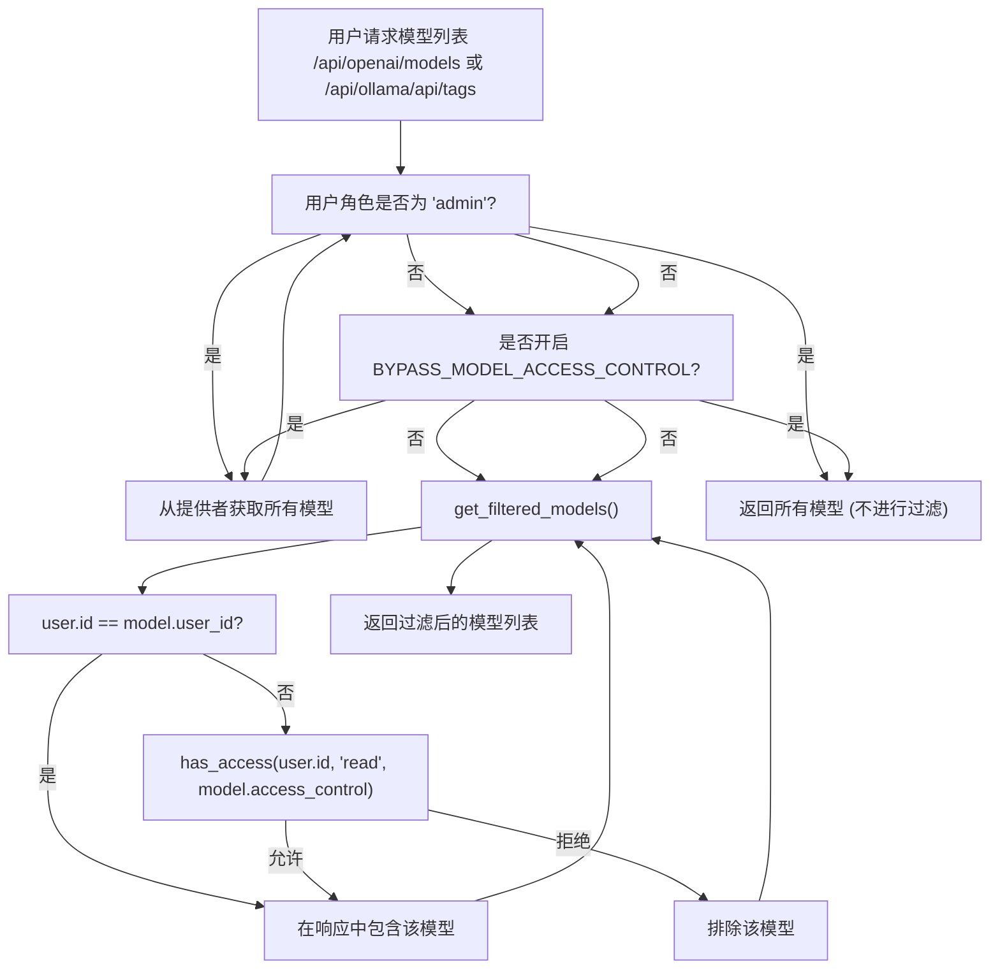
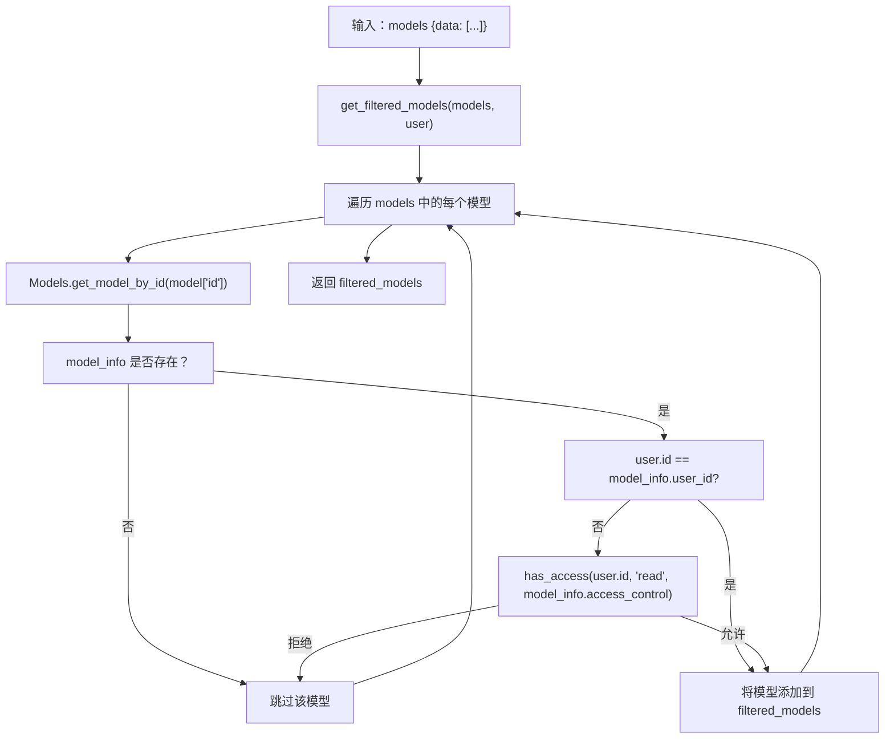
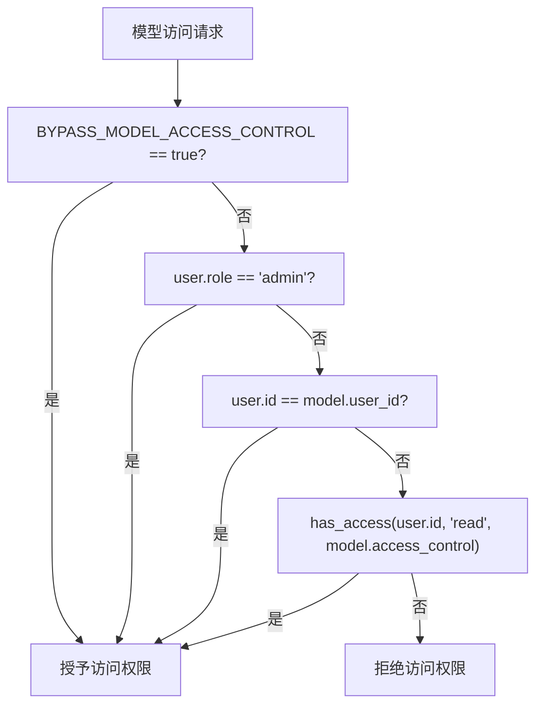

# 模型访问控制

相关源文件

-   [backend/open\_webui/env.py](https://github.com/open-webui/open-webui/blob/a7271532/backend/open_webui/env.py)
-   [backend/open\_webui/routers/audio.py](https://github.com/open-webui/open-webui/blob/a7271532/backend/open_webui/routers/audio.py)
-   [backend/open\_webui/routers/auths.py](https://github.com/open-webui/open-webui/blob/a7271532/backend/open_webui/routers/auths.py)
-   [backend/open\_webui/routers/ollama.py](https://github.com/open-webui/open-webui/blob/a7271532/backend/open_webui/routers/ollama.py)
-   [backend/open\_webui/routers/openai.py](https://github.com/open-webui/open-webui/blob/a7271532/backend/open_webui/routers/openai.py)
-   [backend/open\_webui/utils/auth.py](https://github.com/open-webui/open-webui/blob/a7271532/backend/open_webui/utils/auth.py)
-   [backend/open\_webui/utils/embeddings.py](https://github.com/open-webui/open-webui/blob/a7271532/backend/open_webui/utils/embeddings.py)
-   [backend/open\_webui/utils/misc.py](https://github.com/open-webui/open-webui/blob/a7271532/backend/open_webui/utils/misc.py)
-   [backend/open\_webui/utils/oauth.py](https://github.com/open-webui/open-webui/blob/a7271532/backend/open_webui/utils/oauth.py)
-   [backend/open\_webui/utils/response.py](https://github.com/open-webui/open-webui/blob/a7271532/backend/open_webui/utils/response.py)

## 目的与范围

模型访问控制系统根据所有权和权限规则，限制单个用户可以访问哪些 LLM 模型。本页涵盖了应用于模型列表的过滤机制、`BYPASS_MODEL_ACCESS_CONTROL` 环境标志以及与模型端点的集成。

有关来自多个提供者的模型聚合信息，请参阅 [模型聚合](/open-webui/open-webui/13.1-model-aggregation)。有关身份验证和基于角色的访问控制 (RBAC)，请参阅 [访问控制与 RBAC](/open-webui/open-webui/10.4-access-control-and-rbac)。有关其他特性的单用户权限，请参阅 [访问控制与 RBAC](/open-webui/open-webui/10.4-access-control-and-rbac)。

---

## 系统架构

模型访问控制作为模型列表端点与用户之间的过滤层运行，在返回结果前对照用户权限评估每个模型。

### 访问控制流程


**来源：** [backend/open\_webui/routers/openai.py456-466](https://github.com/open-webui/open-webui/blob/a7271532/backend/open_webui/routers/openai.py#L456-L466) [backend/open\_webui/routers/ollama.py424-434](https://github.com/open-webui/open-webui/blob/a7271532/backend/open_webui/routers/ollama.py#L424-L434)

---

## 环境配置

### BYPASS\_MODEL\_ACCESS\_CONTROL 标志

`BYPASS_MODEL_ACCESS_CONTROL` 环境变量为所有访问控制检查提供了一个全局覆盖选项。启用后，所有用户（包括非管理员用户）都可以看到并访问所有模型，无论其所有权或访问控制列表设置如何。

| 变量 | 类型 | 默认值 | 描述 |
| --- | --- | --- | --- |
| `BYPASS_MODEL_ACCESS_CONTROL` | boolean | `False` | 设置为 `true` 时，禁用针对普通用户的模型访问过滤 |

**配置位置：** [backend/open\_webui/env.py438-440](https://github.com/open-webui/open-webui/blob/a7271532/backend/open_webui/env.py#L438-L440)

```python
BYPASS_MODEL_ACCESS_CONTROL = (
    os.environ.get("BYPASS_MODEL_ACCESS_CONTROL", "False").lower() == "true"
)
```
**使用场景：**

-   无需访问限制的开发/测试环境。
-   单用户部署。
-   使用外部授权系统的部署。

**安全提示：** 在生产多用户环境中，该标志应保持为 `False`，以维持正常的访问边界。

**来源：** [backend/open\_webui/env.py438-440](https://github.com/open-webui/open-webui/blob/a7271532/backend/open_webui/env.py#L438-L440)

---

## 模型元数据与权限

### 模型数据库模式

存储在 `Models` 表中的每个模型都包含访问控制元数据：

| 字段 | 类型 | 描述 |
| --- | --- | --- |
| `id` | string | 唯一模型标识符 (例如 `"gpt-4"`, `"llama2:13b"`) |
| `user_id` | string | 注册/拥有该模型的用户 ID |
| `access_control` | dict | 定义读取/写入权限的访问控制列表 |

**模型所有权**：`user_id` 字段建立了所有权。无论 `access_control` 设置如何，模型所有者始终对其模型拥有完整访问权限。

**访问控制结构**：`access_control` 字段遵循由 `has_access()` 评估的权限结构：

```json
# access_control 结构示例
{
  "read": {
    "group_ids": ["group_uuid_1", "group_uuid_2"],
    "user_ids": ["user_uuid_1", "user_uuid_2"]
  },
  "write": {
    "group_ids": [...],
    "user_ids": [...]
  }
}
```
**来源：** [backend/open\_webui/routers/openai.py460-464](https://github.com/open-webui/open-webui/blob/a7271532/backend/open_webui/routers/openai.py#L460-L464) [backend/open\_webui/routers/ollama.py428-432](https://github.com/open-webui/open-webui/blob/a7271532/backend/open_webui/routers/ollama.py#L428-L432)

---

## 过滤实现

### 过滤函数架构


**来源：** [backend/open\_webui/routers/openai.py456-466](https://github.com/open-webui/open-webui/blob/a7271532/backend/open_webui/routers/openai.py#L456-L466) [backend/open\_webui/routers/ollama.py424-434](https://github.com/open-webui/open-webui/blob/a7271532/backend/open_webui/routers/ollama.py#L424-L434)

### OpenAI 端点实现

兼容 OpenAI 的 `/api/openai/models` 端点在响应阶段应用过滤：

[backend/open\_webui/routers/openai.py539-625](https://github.com/open-webui/open-webui/blob/a7271532/backend/open_webui/routers/openai.py#L539-L625)

```python
@router.get("/models")
@router.get("/models/{url_idx}")
async def get_models(
    request: Request, url_idx: Optional[int] = None, user=Depends(get_verified_user)
):
    # 从所有配置好的 OpenAI API 端点获取模型
    models = await get_all_models(request, user=user)

    # 针对非管理员用户应用过滤
    if user.role == "user" and not BYPASS_MODEL_ACCESS_CONTROL:
        models["data"] = await get_filtered_models(models, user)

    return models

async def get_filtered_models(models, user):
    # 根据用户访问控制过滤模型
    filtered_models = []
    for model in models.get("data", []):
        model_info = Models.get_model_by_id(model["id"])
        if model_info:
            if user.id == model_info.user_id or has_access(
                user.id, type="read", access_control=model_info.access_control
            ):
                filtered_models.append(model)
    return filtered_models
```
**关键行为：**

-   管理员用户 (`user.role == "admin"`) 完全绕过过滤。
-   返回符合 OpenAI 规范的 `{data: []}` 结构。
-   针对每个模型，从 `Models` 表中查询模型元数据。
-   数据库中不存在条目的模型将被排除。

**来源：** [backend/open\_webui/routers/openai.py456-466](https://github.com/open-webui/open-webui/blob/a7271532/backend/open_webui/routers/openai.py#L456-L466) [backend/open\_webui/routers/openai.py539-625](https://github.com/open-webui/open-webui/blob/a7271532/backend/open_webui/routers/openai.py#L539-L625)

### Ollama 端点实现

兼容 Ollama 的 `/api/ollama/api/tags` 端点使用相同的过滤模式，但结构有所不同：

[backend/open\_webui/routers/ollama.py437-487](https://github.com/open-webui/open-webui/blob/a7271532/backend/open_webui/routers/ollama.py#L437-L487)

```python
@router.get("/api/tags")
@router.get("/api/tags/{url_idx}")
async def get_ollama_tags(
    request: Request, url_idx: Optional[int] = None, user=Depends(get_verified_user)
):
    # 从 Ollama 端点获取模型
    models = await get_all_models(request, user=user)

    # 针对非管理员用户应用过滤
    if user.role == "user" and not BYPASS_MODEL_ACCESS_CONTROL:
        models["models"] = await get_filtered_models(models, user)

    return models

async def get_filtered_models(models, user):
    # 根据用户访问控制过滤模型
    filtered_models = []
    for model in models.get("models", []):
        model_info = Models.get_model_by_id(model["model"])
        if model_info:
            if user.id == model_info.user_id or has_access(
                user.id, type="read", access_control=model_info.access_control
            ):
                filtered_models.append(model)
    return filtered_models
```
**与 OpenAI 端点的区别：**

-   使用 `models["models"]` 而不是 `models["data"]`。
-   通过 `model["model"]` 而不是 `model["id"]` 访问模型 ID。
-   除此之外，过滤逻辑完全一致。

**来源：** [backend/open\_webui/routers/ollama.py424-434](https://github.com/open-webui/open-webui/blob/a7271532/backend/open_webui/routers/ollama.py#L424-L434) [backend/open\_webui/routers/ollama.py437-487](https://github.com/open-webui/open-webui/blob/a7271532/backend/open_webui/routers/ollama.py#L437-L487)

---

## 集成点

### 嵌入端点 (Embeddings Endpoint)

嵌入生成端点在处理请求前会应用访问控制：

[backend/open\_webui/utils/embeddings.py25-89](https://github.com/open-webui/open-webui/blob/a7271532/backend/open_webui/utils/embeddings.py#L25-L89)

```python
async def generate_embeddings(
    request: Request,
    form_data: dict,
    user: UserModel,
    bypass_filter: bool = False,
):
    # 全局绕过检查
    if BYPASS_MODEL_ACCESS_CONTROL:
        bypass_filter = True

    # 检索模型
    model_id = form_data.get("model")
    if model_id not in models:
        raise Exception("Model not found")
    model = models[model_id]

    # 访问过滤
    if not getattr(request.state, "direct", False):
        if not bypass_filter and user.role == "user":
            check_model_access(user, model)

    # 处理嵌入请求...
```
**关键区别：**

-   使用 `check_model_access(user, model)` 而非过滤列表。
-   如果拒绝访问则抛出异常（而不是从列表中移除）。
-   支持用于编程式绕过的 `bypass_filter` 参数。
-   遵循全局 `BYPASS_MODEL_ACCESS_CONTROL` 标志。

**来源：** [backend/open\_webui/utils/embeddings.py25-89](https://github.com/open-webui/open-webui/blob/a7271532/backend/open_webui/utils/embeddings.py#L25-L89)

### 聊天补全端点

聊天补全端点继承了相同的模型解析逻辑，但不显式过滤模型列表，因为它们操作的是请求中指定的单个模型。访问控制通过以下方式强制执行：

1.  **模型发现阶段**：用户无法在 UI 选择器中看到其无权访问的模型（通过过滤后的 `/models` 端点）。
2.  **请求验证**：后端在处理聊天请求时验证模型访问权限（在中间件层实现）。

**来源：** [backend/open\_webui/routers/openai.py622-624](https://github.com/open-webui/open-webui/blob/a7271532/backend/open_webui/routers/openai.py#L622-L624) [backend/open\_webui/routers/ollama.py484-486](https://github.com/open-webui/open-webui/blob/a7271532/backend/open_webui/routers/ollama.py#L484-L486)

---

## 访问控制评估

### 评估逻辑图


**评估优先级 (短路逻辑)：**

1.  **全局绕过**：如果 `BYPASS_MODEL_ACCESS_CONTROL=true`，立即授予访问权限。
2.  **管理员角色**：如果 `user.role == "admin"`，立即授予访问权限。
3.  **所有权**：如果 `user.id == model.user_id`，立即授予访问权限。
4.  **访问控制列表**：评估 `has_access(user.id, "read", model.access_control)`。
    -   检查用户是否在 `access_control.read.user_ids[]` 中。
    -   检查用户是否属于 `access_control.read.group_ids[]` 中的任何组。
5.  **默认情况**：若上述条件均不满足，则拒绝访问。

**来源：** [backend/open\_webui/routers/openai.py456-466](https://github.com/open-webui/open-webui/blob/a7271532/backend/open_webui/routers/openai.py#L456-L466) [backend/open\_webui/routers/ollama.py424-434](https://github.com/open-webui/open-webui/blob/a7271532/backend/open_webui/routers/ollama.py#L424-L434)

---

## 安全考量

### 访问控制绕过场景

| 场景 | 行为 | 安全影响 |
| --- | --- | --- |
| `BYPASS_MODEL_ACCESS_CONTROL=true` | 所有用户可见所有模型 | 完全绕过访问控制 |
| 管理员用户 | 无论设置如何，可见所有模型 | 预期的管理员特权 |
| 模型所有者 | 无论 ACL 设置如何，可见自有模型 | 预期的所有权特权 |
| API 密钥身份验证 | 遵循相同的过滤规则 | 无特殊特权 |
| OAuth 身份验证 | 遵循相同的过滤规则 | 无特殊特权 |

### 模型注册与所有权

-   当模型首次注册在数据库中时，注册用户通过 `user_id` 成为所有者。
-   从外部 API（Ollama, OpenAI）获取且在数据库中不存在的模型，对非管理员用户不可见。
-   管理员用户即使在模型缺少数据库条目的情况下也能看到它们。

### 实现安全性

**数据库查询**：过滤函数使用 `Models.get_model_by_id()` 来检索存储的模型元数据。在数据库中没有条目的模型会从过滤后的结果中排除。

**无隐式访问**：缺少 `access_control` 字段并不会授予隐式访问权限。`has_access()` 函数必须显式返回 `True`。

**来源：** [backend/open\_webui/routers/openai.py456-466](https://github.com/open-webui/open-webui/blob/a7271532/backend/open_webui/routers/openai.py#L456-L466) [backend/open\_webui/routers/ollama.py424-434](https://github.com/open-webui/open-webui/blob/a7271532/backend/open_webui/routers/ollama.py#L424-L434) [backend/open\_webui/env.py438-440](https://github.com/open-webui/open-webui/blob/a7271532/backend/open_webui/env.py#L438-L440)

---

## 部署配置

### 按部署类型划分的建议设置

| 部署类型 | `BYPASS_MODEL_ACCESS_CONTROL` | 管理员用户 | 备注 |
| --- | --- | --- | --- |
| **生产环境 (多用户)** | `false` | 有限的管理员账户 | 强制执行正常的访问控制 |
| **开发环境** | `true` | 所有开发人员 | 简化测试流程 |
| **单用户** | `true` | 不适用 | 无需访问控制 |
| **企业环境 (LDAP/OAuth)** | `false` | 由目录管理 | 与现有的 IAM 集成 |
| **演示/评估** | `true` 或 `false` | 取决于具体配置 | 视演示范围而定 |

### 配置示例

```bash
# 生产多用户部署
BYPASS_MODEL_ACCESS_CONTROL=false

# 开发环境
BYPASS_MODEL_ACCESS_CONTROL=true
```
**来源：** [backend/open\_webui/env.py438-440](https://github.com/open-webui/open-webui/blob/a7271532/backend/open_webui/env.py#L438-L440)

---

## 相关系统

-   **[模型聚合](/open-webui/open-webui/13.1-model-aggregation)**：在过滤前如何合并来自多个提供者的模型。
-   **[访问控制与 RBAC](/open-webui/open-webui/10.4-access-control-and-rbac)**：用户角色、权限以及基于组的访问控制。
-   **[Ollama 集成](/open-webui/open-webui/13.2-ollama-integration)**：Ollama 特有的模型获取与格式化。
-   **[OpenAI 集成](/open-webui/open-webui/13.3-openai-integration)**：兼容 OpenAI 的 API 模型获取。
-   **[流水线系统](/open-webui/open-webui/13.5-pipeline-system)**：自定义模型转换与集成。

**来源：** [backend/open\_webui/routers/openai.py456-625](https://github.com/open-webui/open-webui/blob/a7271532/backend/open_webui/routers/openai.py#L456-L625) [backend/open\_webui/routers/ollama.py424-487](https://github.com/open-webui/open-webui/blob/a7271532/backend/open_webui/routers/ollama.py#L424-L487) [backend/open\_webui/utils/embeddings.py25-89](https://github.com/open-webui/open-webui/blob/a7271532/backend/open_webui/utils/embeddings.py#L25-L89)
