# 流水线系统

相关源文件

-   [backend/open_webui/config.py](https://github.com/open-webui/open-webui/blob/a7271532/backend/open_webui/config.py)
-   [backend/open_webui/main.py](https://github.com/open-webui/open-webui/blob/a7271532/backend/open_webui/main.py)
-   [backend/open_webui/retrieval/loaders/datalab_marker.py](https://github.com/open-webui/open-webui/blob/a7271532/backend/open_webui/retrieval/loaders/datalab_marker.py)
-   [backend/open_webui/retrieval/loaders/external_document.py](https://github.com/open-webui/open-webui/blob/a7271532/backend/open_webui/retrieval/loaders/external_document.py)
-   [backend/open_webui/retrieval/loaders/external_web.py](https://github.com/open-webui/open-webui/blob/a7271532/backend/open_webui/retrieval/loaders/external_web.py)
-   [backend/open_webui/retrieval/loaders/main.py](https://github.com/open-webui/open-webui/blob/a7271532/backend/open_webui/retrieval/loaders/main.py)
-   [backend/open_webui/retrieval/loaders/mineru.py](https://github.com/open-webui/open-webui/blob/a7271532/backend/open_webui/retrieval/loaders/mineru.py)
-   [backend/open_webui/retrieval/loaders/mistral.py](https://github.com/open-webui/open-webui/blob/a7271532/backend/open_webui/retrieval/loaders/mistral.py)
-   [backend/open_webui/retrieval/utils.py](https://github.com/open-webui/open-webui/blob/a7271532/backend/open_webui/retrieval/utils.py)
-   [backend/open_webui/routers/retrieval.py](https://github.com/open-webui/open-webui/blob/a7271532/backend/open_webui/routers/retrieval.py)
-   [backend/open_webui/utils/middleware.py](https://github.com/open-webui/open-webui/blob/a7271532/backend/open_webui/utils/middleware.py)
-   [src/lib/apis/retrieval/index.ts](https://github.com/open-webui/open-webui/blob/a7271532/src/lib/apis/retrieval/index.ts)
-   [src/lib/components/admin/Settings/Documents.svelte](https://github.com/open-webui/open-webui/blob/a7271532/src/lib/components/admin/Settings/Documents.svelte)
-   [src/lib/components/admin/Settings/WebSearch.svelte](https://github.com/open-webui/open-webui/blob/a7271532/src/lib/components/admin/Settings/WebSearch.svelte)

本页记录了 Open WebUI 中的流水线 (Pipelines) 插件框架，该框架为自定义请求和响应转换提供了一个标准化的机制。流水线是 Python 模块，可以在两个点拦截聊天补全请求：入口（inlet，在 LLM 处理之前）和出口（outlet，在 LLM 响应之后），从而实现自定义的预处理、后处理、内容过滤以及与外部服务的集成。

流水线系统实现为后端请求处理链中的中间件。与模型特定的流水线（替换 LLM）不同，过滤器流水线通过在数据传递时对其进行转换，从而增强现有的聊天流。

**来源：** [backend/open_webui/utils/middleware.py53-56](https://github.com/open-webui/open-webui/blob/a7271532/backend/open_webui/utils/middleware.py#L53-L56) [backend/open_webui/main.py76](https://github.com/open-webui/open-webui/blob/a7271532/backend/open_webui/main.py#L76-L76)

## 架构概览

### 请求流中的流水线集成

流水线通过 `process_chat_payload` 和 `process_chat_response` 函数集成到聊天中间件流水线中。中间件系统通过一系列处理器处理请求，而流水线提供了可定制的转换点。

**图表：流水线中间件链**

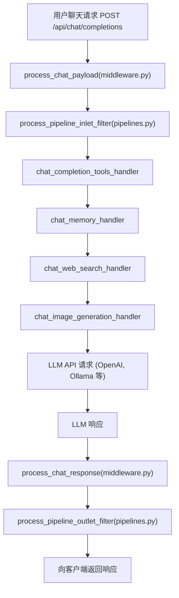
**来源：** [backend/open_webui/utils/middleware.py53-56](https://github.com/open-webui/open-webui/blob/a7271532/backend/open_webui/utils/middleware.py#L53-L56) 系统架构概览中的图 2

### 中间件函数

流水线系统在中间件层公开了两个主要的集成点：

**表格：流水线中间件函数**

| 函数 | 文件位置 | 调用者 | 用途 |
| --- | --- | --- | --- |
| `process_pipeline_inlet_filter` | `routers/pipelines.py` | `process_chat_payload` | 在 LLM 之前预处理请求 |
| `process_pipeline_outlet_filter` | `routers/pipelines.py` | `process_chat_response` | 在 LLM 之后后处理响应 |

这两个函数都被导入到 `utils/middleware.py` 中，并作为标准请求/响应生命周期的一部分被调用。

**来源：** [backend/open_webui/utils/middleware.py53-56](https://github.com/open-webui/open-webui/blob/a7271532/backend/open_webui/utils/middleware.py#L53-L56)

## 流水线类型

### 入口 (Inlet) 流水线

入口流水线在聊天请求到达 LLM 之前对其进行处理。它们可以：

-   修改消息内容（例如：添加上下文、重写提示词）
-   注入系统消息
-   过滤或验证用户输入
-   添加元数据或追踪信息
-   基于内容分析对请求进行路由

**图表：入口过滤器处理**

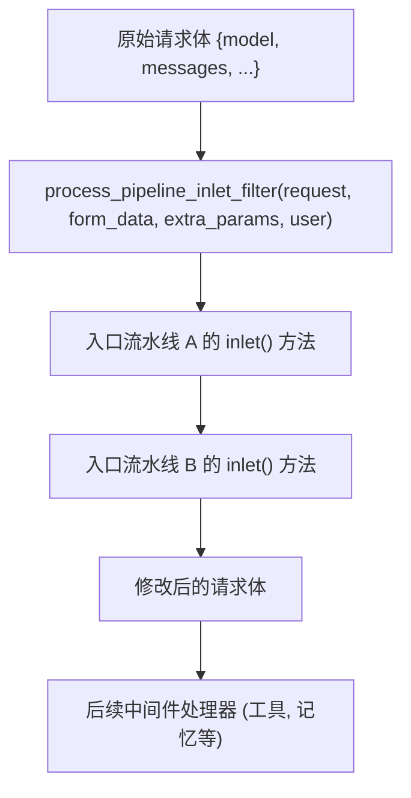
入口流水线接收请求并可以返回修改后的版本。多个流水线可以链接在一起，每个流水线处理上一个流水线的输出。

**来源：** [backend/open_webui/utils/middleware.py54](https://github.com/open-webui/open-webui/blob/a7271532/backend/open_webui/utils/middleware.py#L54-L54) 图 2（入口过滤器）

### 出口 (Outlet) 流水线

出口流水线在 LLM 响应发送到客户端之前对其进行处理。它们可以：

-   后处理生成的文本（例如：格式化、清理）
-   添加引用或参考文献
-   向响应中注入元数据
-   记录或审计响应内容
-   转换响应格式

**图表：出口过滤器处理**

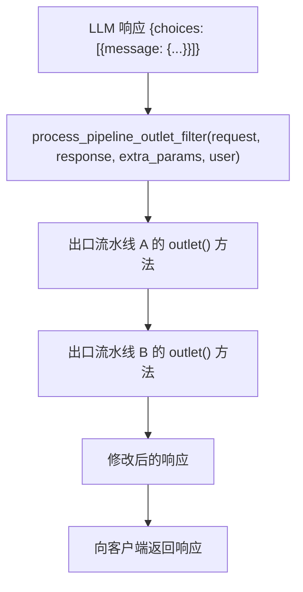
**来源：** [backend/open_webui/utils/middleware.py55](https://github.com/open-webui/open-webui/blob/a7271532/backend/open_webui/utils/middleware.py#L55-L55) 图 2（出口过滤器）

## 流水线结构

### 必需接口

一个流水线模块必须实现一个特定的接口才能被流水线系统识别。具体的结构取决于它是入口流水线还是出口流水线。

**表格：流水线类要求**

| 元素 | 类型 | 是否必需 | 用途 |
| --- | --- | --- | --- |
| `class Pipeline` | Python 类 | 是 | 主要的流水线实现 |
| `def __init__(self)` | 构造函数 | 是 | 初始化流水线状态和阀门 (valves) |
| `self.valves` | 对象 | 可选 | 运行时配置参数 |
| `async def inlet(body: dict)` | 方法 | 仅针对入口流水线 | 在 LLM 之前转换请求 |
| `async def outlet(body: dict)` | 方法 | 仅针对出口流水线 | 在 LLM 之后转换响应 |

**来源：** 基于 [backend/open_webui/routers/pipelines.py](https://github.com/open-webui/open-webui/blob/a7271532/backend/open_webui/routers/pipelines.py) 中的流水线路由模式

### 流水线结构示例

一个基础的流水线实现遵循此模式：

```python
class Pipeline:
    def __init__(self):
        # 初始化阀门配置
        self.valves = {
            "ENABLED": True,
            "SETTING_A": "default_value"
        }

    async def inlet(self, body: dict, user: dict) -> dict:
        # 在 LLM 之前处理请求
        # body 包含：model, messages, stream 等

        # 示例：添加系统消息
        if self.valves.get("ENABLED"):
            body["messages"].insert(0, {
                "role": "system",
                "content": "自定义上下文"
            })

        return body

    async def outlet(self, body: dict, user: dict) -> dict:
        # 在 LLM 之后处理响应
        # body 包含 LLM 的响应

        # 示例：修改响应内容
        if "choices" in body:
            for choice in body["choices"]:
                choice["message"]["content"] += "\n\n[经过流水线处理]"

        return body
```
**来源：** 基于流水线接口模式

### 阀门 (Valve) 配置

阀门是运行时参数，允许在不修改代码的情况下定制流水线行为。它们定义在 `__init__` 中，可以通过管理员界面进行更新。

**表格：通用阀门模式**

| 阀门类型 | 示例 | 用途 |
| --- | --- | --- |
| 布尔标志 | `ENABLED: True` | 启用/禁用流水线 |
| 字符串配置 | `API_KEY: ""` | 外部服务凭据 |
| 数值阈值 | `MAX_TOKENS: 2048` | 处理限制 |
| 列表 | `ALLOWED_MODELS: []` | 过滤准则 |

**来源：** 基于配置模式

## 流水线部署

### 流水线服务器架构

流水线部署在与 Open WebUI 并行运行的独立流水线服务器上。这些服务器执行 Python 流水线代码，并通过 HTTP API 访问。

**图表：流水线服务器部署**

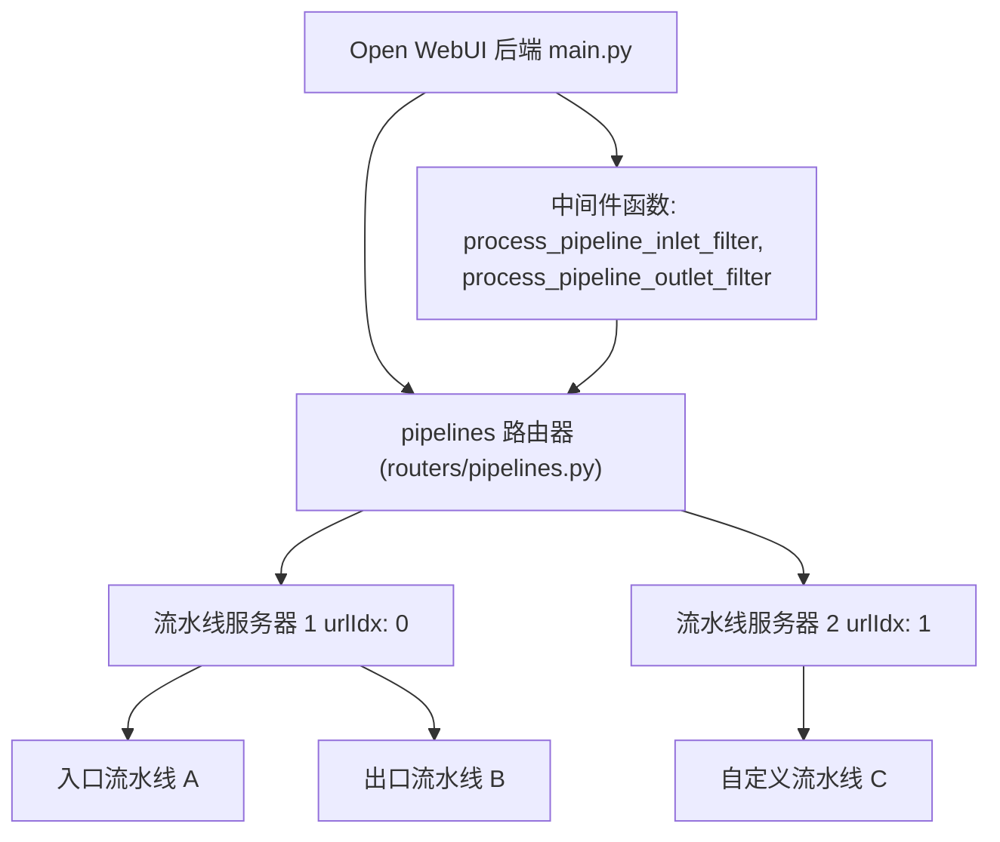
**来源：** [backend/open_webui/main.py76](https://github.com/open-webui/open-webui/blob/a7271532/backend/open_webui/main.py#L76-L76) [backend/open_webui/config.py128-129](https://github.com/open-webui/open-webui/blob/a7271532/backend/open_webui/config.py#L128-L129)

### 服务器配置

流水线服务器通过环境变量进行配置，指定其连接端点。

**表格：流水线服务器环境变量**

| 变量 | 类型 | 用途 | 示例 |
| --- | --- | --- | --- |
| `TOOL_SERVER_CONNECTIONS` | JSON 数组 | 流水线服务器端点列表 | `[{"url":"http://localhost:9099"}]` |

配置数组中的每个服务器都被分配了一个从 0 开始的索引 (`urlIdx`)，用于在 API 调用中标识服务器。

**来源：** [backend/open_webui/config.py128-129](https://github.com/open-webui/open-webui/blob/a7271532/backend/open_webui/config.py#L128-L129) [backend/open_webui/main.py706-707](https://github.com/open-webui/open-webui/blob/a7271532/backend/open_webui/main.py#L706-L707)

### 流水线注册

流水线通过文件上传或 URL 下载注册到流水线服务器。注册过程包括：

1.  **验证**：检查 Python 语法和接口合规性。
2.  **部署**：将代码部署到 `urlIdx` 处的指定服务器。
3.  **激活**：流水线变得可用，可用于入口/出口处理。

**图表：流水线注册流程**

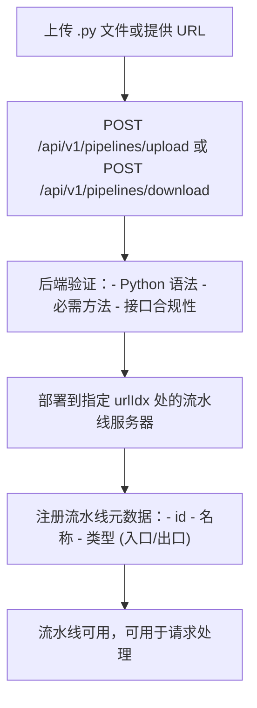
**来源：** 基于 [backend/open_webui/routers/pipelines.py](https://github.com/open-webui/open-webui/blob/a7271532/backend/open_webui/routers/pipelines.py) 中的流水线路由模式

## 处理生命周期

### 使用流水线的请求处理

当处理聊天补全请求时，流水线在中间件链中的特定点被调用。处理流程确保所有转换都按顺序应用。

**图表：带有流水线的完整请求流程**

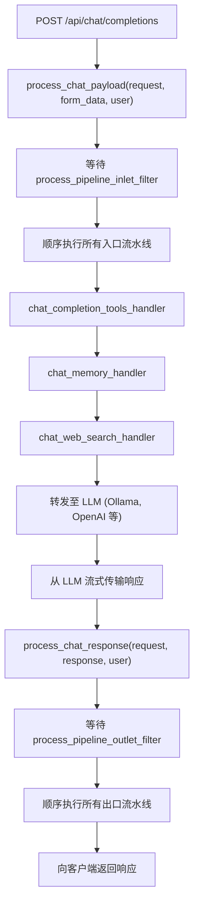
**来源：** [backend/open_webui/utils/middleware.py494](https://github.com/open-webui/open-webui/blob/a7271532/backend/open_webui/utils/middleware.py#L494-L494) [backend/open_webui/utils/middleware.py53-56](https://github.com/open-webui/open-webui/blob/a7271532/backend/open_webui/utils/middleware.py#L53-L56)

### 流水线执行上下文

流水线接收关于请求的上下文信息，包括用户元数据、事件发射器和会话信息。

**表格：流水线上下文参数**

| 参数 | 类型 | 来源 | 用途 |
| --- | --- | --- | --- |
| `body` | `dict` | 请求载荷 | 包含消息、模型等的聊天补全请求 |
| `user` | `UserModel` | 身份验证 | 发出请求的用户 |
| `extra_params` | `dict` | 中间件 | 包含 `__event_emitter__`, `__event_call__`, `__metadata__` |

`extra_params` 字典提供了对以下内容的访问：

-   `__event_emitter__`：用于向客户端发送状态更新
-   `__event_call__`：用于调用服务器端事件
-   `__metadata__`：包含 `chat_id`, `message_id`, `session_id`

**来源：** [backend/open_webui/utils/middleware.py332-334](https://github.com/open-webui/open-webui/blob/a7271532/backend/open_webui/utils/middleware.py#L332-L334)

### 流水线链式调用 (Chaining)

多个流水线可以同时激活。它们按顺序执行，每个流水线处理上一个流水线的输出。

**图表：流水线链式调用**

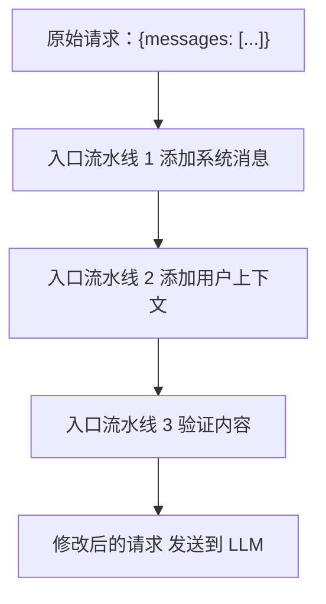
每个流水线接收上一个流水线的输出，从而实现了可组合的转换。

**来源：** 基于流水线处理模式

## 与中间件系统的集成

### 中间件处理器顺序

流水线与其他的聊天增强特性一起集成在更广泛的中间件系统中。执行顺序对于正确的功能至关重要。

**表格：中间件处理器执行顺序**

| 顺序 | 处理器函数 | 源文件 | 用途 |
| --- | --- | --- | --- |
| 1 | `process_pipeline_inlet_filter` | `routers/pipelines.py` | 预处理请求 |
| 2 | `chat_completion_tools_handler` | `utils/middleware.py:286` | 执行工具 |
| 3 | `chat_memory_handler` | `utils/middleware.py:516` | 添加记忆上下文 |
| 4 | `chat_web_search_handler` | `utils/middleware.py:555` | 添加联网搜索结果 |
| 5 | `chat_image_generation_handler` | `utils/middleware.py:755` | 生成图像 |
| ... | LLM 处理 | 多种 | 生成响应 |
| N | `process_pipeline_outlet_filter` | `routers/pipelines.py` | 后处理响应 |

**来源：** [backend/open_webui/utils/middleware.py286](https://github.com/open-webui/open-webui/blob/a7271532/backend/open_webui/utils/middleware.py#L286-L286) [backend/open_webui/utils/middleware.py516](https://github.com/open-webui/open-webui/blob/a7271532/backend/open_webui/utils/middleware.py#L516-L516) [backend/open_webui/utils/middleware.py555](https://github.com/open-webui/open-webui/blob/a7271532/backend/open_webui/utils/middleware.py#L555-L555) [backend/open_webui/utils/middleware.py755](https://github.com/open-webui/open-webui/blob/a7271532/backend/open_webui/utils/middleware.py#L755-L755)

### 事件系统集成

流水线可以发射事件，在处理过程中向客户端提供实时的状态更新。事件通过 `extra_params` 中提供的 `__event_emitter__` 发送。

**表格：流水线可用的事件类型**

| 事件类型 | 用途 | 示例负载 |
| --- | --- | --- |
| `status` | 显示处理状态 | `{"action": "processing", "description": "Running pipeline", "done": false}` |
| `message` | 发送中间消息 | `{"content": "Pipeline output"}` |
| `error` | 报告错误 | `{"error": true, "message": "Pipeline failed"}` |

流水线通过以下方式访问事件发射器：

```python
event_emitter = extra_params.get("__event_emitter__")
if event_emitter:
    await event_emitter({
        "type": "status",
        "data": {"description": "正在处理...", "done": False}
    })
```
**来源：** [backend/open_webui/utils/middleware.py332-334](https://github.com/open-webui/open-webui/blob/a7271532/backend/open_webui/utils/middleware.py#L332-L334) [backend/open_webui/utils/middleware.py558-567](https://github.com/open-webui/open-webui/blob/a7271532/backend/open_webui/utils/middleware.py#L558-L567)

### 工具集成

流水线可以通过修改工具调用响应或将工具结果注入到消息流中来与工具系统交互。

**图表：流水线与工具集成**

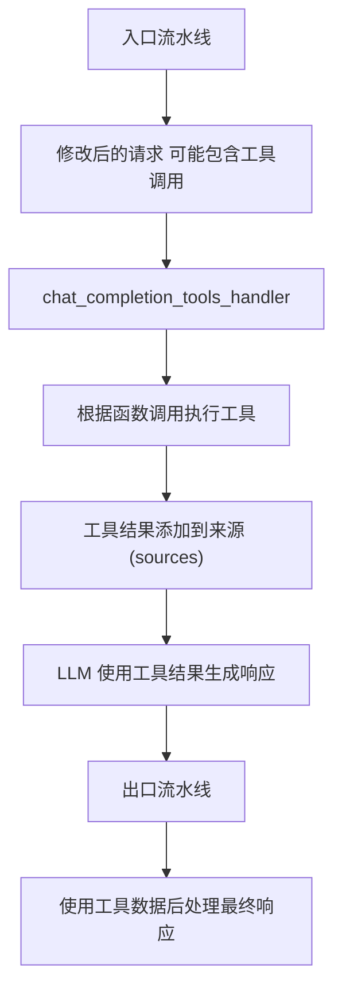
**来源：** [backend/open_webui/utils/middleware.py286-514](https://github.com/open-webui/open-webui/blob/a7271532/backend/open_webui/utils/middleware.py#L286-L514)

## 使用场景

### 内容过滤

入口流水线可以实现内容过滤，在处理之前验证或清理用户输入。

**示例：脏话过滤流水线**

```python
class Pipeline:
    def __init__(self):
        self.valves = {
            "ENABLED": True,
            "BLOCKED_WORDS": ["spam", "abuse"]
        }

    async def inlet(self, body: dict, user: dict) -> dict:
        if not self.valves["ENABLED"]:
            return body

        for message in body.get("messages", []):
            content = message.get("content", "")
            for word in self.valves["BLOCKED_WORDS"]:
                if word.lower() in content.lower():
                    raise ValueError(f"检测到屏蔽词: {word}")

        return body
```
**来源：** 基于流水线模式示例

### 上下文注入

入口流水线可以向请求中注入额外的上下文，例如用户偏好、历史数据或特定领域知识。

**示例：用户偏好流水线**

```python
class Pipeline:
    async def inlet(self, body: dict, user: dict) -> dict:
        # 向系统消息添加用户偏好
        user_prefs = f"用户偏好: {user.get('preferences', {})}"

        body["messages"].insert(0, {
            "role": "system",
            "content": user_prefs
        })

        return body
```
**来源：** 基于流水线模式示例

### 响应格式化

出口流水线可以标准化响应格式、添加元数据或转换内容结构。

**示例：引用添加流水线**

```python
class Pipeline:
    async def outlet(self, body: dict, user: dict) -> dict:
        if "choices" in body:
            for choice in body["choices"]:
                message = choice.get("message", {})
                content = message.get("content", "")

                # 添加引用页脚
                message["content"] = f"{content}\n\n---\n由 AI 生成"

        return body
```
**来源：** 基于流水线模式示例

### 外部服务集成

流水线可以将外部 API 或服务集成到聊天流中，实现自定义数据源或处理。

**示例：外部 API 流水线**

```python
import aiohttp

class Pipeline:
    def __init__(self):
        self.valves = {
            "API_URL": "https://api.example.com",
            "API_KEY": ""
        }

    async def inlet(self, body: dict, user: dict) -> dict:
        # 从外部 API 获取数据
        async with aiohttp.ClientSession() as session:
            headers = {"Authorization": f"Bearer {self.valves['API_KEY']}"}
            async with session.get(self.valves["API_URL"], headers=headers) as resp:
                data = await resp.json()

        # 注入系统消息
        body["messages"].insert(0, {
            "role": "system",
            "content": f"外部数据: {data}"
        })

        return body
```
**来源：** 基于流水线模式示例

## 错误处理

### 流水线异常

流水线可以抛出异常来中止请求处理。异常由中间件捕获，并作为错误响应返回给客户端。

**表格：错误处理行为**

| 异常类型 | 处理方式 | 客户端响应 |
| --- | --- | --- |
| `ValueError` | 由中间件捕获 | 400 Bad Request 以及错误消息 |
| `HTTPException` | 透传 | 异常中的状态码 |
| `Exception` | 由中间件捕获 | 500 Internal Server Error |

**来源：** 基于中间件错误处理模式

### 调试流水线

流水线执行错误会记录在后端控制台中。要调试流水线问题：

1.  检查后端日志中的堆栈追踪。
2.  验证阀门配置值。
3.  独立测试流水线代码。
4.  使用 `print()` 语句（输出在日志中可见）。

**来源：** 基于调试模式

## 配置与管理

### 流水线服务器配置

流水线服务器通过 `TOOL_SERVER_CONNECTIONS` 环境变量进行配置，该变量包含一个服务器连接对象的 JSON 数组。

**表格：服务器连接结构**

| 字段 | 类型 | 是否必需 | 用途 |
| --- | --- | --- | --- |
| `url` | `string` | 是 | 流水线服务器的基准 URL |
| `api_key` | `string` | 否 | 服务器的身份验证密钥 |

示例配置：

```json
[
  {"url": "http://localhost:9099"},
  {"url": "http://pipeline-server-2:9099", "api_key": "secret"}
]
```
**来源：** [backend/open_webui/config.py128-129](https://github.com/open-webui/open-webui/blob/a7271532/backend/open_webui/config.py#L128-L129) [backend/open_webui/main.py706-707](https://github.com/open-webui/open-webui/blob/a7271532/backend/open_webui/main.py#L706-L707)

### 运行时状态管理

应用程序在 `app.state.TOOL_SERVERS` 中维护流水线服务器的运行时状态。该数组在应用启动期间从 `TOOL_SERVER_CONNECTIONS` 配置填充。

**图表：流水线状态初始化**

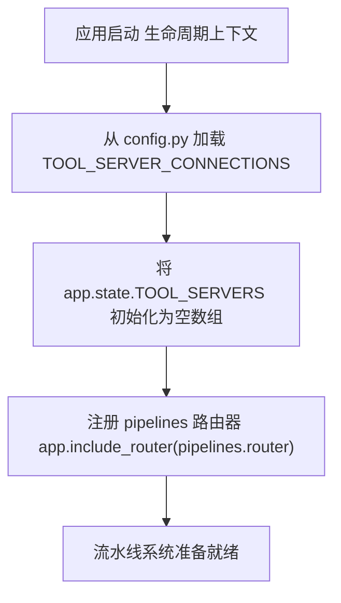
**来源：** [backend/open_webui/main.py706-707](https://github.com/open-webui/open-webui/blob/a7271532/backend/open_webui/main.py#L706-L707) [backend/open_webui/main.py76](https://github.com/open-webui/open-webui/blob/a7271532/backend/open_webui/main.py#L76-L76)

### 管理员访问控制

流水线管理操作（上传、下载、删除）需要管理员权限。路由器端点通过 `get_admin_user` 依赖项强制执行此项要求。

**表格：权限要求**

| 操作 | 端点 | 所需角色 |
| --- | --- | --- |
| 列出流水线 | `GET /pipelines/list` | 管理员 |
| 上传流水线 | `POST /pipelines/upload` | 管理员 |
| 下载流水线 | `POST /pipelines/download` | 管理员 |
| 删除流水线 | `DELETE /pipelines/delete` | 管理员 |
| 获取流水线详情 | `GET /pipelines` | 管理员 |
| 更新阀门 | `POST /pipelines/{id}/valves/update` | 管理员 |

**来源：** 基于路由器身份验证模式

## 与其他系统的比较

### 流水线 vs. 函数

Open WebUI 同时拥有流水线系统和函数 (Functions) 系统。它们服务于不同的目的：

**表格：流水线 vs 函数**

| 维度 | 流水线 | 函数 |
| --- | --- | --- |
| 目的 | 在中间件中转换请求/响应 | 为 LLM 提供可调用的工具 |
| 集成方式 | 中间件钩子 (入口/出口) | 工具执行系统 |
| 调用方式 | 自动应用于所有请求 | 由 LLM 通过函数调用来调用 |
| 位置 | 独立的流水线服务器 | 存储在数据库中，在后端执行 |

函数记录在第 6.3 页（工具执行系统）中。

**来源：** [backend/open_webui/utils/middleware.py53-56](https://github.com/open-webui/open-webui/blob/a7271532/backend/open_webui/utils/middleware.py#L53-L56) [backend/open_webui/models/functions.py](https://github.com/open-webui/open-webui/blob/a7271532/backend/open_webui/models/functions.py)

### 流水线 vs. MCP 工具

模型上下文协议 (MCP) 工具是另一种集成机制：

**表格：流水线 vs MCP 工具**

| 维度 | 流水线 | MCP 工具 |
| --- | --- | --- |
| 标准 | 自定义 Open WebUI 格式 | Anthropic MCP 协议 |
| 执行方式 | 流水线服务器中的 Python 模块 | 外部 MCP 服务器 |
| 发现方式 | 手动注册 | 通过 MCP 协议动态发现 |
| 使用场景 | 请求/响应转换 | 外部工具/资源访问 |

MCP 集成记录在 [backend/open_webui/utils/mcp/client.py](https://github.com/open-webui/open-webui/blob/a7271532/backend/open_webui/utils/mcp/client.py) 中。

**来源：** [backend/open_webui/utils/middleware.py53-56](https://github.com/open-webui/open-webui/blob/a7271532/backend/open_webui/utils/middleware.py#L53-L56) [backend/open_webui/utils/mcp/client.py103](https://github.com/open-webui/open-webui/blob/a7271532/backend/open_webui/utils/mcp/client.py#L103-L103)

## 高级主题

### 流式响应处理

出口流水线必须正确处理流式响应。LLM 响应是一个数据块流，必须增量地进行处理。

**图表：流式响应处理**

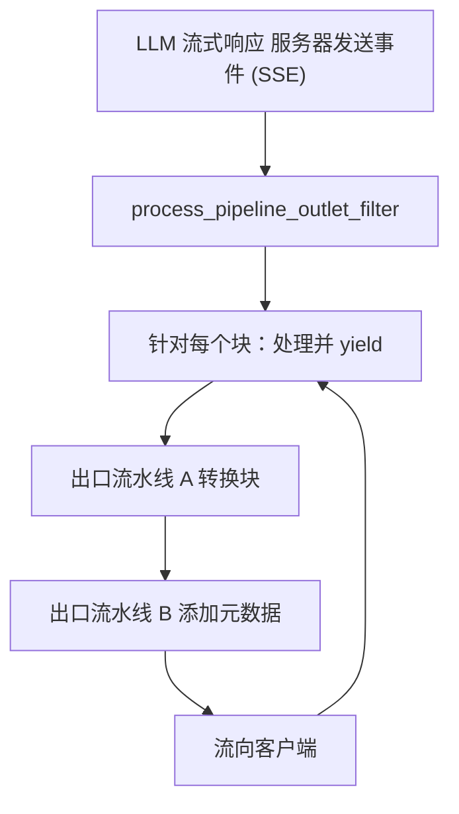
**来源：** 基于中间件中的流模式

### 异步流水线执行

流水线应当实现异步方法 (`async def inlet`, `async def outlet`)，以避免在 I/O 操作期间阻塞事件循环。

**最佳实践：**

-   对网络请求使用 `async`/`await`。
-   对后台操作使用 `asyncio.create_task()`。
-   避免使用同步阻塞调用（例如 `time.sleep()`）。

**来源：** 基于 Python 中的异步模式

### 性能考量

**表格：流水线性能优化**

| 考量因素 | 影响 | 建议 |
| --- | --- | --- |
| 网络延迟 | 每次请求都会增加延迟 | 将流水线服务器与 Open WebUI 部署在一起 |
| 处理时间 | 阻塞请求流 | 保持入口/出口逻辑极简 |
| 外部 API 调用 | 延迟不确定 | 尽可能缓存结果 |
| 内存使用 | 影响服务器容量 | 避免在流水线中加载大型模型 |

**来源：** 基于性能模式

## 相关系统

-   **工具执行系统 (第 6.3 页)**：函数调用与工具集成
-   **中间件系统 (第 6.2 页)**：请求/响应处理流水线
-   **模型聚合 (第 13.1 页)**：流水线模型如何出现在模型列表中
-   **配置管理 (第 11.2 页)**：持久化配置与设置

**来源：** 交叉引用至相关文档页

---

### 概述 (模型拉取)

模型拉取功能允许管理员直接通过 UI 从 Ollama.com 下载模型。系统强制执行最多 3 个并发下载的限制，实时流式传输进度更新，并支持取消正在进行的下载。

当管理员用户在搜索字段中输入一个不匹配任何现有模型的模型名称时，会触发拉取操作。系统会自动显示“从 Ollama.com 拉取 (Pull from Ollama.com)”按钮。

**来源：** [src/lib/components/chat/ModelSelector/Selector.svelte186-312](https://github.com/open-webui/open-webui/blob/a7271532/src/lib/components/chat/ModelSelector/Selector.svelte#L186-L312)

### 模型拉取流程

**图表：pullModelHandler 函数流程**

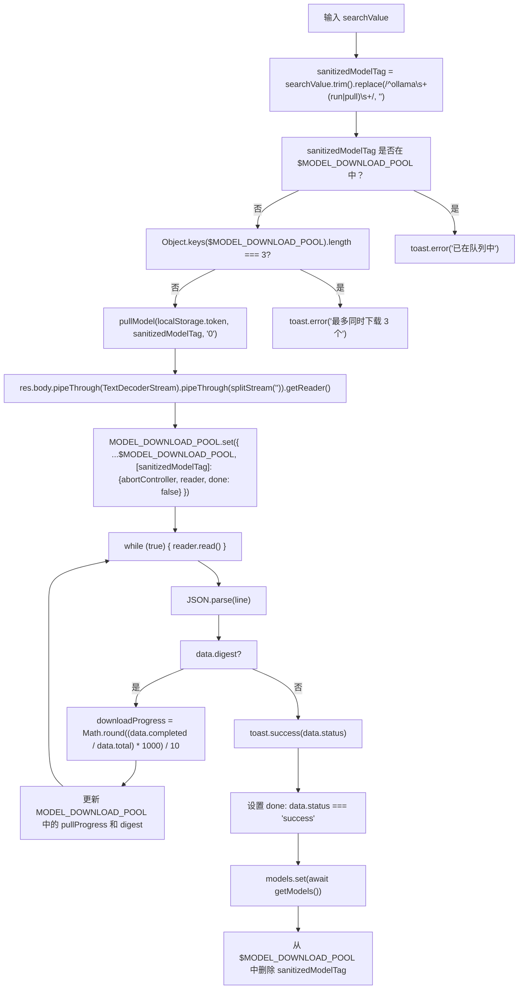
**来源：** [src/lib/components/chat/ModelSelector/Selector.svelte186-312](https://github.com/open-webui/open-webui/blob/a7271532/src/lib/components/chat/ModelSelector/Selector.svelte#L186-L312)

### MODEL_DOWNLOAD_POOL Store 结构

`MODEL_DOWNLOAD_POOL` Svelte store（从 `$lib/stores` 导入）追踪所有活跃的模型下载。每个条目都以清理后的模型标签（例如 `"llama2:7b"`）为键。

**表格：MODEL_DOWNLOAD_POOL 条目属性**

| 属性 | 类型 | 设置时机 | 用途 |
| --- | --- | --- | --- |
| `abortController` | `AbortController` | 拉取发起时 | 通过 `.abort()` 取消 fetch 请求 |
| `reader` | `ReadableStreamDefaultReader` | 拉取发起时 | 读取流式响应数据块 |
| `done` | `boolean` | 拉取发起时 | 初始为 `false`，当 `status === 'success'` 时为 `true` |
| `pullProgress` | `number` | 下载期间 | 根据 `data.completed/data.total` 计算出的百分比 (0-100) |
| `digest` | `string` | 下载期间 | 当前层的 SHA256 摘要 (例如 `"sha256:abc123..."`) |

**来源：** [src/lib/components/chat/ModelSelector/Selector.svelte218-226](https://github.com/open-webui/open-webui/blob/a7271532/src/lib/components/chat/ModelSelector/Selector.svelte#L218-L226) [src/lib/components/chat/ModelSelector/Selector.svelte255-262](https://github.com/open-webui/open-webui/blob/a7271532/src/lib/components/chat/ModelSelector/Selector.svelte#L255-L262)

### 流式传输协议

Ollama 的拉取 API 返回一个换行符分隔的 JSON 流。每一行代表一次状态更新：

**表格：Ollama 拉取响应格式**

| 字段 | 类型 | 示例 | 含义 |
| --- | --- | --- | --- |
| `status` | `string` | `"pulling manifest"` | 当前操作描述 |
| `digest` | `string` | `"sha256:abc..."` | 正在下载的层 |
| `total` | `number` | `4366545270` | 该层的大小（字节） |
| `completed` | `number` | `1258291200` | 截止目前已下载的字节数 |

进度百分比计算公式如下：

```text
downloadProgress = Math.round((data.completed / data.total) * 1000) / 10
```
该公式先乘以 1000 然后除以 10，以获得一位小数的精度（例如 28.8%）。

**来源：** [src/lib/components/chat/ModelSelector/Selector.svelte247-253](https://github.com/open-webui/open-webui/blob/a7271532/src/lib/components/chat/ModelSelector/Selector.svelte#L247-L253)

### 下载队列 UI 渲染

下载队列通过遍历 `Object.keys($MODEL_DOWNLOAD_POOL)` 渲染在模型列表下方。每个下载条目显示：

**表格：下载队列 UI 元素**

| 元素 | 来源 | 显示时机 |
| --- | --- | --- |
| Spinner | `<Spinner />` 组件 | 始终显示 |
| 模型名称 | `model` 键 | 始终显示，包装在 `正在下载 "{model}"` 中 |
| 进度百分比 | `$MODEL_DOWNLOAD_POOL[model].pullProgress` | 当 `$MODEL_DOWNLOAD_POOL[model]` 中包含 `pullProgress` 时 |
| 摘要 (Digest) | `$MODEL_DOWNLOAD_POOL[model].digest` | 当 `digest` 存在时 |
| 取消按钮 | 带有 X 图标的 SVG | 始终显示，触发 `cancelModelPullHandler(model)` |

**来源：** [src/lib/components/chat/ModelSelector/Selector.svelte591-650](https://github.com/open-webui/open-webui/blob/a7271532/src/lib/components/chat/ModelSelector/Selector.svelte#L591-L650)

### 取消下载处理器

**图表：cancelModelPullHandler 函数流程**

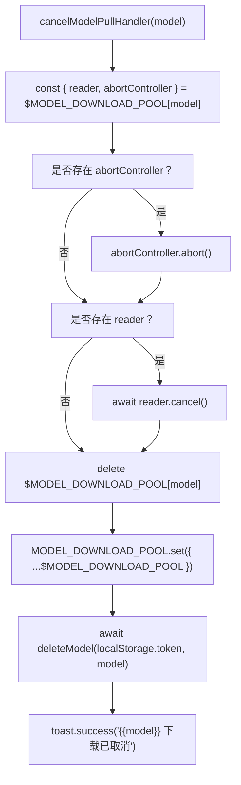
取消操作会触发 `abortController.abort()` 以停止网络请求，并调用 `reader.cancel()` 释放流。随后，通过 `deleteModel` API 调用从 Ollama 中删除部分下载的模型，以清理磁盘空间。

**来源：** [src/lib/components/chat/ModelSelector/Selector.svelte333-347](https://github.com/open-webui/open-webui/blob/a7271532/src/lib/components/chat/ModelSelector/Selector.svelte#L333-L347)

## 模型卸载

### 概述

模型卸载功能从 Ollama 的活动内存 (VRAM/RAM) 中移除模型，释放资源。Ollama 在首次使用时会自动加载模型，并将其保留在内存中直到配置的超时时间到期。

当满足以下所有条件时，`ModelItem.svelte` 中会显示卸载按钮：

-   用户是管理员：`$user?.role === 'admin'`
-   模型来自 Ollama：`item.model.owned_by === 'ollama'`
-   模型当前已加载：`item.model?.ollama?.expires_at` 存在且位于未来

**来源：** [src/lib/components/chat/ModelSelector/ModelItem.svelte231-247](https://github.com/open-webui/open-webui/blob/a7271532/src/lib/components/chat/ModelSelector/ModelItem.svelte#L231-L247)

### 卸载模型流程

**图表：unloadModelHandler 函数流程**

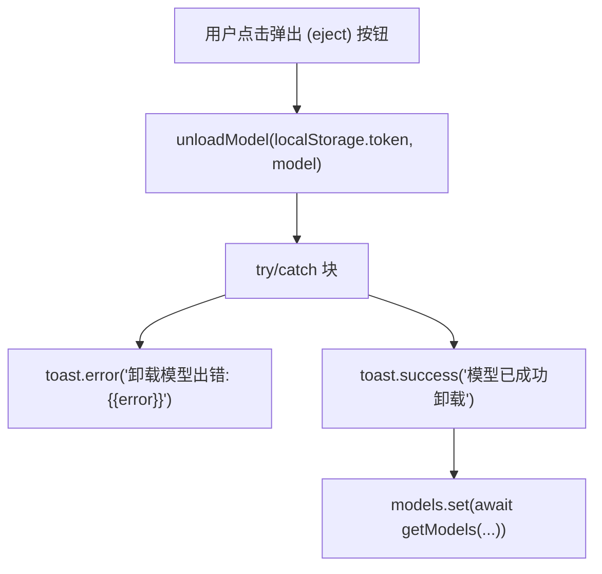
`unloadModel` API 调用向后端发送请求，后端将该请求转发至 Ollama 的 `POST /api/generate` 端点，并附带 `keep_alive: 0` 以立即卸载模型。

**来源：** [src/lib/components/chat/ModelSelector/Selector.svelte349-363](https://github.com/open-webui/open-webui/blob/a7271532/src/lib/components/chat/ModelSelector/Selector.svelte#L349-L363)

### 已加载模型指示器

**表格：模型加载状态指示器**

| 条件 | UI 指示器 | 工具提示 |
| --- | --- | --- |
| `expires_at` 在未来 | 闪烁的绿点 | `"将在 {{timeFromNow}} 后卸载"` (例如 "将在 5 分钟后卸载") |
| `expires_at` 为空/过去 | 无指示器 | 模型未加载 |

加载状态通过检查 `dayjs(item.model?.ollama?.expires_at).isAfter(dayjs())` 来确定。

**来源：** [src/lib/components/chat/ModelSelector/ModelItem.svelte118-137](https://github.com/open-webui/open-webui/blob/a7271532/src/lib/components/chat/ModelSelector/ModelItem.svelte#L118-L137)

## 模型置顶

### 概述

模型置顶功能允许用户将常用的模型标记为收藏。置顶的模型存储在 `$settings.pinnedModels` 数组中，并通过 `updateUserSettings` API 持久化到后端。

置顶状态在模型项菜单中显示为星形图标。置顶模型可以进行排序，使其出现在模型列表的顶部。

**来源：** [src/lib/components/chat/ModelSelector.svelte28-39](https://github.com/open-webui/open-webui/blob/a7271532/src/lib/components/chat/ModelSelector.svelte#L28-L39)

### 置顶模型流程

**图表：pinModelHandler 函数流程**

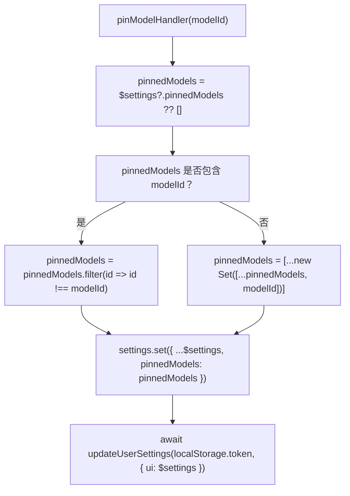
置顶切换实现为一个使用 `new Set()` 的集合操作，以确保数组中不存在重复的模型 ID。

**来源：** [src/lib/components/chat/ModelSelector.svelte28-39](https://github.com/open-webui/open-webui/blob/a7271532/src/lib/components/chat/ModelSelector.svelte#L28-L39)

### 集成点

**表格：pinModelHandler 的 Prop 传递路径**

| 组件 | Prop 名称 | 用途 |
| --- | --- | --- |
| `ModelSelector.svelte` | 定义函数 | 更新 `$settings` store 的顶层处理器 |
| `Selector.svelte` | `pinModelHandler` | 将处理器传递给子组件 |
| `ModelItem.svelte` | `pinModelHandler` | 传递给菜单组件 |
| `ModelItemMenu.svelte` | 通过 `onClick` 调用 | 当用户点击置顶按钮时触发 |

**来源：** [src/lib/components/chat/ModelSelector.svelte65](https://github.com/open-webui/open-webui/blob/a7271532/src/lib/components/chat/ModelSelector.svelte#L65-L65) [src/lib/components/chat/ModelSelector/Selector.svelte554](https://github.com/open-webui/open-webui/blob/a7271532/src/lib/components/chat/ModelSelector/Selector.svelte#L554-L554)

## 模型信息显示

### 参数与大小信息

对于 Ollama 模型，系统从 `model.ollama.details` 中提取并显示技术规格：

**表格：Ollama 模型元数据展示**

| 字段 | 来源路径 | 示例 | 显示格式 |
| --- | --- | --- | --- |
| 参数规模 | `model.ollama.details.parameter_size` | `"7B"` | 原样显示 |
| 量化等级 | `model.ollama.details.quantization_level` | `"Q4_0"` | 原样显示 |
| 文件大小 | `model.ollama.size` | `4366000000` | 转换为 GB: `(size / 1024**3).toFixed(1)` |

这些详情出现在模型项的副标题中，格式为：`"7B Q4_0 • 4.1 GB"`

**来源：** [src/lib/components/chat/ModelSelector/ModelItem.svelte97-117](https://github.com/open-webui/open-webui/blob/a7271532/src/lib/components/chat/ModelSelector/ModelItem.svelte#L97-L117)

### 连接类型指示器

模型会显示视觉徽章，指示其连接架构：

**表格：连接类型图标**

| `model.connection_type` / 标志 | 图标元素 | 工具提示 | 含义 |
| --- | --- | --- | --- |
| `direct: true` | RSS/广播波纹 SVG | `"直接连接"` | 浏览器直接连接到模型 API |
| `external` | 链条 SVG | `"外部"` | 通过 Open WebUI 后端路由 |
| `local` (默认) | 无 | 无 | 本地 Ollama 实例 |

连接类型也用于模型选择器头部的过滤（参见第 9.1 页）。

**来源：** [src/lib/components/chat/ModelSelector/ModelItem.svelte161-200](https://github.com/open-webui/open-webui/blob/a7271532/src/lib/components/chat/ModelSelector/ModelItem.svelte#L161-L200)

### 标签显示

模型可以在 `model.tags` 数组中定义多个标签。每个标签具有如下属性：`{ name: string, ... }`。

**表格：标签显示位置**

| 位置 | 实现方式 | 用户交互 |
| --- | --- | --- |
| 模型选择器头部 | 水平可滚动的按钮列表 | 点击以过滤模型 |
| 模型项 | 带有计数徽章的标签图标 | 悬停查看完整标签列表工具提示 |

标签过滤器在 `Selector.svelte` 中通过检查标签名是否匹配 `selectedTag.toLowerCase()` 来实现。

**来源：** [src/lib/components/chat/ModelSelector/ModelItem.svelte141-159](https://github.com/open-webui/open-webui/blob/a7271532/src/lib/components/chat/ModelSelector/ModelItem.svelte#L141-L159) [src/lib/components/chat/ModelSelector/Selector.svelte451-544](https://github.com/open-webui/open-webui/blob/a7271532/src/lib/components/chat/ModelSelector/Selector.svelte#L451-L544)

### 模型描述

如果 `model.info.meta.description` 存在，模型名称旁会出现一个信息图标（圆圈中的 `i`）。悬停时显示一个工具提示，其中包含使用 `marked` 库渲染为 HTML 的描述内容。

解析是内联进行的：`{@html marked.parse(item.model?.info?.meta?.description ?? '')}`

**来源：** [src/lib/components/chat/ModelSelector/ModelItem.svelte202-225](https://github.com/open-webui/open-webui/blob/a7271532/src/lib/components/chat/ModelSelector/ModelItem.svelte#L202-L225)

## API 集成

### Ollama API 函数

模型操作与从 `$lib/apis/ollama` 导入的函数集成：

**表格：Ollama API 集成**

| 函数 | HTTP 方法/端点 | 参数 | 返回类型 | 用法 |
| --- | --- | --- | --- |
| `pullModel` | `POST /ollama/api/pull` (流式) | `token`, `modelTag`, `urlIdx` | `[Response, AbortController]` | 发起模型下载 |
| `unloadModel` | `POST /ollama/api/generate` | `token`, `model` | `Promise<void>` | 从内存中卸载模型 |
| `deleteModel` | `DELETE /ollama/api/delete` | `token`, `model` | `Promise<void>` | 删除模型文件 |
| `getOllamaVersion` | `GET /ollama/api/version` | `token` | `Promise<string>` | 检查 Ollama 是否可用 |

**来源：** [src/lib/components/chat/ModelSelector/Selector.svelte15](https://github.com/open-webui/open-webui/blob/a7271532/src/lib/components/chat/ModelSelector/Selector.svelte#L15-L15)

### 模型列表刷新模式

在修改模型状态的操作后，系统调用 `getModels()` 来刷新 `$models` store：

**图表：模型刷新模式**

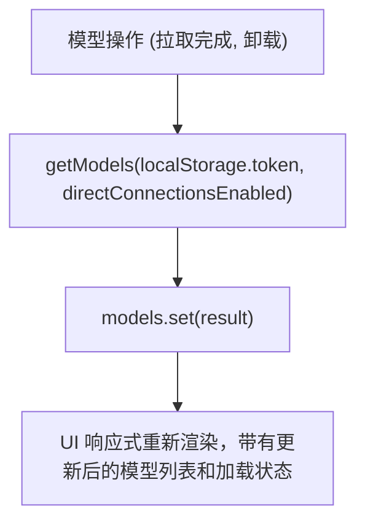
`directConnections` 参数决定是否包含来自直接连接提供者的模型（除了代理模型之外）。

**来源：** [src/lib/components/chat/ModelSelector/Selector.svelte296-301](https://github.com/open-webui/open-webui/blob/a7271532/src/lib/components/chat/ModelSelector/Selector.svelte#L296-L301) [src/lib/components/chat/ModelSelector/Selector.svelte356-361](https://github.com/open-webui/open-webui/blob/a7271532/src/lib/components/chat/ModelSelector/Selector.svelte#L356-L361)

### 拉取模型按钮可见性

当满足以下条件时，显示“从 Ollama.com 拉取”按钮：

1.  `searchValue` 不为空。
2.  `searchValue.trim()` 尚未在 `$MODEL_DOWNLOAD_POOL` 中（当前未在下载）。
3.  `ollamaVersion` 为真值（Ollama 可用）。
4.  `$user?.role === 'admin'`（用户为管理员）。

该逻辑实现在 [src/lib/components/chat/ModelSelector/Selector.svelte571-589](https://github.com/open-webui/open-webui/blob/a7271532/src/lib/components/chat/ModelSelector/Selector.svelte#L571-L589)。

**来源：** [src/lib/components/chat/ModelSelector/Selector.svelte571-589](https://github.com/open-webui/open-webui/blob/a7271532/src/lib/components/chat/ModelSelector/Selector.svelte#L571-L589)

## 用户权限

模型操作遵循以下权限检查：

| 操作 | 权限要求 |
| --- | --- |
| 拉取模型 | `$user?.role === 'admin'` |
| 卸载模型 | `$user?.role === 'admin'` |
| 置顶模型 | 任何已认证用户 |
| 查看模型信息 | 任何已认证用户 |

**来源：** [src/lib/components/chat/ModelSelector/Selector.svelte547](https://github.com/open-webui/open-webui/blob/a7271532/src/lib/components/chat/ModelSelector/Selector.svelte#L547-L547) [src/lib/components/chat/ModelSelector/ModelItem.svelte231](https://github.com/open-webui/open-webui/blob/a7271532/src/lib/components/chat/ModelSelector/ModelItem.svelte#L231-L231)
