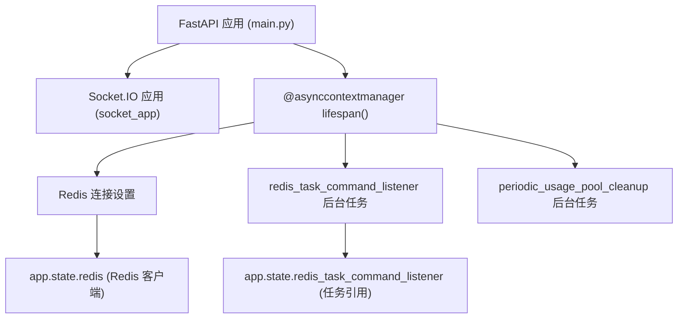
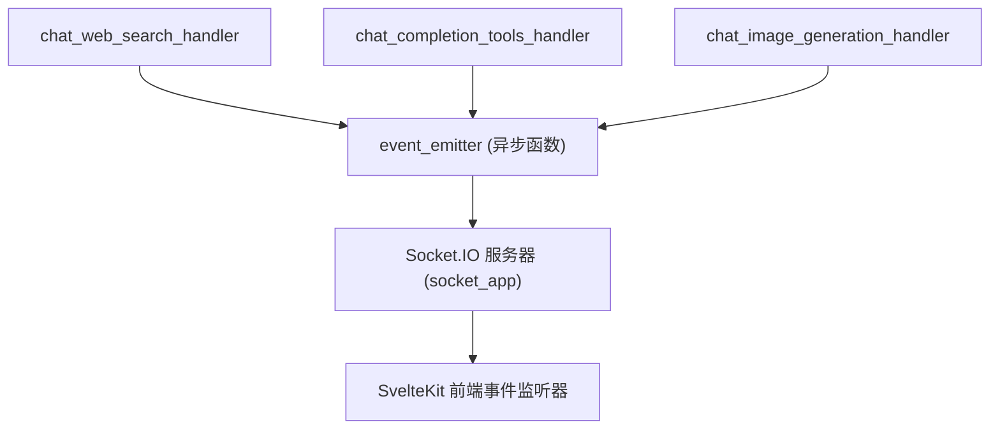
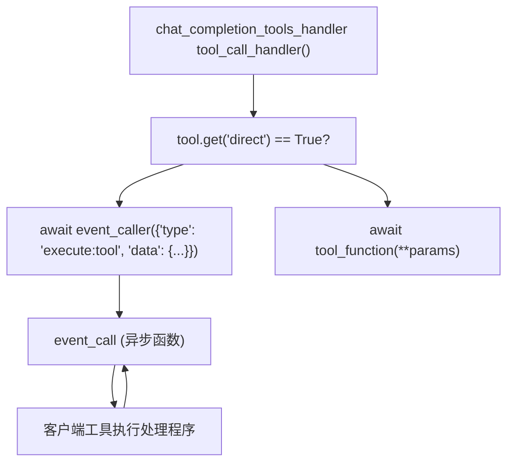
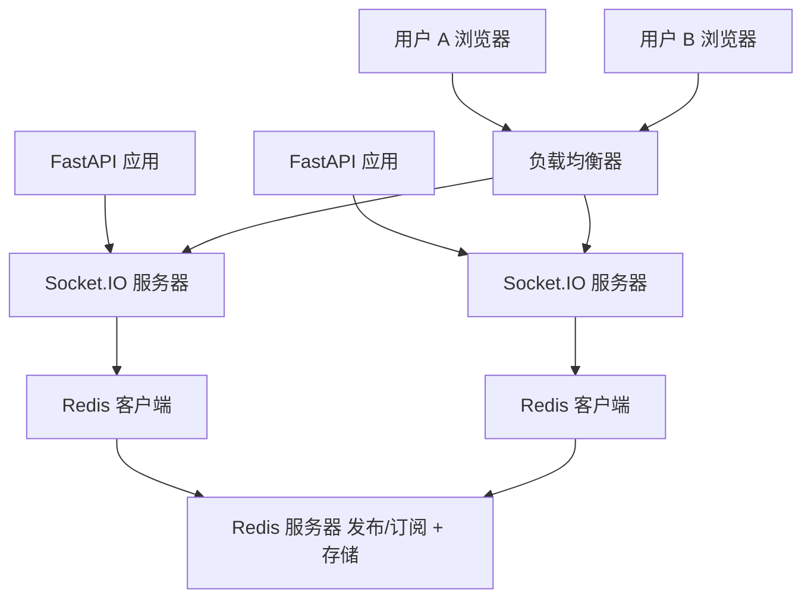
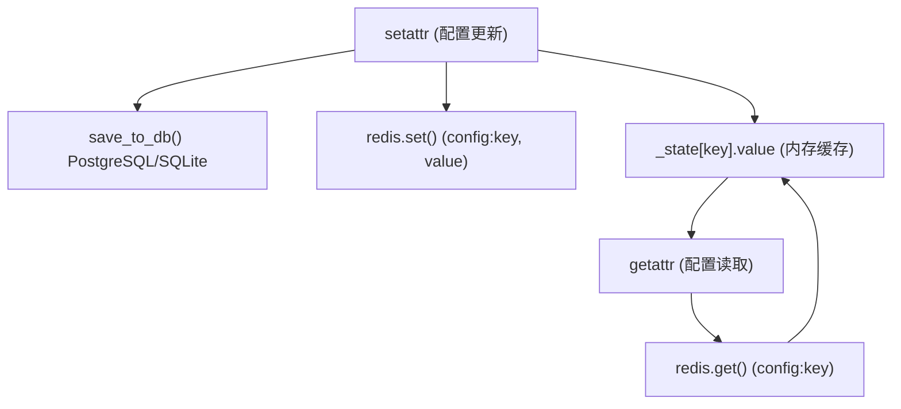
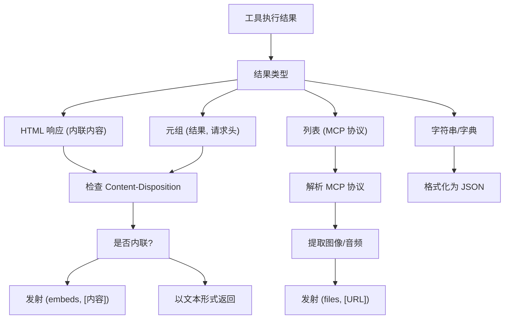

# 音频处理 (Audio Processing)

相关源文件

-   [backend/open\_webui/config.py](https://github.com/open-webui/open-webui/blob/a7271532/backend/open_webui/config.py)
-   [backend/open\_webui/main.py](https://github.com/open-webui/open-webui/blob/a7271532/backend/open_webui/main.py)
-   [backend/open\_webui/routers/audio.py](https://github.com/open-webui/open-webui/blob/a7271532/backend/open_webui/routers/audio.py)
-   [backend/open\_webui/utils/middleware.py](https://github.com/open-webui/open-webui/blob/a7271532/backend/open_webui/utils/middleware.py)

本文档记录了 WebSocket 基础设施，该设施支持 Open WebUI 前端和后端之间的实时双向通信。该系统支持实时状态更新、流式响应、文件传输和协作功能。

有关使用这些 WebSocket 事件的聊天处理流水线信息，请参阅 [后端处理流水线](/open-webui/open-webui/6-backend-processing-pipeline)。有关聊天界面中的前端事件处理，请参阅 [WebSocket 事件处理](/open-webui/open-webui/4.5-websocket-event-handling)。

**来源：** [backend/open\_webui/main.py63-69](https://github.com/open-webui/open-webui/blob/a7271532/backend/open_webui/main.py#L63-L69) [backend/open\_webui/env.py470](https://github.com/open-webui/open-webui/blob/a7271532/backend/open_webui/env.py#L470-L470)

## 系统概览

Open WebUI 的 WebSocket 架构提供了一个实时事件系统，作为基于 HTTP 的 API 的补充。该系统的设计目标包括：

-   **可选性**：可以通过 `ENABLE_WEBSOCKET_SUPPORT` 环境变量禁用。
-   **分布式**：使用 Redis 支持多实例部署。
-   **事件驱动**：支持双向事件通信 (emit/call)。
-   **基于房间 (Room-based)**：能够向特定会话或用户发送定向消息。

WebSocket 系统使用 Socket.IO 与 FastAPI 集成，并作为子应用与主 HTTP 路由并行挂载。

**来源：** [backend/open\_webui/main.py63-69](https://github.com/open-webui/open-webui/blob/a7271532/backend/open_webui/main.py#L63-L69) [backend/open\_webui/config.py470](https://github.com/open-webui/open-webui/blob/a7271532/backend/open_webui/config.py#L470-L470)

## WebSocket 应用挂载


Socket.IO 应用作为 `socket_app` 从 `open_webui.socket.main` 导入，并挂载到主 FastAPI 应用中。在应用的生命周期 (lifespan) 期间，会初始化 Redis 连接和后台任务。

**来源：** [backend/open\_webui/main.py63-69](https://github.com/open-webui/open-webui/blob/a7271532/backend/open_webui/main.py#L63-L69) [backend/open\_webui/main.py586-604](https://github.com/open-webui/open-webui/blob/a7271532/backend/open_webui/main.py#L586-L604) [backend/open\_webui/main.py629-631](https://github.com/open-webui/open-webui/blob/a7271532/backend/open_webui/main.py#L629-L631)

## 事件系统架构

WebSocket 系统为实时通信提供了两个主要的基元：

### 事件发射器 (Server → Client)

**事件发射器 (Event Emitter)** 从后端向已连接的客户端发送异步通知，而不期望得到响应。用于状态更新、流式内容和通知。


事件发射器通过 `extra_params` 字典（键名为 `__event_emitter__`）传递给中间件流水线。

**来源：** [backend/open\_webui/utils/middleware.py333-334](https://github.com/open-webui/open-webui/blob/a7271532/backend/open_webui/utils/middleware.py#L333-L334) [backend/open\_webui/utils/middleware.py439-458](https://github.com/open-webui/open-webui/blob/a7271532/backend/open_webui/utils/middleware.py#L439-L458)

### 事件调用者 (Server ↔ Client)

**事件调用者 (Event Caller)** 从后端向客户端发送同步请求并等待响应。用于工具执行、用户确认和交互式功能。


事件调用者使后端能够将执行任务委托给前端功能，例如访问剪贴板、本地存储或浏览器 API。

**来源：** [backend/open\_webui/utils/middleware.py377-422](https://github.com/open-webui/open-webui/blob/a7271532/backend/open_webui/utils/middleware.py#L377-L422)

## 事件类型与负载

该系统使用具有标准结构的类型化事件消息。以下是整个中间件流水线中使用的主要事件类型：

| 事件类型 | 方向 | 用途 | 负载结构 |
| --- | --- | --- | --- |
| `status` | Server → Client | 操作状态更新 | `{type: "status", data: {action, description, done, error?}}` |
| `files` | Server → Client | 文件/图像传输 | `{type: "files", data: {files: [{type, url}]}}` |
| `embeds` | Server → Client | UI 组件嵌入 | `{type: "embeds", data: {embeds: [html_content]}}` |
| `execute:tool` | Server ↔ Client | 直接工具执行 | `{type: "execute:tool", data: {id, name, params, server, session_id}}` |
| `citations` | Server → Client | 来源引用 | `{type: "citations", data: {citations: [...]}}` |

### 状态事件示例

> **[Mermaid stateDiagram]**
> *(图表结构无法解析)*

状态事件遵循一致的模式：初始事件带有 `done=false`，随后是带有 `done=true` 的完成事件，失败时可选配 `error=true`。

**来源：** [backend/open\_webui/utils/middleware.py559-713](https://github.com/open-webui/open-webui/blob/a7271532/backend/open_webui/utils/middleware.py#L559-L713) [backend/open\_webui/utils/middleware.py769-851](https://github.com/open-webui/open-webui/blob/a7271532/backend/open_webui/utils/middleware.py#L769-L851)

## 用于分布式部署的 Redis 集成

对于多实例部署，Redis 提供了一个消息代理，用于在服务器之间分发 WebSocket 事件。这确保了连接到不同后端实例的用户能够正确接收事件。


Redis 配置在应用生命周期期间使用 `get_redis_connection()` 建立，支持：

-   **标准 Redis**：单服务器实例。
-   **Redis Sentinel**：具有自动故障转移功能的高可用性。
-   **Redis Cluster**：分布式分片部署。

**来源：** [backend/open\_webui/main.py586-593](https://github.com/open-webui/open-webui/blob/a7271532/backend/open_webui/main.py#L586-L593) [backend/open\_webui/config.py224-283](https://github.com/open-webui/open-webui/blob/a7271532/backend/open_webui/config.py#L224-L283)

### Redis 连接初始化

Redis 连接设置发生在应用生命周期上下文管理器中：

```python
# 基于 main.py:586-593 的伪代码
app.state.redis = get_redis_connection(
    redis_url=REDIS_URL,
    redis_sentinels=get_sentinels_from_env(REDIS_SENTINEL_HOSTS, REDIS_SENTINEL_PORT),
    redis_cluster=REDIS_CLUSTER,
    async_mode=True,
)

if app.state.redis is not None:
    app.state.redis_task_command_listener = asyncio.create_task(
        redis_task_command_listener(app)
    )
```
`redis_task_command_listener` 是一个后台任务，用于监视 Redis 中的任务控制命令，从而实现跨实例的分布式任务管理。

**来源：** [backend/open\_webui/main.py586-598](https://github.com/open-webui/open-webui/blob/a7271532/backend/open_webui/main.py#L586-L598) [backend/open\_webui/main.py629-631](https://github.com/open-webui/open-webui/blob/a7271532/backend/open_webui/main.py#L629-L631)

## 通过 Redis 进行配置管理

启用 Redis 后，配置更改将使用 Redis 作为分布式缓存，在所有后端实例之间同步：


`AppConfig` 类实现了一个双层缓存系统：数据库作为主要存储，Redis 作为快速失效缓存，用于同步各实例间的配置。

**来源：** [backend/open\_webui/config.py224-283](https://github.com/open-webui/open-webui/blob/a7271532/backend/open_webui/config.py#L224-L283)

## 会话与房间管理

WebSocket 连接通过以下方式组织：

### 会话识别

每个聊天会话都会获得一个唯一的 `session_id`，该 ID 通过事件元数据传递。此标识符用于：

-   将事件路由到特定的客户端连接。
-   管理工具执行上下文。
-   追踪文件上传及关联。

```python
# 来自 middleware.py 工具执行上下文
metadata = {
    "chat_id": metadata.get("chat_id", None),
    "message_id": metadata.get("message_id", None),
    "session_id": metadata.get("session_id", None),
}
```
**来源：** [backend/open\_webui/utils/middleware.py250-256](https://github.com/open-webui/open-webui/blob/a7271532/backend/open_webui/utils/middleware.py#L250-L256) [backend/open\_webui/utils/middleware.py410-417](https://github.com/open-webui/open-webui/blob/a7271532/backend/open_webui/utils/middleware.py#L410-L417)

### 基于房间的广播

事件可以针对：

-   **特定会话**：单个用户的活跃聊天会话。
-   **用户房间**：特定用户的所有会话。
-   **全局广播**：所有已连接的客户端（管理员功能）。

`MODELS` 字典追踪各会话中的活跃模型使用情况，以便进行资源管理和清理。

**来源：** [backend/open\_webui/main.py64](https://github.com/open-webui/open-webui/blob/a7271532/backend/open_webui/main.py#L64-L64)

## 聊天流水线中的事件流

下图展示了 WebSocket 事件如何与聊天处理中间件集成：

> **[Mermaid sequence]**
> *(图表结构无法解析)*

事件在流水线的关键阶段发射：在昂贵的操作（网页搜索、图像生成）之前、工具执行期间、传输文件/嵌入项时以及流式响应期间。

**来源：** [backend/open\_webui/utils/middleware.py555-714](https://github.com/open-webui/open-webui/blob/a7271532/backend/open_webui/utils/middleware.py#L555-L714) [backend/open\_webui/utils/middleware.py755-851](https://github.com/open-webui/open-webui/blob/a7271532/backend/open_webui/utils/middleware.py#L755-L851)

## 定期清理任务

WebSocket 系统包含后台维护任务：

### 使用池清理

`periodic_usage_pool_cleanup()` 持续运行以管理 `MODELS` 字典，该字典追踪活跃的模型使用情况。这可以防止由于遗弃会话导致的内存泄漏，并为资源监控提供指标。

```python
# 来自 main.py:604
asyncio.create_task(periodic_usage_pool_cleanup())
```
此任务在应用启动时创建，并在应用的整个生命周期内运行。

**来源：** [backend/open\_webui/main.py604](https://github.com/open-webui/open-webui/blob/a7271532/backend/open_webui/main.py#L604-L604)

### Redis 任务命令监听器

当 Redis 可用时，会有一个专门的任务监听 Redis 发布/订阅频道，以接收分布式任务命令：

```python
# 来自 main.py:595-598
if app.state.redis is not None:
    app.state.redis_task_command_listener = asyncio.create_task(
        redis_task_command_listener(app)
    )
```
此监听器在应用关闭期间被取消，以确保干净的终止。

**来源：** [backend/open\_webui/main.py595-598](https://github.com/open-webui/open-webui/blob/a7271532/backend/open_webui/main.py#L595-L598) [backend/open\_webui/main.py629-631](https://github.com/open-webui/open-webui/blob/a7271532/backend/open_webui/main.py#L629-L631)

## 工具结果处理

工具执行结果可能包含触发 WebSocket 事件的特殊响应类型：


`process_tool_result()` 函数负责处理这些转换，提取可嵌入内容（HTML iframe）和文件附件（图像、音频），并作为独立的 WebSocket 事件发射。

**来源：** [backend/open\_webui/utils/middleware.py143-283](https://github.com/open-webui/open-webui/blob/a7271532/backend/open_webui/utils/middleware.py#L143-L283)

## 与中间件流水线的集成

WebSocket 事件处理程序作为 `extra_params` 字典的一部分在中间件流水线中传递：

| 键名 | 类型 | 用途 |
| --- | --- | --- |
| `__event_emitter__` | `异步可调用对象` | 向客户端发送事件 (无响应) |
| `__event_call__` | `异步可调用对象` | 与客户端进行请求/响应交互 |
| `__metadata__` | `字典` | 会话上下文 (chat\_id, message\_id, session\_id) |

这些在聊天补全处理程序的入口点被注入，并贯穿所有的中间件函数：

```python
# 贯穿 middleware.py 的伪代码模式
async def chat_web_search_handler(request, form_data, extra_params, user):
    event_emitter = extra_params["__event_emitter__"]

    await event_emitter({
        "type": "status",
        "data": {"action": "web_search", "done": False}
    })

    # ... 执行操作 ...

    await event_emitter({
        "type": "status",
        "data": {"action": "web_search", "done": True}
    })
```
**来源：** [backend/open\_webui/utils/middleware.py332-334](https://github.com/open-webui/open-webui/blob/a7271532/backend/open_webui/utils/middleware.py#L332-L334) [backend/open\_webui/utils/middleware.py555-625](https://github.com/open-webui/open-webui/blob/a7271532/backend/open_webui/utils/middleware.py#L555-L625)

## 环境配置

WebSocket 支持由环境变量控制：

| 变量名 | 默认值 | 用途 |
| --- | --- | --- |
| `ENABLE_WEBSOCKET_SUPPORT` | \- | 启用/禁用 WebSocket 功能 |
| `REDIS_URL` | \- | 分布式模式下的 Redis 连接 URL |
| `REDIS_CLUSTER` | `False` | 使用 Redis 集群而非单机模式 |
| `REDIS_SENTINEL_HOSTS` | \- | 以逗号分隔的哨兵 (Sentinel) 主机列表 |
| `REDIS_SENTINEL_PORT` | \- | 哨兵端口号 |
| `REDIS_KEY_PREFIX` | `open-webui` | 所有 Redis 键的前缀 |

当未配置 `REDIS_URL` 时，WebSocket 事件仅在单个服务器实例内分发。

**来源：** [backend/open\_webui/env.py447-451](https://github.com/open-webui/open-webui/blob/a7271532/backend/open_webui/env.py#L447-L451) [backend/open\_webui/config.py224-236](https://github.com/open-webui/open-webui/blob/a7271532/backend/open_webui/config.py#L224-L236)
