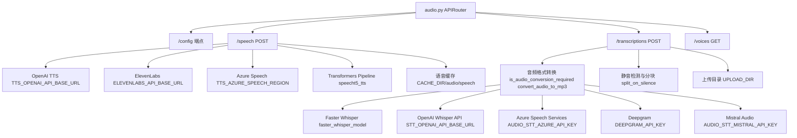
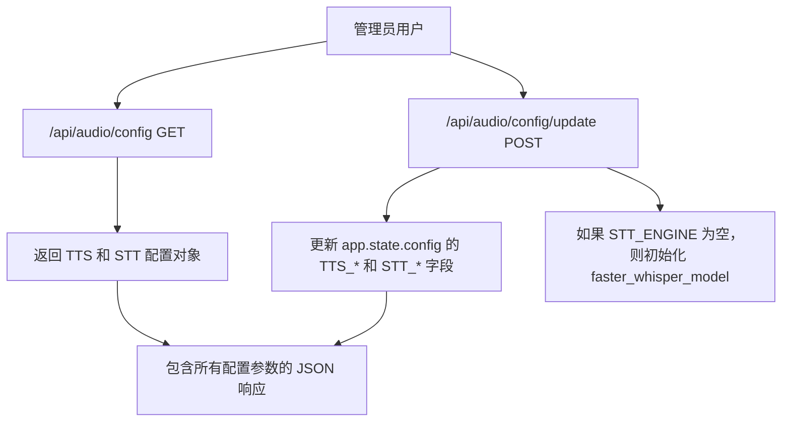
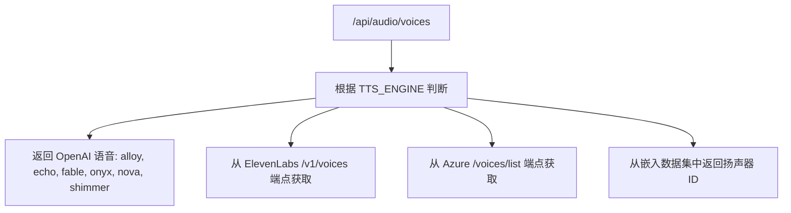
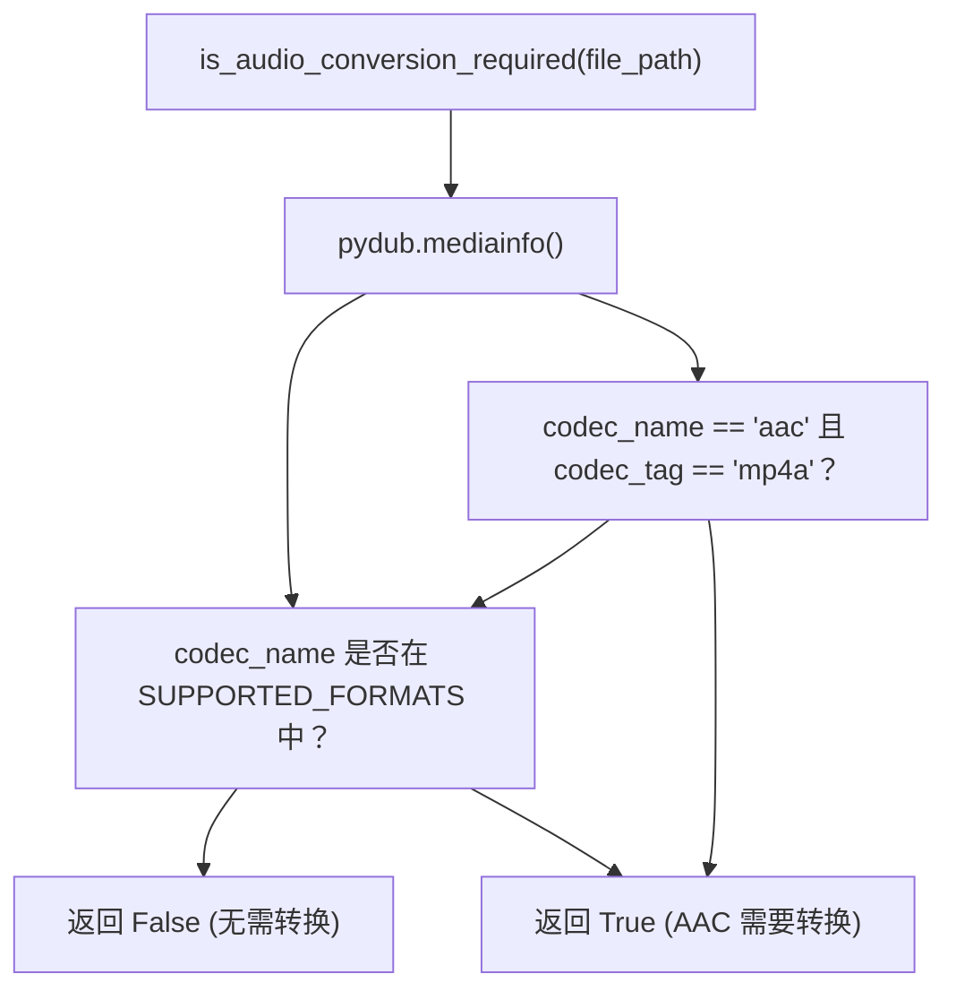

# 音频处理

相关源文件

-   [backend/open\_webui/env.py](https://github.com/open-webui/open-webui/blob/a7271532/backend/open_webui/env.py)
-   [backend/open\_webui/routers/audio.py](https://github.com/open-webui/open-webui/blob/a7271532/backend/open_webui/routers/audio.py)
-   [backend/open\_webui/routers/auths.py](https://github.com/open-webui/open-webui/blob/a7271532/backend/open_webui/routers/auths.py)
-   [backend/open\_webui/routers/ollama.py](https://github.com/open-webui/open-webui/blob/a7271532/backend/open_webui/routers/ollama.py)
-   [backend/open\_webui/routers/openai.py](https://github.com/open-webui/open-webui/blob/a7271532/backend/open_webui/routers/openai.py)
-   [backend/open\_webui/utils/auth.py](https://github.com/open-webui/open-webui/blob/a7271532/backend/open_webui/utils/auth.py)
-   [backend/open\_webui/utils/embeddings.py](https://github.com/open-webui/open-webui/blob/a7271532/backend/open_webui/utils/embeddings.py)
-   [backend/open\_webui/utils/misc.py](https://github.com/open-webui/open-webui/blob/a7271532/backend/open_webui/utils/misc.py)
-   [backend/open\_webui/utils/oauth.py](https://github.com/open-webui/open-webui/blob/a7271532/backend/open_webui/utils/oauth.py)
-   [backend/open\_webui/utils/response.py](https://github.com/open-webui/open-webui/blob/a7271532/backend/open_webui/utils/response.py)

## 目的和范围

本文档涵盖了 Open WebUI 中的音频处理子系统，该子系统通过文本转语音 (TTS) 和语音转文本 (STT) 功能，实现了与 AI 模型的语音交互。这些系统支持多个后端引擎和提供商，允许从云服务到完全本地实现的各种灵活部署方案。

有关 LLM 集成和模型管理的信息，请参阅 [LLM 提供商集成](/open-webui/open-webui/13-llm-provider-integration)。

**来源：** [backend/open\_webui/routers/audio.py1-900](https://github.com/open-webui/open-webui/blob/a7271532/backend/open_webui/routers/audio.py#L1-L900)

---

## 系统架构


**来源：** [backend/open\_webui/routers/audio.py1-900](https://github.com/open-webui/open-webui/blob/a7271532/backend/open_webui/routers/audio.py#L1-L900) [backend/open\_webui/config.py1-100](https://github.com/open-webui/open-webui/blob/a7271532/backend/open_webui/config.py#L1-L100)

---

## 配置系统

音频配置通过持久化的应用程序配置进行管理，并为 TTS 和 STT 设置提供了专用表单。

### 配置模型

| 模型 | 用途 | 关键字段 |
| --- | --- | --- |
| `TTSConfigForm` | TTS 引擎设置 | `ENGINE`, `MODEL`, `VOICE`, `OPENAI_API_BASE_URL`, `API_KEY`, `SPLIT_ON`, `AZURE_SPEECH_REGION` |
| `STTConfigForm` | STT 引擎设置 | `ENGINE`, `MODEL`, `WHISPER_MODEL`, `DEEPGRAM_API_KEY`, `AZURE_API_KEY`, `MISTRAL_API_KEY`, `SUPPORTED_CONTENT_TYPES` |
| `AudioConfigUpdateForm` | 组合更新表单 | `tts: TTSConfigForm`, `stt: STTConfigForm` |

**来源：** [backend/open\_webui/routers/audio.py155-189](https://github.com/open-webui/open-webui/blob/a7271532/backend/open_webui/routers/audio.py#L155-L189)

### 配置端点


`GET /api/audio/config` 端点用于获取当前配置：

```
{
  "tts": {
    "OPENAI_API_BASE_URL": "...",
    "OPENAI_API_KEY": "...",
    "ENGINE": "openai",
    "MODEL": "tts-1",
    "VOICE": "alloy",
    "SPLIT_ON": "sentence",
    ...
  },
  "stt": {
    "OPENAI_API_BASE_URL": "...",
    "ENGINE": "whisper",
    "MODEL": "whisper-1",
    "WHISPER_MODEL": "base",
    ...
  }
}
```
`POST /api/audio/config/update` 端点用于更新配置，并在需要时重新初始化 Whisper 模型。

**来源：** [backend/open\_webui/routers/audio.py192-311](https://github.com/open-webui/open-webui/blob/a7271532/backend/open_webui/routers/audio.py#L192-L311)

---

## 文本转语音 (TTS) 系统

TTS 系统使用可配置的后端引擎将文本转换为语音音频文件，并集成了缓存层以避免重复生成。

### 支持的引擎

| 引擎 | 配置值 | 要求 | 模型 |
| --- | --- | --- | --- |
| OpenAI | `TTS_ENGINE="openai"` | `TTS_OPENAI_API_BASE_URL`, `TTS_OPENAI_API_KEY` | `tts-1`, `tts-1-hd` |
| ElevenLabs | `TTS_ENGINE="elevenlabs"` | `TTS_API_KEY`, `ELEVENLABS_API_BASE_URL` | `eleven_monolingual_v1`, `eleven_multilingual_v2` |
| Azure Speech | `TTS_ENGINE="azure"` | `TTS_AZURE_SPEECH_REGION`, `TTS_AZURE_SPEECH_OUTPUT_FORMAT` | 各种神经语音 |
| Transformers | `TTS_ENGINE="transformers"` | 本地模型, 扬声器嵌入数据集 | `microsoft/speecht5_tts` |

**来源：** [backend/open\_webui/routers/audio.py329-600](https://github.com/open-webui/open-webui/blob/a7271532/backend/open_webui/routers/audio.py#L329-L600)

### 请求处理流程

> **[Mermaid sequence]**
> *(图表结构无法解析)*

缓存机制对请求体以及引擎/模型标识符进行 SHA256 哈希处理，以生成唯一的缓存键。音频文件和原始请求 JSON 都会被存储。

**来源：** [backend/open\_webui/routers/audio.py329-600](https://github.com/open-webui/open-webui/blob/a7271532/backend/open_webui/routers/audio.py#L329-L600)

### OpenAI TTS 实现

对于 OpenAI 引擎，系统会：

1.  将 `payload["model"]` 设置为 `request.app.state.config.TTS_MODEL`
2.  合并 `TTS_OPENAI_PARAMS` 以获取额外参数
3.  向 `{TTS_OPENAI_API_BASE_URL}/audio/speech` 发起异步 POST 请求
4.  如果 `ENABLE_FORWARD_USER_INFO_HEADERS` 为 true，则包含用户信息标头
5.  将响应保存到缓存目录并返回 `FileResponse`

**来源：** [backend/open\_webui/routers/audio.py353-410](https://github.com/open-webui/open-webui/blob/a7271532/backend/open_webui/routers/audio.py#L353-L410)

### ElevenLabs TTS 实现

对于 ElevenLabs 引擎：

1.  从载荷中提取 `voice_id`，并对照 `get_available_voices()` 进行验证
2.  向 `{ELEVENLABS_API_BASE_URL}/v1/text-to-speech/{voice_id}` 发送 POST 请求
3.  使用 `TTS_MODEL`（例如 `eleven_monolingual_v1`）以及默认语音设置
4.  返回缓存的音频文件

**来源：** [backend/open\_webui/routers/audio.py412-461](https://github.com/open-webui/open-webui/blob/a7271532/backend/open_webui/routers/audio.py#L412-L461)

### Azure Speech TTS 实现

Azure Speech 使用具有 SSML 格式的 Speech SDK：

1.  使用配置的语音和语言构建 SSML XML
2.  使用 `TTS_AZURE_SPEECH_OUTPUT_FORMAT`（默认：`audio-24khz-48kbitrate-mono-mp3`）
3.  支持通过 `TTS_SPLIT_ON` 在句子或段落边界进行文本拆分
4.  使用 `ThreadPoolExecutor` 并行处理各个分块以进行合成
5.  使用 `pydub.AudioSegment` 拼接音频片段

**来源：** [backend/open\_webui/routers/audio.py462-550](https://github.com/open-webui/open-webui/blob/a7271532/backend/open_webui/routers/audio.py#L462-L550)

### Transformers (本地) TTS 实现

本地 Transformers 管道：

1.  在首次使用时通过 `load_speech_pipeline()` 延迟加载管道
2.  使用来自 HuggingFace 的 `microsoft/speecht5_tts` 模型
3.  从 `Matthijs/cmu-arctic-xvectors` 数据集加载扬声器嵌入
4.  使用 `pipeline(text, forward_params={"speaker_embeddings": ...})` 生成音频
5.  使用 `scipy` 和 `pydub` 导出为 MP3 格式

**来源：** [backend/open\_webui/routers/audio.py314-327](https://github.com/open-webui/open-webui/blob/a7271532/backend/open_webui/routers/audio.py#L314-L327) [backend/open\_webui/routers/audio.py551-600](https://github.com/open-webui/open-webui/blob/a7271532/backend/open_webui/routers/audio.py#L551-L600)

### 语音管理

`/api/audio/voices` 端点根据配置的引擎返回可用的语音：


**来源：** [backend/open\_webui/routers/audio.py602-700](https://github.com/open-webui/open-webui/blob/a7271532/backend/open_webui/routers/audio.py#L602-L700)

---

## 语音转文本 (STT) 系统

STT 系统使用多个后端引擎将音频文件转录为文本，并具备格式转换的预处理功能以及针对大文件的可选分块功能。

### 支持的引擎

| 引擎 | 配置值 | 要求 | 特性 |
| --- | --- | --- | --- |
| Faster Whisper | `STT_ENGINE=""` (默认) | `WHISPER_MODEL` (例如 `base`, `medium`, `large-v3`) | 本地推理、CUDA 支持、语言检测 |
| OpenAI Whisper | `STT_ENGINE="openai"` | `STT_OPENAI_API_BASE_URL`, `STT_OPENAI_API_KEY` | 云端 API、提示词支持 |
| Azure Speech | `STT_ENGINE="azure"` | `AUDIO_STT_AZURE_API_KEY`, `AUDIO_STT_AZURE_REGION` | 说话人日志 (Speaker diarization)、多语言支持 |
| Deepgram | `STT_ENGINE="deepgram"` | `DEEPGRAM_API_KEY` | 实时流式传输支持 |
| Mistral | `STT_ENGINE="mistral"` | `AUDIO_STT_MISTRAL_API_KEY` | 聊天完成或音频/转录端点 |

**来源：** [backend/open\_webui/routers/audio.py701-900](https://github.com/open-webui/open-webui/blob/a7271532/backend/open_webui/routers/audio.py#L701-L900)

### 请求处理流程

> **[Mermaid sequence]**
> *(图表结构无法解析)*

**来源：** [backend/open\_webui/routers/audio.py701-900](https://github.com/open-webui/open-webui/blob/a7271532/backend/open_webui/routers/audio.py#L701-L900)

### 音频格式转换

系统对音频文件进行验证和转换以确保兼容性：


`convert_audio_to_mp3()` 函数使用 `pydub.AudioSegment` 转码为 MP3 格式。

**来源：** [backend/open\_webui/routers/audio.py81-122](https://github.com/open-webui/open-webui/blob/a7271532/backend/open_webui/routers/audio.py#L81-L122)

### 文件大小限制

| 引擎 | 最大大小 | 常量 |
| --- | --- | --- |
| 默认 | 20 MB | `MAX_FILE_SIZE` |
| Azure | 200 MB | `AZURE_MAX_FILE_SIZE` |

**来源：** [backend/open\_webui/routers/audio.py60-63](https://github.com/open-webui/open-webui/blob/a7271532/backend/open_webui/routers/audio.py#L60-L63)

### Faster Whisper (本地) 实现

本地 Whisper 实现使用 `faster-whisper` 以实现高效的 CPU/GPU 推理：

1.  通过 `set_faster_whisper_model()` 初始化模型：
    -   如果 `WHISPER_MODEL_DIR` 中不存在模型，则下载该模型
    -   如果 `DEVICE_TYPE == "cuda"` 则使用 CUDA，否则使用 CPU
    -   支持使用 `compute_type="int8"` 进行量化
2.  大文件分块：
    -   对于超过 20MB 的文件，使用 `split_on_silence()` 检测静音
    -   使用 `ThreadPoolExecutor` 分别处理各个分块
    -   拼接转录结果
3.  转录参数：
    -   `language`：自动检测或使用 `WHISPER_LANGUAGE`
    -   `initial_prompt`：可选上下文以提高准确性
    -   如果请求，则返回带有时间戳的片段

**来源：** [backend/open\_webui/routers/audio.py124-146](https://github.com/open-webui/open-webui/blob/a7271532/backend/open_webui/routers/audio.py#L124-L146) [backend/open\_webui/routers/audio.py701-780](https://github.com/open-webui/open-webui/blob/a7271532/backend/open_webui/routers/audio.py#L701-L780)

### OpenAI Whisper API 实现

对于 OpenAI Whisper 引擎：

1.  向 `{STT_OPENAI_API_BASE_URL}/audio/transcriptions` 发送 multipart/form-data POST 请求
2.  包含文件、模型、语言和提示词参数
3.  根据请求设置 `response_format`（默认：`json`）
4.  解析响应并返回文本

**来源：** [backend/open\_webui/routers/audio.py781-820](https://github.com/open-webui/open-webui/blob/a7271532/backend/open_webui/routers/audio.py#L781-L820)

### Azure Speech Services 实现

Azure Speech 支持高级特性：

1.  **说话人日志 (Speaker Diarization)**：当 `AUDIO_STT_AZURE_MAX_SPEAKERS` > 1 时
    -   使用 `/speechtotext/transcriptions:transcribe` 端点
    -   返回带有说话人标签的转录内容
    -   格式化输出并带有时间戳
2.  **多语言支持**：支持 `AUDIO_STT_AZURE_LOCALES` 中的逗号分隔语言列表
3.  **身份验证**：在 `Ocp-Apim-Subscription-Key` 标头中使用 `AUDIO_STT_AZURE_API_KEY`

**来源：** [backend/open\_webui/routers/audio.py821-857](https://github.com/open-webui/open-webui/blob/a7271532/backend/open_webui/routers/audio.py#L821-L857)

### Deepgram 实现

Deepgram 转录流程：

1.  向 `https://api.deepgram.com/v1/listen` 发送音频文件 POST 请求
2.  使用查询参数：`model`, `language`, `detect_language=true`
3.  解析嵌套响应：`response["results"]["channels"][0]["alternatives"][0]["transcript"]`

**来源：** [backend/open\_webui/routers/audio.py858-880](https://github.com/open-webui/open-webui/blob/a7271532/backend/open_webui/routers/audio.py#L858-L880)

### Mistral Audio 实现

Mistral 通过 `AUDIO_STT_MISTRAL_USE_CHAT_COMPLETIONS` 支持两种模式：

1.  **聊天完成模式**：
    -   向 `/v1/chat/completions` 发送 POST 请求，图像内容类型为 `audio_url`
    -   从聊天响应中提取文本
2.  **音频转录模式**：
    -   向 `/v1/audio/transcriptions` 端点发送 POST 请求
    -   标准的转录响应格式

**来源：** [backend/open\_webui/routers/audio.py881-900](https://github.com/open-webui/open-webui/blob/a7271532/backend/open_webui/routers/audio.py#L881-L900)

---

## API 端点参考

| 端点 | 方法 | 权限 | 用途 |
| --- | --- | --- | --- |
| `/api/audio/config` | GET | 管理员 | 检索 TTS/STT 配置 |
| `/api/audio/config/update` | POST | 管理员 | 更新 TTS/STT 配置 |
| `/api/audio/speech` | POST | 用户 | 将文本生成为语音 (TTS) |
| `/api/audio/transcriptions` | POST | 用户 | 将音频转录为文本 (STT) |
| `/api/audio/voices` | GET | 用户 | 列出当前 TTS 引擎的可用语音 |

**来源：** [backend/open\_webui/routers/audio.py57-900](https://github.com/open-webui/open-webui/blob/a7271532/backend/open_webui/routers/audio.py#L57-L900)

### 请求/响应示例

**TTS 请求：**

```
{
  "model": "tts-1",
  "input": "Hello, this is a test.",
  "voice": "alloy"
}
```
**TTS 响应：** 二进制音频文件 (MP3 格式)

**STT 请求：** 包含以下内容的 Multipart form-data：

-   `file`: 音频文件 (mp3, wav, m4a 等)
-   `model`: 可选的模型标识符
-   `language`: 可选的语言代码
-   `prompt`: 可选的上下文以提高准确性

**STT 响应：**

```
{
  "text": "Hello, this is a test."
}
```
**来源：** [backend/open\_webui/routers/audio.py329-900](https://github.com/open-webui/open-webui/blob/a7271532/backend/open_webui/routers/audio.py#L329-L900)

---

## 缓存策略

TTS 响应被积极缓存，以降低 API 成本并缩短响应时间。

### 缓存键生成

```
# 缓存键 = SHA256(request_body + TTS_ENGINE + TTS_MODEL)
name = hashlib.sha256(
    body
    + str(request.app.state.config.TTS_ENGINE).encode("utf-8")
    + str(request.app.state.config.TTS_MODEL).encode("utf-8")
).hexdigest()

file_path = SPEECH_CACHE_DIR / f"{name}.mp3"
file_body_path = SPEECH_CACHE_DIR / f"{name}.json"
```
缓存存储以下内容：

1.  **音频文件**：`{hash}.mp3` - 生成的音频
2.  **请求元数据**：`{hash}.json` - 原始请求参数

这确保了相同的请求会返回缓存的响应，而无需调用外部 API。

**来源：** [backend/open\_webui/routers/audio.py67-68](https://github.com/open-webui/open-webui/blob/a7271532/backend/open_webui/routers/audio.py#L67-L68) [backend/open\_webui/routers/audio.py332-343](https://github.com/open-webui/open-webui/blob/a7271532/backend/open_webui/routers/audio.py#L332-L343)

---

## 与聊天系统的集成

音频处理通过以下方式与主聊天界面集成：

1.  **消息播放**：使用消息内容调用 TTS 端点
2.  **语音输入**：STT 端点处理录制的音频，将文本插入到消息输入框中
3.  **用户标头**：`ENABLE_FORWARD_USER_INFO_HEADERS` 将用户上下文传播到外部 API
4.  **元数据**：标头中包含聊天 ID，以便进行追踪和审计

**来源：** [backend/open\_webui/routers/audio.py370-371](https://github.com/open-webui/open-webui/blob/a7271532/backend/open_webui/routers/audio.py#L370-L371) [backend/open\_webui/env.py52-54](https://github.com/open-webui/open-webui/blob/a7271532/backend/open_webui/env.py#L52-L54)

---

## 环境配置

音频处理的关键环境变量：

### 文本转语音 (TTS)

-   `TTS_ENGINE`：引擎选择 (openai, elevenlabs, azure, transformers)
-   `TTS_OPENAI_API_BASE_URL`, `TTS_OPENAI_API_KEY`：OpenAI 配置
-   `TTS_API_KEY`：ElevenLabs API 密钥
-   `TTS_MODEL`：当前引擎的模型标识符
-   `TTS_VOICE`：语音标识符
-   `TTS_SPLIT_ON`：文本拆分策略 (sentence, paragraph)
-   `TTS_AZURE_SPEECH_REGION`, `TTS_AZURE_SPEECH_OUTPUT_FORMAT`：Azure 配置

### 语音转文本 (STT)

-   `STT_ENGINE`：引擎选择（本地 Whisper 留空, openai, azure, deepgram, mistral）
-   `STT_OPENAI_API_BASE_URL`, `STT_OPENAI_API_KEY`：OpenAI 配置
-   `WHISPER_MODEL`：本地 Whisper 模型大小 (base, medium, large-v3)
-   `WHISPER_MODEL_DIR`：下载的 Whisper 模型的目录
-   `WHISPER_MODEL_AUTO_UPDATE`：自动下载最新的模型版本
-   `WHISPER_LANGUAGE`：转录的默认语言
-   `DEEPGRAM_API_KEY`：Deepgram API 密钥
-   `AUDIO_STT_AZURE_API_KEY`, `AUDIO_STT_AZURE_REGION`：Azure 配置
-   `AUDIO_STT_MISTRAL_API_KEY`, `AUDIO_STT_MISTRAL_API_BASE_URL`：Mistral 配置

### 系统 (System)

-   `CACHE_DIR`：基础缓存目录（包含 `audio/speech` 子目录）
-   `DEVICE_TYPE`：硬件加速 (cpu, cuda, mps)
-   `ENABLE_FORWARD_USER_INFO_HEADERS`：在 API 请求中包含用户上下文

**来源：** [backend/open\_webui/env.py1-889](https://github.com/open-webui/open-webui/blob/a7271532/backend/open_webui/env.py#L1-L889) [backend/open\_webui/config.py40-45](https://github.com/open-webui/open-webui/blob/a7271532/backend/open_webui/config.py#L40-L45)
