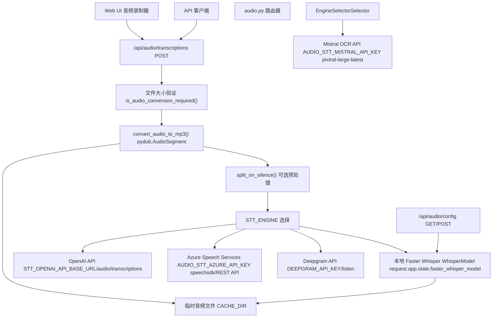
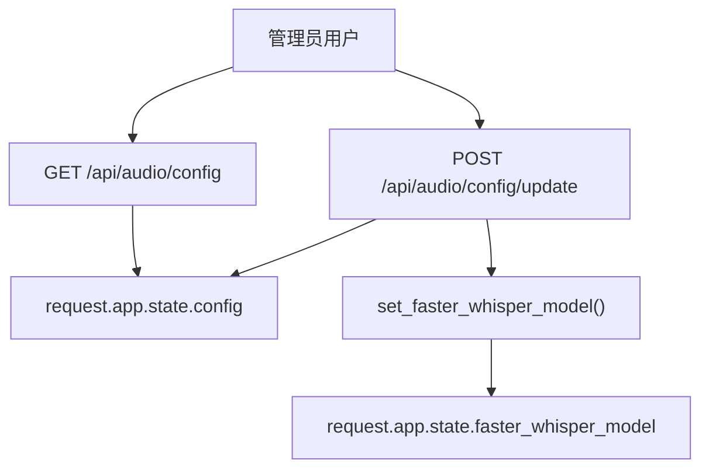
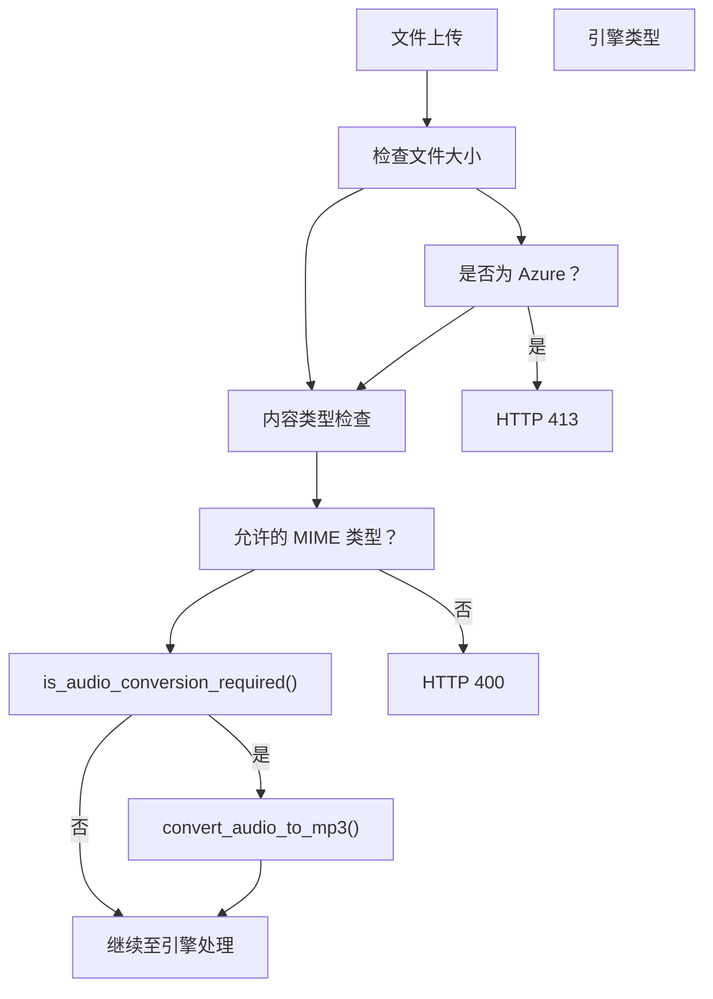
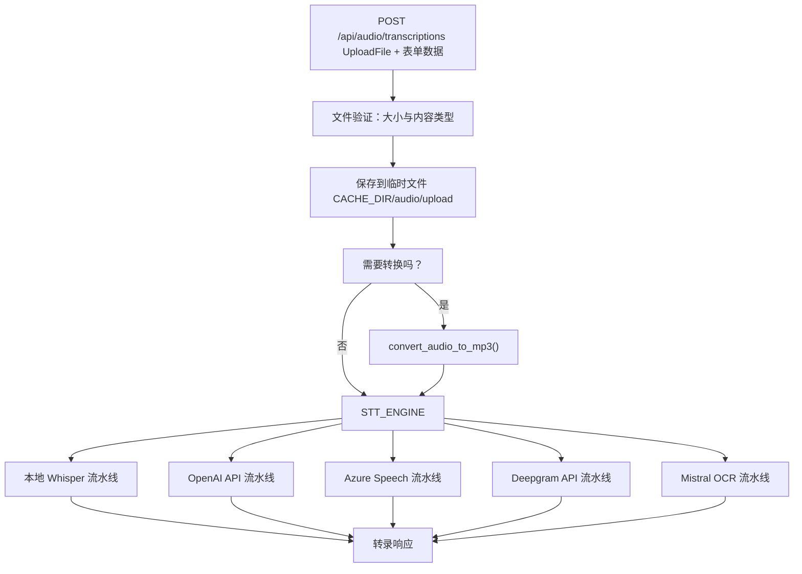
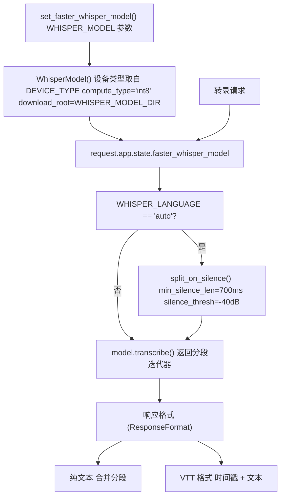
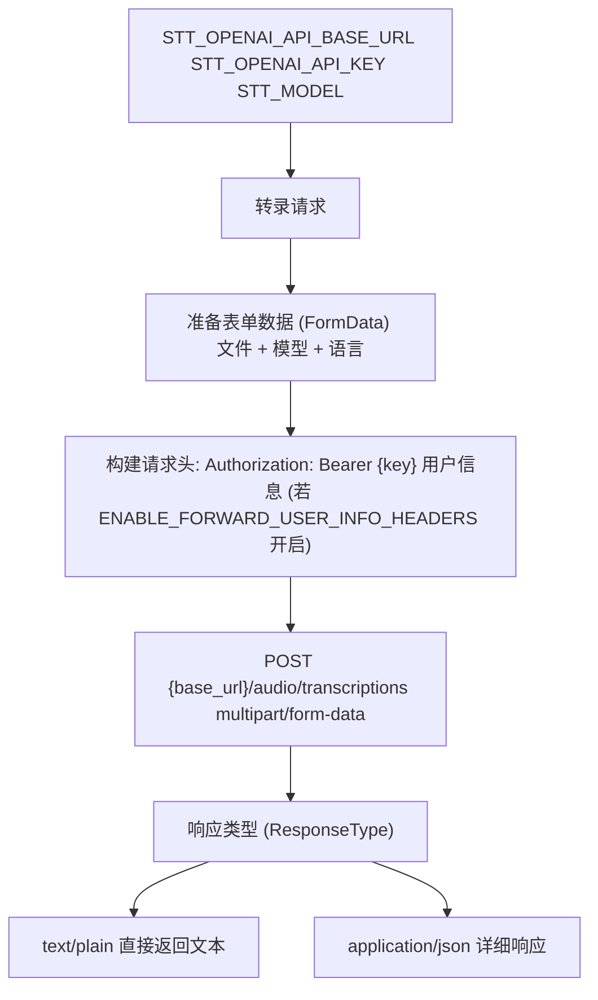
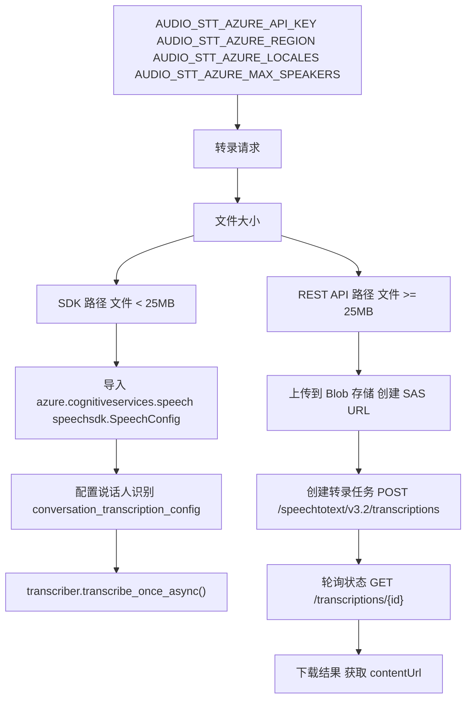
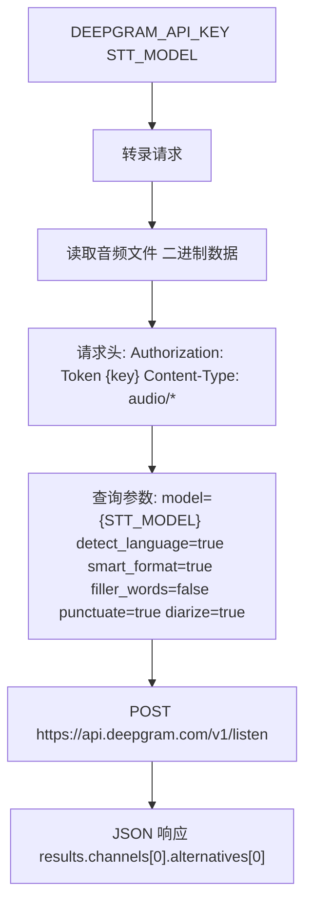
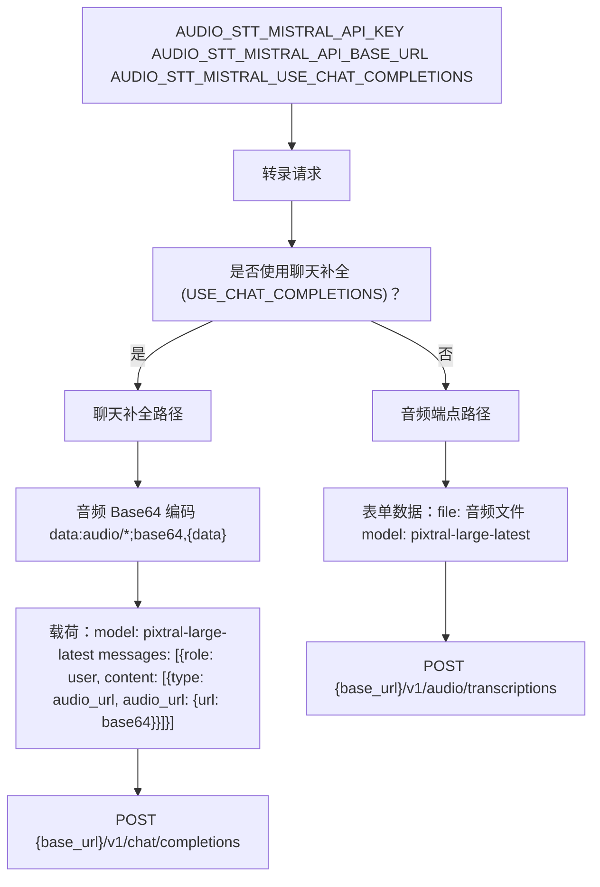

# 语音转文本系统

相关源文件

-   [backend/open\_webui/env.py](https://github.com/open-webui/open-webui/blob/a7271532/backend/open_webui/env.py)
-   [backend/open\_webui/routers/audio.py](https://github.com/open-webui/open-webui/blob/a7271532/backend/open_webui/routers/audio.py)
-   [backend/open\_webui/routers/auths.py](https://github.com/open-webui/open-webui/blob/a7271532/backend/open_webui/routers/auths.py)
-   [backend/open\_webui/routers/ollama.py](https://github.com/open-webui/open-webui/blob/a7271532/backend/open_webui/routers/ollama.py)
-   [backend/open\_webui/routers/openai.py](https://github.com/open-webui/open-webui/blob/a7271532/backend/open_webui/routers/openai.py)
-   [backend/open\_webui/utils/auth.py](https://github.com/open-webui/open-webui/blob/a7271532/backend/open_webui/utils/auth.py)
-   [backend/open\_webui/utils/embeddings.py](https://github.com/open-webui/open-webui/blob/a7271532/backend/open_webui/utils/embeddings.py)
-   [backend/open\_webui/utils/misc.py](https://github.com/open-webui/open-webui/blob/a7271532/backend/open_webui/utils/misc.py)
-   [backend/open\_webui/utils/oauth.py](https://github.com/open-webui/open-webui/blob/a7271532/backend/open_webui/utils/oauth.py)
-   [backend/open\_webui/utils/response.py](https://github.com/open-webui/open-webui/blob/a7271532/backend/open_webui/utils/response.py)

## 目的与范围

本文档涵盖了 Open WebUI 中的语音转文本 (STT) 系统，该系统将音频录音转换为文本转录。该系统支持多种转录引擎，包括本地 Whisper 模型、OpenAI API、Azure Speech Services、Deepgram 以及 Mistral OCR。有关文本转语音功能，请参阅 [14.1](/open-webui/open-webui/14.1-text-to-speech-system)。

## 系统架构

STT 系统在 [backend/open\_webui/routers/audio.py](https://github.com/open-webui/open-webui/blob/a7271532/backend/open_webui/routers/audio.py) 中实现，并提供了一个统一的 API 接口，根据配置将转录请求路由到不同的后端引擎。在发送到选定引擎之前，系统会处理音频格式转换、文件大小验证以及预处理。


**来源：** [backend/open\_webui/routers/audio.py57-1089](https://github.com/open-webui/open-webui/blob/a7271532/backend/open_webui/routers/audio.py#L57-L1089)

## 配置系统

STT 系统通过 `STTConfigForm` 模型进行配置，并持久化存储在 `request.app.state.config` 中。配置可以通过管理员 API 进行更新。

### 配置数据模型

| 字段 | 类型 | 用途 |
| --- | --- | --- |
| `OPENAI_API_BASE_URL` | str | 兼容 OpenAI 的 API 基准 URL |
| `OPENAI_API_KEY` | str | OpenAI 服务的 API 密钥 |
| `ENGINE` | str | 选定的引擎："" (默认), "openai", "azure", "deepgram", "mistral" |
| `MODEL` | str | 选定引擎的模型标识符 |
| `SUPPORTED_CONTENT_TYPES` | list[str] | 允许上传的 MIME 类型 |
| `WHISPER_MODEL` | str | 本地 Whisper 模型名称 (tiny, base, small, medium, large) |
| `DEEPGRAM_API_KEY` | str | Deepgram 服务 API 密钥 |
| `AZURE_API_KEY` | str | Azure Speech Services 密钥 |
| `AZURE_REGION` | str | Azure 部署区域 |
| `AZURE_LOCALES` | str | Azure 逗号分隔的区域代码 |
| `AZURE_BASE_URL` | str | 自定义 Azure 端点 URL |
| `AZURE_MAX_SPEAKERS` | str | 说话人识别的最大人数 |
| `MISTRAL_API_KEY` | str | Mistral API 密钥 |
| `MISTRAL_API_BASE_URL` | str | Mistral API 端点 |
| `MISTRAL_USE_CHAT_COMPLETIONS` | bool | 使用聊天补全端点 vs. 音频端点 |

**来源：** [backend/open\_webui/routers/audio.py169-185](https://github.com/open-webui/open-webui/blob/a7271532/backend/open_webui/routers/audio.py#L169-L185)

### 配置端点


[backend/open\_webui/routers/audio.py192-311](https://github.com/open-webui/open-webui/blob/a7271532/backend/open_webui/routers/audio.py#L192-L311) 处的配置端点提供：

-   **GET `/api/audio/config`**：返回当前的 STT 配置（仅限管理员）
-   **POST `/api/audio/config/update`**：更新配置，并在需要时重新初始化本地 Whisper 模型

当引擎设置为空字符串（本地 Whisper）时，系统调用 [backend/open\_webui/routers/audio.py124-145](https://github.com/open-webui/open-webui/blob/a7271532/backend/open_webui/routers/audio.py#L124-L145) 处的 `set_faster_whisper_model()` 来初始化 `request.app.state.faster_whisper_model`。

**来源：** [backend/open\_webui/routers/audio.py192-311](https://github.com/open-webui/open-webui/blob/a7271532/backend/open_webui/routers/audio.py#L192-L311) [backend/open\_webui/routers/audio.py124-145](https://github.com/open-webui/open-webui/blob/a7271532/backend/open_webui/routers/audio.py#L124-L145)

## 音频文件处理

在转录之前，音频文件会经过验证和可选的转换，以确保与所选引擎的兼容性。

### 文件大小验证


**文件大小常量：**

-   标准引擎：`MAX_FILE_SIZE = 20MB`（第 61 行）
-   Azure Speech Services：`AZURE_MAX_FILE_SIZE = 200MB`（第 63 行）

**格式检测与转换**：[backend/open\_webui/routers/audio.py81-108](https://github.com/open-webui/open-webui/blob/a7271532/backend/open_webui/routers/audio.py#L81-L108) 中的 `is_audio_conversion_required()` 函数使用 `pydub.utils.mediainfo()` 检查编解码器。如果文件是 AAC/mp4a 或使用了不受支持的编解码器，[backend/open\_webui/routers/audio.py111-122](https://github.com/open-webui/open-webui/blob/a7271532/backend/open_webui/routers/audio.py#L111-L122) 中的 `convert_audio_to_mp3()` 会使用 `pydub.AudioSegment` 将其转换为 MP3 格式。

**来源：** [backend/open\_webui/routers/audio.py60-122](https://github.com/open-webui/open-webui/blob/a7271532/backend/open_webui/routers/audio.py#L60-L122) [backend/open\_webui/routers/audio.py527-605](https://github.com/open-webui/open-webui/blob/a7271532/backend/open_webui/routers/audio.py#L527-L605)

## 转录请求流程

主要的转录端点是 [backend/open\_webui/routers/audio.py527-1089](https://github.com/open-webui/open-webui/blob/a7271532/backend/open_webui/routers/audio.py#L527-L1089) 处的 `POST /api/audio/transcriptions`。请求流程根据配置的引擎而有所不同。


**来源：** [backend/open\_webui/routers/audio.py527-1089](https://github.com/open-webui/open-webui/blob/a7271532/backend/open_webui/routers/audio.py#L527-L1089)

## 引擎实现

### 本地 Faster Whisper 引擎

默认引擎使用 `faster-whisper` 库在设备端进行转录，无需外部 API 依赖。


**关键实现细节：**

1.  **模型初始化** [backend/open\_webui/routers/audio.py124-145](https://github.com/open-webui/open-webui/blob/a7271532/backend/open_webui/routers/audio.py#L124-L145)：
    -   使用 `faster_whisper` 库的 `WhisperModel`。
    -   设备选择：如果 CUDA 可用则使用 CUDA，否则使用 CPU。
    -   计算类型：`int8` 以提高效率。
    -   将模型下载到环境变量指定的 `WHISPER_MODEL_DIR`。
    -   除非 `WHISPER_MODEL_AUTO_UPDATE=True`，否则设置 `local_files_only=True`。
2.  **基于静音的预处理** [backend/open\_webui/routers/audio.py1019-1045](https://github.com/open-webui/open-webui/blob/a7271532/backend/open_webui/routers/audio.py#L1019-L1045)：
    -   当 `WHISPER_LANGUAGE="auto"` 且 `TTS_SPLIT_ON="silence"` 时激活。
    -   使用 `pydub.silence.split_on_silence()`，参数为：
        -   `min_silence_len=700` 毫秒
        -   `silence_thresh=-40` dBFS
        -   `keep_silence=500` 毫秒
    -   分别处理每个块并拼接结果。
3.  **转录** [backend/open\_webui/routers/audio.py1047-1089](https://github.com/open-webui/open-webui/blob/a7271532/backend/open_webui/routers/audio.py#L1047-L1089)：
    -   调用带有语言参数的 `model.transcribe()`。
    -   遍历分段 (segments)。
    -   响应格式：
        -   `text`：纯文本拼接。
        -   `verbose_json`：带有时间戳的 VTT 格式。

**来源：** [backend/open\_webui/routers/audio.py124-145](https://github.com/open-webui/open-webui/blob/a7271532/backend/open_webui/routers/audio.py#L124-L145) [backend/open\_webui/routers/audio.py1009-1089](https://github.com/open-webui/open-webui/blob/a7271532/backend/open_webui/routers/audio.py#L1009-L1089)

### OpenAI 引擎

将请求代理到兼容 OpenAI 的转录 API（OpenAI、Azure OpenAI 或兼容服务）。


**[backend/open\_webui/routers/audio.py606-687](https://github.com/open-webui/open-webui/blob/a7271532/backend/open_webui/routers/audio.py#L606-L687) 处的实现：**

1.  **请求准备**：
    -   创建带有文件、模型和可选语言参数的 `FormData`。
    -   添加带有 `STT_OPENAI_API_KEY` 的身份验证头。
    -   如果 `ENABLE_FORWARD_USER_INFO_HEADERS=True`，则包含用户信息请求头。
2.  **API 调用**：
    -   POST 请求发送至 `{STT_OPENAI_API_BASE_URL}/audio/transcriptions`。
    -   使用 `aiohttp.ClientSession`，并应用来自 `AIOHTTP_CLIENT_SESSION_SSL` 的 SSL 设置。
    -   超时受 `AIOHTTP_CLIENT_TIMEOUT` 控制。
3.  **响应处理**：
    -   从上游 API 返回原始响应（文本或 JSON）。
    -   在失败时传播错误详情。

**来源：** [backend/open\_webui/routers/audio.py606-687](https://github.com/open-webui/open-webui/blob/a7271532/backend/open_webui/routers/audio.py#L606-L687)

### Azure Speech Services 引擎

与 Azure Cognitive Services Speech 集成，支持带有说话人识别 (Speaker Diarization) 的转录。


**基于 SDK 的转录** [backend/open\_webui/routers/audio.py704-812](https://github.com/open-webui/open-webui/blob/a7271532/backend/open_webui/routers/audio.py#L704-L812)：

1.  **配置**：
    -   使用区域和密钥创建 `speechsdk.SpeechConfig`。
    -   为语言检测解析 `AUDIO_STT_AZURE_LOCALES`（逗号分隔）。
    -   配置 `speechsdk.AutoDetectSourceLanguageConfig` 以支持多语言。
2.  **说话人识别**：
    -   如果设置了 `AUDIO_STT_AZURE_MAX_SPEAKERS` 则启用。
    -   使用 `conversation_transcription_config`。
    -   返回标有说话人的分段。
3.  **转录**：
    -   从文件创建音频配置。
    -   调用 `transcriber.transcribe_once_async()`。
    -   将结果解析为结构化响应。

**基于 REST API 的转录** [backend/open\_webui/routers/audio.py814-837](https://github.com/open-webui/open-webui/blob/a7271532/backend/open_webui/routers/audio.py#L814-L837)：

针对大于等于 25MB 的文件：

1.  将文件上传到 Azure Blob 存储。
2.  通过 `/speechtotext/v3.2/transcriptions` 端点创建转录任务。
3.  轮询任务状态直至完成。
4.  从 `contentUrl` 下载转录结果。

**来源：** [backend/open\_webui/routers/audio.py688-837](https://github.com/open-webui/open-webui/blob/a7271532/backend/open_webui/routers/audio.py#L688-L837)

### Deepgram 引擎

与 Deepgram 转录 API 集成，用于实时和批量处理。


**[backend/open\_webui/routers/audio.py937-1008](https://github.com/open-webui/open-webui/blob/a7271532/backend/open_webui/routers/audio.py#L937-L1008) 处的实现：**

1.  **请求设置**：
    -   以二进制方式读取音频文件。
    -   使用 `DEEPGRAM_API_KEY` 设置身份验证头。
    -   根据文件扩展名配置内容类型。
2.  **查询参数**：
    -   `model`：来自 `STT_MODEL` 配置。
    -   `detect_language=true`：自动语言检测。
    -   `smart_format=true`：智能格式化。
    -   `filler_words=false`：移除填充词。
    -   `punctuate=true`：添加标点。
    -   `diarize=true`：说话人识别。
3.  **响应处理**：
    -   从 `results.channels[0].alternatives[0].transcript` 中提取转录文本。
    -   返回完整的 JSON 响应。

**来源：** [backend/open\_webui/routers/audio.py937-1008](https://github.com/open-webui/open-webui/blob/a7271532/backend/open_webui/routers/audio.py#L937-L1008)

### Mistral OCR 引擎

使用 Mistral 的 `pixtral-large-latest` 模型进行音频转录，提供两个端点选项。


**聊天补全端点** [backend/open\_webui/routers/audio.py862-919](https://github.com/open-webui/open-webui/blob/a7271532/backend/open_webui/routers/audio.py#L862-L919)：

1.  **编码**：
    -   读取音频文件并进行 base64 编码。
    -   创建数据 URL：`data:audio/{mimetype};base64,{encoded}`。
2.  **请求**：
    -   模型：`pixtral-large-latest`。
    -   带有 `audio_url` 内容类型的消息。
    -   身份验证：`Bearer {AUDIO_STT_MISTRAL_API_KEY}`。
3.  **响应**：
    -   从 `choices[0].message.content` 中提取文本。

**音频端点** [backend/open\_webui/routers/audio.py921-936](https://github.com/open-webui/open-webui/blob/a7271532/backend/open_webui/routers/audio.py#L921-L936)：

1.  **请求**：
    -   带有文件和模型的 Multipart form-data。
    -   POST 请求发送至 `/v1/audio/transcriptions`。
2.  **响应**：
    -   返回带有转录文本的 JSON。

**来源：** [backend/open\_webui/routers/audio.py838-936](https://github.com/open-webui/open-webui/blob/a7271532/backend/open_webui/routers/audio.py#L838-L936)

## 错误处理

STT 系统在所有引擎中实现了全面的错误处理：

| 错误类型 | HTTP 状态码 | 描述 |
| --- | --- | --- |
| 文件太大 | 413 | 文件超过 `MAX_FILE_SIZE` (对于 Azure 为 `AZURE_MAX_FILE_SIZE`) |
| 不支持的格式 | 400 | 内容类型不在 `SUPPORTED_CONTENT_TYPES` 列表中 |
| 引擎错误 | 500 | 后端服务失败 (API 超时、身份验证失败等) |
| 配置无效 | 500 | 缺少 API 密钥或引擎选择无效 |
| 转换失败 | 500 | 音频格式转换失败 |

**错误响应结构：**

所有引擎均返回带有以下内容的 `HTTPException`：

-   `status_code`：相应的 HTTP 状态码。
-   `detail`：包含引擎上下文的描述性错误消息。

[backend/open\_webui/routers/audio.py659-687](https://github.com/open-webui/open-webui/blob/a7271532/backend/open_webui/routers/audio.py#L659-L687) 处的错误处理模式示例：

```python
except Exception as e:
    log.exception(e)
    detail = None
    status_code = 500
    if r is not None:
        status_code = r.status
        try:
            res = await r.json()
            if "error" in res:
                detail = f"外部错误: {res['error']}"
        except Exception:
            detail = f"外部错误: {e}"
    raise HTTPException(status_code=status_code, detail=detail)
```
**来源：** [backend/open\_webui/routers/audio.py527-1089](https://github.com/open-webui/open-webui/blob/a7271532/backend/open_webui/routers/audio.py#L527-L1089)

## 集成点

### 前端集成

前端组件通过 `/api/audio/transcriptions` 端点访问 STT 系统。音频通常通过浏览器的 `MediaRecorder` API 捕获，并作为 POST 请求发送。

### 身份验证

所有转录端点均要求通过 [backend/open\_webui/utils/auth.py400-406](https://github.com/open-webui/open-webui/blob/a7271532/backend/open_webui/utils/auth.py#L400-L406) 处的 `get_verified_user` 依赖项进行身份验证。用户必须拥有有效的 JWT 令牌或 API 密钥。

### 配置持久化

STT 配置存储在 `request.app.state.config` 中，该配置由 [11.2](/open-webui/open-webui/11.2-persistent-configuration-system) 中记录的持久化配置系统提供支持。通过 `/api/audio/config/update` 进行的更改在重启后依然有效。

### 模型访问控制

与 LLM 模型访问控制不同，STT 引擎不具备单用户权限。所有已验证的用户均可访问配置好的 STT 引擎。

**来源：** [backend/open\_webui/routers/audio.py527-1089](https://github.com/open-webui/open-webui/blob/a7271532/backend/open_webui/routers/audio.py#L527-L1089) [backend/open\_webui/utils/auth.py400-406](https://github.com/open-webui/open-webui/blob/a7271532/backend/open_webui/utils/auth.py#L400-L406)

## 性能考量

### 本地 Whisper 模型性能

-   **设备选择**：如果可用则自动使用 CUDA，否则回退到 CPU。
-   **计算类型**：使用 `int8` 量化实现更快的推理，且准确率损失极小。
-   **模型大小权衡**：
    -   `tiny`：最快，准确率最低（约需 1GB 内存）。
    -   `base`：良好的平衡（约需 2GB 内存）。
    -   `small`：准确率更高（约需 3GB 内存）。
    -   `medium`：准确率高（约需 5GB 内存）。
    -   `large`：准确率最高（约需 10GB 内存）。

### 文件处理开销

-   **转换时间**：将不受支持的格式转换为 MP3 会增加延迟。
-   **静音分割**：使用 `split_on_silence()` 进行预处理会增加处理时间，但可以提高低质量音频的准确率。
-   **文件大小影响**：对于所有引擎，较大的文件上传和处理所需时间更长。

### API 引擎延迟

外部 API 引擎（OpenAI, Azure, Deepgram, Mistral）取决于：

-   到服务端点的网络延迟。
-   服务端的处理队列。
-   大文件的上传时间。

**来源：** [backend/open\_webui/routers/audio.py124-145](https://github.com/open-webui/open-webui/blob/a7271532/backend/open_webui/routers/audio.py#L124-L145) [backend/open\_webui/routers/audio.py1019-1089](https://github.com/open-webui/open-webui/blob/a7271532/backend/open_webui/routers/audio.py#L1019-L1089)

## 环境变量

STT 配置的关键环境变量（来自 [backend/open\_webui/env.py](https://github.com/open-webui/open-webui/blob/a7271532/backend/open_webui/env.py)）：

| 变量 | 默认值 | 用途 |
| --- | --- | --- |
| `DEVICE_TYPE` | 自动检测 | 本地 Whisper 所用设备："cpu", "cuda", "mps" |
| `WHISPER_MODEL_DIR` | 计算得出 | 存储 Whisper 模型文件的目录 |
| `WHISPER_MODEL_AUTO_UPDATE` | False | 自动下载模型更新 |
| `WHISPER_LANGUAGE` | "en" | 转录的默认语言 |
| `CACHE_DIR` | 计算得出 | 临时音频文件目录 |
| `AIOHTTP_CLIENT_TIMEOUT` | 300 | 外部 API 调用的 HTTP 超时时间 |
| `AIOHTTP_CLIENT_SESSION_SSL` | True | API 请求的 SSL 验证 |
| `ENABLE_FORWARD_USER_INFO_HEADERS` | False | 将用户上下文转发至外部 API |

**来源：** [backend/open\_webui/env.py52-683](https://github.com/open-webui/open-webui/blob/a7271532/backend/open_webui/env.py#L52-L683) [backend/open\_webui/config.py](https://github.com/open-webui/open-webui/blob/a7271532/backend/open_webui/config.py)
