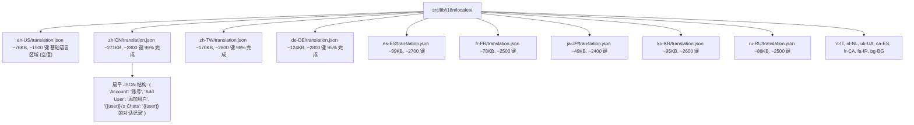
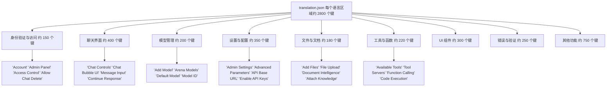
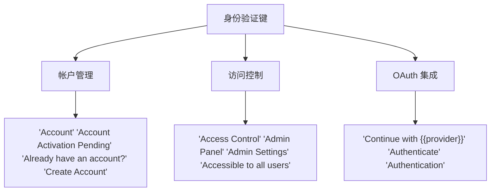
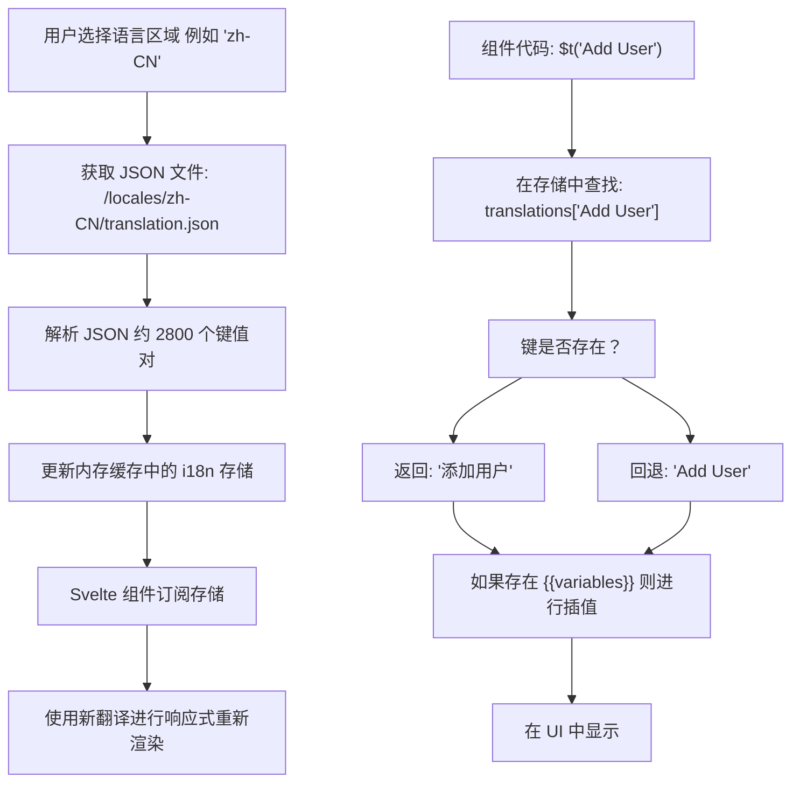
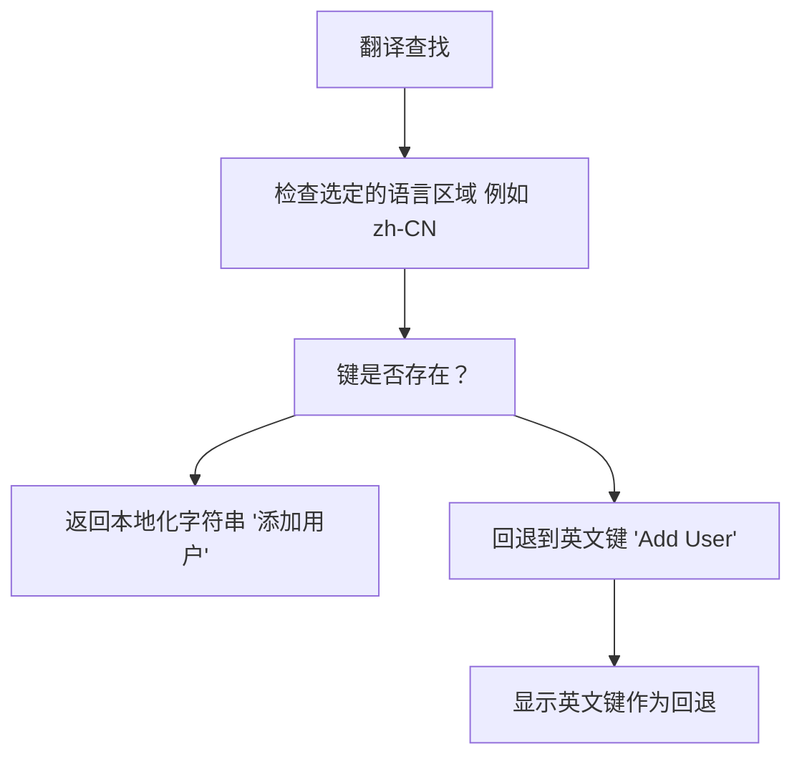

# 国际化 (Internationalization)

相关源文件

-   [src/lib/i18n/locales/bg-BG/translation.json](https://github.com/open-webui/open-webui/blob/a7271532/src/lib/i18n/locales/bg-BG/translation.json)
-   [src/lib/i18n/locales/ca-ES/translation.json](https://github.com/open-webui/open-webui/blob/a7271532/src/lib/i18n/locales/ca-ES/translation.json)
-   [src/lib/i18n/locales/de-DE/translation.json](https://github.com/open-webui/open-webui/blob/a7271532/src/lib/i18n/locales/de-DE/translation.json)
-   [src/lib/i18n/locales/en-GB/translation.json](https://github.com/open-webui/open-webui/blob/a7271532/src/lib/i18n/locales/en-GB/translation.json)
-   [src/lib/i18n/locales/en-US/translation.json](https://github.com/open-webui/open-webui/blob/a7271532/src/lib/i18n/locales/en-US/translation.json)
-   [src/lib/i18n/locales/es-ES/translation.json](https://github.com/open-webui/open-webui/blob/a7271532/src/lib/i18n/locales/es-ES/translation.json)
-   [src/lib/i18n/locales/fa-IR/translation.json](https://github.com/open-webui/open-webui/blob/a7271532/src/lib/i18n/locales/fa-IR/translation.json)
-   [src/lib/i18n/locales/fr-CA/translation.json](https://github.com/open-webui/open-webui/blob/a7271532/src/lib/i18n/locales/fr-CA/translation.json)
-   [src/lib/i18n/locales/fr-FR/translation.json](https://github.com/open-webui/open-webui/blob/a7271532/src/lib/i18n/locales/fr-FR/translation.json)
-   [src/lib/i18n/locales/it-IT/translation.json](https://github.com/open-webui/open-webui/blob/a7271532/src/lib/i18n/locales/it-IT/translation.json)
-   [src/lib/i18n/locales/ja-JP/translation.json](https://github.com/open-webui/open-webui/blob/a7271532/src/lib/i18n/locales/ja-JP/translation.json)
-   [src/lib/i18n/locales/ko-KR/translation.json](https://github.com/open-webui/open-webui/blob/a7271532/src/lib/i18n/locales/ko-KR/translation.json)
-   [src/lib/i18n/locales/nl-NL/translation.json](https://github.com/open-webui/open-webui/blob/a7271532/src/lib/i18n/locales/nl-NL/translation.json)
-   [src/lib/i18n/locales/pt-BR/translation.json](https://github.com/open-webui/open-webui/blob/a7271532/src/lib/i18n/locales/pt-BR/translation.json)
-   [src/lib/i18n/locales/pt-PT/translation.json](https://github.com/open-webui/open-webui/blob/a7271532/src/lib/i18n/locales/pt-PT/translation.json)
-   [src/lib/i18n/locales/ru-RU/translation.json](https://github.com/open-webui/open-webui/blob/a7271532/src/lib/i18n/locales/ru-RU/translation.json)
-   [src/lib/i18n/locales/uk-UA/translation.json](https://github.com/open-webui/open-webui/blob/a7271532/src/lib/i18n/locales/uk-UA/translation.json)
-   [src/lib/i18n/locales/vi-VN/translation.json](https://github.com/open-webui/open-webui/blob/a7271532/src/lib/i18n/locales/vi-VN/translation.json)
-   [src/lib/i18n/locales/zh-CN/translation.json](https://github.com/open-webui/open-webui/blob/a7271532/src/lib/i18n/locales/zh-CN/translation.json)
-   [src/lib/i18n/locales/zh-TW/translation.json](https://github.com/open-webui/open-webui/blob/a7271532/src/lib/i18n/locales/zh-TW/translation.json)

本文档描述了 Open WebUI 中的国际化 (i18n) 系统，该系统为整个应用程序提供了多语言支持。系统目前支持 17 种语言区域 (locales)，拥有超过 1,500 个翻译键 (keys)，并包含一个用于动态内容插值的占位符变量系统。

有关用户界面设置和主题管理的信息，请参阅[用户偏好和界面设置](/open-webui/open-webui/10.2-oauth-integration)。

---

## 目的和范围

i18n 系统通过以下方式使 Open WebUI 能够以多种语言呈现其界面：

-   维护 17 种受支持语言区域的翻译文件
-   提供基于键 (key) 的翻译查找机制
-   支持用于运行时值插入的动态占位符变量
-   支持在无需重新加载页面的情况下切换运行时语言区域
-   管理各语言区域的日期/时间格式化模式

---

## 翻译系统架构

i18n 系统使用扁平的 JSON 键值结构，其中英文短语键映射到本地化字符串。每个语言区域文件包含约 1,500-2,800 个翻译条目，以单层 JSON 对象的形式存储。

### 翻译文件组织

**目录结构：src/lib/i18n/locales/**


**JSON 文件格式**

所有翻译文件都遵循以下结构：

-   根对象具有字符串键（英文短语）
-   字符串值（本地化翻译）
-   无嵌套；所有键都在根级别
-   键是人类可读的英文短语
-   占位符变量使用 `{{VARIABLE}}` 语法
-   根据 JSON 规范对特殊字符进行转义

来源：[src/lib/i18n/locales/en-US/translation.json1-100](https://github.com/open-webui/open-webui/blob/a7271532/src/lib/i18n/locales/en-US/translation.json#L1-L100) [src/lib/i18n/locales/zh-CN/translation.json1-100](https://github.com/open-webui/open-webui/blob/a7271532/src/lib/i18n/locales/zh-CN/translation.json#L1-L100) [src/lib/i18n/locales/de-DE/translation.json1-100](https://github.com/open-webui/open-webui/blob/a7271532/src/lib/i18n/locales/de-DE/translation.json#L1-L100)

---

## 语言区域文件和键结构

每个翻译文件都是一个扁平的 JSON 对象，将英文键映射到本地化字符串。键按功能领域组织，但存储在单层结构中以实现高效查找。

### 键命名规范

翻译键是完整的英文短语，既作为查找键，也作为回退显示文本：

| 模式类型 | 示例键 (Key) | 语言区域示例 (zh-CN) | 备注 |
| --- | --- | --- | --- |
| 简单动作 | `"Add"` | `"添加"` | 单个动词 |
| 描述性标签 | `"Add a model ID"` | `"添加模型 ID"` | 完整的句子 |
| 上下文相关 | `"Admin Panel"` | `"管理员面板"` | 功能标签 |
| 权限 | `"Allow Chat Delete"` | `"允许删除对话记录"` | 布尔值权限 |
| 确认 | `"Are you sure?"` | `"您确认吗？"` | 对话框提示 |
| 模板 | `"{{user}}\'s Chats"` | `"{{user}} 的对话记录"` | 带有占位符 |
| 复数形式 | `"{{COUNT}} Sources"` | `"{{COUNT}} 个引用来源"` | 基于计数的字符串 |
| 日期格式 | `"[Today at] h:mm A"` | `"[今天] h:mm A"` | Moment.js 模式 |

**键构建规则**

-   键在所有功能领域中必须唯一
-   键区分大小写
-   键应该是完整的英文短语，而不是缩写
-   带有占位符的键必须包含 `{{VARIABLE}}` 语法
-   日期/时间键在方括号 `[]` 中使用 moment.js 格式令牌 (tokens)

### 按功能领域划分的翻译键类别

**各功能领域的键分布**


**键模式分析**

| 功能领域 | 键数量 | 常用前缀 | 示例键 |
| --- | --- | --- | --- |
| 权限 | ~120 | `"Allow "` | `"Allow Chat Delete"`, `"Allow File Upload"` |
| 设置 | ~180 | `"Enable "`, `"Default "` | `"Enable API Keys"`, `"Default Model"` |
| 动作 | ~200 | `"Add "`, `"Delete "`, `"Edit "` | `"Add User"`, `"Delete Chat"` |
| 状态消息 | ~150 | `"successfully"`, `"failed"` | `"Connection successful"`, `"Failed to save"` |
| 确认 | ~80 | `"Are you sure"` | `"Are you sure you want to delete"` |
| 占位符 | ~250 | `"{{COUNT}}"`, `"{{user}}"` | `"{{COUNT}} Sources"`, `"{{user}}\'s Chats"` |

来源：[src/lib/i18n/locales/zh-CN/translation.json32-106](https://github.com/open-webui/open-webui/blob/a7271532/src/lib/i18n/locales/zh-CN/translation.json#L32-L106) [src/lib/i18n/locales/zh-CN/translation.json231-248](https://github.com/open-webui/open-webui/blob/a7271532/src/lib/i18n/locales/zh-CN/translation.json#L231-L248) [src/lib/i18n/locales/zh-CN/translation.json314-356](https://github.com/open-webui/open-webui/blob/a7271532/src/lib/i18n/locales/zh-CN/translation.json#L314-L356)

---

## 占位符变量系统

i18n 系统使用双大括号语法支持运行时变量插值：`{{VARIABLE}}`。变量区分大小写，并在渲染时由前端 i18n 库替换。

### 占位符变量类型与用法

| 变量名称 | 类型 | 示例键 | zh-CN 翻译 | 使用场景 |
| --- | --- | --- | --- | --- |
| `{{COUNT}}` | 整数 | `"{{COUNT}} Available Tools"` | `"{{COUNT}} 个可用工具"` | 项目计数、复数形式 |
| `{{user}}` | 字符串 | `"{{user}}\'s Chats"` | `"{{user}} 的对话记录"` | 用户显示名称 |
| `{{NAME}}` | 字符串 | `"Are you sure you want to delete \"{{NAME}}\""` | `"您确认要删除"{{NAME}}"吗？"` | 确认对话框中的实体名称 |
| `{{model}}` | 字符串 | `"{{model}} download has been canceled"` | `"已取消模型 {{model}} 的下载"` | 模型标识符 |
| `{{COMMAND}}` | 字符串 | `"Activate this command by typing \"/{{COMMAND}}\""` | `"在对话框中输入 \"/{{COMMAND}}\" 激活此命令"` | 命令字符串 |
| `{{LATEST_VERSION}}` | 字符串 | `"A new version (v{{LATEST_VERSION}}) is now available."` | `"新版本（v{{LATEST_VERSION}}）现已发布"` | 版本号 |
| `{{webUIName}}` | 字符串 | `"{{webUIName}} Backend Required"` | `"{{webUIName}} 需要后端服务"` | 应用程序品牌名称 |
| `{{provider}}` | 字符串 | `"Continue with {{provider}}"` | `"使用 {{provider}} 继续"` | OAuth 提供商名称 |
| `{{LOCALIZED_DATE}}` | 字符串 | `"{{LOCALIZED_DATE}} at {{LOCALIZED_TIME}}"` | `"{{LOCALIZED_DATE}} {{LOCALIZED_TIME}}"` | 预格式化的日期 |
| `{{LOCALIZED_TIME}}` | 字符串 | `"{{LOCALIZED_DATE}} at {{LOCALIZED_TIME}}"` | `"{{LOCALIZED_DATE}} {{LOCALIZED_TIME}}"` | 预格式化的时间 |
| `{{NAMES}}` | 字符串 | `"{{NAMES}} reacted with {{REACTION}}"` | `"{{NAMES}} 给了 {{REACTION}}"` | 多个名称，逗号分隔 |
| `{{REACTION}}` | 字符串 | `"{{NAMES}} reacted with {{REACTION}}"` | `"{{NAMES}} 给了 {{REACTION}}"` | 表情符号或反应名称 |

**变量插值规则**

-   变量在渲染之前被替换
-   未定义的变量在输出中保留为 `{{VARIABLE}}`
-   同一键中可以多次出现变量
-   变量名称使用全大写 (UPPER_CASE) 或驼峰命名法 (camelCase) 规范
-   `{{}}` 分隔符内不允许有空格

### 日期和时间格式化模式

日期和时间键使用 moment.js 格式令牌结合方括号 `[]` 中的字面量文本。这些模式按语言区域进行本地化，以便按照文化习惯显示日期/时间。

**Moment.js 格式令牌参考**

| 令牌 (Token) | 描述 | 示例输出 |
| --- | --- | --- |
| `h:mm A` | 带有 AM/PM 的 12 小时制时间 | `3:45 PM` |
| `H:mm` | 24 小时制时间 | `15:45` |
| `dddd` | 完整的星期名称 | `Monday`, `星期一` |
| `DD/MM/YYYY` | 日/月/年 | `25/12/2024` |
| `[text]` | 字面量文本 (不格式化) | `at` (保持不变) |

**日期/时间翻译示例**

| 键 (en-US) | zh-CN 翻译 | ko-KR 翻译 | 用途 |
| --- | --- | --- | --- |
| `"[Today at] h:mm A"` | `"[今天] h:mm A"` | `"[오늘] A h:mm"` | 今天的消息 |
| `"[Yesterday at] h:mm A"` | `"[昨天] h:mm A"` | `"[어제] A h:mm"` | 昨天的消息 |
| `"[Last] dddd [at] h:mm A"` | `"[上次] dddd [于] h:mm A"` | `"[지난] dddd A h:mm"` | 较旧的消息 |
| `"DD/MM/YYYY"` | `"DD/MM/YYYY"` | `"DD/MM/YYYY"` | 日期输入格式 |
| `"{{LOCALIZED_DATE}} at {{LOCALIZED_TIME}}"` | `"{{LOCALIZED_DATE}} {{LOCALIZED_TIME}}"` | `"{{LOCALIZED_DATE}} {{LOCALIZED_TIME}}"` | 日期/时间组合 |

**特定语言区域的适配**

-   中文语言区域移除了 "at" 连接词：`"[今天] h:mm A"` (没有 "at")
-   韩文语言区域重新调整了时间位置：`"[오늘] A h:mm"` (AM/PM 在时间之前)
-   RTL 语言区域 (fa-IR) 保持从右到左的文本流
-   某些语言区域在本地化星期名称的同时保留了英文时间格式 (`h:mm A`)

来源：[src/lib/i18n/locales/zh-CN/translation.json8-19](https://github.com/open-webui/open-webui/blob/a7271532/src/lib/i18n/locales/zh-CN/translation.json#L8-L19) [src/lib/i18n/locales/ko-KR/translation.json8-19](https://github.com/open-webui/open-webui/blob/a7271532/src/lib/i18n/locales/ko-KR/translation.json#L8-L19) [src/lib/i18n/locales/de-DE/translation.json8-19](https://github.com/open-webui/open-webui/blob/a7271532/src/lib/i18n/locales/de-DE/translation.json#L8-L19)

---

## 翻译覆盖范围与完成度

### 受支持的语言区域

该系统目前支持 17 种语言区域，其翻译完成度各不相同：

| 语言区域代码 | 语言 | 翻译完成度 | 备注 |
| --- | --- | --- | --- |
| `en-US` | 英语 (美国) | 100% (基础) | 带有空值的基础语言区域 |
| `zh-CN` | 中文 (简体) | ~99% | 完成度最高的翻译 |
| `zh-TW` | 中文 (繁体) | ~98% | 高覆盖率 |
| `de-DE` | 德语 | ~95% | 良好的覆盖率 |
| `es-ES` | 西班牙语 | ~94% | 良好的覆盖率 |
| `ko-KR` | 韩语 | ~92% | 大多数条目已翻译 |
| `fr-FR` | 法语 | ~90% | 许多条目已翻译 |
| `ru-RU` | 俄语 | ~88% | 许多条目已翻译 |
| `ja-JP` | 日语 | ~85% | 良好的覆盖率 |
| `ca-ES` | 加泰罗尼亚语 | ~85% | 良好的覆盖率 |
| `uk-UA` | 乌克兰语 | ~80% | 缺失条目较多 |
| `it-IT` | 意大利语 | ~75% | 部分覆盖 |
| `nl-NL` | 荷兰语 | ~70% | 部分覆盖 |
| `fr-CA` | 法语 (加拿大) | ~65% | 部分覆盖 |
| `fa-IR` | 波斯语 | ~62% | 部分覆盖 |
| `bg-BG` | 保加利亚语 | ~58% | 部分覆盖 |

### 空值处理

英语语言区域 (`en-US`) 包含的大多是空字符串值，作为一种回退机制，当没有可用的本地化字符串时，将显示翻译键本身：

```json
{
  "Account": "",
  "Add User": "",
  "Admin Panel": ""
}
```
当选定的语言区域缺少翻译时，系统将回退到显示英文键字符串。

来源：[src/lib/i18n/locales/en-US/translation.json1-100](https://github.com/open-webui/open-webui/blob/a7271532/src/lib/i18n/locales/en-US/translation.json#L1-L100) [src/lib/i18n/locales/zh-CN/translation.json1-100](https://github.com/open-webui/open-webui/blob/a7271532/src/lib/i18n/locales/zh-CN/translation.json#L1-L100)

---

## 按功能划分的翻译键模式

### 身份验证与帐户管理


**身份验证翻译键**

来源：[src/lib/i18n/locales/zh-CN/translation.json32-34](https://github.com/open-webui/open-webui/blob/a7271532/src/lib/i18n/locales/zh-CN/translation.json#L32-L34) [src/lib/i18n/locales/zh-CN/translation.json165-167](https://github.com/open-webui/open-webui/blob/a7271532/src/lib/i18n/locales/zh-CN/translation.json#L165-L167)

### 聊天界面

聊天相关的翻译涵盖了消息操作、控件以及显示选项：

| 类别 | 示例键 |
| --- | --- |
| 操作 | `"Add Memory"`, `"Delete Message"`, `"Edit Last Message"` |
| 控件 | `"Chat Controls"`, `"Chat Bubble UI"`, `"Chat direction"` |
| 权限 | `"Allow Chat Delete"`, `"Allow Chat Edit"`, `"Allow Chat Export"` |
| 状态 | `"Active"`, `"Away"`, `"Chat moved successfully"` |
| 显示 | `"Display chat title in tab"`, `"Chat Background Image"` |

来源：[src/lib/i18n/locales/zh-CN/translation.json231-242](https://github.com/open-webui/open-webui/blob/a7271532/src/lib/i18n/locales/zh-CN/translation.json#L231-L242) [src/lib/i18n/locales/zh-CN/translation.json85-106](https://github.com/open-webui/open-webui/blob/a7271532/src/lib/i18n/locales/zh-CN/translation.json#L85-L106)

### 模型管理

```json
{
  "Add Model": "添加模型",
  "Add Arena Model": "添加竞技场模型",
  "Arena Models": "启用竞技场匿名评价模型",
  "Base Model (From)": "基础模型(来自)",
  "Current Model": "当前模型",
  "Default Model": "默认模型",
  "Model ID": "模型 ID",
  "{{model}} download has been canceled": "已取消模型 {{model}} 的下载"
}
```
来源：[src/lib/i18n/locales/zh-CN/translation.json58-59](https://github.com/open-webui/open-webui/blob/a7271532/src/lib/i18n/locales/zh-CN/translation.json#L58-L59) [src/lib/i18n/locales/zh-CN/translation.json150](https://github.com/open-webui/open-webui/blob/a7271532/src/lib/i18n/locales/zh-CN/translation.json#L150-L150)

### 设置与配置

设置翻译包括界面自定义、主题选项以及高级参数：

| 设置类别 | 翻译键 |
| --- | --- |
| 常规 | `"General"`, `"Settings"`, `"Admin Settings"` |
| 界面 | `"Display"`, `"Chat Bubble UI"`, `"Theme System"` |
| 高级 | `"Advanced Parameters"`, `"Advanced Params"`, `"Additional Parameters"` |
| 权限 | `"Default permissions"`, `"Features Permissions"`, `"Chat Permissions"` |

来源：[src/lib/i18n/locales/zh-CN/translation.json799](https://github.com/open-webui/open-webui/blob/a7271532/src/lib/i18n/locales/zh-CN/translation.json#L799-L799) [src/lib/i18n/locales/zh-CN/translation.json75-77](https://github.com/open-webui/open-webui/blob/a7271532/src/lib/i18n/locales/zh-CN/translation.json#L75-L77)

---

## 特殊翻译模式

### 复数形式支持

系统使用 `{{COUNT}}` 占位符支持基于计数的翻译：

```json
{
  "{{COUNT}} Available Tools": "{{COUNT}} 个可用工具",
  "{{COUNT}} characters": "{{COUNT}} 个字符",
  "{{COUNT}} Replies": "{{COUNT}} 条回复",
  "{{COUNT}} Sources": "{{COUNT}} 个引用来源",
  "{{COUNT}} words": "{{COUNT}} 个字",
  "and {{COUNT}} more": "还有 {{COUNT}} 个",
  "1 Source": "1 个引用来源"
}
```
注意：系统使用单独的键来区分单数（例如 `"1 Source"`）和复数（例如 `"{{COUNT}} Sources"`）形式，而不是使用单一的复数规则。

来源：[src/lib/i18n/locales/zh-CN/translation.json12-18](https://github.com/open-webui/open-webui/blob/a7271532/src/lib/i18n/locales/zh-CN/translation.json#L12-L18) [src/lib/i18n/locales/zh-CN/translation.json24](https://github.com/open-webui/open-webui/blob/a7271532/src/lib/i18n/locales/zh-CN/translation.json#L24-L24)

### RTL 语言支持

系统包含对波斯语 (Farsi) 等从右到左 (RTL) 语言的支持：

```json
{
  "Account": "حساب",
  "Add User": "افزودن کاربر",
  "Admin Panel": "پنل مدیریت"
}
```
语言区域代码 `fa-IR` 用于标识波斯语翻译，允许前端应用合适的 RTL 文本方向。

来源：[src/lib/i18n/locales/fa-IR/translation.json33](https://github.com/open-webui/open-webui/blob/a7271532/src/lib/i18n/locales/fa-IR/translation.json#L33-L33) [src/lib/i18n/locales/fa-IR/translation.json63](https://github.com/open-webui/open-webui/blob/a7271532/src/lib/i18n/locales/fa-IR/translation.json#L63-L63)

### 翻译中的格式化与标记

某些翻译包含内联格式提示：

```json
{
  "Executing **{{NAME}}**...": "正在执行 **{{NAME}}**...",
  "e.g. `sh webui.sh --api`": "（例如：`sh webui.sh --api`）",
  "(e.g. `sh webui.sh --api --api-auth username_password`)": "（例如：`sh webui.sh --api --api-auth username_password`）"
}
```
系统在翻译中保留 Markdown 格式（`**bold**`, `` `code` ``），从而实现跨语言区域的一致文本样式。

来源：[src/lib/i18n/locales/zh-CN/translation.json677](https://github.com/open-webui/open-webui/blob/a7271532/src/lib/i18n/locales/zh-CN/translation.json#L677-L677) [src/lib/i18n/locales/zh-CN/translation.json4-5](https://github.com/open-webui/open-webui/blob/a7271532/src/lib/i18n/locales/zh-CN/translation.json#L4-L5)

---

## 前端集成架构

i18n 系统通过基于响应式存储 (store) 的架构与 SvelteKit 前端集成。语言区域更改会触发使用翻译字符串的所有组件自动重新渲染。

### i18n 系统流

**翻译查找与应用**


**基于存储的响应性**

-   i18n 库维护一个响应式 Svelte 存储
-   存储包含：`{ locale: string, translations: Record<string, string> }`
-   组件使用 `$t()` 函数或 `$_()` 简写进行订阅
-   存储更新会触发所有订阅组件的 Svelte 响应性
-   无需手动调用组件更新

### 翻译函数使用模式

**在 Svelte 组件中**

```javascript
// 基础翻译查找
$t('Add User')  // 返回: "添加用户" (如果选定了 zh-CN)

// 带有占位符插值
$t('{{user}}\'s Chats', { user: 'Alice' })  // 返回: "Alice 的对话记录"

// 带有计数占位符
$t('{{COUNT}} Sources', { COUNT: 5 })  // 返回: "5 个引用来源"

// 多个占位符
$t('Are you sure you want to delete "{{NAME}}"?', { NAME: 'My Model' })
```
**存储持久化**

用户语言区域偏好存储在：

1.  浏览器 localStorage (键名: `locale` 或 `language`)
2.  用户偏好 API (持久化到数据库)
3.  在应用程序初始化时恢复
4.  在首次渲染之前应用，以确保一致的 UX

来源：参考了[架构概览](/open-webui/open-webui/2.1-system-components-and-data-flow)中前端架构的模式

---

## 翻译文件维护

### 添加新翻译键

在添加新的 UI 功能时，开发人员必须：

1.  将英文键添加到所有语言区域文件
2.  提供英文翻译（如果不使用键作为显示文本）
3.  请求社区贡献者提供其他语言区域的翻译
4.  使用描述性、完整的英文短语作为键以确保清晰度

### 缺失翻译处理


**翻译回退机制**

当选定的语言区域缺少某个翻译键时，系统会显示英文键字符串本身作为回退，从而确保即使翻译不完整，UI 仍能正常工作。

来源：[src/lib/i18n/locales/en-US/translation.json44-65](https://github.com/open-webui/open-webui/blob/a7271532/src/lib/i18n/locales/en-US/translation.json#L44-L65) [src/lib/i18n/locales/zh-CN/translation.json44-65](https://github.com/open-webui/open-webui/blob/a7271532/src/lib/i18n/locales/zh-CN/translation.json#L44-L65)

---

## 通用翻译模式

### 确认对话框

```json
{
  "Are you sure?": "您确认吗？",
  "Are you sure you want to delete \"{{NAME}}\"\n": "您确认要删除"{{NAME}}"吗？",
  "Are you sure you want to delete this message?": "您确认要删除此消息吗？",
  "Are you sure you want to delete this channel?": "您确认要删除此频道吗？",
  "Confirm": "确认",
  "Confirm your action": "确认要继续吗？",
  "Cancel": "取消"
}
```
### 成功与错误消息

```json
{
  "Connection successful": "连接成功",
  "Connection failed": "连接失败",
  "Channel deleted successfully": "删除频道成功",
  "Channel updated successfully": "更新频道成功",
  "Failed to delete note": "删除笔记失败",
  "Failed to save conversation": "保存对话失败",
  "Error": "错误"
}
```
### 功能开关

```json
{
  "Allow Call": "允许语音通话",
  "Allow Chat Controls": "允许使用对话高级设置",
  "Allow Chat Delete": "允许删除对话记录",
  "Allow File Upload": "允许上传文件",
  "Enable API Keys": "启用接口密钥",
  "Enable Code Execution": "启用代码执行"
}
```
来源：[src/lib/i18n/locales/zh-CN/translation.json145-149](https://github.com/open-webui/open-webui/blob/a7271532/src/lib/i18n/locales/zh-CN/translation.json#L145-L149) [src/lib/i18n/locales/zh-CN/translation.json314-315](https://github.com/open-webui/open-webui/blob/a7271532/src/lib/i18n/locales/zh-CN/translation.json#L314-L315) [src/lib/i18n/locales/zh-CN/translation.json84-96](https://github.com/open-webui/open-webui/blob/a7271532/src/lib/i18n/locales/zh-CN/translation.json#L84-L96)

---

## 技术实现说明

### JSON 文件格式

每个翻译文件都遵循严格的 JSON 格式：

-   键始终是英文律符串
-   值是本地化翻译
-   特殊字符被正确转义
-   占位符变量使用 `{{variable}}` 语法
-   空字符串表示未翻译的键

### 文件大小与性能

| 指标 | 数值 |
| --- | --- |
| 平均文件大小 | 每个语言区域约 150-250 KB |
| 翻译键总数 | 约 1,500 个键 |
| 最大的翻译文件 | zh-CN (约 270 KB) |
| 最小的翻译文件 | en-US (约 75 KB) |

翻译文件在用户选择语言区域时按需加载，从而最大限度地减小初始包体积。

来源：[src/lib/i18n/locales/](https://github.com/open-webui/open-webui/blob/a7271532/src/lib/i18n/locales/) 中的所有语言区域文件
