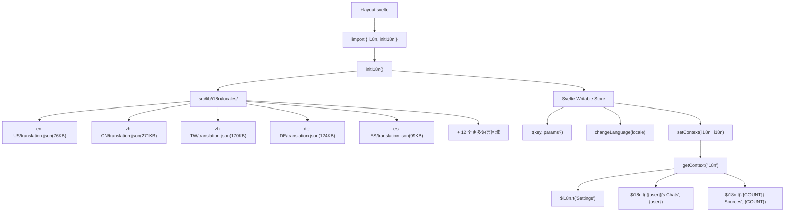
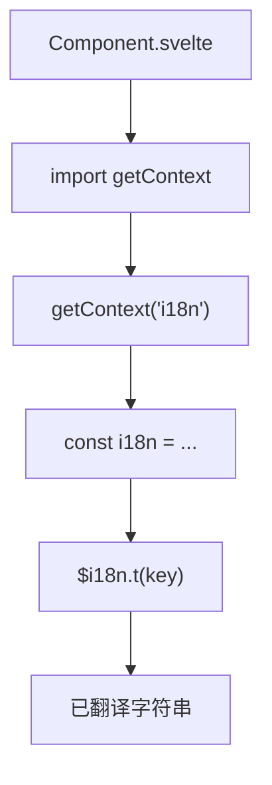
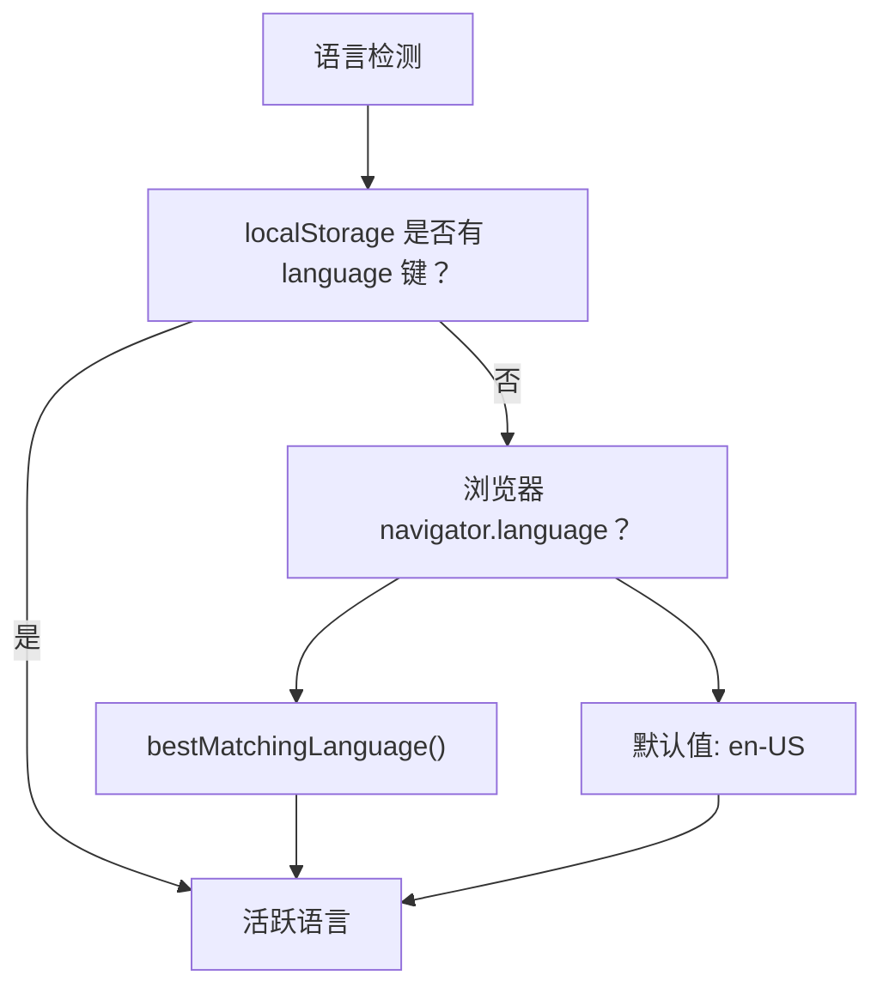
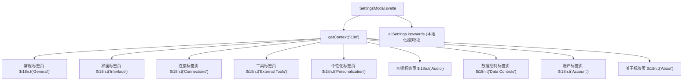

# 翻译系统架构

相关源文件

-   [src/lib/i18n/locales/bg-BG/translation.json](https://github.com/open-webui/open-webui/blob/a7271532/src/lib/i18n/locales/bg-BG/translation.json)
-   [src/lib/i18n/locales/ca-ES/translation.json](https://github.com/open-webui/open-webui/blob/a7271532/src/lib/i18n/locales/ca-ES/translation.json)
-   [src/lib/i18n/locales/de-DE/translation.json](https://github.com/open-webui/open-webui/blob/a7271532/src/lib/i18n/locales/de-DE/translation.json)
-   [src/lib/i18n/locales/en-GB/translation.json](https://github.com/open-webui/open-webui/blob/a7271532/src/lib/i18n/locales/en-GB/translation.json)
-   [src/lib/i18n/locales/en-US/translation.json](https://github.com/open-webui/open-webui/blob/a7271532/src/lib/i18n/locales/en-US/translation.json)
-   [src/lib/i18n/locales/es-ES/translation.json](https://github.com/open-webui/open-webui/blob/a7271532/src/lib/i18n/locales/es-ES/translation.json)
-   [src/lib/i18n/locales/fa-IR/translation.json](https://github.com/open-webui/open-webui/blob/a7271532/src/lib/i18n/locales/fa-IR/translation.json)
-   [src/lib/i18n/locales/fr-CA/translation.json](https://github.com/open-webui/open-webui/blob/a7271532/src/lib/i18n/locales/fr-CA/translation.json)
-   [src/lib/i18n/locales/fr-FR/translation.json](https://github.com/open-webui/open-webui/blob/a7271532/src/lib/i18n/locales/fr-FR/translation.json)
-   [src/lib/i18n/locales/it-IT/translation.json](https://github.com/open-webui/open-webui/blob/a7271532/src/lib/i18n/locales/it-IT/translation.json)
-   [src/lib/i18n/locales/ja-JP/translation.json](https://github.com/open-webui/open-webui/blob/a7271532/src/lib/i18n/locales/ja-JP/translation.json)
-   [src/lib/i18n/locales/ko-KR/translation.json](https://github.com/open-webui/open-webui/blob/a7271532/src/lib/i18n/locales/ko-KR/translation.json)
-   [src/lib/i18n/locales/nl-NL/translation.json](https://github.com/open-webui/open-webui/blob/a7271532/src/lib/i18n/locales/nl-NL/translation.json)
-   [src/lib/i18n/locales/pt-BR/translation.json](https://github.com/open-webui/open-webui/blob/a7271532/src/lib/i18n/locales/pt-BR/translation.json)
-   [src/lib/i18n/locales/pt-PT/translation.json](https://github.com/open-webui/open-webui/blob/a7271532/src/lib/i18n/locales/pt-PT/translation.json)
-   [src/lib/i18n/locales/ru-RU/translation.json](https://github.com/open-webui/open-webui/blob/a7271532/src/lib/i18n/locales/ru-RU/translation.json)
-   [src/lib/i18n/locales/uk-UA/translation.json](https://github.com/open-webui/open-webui/blob/a7271532/src/lib/i18n/locales/uk-UA/translation.json)
-   [src/lib/i18n/locales/vi-VN/translation.json](https://github.com/open-webui/open-webui/blob/a7271532/src/lib/i18n/locales/vi-VN/translation.json)
-   [src/lib/i18n/locales/zh-CN/translation.json](https://github.com/open-webui/open-webui/blob/a7271532/src/lib/i18n/locales/zh-CN/translation.json)
-   [src/lib/i18n/locales/zh-TW/translation.json](https://github.com/open-webui/open-webui/blob/a7271532/src/lib/i18n/locales/zh-TW/translation.json)

## 目的与范围

本文档描述了 Open WebUI 中的国际化 (i18n) 系统架构，该系统为整个应用程序提供多语言支持。该系统支持 17 种语言，并处理翻译键管理、语言区域 (locale) 检测、语言切换以及运行时翻译解析。有关面向用户的语言设置和偏好的信息，请参阅 [用户偏好与界面设置](/open-webui/open-webui/10.2-oauth-integration)。

## 系统概览

Open WebUI 使用位于 `src/lib/i18n` 的自定义 i18n 模块实现国际化，并结合 Svelte 的 Context API 实现应用范围内的翻译访问。该系统在根应用布局 (`src/routes/+layout.svelte`) 中初始化，并通过 Svelte 的上下文机制提供给所有组件使用。

**关键特征：**

-   **支持 17 种语言**，具有完整的翻译覆盖率。
-   **5000 多个翻译键**，涵盖 UI 标签、消息、错误状态和帮助文本。
-   **基于浏览器的语言区域检测**，并带有 `localStorage` 持久化。
-   **运行时语言切换**，通过 `changeLanguage()` 函数实现，无需重新加载页面。
-   **基于上下文的翻译访问**，使用 Svelte 的 `getContext('i18n')`。
-   **响应式更新**，通过 Svelte 的可写 store (writable stores) 实现。

**来源：** [src/routes/+layout.svelte37](https://github.com/open-webui/open-webui/blob/a7271532/src/routes/+layout.svelte#L37-L37) [src/routes/+layout.svelte62](https://github.com/open-webui/open-webui/blob/a7271532/src/routes/+layout.svelte#L62-L62) [src/lib/i18n/locales/zh-CN/translation.json1-10](https://github.com/open-webui/open-webui/blob/a7271532/src/lib/i18n/locales/zh-CN/translation.json#L1-L10) [src/lib/i18n/locales/en-US/translation.json1-10](https://github.com/open-webui/open-webui/blob/a7271532/src/lib/i18n/locales/en-US/translation.json#L1-L10)

## 架构组件


**图表：带有代码实体的 i18n 系统架构**

**来源：** [src/routes/+layout.svelte37](https://github.com/open-webui/open-webui/blob/a7271532/src/routes/+layout.svelte#L37-L37) [src/routes/+layout.svelte62](https://github.com/open-webui/open-webui/blob/a7271532/src/routes/+layout.svelte#L62-L62) [src/lib/i18n/locales/zh-CN/translation.json](https://github.com/open-webui/open-webui/blob/a7271532/src/lib/i18n/locales/zh-CN/translation.json) [src/lib/i18n/locales/en-US/translation.json](https://github.com/open-webui/open-webui/blob/a7271532/src/lib/i18n/locales/en-US/translation.json)

## 初始化流程

i18n 系统在根布局组件的应用引导期间进行初始化：

> **[Mermaid sequence]**
> *(图表结构无法解析)*

**图表：i18n 初始化序列**

初始化过程遵循以下步骤：

1.  **导入 i18n 模块** - 根布局导入 i18n 实用程序。
2.  **检测语言区域** - 系统检查 localStorage，然后检查浏览器语言，最后使用默认值。
3.  **加载翻译文件** - 加载相应的 `translation.json` 文件。
4.  **创建 i18n store** - 创建包含翻译功能的 Svelte 可写 store。
5.  **设置上下文** - 通过 Svelte 上下文使 i18n store 可用。

**来源：** [src/routes/+layout.svelte37](https://github.com/open-webui/open-webui/blob/a7271532/src/routes/+layout.svelte#L37-L37) [src/routes/+layout.svelte62](https://github.com/open-webui/open-webui/blob/a7271532/src/routes/+layout.svelte#L62-L62) [src/lib/utils49](https://github.com/open-webui/open-webui/blob/a7271532/src/lib/utils#L49-L49)

## 翻译文件结构

翻译文件按遵循 BCP 47 标准的语言区域代码组织：

```text
src/lib/i18n/locales/
├── en-US/
│   └── translation.json
├── zh-CN/
│   └── translation.json
├── zh-TW/
│   └── translation.json
├── de-DE/
│   └── translation.json
├── es-ES/
│   └── translation.json
├── ko-KR/
│   └── translation.json
├── ru-RU/
│   └── translation.json
├── fr-FR/
│   └── translation.json
├── ca-ES/
│   └── translation.json
├── uk-UA/
│   └── translation.json
├── nl-NL/
│   └── translation.json
├── fr-CA/
│   └── translation.json
├── fa-IR/
│   └── translation.json
├── ja-JP/
│   └── translation.json
├── bg-BG/
│   └── translation.json
├── it-IT/
│   └── translation.json
└── en-GB/
    └── translation.json
```
### 翻译 JSON 格式

每个 `translation.json` 文件都包含一个拥有 5000 多个键的扁平化键值对结构：

```json
{
  "Settings": "设置",
  "Close settings modal": "关闭设置弹窗",
  "General": "通用",
  "Interface": "界面",
  "Account": "账号",
  "{{user}}'s Chats": "{{user}} 的对话记录",
  "{{COUNT}} Available Tools": "{{COUNT}} 个可用工具",
  "{{COUNT}} Sources": "{{COUNT}} 个引用来源",
  "[Today at] h:mm A": "[今天] h:mm A",
  "[Yesterday at] h:mm A": "[昨天] h:mm A"
}
```
**来自代码库的关键模式与示例：**

| 模式 | 翻译键 | zh-CN 值 | 用途 |
| --- | --- | --- | --- |
| 简单标签 | `"Settings"` | `"设置"` | UI 元素标签 |
| 操作描述 | `"Close settings modal"` | `"关闭设置弹窗"` | 无障碍标签 |
| 用户插值 | `"{{user}}'s Chats"` | `"{{user}} 的对话记录"` | 动态插入用户名 |
| 计数插值 | `"{{COUNT}} Available Tools"` | `"{{COUNT}} 个可用工具"` | 带计数的复数处理 |
| 多个变量 | `"{{LOCALIZED_DATE}} at {{LOCALIZED_TIME}}"` | `"{{LOCALIZED_DATE}} {{LOCALIZED_TIME}}"` | 日期和时间格式化 |
| 日期格式 | `"[Today at] h:mm A"` | `"[今天] h:mm A"` | 本地化日期/时间模式 |
| 命名的反应 (reactions) | `"{{NAMES}} reacted with {{REACTION}}"` | `"{{NAMES}} 给了 {{REACTION}}"` | 复杂的插值 |

**特殊字符与转义：**

翻译值可能包含在 JSON 中被正确转义的特殊字符：

-   引号：`"Don't have an account?"` → `"还没有账号吗？"`
-   括号：`"(latest)"` → `"(最新版)"`
-   反引号：``"(e.g. `sh webui.sh --api`)"`` → `"（例如：`sh webui.sh --api`）"`

**来源：** [src/lib/i18n/locales/zh-CN/translation.json1-30](https://github.com/open-webui/open-webui/blob/a7271532/src/lib/i18n/locales/zh-CN/translation.json#L1-L30) [src/lib/i18n/locales/en-US/translation.json1-30](https://github.com/open-webui/open-webui/blob/a7271532/src/lib/i18n/locales/en-US/translation.json#L1-L30)

## 组件使用模式

组件通过 Svelte 的 `getContext` API，从 i18n 上下文中访问翻译：


**图表：组件中的翻译访问流程**

### 模式 1：基础翻译

用于静态 UI 标签的简单键查找：

```html
<script>
  import { getContext } from 'svelte';
  const i18n = getContext('i18n');
</script>

<div>{$i18n.t('Settings')}</div>
<button>{$i18n.t('General')}</button>
<span>{$i18n.t('Interface')}</span>
```
**结果：**

-   英语："Settings", "General", "Interface"
-   中文："设置", "通用", "界面"

### 模式 2：变量插值

使用模板变量注入动态内容：

```html
<script>
  const username = 'Alice';
</script>

<h1>{$i18n.t("{{user}}'s Chats", { user: username })}</h1>
```
**结果：**

-   英语："Alice's Chats"
-   中文："Alice 的对话记录"

### 模式 3：基于计数的详情

显示带有正确本地化处理的计数信息：

```html
<script>
  let sourceCount = 5;
</script>

<div>{$i18n.t("{{COUNT}} Sources", { COUNT: sourceCount })}</div>
<div>{$i18n.t("{{COUNT}} Available Tools", { COUNT: toolCount })}</div>
```
**结果：**

-   英语："5 Sources", "3 Available Tools"
-   中文："5 个引用来源", "3 个可用工具"

### 模式 4：多个变量

包含多个动态值的复杂插值：

```html
<span>
  {$i18n.t("{{LOCALIZED_DATE}} at {{LOCALIZED_TIME}}", {
    LOCALIZED_DATE: formattedDate,
    LOCALIZED_TIME: formattedTime
  })}
</span>
```
### 模式 5：无障碍标签

用于屏幕阅读器的 ARIA 属性：

```html
<button aria-label={$i18n.t('Close settings modal')}>
  <XMark />
</button>

<input
  type="text"
  placeholder={$i18n.t('Enter Your Name')}
  aria-label={$i18n.t('Enter Your Name')}
/>
```
**结果：**

-   英语："Close settings modal", "Enter Your Name"
-   中文："关闭设置弹窗", "输入您的名称"

### 模式 6：条件文本

在条件表达式中使用翻译键：

```html
<div>
  {isLoading
    ? $i18n.t('Checking for updates...')
    : $i18n.t('Check for updates')}
</div>
```
**来源：** [src/lib/i18n/locales/zh-CN/translation.json1-50](https://github.com/open-webui/open-webui/blob/a7271532/src/lib/i18n/locales/zh-CN/translation.json#L1-L50) [src/lib/i18n/locales/en-US/translation.json1-50](https://github.com/open-webui/open-webui/blob/a7271532/src/lib/i18n/locales/en-US/translation.json#L1-L50)

## 语言检测与切换

### 检测优先级

系统按以下优先级确定活跃语言：


**图表：语言检测流程**

**来源：** [src/lib/utils49](https://github.com/open-webui/open-webui/blob/a7271532/src/lib/utils#L49-L49) [src/routes/+layout.svelte37](https://github.com/open-webui/open-webui/blob/a7271532/src/routes/+layout.svelte#L37-L37)

### 运行时语言切换

`changeLanguage()` 函数实现了动态语言切换：

```html
<script>
  import { changeLanguage } from '$lib/i18n';

  const switchLanguage = async (locale) => {
    await changeLanguage(locale);
    // 由于 i18n store 是响应式的，UI 会自动更新
  };
</script>

<select on:change={(e) => switchLanguage(e.target.value)}>
  <option value="en-US">English</option>
  <option value="zh-CN">简体中文</option>
  <option value="de-DE">Deutsch</option>
</select>
```
语言更改时：

1.  加载新的翻译文件。
2.  更新 i18n store。
3.  所有使用 `$i18n.t()` 的组件自动重新渲染。
4.  新语言被持久化到 localStorage。

**来源：** [src/routes/+layout.svelte37](https://github.com/open-webui/open-webui/blob/a7271532/src/routes/+layout.svelte#L37-L37)

## 支持的语言

系统支持 17 种语言，并具有完整的翻译覆盖率。每种语言在 `src/lib/i18n/locales/` 下都有自己的目录，其中包含一个 `translation.json` 文件：

| 语言 | 语言区域代码 | 文件路径 | 文件大小 | 覆盖率 |
| --- | --- | --- | --- | --- |
| 英语 (美国) | `en-US` | `src/lib/i18n/locales/en-US/translation.json` | 76 KB | 基准 (5000+ 键) |
| 中文 (简体) | `zh-CN` | `src/lib/i18n/locales/zh-CN/translation.json` | 271 KB | 完整 |
| 中文 (繁体) | `zh-TW` | `src/lib/i18n/locales/zh-TW/translation.json` | 170 KB | 完整 |
| 德语 | `de-DE` | `src/lib/i18n/locales/de-DE/translation.json` | 124 KB | 完整 |
| 加泰罗尼亚语 | `ca-ES` | `src/lib/i18n/locales/ca-ES/translation.json` | 111 KB | 完整 |
| 西班牙语 | `es-ES` | `src/lib/i18n/locales/es-ES/translation.json` | 99 KB | 完整 |
| 乌克兰语 | `uk-UA` | `src/lib/i18n/locales/uk-UA/translation.json` | 98 KB | 完整 |
| 韩语 | `ko-KR` | `src/lib/i18n/locales/ko-KR/translation.json` | 95 KB | 完整 |
| 俄语 | `ru-RU` | `src/lib/i18n/locales/ru-RU/translation.json` | 86 KB | 完整 |
| 法语 (法国) | `fr-FR` | `src/lib/i18n/locales/fr-FR/translation.json` | 78 KB | 完整 |
| 荷兰语 | `nl-NL` | `src/lib/i18n/locales/nl-NL/translation.json` | 64 KB | 完整 |
| 法语 (加拿大) | `fr-CA` | `src/lib/i18n/locales/fr-CA/translation.json` | 53 KB | 完整 |
| 波斯语 | `fa-IR` | `src/lib/i18n/locales/fa-IR/translation.json` | 52 KB | 完整 |
| 日语 | `ja-JP` | `src/lib/i18n/locales/ja-JP/translation.json` | 49 KB | 完整 |
| 保加利亚语 | `bg-BG` | `src/lib/i18n/locales/bg-BG/translation.json` | 47 KB | 完整 |
| 意大利语 | `it-IT` | `src/lib/i18n/locales/it-IT/translation.json` | 47 KB | 完整 |
| 英语 (英国) | `en-GB` | `src/lib/i18n/locales/en-GB/translation.json` | 42 KB | 完整 |

**注意：** 文件大小因字符编码差异而异。即使翻译键数量相同，使用多字节字符集的语言（中文、韩语、日语）的文件大小也会更大。

**语言区域代码标准：** 所有语言区域代码均遵循 BCP 47 标准格式：`语言-地区` (例如 `zh-CN`, `en-US`, `fr-CA`)。

**来源：** [src/lib/i18n/locales/en-US/translation.json](https://github.com/open-webui/open-webui/blob/a7271532/src/lib/i18n/locales/en-US/translation.json) [src/lib/i18n/locales/zh-CN/translation.json](https://github.com/open-webui/open-webui/blob/a7271532/src/lib/i18n/locales/zh-CN/translation.json) [src/lib/i18n/locales/zh-TW/translation.json](https://github.com/open-webui/open-webui/blob/a7271532/src/lib/i18n/locales/zh-TW/translation.json) [src/lib/i18n/locales/de-DE/translation.json](https://github.com/open-webui/open-webui/blob/a7271532/src/lib/i18n/locales/de-DE/translation.json) [src/lib/i18n/locales/ca-ES/translation.json](https://github.com/open-webui/open-webui/blob/a7271532/src/lib/i18n/locales/ca-ES/translation.json) [src/lib/i18n/locales/es-ES/translation.json](https://github.com/open-webui/open-webui/blob/a7271532/src/lib/i18n/locales/es-ES/translation.json)

## 设置模态框集成

设置模态框展示了跨多个标签页的全面 i18n 集成：


**图表：设置模态框 i18n 用法**

设置模态框包含：

-   **标签页标题** - 所有导航标签页标签均已翻译。
-   **搜索功能** - 关键词数组包含本地化搜索词。
-   **表单标签** - 所有输入标签 and 占位符均使用 i18n。
-   **按钮文本** - 操作按钮均已翻译。
-   **帮助文本** - 工具提示和描述均已本地化。
-   **错误消息** - 验证消息使用 i18n。

**来源：** [src/lib/components/chat/SettingsModal.svelte32-33](https://github.com/open-webui/open-webui/blob/a7271532/src/lib/components/chat/SettingsModal.svelte#L32-L33) [src/lib/components/chat/SettingsModal.svelte48-469](https://github.com/open-webui/open-webui/blob/a7271532/src/lib/components/chat/SettingsModal.svelte#L48-L469) [src/lib/components/chat/SettingsModal.svelte575-637](https://github.com/open-webui/open-webui/blob/a7271532/src/lib/components/chat/SettingsModal.svelte#L575-L637)

## 翻译键分类

5000 多个翻译键根据使用场景组织为语义类别：

### UI 组件标签 (导航与标签页)

用于 UI 元素的静态标签：

| 翻译键 | en-US | zh-CN | 使用场景 |
| --- | --- | --- | --- |
| `"Settings"` | Settings | 设置 | 模态框标题, 菜单项 |
| `"General"` | General | 通用 | 设置标签页 |
| `"Interface"` | Interface | 界面 | 设置标签页 |
| `"Account"` | Account | 账号 | 设置标签页 |
| `"About"` | About | 关于 | 设置标签页 |
| `"Admin Panel"` | Admin Panel | 管理员面板 | 导航 |

### 用户动作与命令

动作动词与命令标签：

| 翻译键 | en-US | zh-CN |
| --- | --- | --- |
| `"Add"` | Add | 添加 |
| `"Create"` | Create | 创建 |
| `"Delete"` | Delete | 删除 |
| `"Edit"` | Edit | 编辑 |
| `"Export"` | Export | 导出 |
| `"Cancel"` | Cancel | 取消 |
| `"Confirm"` | Confirm | 确认 |
| `"Back"` | Back | 返回 |

### 确认与反馈消息

用户确认提示与状态消息：

| 翻译键 | en-US | zh-CN |
| --- | --- | --- |
| `"Are you sure?"` | Are you sure? | 您确认吗？ |
| `"Confirm your action"` | Confirm your action | 确认要继续吗？ |
| `"Account Activation Pending"` | Account Activation Pending | 账号待激活 |
| `"Connection successful"` | Connection successful | 连接成功 |
| `"Connection failed"` | Connection failed | 连接失败 |

### 帮助文本与说明

给用户的引导文本：

| 翻译键 | en-US | zh-CN |
| --- | --- | --- |
| `"Click here for help."` | Click here for help. | 点击此处获取帮助 |
| `"Click here to select"` | Click here to select | 点击此处选择 |
| `"Click here for filter guides."` | Click here for filter guides. | 点击此处查看筛选指南 |

### 带有插值的动态内容

包含模板变量的键：

| 翻译键 | en-US | zh-CN | 变量 |
| --- | --- | --- | --- |
| `"{{user}}'s Chats"` | {{user}}'s Chats | {{user}} 的对话记录 | `user` |
| `"{{COUNT}} Sources"` | {{COUNT}} Sources | {{COUNT}} 个引用来源 | `COUNT` |
| `"{{COUNT}} Available Tools"` | {{COUNT}} Available Tools | {{COUNT}} 个可用工具 | `COUNT` |
| `"{{COUNT}} characters"` | {{COUNT}} characters | {{COUNT}} 个字符 | `COUNT` |
| `"{{LOCALIZED_DATE}} at {{LOCALIZED_TIME}}"` | {{LOCALIZED\_DATE}} at {{LOCALIZED\_TIME}} | {{LOCALIZED\_DATE}} {{LOCALIZED\_TIME}} | `LOCALIZED_DATE`, `LOCALIZED_TIME` |

### 日期与时间格式

本地化日期/时间模式：

| 翻译键 | en-US | zh-CN |
| --- | --- | --- |
| `"[Today at] h:mm A"` | [Today at] h:mm A | [今天] h:mm A |
| `"[Yesterday at] h:mm A"` | [Yesterday at] h:mm A | [昨天] h:mm A |
| `"[Last] dddd [at] h:mm A"` | [Last] dddd [at] h:mm A | [上次] dddd [于] h:mm A |

### 无障碍与 ARIA 标签

屏幕阅读器与无障碍文本：

| 翻译键 | en-US | zh-CN |
| --- | --- | --- |
| `"Close settings modal"` | Close settings modal | 关闭设置弹窗 |
| `"Close modal"` | Close modal | 关闭弹窗 |
| `"Close Sidebar"` | Close Sidebar | 收起侧边栏 |
| `"Focus Chat Input"` | Focus Chat Input | 聚焦对话框 |

### 表单输入标签与占位符

输入框标签与占位文本：

| 翻译键 | en-US | zh-CN |
| --- | --- | --- |
| `"Enter Your Name"` | Enter Your Name | 输入您的名称 |
| `"Enter Your Email"` | Enter Your Email | 输入您的电子邮箱 |
| `"Confirm Password"` | Confirm Password | 确认密码 |
| `"Enter your message"` | Enter your message | 输入您的消息 |

**来源：** [src/lib/i18n/locales/zh-CN/translation.json1-300](https://github.com/open-webui/open-webui/blob/a7271532/src/lib/i18n/locales/zh-CN/translation.json#L1-L300) [src/lib/i18n/locales/en-US/translation.json1-100](https://github.com/open-webui/open-webui/blob/a7271532/src/lib/i18n/locales/en-US/translation.json#L1-L100)

## 最佳实践

### 面向组件作者

1.  **始终使用翻译键**

    ```html
    <!-- 推荐 -->
    <button>{$i18n.t('Settings')}</button>

    <!-- 不推荐 -->
    <button>Settings</button>
    ```

2.  **使用描述性强的键名**

    ```html
    <!-- 推荐 -->
    aria-label={$i18n.t('Close settings modal')}

    <!-- 不推荐 -->
    aria-label={$i18n.t('Close')}
    ```

3.  **对动态内容进行插值**

    ```javascript
    {$i18n.t("{{user}}'s Chats", { user: username })}
    ```

4.  **处理复数形式**

    ```javascript
    {$i18n.t("{{COUNT}} Sources", { COUNT: count })}
    ```


### 面向翻译作者

1.  **保持所有语言区域文件的键名一致性**。
2.  **保留插值变量**，如 `{{user}}`, `{{COUNT}}`。
3.  **使用长翻译文本进行测试**，确保 UI 不会崩溃。
4.  **验证特殊字符**在 JSON 中是否已正确转义。
5.  **使用适合该语言区域的日期/时间格式**。

**来源：** [src/lib/components/chat/SettingsModal.svelte575-637](https://github.com/open-webui/open-webui/blob/a7271532/src/lib/components/chat/SettingsModal.svelte#L575-L637)

## 性能考量

翻译系统旨在实现最佳性能：

-   **懒加载** - 仅加载活跃语言的文件。
-   **基于上下文的访问** - 无需进行 prop 逐层传递 (prop drilling)。
-   **响应式更新** - Svelte's 响应式机制高效处理重新渲染。
-   **最小化 bundle 影响** - 翻译文件不包含在主 bundle 中。
-   **缓存** - 已加载的翻译被缓存在内存中。

**来源：** [src/routes/+layout.svelte62](https://github.com/open-webui/open-webui/blob/a7271532/src/routes/+layout.svelte#L62-L62) [src/lib/stores/index.ts69](https://github.com/open-webui/open-webui/blob/a7271532/src/lib/stores/index.ts#L69-L69)