# 语言区域覆盖范围

相关源文件

-   [src/lib/i18n/locales/bg-BG/translation.json](https://github.com/open-webui/open-webui/blob/a7271532/src/lib/i18n/locales/bg-BG/translation.json)
-   [src/lib/i18n/locales/ca-ES/translation.json](https://github.com/open-webui/open-webui/blob/a7271532/src/lib/i18n/locales/ca-ES/translation.json)
-   [src/lib/i18n/locales/de-DE/translation.json](https://github.com/open-webui/open-webui/blob/a7271532/src/lib/i18n/locales/de-DE/translation.json)
-   [src/lib/i18n/locales/en-GB/translation.json](https://github.com/open-webui/open-webui/blob/a7271532/src/lib/i18n/locales/en-GB/translation.json)
-   [src/lib/i18n/locales/en-US/translation.json](https://github.com/open-webui/open-webui/blob/a7271532/src/lib/i18n/locales/en-US/translation.json)
-   [src/lib/i18n/locales/es-ES/translation.json](https://github.com/open-webui/open-webui/blob/a7271532/src/lib/i18n/locales/es-ES/translation.json)
-   [src/lib/i18n/locales/fa-IR/translation.json](https://github.com/open-webui/open-webui/blob/a7271532/src/lib/i18n/locales/fa-IR/translation.json)
-   [src/lib/i18n/locales/fr-CA/translation.json](https://github.com/open-webui/open-webui/blob/a7271532/src/lib/i18n/locales/fr-CA/translation.json)
-   [src/lib/i18n/locales/fr-FR/translation.json](https://github.com/open-webui/open-webui/blob/a7271532/src/lib/i18n/locales/fr-FR/translation.json)
-   [src/lib/i18n/locales/it-IT/translation.json](https://github.com/open-webui/open-webui/blob/a7271532/src/lib/i18n/locales/it-IT/translation.json)
-   [src/lib/i18n/locales/ja-JP/translation.json](https://github.com/open-webui/open-webui/blob/a7271532/src/lib/i18n/locales/ja-JP/translation.json)
-   [src/lib/i18n/locales/ko-KR/translation.json](https://github.com/open-webui/open-webui/blob/a7271532/src/lib/i18n/locales/ko-KR/translation.json)
-   [src/lib/i18n/locales/nl-NL/translation.json](https://github.com/open-webui/open-webui/blob/a7271532/src/lib/i18n/locales/nl-NL/translation.json)
-   [src/lib/i18n/locales/pt-BR/translation.json](https://github.com/open-webui/open-webui/blob/a7271532/src/lib/i18n/locales/pt-BR/translation.json)
-   [src/lib/i18n/locales/pt-PT/translation.json](https://github.com/open-webui/open-webui/blob/a7271532/src/lib/i18n/locales/pt-PT/translation.json)
-   [src/lib/i18n/locales/ru-RU/translation.json](https://github.com/open-webui/open-webui/blob/a7271532/src/lib/i18n/locales/ru-RU/translation.json)
-   [src/lib/i18n/locales/uk-UA/translation.json](https://github.com/open-webui/open-webui/blob/a7271532/src/lib/i18n/locales/uk-UA/translation.json)
-   [src/lib/i18n/locales/vi-VN/translation.json](https://github.com/open-webui/open-webui/blob/a7271532/src/lib/i18n/locales/vi-VN/translation.json)
-   [src/lib/i18n/locales/zh-CN/translation.json](https://github.com/open-webui/open-webui/blob/a7271532/src/lib/i18n/locales/zh-CN/translation.json)
-   [src/lib/i18n/locales/zh-TW/translation.json](https://github.com/open-webui/open-webui/blob/a7271532/src/lib/i18n/locales/zh-TW/translation.json)

本文档全面记录了 Open WebUI 国际化系统支持的语言区域 (locales)，包括翻译完成状态、地区变体和文件组织结构。有关整体 i18n 架构和框架集成的信息，请参阅 [翻译系统架构](/open-webui/open-webui/15.1-translation-system-architecture)。有关动态内容和运行时值插值的详情，请参阅 [动态内容与占位符](/open-webui/open-webui/15.3-dynamic-content-and-placeholders)。

## 目的与范围

Open WebUI 支持 20 个不同的语言区域，涵盖多种语言和地区变体。本页面编目了所有支持的语言区域，记录了它们的翻译完成度，解释了地区差异，并描述了用于存储语言区域数据的文件结构。语言区域系统使应用程序能够以用户首选的语言呈现其界面，翻译字符串存储在按语言区域代码组织的 JSON 文件中。

## 支持的语言区域概览

Open WebUI 目前支持 20 个语言区域，跨越 15 种语言及地区变体：

| 语言区域代码 | 语言 | 地区 | 文件路径 | 估计完成度 |
| --- | --- | --- | --- | --- |
| `zh-CN` | 中文 | 简体 | `src/lib/i18n/locales/zh-CN/translation.json` | ~98% |
| `zh-TW` | 中文 | 繁体 | `src/lib/i18n/locales/zh-TW/translation.json` | ~95% |
| `de-DE` | 德语 | 德国 | `src/lib/i18n/locales/de-DE/translation.json` | ~92% |
| `ca-ES` | 加泰罗尼亚语 | 西班牙 | `src/lib/i18n/locales/ca-ES/translation.json` | ~88% |
| `es-ES` | 西班牙语 | 西班牙 | `src/lib/i18n/locales/es-ES/translation.json` | ~90% |
| `uk-UA` | 乌克兰语 | 乌克兰 | `src/lib/i18n/locales/uk-UA/translation.json` | ~75% |
| `ko-KR` | 韩语 | 韩国 | `src/lib/i18n/locales/ko-KR/translation.json` | ~85% |
| `ru-RU` | 俄语 | 俄罗斯 | `src/lib/i18n/locales/ru-RU/translation.json` | ~82% |
| `pt-BR` | 葡萄牙语 | 巴西 | `src/lib/i18n/locales/pt-BR/translation.json` | ~88% |
| `fr-FR` | 法语 | 法国 | `src/lib/i18n/locales/fr-FR/translation.json` | ~85% |
| `fr-CA` | 法语 | 加拿大 | `src/lib/i18n/locales/fr-CA/translation.json` | ~70% |
| `en-US` | 英语 | 美国 | `src/lib/i18n/locales/en-US/translation.json` | 基准 (100%) |
| `en-GB` | 英语 | 英国 | `src/lib/i18n/locales/en-GB/translation.json` | ~60% |
| `nl-NL` | 荷兰语 | 荷兰 | `src/lib/i18n/locales/nl-NL/translation.json` | ~75% |
| `vi-VN` | 越南语 | 越南 | `src/lib/i18n/locales/vi-VN/translation.json` | ~70% |
| `fa-IR` | 波斯语 | 伊朗 | `src/lib/i18n/locales/fa-IR/translation.json` | ~72% |
| `ja-JP` | 日语 | 日本 | `src/lib/i18n/locales/ja-JP/translation.json` | ~78% |
| `bg-BG` | 保加利亚语 | 保加利亚 | `src/lib/i18n/locales/bg-BG/translation.json` | ~65% |
| `it-IT` | 意大利语 | 意大利 | `src/lib/i18n/locales/it-IT/translation.json` | ~68% |

**注意**：完成度百分比是基于已翻译字符串与空字符串占位符比例的估计值。`en-US` 作为基准语言区域，定义了所有字符串。

**来源：** [src/lib/i18n/locales/zh-CN/translation.json1-100](https://github.com/open-webui/open-webui/blob/a7271532/src/lib/i18n/locales/zh-CN/translation.json#L1-L100) [src/lib/i18n/locales/zh-TW/translation.json1-100](https://github.com/open-webui/open-webui/blob/a7271532/src/lib/i18n/locales/zh-TW/translation.json#L1-L100) [src/lib/i18n/locales/de-DE/translation.json1-100](https://github.com/open-webui/open-webui/blob/a7271532/src/lib/i18n/locales/de-DE/translation.json#L1-L100) [src/lib/i18n/locales/en-US/translation.json1-100](https://github.com/open-webui/open-webui/blob/a7271532/src/lib/i18n/locales/en-US/translation.json#L1-L100)

## 语言区域文件目录结构

```mermaid
flowchart TD
    i18n["src/lib/i18n/"]
    locales["locales/"]
    zhCN["zh-CN/"]
    zhTW["zh-TW/"]
    deDE["de-DE/"]
    caES["ca-ES/"]
    esES["es-ES/"]
    ukUA["uk-UA/"]
    koKR["ko-KR/"]
    ruRU["ru-RU/"]
    ptBR["pt-BR/"]
    frFR["fr-FR/"]
    frCA["fr-CA/"]
    enUS["en-US/"]
    enGB["en-GB/"]
    nlNL["nl-NL/"]
    viVN["vi-VN/"]
    faIR["fa-IR/"]
    jaJP["ja-JP/"]
    bgBG["bg-BG/"]
    itIT["it-IT/"]
    zhCNFile["translation.json"]
    zhTWFile["translation.json"]
    deDEFile["translation.json"]
    caESFile["translation.json"]
    esESFile["translation.json"]
    ukUAFile["translation.json"]
    koKRFile["translation.json"]
    ruRUFile["translation.json"]
    ptBRFile["translation.json"]
    frFRFile["translation.json"]
    frCAFile["translation.json"]
    enUSFile["translation.json (基准语言区域)"]
    enGBFile["translation.json"]
    nlNLFile["translation.json"]
    viVNFile["translation.json"]
    faIRFile["translation.json"]
    jaJPFile["translation.json"]
    bgBGFile["translation.json"]
    itITFile["translation.json"]

    i18n --> locales
    locales --> zhCN
    locales --> zhTW
    locales --> deDE
    locales --> caES
    locales --> esES
    locales --> ukUA
    locales --> koKR
    locales --> ruRU
    locales --> ptBR
    locales --> frFR
    locales --> frCA
    locales --> enUS
    locales --> enGB
    locales --> nlNL
    locales --> viVN
    locales --> faIR
    locales --> jaJP
    locales --> bgBG
    locales --> itIT
    zhCN --> zhCNFile
    zhTW --> zhTWFile
    deDE --> deDEFile
    caES --> caESFile
    esES --> esESFile
    ukUA --> ukUAFile
    koKR --> koKRFile
    ruRU --> ruRUFile
    ptBR --> ptBRFile
    frFR --> frFRFile
    frCA --> frCAFile
    enUS --> enUSFile
    enGB --> enGBFile
    nlNL --> nlNLFile
    viVN --> viVNFile
    faIR --> faIRFile
    jaJP --> jaJPFile
    bgBG --> bgBGFile
    itIT --> itITFile
```


**语言区域文件组织结构**

每个语言区域都组织在 `src/lib/i18n/locales/` 下的独立目录中，使用标准的 IETF BCP 47 语言标签格式 (`语言-地区`)。每个语言区域目录包含一个 `translation.json` 文件，存储该语言区域的所有翻译字符串。

**来源：** [src/lib/i18n/locales/zh-CN/translation.json1-10](https://github.com/open-webui/open-webui/blob/a7271532/src/lib/i18n/locales/zh-CN/translation.json#L1-L10) [src/lib/i18n/locales/de-DE/translation.json1-10](https://github.com/open-webui/open-webui/blob/a7271532/src/lib/i18n/locales/de-DE/translation.json#L1-L10) [src/lib/i18n/locales/en-US/translation.json1-10](https://github.com/open-webui/open-webui/blob/a7271532/src/lib/i18n/locales/en-US/translation.json#L1-L10)

## 翻译文件结构

所有语言区域翻译文件都遵循一致的 JSON 结构，将英语键映射到翻译后的值：

```json
{
  "translationKey": "翻译后的值",
  "another key with {{PLACEHOLDER}}": "带有 {{PLACEHOLDER}} 的翻译",
  "[Today at] h:mm A": "[今天] h:mm A"
}
```
**键结构分类：**

1.  **简单字符串键**：直接以英语文本作为键。
    -   示例：`