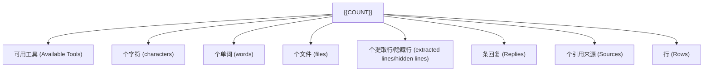
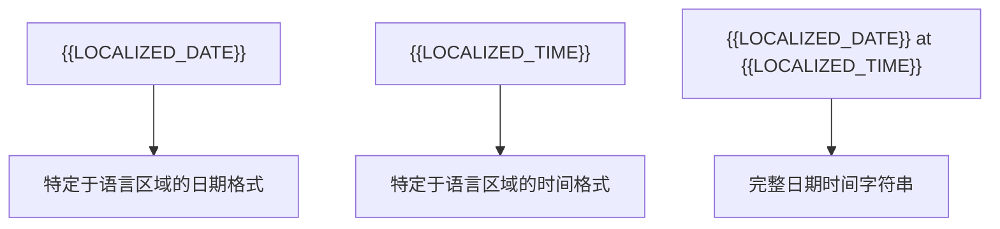
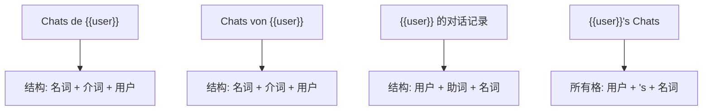
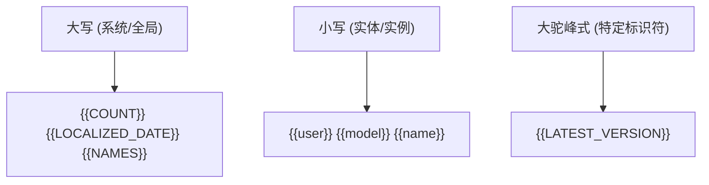
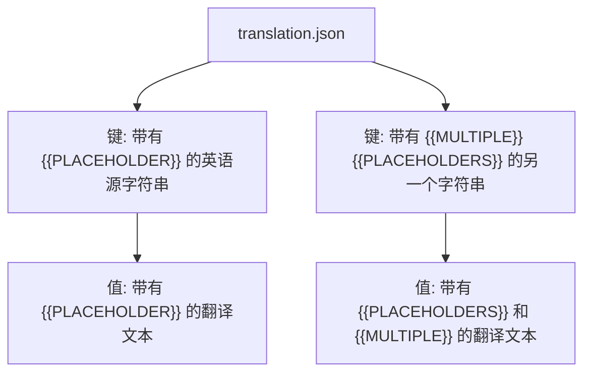
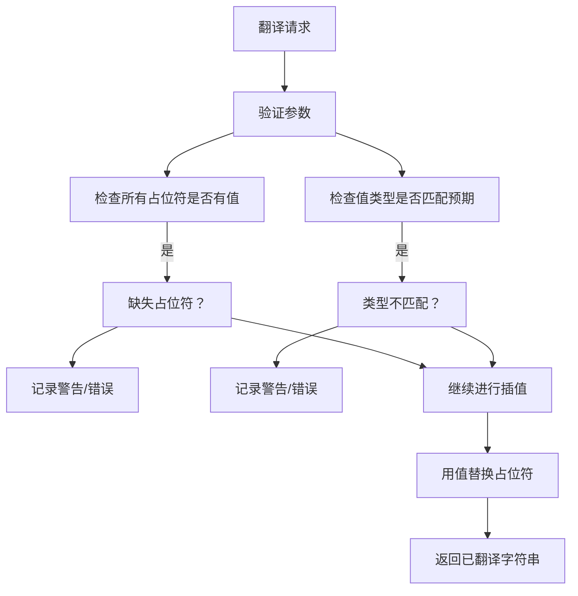

# 动态内容与占位符

相关源文件

-   [src/lib/i18n/locales/bg-BG/translation.json](https://github.com/open-webui/open-webui/blob/a7271532/src/lib/i18n/locales/bg-BG/translation.json)
-   [src/lib/i18n/locales/ca-ES/translation.json](https://github.com/open-webui/open-webui/blob/a7271532/src/lib/i18n/locales/ca-ES/translation.json)
-   [src/lib/i18n/locales/de-DE/translation.json](https://github.com/open-webui/open-webui/blob/a7271532/src/lib/i18n/locales/de-DE/translation.json)
-   [src/lib/i18n/locales/en-GB/translation.json](https://github.com/open-webui/open-webui/blob/a7271532/src/lib/i18n/locales/en-GB/translation.json)
-   [src/lib/i18n/locales/en-US/translation.json](https://github.com/open-webui/open-webui/blob/a7271532/src/lib/i18n/locales/en-US/translation.json)
-   [src/lib/i18n/locales/es-ES/translation.json](https://github.com/open-webui/open-webui/blob/a7271532/src/lib/i18n/locales/es-ES/translation.json)
-   [src/lib/i18n/locales/fa-IR/translation.json](https://github.com/open-webui/open-webui/blob/a7271532/src/lib/i18n/locales/fa-IR/translation.json)
-   [src/lib/i18n/locales/fr-CA/translation.json](https://github.com/open-webui/open-webui/blob/a7271532/src/lib/i18n/locales/fr-CA/translation.json)
-   [src/lib/i18n/locales/fr-FR/translation.json](https://github.com/open-webui/open-webui/blob/a7271532/src/lib/i18n/locales/fr-FR/translation.json)
-   [src/lib/i18n/locales/it-IT/translation.json](https://github.com/open-webui/open-webui/blob/a7271532/src/lib/i18n/locales/it-IT/translation.json)
-   [src/lib/i18n/locales/ja-JP/translation.json](https://github.com/open-webui/open-webui/blob/a7271532/src/lib/i18n/locales/ja-JP/translation.json)
-   [src/lib/i18n/locales/ko-KR/translation.json](https://github.com/open-webui/open-webui/blob/a7271532/src/lib/i18n/locales/ko-KR/translation.json)
-   [src/lib/i18n/locales/nl-NL/translation.json](https://github.com/open-webui/open-webui/blob/a7271532/src/lib/i18n/locales/nl-NL/translation.json)
-   [src/lib/i18n/locales/pt-BR/translation.json](https://github.com/open-webui/open-webui/blob/a7271532/src/lib/i18n/locales/pt-BR/translation.json)
-   [src/lib/i18n/locales/pt-PT/translation.json](https://github.com/open-webui/open-webui/blob/a7271532/src/lib/i18n/locales/pt-PT/translation.json)
-   [src/lib/i18n/locales/ru-RU/translation.json](https://github.com/open-webui/open-webui/blob/a7271532/src/lib/i18n/locales/ru-RU/translation.json)
-   [src/lib/i18n/locales/uk-UA/translation.json](https://github.com/open-webui/open-webui/blob/a7271532/src/lib/i18n/locales/uk-UA/translation.json)
-   [src/lib/i18n/locales/vi-VN/translation.json](https://github.com/open-webui/open-webui/blob/a7271532/src/lib/i18n/locales/vi-VN/translation.json)
-   [src/lib/i18n/locales/zh-CN/translation.json](https://github.com/open-webui/open-webui/blob/a7271532/src/lib/i18n/locales/zh-CN/translation.json)
-   [src/lib/i18n/locales/zh-TW/translation.json](https://github.com/open-webui/open-webui/blob/a7271532/src/lib/i18n/locales/zh-TW/translation.json)

本文档解释了 Open WebUI 国际化框架中使用的占位符系统，该系统实现了翻译字符串中的运行时值插值。占位符允许将动态内容（如用户名、计数、日期和模型名称）插入到本地化 UI 文本中，同时在所有支持的语言中保持正确的翻译结构。

有关整体翻译系统结构的信息，请参阅 [翻译系统架构](/open-webui/open-webui/15.1-translation-system-architecture)。有关支持语言的详细信息，请参阅 [语言区域覆盖范围](/open-webui/open-webui/15.2-locale-coverage)。

## 概览与目的

占位符系统提供了一种标准机制，用于将动态运行时值嵌入到静态翻译字符串中。与通过程序拼接字符串（这通常会导致语法错误的翻译）相比，占位符定义了插入点，翻译者可以根据每种语言的语法适当调整其位置。

这种方法确保了：

-   不同语言结构下的语法正确性。
-   类型安全的值插值。
-   各语言区域间格式的一致性。
-   翻译文件的可维护性。

## 占位符语法

### 格式约定

所有占位符均遵循双大括号语法：

```text
{{PLACEHOLDER_NAME}}
```
占位符名称区分大小写，通常使用：

-   **大写**：用于系统值 (`{{COUNT}}`, `{{LOCALIZED_DATE}}`)。
-   **小写**：用于实体引用 (`{{user}}`, `{{model}}`, `{{name}}`)。
-   **大驼峰式 (PascalCase)**：用于特定标识符 (`{{LATEST_VERSION}}`)。

### 跨语言区域的一致性

占位符在所有翻译文件中保持其确切格式。例如，字符串 `"{{COUNT}} Available Tools"` 表现为：

| 语言区域 | 翻译 |
| --- | --- |
| en-US | `"{{COUNT}} Available Tools"` |
| zh-CN | `"{{COUNT}} 个可用工具"` |
| de-DE | `"{{COUNT}} verfügbare Werkzeuge"` |
| es-ES | `"{{COUNT}} herramientas disponibles"` |
| fr-FR | `"{{COUNT}} outils disponibles"` |

请注意，周围文本被翻译的同时，占位符 `{{COUNT}}` 保持不变。

**来源：** [src/lib/i18n/locales/zh-CN/translation.json12](https://github.com/open-webui/open-webui/blob/a7271532/src/lib/i18n/locales/zh-CN/translation.json#L12-L12) [src/lib/i18n/locales/de-DE/translation.json12](https://github.com/open-webui/open-webui/blob/a7271532/src/lib/i18n/locales/de-DE/translation.json#L12-L12) [src/lib/i18n/locales/es-ES/translation.json12](https://github.com/open-webui/open-webui/blob/a7271532/src/lib/i18n/locales/es-ES/translation.json#L12-L12) [src/lib/i18n/locales/fr-FR/translation.json12](https://github.com/open-webui/open-webui/blob/a7271532/src/lib/i18n/locales/fr-FR/translation.json#L12-L12)

## 常见占位符类型

### 数字占位符


| 占位符 | 用法 | 翻译键示例 |
| --- | --- | --- |
| `{{COUNT}}` | 通用计数值 | `"{{COUNT}} Available Tools"`, `"{{COUNT}} characters"` |

**来源：** [src/lib/i18n/locales/zh-CN/translation.json12-20](https://github.com/open-webui/open-webui/blob/a7271532/src/lib/i18n/locales/zh-CN/translation.json#L12-L20) [src/lib/i18n/locales/de-DE/translation.json12-20](https://github.com/open-webui/open-webui/blob/a7271532/src/lib/i18n/locales/de-DE/translation.json#L12-L20)

### 用户与身份占位符

| 占位符 | 用途 | 翻译键示例 |
| --- | --- | --- |
| `{{user}}` | 用户名或用户标识符 | `"{{user}}'s Chats"` |
| `{{NAMES}}` | 用户名称列表 | `"{{NAMES}} reacted with {{REACTION}}"` |
| `{{role}}` | 用户角色 (管理员, 用户等) | `"Enter {{role}} message here"` |

**来源：** [src/lib/i18n/locales/zh-CN/translation.json24](https://github.com/open-webui/open-webui/blob/a7271532/src/lib/i18n/locales/zh-CN/translation.json#L24-L24) [src/lib/i18n/locales/zh-CN/translation.json23](https://github.com/open-webui/open-webui/blob/a7271532/src/lib/i18n/locales/zh-CN/translation.json#L23-L23) [src/lib/i18n/locales/zh-CN/translation.json560](https://github.com/open-webui/open-webui/blob/a7271532/src/lib/i18n/locales/zh-CN/translation.json#L560-L560)

### 模型与 AI 实体占位符

| 占位符 | 用途 | 翻译键示例 |
| --- | --- | --- |
| `{{model}}` | 单个模型名称 | `"{{model}} download has been canceled"` |
| `{{ models }}` | 多个模型引用 | `"{{ models }}"` |
| `{{deleteModelTag}}` | 被删除的模型标签 | `"Deleted {{deleteModelTag}}"` |
| `{{modelTag}}` | 模型标签标识符 | `"Enter model tag (e.g. {{modelTag}})"` |

**来源：** [src/lib/i18n/locales/zh-CN/translation.json11](https://github.com/open-webui/open-webui/blob/a7271532/src/lib/i18n/locales/zh-CN/translation.json#L11-L11) [src/lib/i18n/locales/zh-CN/translation.json22](https://github.com/open-webui/open-webui/blob/a7271532/src/lib/i18n/locales/zh-CN/translation.json#L22-L22) [src/lib/i18n/locales/zh-CN/translation.json436](https://github.com/open-webui/open-webui/blob/a7271532/src/lib/i18n/locales/zh-CN/translation.json#L436-L436)

### 时间占位符


这些占位符根据每个语言区域的约定进行格式化：

| 占位符 | 用途 | 输出示例 (因语言区域而异) |
| --- | --- | --- |
| `{{LOCALIZED_DATE}}` | 语言区域格式化的日期 | "2024-01-15" 或 "15/01/2024" |
| `{{LOCALIZED_TIME}}` | 语言区域格式化的时间 | "14:30" 或 "下午 2:30" |

**来源：** [src/lib/i18n/locales/zh-CN/translation.json21](https://github.com/open-webui/open-webui/blob/a7271532/src/lib/i18n/locales/zh-CN/translation.json#L21-L21) [src/lib/i18n/locales/de-DE/translation.json21](https://github.com/open-webui/open-webui/blob/a7271532/src/lib/i18n/locales/de-DE/translation.json#L21-L21)

### 应用与系统占位符

| 占位符 | 用途 | 翻译键示例 |
| --- | --- | --- |
| `{{webUIName}}` | 应用程序名称 | `"{{webUIName}} Backend Required"` |
| `{{LATEST_VERSION}}` | 版本号 | `"A new version (v{{LATEST_VERSION}}) is now available."` |
| `{{COMMAND}}` | 命令名称 | `"Activate this command by typing \"/{{COMMAND}}\" to chat input."` |

**来源：** [src/lib/i18n/locales/zh-CN/translation.json25](https://github.com/open-webui/open-webui/blob/a7271532/src/lib/i18n/locales/zh-CN/translation.json#L25-L25) [src/lib/i18n/locales/zh-CN/translation.json30](https://github.com/open-webui/open-webui/blob/a7271532/src/lib/i18n/locales/zh-CN/translation.json#L30-L30) [src/lib/i18n/locales/zh-CN/translation.json47](https://github.com/open-webui/open-webui/blob/a7271532/src/lib/i18n/locales/zh-CN/translation.json#L47-L47)

### 内容与实体占位符

| 占位符 | 用途 | 翻译键示例 |
| --- | --- | --- |
| `{{NAME}}` | 通用名称字段 (大写) | `"Are you sure you want to delete \"{{NAME}}\" ?"` |
| `{{TITLE}}` | 标题或表头 | `"Clone of {{TITLE}}"` |
| `{{name}}` | 小写名称变体 | `"Deleted {{name}}"`, `"By {{name}}"` |
| `{{provider}}` | 服务提供商名称 | `"Continue with {{provider}}"` |
| `{{url}}` | URL 值 | `"Failed to process URL: {{url}}"` |
| `{{error}}` | 错误消息 | `"Error accessing Google Drive: {{error}}"` |

**来源：** [src/lib/i18n/locales/zh-CN/translation.json153](https://github.com/open-webui/open-webui/blob/a7271532/src/lib/i18n/locales/zh-CN/translation.json#L153-L153) [src/lib/i18n/locales/zh-CN/translation.json283](https://github.com/open-webui/open-webui/blob/a7271532/src/lib/i18n/locales/zh-CN/translation.json#L283-L283) [src/lib/i18n/locales/zh-CN/translation.json437](https://github.com/open-webui/open-webui/blob/a7271532/src/lib/i18n/locales/zh-CN/translation.json#L437-L437) [src/lib/i18n/locales/zh-CN/translation.json217](https://github.com/open-webui/open-webui/blob/a7271532/src/lib/i18n/locales/zh-CN/translation.json#L217-L217)

### 社交与反应占位符

| 占位符 | 用途 | 翻译键示例 |
| --- | --- | --- |
| `{{REACTION}}` | 表情符号或反应类型 | `"{{NAMES}} reacted with {{REACTION}}"` |

**来源：** [src/lib/i18n/locales/zh-CN/translation.json23](https://github.com/open-webui/open-webui/blob/a7271532/src/lib/i18n/locales/zh-CN/translation.json#L23-L23)

## 运行时插值流程

> **[Mermaid sequence]**
> *(图表结构无法解析)*

### 插值流程

1.  **请求阶段**：代码使用翻译键和参数对象请求翻译。
2.  **语言区域解析**：i18n 框架确定当前用户语言区域。
3.  **模板检索**：从特定于语言区域的 JSON 中加载相应的模板字符串。
4.  **占位符替换**：所有 `{{PLACEHOLDER}}` 令牌被替换为提供的值。
5.  **渲染**：最终插值的字符串在 UI 中渲染。

**来源：** 从 [src/lib/i18n/locales/](https://github.com/open-webui/open-webui/blob/a7271532/src/lib/i18n/locales/) 中的翻译文件结构推断。

## 占位符位置灵活性

翻译者可以重新定位句子中的占位符，以匹配其语言的语法：


这种灵活性确保了语法正确性，同时保持了跨语言的语义等价性。

**来源：** [src/lib/i18n/locales/zh-CN/translation.json24](https://github.com/open-webui/open-webui/blob/a7271532/src/lib/i18n/locales/zh-CN/translation.json#L24-L24) [src/lib/i18n/locales/de-DE/translation.json24](https://github.com/open-webui/open-webui/blob/a7271532/src/lib/i18n/locales/de-DE/translation.json#L24-L24) [src/lib/i18n/locales/es-ES/translation.json24](https://github.com/open-webui/open-webui/blob/a7271532/src/lib/i18n/locales/es-ES/translation.json#L24-L24)

## 单个字符串中的多个占位符

某些翻译键包含多个占位符：

```text
"{{LOCALIZED_DATE}} at {{LOCALIZED_TIME}}" → "{{LOCALIZED_DATE}} {{LOCALIZED_TIME}}" (zh-CN)
"{{NAMES}} reacted with {{REACTION}}" → "{{NAMES}} 给了 {{REACTION}}" (zh-CN)
"and {{COUNT}} more" → "和另外 {{COUNT}} 个" (zh-TW)
```
每个占位符在插值过程中被独立替换。

**来源：** [src/lib/i18n/locales/zh-CN/translation.json21](https://github.com/open-webui/open-webui/blob/a7271532/src/lib/i18n/locales/zh-CN/translation.json#L21-L21) [src/lib/i18n/locales/zh-CN/translation.json23](https://github.com/open-webui/open-webui/blob/a7271532/src/lib/i18n/locales/zh-CN/translation.json#L23-L23) [src/lib/i18n/locales/zh-TW/translation.json130](https://github.com/open-webui/open-webui/blob/a7271532/src/lib/i18n/locales/zh-TW/translation.json#L130-L130)

## 特殊情况与边界条件

### 空占位符值

当占位符值为空或 null 时，翻译可能显得不完整。i18n 系统通常通过以下方式处理：

-   完全省略该占位符。
-   使用回退值。
-   在开发模式下显示占位符警告。

### 占位符中的 HTML 与 Markdown

占位符可以包含原样插值的格式化内容：

```text
键: "Failed to extract content from the file: {{error}}"
值: {error: "<strong>Permission denied</strong>"}
结果: "Failed to extract content from the file: <strong>Permission denied</strong>"
```
### 嵌套翻译键

某些系统支持嵌套占位符，但为了简单和清晰，Open WebUI 使用扁平化的占位符结构。

**来源：** [src/lib/i18n/locales/zh-CN/translation.json733-734](https://github.com/open-webui/open-webui/blob/a7271532/src/lib/i18n/locales/zh-CN/translation.json#L733-L734)

## 占位符命名约定

### 区分大小写规则


| 约定 | 用法 | 示例 |
| --- | --- | --- |
| 大写 (UPPERCASE) | 系统级或聚合值 | `{{COUNT}}`, `{{LOCALIZED_DATE}}`, `{{NAMES}}`, `{{REACTION}}` |
| 小写 (lowercase) | 实体引用, 实例 | `{{user}}`, `{{model}}`, `{{name}}`, `{{provider}}`, `{{role}}` |
| 大驼峰式 (PascalCase) | 特定复合标识符 | `{{LATEST_VERSION}}` |

**来源：** 从 [src/lib/i18n/locales/zh-CN/translation.json](https://github.com/open-webui/open-webui/blob/a7271532/src/lib/i18n/locales/zh-CN/translation.json) 中的模式推断。

## 带有占位符的翻译文件结构


翻译文件示例：

```json
{
  "{{COUNT}} Available Tools": "{{COUNT}} 个可用工具",
  "{{model}} download has been canceled": "已取消模型 {{model}} 的下载",
  "{{LOCALIZED_DATE}} at {{LOCALIZED_TIME}}": "{{LOCALIZED_DATE}} {{LOCALIZED_TIME}}"
}
```
**来源：** [src/lib/i18n/locales/zh-CN/translation.json12](https://github.com/open-webui/open-webui/blob/a7271532/src/lib/i18n/locales/zh-CN/translation.json#L12-L12) [src/lib/i18n/locales/zh-CN/translation.json22](https://github.com/open-webui/open-webui/blob/a7271532/src/lib/i18n/locales/zh-CN/translation.json#L22-L22) [src/lib/i18n/locales/zh-CN/translation.json21](https://github.com/open-webui/open-webui/blob/a7271532/src/lib/i18n/locales/zh-CN/translation.json#L21-L21)

## 完整占位符参考

根据对翻译文件的分析，以下是所有占位符类型的全面表格：

| 类别 | 占位符 | 描述 | 翻译键示例 |
| --- | --- | --- | --- |
| **数字** | `{{COUNT}}` | 计数或数量 | `"{{COUNT}} Available Tools"` |
| **用户** | `{{user}}` | 用户名 | `"{{user}}'s Chats"` |
| **用户** | `{{NAMES}}` | 多个用户名称 | `"{{NAMES}} reacted with {{REACTION}}"` |
| **用户** | `{{role}}` | 用户角色 | `"Enter {{role}} message here"` |
| **模型** | `{{model}}` | 模型名称 | `"{{model}} download has been canceled"` |
| **模型** | `{{ models }}` | 多个模型 | `"{{ models }}"` |
| **模型** | `{{deleteModelTag}}` | 被删除的模型标签 | `"Deleted {{deleteModelTag}}"` |
| **模型** | `{{modelTag}}` | 模型标签 | `"Enter model tag (e.g. {{modelTag}})"` |
| **时间** | `{{LOCALIZED_DATE}}` | 格式化的日期 | `"{{LOCALIZED_DATE}} at {{LOCALIZED_TIME}}"` |
| **时间** | `{{LOCALIZED_TIME}}` | 格式化的时间 | `"{{LOCALIZED_DATE}} at {{LOCALIZED_TIME}}"` |
| **应用** | `{{webUIName}}` | 应用程序名称 | `"{{webUIName}} Backend Required"` |
| **应用** | `{{LATEST_VERSION}}` | 版本号 | `"A new version (v{{LATEST_VERSION}}) is now available."` |
| **应用** | `{{COMMAND}}` | 命令标识符 | `"Activate this command by typing \"/{{COMMAND}}\""` |
| **内容** | `{{NAME}}` | 通用名称 (大写) | `"Are you sure you want to delete \"{{NAME}}\" ?"` |
| **内容** | `{{name}}` | 通用名称 (小写) | `"Deleted {{name}}"`, `"By {{name}}"` |
| **内容** | `{{TITLE}}` | 标题或表头 | `"Clone of {{TITLE}}"` |
| **内容** | `{{provider}}` | 提供商名称 | `"Continue with {{provider}}"` |
| **错误** | `{{error}}` | 错误消息 | `"Error accessing Google Drive: {{error}}"` |
| **错误** | `{{url}}` | URL 值 | `"Failed to process URL: {{url}}"` |
| **社交** | `{{REACTION}}` | 反应/表情符号 | `"{{NAMES}} reacted with {{REACTION}}"` |

**来源：** [src/lib/i18n/locales/zh-CN/translation.json1-850](https://github.com/open-webui/open-webui/blob/a7271532/src/lib/i18n/locales/zh-CN/translation.json#L1-L850) [src/lib/i18n/locales/de-DE/translation.json1-850](https://github.com/open-webui/open-webui/blob/a7271532/src/lib/i18n/locales/de-DE/translation.json#L1-L850) [src/lib/i18n/locales/es-ES/translation.json1-850](https://github.com/open-webui/open-webui/blob/a7271532/src/lib/i18n/locales/es-ES/translation.json#L1-L850)

## 占位符使用最佳实践

### 面向开发人员

1.  **使用描述性强的占位符名称**，清晰指示内容类型。
2.  **保持一致的大小写约定**（系统使用大写，实体使用小写）。
3.  **在请求翻译时始终提供所有必需的占位符值**。
4.  **使用类型安全的插值**，防止运行时错误。
5.  **避免使用字符串拼接**，优先使用基于占位符的模板。

### 面向翻译人员

1.  **原样保留所有占位符**，其表现形式应与源字符串完全一致。
2.  **根据目标语言的语法调整占位符位置**。
3.  **测试占位符位置**，确保语法正确。
4.  **不要翻译占位符名称**（例如：保持 `{{COUNT}}`，而不是 `{{数量}}`）。
5.  **尽可能保持占位符顺序**，但优先考虑语言表达的自然流畅。

## 占位符类型安全

虽然翻译文件是 JSON 且不强制执行类型，但应用程序代码应进行验证：


**来源：** 从翻译系统需求推断。

---

该占位符系统为国际化提供了一种强大且可维护的方法，在支持 Open WebUI 全部 20 个语言区域的动态内容的同时，保证了翻译质量。
