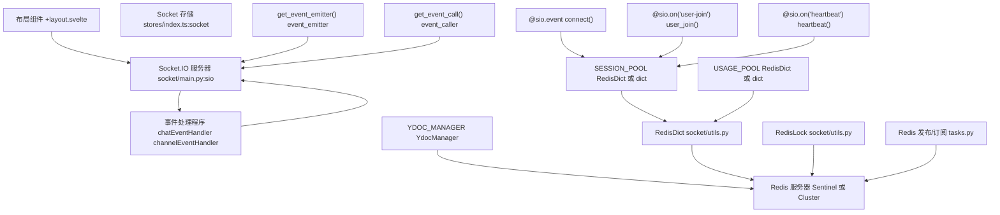
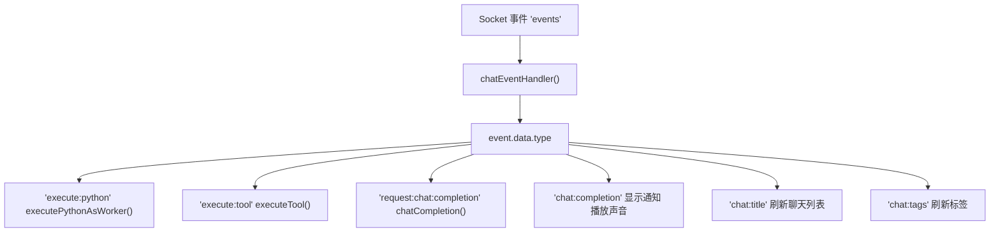
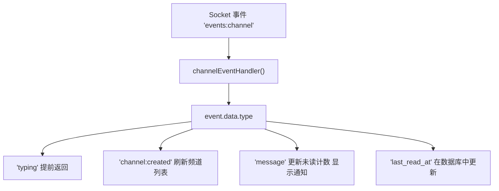
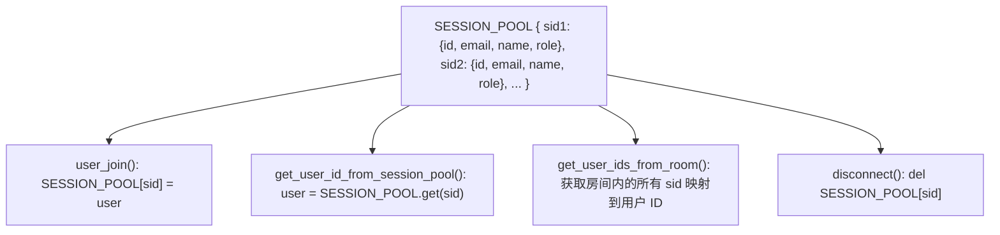
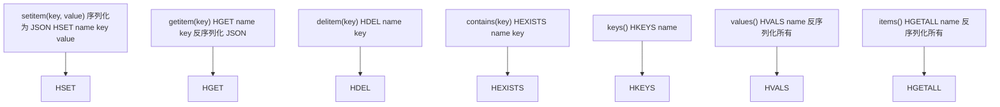
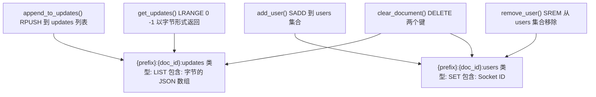
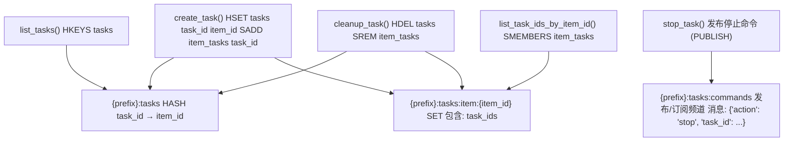
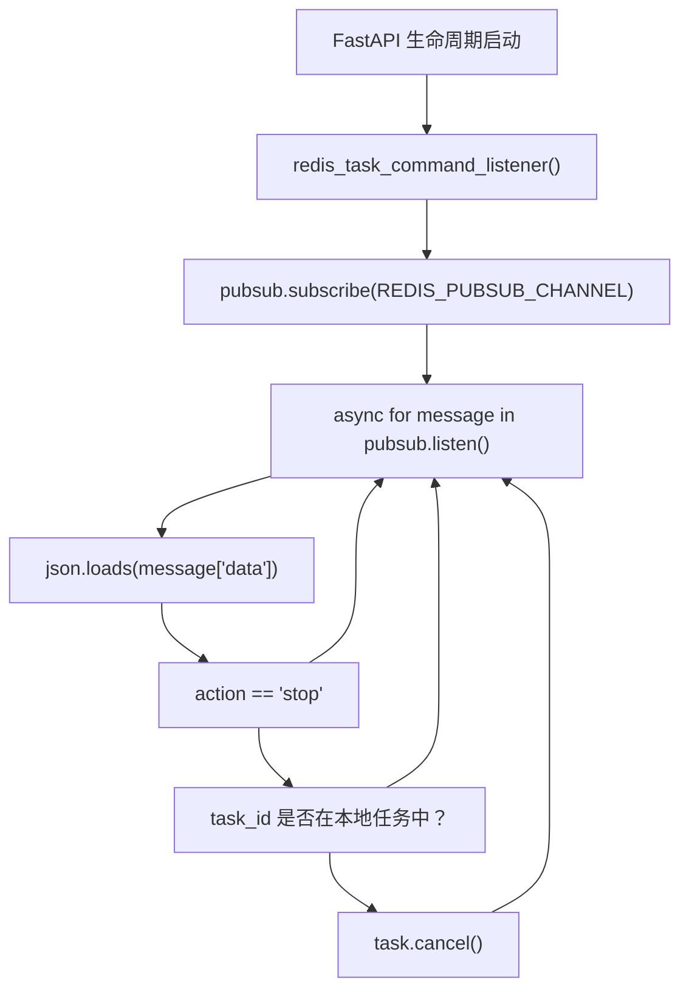
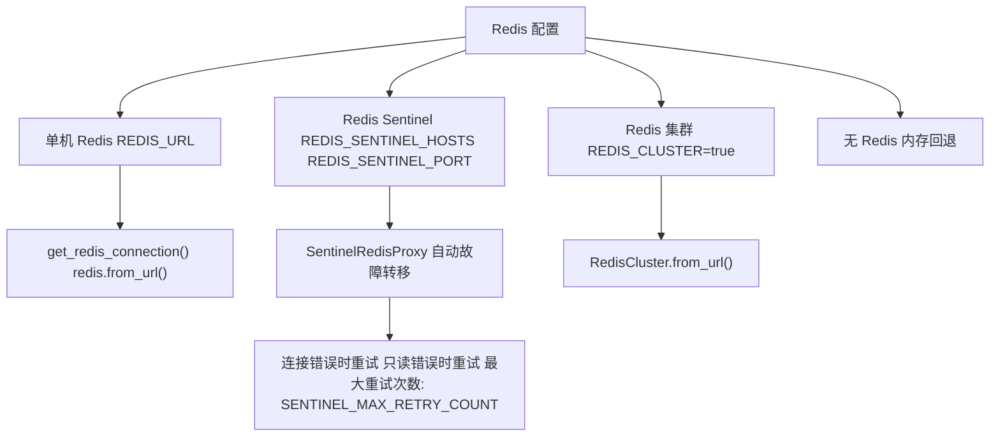
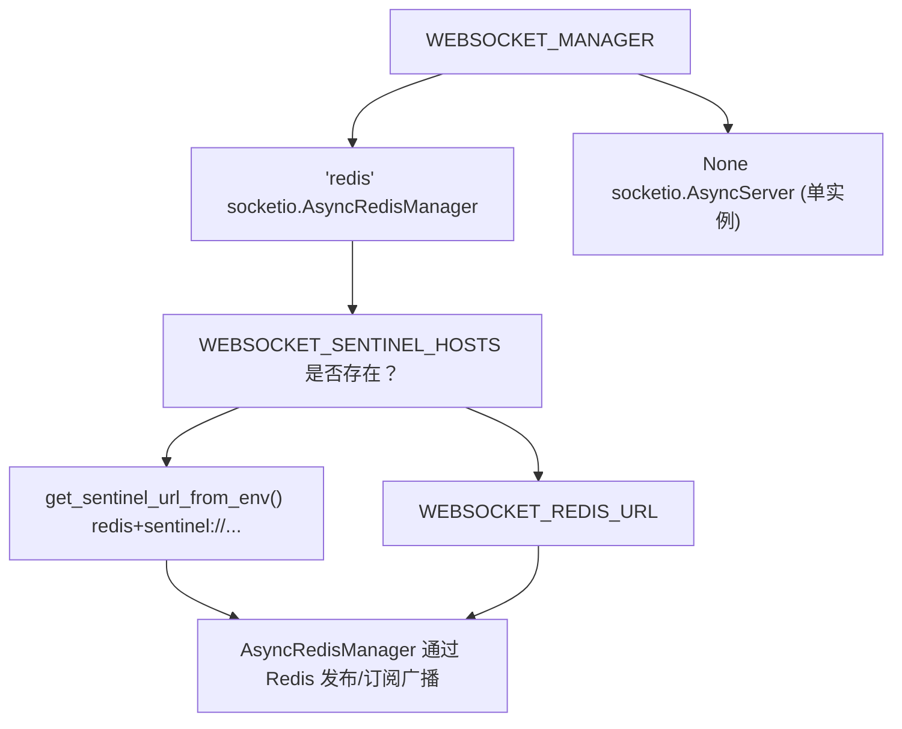

# 实时通信 (Real-time Communication)

相关源文件

-   [backend/open\_webui/config.py](https://github.com/open-webui/open-webui/blob/a7271532/backend/open_webui/config.py)
-   [backend/open\_webui/main.py](https://github.com/open-webui/open-webui/blob/a7271532/backend/open_webui/main.py)
-   [backend/open\_webui/retrieval/loaders/datalab\_marker.py](https://github.com/open-webui/open-webui/blob/a7271532/backend/open_webui/retrieval/loaders/datalab_marker.py)
-   [backend/open\_webui/retrieval/loaders/external\_document.py](https://github.com/open-webui/open-webui/blob/a7271532/backend/open_webui/retrieval/loaders/external_document.py)
-   [backend/open\_webui/retrieval/loaders/external\_web.py](https://github.com/open-webui/open-webui/blob/a7271532/backend/open_webui/retrieval/loaders/external_web.py)
-   [backend/open\_webui/retrieval/loaders/main.py](https://github.com/open-webui/open-webui/blob/a7271532/backend/open_webui/retrieval/loaders/main.py)
-   [backend/open\_webui/retrieval/loaders/mineru.py](https://github.com/open-webui/open-webui/blob/a7271532/backend/open_webui/retrieval/loaders/mineru.py)
-   [backend/open\_webui/retrieval/loaders/mistral.py](https://github.com/open-webui/open-webui/blob/a7271532/backend/open_webui/retrieval/loaders/mistral.py)
-   [backend/open\_webui/retrieval/utils.py](https://github.com/open-webui/open-webui/blob/a7271532/backend/open_webui/retrieval/utils.py)
-   [backend/open\_webui/routers/retrieval.py](https://github.com/open-webui/open-webui/blob/a7271532/backend/open_webui/routers/retrieval.py)
-   [backend/open\_webui/utils/middleware.py](https://github.com/open-webui/open-webui/blob/a7271532/backend/open_webui/utils/middleware.py)
-   [src/lib/apis/retrieval/index.ts](https://github.com/open-webui/open-webui/blob/a7271532/src/lib/apis/retrieval/index.ts)
-   [src/lib/components/admin/Settings/Documents.svelte](https://github.com/open-webui/open-webui/blob/a7271532/src/lib/components/admin/Settings/Documents.svelte)
-   [src/lib/components/admin/Settings/WebSearch.svelte](https://github.com/open-webui/open-webui/blob/a7271532/src/lib/components/admin/Settings/WebSearch.svelte)

## 目的和范围

本文档描述了 Open WebUI 中的实时通信系统，该系统使用 Socket.IO 实现了前端和后端之间的双向通信，并可选配 Redis 后端以支持分布式部署。该系统支持实时聊天流、协作式文档编辑、会话管理以及分布式任务协调。

有关聊天消息处理和流式传输的信息，请参阅[聊天系统](/open-webui/open-webui/3-installation-and-deployment)。有关后端配置和环境设置，请参阅[环境配置](/open-webui/open-webui/9.3-collaborative-editing)。

## 架构概览

实时通信层使用 Socket.IO 连接 SvelteKit 前端和 FastAPI 后端，Redis 为多实例部署提供分布式状态管理。

### 系统组件


**来源：** [src/routes/+layout.svelte1-807](https://github.com/open-webui/open-webui/blob/a7271532/src/routes/+layout.svelte#L1-L807) [backend/open\_webui/socket/main.py1-839](https://github.com/open-webui/open-webui/blob/a7271532/backend/open_webui/socket/main.py#L1-L839) [backend/open\_webui/socket/utils.py1-224](https://github.com/open-webui/open-webui/blob/a7271532/backend/open_webui/socket/utils.py#L1-L224)

### 部署模式

系统支持两种部署模式：

| 模式 | 管理器 (Manager) | 用例 | 状态存储 |
| --- | --- | --- | --- |
| **单机 (Standalone)** | `None` | 单服务器实例 | 内存字典 |
| **分布式 (Distributed)** | `redis` | 多服务器实例 | 基于 Redis 的 `RedisDict` |

来源：[backend/open\_webui/socket/main.py64-99](https://github.com/open-webui/open-webui/blob/a7271532/backend/open_webui/socket/main.py#L64-L99)

## WebSocket 连接生命周期

### 连接建立

> **[Mermaid sequence]**
> *(图表结构无法解析)*

**来源：** [src/routes/+layout.svelte97-177](https://github.com/open-webui/open-webui/blob/a7271532/src/routes/+layout.svelte#L97-L177) [backend/open\_webui/socket/main.py302-359](https://github.com/open-webui/open-webui/blob/a7271532/backend/open_webui/socket/main.py#L302-L359)

连接流程包括：

1.  **初始连接** (`connect` 事件)：使用 `auth` 参数中的 JWT 令牌对 WebSocket 连接进行身份验证，将用户会话存储在 `SESSION_POOL` 中，并加入用户特定的房间。

2.  **用户加入** (`user-join` 事件)：连接后强化身份验证，重新加入用户房间，并自动订阅该用户所属的所有频道房间。

3.  **心跳 (Heartbeat)**：前端每 30 秒发送一次心跳，以更新数据库中用户的 `last_active` 时间戳。


### 房间管理 (Room Management)

客户端被组织到不同的房间中，以便进行有针对性的事件广播：

| 房间模式 | 用途 | 成员 |
| --- | --- | --- |
| `user:{user_id}` | 用户特定事件 | 用户的所有会话 |
| `channel:{channel_id}` | 频道消息 | 频道的所有成员 |
| `doc_{document_id}` | 协作编辑 | 文档的所有编辑器 |
| `note:{note_id}` | 笔记访问 | 具有笔记访问权限的用户 |

来源：[backend/open\_webui/socket/main.py315-349](https://github.com/open-webui/open-webui/blob/a7271532/backend/open_webui/socket/main.py#L315-L349)

### 连接断开

> **[Mermaid sequence]**
> *(图表结构无法解析)*

**来源：** [backend/open\_webui/socket/main.py684-692](https://github.com/open-webui/open-webui/blob/a7271532/backend/open_webui/socket/main.py#L684-L692)

## 事件处理系统

### 前端事件处理程序

前端注册了两个主要的事件处理程序来处理来自后端的入站事件：

#### 聊天事件处理程序 (Chat Event Handler)

`chatEventHandler` 处理聊天相关的事件，包括流式响应、工具执行和 Python 代码执行。


**来源：** [src/routes/+layout.svelte325-480](https://github.com/open-webui/open-webui/blob/a7271532/src/routes/+layout.svelte#L325-L480)

处理的事件类型：

| 事件类型 | 条件 | 动作 |
| --- | --- | --- |
| `chat:completion` | 不同的聊天或未聚焦 | 显示通知 toast，播放声音 |
| `chat:title` | 不同的聊天 | 刷新聊天列表 |
| `chat:tags` | 不同的聊天 | 刷新标签列表 |
| `execute:python` | 相同会话 | 在 Pyodide worker 中执行 Python 代码 |
| `execute:tool` | 相同会话 | 通过 API 执行工具 |
| `request:chat:completion` | 相同会话 | 通过直接连接进行直接 LLM 完成 |

来源：[src/routes/+layout.svelte325-480](https://github.com/open-webui/open-webui/blob/a7271532/src/routes/+layout.svelte#L325-L480)

#### 频道事件处理程序 (Channel Event Handler)

`channelEventHandler` 处理消息传递和协作相关的频道事件。


**来源：** [src/routes/+layout.svelte482-569](https://github.com/open-webui/open-webui/blob/a7271532/src/routes/+layout.svelte#L482-L569)

### 后端事件发射 (Backend Event Emission)

后端提供了两种向客户端发射事件的机制：

#### 事件发射器 (Event Emitter) 模式

用于流式聊天响应，带有自动数据库更新功能。

> **[Mermaid sequence]**
> *(图表结构无法解析)*

**来源：** [backend/open\_webui/socket/main.py695-813](https://github.com/open-webui/open-webui/blob/a7271532/backend/open_webui/socket/main.py#L695-L813)

事件发射器处理以下数据类型：

| 事件类型 | 数据库操作 |
| --- | --- |
| `status` | 通过 `add_message_status_to_chat_by_id_and_message_id()` 添加消息状态 |
| `message` | 通过 `upsert_message_to_chat_by_id_and_message_id()` 追加内容 |
| `replace` | 替换全部内容 |
| `embeds` | 扩展嵌入项 (embeds) 数组 |
| `files` | 扩展文件数组 |
| `source` / `citation` | 追加到来源数组 |

来源：[backend/open\_webui/socket/main.py716-803](https://github.com/open-webui/open-webui/blob/a7271532/backend/open_webui/socket/main.py#L716-L803)

#### 事件调用者 (Event Caller) 模式

用于通过 Socket.IO 的 `call` 方法进行同步的请求-响应通信。

> **[Mermaid sequence]**
> *(图表结构无法解析)*

**来源：** [backend/open\_webui/socket/main.py815-838](https://github.com/open-webui/open-webui/blob/a7271532/backend/open_webui/socket/main.py#L815-L838)

## 会话管理

### 会话池 (Session Pool) 架构

`SESSION_POOL` 维护了从 Socket ID 到用户信息映射，以便快速进行身份验证和授权检查。


**来源：** [backend/open\_webui/socket/main.py129-156](https://github.com/open-webui/open-webui/blob/a7271532/backend/open_webui/socket/main.py#L129-L156) [backend/open\_webui/socket/main.py231-253](https://github.com/open-webui/open-webui/blob/a7271532/backend/open_webui/socket/main.py#L231-L253)

### 模型追踪的使用池 (Usage Pool)

`USAGE_POOL` 追踪哪些模型正被哪些会话活跃使用，并自动清理过期的条目。

> **[Mermaid sequence]**
> *(图表结构无法解析)*

**来源：** [backend/open\_webui/socket/main.py288-216](https://github.com/open-webui/open-webui/blob/a7271532/backend/open_webui/socket/main.py#L288-L216)

清理过程使用分布式锁 (`RedisLock`)，以确保在多实例部署中一次只有一个实例执行清理。

### RedisDict 实现

`RedisDict` 类提供了一个由 Redis 哈希支持的类似字典的接口。


**来源：** [backend/open\_webui/socket/utils.py49-118](https://github.com/open-webui/open-webui/blob/a7271532/backend/open_webui/socket/utils.py#L49-L118)

该实现：

-   将值序列化为 JSON 以便在 Redis 中存储
-   支持标准的字典操作 (`[]`, `in`, `keys()`, `values()`, `items()`)
-   提供用于原子替换的 `set()` 和用于批量操作的 `update()`

## 协作式文档编辑

系统使用 Yjs CRDT (Conflict-free Replicated Data Type) 以及基于 Redis 的存储实现了实时协作编辑。

### Yjs 文档流

> **[Mermaid sequence]**
> *(图表结构无法解析)*

**来源：** [backend/open\_webui/socket/main.py448-661](https://github.com/open-webui/open-webui/blob/a7271532/backend/open_webui/socket/main.py#L448-L661)

### YdocManager 存储结构

`YdocManager` 在 Redis 中管理协作文档状态：


**来源：** [backend/open\_webui/socket/utils.py120-224](https://github.com/open-webui/open-webui/blob/a7271532/backend/open_webui/socket/utils.py#L120-L224)

关键特性：

-   **更新存储**：每个文档更新都作为 JSON 序列化的字节列表存储在 Redis 列表中
-   **用户追踪**：每个文档的活跃用户存储在 Redis 集合中
-   **自动清理**：当最后一名用户离开时，文档将被清理（两个键都被删除）
-   **回退机制**：如果 Redis 不可用，则使用内存字典

### 感知 (Awareness) 更新

除了文档更新外，系统还支持感知信息（光标、选区），这些信息是不持久化的：

> **[Mermaid sequence]**
> *(图表结构无法解析)*

**来源：** [backend/open\_webui/socket/main.py664-681](https://github.com/open-webui/open-webui/blob/a7271532/backend/open_webui/socket/main.py#L664-L681)

## 分布式任务管理

系统使用 Redis 发布/订阅提供了分布式任务协调功能，允许任何服务器实例取消在任何其他实例上运行的任务。

### 任务协调流

> **[Mermaid sequence]**
> *(图表结构无法解析)*

**来源：** [backend/open\_webui/tasks.py1-187](https://github.com/open-webui/open-webui/blob/a7271532/backend/open_webui/tasks.py#L1-L187)

### 任务存储结构


**来源：** [backend/open\_webui/tasks.py22-186](https://github.com/open-webui/open-webui/blob/a7271532/backend/open_webui/tasks.py#L22-L186)

### 监听器实现

每个服务器实例都会运行一个用于处理任务命令的后台监听器：


**来源：** [backend/open\_webui/tasks.py27-44](https://github.com/open-webui/open-webui/blob/a7271532/backend/open_webui/tasks.py#L27-L44)

## Redis 集成

### 连接管理

系统支持多种 Redis 部署配置：


**来源：** [backend/open\_webui/utils/redis.py132-209](https://github.com/open-webui/open-webui/blob/a7271532/backend/open_webui/utils/redis.py#L132-L209)

### Sentinel 故障转移机制

`SentinelRedisProxy` 提供了带有重试逻辑的自动故障转移：

| 错误类型 | 原因 | 动作 |
| --- | --- | --- |
| `ConnectionError` | 主节点宕机 | 使用来自 Sentinel 的新主节点重试 |
| `ReadOnlyError` | 故障转移后写入旧主节点 | 使用新主节点重试 |

重试配置：

-   最大重试次数：`REDIS_SENTINEL_MAX_RETRY_COUNT` (默认取自环境)
-   适用于除工厂方法 (`pipeline`, `pubsub`, `monitor`, `client`, `transaction`) 之外的所有操作

来源：[backend/open\_webui/utils/redis.py22-101](https://github.com/open-webui/open-webui/blob/a7271532/backend/open_webui/utils/redis.py#L22-L101)

### Socket.IO 管理器配置

Socket.IO 服务器管理器决定了事件如何在多个服务器实例之间分发：


**来源：** [backend/open\_webui/socket/main.py64-99](https://github.com/open-webui/open-webui/blob/a7271532/backend/open_webui/socket/main.py#L64-L99)

当 `WEBSOCKET_MANAGER='redis'` 时：

-   通过 `sio.emit()` 发射的事件会被发布到 Redis 发布/订阅中
-   订阅了同一频道的所有服务器实例都会收到事件，并将其交付给其连接的客户端
-   实现了 Socket.IO 服务器的水平扩展

### 用于分布式协调的 RedisLock

`RedisLock` 类使用带有自动过期功能的 Redis 提供分布式锁定：

> **[Mermaid sequence]**
> *(图表结构无法解析)*

**来源：** [backend/open\_webui/socket/utils.py9-47](https://github.com/open-webui/open-webui/blob/a7271532/backend/open_webui/socket/utils.py#L9-L47)

关键方法：

-   `aquire_lock()`：设置具有 `NX` (仅在不存在时) 和 `EX` (过期时间) 的键
-   `renew_lock()`：设置具有 `XX` (仅在存在时) 的键以延长过期时间
-   `release_lock()`：仅当值与锁 ID 匹配时才删除键 (防止释放另一个进程的锁)

## 配置参考

### 环境变量

| 变量 | 用途 | 默认值 | 取值 |
| --- | --- | --- | --- |
| `ENABLE_WEBSOCKET_SUPPORT` | 启用 WebSocket 传输 | `True` | `True`, `False` |
| `WEBSOCKET_MANAGER` | Socket.IO 后端 | `None` | `None`, `redis` |
| `WEBSOCKET_REDIS_URL` | Redis 连接 URL | \- | `redis://host:port/db` |
| `WEBSOCKET_REDIS_CLUSTER` | 使用 Redis 集群 | `False` | `True`, `False` |
| `WEBSOCKET_SENTINEL_HOSTS` | Sentinel 主机 (逗号分隔) | \- | `host1,host2,host3` |
| `WEBSOCKET_SENTINEL_PORT` | Sentinel 端口 | `26379` | 端口号 |
| `WEBSOCKET_REDIS_LOCK_TIMEOUT` | 锁过期时间 (秒) | \- | 整数 |
| `WEBSOCKET_SERVER_PING_TIMEOUT` | 客户端 ping 超时 (秒) | \- | 整数 |
| `WEBSOCKET_SERVER_PING_INTERVAL` | Ping 间隔 (秒) | \- | 整数 |
| `REDIS_KEY_PREFIX` | Redis 键命名空间 | \- | 字符串前缀 |

来源：[backend/open\_webui/env.py](https://github.com/open-webui/open-webui/blob/a7271532/backend/open_webui/env.py) (在 [backend/open\_webui/socket/main.py21-40](https://github.com/open-webui/open-webui/blob/a7271532/backend/open_webui/socket/main.py#L21-L40) 中引用)

### Socket.IO 服务器选项

`socketio.AsyncServer` 的配置如下：

```
sio = socketio.AsyncServer(
    cors_allowed_origins=SOCKETIO_CORS_ORIGINS,
    async_mode="asgi",
    transports=["websocket"] if ENABLE_WEBSOCKET_SUPPORT else ["polling"],
    allow_upgrades=ENABLE_WEBSOCKET_SUPPORT,
    always_connect=True,
    client_manager=mgr,  # 如果 WEBSOCKET_MANAGER='redis'，则为 AsyncRedisManager
    logger=WEBSOCKET_SERVER_LOGGING,
    ping_interval=WEBSOCKET_SERVER_PING_INTERVAL,
    ping_timeout=WEBSOCKET_SERVER_PING_TIMEOUT,
    engineio_logger=WEBSOCKET_SERVER_ENGINEIO_LOGGING
)
```
来源：[backend/open\_webui/socket/main.py76-99](https://github.com/open-webui/open-webui/blob/a7271532/backend/open_webui/socket/main.py#L76-L99)

### 前端 Socket 配置

前端 Socket.IO 客户端的配置如下：

```
const _socket = io(WEBUI_BASE_URL || undefined, {
    reconnection: true,
    reconnectionDelay: 1000,
    reconnectionDelayMax: 5000,
    randomizationFactor: 0.5,
    path: '/ws/socket.io',
    transports: enableWebsocket ? ['websocket'] : ['polling', 'websocket'],
    auth: { token: localStorage.token }
})
```
来源：[src/routes/+layout.svelte98-106](https://github.com/open-webui/open-webui/blob/a7271532/src/routes/+layout.svelte#L98-L106)
