# 事件处理系统 (Event Handling System)

相关源文件

-   [src/lib/components/channel/MessageInput.svelte](https://github.com/open-webui/open-webui/blob/a7271532/src/lib/components/channel/MessageInput.svelte)
-   [src/lib/components/chat/Chat.svelte](https://github.com/open-webui/open-webui/blob/a7271532/src/lib/components/chat/Chat.svelte)
-   [src/lib/components/chat/ChatPlaceholder.svelte](https://github.com/open-webui/open-webui/blob/a7271532/src/lib/components/chat/ChatPlaceholder.svelte)
-   [src/lib/components/chat/MessageInput.svelte](https://github.com/open-webui/open-webui/blob/a7271532/src/lib/components/chat/MessageInput.svelte)
-   [src/lib/components/chat/Placeholder.svelte](https://github.com/open-webui/open-webui/blob/a7271532/src/lib/components/chat/Placeholder.svelte)
-   [src/lib/components/chat/Suggestions.svelte](https://github.com/open-webui/open-webui/blob/a7271532/src/lib/components/chat/Suggestions.svelte)
-   [src/lib/components/common/FileItem.svelte](https://github.com/open-webui/open-webui/blob/a7271532/src/lib/components/common/FileItem.svelte)
-   [src/lib/components/common/FileItemModal.svelte](https://github.com/open-webui/open-webui/blob/a7271532/src/lib/components/common/FileItemModal.svelte)

## 目的与范围

事件处理系统使用 Socket.IO 管理 Open WebUI 前端和后端之间的实时双向通信。该系统实现了实时聊天流、协作式文档编辑、输入指示器、使用情况跟踪以及系统通知等功能。它提供了客户端到服务器以及服务器到客户端的事件流，并通过 Redis 支持分布式部署。

有关 WebSocket 连接设置和房间管理的信息，请参阅 [WebSocket 架构](/open-webui/open-webui/8.1-sidebar-architecture)。有关协作编辑功能，请参阅 [协作文档编辑](/open-webui/open-webui/8.3-chat-item-management)。有关分布式任务协调，请参阅 [分布式任务管理](/open-webui/open-webui/8.4-drag-and-drop-system)。

## 系统架构

### 事件流概览

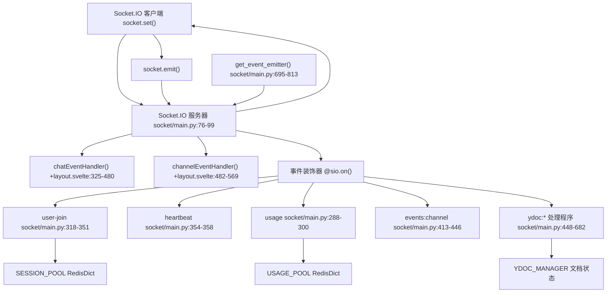
**来源：** [backend/open\_webui/socket/main.py1-839](https://github.com/open-webui/open-webui/blob/a7271532/backend/open_webui/socket/main.py#L1-L839) [src/routes/+layout.svelte97-177](https://github.com/open-webui/open-webui/blob/a7271532/src/routes/+layout.svelte#L97-L177) [src/routes/+layout.svelte325-569](https://github.com/open-webui/open-webui/blob/a7271532/src/routes/+layout.svelte#L325-L569)

### 基于 Redis 的状态管理

该系统使用 Redis 数据结构在多个服务器实例之间实现分布式状态管理：

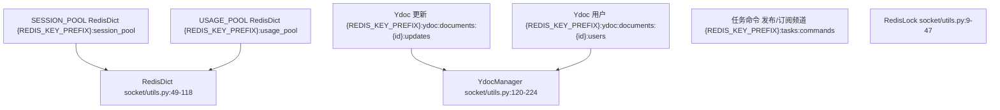
**来源：** [backend/open\_webui/socket/main.py107-165](https://github.com/open-webui/open-webui/blob/a7271532/backend/open_webui/socket/main.py#L107-L165) [backend/open\_webui/socket/utils.py9-224](https://github.com/open-webui/open-webui/blob/a7271532/backend/open_webui/socket/utils.py#L9-L224)

## 事件分类

### 聊天事件 (Chat Events)

聊天事件在 `events` 频道上发射，处理聊天补全流式传输、状态更新和任务执行：

| 事件类型 | 方向 | 处理程序 | 用途 |
| --- | --- | --- | --- |
| `events` | 服务器 → 客户端 | `chatEventHandler()` | 通用聊天事件交付 |
| `chat:completion` | 服务器 → 客户端 | Lines 343-377 | 带有完成标志的流式聊天响应 |
| `chat:title` | 服务器 → 客户端 | Lines 378-380 | 标题生成通知 |
| `chat:tags` | 服务器 → 客户端 | Lines 381-383 | 标签更新通知 |
| `execute:python` | 服务器 → 客户端 (RPC) | Lines 385-387 | 在 Pyodide 中执行 Python 代码 |
| `execute:tool` | 服务器 → 客户端 (RPC) | Lines 388-390 | 工具执行请求 |
| `request:chat:completion` | 服务器 → 客户端 (RPC) | Lines 391-475 | 直接连接聊天补全 |

**`chat:completion` 的事件数据结构：**

```json
{
  "chat_id": "string",
  "message_id": "string",
  "data": {
    "type": "chat:completion",
    "data": {
      "done": "boolean",
      "content": "string",
      "title": "string (可选)"
    }
  }
}
```
**来源：** [src/routes/+layout.svelte325-480](https://github.com/open-webui/open-webui/blob/a7271532/src/routes/+layout.svelte#L325-L480) [backend/open\_webui/socket/main.py695-813](https://github.com/open-webui/open-webui/blob/a7271532/backend/open_webui/socket/main.py#L695-L813)

### 频道事件 (Channel Events)

频道事件管理频道（群聊和私聊）中的实时通信：

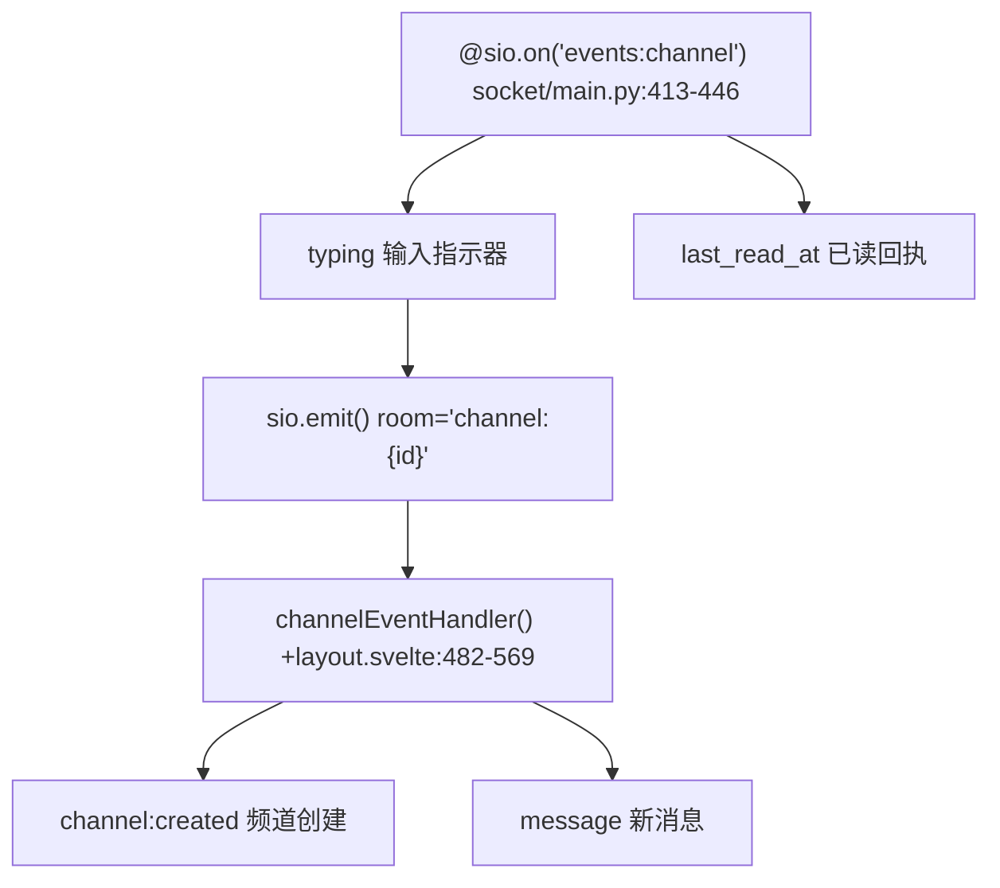
**来源：** [src/routes/+layout.svelte482-569](https://github.com/open-webui/open-webui/blob/a7271532/src/routes/+layout.svelte#L482-L569) [backend/open\_webui/socket/main.py413-446](https://github.com/open-webui/open-webui/blob/a7271532/backend/open_webui/socket/main.py#L413-L446)

### 协作式文档事件 (Ydoc)

基于 Yjs 的协作编辑事件使用 CRDT 方法进行实时文档同步：

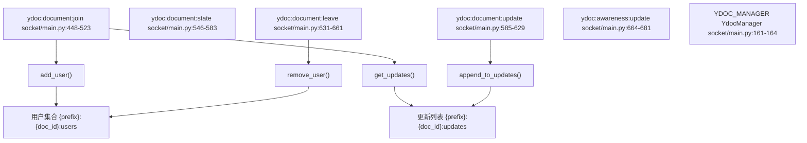
**来源：** [backend/open\_webui/socket/main.py448-682](https://github.com/open-webui/open-webui/blob/a7271532/backend/open_webui/socket/main.py#L448-L682) [backend/open\_webui/socket/utils.py120-224](https://github.com/open-webui/open-webui/blob/a7271532/backend/open_webui/socket/utils.py#L120-L224)

### 系统事件 (System Events)

系统级事件管理连接、身份验证和使用情况跟踪：

| 事件 | 处理程序 | 用途 | 会话数据 |
| --- | --- | --- | --- |
| `connect` | Lines 302-316 | 带有 JWT 认证的初始连接 | 添加到 SESSION\_POOL |
| `user-join` | Lines 318-351 | 用户身份验证和房间加入 | 加入 user:{id} 和频道房间 |
| `heartbeat` | Lines 354-358 | 保活和活动跟踪 | 更新 last\_active 时间戳 |
| `usage` | Lines 288-300 | 模型使用情况跟踪 | 更新 USAGE\_POOL\[model\_id\]\[sid\] |
| `disconnect` | Lines 684-692 | 断开连接时的清理 | 从 SESSION\_POOL 和 Ydoc 中移除 |

**来源：** [backend/open\_webui/socket/main.py288-358](https://github.com/open-webui/open-webui/blob/a7271532/backend/open_webui/socket/main.py#L288-L358) [backend/open\_webui/socket/main.py684-692](https://github.com/open-webui/open-webui/blob/a7271532/backend/open_webui/socket/main.py#L684-L692)

## 前端事件处理

### Socket.IO 客户端设置

前端在应用程序初始化期间建立 WebSocket 连接：

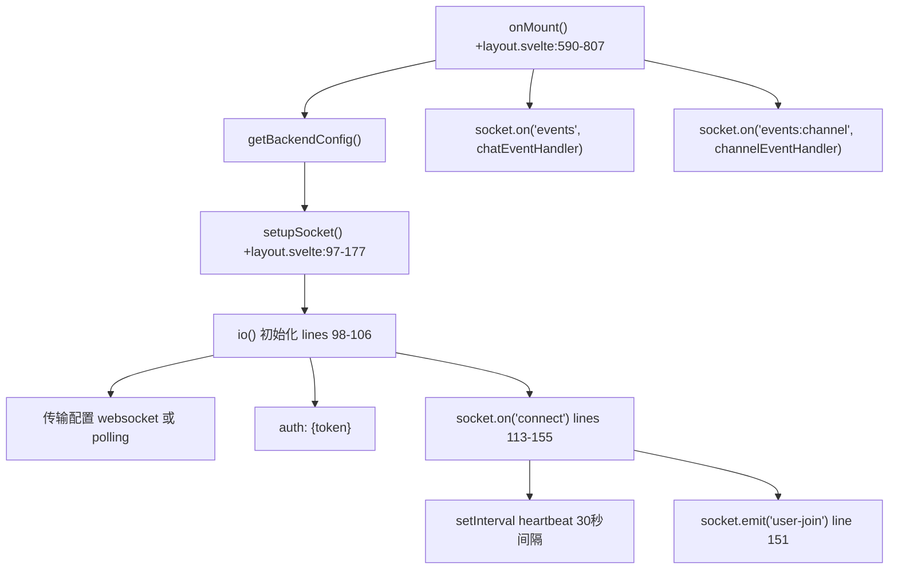
**来源：** [src/routes/+layout.svelte97-177](https://github.com/open-webui/open-webui/blob/a7271532/src/routes/+layout.svelte#L97-L177) [src/routes/+layout.svelte590-807](https://github.com/open-webui/open-webui/blob/a7271532/src/routes/+layout.svelte#L590-L807) [src/routes/+layout.svelte683-708](https://github.com/open-webui/open-webui/blob/a7271532/src/routes/+layout.svelte#L683-L708)

### 聊天事件处理程序

`chatEventHandler` 处理来自服务器的事件并执行相应的操作：

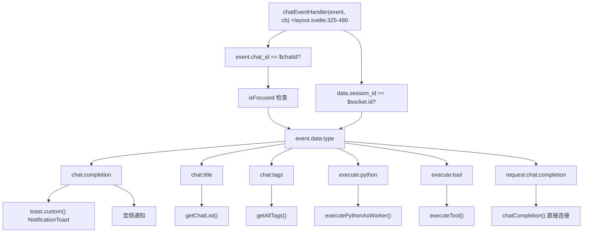
**处理的关键事件类型：**

-   **`chat:completion`**：当聊天响应完成时显示通知并播放声音。
-   **`chat:title`**：标题生成后刷新聊天列表。
-   **`chat:tags`**：更新全局标签 store。
-   **`execute:python`**：在 Pyodide worker 中执行 Python 代码并调用回调。
-   **`execute:tool`**：执行带有身份验证的工具服务器操作。
-   **`request:chat:completion`**：为具有直接 API 访问权限的模型处理直接连接的聊天补全。

**来源：** [src/routes/+layout.svelte325-480](https://github.com/open-webui/open-webui/blob/a7271532/src/routes/+layout.svelte#L325-L480)

### 频道事件处理程序

`channelEventHandler` 处理与频道相关的事件并更新 UI 状态：

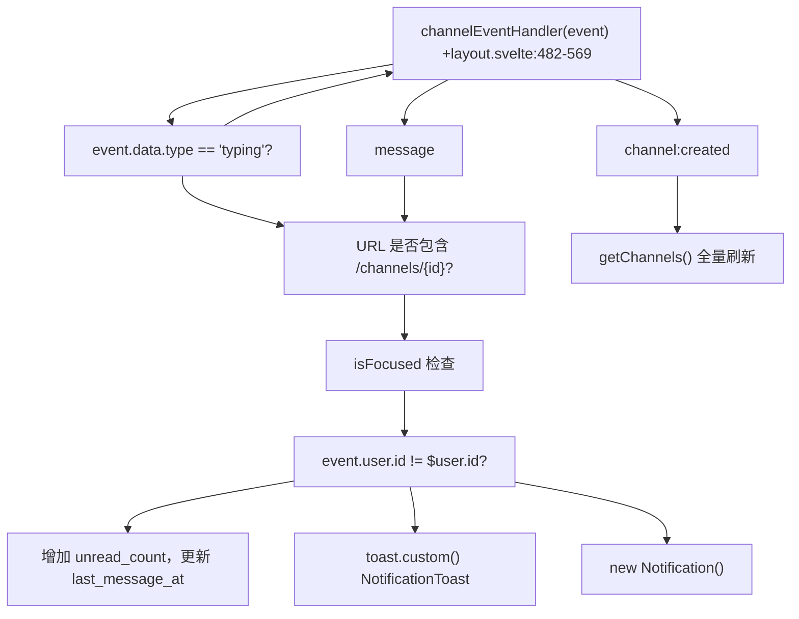
**来源：** [src/routes/+layout.svelte482-569](https://github.com/open-webui/open-webui/blob/a7271532/src/routes/+layout.svelte#L482-L569)

## 后端事件处理程序

### 事件注册模式

后端处理程序使用 `@sio.on()` 装饰器注册事件监听器：

```python
@sio.on("event-name")
async def event_handler(sid, data):
    # sid: 客户端的会话 ID
    # data: 事件负载
    pass
```
### 会话与房间管理

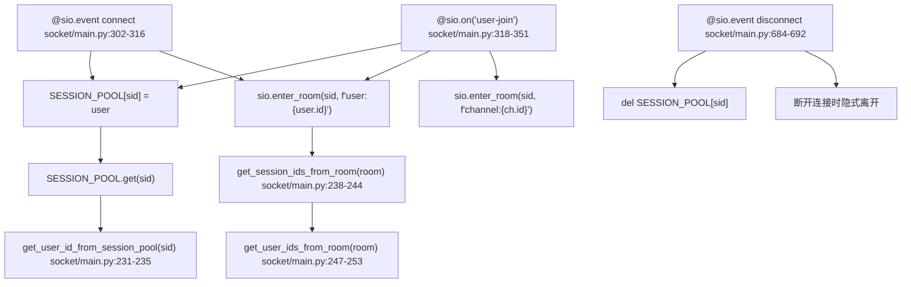
**来源：** [backend/open\_webui/socket/main.py231-253](https://github.com/open-webui/open-webui/blob/a7271532/backend/open_webui/socket/main.py#L231-L253) [backend/open\_webui/socket/main.py302-351](https://github.com/open-webui/open-webui/blob/a7271532/backend/open_webui/socket/main.py#L302-L351) [backend/open\_webui/socket/main.py684-692](https://github.com/open-webui/open-webui/blob/a7271532/backend/open_webui/socket/main.py#L684-L692)

### 使用情况跟踪

模型使用情况会被实时跟踪并自动清理：

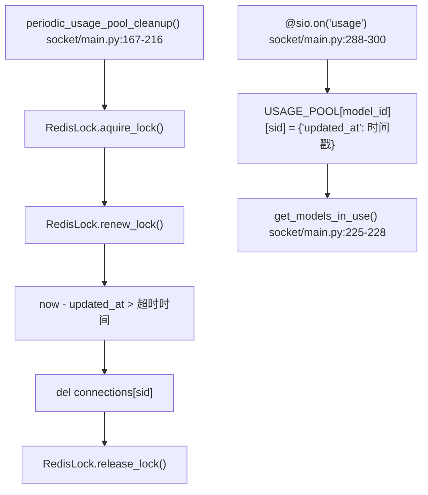
**来源：** [backend/open\_webui/socket/main.py167-228](https://github.com/open-webui/open-webui/blob/a7271532/backend/open_webui/socket/main.py#L167-L228) [backend/open\_webui/socket/main.py288-300](https://github.com/open-webui/open-webui/blob/a7271532/backend/open_webui/socket/main.py#L288-L300)

## 事件发射模式

### 事件发射器 (Event Emitter) 模式

`get_event_emitter` 函数创建了一个异步回调，用于从后端向前端流式传输响应：

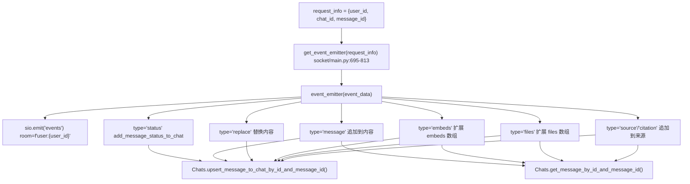
**事件数据结构：**

```json
{
    "chat_id": "str",
    "message_id": "str",
    "data": {
        "type": "str",  // "status", "message", "replace", "embeds", "files", "source", "citation"
        "data": "dict"  // 特定于类型的负载
    }
}
```
**来源：** [backend/open\_webui/socket/main.py695-813](https://github.com/open-webui/open-webui/blob/a7271532/backend/open_webui/socket/main.py#L695-L813)

### 事件调用者 (Event Caller) 模式

`get_event_call` 函数实现了基于 Socket.IO 的请求-响应式 RPC：

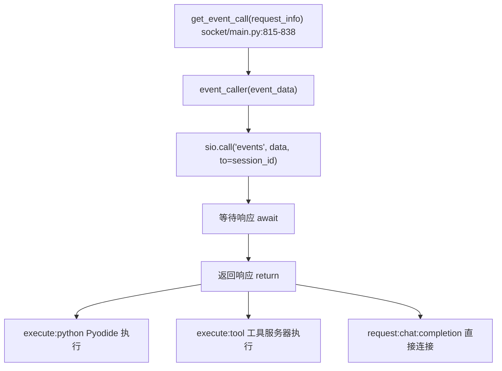
**来源：** [backend/open\_webui/socket/main.py815-838](https://github.com/open-webui/open-webui/blob/a7271532/backend/open_webui/socket/main.py#L815-L838)

### 基于房间的广播

事件可以广播到特定的房间（用户或频道）：

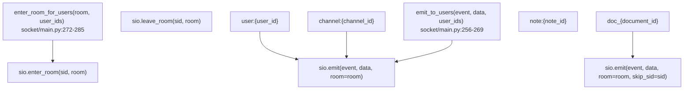
**来源：** [backend/open\_webui/socket/main.py256-285](https://github.com/open-webui/open-webui/blob/a7271532/backend/open_webui/socket/main.py#L256-L285)

## 分布式状态管理

### RedisDict 实现

`RedisDict` 类提供了一个由 Redis 哈希 (hashes) 支持的类字典接口：

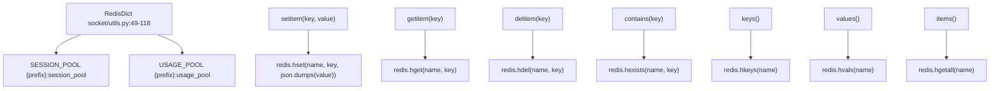
**来源：** [backend/open\_webui/socket/utils.py49-118](https://github.com/open-webui/open-webui/blob/a7271532/backend/open_webui/socket/utils.py#L49-L118) [backend/open\_webui/socket/main.py122-140](https://github.com/open-webui/open-webui/blob/a7271532/backend/open_webui/socket/main.py#L122-L140)

### 用于分布式协调的 RedisLock

`RedisLock` 类确保只有一个实例执行定期清理任务：

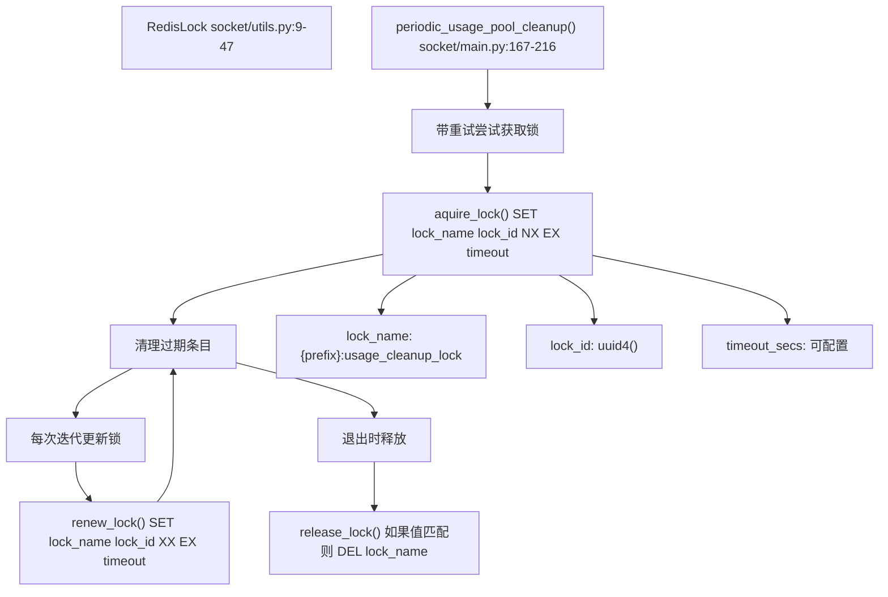
**来源：** [backend/open\_webui/socket/utils.py9-47](https://github.com/open-webui/open-webui/blob/a7271532/backend/open_webui/socket/utils.py#L9-L47) [backend/open\_webui/socket/main.py142-216](https://github.com/open-webui/open-webui/blob/a7271532/backend/open_webui/socket/main.py#L142-L216)

## 事件类型参考

### 完整的事件类型列表

| 事件名称 | 方向 | 载荷 | 处理程序位置 |
| --- | --- | --- | --- |
| `connect` | 客户端 → 服务器 | `{auth: {token}}` | [backend/open\_webui/socket/main.py302-316](https://github.com/open-webui/open-webui/blob/a7271532/backend/open_webui/socket/main.py#L302-L316) |
| `disconnect` | 客户端 → 服务器 | \- | [backend/open\_webui/socket/main.py684-692](https://github.com/open-webui/open-webui/blob/a7271532/backend/open_webui/socket/main.py#L684-L692) |
| `user-join` | 客户端 → 服务器 | `{auth: {token}}` | [backend/open\_webui/socket/main.py318-351](https://github.com/open-webui/open-webui/blob/a7271532/backend/open_webui/socket/main.py#L318-L351) |
| `heartbeat` | 客户端 → 服务器 | `{}` | [backend/open\_webui/socket/main.py354-358](https://github.com/open-webui/open-webui/blob/a7271532/backend/open_webui/socket/main.py#L354-L358) |
| `usage` | 客户端 → 服务器 | `{model: string}` | [backend/open\_webui/socket/main.py288-300](https://github.com/open-webui/open-webui/blob/a7271532/backend/open_webui/socket/main.py#L288-L300) |
| `events` | 服务器 → 客户端 | `{chat_id, message_id, data}` | [src/routes/+layout.svelte325-480](https://github.com/open-webui/open-webui/blob/a7271532/src/routes/+layout.svelte#L325-L480) |
| `events:channel` | 双向 | `{channel_id, data}` | [backend/open\_webui/socket/main.py413-446](https://github.com/open-webui/open-webui/blob/a7271532/backend/open_webui/socket/main.py#L413-L446) |
| `join-channels` | 客户端 → 服务器 | `{auth: {token}}` | [backend/open\_webui/socket/main.py361-379](https://github.com/open-webui/open-webui/blob/a7271532/backend/open_webui/socket/main.py#L361-L379) |
| `join-note` | 客户端 → 服务器 | `{auth, note_id}` | [backend/open\_webui/socket/main.py382-410](https://github.com/open-webui/open-webui/blob/a7271532/backend/open_webui/socket/main.py#L382-L410) |
| `ydoc:document:join` | 客户端 → 服务器 | `{document_id, user_id, user_name, user_color}` | [backend/open\_webui/socket/main.py448-523](https://github.com/open-webui/open-webui/blob/a7271532/backend/open_webui/socket/main.py#L448-L523) |
| `ydoc:document:state` | 双向 | `{document_id, state, sessions}` | [backend/open\_webui/socket/main.py546-583](https://github.com/open-webui/open-webui/blob/a7271532/backend/open_webui/socket/main.py#L546-L583) |
| `ydoc:document:update` | 客户端 → 服务器 | `{document_id, user_id, update, data}` | [backend/open\_webui/socket/main.py585-629](https://github.com/open-webui/open-webui/blob/a7271532/backend/open_webui/socket/main.py#L585-L629) |
| `ydoc:document:leave` | 客户端 → 服务器 | `{document_id, user_id}` | [backend/open\_webui/socket/main.py631-661](https://github.com/open-webui/open-webui/blob/a7271532/backend/open_webui/socket/main.py#L631-L661) |
| `ydoc:awareness:update` | 客户端 → 服务器 | `{document_id, user_id, update}` | [backend/open\_webui/socket/main.py664-681](https://github.com/open-webui/open-webui/blob/a7271532/backend/open_webui/socket/main.py#L664-L681) |
| `ydoc:user:joined` | 服务器 → 客户端 | `{document_id, user_id, user_name, user_color}` | [backend/open\_webui/socket/main.py506-516](https://github.com/open-webui/open-webui/blob/a7271532/backend/open_webui/socket/main.py#L506-L516) |
| `ydoc:user:left` | 服务器 → 客户端 | `{document_id, user_id}` | [backend/open\_webui/socket/main.py647-651](https://github.com/open-webui/open-webui/blob/a7271532/backend/open_webui/socket/main.py#L647-L651) |

**来源：** [backend/open\_webui/socket/main.py288-692](https://github.com/open-webui/open-webui/blob/a7271532/backend/open_webui/socket/main.py#L288-L692) [src/routes/+layout.svelte325-569](https://github.com/open-webui/open-webui/blob/a7271532/src/routes/+layout.svelte#L325-L569)

### 聊天事件数据类型

`events` 频道根据 `type` 字段携带多种数据类型：

```javascript
// 状态更新
{
  type: "status",
  data: {
    description: string,
    done: boolean
  }
}

// 增量消息内容
{
  type: "message",
  data: {
    content: string  // 追加到现有内容
  }
}

// 替换全部内容
{
  type: "replace",
  data: {
    content: string  // 替换现有内容
  }
}

// 添加嵌入项 (embeds)
{
  type: "embeds",
  data: {
    embeds: Array<any>  // 扩展现有 embeds
  }
}

// 添加文件
{
  type: "files",
  data: {
    files: Array<any>  // 扩展现有文件
  }
}

// 添加来源/引用
{
  type: "source" | "citation",
  data: {
    // 来源元数据
  }
}
```
**来源：** [backend/open\_webui/socket/main.py716-803](https://github.com/open-webui/open-webui/blob/a7271532/backend/open_webui/socket/main.py#L716-L803)

## 配置与部署

### Socket.IO 服务器配置

```python
# 后端 Socket.IO 设置
sio = socketio.AsyncServer(
    cors_allowed_origins=SOCKETIO_CORS_ORIGINS,
    async_mode="asgi",
    transports=["websocket"] if ENABLE_WEBSOCKET_SUPPORT else ["polling"],
    allow_upgrades=ENABLE_WEBSOCKET_SUPPORT,
    always_connect=True,
    client_manager=mgr,  # 如果启用了 Redis，则使用 Redis 管理器
    logger=WEBSOCKET_SERVER_LOGGING,
    ping_interval=WEBSOCKET_SERVER_PING_INTERVAL,
    ping_timeout=WEBSOCKET_SERVER_PING_TIMEOUT,
    engineio_logger=WEBSOCKET_SERVER_ENGINEIO_LOGGING,
)
```
**关键配置选项：**

-   **WEBSOCKET\_MANAGER**：分布式部署时设置为 `"redis"`。
-   **ENABLE\_WEBSOCKET\_SUPPORT**：启用 WebSocket 传输（默认：true）。
-   **WEBSOCKET\_SERVER\_PING\_INTERVAL**：心跳间隔（默认：25秒）。
-   **WEBSOCKET\_SERVER\_PING\_TIMEOUT**：ping 响应超时时间（默认：60秒）。
-   **WEBSOCKET\_REDIS\_URL**：用于分布式状态的 Redis 连接 URL。
-   **WEBSOCKET\_SENTINEL\_HOSTS**：用于高可用部署的 Redis Sentinel 主机。
-   **WEBSOCKET\_REDIS\_CLUSTER**：启用 Redis 集群模式。

**来源：** [backend/open\_webui/socket/main.py64-99](https://github.com/open-webui/open-webui/blob/a7271532/backend/open_webui/socket/main.py#L64-L99) [backend/open\_webui/env.py](https://github.com/open-webui/open-webui/blob/a7271532/backend/open_webui/env.py)

### 前端 Socket 配置

```javascript
// 前端 Socket.IO 设置
const _socket = io(`${WEBUI_BASE_URL}` || undefined, {
    reconnection: true,
    reconnectionDelay: 1000,
    reconnectionDelayMax: 5000,
    randomizationFactor: 0.5,
    path: '/ws/socket.io',
    transports: enableWebsocket ? ['websocket'] : ['polling', 'websocket'],
    auth: { token: localStorage.token }
});
```
**来源：** [src/routes/+layout.svelte98-106](https://github.com/open-webui/open-webui/blob/a7271532/src/routes/+layout.svelte#L98-L106)
