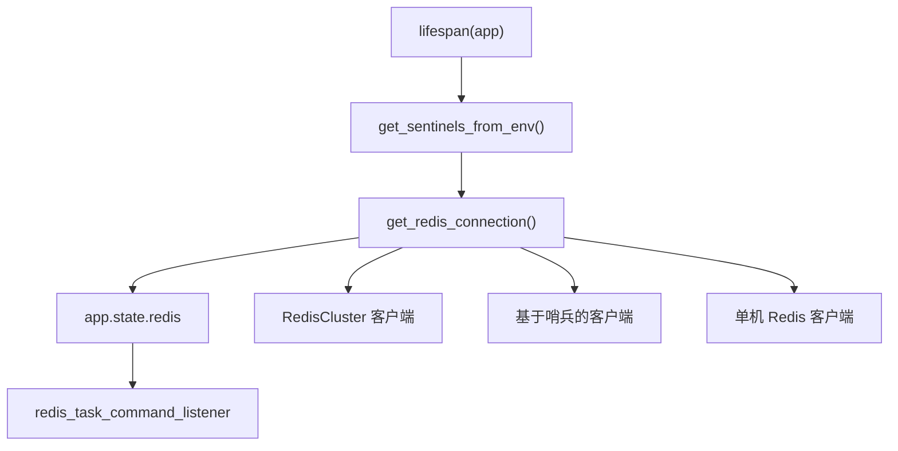
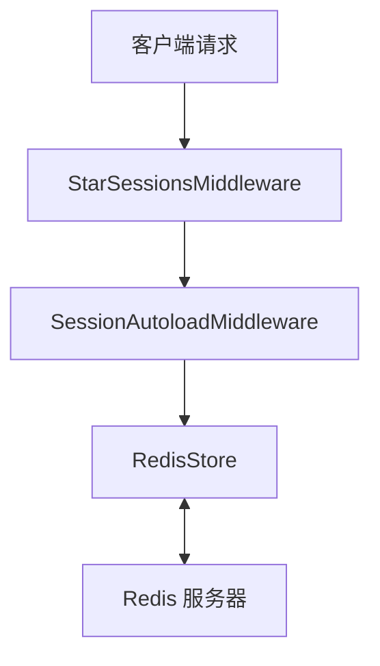
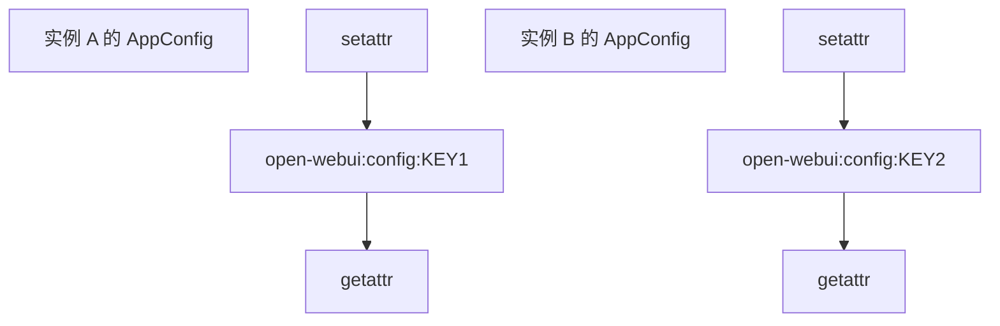
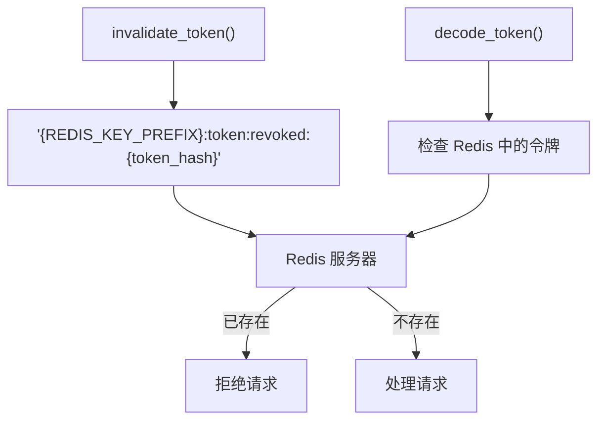
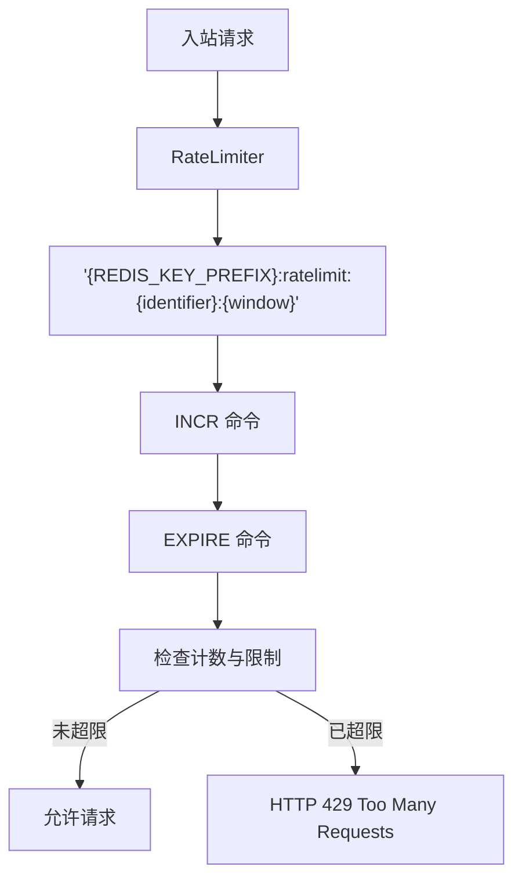
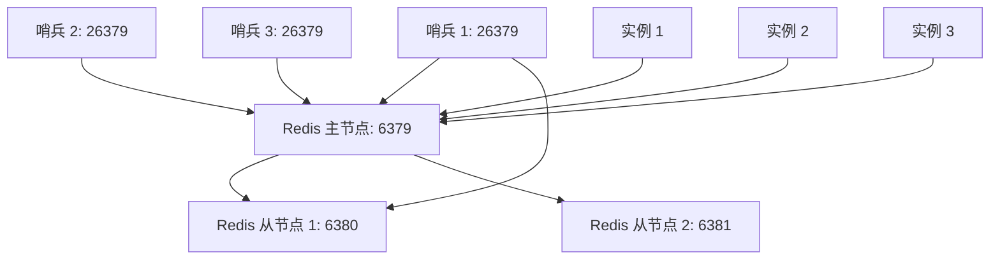

# 分布式部署中的 Redis 集成

相关源文件

-   [backend/open\_webui/config.py](https://github.com/open-webui/open-webui/blob/a7271532/backend/open_webui/config.py)
-   [backend/open\_webui/env.py](https://github.com/open-webui/open-webui/blob/a7271532/backend/open_webui/env.py)
-   [backend/open\_webui/main.py](https://github.com/open-webui/open-webui/blob/a7271532/backend/open_webui/main.py)
-   [backend/open\_webui/retrieval/loaders/datalab\_marker.py](https://github.com/open-webui/open-webui/blob/a7271532/backend/open_webui/retrieval/loaders/datalab_marker.py)
-   [backend/open\_webui/retrieval/loaders/external\_document.py](https://github.com/open-webui/open-webui/blob/a7271532/backend/open_webui/retrieval/loaders/external_document.py)
-   [backend/open\_webui/retrieval/loaders/external\_web.py](https://github.com/open-webui/open-webui/blob/a7271532/backend/open_webui/retrieval/loaders/external_web.py)
-   [backend/open\_webui/retrieval/loaders/main.py](https://github.com/open-webui/open-webui/blob/a7271532/backend/open_webui/retrieval/loaders/main.py)
-   [backend/open\_webui/retrieval/loaders/mineru.py](https://github.com/open-webui/open-webui/blob/a7271532/backend/open_webui/retrieval/loaders/mineru.py)
-   [backend/open\_webui/retrieval/loaders/mistral.py](https://github.com/open-webui/open-webui/blob/a7271532/backend/open_webui/retrieval/loaders/mistral.py)
-   [backend/open\_webui/retrieval/utils.py](https://github.com/open-webui/open-webui/blob/a7271532/backend/open_webui/retrieval/utils.py)
-   [backend/open\_webui/routers/audio.py](https://github.com/open-webui/open-webui/blob/a7271532/backend/open_webui/routers/audio.py)
-   [backend/open\_webui/routers/auths.py](https://github.com/open-webui/open-webui/blob/a7271532/backend/open_webui/routers/auths.py)
-   [backend/open\_webui/routers/ollama.py](https://github.com/open-webui/open-webui/blob/a7271532/backend/open_webui/routers/ollama.py)
-   [backend/open\_webui/routers/openai.py](https://github.com/open-webui/open-webui/blob/a7271532/backend/open_webui/routers/openai.py)
-   [backend/open\_webui/routers/retrieval.py](https://github.com/open-webui/open-webui/blob/a7271532/backend/open_webui/routers/retrieval.py)
-   [backend/open\_webui/utils/auth.py](https://github.com/open-webui/open-webui/blob/a7271532/backend/open_webui/utils/auth.py)
-   [backend/open\_webui/utils/embeddings.py](https://github.com/open-webui/open-webui/blob/a7271532/backend/open_webui/utils/embeddings.py)
-   [backend/open\_webui/utils/middleware.py](https://github.com/open-webui/open-webui/blob/a7271532/backend/open_webui/utils/middleware.py)
-   [backend/open\_webui/utils/misc.py](https://github.com/open-webui/open-webui/blob/a7271532/backend/open_webui/utils/misc.py)
-   [backend/open\_webui/utils/oauth.py](https://github.com/open-webui/open-webui/blob/a7271532/backend/open_webui/utils/oauth.py)
-   [backend/open\_webui/utils/response.py](https://github.com/open-webui/open-webui/blob/a7271532/backend/open_webui/utils/response.py)
-   [src/lib/apis/retrieval/index.ts](https://github.com/open-webui/open-webui/blob/a7271532/src/lib/apis/retrieval/index.ts)
-   [src/lib/components/admin/Settings/Documents.svelte](https://github.com/open-webui/open-webui/blob/a7271532/src/lib/components/admin/Settings/Documents.svelte)
-   [src/lib/components/admin/Settings/WebSearch.svelte](https://github.com/open-webui/open-webui/blob/a7271532/src/lib/components/admin/Settings/WebSearch.svelte)

Open WebUI 中的 Redis 集成通过在多个应用实例之间提供共享状态管理，实现了水平扩展和分布式部署。本页面涵盖了 Redis 配置、连接管理，以及它在会话存储、配置同步、令牌管理和速率限制中的作用。

有关使用 Redis 发布/订阅 (pubsub) 进行 WebSocket 事件分发的信息，请参阅 [事件处理系统](/open-webui/open-webui/16.2-event-handling-system)。有关通用 WebSocket 架构，请参阅 [WebSocket 架构](/open-webui/open-webui/16.1-websocket-architecture)。

---

## 目的与范围

Redis 在分布式 Open WebUI 部署中承担四个主要功能：

1.  **会话存储** - 通过 `RedisStore` 在各实例间共享持久化会话。
2.  **配置同步** - 将实时配置更新传播到所有实例。
3.  **令牌撤销** - 用于存储失效 JWT 令牌的分布式黑名单。
4.  **速率限制** - 共享速率限制计数器，防止通过切换实例来绕过限制。

对于单实例部署，Redis 是 **可选的**，但对于使用多个 uvicorn worker 或容器化副本的水平扩展，Redis 是 **必需的**。

**来源：** [backend/open\_webui/main.py1-100](https://github.com/open-webui/open-webui/blob/a7271532/backend/open_webui/main.py#L1-L100) [backend/open\_webui/config.py224-284](https://github.com/open-webui/open-webui/blob/a7271532/backend/open_webui/config.py#L224-L284)

---

## Redis 连接初始化

### 环境配置

Redis 连接参数通过环境变量进行配置：

| 变量名 | 用途 | 默认值 |
| --- | --- | --- |
| `REDIS_URL` | 连接字符串 (例如 `redis://localhost:6379/0`) | `""` (禁用) |
| `REDIS_CLUSTER` | 启用 Redis 集群 (Cluster) 模式 | `False` |
| `REDIS_KEY_PREFIX` | 所有键的命名空间前缀 | `"open-webui"` |
| `REDIS_SENTINEL_HOSTS` | 以逗号分隔的哨兵 (Sentinel) 主机列表 | `""` |
| `REDIS_SENTINEL_PORT` | 哨兵端口 | `26379` |
| `REDIS_SENTINEL_MAX_RETRY_COUNT` | 哨兵故障转移的最大重试次数 | `2` |
| `REDIS_SOCKET_CONNECT_TIMEOUT` | 连接超时时间（秒） | `None` |

**来源：** [backend/open\_webui/env.py360-383](https://github.com/open-webui/open-webui/blob/a7271532/backend/open_webui/env.py#L360-L383)

### 应用生命周期中的连接设置


**Redis 连接初始化流程**

Redis 连接在应用启动期间由生命周期 (lifespan) 上下文管理器建立：

```python
# main.py:586-598
app.state.redis = get_redis_connection(
    redis_url=REDIS_URL,
    redis_sentinels=get_sentinels_from_env(
        REDIS_SENTINEL_HOSTS, REDIS_SENTINEL_PORT
    ),
    redis_cluster=REDIS_CLUSTER,
    async_mode=True,
)

if app.state.redis is not None:
    app.state.redis_task_command_listener = asyncio.create_task(
        redis_task_command_listener(app)
    )
```
`get_redis_connection()` 函数（来自 `open_webui.utils.redis`）根据配置返回三种客户端类型之一：

1.  **RedisCluster** - 用于带有分片的 Redis 集群部署。
2.  **基于哨兵的 (Sentinel-backed)** - 用于高可用的主从 (master/replica) 设置。
3.  **单机 (Standalone)** - 直接连接到单个 Redis 实例。

**来源：** [backend/open\_webui/main.py586-598](https://github.com/open-webui/open-webui/blob/a7271532/backend/open_webui/main.py#L586-L598) [backend/open\_webui/env.py360-383](https://github.com/open-webui/open-webui/blob/a7271532/backend/open_webui/env.py#L360-L383)

---

## 带有 RedisStore 的会话中间件

### StarSessions 集成

Open WebUI 使用 `starsessions` 库，并配合 `RedisStore` 后端进行分布式会话管理：


**会话中间件架构**

会话中间件通过 `ENABLE_STAR_SESSIONS_MIDDLEWARE` 环境变量有条件地启用：

```python
# main.py:54-58 (导入)
from starsessions import (
    SessionMiddleware as StarSessionsMiddleware,
    SessionAutoloadMiddleware,
)
from starsessions.stores.redis import RedisStore
```
启用后，会话将存储在 Redis 中，其键名带有 `REDIS_KEY_PREFIX` 前缀（默认：`"open-webui"`）。这允许多个 Open WebUI 实例共享会话状态，从而实现：

-   **会话持久化**：即使实例重启，会话依然有效。
-   **负载均衡器兼容性**：无需启用粘性会话 (sticky sessions)。
-   **水平扩展**：在扩展过程中不会丢失会话。

会话存储与 OAuth 流程集成，在身份验证回调期间存储会话令牌。

**来源：** [backend/open\_webui/main.py54-58](https://github.com/open-webui/open-webui/blob/a7271532/backend/open_webui/main.py#L54-L58) [backend/open\_webui/env.py197-198](https://github.com/open-webui/open-webui/blob/a7271532/backend/open_webui/env.py#L197-L198)

---

## 通过 AppConfig 进行配置同步

### AppConfig Redis 缓存层

`AppConfig` 类实现了一个由 Redis 支持的缓存层，用于存储配置值，从而实现分布式实例间的实时同步：


**配置同步架构**

### 配置读取路径

在访问配置值时，`AppConfig.__getattr__` 首先会检查 Redis 是否有更新后的值：

```python
# config.py:262-283
def __getattr__(self, key):
    if key not in self._state:
        raise AttributeError(f"Config key '{key}' not found")

    # 如果 Redis 可用，检查更新后的值
    if self._redis:
        redis_key = f"{self._redis_key_prefix}:config:{key}"
        redis_value = self._redis.get(redis_key)

        if redis_value is not None:
            try:
                decoded_value = json.loads(redis_value)

                # 如果不同，则更新内存中的值
                if self._state[key].value != decoded_value:
                    self._state[key].value = decoded_value
                    log.info(f"Updated {key} from Redis: {decoded_value}")

            except json.JSONDecodeError:
                log.error(f"Invalid JSON format in Redis for {key}: {redis_value}")

    return self._state[key].value
```
这确保了实例始终读取最新的配置，即使配置是由另一个实例更新的。

### 配置写入路径

更新配置值时，`AppConfig.__setattr__` 会同时写入数据库和 Redis：

```python
# config.py:251-260
def __setattr__(self, key, value):
    if isinstance(value, PersistentConfig):
        self._state[key] = value
    else:
        self._state[key].value = value
        self._state[key].save()  # 持久化到数据库

        if self._redis:
            redis_key = f"{self._redis_key_prefix}:config:{key}"
            self._redis.set(redis_key, json.dumps(self._state[key].value))
```
这种双层方法（数据库 + Redis）提供了：

-   **数据库** - 持久化存储，在 Redis 重启后依然存在。
-   **Redis** - 快速的实例间同步，无需轮询数据库。

**来源：** [backend/open\_webui/config.py224-284](https://github.com/open-webui/open-webui/blob/a7271532/backend/open_webui/config.py#L224-L284)

---

## 令牌撤销黑名单

### 使用 Redis 进行 JWT 作废

身份验证系统使用 Redis 维护一个分布式黑名单，存储已撤销的 JWT 令牌：


**令牌撤销架构**

### 撤销数据存储

当令牌被作废（例如：修改密码、退出登录、管理员操作）时，它会被添加到 Redis 中，过期时间设置为与令牌的 TTL（存活时间）一致：

```python
# 概念实现 (来自 utils/auth.py)
def invalidate_token(token: str):
    """将令牌添加到 Redis 黑名单"""
    redis_client = get_redis_client()
    if redis_client:
        token_hash = hashlib.sha256(token.encode()).hexdigest()
        key = f"{REDIS_KEY_PREFIX}:token:revoked:{token_hash}"

        # 从 JWT 声明中获取令牌过期时间
        data = decode_token(token)
        ttl = data.get("exp") - int(time.time())

        if ttl > 0:
            redis_client.setex(key, ttl, "1")
```
### 撤销检查

`decode_token()` 函数在验证令牌之前会先检查 Redis：

```python
def decode_token(token: str):
    """解码 JWT 并检查撤销状态"""
    redis_client = get_redis_client()
    if redis_client:
        token_hash = hashlib.sha256(token.encode()).hexdigest()
        key = f"{REDIS_KEY_PREFIX}:token:revoked:{token_hash}"

        if redis_client.exists(key):
            raise HTTPException(
                status_code=401,
                detail="Token has been revoked"
            )

    # 继续进行标准的 JWT 验证
    return jwt.decode(token, WEBUI_SECRET_KEY, algorithms=[ALGORITHM])
```
如果没有 Redis，令牌撤销就无法实现 **分布式**——令牌在尚未处理撤销事件的实例上仍然有效。

**来源：** [backend/open\_webui/utils/auth.py1-100](https://github.com/open-webui/open-webui/blob/a7271532/backend/open_webui/utils/auth.py#L1-L100) [backend/open\_webui/env.py364](https://github.com/open-webui/open-webui/blob/a7271532/backend/open_webui/env.py#L364-L364)

---

## 带有 Redis 后端的速率限制

### RateLimiter 实现

`RateLimiter` 类使用 Redis 来执行分布式速率限制，防止用户通过在多个实例间分发请求来绕过限制：


**速率限制流程**

### 速率限制器用法示例

速率限制被应用于身份验证等敏感端点：

```python
# routers/auths.py:84-86
signin_rate_limiter = RateLimiter(
    redis_client=get_redis_client(),
    limit=5 * 3,  # 15 次尝试
    window=60 * 3  # 3 分钟
)
```
### 速率限制执行

速率限制器跟踪特定时间窗口内每个标识符（通常是 IP 地址或用户 ID）的请求计数：

```python
# RateLimiter 概念实现
class RateLimiter:
    def __init__(self, redis_client, limit: int, window: int):
        self.redis = redis_client
        self.limit = limit
        self.window = window

    async def check_rate_limit(self, identifier: str):
        """检查请求是否超过速率限制"""
        if not self.redis:
            return  # 没有 Redis 时禁用速率限制

        current_window = int(time.time()) // self.window
        key = f"{REDIS_KEY_PREFIX}:ratelimit:{identifier}:{current_window}"

        count = self.redis.incr(key)
        if count == 1:
            self.redis.expire(key, self.window)

        if count > self.limit:
            raise HTTPException(
                status_code=429,
                detail="Rate limit exceeded"
            )
```
滑动窗口方法（使用 `current_window = timestamp // window`）确保了在每个时间窗口内执行速率限制，并通过 Redis TTL 进行自动清理。

**来源：** [backend/open\_webui/routers/auths.py69-86](https://github.com/open-webui/open-webui/blob/a7271532/backend/open_webui/routers/auths.py#L69-L86) [backend/open\_webui/utils/auth.py1-50](https://github.com/open-webui/open-webui/blob/a7271532/backend/open_webui/utils/auth.py#L1-L50)

---

## 部署模式

### Redis Sentinel 用于高可用性

Redis Sentinel 在主从配置中提供自动故障转移：


**基于哨兵的高可用架构**

### 哨兵配置

通过提供哨兵主机列表来启用哨兵模式：

```text
# 环境变量
REDIS_URL=""  # 使用哨兵时保持为空
REDIS_SENTINEL_HOSTS="sentinel1.example.com,sentinel2.example.com,sentinel3.example.com"
REDIS_SENTINEL_PORT="26379"
REDIS_SENTINEL_MAX_RETRY_COUNT="2"
```
`get_sentinels_from_env()` 函数解析以逗号分隔的主机列表并创建哨兵连接元组。Redis 客户端会自动发现当前的主节点并在故障转移时重新连接。

**来源：** [backend/open\_webui/env.py366-376](https://github.com/open-webui/open-webui/blob/a7271532/backend/open_webui/env.py#L366-L376) [backend/open\_webui/main.py588-590](https://github.com/open-webui/open-webui/blob/a7271532/backend/open_webui/main.py#L588-L590)

### Redis 集群用于水平扩展

Redis 集群模式实现了跨多个 Redis 节点的数据分片：

```text
# 环境变量
REDIS_URL="redis://cluster-node1:6379,cluster-node2:6379,cluster-node3:6379"
REDIS_CLUSTER="true"
REDIS_KEY_PREFIX="open-webui"
```
当 `REDIS_CLUSTER=true` 时，连接工厂返回 `redis.cluster.RedisCluster` 客户端，而不是标准的 `redis.Redis` 客户端。所有 Redis 命令都会根据键的哈希值自动路由到相应的集群节点。

### 单机 Redis

用于开发环境或单实例部署：

```text
REDIS_URL="redis://localhost:6379/0"
REDIS_KEY_PREFIX="open-webui"
```
**来源：** [backend/open\_webui/env.py361-362](https://github.com/open-webui/open-webui/blob/a7271532/backend/open_webui/env.py#L361-L362)

---

## 键命名空间策略

所有 Redis 键均使用可配置的前缀，以支持共享单个 Redis 实例的多个 Open WebUI 部署：

| 键模式 | 用途 | 示例 |
| --- | --- | --- |
| `{prefix}:config:{key}` | 配置值 | `open-webui:config:OLLAMA_BASE_URL` |
| `{prefix}:token:revoked:{hash}` | 已撤销的 JWT 令牌 | `open-webui:token:revoked:abc123...` |
| `{prefix}:ratelimit:{id}:{window}` | 速率限制计数器 | `open-webui:ratelimit:192.168.1.1:1234567890` |
| `{prefix}:session:{sid}` | 会话数据 (StarSessions) | `open-webui:session:sess_xyz...` |
| `{prefix}:task:command:{id}` | 任务命令 (后台作业) | `open-webui:task:command:task_001` |

前缀通过 `REDIS_KEY_PREFIX` 环境变量设置（默认：`"open-webui"`）。若要隔离多个环境：

```text
# 生产环境 (Production)
REDIS_KEY_PREFIX="owui-prod"

# 测试环境 (Staging)
REDIS_KEY_PREFIX="owui-staging"

# 开发环境 (Development)
REDIS_KEY_PREFIX="owui-dev"
```
**来源：** [backend/open\_webui/env.py364](https://github.com/open-webui/open-webui/blob/a7271532/backend/open_webui/env.py#L364-L364) [backend/open\_webui/config.py259-260](https://github.com/open-webui/open-webui/blob/a7271532/backend/open_webui/config.py#L259-L260)

---

## 缺少 Redis 时的行为

当 Redis 不可用时，Open WebUI 会优雅降级：

| 功能 | 无 Redis 时的行为 |
| --- | --- |
| **会话** | 内存会话 (重启后丢失，且无法在实例间共享) |
| **配置** | 仅限数据库 (没有实时同步，需要重启应用来应用更改) |
| **令牌撤销** | 仅限本地黑名单 (令牌在其它实例上仍然有效) |
| **速率限制** | 各实例独立限制 (用户可通过切换实例来绕过限制) |
| **后台任务** | 仅限本地的任务协调 |

对于 **单实例部署**，Redis 是可选的。对于 **多实例/Kubernetes 部署**，Redis 是实现正确分布式行为的 **实际必需项**。

**来源：** [backend/open\_webui/main.py586-598](https://github.com/open-webui/open-webui/blob/a7271532/backend/open_webui/main.py#L586-L598) [backend/open\_webui/config.py224-284](https://github.com/open-webui/open-webui/blob/a7271532/backend/open_webui/config.py#L224-L284)
